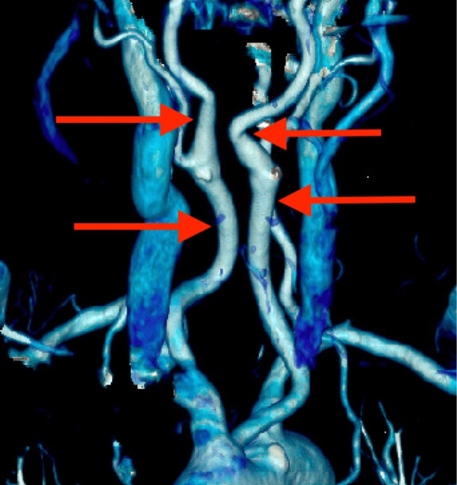

# Operative Approach: Anterior Cervical (Smith-Robinson) Approach

> **About the figures.** Copyrighted operative figures/videos are **linked** (Neurosurgical Atlas, AO Surgery Reference); embedded images are **public-domain** (Gray's Anatomy) or **CC‑BY** (open-access), credited beneath each image. See [media-sources.md](../../resources/media-sources.md) and [figures/CREDITS.md](../../figures/CREDITS.md).
>
> **Technique references:** [AO Surgery Reference — Anterior cervical approach](https://surgeryreference.aofoundation.org) · [Neurosurgical Atlas — Spine](https://www.neurosurgicalatlas.com) · [Radiopaedia — cervical spine](https://radiopaedia.org/search?q=cervical%20spondylosis&scope=all)

The anterior cervical (Smith-Robinson) approach is the **workhorse anterior corridor to C3–C7** (and, with effort, C2–T1). Through a transverse skin-crease incision it develops a natural plane **medial to the carotid sheath and lateral to the trachea/esophagus**, reaching the vertebral bodies and discs for **ACDF, corpectomy, arthroplasty, and anterior fusion.** It is fast, low-blood-loss, and well tolerated — but it threads between the **recurrent laryngeal nerve, esophagus, carotid, vertebral artery, and sympathetic chain**, so its safety is entirely about knowing those layers.

---

## Figures, Imaging & Video

**🎥 Operative video** — [search operative video on YouTube ▸](https://www.youtube.com/results?search_query=cervical+spondylosis+surgery) · [The Neurosurgical Atlas ▸](https://www.neurosurgicalatlas.com)

**📑 Key evidence — landmark trials & guidelines**

- **AOSpine CSM** — Fehlings MG et al. — guidelines & prospective outcomes for cervical spondylotic myelopathy. [🔗 PubMed](https://pubmed.ncbi.nlm.nih.gov/?term=Fehlings+AOSpine+cervical+spondylotic+myelopathy+guideline+outcomes)
- **Guidelines:** [CNS Guidelines](https://www.cns.org/guidelines) · [AANS](https://www.aans.org)
[AO Surgery Reference — anterior cervical](https://surgeryreference.aofoundation.org) · [Neurosurgical Atlas — Spine](https://www.neurosurgicalatlas.com) · [Radiopaedia — ACDF](https://radiopaedia.org/search?q=anterior%20cervical%20discectomy&scope=all) · [PubMed Central — Smith-Robinson](https://www.ncbi.nlm.nih.gov/pmc/?term=anterior+cervical+approach+smith+robinson)

*Gray's Anatomy (1918), public domain — via Wikimedia Commons.*

---

## General Considerations
- **What it accesses:** the anterior cervical vertebral bodies and discs **C3–C7** routinely; **C2–C3** and **C7–T1** are reachable with high (submandibular) or low (clavicular/manubrial) modifications and are harder.
- **The plane is anatomic, not cut:** the dissection follows the avascular interval **between the carotid sheath (retracted laterally) and the visceral column — trachea/esophagus (retracted medially)** down to the prevertebral fascia and longus colli. Almost no muscle is divided (only platysma).
- **Procedures built on it:** [ACDF](../spine-degenerative/acdf.md), [cervical arthroplasty](../spine-degenerative/cervical-disc-replacement.md), anterior cervical **corpectomy** ([subaxial fracture](../spine-trauma/subaxial-cervical-fracture.md) / [vertebral corpectomy](../spine-tumor/vertebral-corpectomy.md)), OPLL, infection/tumor debridement.
- **Side of approach:** **left vs right is debated.** A **left-sided** approach places the recurrent laryngeal nerve (RLN) more predictably in the tracheoesophageal groove (the **right RLN is more variable/lateral**); a right-sided approach suits a right-handed surgeon and is fine in most hands. **Re-operation:** operate from the **same side** as a prior anterior cervical procedure (after laryngoscopy confirms an intact contralateral cord) to avoid bilateral RLN injury.

### Indications
- Cervical **disc herniation / spondylotic radiculopathy or myelopathy**, **OPLL**, anterior column **trauma**, **tumor**, **infection** (discitis/osteomyelitis) requiring anterior decompression/reconstruction.

---

## Relevant Surgical Anatomy (layer by layer)
- **Skin → platysma → superficial cervical fascia.**
- **Sternocleidomastoid (SCM)** and the **carotid sheath** (common carotid, internal jugular vein, vagus nerve) lie **laterally** — retracted laterally; **omohyoid** crosses the field (can be divided/retracted).
- **Strap muscles (sternohyoid/sternothyroid), trachea, esophagus, thyroid** lie **medially** — retracted medially.
- **Recurrent laryngeal nerve (RLN):** ascends in the **tracheoesophageal groove**; the **right RLN** loops around the subclavian and is more lateral/variable.
- **Superior laryngeal nerve:** at risk in **high (C3–C4)** approaches near the superior thyroid vessels.
- **Sympathetic chain:** on the **anterolateral longus colli** — dissecting too far laterally or over-retracting longus colli causes **Horner syndrome.**
- **Vertebral artery:** lateral to the uncovertebral joints in the foramen transversarium — the **lateral limit** of bony work.
- **Carotid tubercle (Chassaignac, C6)**, **cricoid ≈ C6, thyroid cartilage ≈ C4–C5, hyoid ≈ C3** — surface landmarks. **Thoracic duct** (left, low approaches).

*Bhenderu LS, et al. *Cureus* 2025;17:e91106 — CC BY 4.0. Always check preoperative imaging for a **medialized carotid** crossing the operative midline — a dangerous, under-recognized ACDF pitfall.*

---

## Preoperative Evaluation
- **MRI** (level, cord signal, disc/OPLL) and **CT** (OPLL, bony anatomy, ossification); **review vessel position** — vertebral artery anomaly and **carotid medialization** (see figure) on axial imaging.
- **Voice/swallow baseline**; **laryngoscopy before re-operation** (confirm contralateral cord function before choosing the side).
- Plan **level localization** (landmarks + intra-op fluoroscopy); for low levels, plan shoulder traction/taping.

## Anesthesia & Neuromonitoring
- GA; **SSEP/MEP (and EMG)** for myelopathy/deformity; avoid long-acting paralytic if MEPs. Consider **monitoring ETT cuff pressure** (release after retractor placement) to reduce RLN palsy. Arterial line for myelopathic cords (MAP support).

---

## Positioning
📷 *[AO Surgery Reference — positioning](https://surgeryreference.aofoundation.org)*

- **Supine** with a **transverse shoulder roll** for gentle neck extension (avoid over-extension in stenosis/myelopathy), head neutral or slightly rotated away (~10–15°), on a **donut/horseshoe or Mayfield**.
- **Tape the shoulders down** (caudal traction) to expose low cervical levels under fluoroscopy. Pad the arms; confirm a relaxed, accessible neck and obtainable lateral fluoro of the target.

## Incision & Approach (the Smith-Robinson interval)
📷 *[AO Surgery Reference — anterior approach steps](https://surgeryreference.aofoundation.org)*

1. **Transverse incision in a natural skin crease** at the target level (landmark-guided), from the midline to the medial border of the SCM (oblique along the SCM for long multilevel constructs).
2. Divide **platysma** (in line or transversely); open the superficial fascia along the **medial border of the SCM.**
3. **Palpate the carotid pulse**; develop the plane **medial to the carotid sheath and lateral to the strap muscles/visceral column.** Divide the **pretracheal (middle layer) fascia**, sweep bluntly to the **prevertebral fascia** (omohyoid retracted/divided as needed).
4. Confirm the midline (longus colli are symmetric); **incise the prevertebral fascia in the midline** and **elevate longus colli subperiosteally** just enough to seat the **self-retaining retractor blades UNDER longus colli** — this protects the esophagus medially and keeps blades off the sympathetic chain.
5. **Level localization with a spinal needle + fluoroscopy/X-ray before any bone work** (wrong-level surgery is a classic, avoidable error).

→ proceed to the procedure-specific steps ([ACDF](../spine-degenerative/acdf.md) discectomy/uncovertebral decompression, [corpectomy](../spine-tumor/vertebral-corpectomy.md), or [arthroplasty](../spine-degenerative/cervical-disc-replacement.md)). The **uncovertebral joints are the lateral limit** — beyond them lies the **vertebral artery.**

*Gray's Anatomy (1918), public domain — via Wikimedia Commons.*

---

## Closure
- Release retractors, **inspect for esophageal injury** (some surgeons instill saline/insufflate to check), and obtain hemostasis. Reapproximate **platysma** and close skin **subcuticularly** (cosmesis). A drain is optional.
- **Airway-hematoma precautions:** counsel the team; a tense neck with respiratory distress is a **bedside emergency** (open the incision to evacuate before re-intubation).

---

## Nuances & Pitfalls (surgeon-level)
- **Esophagus** is the most dangerous **missed** injury — protect it under the medial retractor blade (seated under longus colli), avoid sharp/monopolar near it, and inspect at closure. A missed perforation → mediastinitis.
- **RLN palsy / hoarseness:** choose the side thoughtfully, seat retractors carefully, and **release ETT cuff pressure** after retraction; most palsies are transient.
- **Stay between the uncovertebral joints** — the **vertebral artery** is just lateral; lateral bony work or an off-midline trajectory risks catastrophic VA injury.
- **Sympathetic chain / Horner syndrome:** keep dissection and retractor blades **under longus colli**; don't strip it laterally.
- **Carotid:** palpate it and keep it lateral; **check imaging for a medialized carotid** crossing the field (figure above).
- **Dysphagia / prevertebral swelling:** minimize retraction time and consider steroids for long multilevel cases; airway watch overnight.
- **Wrong-level surgery:** always localize with fluoroscopy before drilling.
- **Low (C7–T1)** approaches risk the **thoracic duct (left)**; **high (C2–C4)** risk the **superior laryngeal nerve** and hypoglossal.

## Complications
**Dysphagia** (common, usually transient); **RLN palsy/hoarseness**; **esophageal perforation**; **airway/wound hematoma** (emergency); **vertebral or carotid artery injury**; **Horner syndrome**; CSF leak (OPLL/dural adhesion); **C5 palsy**; pseudarthrosis / adjacent-segment disease; infection.

---

## Cross-links
- Procedures: [ACDF](../spine-degenerative/acdf.md) · [cervical arthroplasty](../spine-degenerative/cervical-disc-replacement.md) · [vertebral corpectomy](../spine-tumor/vertebral-corpectomy.md) · [subaxial cervical fracture](../spine-trauma/subaxial-cervical-fracture.md)
- Related corridors: [posterior-cervical-approach.md](posterior-cervical-approach.md)

## References
1. Smith GW, Robinson RA. **The treatment of certain cervical-spine disorders by anterior removal of the intervertebral disc and interbody fusion.** *J Bone Joint Surg Am.* 1958;40-A(3):607–624.
2. Robinson RA, Smith GW. **Anterolateral cervical disc removal and interbody fusion for cervical disc syndrome.** *Bull Johns Hopkins Hosp.* 1955.
3. AO Foundation. **Anterior approach to the cervical spine.** AO Surgery Reference. [link](https://surgeryreference.aofoundation.org)
4. **Bhenderu LS, et al. The Kissing Carotid Variant: case insights and surgical precautions in ACDF.** *Cureus.* 2025;17:e91106. CC BY 4.0. (figure embedded above) — [PMC12466316](https://pmc.ncbi.nlm.nih.gov/articles/PMC12466316/)
5. Rhoton AL Jr. *Spine and cervical anatomy* (anatomy series).
