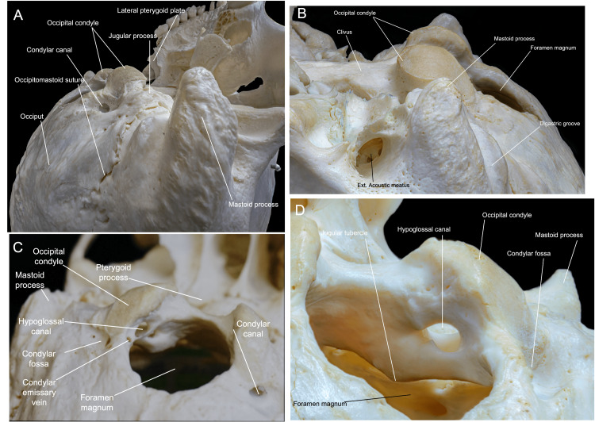
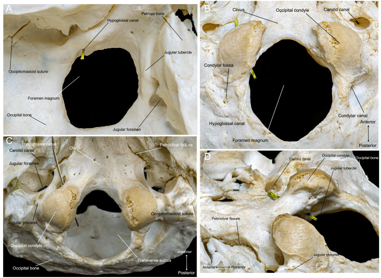
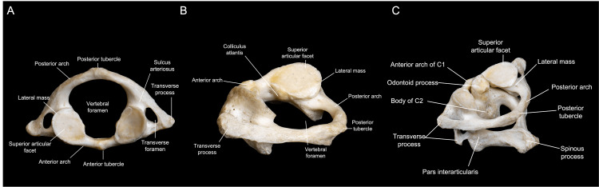
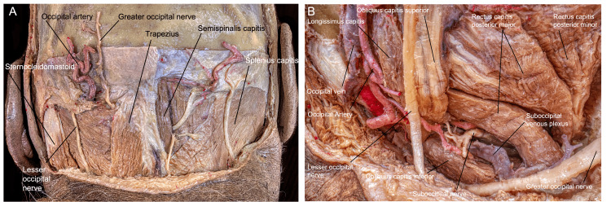
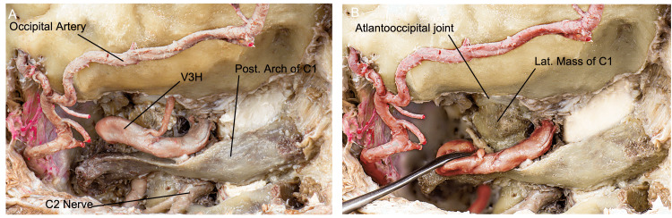
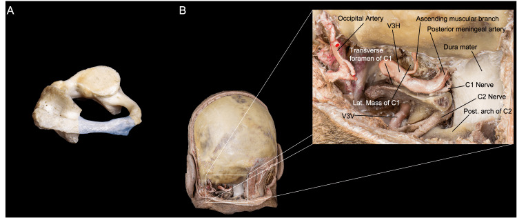
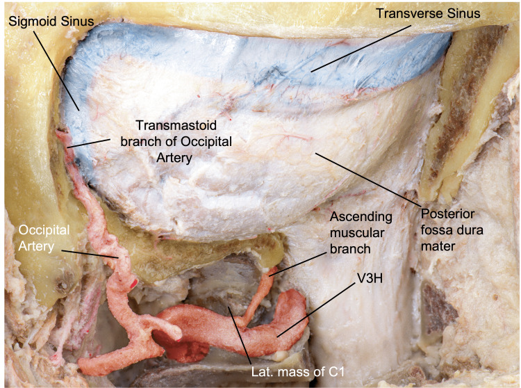
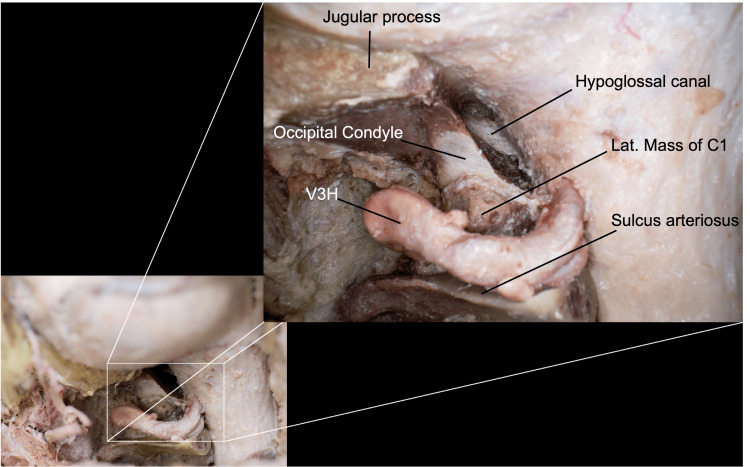
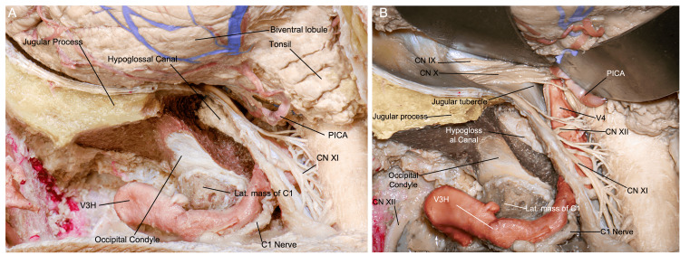
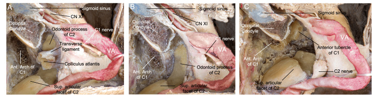

# Operative Approach: Anterior Cervical (Smith-Robinson) Approach

<!-- BEGIN CASE SNAPSHOT -->

## Case / Approach Snapshot

- **Anatomy at risk:** recurrent/superior laryngeal nerves, esophagus/pharynx/trachea, carotid sheath and vagus nerve, thyroid vessels, sympathetic chain, vertebral artery lateral to the uncovertebral joints, longus colli, thoracic duct in low left-sided exposure, dura, cord, and roots.
- **Operative steps:** choose side/level, position with safe extension, localize before incision and before drilling, develop the Smith-Robinson interval, seat retractors under longus colli, confirm midline/uncovertebral limits, perform ACDF/corpectomy/arthroplasty work, inspect esophagus/hemostasis, and close with airway vigilance.
- **Rescue plans:** wrong-level exposure, difficult low/high access, medialized carotid, RLN/voice risk, esophageal injury, vertebral artery injury, airway hematoma, CSF leak in OPLL/corpectomy, dysphagia, and postoperative neurologic decline.
- **Figures:** review [Figures, Imaging & Video](#figures-imaging--video) and the [Curated Image Set](#curated-image-set); embedded local figures should remain open-access, public-domain, or otherwise reusable with attribution.
- **Papers:** review [High-Yield Literature](#high-yield-literature) for seminal sources, modern reviews, and outcome data specific to this page.

<!-- END CASE SNAPSHOT -->

> **About the figures.** Copyrighted operative figures/videos are **linked** (Neurosurgical Atlas, AO Surgery Reference); embedded images are **public-domain** (Gray's Anatomy) or **CC‑BY** (open-access), credited beneath each image. See [media-sources.md](../../resources/media-sources.md) and [figures/CREDITS.md](../../figures/CREDITS.md).
>
> **Technique references:** [AO Surgery Reference — Anterior cervical approach](https://surgeryreference.aofoundation.org) · [Neurosurgical Atlas — Spine](https://www.neurosurgicalatlas.com) · [Radiopaedia — cervical spine](https://radiopaedia.org/search?q=cervical%20spondylosis&scope=all)

The anterior cervical (Smith-Robinson) approach is the **workhorse anterior corridor to C3–C7** (and, with effort, C2–T1). Through a transverse skin-crease incision it develops a natural plane **medial to the carotid sheath and lateral to the trachea/esophagus**, reaching the vertebral bodies and discs for **ACDF, corpectomy, arthroplasty, and anterior fusion.** It is fast, low-blood-loss, and well tolerated — but it threads between the **recurrent laryngeal nerve, esophagus, carotid, vertebral artery, and sympathetic chain**, so its safety is entirely about knowing those layers.

---

## Figures, Imaging & Video

**🎥 Operative video** — [search operative video on YouTube ▸](https://www.youtube.com/results?search_query=cervical+spondylosis+surgery) · [The Neurosurgical Atlas ▸](https://www.neurosurgicalatlas.com)

[AO Surgery Reference — anterior cervical](https://surgeryreference.aofoundation.org) · [Neurosurgical Atlas — Spine](https://www.neurosurgicalatlas.com) · [Radiopaedia — ACDF](https://radiopaedia.org/search?q=anterior%20cervical%20discectomy&scope=all) · [PubMed Central — Smith-Robinson](https://www.ncbi.nlm.nih.gov/pmc/?term=anterior+cervical+approach+smith+robinson)

---

<!-- BEGIN CURATED LITERATURE -->

## High-Yield Literature

- **High anterior cervical approach to the clivus and foramen magnum: a microsurgical anatomy study** — Russo VM. Neurosurgery 2011. [PubMed](https://pubmed.ncbi.nlm.nih.gov/21415787/)
- **Why the Craniovertebral Junction?** — Visocchi M. Acta neurochirurgica. Supplement 2019. [PubMed](https://pubmed.ncbi.nlm.nih.gov/30610295/)
- **Microsurgical Neurovascular Anatomy of the Brain: The Anterior Circulation (Part I)** — Giotta Lucifero A. Acta bio-medica : Atenei Parmensis 2021. [PubMed](https://pubmed.ncbi.nlm.nih.gov/34437363/)
- **Anterior Microsurgical Approach to Ventral Lower Cervical Spine Meningiomas: Indications, Surgical Technique and Long Term Outcome** — Fraioli MF. Technology in cancer research & treatment 2015. [PubMed](https://pubmed.ncbi.nlm.nih.gov/26269613/)
- **The Smith-Robinson Approach to the Subaxial Cervical Spine: A Stepwise Microsurgical Technique Using Volumetric Models From Anatomic Dissections** — Vigo V. Operative neurosurgery (Hagerstown, Md.) 2020. [PubMed](https://pubmed.ncbi.nlm.nih.gov/32864701/)
- **360° around the orbit: key surgical anatomy of the microsurgical and endoscopic cranio-orbital and orbitocranial approaches** — Agosti E. Neurosurgical focus 2024. [PubMed](https://pubmed.ncbi.nlm.nih.gov/38560949/)
- **Anterior approach to remove a pre-medullary meningioma in the cervical spine: Technical case report** — Broussolle T. Neuro-Chirurgie 2022. [PubMed](https://pubmed.ncbi.nlm.nih.gov/34619166/)
- **Anterior Petrosectomy vs. Retrosigmoid Approach-Surgical Anatomy and Navigation-Augmented Morphometric Analysis: A Comparative Study in Cadaveric Laboratory Setting** — Signoretti S. Brain sciences 2025. [PubMed](https://pubmed.ncbi.nlm.nih.gov/40002437/)
- **Microsurgical anatomy of anterior communicating artery aneurysms** — Rhoton AL Jr. Neurological research 1980. [PubMed](https://pubmed.ncbi.nlm.nih.gov/6111033/)
- **Microsurgical cervical nerve root decompression by anterolateral approach** — Bruneau M. Neurosurgery 2006. [PubMed](https://pubmed.ncbi.nlm.nih.gov/16543867/)

<!-- END CURATED LITERATURE -->

---

<!-- BEGIN CURATED IMAGE SET -->

## Curated Image Set

Open-access figures are embedded from PubMed Central articles and kept unique to this guide.

*Figure 1. Occipital bone anatomy. (A) Superolateral perspective of the inferior view of the skull showing the bony prominences, such as the mastoid tip and the condyles. (B) Inferior and lateral... Source: [Immersive Surgical Anatomy of the Far-Lateral Approach](https://pmc.ncbi.nlm.nih.gov/articles/PMC9733796/) — Cureus 2022; CC BY.*

*Figure 2. Occipital bone overview. (A) Superior perspective of the occipital bone, depicting the jugular foramen, jugular tubercle, lower clivus, and foramen magnum. (B) Inferior perspective of... Source: [Immersive Surgical Anatomy of the Far-Lateral Approach](https://pmc.ncbi.nlm.nih.gov/articles/PMC9733796/) — Cureus 2022; CC BY.*

*Figure 3. C1 anatomy. (A) Superior view of the C1 vertebra, showing the transverse foramina, medular canal, and articular facets. (B) Surgical perspective of C1 during a left FL approach. (C)... Source: [Immersive Surgical Anatomy of the Far-Lateral Approach](https://pmc.ncbi.nlm.nih.gov/articles/PMC9733796/) — Cureus 2022; CC BY.*

*Figure 4. Myofascial anatomy during the FL approach. (A) Posterior view of the muscular, vascular, and nervous anatomy encountered during the FL approach. (B) Close-up perspective of the left... Source: [Immersive Surgical Anatomy of the Far-Lateral Approach](https://pmc.ncbi.nlm.nih.gov/articles/PMC9733796/) — Cureus 2022; CC BY.*

*Figure 5. Overview of the craniocervical junction anatomy relevant to the FL approach after muscle dissection and suboccipital plexus resection. (A) Posterior and slightly lateral perspective of a... Source: [Immersive Surgical Anatomy of the Far-Lateral Approach](https://pmc.ncbi.nlm.nih.gov/articles/PMC9733796/) — Cureus 2022; CC BY.*

*Figure 6. Overview of the resection of the posterior arch of C1. (A) We observe shaded in blue the portion of the posterior arch to be resected. (B) Posterior and close-up perspective of the... Source: [Immersive Surgical Anatomy of the Far-Lateral Approach](https://pmc.ncbi.nlm.nih.gov/articles/PMC9733796/) — Cureus 2022; CC BY.*

*Figure 7. Surgical view after craniotomy, showing the dura mater of the posterior fossa and the spine, the occipital and vertebral arteries, and the transverse and sigmoid sinuses. (Published with... Source: [Immersive Surgical Anatomy of the Far-Lateral Approach](https://pmc.ncbi.nlm.nih.gov/articles/PMC9733796/) — Cureus 2022; CC BY.*

*Figure 8. Close-up view after a posterior-third condylectomy (transcondylar approach), where we can observe the hypoglossal canal as our medial limit. Here, we preserved the C0-C1 junction.... Source: [Immersive Surgical Anatomy of the Far-Lateral Approach](https://pmc.ncbi.nlm.nih.gov/articles/PMC9733796/) — Cureus 2022; CC BY.*

*Figure 9. Surgical view after durotomy, where (A) we can appreciate the cerebellar hemisphere and tonsil, C1 and C2 rootlets, and (B) after mobilization of the cerebellum, the jugular foramen with... Source: [Immersive Surgical Anatomy of the Far-Lateral Approach](https://pmc.ncbi.nlm.nih.gov/articles/PMC9733796/) — Cureus 2022; CC BY.*

*Figure 10. Overview of the transodontoid variation of the FL approach. In this posterolateral, surgical perspective, (A) the ipsilateral colliculus atlantis with the transverse ligament attached is... Source: [Immersive Surgical Anatomy of the Far-Lateral Approach](https://pmc.ncbi.nlm.nih.gov/articles/PMC9733796/) — Cureus 2022; CC BY.*

<!-- END CURATED IMAGE SET -->

---

## General Considerations
- **What it accesses:** the anterior cervical vertebral bodies and discs **C3–C7** routinely; **C2–C3** and **C7–T1** are reachable with high (submandibular) or low (clavicular/manubrial) modifications and are harder.
- **The plane is anatomic, not cut:** the dissection follows the avascular interval **between the carotid sheath (retracted laterally) and the visceral column — trachea/esophagus (retracted medially)** down to the prevertebral fascia and longus colli. Almost no muscle is divided (only platysma).
- **Procedures built on it:** [ACDF](../spine-degenerative/acdf.md), [cervical arthroplasty](../spine-degenerative/cervical-disc-replacement.md), anterior cervical **corpectomy** ([subaxial fracture](../spine-trauma/subaxial-cervical-fracture.md) / [vertebral corpectomy](../spine-tumor/vertebral-corpectomy.md)), OPLL, infection/tumor debridement.
- **Side of approach:** **left vs right is debated.** A **left-sided** approach places the recurrent laryngeal nerve (RLN) more predictably in the tracheoesophageal groove (the **right RLN is more variable/lateral**); a right-sided approach suits a right-handed surgeon and is fine in most hands. **Re-operation:** operate from the **same side** as a prior anterior cervical procedure (after laryngoscopy confirms an intact contralateral cord) to avoid bilateral RLN injury.

### Indications
- Cervical **disc herniation / spondylotic radiculopathy or myelopathy**, **OPLL**, anterior column **trauma**, **tumor**, **infection** (discitis/osteomyelitis) requiring anterior decompression/reconstruction.

### Side and Incision Selection

| Situation | Practical choice |
|-----------|------------------|
| Primary C3-C7 exposure | Either side; left is often chosen for more predictable RLN course |
| Prior anterior cervical surgery | Usually same side after laryngoscopy confirms the opposite vocal cord works |
| C2-C3 / high C3-C4 | Higher transverse incision, submandibular/hypoglossal-superior laryngeal awareness |
| C7-T1 / T1 | Low transverse/oblique incision, shoulder taping, possible manubrial/clavicular limits |
| Multilevel corpectomy | Longer oblique/SCM-parallel exposure may be more extensile |
| Medialized carotid or vessel anomaly | Modify side/corridor or abandon anterior plan if the vessel crosses the operative path |

Do not let the skin crease dictate the whole operation. The incision should serve the target level, fluoroscopic access, retractor angle, and reconstruction plan.

---

## Relevant Surgical Anatomy (layer by layer)
- **Skin → platysma → superficial cervical fascia.**
- **Sternocleidomastoid (SCM)** and the **carotid sheath** (common carotid, internal jugular vein, vagus nerve) lie **laterally** — retracted laterally; **omohyoid** crosses the field (can be divided/retracted).
- **Strap muscles (sternohyoid/sternothyroid), trachea, esophagus, thyroid** lie **medially** — retracted medially.
- **Recurrent laryngeal nerve (RLN):** ascends in the **tracheoesophageal groove**; the **right RLN** loops around the subclavian and is more lateral/variable.
- **Superior laryngeal nerve:** at risk in **high (C3–C4)** approaches near the superior thyroid vessels.
- **Sympathetic chain:** on the **anterolateral longus colli** — dissecting too far laterally or over-retracting longus colli causes **Horner syndrome.**
- **Vertebral artery:** lateral to the uncovertebral joints in the foramen transversarium — the **lateral limit** of bony work.
- **Carotid tubercle (Chassaignac, C6)**, **cricoid ≈ C6, thyroid cartilage ≈ C4–C5, hyoid ≈ C3** — surface landmarks. **Thoracic duct** (left, low approaches).

*Bhenderu LS, et al. *Cureus* 2025;17:e91106 — CC BY 4.0. Always check preoperative imaging for a **medialized carotid** crossing the operative midline — a dangerous, under-recognized ACDF pitfall.*

---

## Preoperative Evaluation
- **MRI** (level, cord signal, disc/OPLL) and **CT** (OPLL, bony anatomy, ossification); **review vessel position** — vertebral artery anomaly and **carotid medialization** (see figure) on axial imaging.
- **Voice/swallow baseline**; **laryngoscopy before re-operation** (confirm contralateral cord function before choosing the side).
- Plan **level localization** (landmarks + intra-op fluoroscopy); for low levels, plan shoulder traction/taping.

### Preoperative Risk Flags
- **OPLL or calcified disc:** higher dural-adherence and CSF leak risk; review CT carefully and prepare patch/sealant strategy.
- **Severe myelopathy:** avoid excessive neck extension; maintain spinal cord perfusion and consider neuromonitoring.
- **Revision anterior neck:** scarred planes, altered RLN risk, esophageal adherence, and higher dysphagia; obtain laryngoscopy and consider ENT exposure.
- **Long multilevel construct:** higher dysphagia, pseudarthrosis, graft/plate complications, and airway swelling; plan postoperative airway observation.
- **Vascular variant:** medialized carotid, aberrant vertebral artery, high-riding innominate, and left thoracic duct risk in low exposure should change the exposure plan.

## Logistics, OR Setup & Orders
- **Typical bed:** floor or step-down for elective degenerative exposure; ICU if trauma, myelopathy with cord signal change, major deformity, thoracic exposure, high EBL, or postoperative airway concern.
- **OR setup:** Jackson/radiolucent spine table or approach-specific lateral/anterior setup, C-arm/O-arm/navigation availability, microscope/loupes, neuromonitoring leads before positioning, and implant trays opened only after final level/plan confirmation.
- **Special needs:** arterial line and Foley for long instrumented cases, type/screen or crossmatch for deformity/corpectomy/trauma, antibiotic redosing plan, MAP support for SCI/myelopathy, and no long paralytic when MEPs are needed.
- **Immediate postop orders:** neuro checks focused on myotomes/sensory level, postop CT/X-rays per construct, brace/activity orders, drain output thresholds, DVT prophylaxis timing, dysphagia/airway monitoring for anterior cervical cases, and rehab mobilization plan.

## Anesthesia & Neuromonitoring
- GA; **SSEP/MEP (and EMG)** for myelopathy/deformity; avoid long-acting paralytic if MEPs. Consider **monitoring ETT cuff pressure** (release after retractor placement) to reduce RLN palsy. Arterial line for myelopathic cords (MAP support).

---

## Positioning

- **Supine** with a **transverse shoulder roll** for gentle neck extension (avoid over-extension in stenosis/myelopathy), head neutral or slightly rotated away (~10–15°), on a **donut/horseshoe or Mayfield**.
- **Tape the shoulders down** (caudal traction) to expose low cervical levels under fluoroscopy. Pad the arms; confirm a relaxed, accessible neck and obtainable lateral fluoro of the target.

## Incision & Approach (the Smith-Robinson interval)

1. **Transverse incision in a natural skin crease** at the target level (landmark-guided), from the midline to the medial border of the SCM (oblique along the SCM for long multilevel constructs).
2. Divide **platysma** (in line or transversely); open the superficial fascia along the **medial border of the SCM.**
3. **Palpate the carotid pulse**; develop the plane **medial to the carotid sheath and lateral to the strap muscles/visceral column.** Divide the **pretracheal (middle layer) fascia**, sweep bluntly to the **prevertebral fascia** (omohyoid retracted/divided as needed).
4. Confirm the midline (longus colli are symmetric); **incise the prevertebral fascia in the midline** and **elevate longus colli subperiosteally** just enough to seat the **self-retaining retractor blades UNDER longus colli** — this protects the esophagus medially and keeps blades off the sympathetic chain.
5. **Level localization with a spinal needle + fluoroscopy/X-ray before any bone work** (wrong-level surgery is a classic, avoidable error).

→ proceed to the procedure-specific steps ([ACDF](../spine-degenerative/acdf.md) discectomy/uncovertebral decompression, [corpectomy](../spine-tumor/vertebral-corpectomy.md), or [arthroplasty](../spine-degenerative/cervical-disc-replacement.md)). The **uncovertebral joints are the lateral limit** — beyond them lies the **vertebral artery.**

### Exposure Nuances
- Keep the dissection blunt once the correct interval is found; sharp dissection belongs only to fascia/platysma and controlled scar release.
- Put retractor teeth under the longus colli, not on the esophagus or sympathetic chain; periodically release retraction during long cases.
- Confirm the midline by longus colli symmetry, uncinate anatomy, and fluoroscopy; off-midline decompression is how vertebral artery injury happens.
- For low levels, shoulder traction improves fluoroscopy but can stretch brachial plexus; pad, tape evenly, and release when possible.
- For high levels, protect the hypoglossal/superior laryngeal region and limit aggressive superior thyroid vessel work.

### Intraoperative Rescue
- **Airway hematoma during closure/recovery:** remove compressive dressing, open incision at bedside if respiratory compromise is imminent, evacuate clot, and secure airway with anesthesia/ENT help.
- **Esophageal injury suspected:** stop, expose the injury, obtain primary repair/ENT help, drain, antibiotics, and nutrition plan; missed perforation is the dangerous failure mode.
- **Vertebral artery injury:** tamponade immediately, maintain exposure, avoid blind bipolar, consider hemostatic packing/direct repair/endovascular control, and verify posterior circulation plan.
- **CSF leak in OPLL/corpectomy:** primary repair if possible, patch graft/fat/fascia/sealant, avoid excessive suction on the repair, and consider lumbar drainage only when safe.
- **Loss of signals or new deficit:** stop distraction, raise MAP, remove graft/implant or reverse correction if needed, image for hematoma/hardware, and reassess decompression.

---

## Closure
- Release retractors, **inspect for esophageal injury** (some surgeons instill saline/insufflate to check), and obtain hemostasis. Reapproximate **platysma** and close skin **subcuticularly** (cosmesis). A drain is optional.
- **Airway-hematoma precautions:** counsel the team; a tense neck with respiratory distress is a **bedside emergency** (open the incision to evacuate before re-intubation).

---

## Nuances & Pitfalls (surgeon-level)
- **Esophagus** is the most dangerous **missed** injury — protect it under the medial retractor blade (seated under longus colli), avoid sharp/monopolar near it, and inspect at closure. A missed perforation → mediastinitis.
- **RLN palsy / hoarseness:** choose the side thoughtfully, seat retractors carefully, and **release ETT cuff pressure** after retraction; most palsies are transient.
- **Stay between the uncovertebral joints** — the **vertebral artery** is just lateral; lateral bony work or an off-midline trajectory risks catastrophic VA injury.
- **Sympathetic chain / Horner syndrome:** keep dissection and retractor blades **under longus colli**; don't strip it laterally.
- **Carotid:** palpate it and keep it lateral; **check imaging for a medialized carotid** crossing the field (figure above).
- **Dysphagia / prevertebral swelling:** minimize retraction time and consider steroids for long multilevel cases; airway watch overnight.
- **Wrong-level surgery:** always localize with fluoroscopy before drilling.
- **Low (C7–T1)** approaches risk the **thoracic duct (left)**; **high (C2–C4)** risk the **superior laryngeal nerve** and hypoglossal.

## Complications
**Dysphagia** (common, usually transient); **RLN palsy/hoarseness**; **esophageal perforation**; **airway/wound hematoma** (emergency); **vertebral or carotid artery injury**; **Horner syndrome**; CSF leak (OPLL/dural adhesion); **C5 palsy**; pseudarthrosis / adjacent-segment disease; infection.

---

## Cross-links
- Procedures: [ACDF](../spine-degenerative/acdf.md) · [cervical arthroplasty](../spine-degenerative/cervical-disc-replacement.md) · [vertebral corpectomy](../spine-tumor/vertebral-corpectomy.md) · [subaxial cervical fracture](../spine-trauma/subaxial-cervical-fracture.md)
- Related corridors: [posterior-cervical-approach.md](posterior-cervical-approach.md)

<!-- BEGIN COMMON PIMP QUESTIONS -->

## Common Pimp Questions

Use these to pressure-test preparation for **Anterior Cervical (Smith-Robinson) Approach**:

1. What patient position and head rotation make gravity work for this corridor?
2. What named nerve, vessel, sinus, or muscle/fascial plane is most commonly injured?
3. What bone work or soft-tissue step creates the exposure rather than simply using more retraction?
4. What is the bailout if exposure is inadequate, bleeding occurs, or the brain is tight?
5. What closure maneuver prevents the signature complication of this approach?

<!-- END COMMON PIMP QUESTIONS -->

<!-- BEGIN ATTENDING PREFERENCE VARIABLES -->

## Attending Preference Variables

Items that commonly vary by surgeon or institution:

- **Exact head rotation/flexion/extension and pin placement:** [attending-specific]
- **Skin incision length, flap type, and muscle/fascial preservation technique:** [attending-specific]
- **Drill, rongeur, endoscope, microscope, retractor, and navigation preferences:** [attending-specific]
- **Drain use, closure materials, watertightness threshold, and postop imaging routine:** [attending-specific]

<!-- END ATTENDING PREFERENCE VARIABLES -->

<!-- BEGIN REVERSE APPROACH LINKS -->

## Case Guides Using This Approach

- [Anterior Cervical Discectomy and Fusion (ACDF)](../../cases/spine-degenerative/acdf.md)
- [Cervical Disc Arthroplasty (Cervical Disc Replacement)](../../cases/spine-degenerative/cervical-disc-replacement.md)

<!-- END REVERSE APPROACH LINKS -->

## References
1. Smith GW, Robinson RA. **The treatment of certain cervical-spine disorders by anterior removal of the intervertebral disc and interbody fusion.** *J Bone Joint Surg Am.* 1958;40-A(3):607–624.
2. Robinson RA, Smith GW. **Anterolateral cervical disc removal and interbody fusion for cervical disc syndrome.** *Bull Johns Hopkins Hosp.* 1955.
3. AO Foundation. **Anterior approach to the cervical spine.** AO Surgery Reference. [link](https://surgeryreference.aofoundation.org)
4. **Bhenderu LS, et al. The Kissing Carotid Variant: case insights and surgical precautions in ACDF.** *Cureus.* 2025;17:e91106. CC BY 4.0. (figure embedded above) — [PMC12466316](https://pmc.ncbi.nlm.nih.gov/articles/PMC12466316/)
5. Rhoton AL Jr. *Spine and cervical anatomy* (anatomy series).
