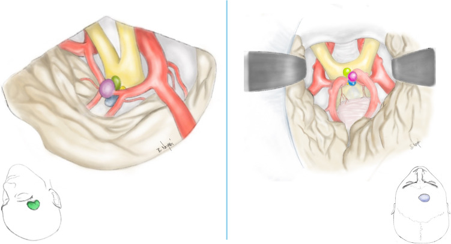
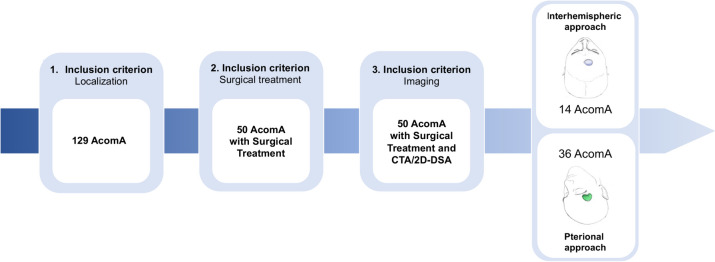
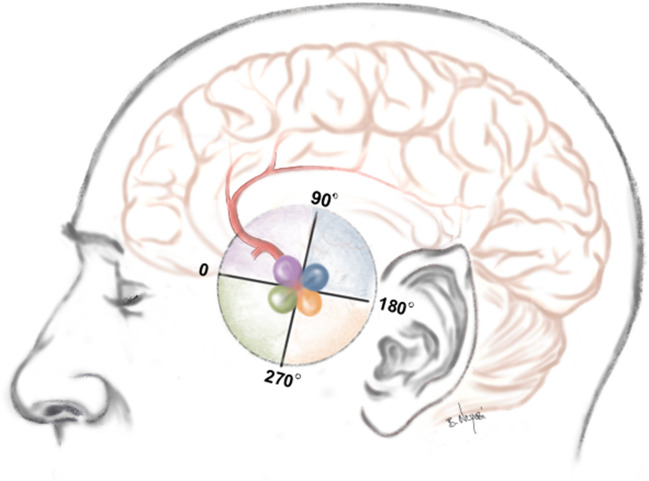
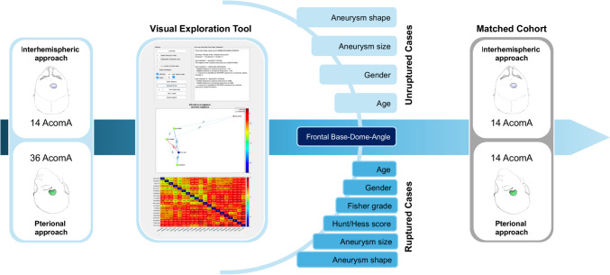
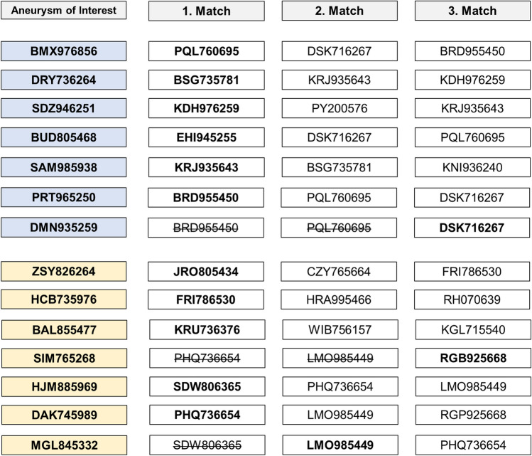
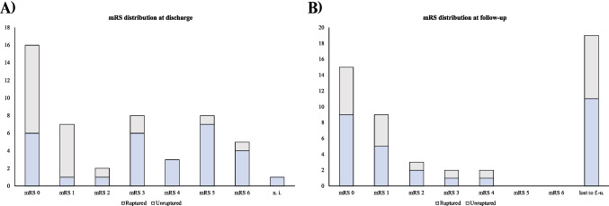
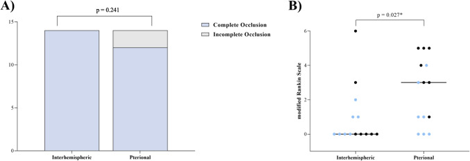
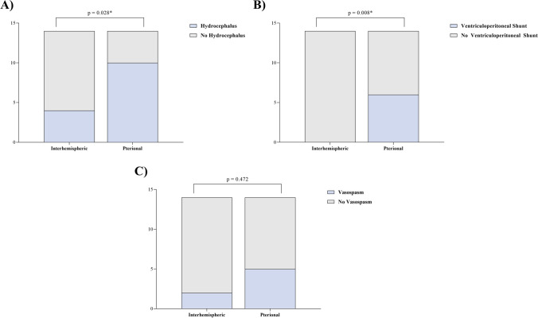
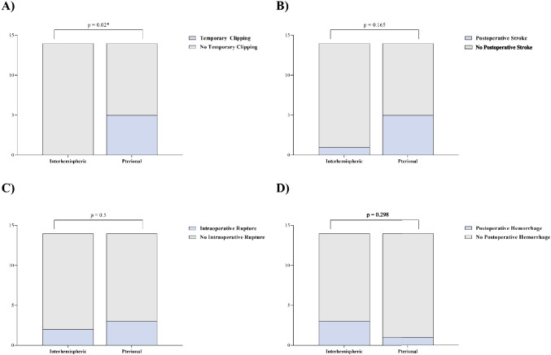
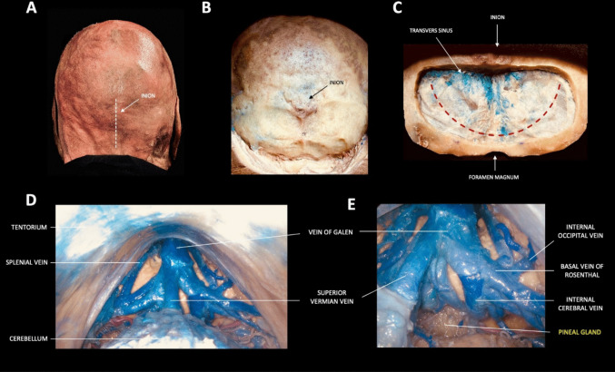

# Operative Approach: Anterior Interhemispheric (Transcallosal) Approach

<!-- BEGIN CASE SNAPSHOT -->

## Case / Approach Snapshot

- **Anatomy at risk:** corridor-defining nerves, arteries, veins/sinuses, cisterns, bone landmarks, muscle/fascial planes, and closure structures that determine exposure and morbidity.
- **Operative steps:** confirm position and trajectory, mark landmarks, protect soft tissue and named neurovascular structures, perform the bone/soft-tissue corridor, open/close dura or target compartment deliberately, and verify hemostasis/reconstruction; use the detailed operative sequence and approach notes below as the step-by-step source.
- **Rescue plans:** brain relaxation failure, venous or sinus bleeding, cranial nerve/perforator risk, exposure that is too narrow, CSF leak, cosmetic/temporalis/frontalis problems, and conversion to a wider or alternate corridor.
- **Figures:** review [Figures, Imaging & Video](#figures-imaging--video) and the [Curated Image Set](#curated-image-set); embedded local figures should remain open-access, public-domain, or otherwise reusable with attribution.
- **Papers:** review [High-Yield Literature](#high-yield-literature) for seminal sources, modern reviews, and outcome data specific to this page.

<!-- END CASE SNAPSHOT -->

## Figures, Imaging & Video

**🎥 Operative video** — [search operative video on YouTube ▸](https://www.youtube.com/results?search_query=Anterior+Interhemispheric+Approach+surgery) · [The Neurosurgical Atlas ▸](https://www.neurosurgicalatlas.com)

*Detailed operative reference written for a senior resident / fellow / attending. Pathology guides (e.g., [colloid cyst](../cranial-tumor/colloid-cyst.md), [AComA aneurysm](../cranial-vascular/acomm-aneurysm-clipping.md)) link here for technique.*

The anterior interhemispheric approach exploits the **natural midline corridor between the cerebral hemispheres** to reach deep structures -- the corpus callosum, lateral ventricles, third ventricle (via callosotomy), distal ACA territory, and falcine/parasagittal lesions. Its cardinal advantage is reaching the ventricular system and deep midline pathology **without transgressing functional cortex**. The trade-offs are a narrow, deep working corridor; vulnerability of bridging veins; and the risk of fornix and medial frontal lobe injury.

---

<!-- BEGIN CURATED LITERATURE -->

## High-Yield Literature

- **Anterior interhemispheric vs. pterional approach in the microsurgical management of anterior communicating artery aneurysms: a comparative analysis employing a novel multidimensional matching-tool** — Swiatek VM. Neurosurgical review 2024. [PubMed](https://pubmed.ncbi.nlm.nih.gov/39069603/)
- **Surgical strategy for distal anterior cerebral artery aneurysms: microsurgical anatomy** — Kawashima M. Journal of neurosurgery 2003. [PubMed](https://pubmed.ncbi.nlm.nih.gov/12959440/)
- **Anatomical step-by-step dissection of common approaches to the third ventricle for trainees: surgical anatomy of the anterior transcortical and interhemispheric transcallosal approaches, surgical principles, and illustrative pediatric cases** — Dang DD. Acta neurochirurgica 2023. [PubMed](https://pubmed.ncbi.nlm.nih.gov/37418043/)
- **Microsurgical interhemispheric approach to dural arteriovenous fistulas of the floor of the anterior cranial fossa** — Mayfrank L. Minimally invasive neurosurgery : MIN 1996. [PubMed](https://pubmed.ncbi.nlm.nih.gov/8892285/)
- **Occipital Interhemispheric Transtentorial Approach for Microsurgical Resection of a Ruptured Vermian Arteriovenous Malformation: Three-Dimensional Operative Video** — Karadimas SK. World neurosurgery 2022. [PubMed](https://pubmed.ncbi.nlm.nih.gov/36228935/)
- **Interhemispheric Approach with Early A1 Exposure for Clipping Anterior Communicating Artery Aneurysms: Operative Techniques and Outcomes** — Wongsuriyanan S. World neurosurgery 2020. [PubMed](https://pubmed.ncbi.nlm.nih.gov/32165343/)
- **Anterior interhemispheric transsplenial approach to pineal region tumors: anatomical study and illustrative case** — Yağmurlu K. Journal of neurosurgery 2018. [PubMed](https://pubmed.ncbi.nlm.nih.gov/28084911/)
- **Operative Management of Distal Anterior Cerebral Artery Aneurysms Through a Mini Anterior Interhemispheric Approach** — Monroy-Sosa A. World neurosurgery 2017. [PubMed](https://pubmed.ncbi.nlm.nih.gov/28919562/)
- **Tailored Callosotomy in Third Ventricle Colloid Cyst Resection via Anterior Interhemispheric Transcallosal Approach** — Ozoner B. World neurosurgery 2025. [PubMed](https://pubmed.ncbi.nlm.nih.gov/39952402/)
- **Minimally invasive medial supraorbital, combined subfrontal-interhemispheric approach to the anterior communicating artery complex-a cadaveric study** — Spiessberger A. Acta neurochirurgica 2017. [PubMed](https://pubmed.ncbi.nlm.nih.gov/28386838/)

<!-- END CURATED LITERATURE -->

<!-- BEGIN CURATED IMAGE SET -->

## Curated Image Set

Open-access figures are embedded from PubMed Central articles and kept unique to this guide.

*Fig. 1. This figure illustrates the surgical approaches utilized, showing both the craniotomy and the microsurgical perspective of the aneurysm and potential angulations. The color coding is... Source: [Anterior interhemispheric vs. pterional approach in the microsurgical management of anterior communicating artery aneurysms: a comparative analysis employing a novel multidimensional matching-tool](https://pmc.ncbi.nlm.nih.gov/articles/PMC11284194/) — Neurosurgical Review 2024; CC BY.*

*Fig. 2. Flow chart illustrating the determination of the study-cohort according to the inclusion criteria and the final cohort matching (AcomA; Anterior communicating artery aneurysm) Source: [Anterior interhemispheric vs. pterional approach in the microsurgical management of anterior communicating artery aneurysms: a comparative analysis employing a novel multidimensional matching-tool](https://pmc.ncbi.nlm.nih.gov/articles/PMC11284194/) — Neurosurgical Review 2024; CC BY.*

*Fig. 3. Fig. 3 presents a schematic depiction of the FDA relative to the frontal base. The angles are classified into four categories: category 1 (0–90°) depicted in purple, category 2 (90–180°)... Source: [Anterior interhemispheric vs. pterional approach in the microsurgical management of anterior communicating artery aneurysms: a comparative analysis employing a novel multidimensional matching-tool](https://pmc.ncbi.nlm.nih.gov/articles/PMC11284194/) — Neurosurgical Review 2024; CC BY.*

*Fig. 4. Schematic representation of the matching process following cohort identification. The figure illustrates how 14 through AIA operated AcomA were matched with 36 pterionally approached... Source: [Anterior interhemispheric vs. pterional approach in the microsurgical management of anterior communicating artery aneurysms: a comparative analysis employing a novel multidimensional matching-tool](https://pmc.ncbi.nlm.nih.gov/articles/PMC11284194/) — Neurosurgical Review 2024; CC BY.*

*Fig. 5. In the matching process, situations arose where an already matched PA treated AcomA was selected as the most similar in additional cases. Among the seven unruptured cases (highlighted in... Source: [Anterior interhemispheric vs. pterional approach in the microsurgical management of anterior communicating artery aneurysms: a comparative analysis employing a novel multidimensional matching-tool](https://pmc.ncbi.nlm.nih.gov/articles/PMC11284194/) — Neurosurgical Review 2024; CC BY.*

*Fig. 6. Ruptured cases are indicated in blue, while unruptured cases are depicted in grey. The x-axis represents the number of cases. Panel (A) illustrates the distribution of mRS scores at... Source: [Anterior interhemispheric vs. pterional approach in the microsurgical management of anterior communicating artery aneurysms: a comparative analysis employing a novel multidimensional matching-tool](https://pmc.ncbi.nlm.nih.gov/articles/PMC11284194/) — Neurosurgical Review 2024; CC BY.*

*Fig. 7. (A) the rate of complete occlusion, and (B) the dispersion of scores on the mRS among patients with AcomA. Comparative analyses are conducted between two distinct cohorts: one operated... Source: [Anterior interhemispheric vs. pterional approach in the microsurgical management of anterior communicating artery aneurysms: a comparative analysis employing a novel multidimensional matching-tool](https://pmc.ncbi.nlm.nih.gov/articles/PMC11284194/) — Neurosurgical Review 2024; CC BY.*

*Fig. 8. Comparateive evaluations of AcomA managed via AIA and PA, specifically focusing on (A) the incidence of postoperative hydrocephalus, (B) the consequent need for ventriculoperitoneal... Source: [Anterior interhemispheric vs. pterional approach in the microsurgical management of anterior communicating artery aneurysms: a comparative analysis employing a novel multidimensional matching-tool](https://pmc.ncbi.nlm.nih.gov/articles/PMC11284194/) — Neurosurgical Review 2024; CC BY.*

*Fig. 9. Comparison between AIA and PA to manage AcomA, detailing (A) the frequency of temporary clipping and (B) its subsequent association with postoperative strokes, along with (C) the... Source: [Anterior interhemispheric vs. pterional approach in the microsurgical management of anterior communicating artery aneurysms: a comparative analysis employing a novel multidimensional matching-tool](https://pmc.ncbi.nlm.nih.gov/articles/PMC11284194/) — Neurosurgical Review 2024; CC BY.*

*Fig. 1. A–E. Step-by-step dissection illustrating the supracerebellar infratentorial (SCIT) approach Source: [What is the best surgical approach for Pineal Region Tumors? A systematic literature review and anatomical comparative study](https://pmc.ncbi.nlm.nih.gov/articles/PMC13230278/) — Child's Nervous System 2026; CC BY.*

<!-- END CURATED IMAGE SET -->

## 1. General Considerations
- **Philosophy:** gravity, not retractors, opens the interhemispheric fissure. With the head elevated and the dependent hemisphere falling away from the falx, the corridor widens passively. Fixed retractors should be used sparingly and intermittently -- sustained pressure on the medial frontal cortex risks **abulia and akinetic mutism**.
- **Callosotomy length:** limit to **2--2.5 cm** in the anteroposterior axis (typically through the body or genu). Longer callosotomies (>3 cm) risk **disconnection syndrome** (alien hand, ideomotor apraxia). Navigate to the thinnest or most displaced segment of the corpus callosum; pathologically thinned callosum over a dilated ventricle requires only a minimal incision.
- **Depth-of-field challenge:** the working depth is **4--7 cm** through a corridor only 1.5--2 cm wide. Long bayonetted instruments, a high-quality headlight or microscope with co-axial illumination, and meticulous hemostasis are mandatory -- any bleeding at depth quickly obscures the field.
- **Right vs left side:** the approach is typically made from the **non-dominant (right) hemisphere side** to minimize risk to supplementary motor area and language-related cingulate cortex, unless venous anatomy or lesion laterality dictates otherwise. If bridging veins are more favorable on the dominant side, consider switching -- venous preservation takes priority over hemisphere dominance in most cases.

## 2. Indications
- **Third ventricle tumors:** colloid cysts (the classic and most common indication), central neurocytoma, subependymal giant cell astrocytoma (SEGA), craniopharyngioma with superior/intraventricular extension, third-ventricle ependymoma, choroid plexus papilloma.
- **Lateral ventricle tumors:** body/atrium lesions accessible via transcallosal route (alternative: transcortical-transventricular).
- **Distal ACA aneurysms:** A2--A3 junction (pericallosal/callosomarginal), A4--A5 aneurysms via the interhemispheric corridor without callosotomy.
- **AComA aneurysms:** selected superiorly projecting AComA aneurysms approached via the anterior interhemispheric route (alternative to pterional).
- **Falcine and parasagittal meningiomas** with deep interhemispheric extension.
- **Callosal/cingulate lesions:** gliomas of the corpus callosum, cingulate gyrus tumors, butterfly gliomas (biopsy/debulking).
- **Deep AVM feeders:** access to distal ACA supply for medial hemispheric AVMs.
- **Generally NOT:** purely sellar/parasellar lesions (endonasal preferred); posterior fossa lesions; lesions lateral to the trigone (transcortical posterior approach preferred); convexity tumors without deep midline extension.

## 3. Preoperative Considerations
- **MRI:** sagittal T1 for corpus callosum thickness/anatomy and precise trajectory planning; coronal FLAIR to assess cingulate/callosal edema. **MR venogram or CT venogram** to map bridging veins and their drainage into the superior sagittal sinus -- the single most important variable in planning the craniotomy position.
- **Neuronavigation:** strongly recommended; register with fiducials or surface matching. Plan the craniotomy centered on a **bridging-vein-free corridor** on the parasagittal convexity.
- **CSF diversion:** if significant hydrocephalus is present, consider preoperative EVD or plan for intraoperative ventricular drainage after initial entry. Ventriculomegaly actually *facilitates* the transcallosal approach by enlarging the target.
- **AED loading:** seizure risk is moderate (medial frontal manipulation, cortical retraction). Load levetiracetam or phenytoin preoperatively; continue 5--7 days post-op.
- **Dexamethasone** for peritumoral edema; **mannitol** available for intraoperative relaxation.
- **IONM:** SSEP/MEP monitoring if the approach is near motor cortex or if posterior extension toward the paracentral lobule is anticipated.
- **Endoscopy:** have a rigid 0-degree and 30-degree endoscope available -- even in open microsurgical cases, endoscope-assisted visualization around the foramen of Monro and into the third ventricle is invaluable for confirming complete resection and checking aqueductal patency.
- **Patient counseling:** discuss the risks of **memory deficit** (fornix), **behavioral changes** (medial frontal retraction), and **seizures**. For colloid cysts, emphasize that despite the benign histology, the approach carries meaningful neurological risk -- this informs the decision between microsurgical, endoscopic, and observation strategies.

## Logistics, OR Setup & Orders
- **OR setup:** Mayfield/head holder plan, microscope/endoscope, navigation, vascular instruments/ICG when applicable, skull base reconstruction supplies, and approach-specific retractors/drills ready before opening.
- **Special needs:** arterial line for major intracranial or vascular cases, Foley for long cases, neuromonitoring by corridor, dexamethasone/antiepileptic/BP plan by pathology, and blood products for vascular or skull base exposure.
- **Immediate postop orders:** disposition and neuro-check frequency, HOB/activity, postop CT/MRI/CTA timing, BP goals, steroid/antiepileptic plan, DVT prophylaxis timing, drain management, and focused cranial nerve/visual/language/motor exams.

## 4. Operative Anatomy (what you must own)
- **Superior sagittal sinus (SSS):** runs in the superior attached margin of the falx; wider posteriorly. The craniotomy must **straddle** or **abut** the midline to allow dural opening to the sinus edge, but the sinus itself must not be entered.
- **Bridging (parasagittal) veins:** drain the cortical surface into the SSS; concentrated at ~2--4 cm and ~8--10 cm from the frontal pole. A relatively vein-free zone typically exists between **4--8 cm posterior to the frontal pole** (roughly the coronal suture region) -- the ideal craniotomy window. **Sacrifice of a major bridging vein risks venous infarction** -- the approach must be planned around these veins, not through them. Preoperative venography is non-negotiable.
- **Falx cerebri:** the dural partition between hemispheres; the free inferior edge guides you toward the corpus callosum. The **inferior sagittal sinus** runs along this free edge -- a useful midline landmark but a nuisance if entered. Anteriorly the falx is shallow (short distance from SSS to free edge); posteriorly it deepens substantially.
- **Cingulate gyri:** the paired gyri flanking the corpus callosum; the interhemispheric dissection passes between the two cingulate gyri. They are often adherent across the midline and must be separated sharply.
- **Pericallosal arteries (A2--A5):** the paired pericallosal arteries course along the superior surface of the corpus callosum. The A2 segment (infracallosal) runs beneath the rostrum/genu; the A3 (precallosal) curves around the genu; A4 and A5 course over the body and toward the splenium. The **callosomarginal artery** branches from the pericallosal and runs in the cingulate sulcus -- it is the major branch most at risk during interhemispheric dissection.
- These arteries are the first named structures encountered at depth and serve as a landmark confirming you are at the callosal surface. The two pericallosals are often closely applied or intertwined in the midline -- separate them gently with sharp technique.
- **Corpus callosum layers (superficial to deep):**
  - **Indusium griseum** -- thin gray-matter remnant on the dorsal surface; may be difficult to identify macroscopically.
  - **Cingulum bundle** -- association fibers running in the AP direction, deep to the cingulate gyrus.
  - **Callosal commissural fibers** -- white, glistening, running **transversely** (left-right). This characteristic transverse fiber pattern is the definitive visual confirmation that you are on the corpus callosum and not still in cingulate cortex. Callosotomy is performed through these transverse fibers.
- **Intraventricular landmarks (after callosotomy):** the lateral ventricle is entered. Orient by these structures:
  - **Choroid plexus** -- enters the lateral ventricle through the choroidal fissure and courses toward the foramen of Monro. Follow it anteriorly to find the foramen.
  - **Thalamostriate vein** -- runs anteriorly in the sulcus between the thalamus (medially) and the caudate nucleus (laterally).
  - **Septal vein** -- drains the septum pellucidum, coursing posteriorly along the septal surface.
  - The thalamostriate and septal veins converge at the **venous angle** to form the **internal cerebral vein** -- this venous angle marks the **posterior margin of the foramen of Monro** and is the single most reliable landmark for orientation within the ventricle.
- **Columns of the fornix:** form the **anterior boundary** of the foramen of Monro. Injury to one fornix column carries ~30% risk of short-term memory deficit; **bilateral fornix injury causes devastating anterograde amnesia**.
- **Septum pellucidum:** the thin membrane between the lateral ventricles; fenestration allows access to the contralateral ventricle if needed. A cavum septum pellucidum (present in ~15% of adults) can be mistaken for the ventricle -- look for choroid plexus and ependymal veins to confirm true ventricular entry.
- **Third ventricle floor (when working through the foramen of Monro):** the hypothalamus forms the floor; the massa intermedia (present in ~70%) crosses between the thalami; the posterior commissure and pineal recess mark the posterior limit. Awareness of these landmarks prevents inadvertent hypothalamic injury during tumor dissection.

## 5. Step-by-Step Technique

### 5a. Positioning
- **Supine**, head in Mayfield 3-pin fixation, **elevated 15--20 degrees** above the heart (reverse Trendelenburg) for venous drainage and gravity-assisted hemispheric retraction.
- **Mayfield pins:** double-pin rocker on the contralateral side (low, behind the ear), single pin ipsilaterally -- placed well behind the planned incision line.
- **Head position:** neutral or rotated **10--15 degrees toward the surgeon** (right side up if approaching from the right) to allow the dependent hemisphere to fall away from the falx. Some surgeons prefer a fully neutral head with the sagittal sinus oriented vertically.
- **Vertex tilted slightly toward the floor** so the frontal lobes fall anteriorly, opening the posterior interhemispheric corridor.
- *Pearl:* over-rotation makes both cingulate gyri overlap in the surgeon's line of sight; under-rotation prevents the dependent hemisphere from falling away. Adjust intraoperatively based on how freely the fissure opens.

### 5b. Incision & Craniotomy
- **Bicoronal skin incision** behind the hairline (or curvilinear incision if only unilateral exposure is needed). Elevate a large **pericranial flap** (vascularized, based anteriorly) for potential dural grafting at closure -- this is your built-in graft, so harvest it carefully.
- **Craniotomy:** typically **two-thirds anterior to the coronal suture, one-third posterior** (centered on the coronal suture for most third-ventricle lesions). The flap should be **~5--6 cm AP x 3--4 cm lateral**, crossing the midline by 1--1.5 cm to expose the edge of the SSS. Position the craniotomy to **avoid the major bridging veins** identified on preoperative imaging.
- Place burr holes on either side of the SSS; carefully dissect dura off the underlying sinus with a Penfield #3 before completing osteotomies across the midline. The cross-midline osteotomy is the most hazardous cut -- keep the footplate angled away from the sinus and irrigate continuously.
- *Pitfall:* the SSS is often **off-midline** (deviated slightly to the right in many patients). Use navigation to confirm the true sinus location before placing burr holes.

### 5c. Dural Opening & Interhemispheric Dissection
- Open dura in a **C-shaped flap based on the SSS** -- incise parallel to and ~5 mm from the sinus edge, reflect medially. Place **tack-up sutures** along the sinus edge to control epidural bleeding and maximize the corridor width. Additional tack-ups laterally prevent the dural edge from folding into the operative field.
- **Interhemispheric entry:** identify and **preserve all bridging veins**. If a vein crosses the intended corridor, work anterior or posterior to it -- dissect arachnoid off the vein to gain additional length/mobility, but never stretch or avulse it.
- Gently retract the medial frontal cortex laterally using cottonoid patties and the surgeon's awareness of gravity; let the hemisphere fall away naturally. **Avoid fixed retractors when possible** -- if used, release every 10--15 minutes and reposition cottonoids to distribute pressure.
- Divide arachnoid adhesions between the cingulate gyri sharply with microscissors. The cingulate gyri are often tightly adherent across the midline, especially in patients without prior hydrocephalus. Follow the **falx inferiorly toward its free edge**; the inferior sagittal sinus in the free edge confirms midline orientation.
- The **pericallosal arteries** come into view coursing on the white, glistening surface of the corpus callosum. Their presence confirms you have reached the correct depth and are in the midline. *Pearl:* if you see only one pericallosal artery, you may be in the ipsilateral cingulate sulcus rather than at the callosal surface -- re-orient with navigation.

### 5d. Callosotomy & Ventricular Entry
- Confirm position on the corpus callosum with **neuronavigation** (the callosum can be difficult to distinguish from cingulate gyrus in distorted anatomy). The transversely oriented, glistening white fibers are the hallmark -- contrast this with the gray appearance and AP orientation of cingulate cortex.
- Separate the paired **pericallosal arteries** in the midline with sharp arachnoid dissection; retract gently to each side with cottonoid strips. Do not cauterize near these arteries.
- Perform a **2--2.5 cm callosotomy** in the midline using bipolar coagulation at low settings and micro-scissors (or ultrasonic aspirator at low amplitude). Cut through the transverse callosal fibers until you encounter the thin, blue-gray **ependymal lining**; opening it enters the **lateral ventricle**. CSF egress at this point confirms entry and provides additional brain relaxation.
- Orient within the ventricle by identifying the **choroid plexus** (red, villous, running anteriorly toward the foramen of Monro), the **septal vein** (on the septum pellucidum medially), and the **thalamostriate vein** (running along the thalamocaudate groove laterally). The convergence of these veins at the **venous angle** marks the posterior lip of the foramen of Monro.
- *Pearl:* in patients with ventriculomegaly, the callosotomy may be trivially short (a few millimeters through a paper-thin callosum). In patients with normal-sized ventricles, the callosum is thicker and the ventricle is a smaller target -- navigate carefully and do not assume depth based on other cases.

### 5e. Working at the Foramen of Monro
- For colloid cysts and third-ventricle tumors, the foramen of Monro is the gateway. The normal foramen is ~5 mm in diameter but is often expanded by the lesion itself (especially colloid cysts). Enlarge the working corridor if needed by gently displacing the choroid plexus posteriorly or by opening the **choroidal fissure** (subchoroidal approach -- incise the taenia choroidea along the thalamic attachment of the choroid plexus), **never by cutting the fornix column**.
- The **interforniceal approach** (separating the two fornix bodies in the midline raphe of the septum pellucidum) provides a wider corridor to the third ventricle but carries higher memory risk. Reserve for large tumors that cannot be delivered piecemeal through a natural or enlarged foramen.
- The **transforaminal approach** (working directly through the foramen) is adequate for most colloid cysts and small tumors. Use angled instruments and the operating microscope or endoscope-assisted technique to visualize around the foramen margins.
- *Pearl:* at the end of tumor removal, inspect the floor and walls of the third ventricle with an angled endoscope to confirm complete resection and verify the aqueduct of Sylvius is patent.

## 6. Key Pitfalls & Bailouts

*The anterior interhemispheric approach has a narrow margin between adequate exposure and iatrogenic injury. Most complications are avoidable with planning and patience.*

- **Bridging vein sacrifice:** the most consequential intraoperative decision. Sacrifice of a dominant parasagittal vein can cause **hemorrhagic venous infarction** of the medial frontal lobe -- a devastating complication that may not manifest for 12--24 hours postoperatively. If the corridor is blocked by a vein, reposition the craniotomy anterior or posterior to it -- do not divide it. Mobilize the vein by releasing arachnoid attachments to gain a few millimeters of additional working room.
- **Fornix injury:** unilateral fornix injury may cause transient or permanent **memory deficit**; bilateral injury causes **severe anterograde amnesia**. Avoid excessive traction on the foramen of Monro margins; use the subchoroidal route rather than cutting the fornix.
- **Bilateral cingulate retraction:** sustained retraction on both medial frontal lobes risks **abulia and akinetic mutism** (SMA syndrome variant). Use intermittent dynamic retraction, not fixed blades.
- **Disorientation at depth:** the deep operative field (4--7 cm) through a narrow corridor makes spatial orientation difficult. Neuronavigation is essential. If disoriented, re-identify surface landmarks (pericallosal arteries, choroid plexus) before proceeding.
- **Callosotomy too lateral:** entering the cingulum or corona radiata instead of the ventricle. Navigation and recognition of the transverse callosal fiber pattern prevent this error.
- **Pericallosal artery injury:** the paired pericallosal arteries are adherent to each other and to the callosal surface. Aggressive separation or retraction can cause vasospasm or branch avulsion. Use sharp arachnoid dissection under high magnification; **do not cauterize on or near the pericallosal arteries** -- use micro-clips for small branch bleeding.
- **SSS injury during craniotomy:** if the sinus is torn during osteotomy across the midline, control with Gelfoam and gentle tamponade, then repair primarily or with muscle patch. Do not panic -- SSS tears in the anterior third are usually manageable.
- **Bailout -- inability to find the ventricle:** if the callosotomy does not yield ventricular entry (thick callosum, slit ventricles), re-check navigation, extend the callosotomy posteriorly in small increments, and consider intraoperative ultrasound to guide trajectory.
- **Contralateral ventricle entry:** the callosotomy may enter the contralateral ventricle if the trajectory is off-midline. The septum pellucidum will be absent on the side you entered. Recognize the error by noting choroid plexus position and laterality on navigation; fenestrate the septum to reach the correct side if needed.
- **Postoperative hydrocephalus:** blood products in the ventricle or residual tumor at the foramen of Monro can obstruct CSF flow. Maintain a low threshold for postoperative CT and EVD placement.

## 7. Closure
- **Hemostasis:** meticulous intraventricular hemostasis is critical -- even small bleeding at depth can cause intraventricular hemorrhage and obstructive hydrocephalus. Irrigate until clear; use oxidized cellulose (Surgicel) and gentle bipolar sparingly on ventricular surfaces.
- **Ventricular drain:** consider leaving a small-caliber ventricular catheter (externalized or tunneled to a subgaleal reservoir) if the tumor bed is vascular, residual blood is present, or there is concern for postoperative hydrocephalus.
- **Callosotomy site:** does not require formal closure; the ependyma approximates on its own.
- **Dura:** close **watertight** with running suture +/- pericranial or fascial graft (the ventricle was entered -- watertight closure is essential to prevent CSF leak and subdural hygroma). The pericranial flap harvested at the beginning of the case is ideal.
- **Bone flap:** replace with **3 or more mini-plates**. Fill burr holes with bone dust or hydroxyapatite for cosmesis (the bicoronal flap is in a cosmetically visible area if the patient is bald or has a receding hairline).
- **Scalp:** layered closure with galea sutures and skin staples/sutures. Subgaleal drain optional; some surgeons use it routinely given the large flap size.

## 8. Postoperative Care
- **Neuro checks q1h** for the first 24 hours; delayed venous infarction may present 12--24 hours after surgery with progressive hemiparesis, obtundation, or seizures.
- **CT head** within 6--12 hours (sooner if any neurological decline) to rule out intraventricular hemorrhage, hydrocephalus, or venous infarct.
- **AEDs** continued for 5--7 days minimum; longer if seizures occur.
- **EVD management** (if placed): keep at 10--15 cm H2O; wean by gradual elevation over 48--72 hours; clamp trial before removal.
- **Behavioral monitoring:** watch for subtle personality changes, apathy, and reduced spontaneity (abulia) -- these may not be apparent on standard neuro checks and require directed assessment.

## 9. Complications
Venous infarction (bridging vein sacrifice); memory deficit (fornix injury -- unilateral transient or bilateral permanent); abulia / akinetic mutism (bilateral medial frontal retraction); seizures (cortical manipulation, especially if transcortical variant used); CSF leak / pseudomeningocele (inadequate dural closure after ventricular entry); intraventricular hemorrhage; hydrocephalus (blood products, residual tumor obstructing CSF flow); disconnection syndrome (excessive callosotomy); wound infection; subdural hygroma; pericallosal artery vasospasm or territory infarction.

## 10. Variants
- **Transcortical-transventricular approach:** enters the lateral ventricle through a **small corticotomy** (~2 cm) in the middle frontal gyrus (non-dominant hemisphere) rather than via callosotomy. Avoids interhemispheric dissection and bridging vein risk entirely. Higher seizure risk (~10--15%); may be preferred when the ventricle is markedly dilated (frontal horn >2 cm) and the cortical mantle is thin. Uses a standard frontal craniotomy rather than a midline-crossing flap.
- **Posterior interhemispheric approach:** for **splenial, pineal region, and posterior third-ventricle lesions**. Uses a parieto-occipital craniotomy with the patient in the lateral park-bench or three-quarter prone position, gravity-assisted retraction of the occipital lobe, and access via posterior callosotomy or along the tentorium. The deep venous system (vein of Galen, internal cerebral veins, basal veins of Rosenthal) constrains the corridor. See [pineal region tumor](../cranial-tumor/pineal-region-tumor.md).
- **Parasagittal craniotomy -- ipsilateral vs bilateral:** a strictly ipsilateral (non-midline-crossing) craniotomy avoids SSS risk but limits the medial exposure and requires more cortical retraction to reach the midline. A bilateral flap crossing the sinus provides better visualization of both cingulate gyri and more flexibility for the interhemispheric corridor. Choice depends on lesion laterality, SSS patency (occluded SSS in parasagittal meningioma allows free midline crossing), and bridging vein anatomy.
- **Endoscopic transcortical:** for simple colloid cyst aspiration/excision in dilated ventricles, a purely endoscopic transventricular approach through a single burr hole (Kocher's point) may replace the open transcallosal route. Limited to lesions amenable to endoscopic dissection; dense, calcified, or highly adherent colloid cysts may still require an open microsurgical approach. Some centers use endoscope-assisted microsurgery (hybrid), combining the open transcallosal corridor with endoscopic visualization of difficult-to-see corners of the third ventricle.

---

<!-- BEGIN FIGURE USE ATTRIBUTION -->

## Figure Use & Attribution

> **About the figures.** Copyrighted operative figures/videos are **linked** (Neurosurgical Atlas, Rhoton); embedded images are **public-domain** (Gray's Anatomy) or **CC-BY** (open-access cadaveric anatomy), credited beneath each image. See [media-sources.md](../../resources/media-sources.md) and [figures/CREDITS.md](../../figures/CREDITS.md).
>
> **Atlas chapters:** [Interhemispheric Craniotomy](https://www.neurosurgicalatlas.com/volumes/cranial-approaches/interhemispheric-craniotomy) · [Transcallosal Approach to Lateral Ventricle](https://www.neurosurgicalatlas.com/volumes/intraventricular-702/transcallosal-interforniceal-approach) · [Colloid Cyst Microsurgical Resection](https://www.neurosurgicalatlas.com/volumes/intraventricular-702/colloid-cyst-resection)

<!-- END FIGURE USE ATTRIBUTION -->

<!-- BEGIN COMMON PIMP QUESTIONS -->

## Common Pimp Questions

Use these to pressure-test preparation for **Anterior Interhemispheric (Transcallosal) Approach**:

1. What patient position and head rotation make gravity work for this corridor?
2. What named nerve, vessel, sinus, or muscle/fascial plane is most commonly injured?
3. What bone work or soft-tissue step creates the exposure rather than simply using more retraction?
4. What is the bailout if exposure is inadequate, bleeding occurs, or the brain is tight?
5. What closure maneuver prevents the signature complication of this approach?

<!-- END COMMON PIMP QUESTIONS -->

<!-- BEGIN ATTENDING PREFERENCE VARIABLES -->

## Attending Preference Variables

Items that commonly vary by surgeon or institution:

- **Exact head rotation/flexion/extension and pin placement:** [attending-specific]
- **Skin incision length, flap type, and muscle/fascial preservation technique:** [attending-specific]
- **Drill, rongeur, endoscope, microscope, retractor, and navigation preferences:** [attending-specific]
- **Drain use, closure materials, watertightness threshold, and postop imaging routine:** [attending-specific]

<!-- END ATTENDING PREFERENCE VARIABLES -->

<!-- BEGIN REVERSE APPROACH LINKS -->

## Case Guides Using This Approach

- [Colloid Cyst Resection](../../cases/cranial-tumor/colloid-cyst.md)
- [Parasagittal / Falx Meningioma Resection](../../cases/cranial-tumor/parasagittal-meningioma.md)

<!-- END REVERSE APPROACH LINKS -->

## References
1. Apuzzo MLJ, Chikovani OK, Gott PS, et al. Transcallosal, interfornicial approaches for lesions affecting the third ventricle: surgical considerations and consequences. *Neurosurgery.* 1982;10(5):547--554.
2. Rhoton AL Jr. The lateral and third ventricles. *Neurosurgery.* 2002;51(4 Suppl):S207--S271.
3. Yaşargil MG. *Microneurosurgery*, Vol. IVB. Georg Thieme Verlag; 1996:56--80.
4. Türe U, Yaşargil MG, Al-Mefty O. The transcallosal-transforaminal approach to the third ventricle with regard to the venous variations in this region. *J Neurosurg.* 1997;87(5):706--715.
5. Milligan BD, Meyer FB. Morbidity of transcallosal and transcortical approaches to lesions in and around the lateral and third ventricles: a single-institution experience. *Neurosurgery.* 2010;67(6):1483--1496.
6. Kasper EM, Kasper BS, Germen J. Transcallosal approach to the third ventricle: surgical anatomy and technique. *Oper Neurosurg.* 2019;17(Suppl 1):S31--S42.
7. The Neurosurgical Atlas (Cohen-Gadol AA) -- Interhemispheric Craniotomy & Transcallosal Approach chapters (operative figures/videos, linked).

---
