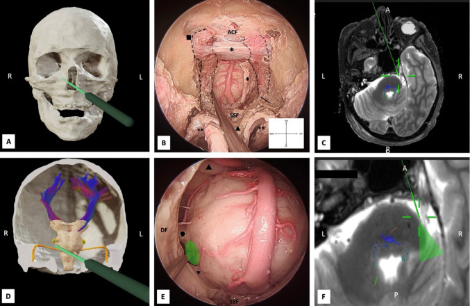
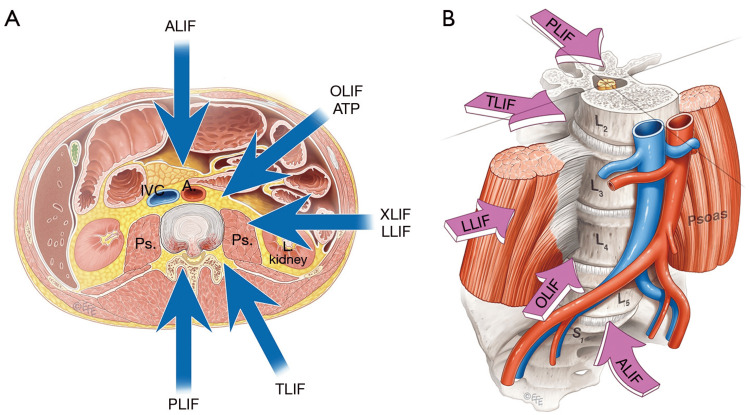
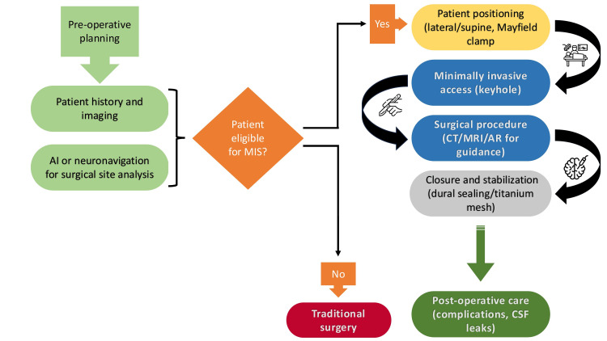
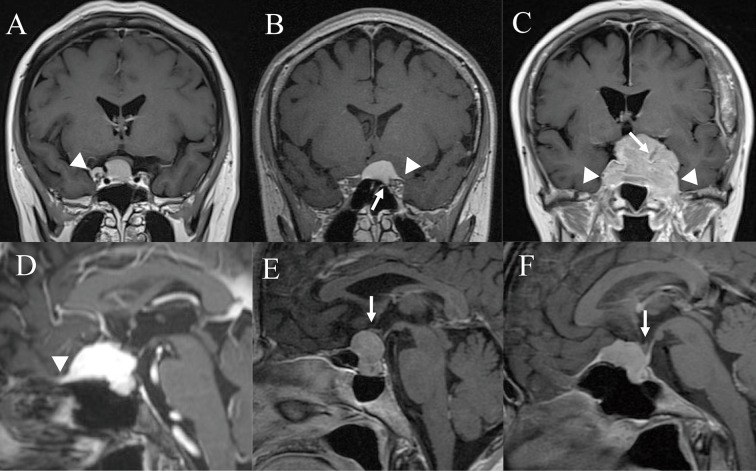
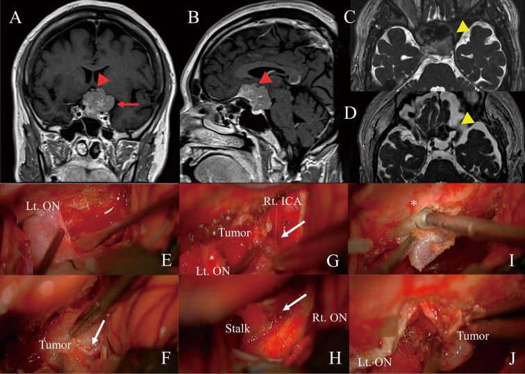

# Approach Selection — Decision Aids

<!-- BEGIN CASE SNAPSHOT -->

## Case / Approach Snapshot

- **Anatomy at risk:** corridor-defining nerves, arteries, veins/sinuses, cisterns, bone landmarks, muscle/fascial planes, and closure structures that determine exposure and morbidity.
- **Operative steps:** confirm position and trajectory, mark landmarks, protect soft tissue and named neurovascular structures, perform the bone/soft-tissue corridor, open/close dura or target compartment deliberately, and verify hemostasis/reconstruction; use the detailed operative sequence and approach notes below as the step-by-step source.
- **Rescue plans:** brain relaxation failure, venous or sinus bleeding, cranial nerve/perforator risk, exposure that is too narrow, CSF leak, cosmetic/temporalis/frontalis problems, and conversion to a wider or alternate corridor.
- **Figures:** review [Figures, Imaging & Video](#figures-imaging--video) and the [Curated Image Set](#curated-image-set); embedded local figures should remain open-access, public-domain, or otherwise reusable with attribution.
- **Papers:** review [High-Yield Literature](#high-yield-literature) for seminal sources, modern reviews, and outcome data specific to this page.

<!-- END CASE SNAPSHOT -->

<!-- BEGIN CURATED LITERATURE -->

## High-Yield Literature

- **Transsylvian-transinsular approaches to the insula and basal ganglia: operative techniques and results with vascular lesions** — Potts MB. Neurosurgery 2012. [PubMed](https://pubmed.ncbi.nlm.nih.gov/21937930/)
- **Decision aids for people facing health treatment or screening decisions** — Stacey D. The Cochrane database of systematic reviews 2017. [PubMed](https://pubmed.ncbi.nlm.nih.gov/28402085/)
- **Decision aids for people facing health treatment or screening decisions** — Stacey D. The Cochrane database of systematic reviews 2024. [PubMed](https://pubmed.ncbi.nlm.nih.gov/38284415/)
- **Application of patient decision aids in treatment selection of cardiac surgery patients: a scoping review** — Zhang D. Heart & lung : the journal of critical care 2022. [PubMed](https://pubmed.ncbi.nlm.nih.gov/35810676/)
- **Comparison of an Artificial Intelligence-Enabled Patient Decision Aid vs Educational Material on Decision Quality, Shared Decision-Making, Patient Experience, and Functional Outcomes in Adults With Knee Osteoarthritis: A Randomized Clinical Trial** — Jayakumar P. JAMA network open 2021. [PubMed](https://pubmed.ncbi.nlm.nih.gov/33599773/)
- **Decision aids for promoting shared decision-making: A review of systematic reviews** — Park M. Nursing & health sciences 2024. [PubMed](https://pubmed.ncbi.nlm.nih.gov/38356102/)
- **Decision aids in patients with osteoporosis: A scoping review** — Fang Y. PloS one 2025. [PubMed](https://pubmed.ncbi.nlm.nih.gov/40663572/)
- **Decision aids for localized prostate cancer treatment choice: Systematic review and meta-analysis** — Violette PD. CA: a cancer journal for clinicians 2015. [PubMed](https://pubmed.ncbi.nlm.nih.gov/25772796/)
- **Patient Decision Aids to Facilitate Shared Decision Making in Obstetrics and Gynecology: A Systematic Review and Meta-analysis** — Poprzeczny AJ. Obstetrics and gynecology 2020. [PubMed](https://pubmed.ncbi.nlm.nih.gov/31923056/)
- **The quality of patient decision aids for lung cancer screening: Results from an environmental scan** — Volk RJ. Cancer 2025. [PubMed](https://pubmed.ncbi.nlm.nih.gov/40889250/)

<!-- END CURATED LITERATURE -->

<!-- BEGIN CURATED IMAGE SET -->

## Curated Image Set

Open-access figures are embedded from PubMed Central articles and kept unique to this guide.

*Fig. 3. Endoscopic-transnasal-transclival approach. A 3D reconstruction of the skull prior to dissection. A neuronavigation probe (green) indicates the trajectory of the right... Source: [Anatomical insights into the peri-trigeminal zone via transorbital, transclival, and retrosigmoid routes: a comparative cadaveric study with surgical implications](https://pmc.ncbi.nlm.nih.gov/articles/PMC12950089/) — Acta Neurochirurgica 2026; CC BY.*

*Figure 2. Overview of Lumbar Interbody Fusion Surgical Approaches(A) Schematic representation of the principal access routes to the lumbar spine, including anterior (ALIF), lateral/extreme lateral... Source: [Interplay of Anatomy and Surgical Approach: A Comparative Review of Neurovascular Risk in Lateral and Oblique Lumbar Interbody Fusion](https://pmc.ncbi.nlm.nih.gov/articles/PMC12923329/) — Cureus 2026; CC BY.*

*Figure 1. Minimally invasive surgery workflowThe figure demonstrates a brief insight into the order of decisions made in minimally invasive surgery. Original image created by the authors. Source: [A Comprehensive Review of the Role of the Latest Minimally Invasive Neurosurgery Techniques and Outcomes for Brain and Spinal Surgeries](https://pmc.ncbi.nlm.nih.gov/articles/PMC12182830/) — Cureus 2025; CC BY.*

*Fig. 1. Key radiologic characteristics used to determine the surgical approach. (A) Lateral extension beyond the internal carotid artery (white arrowhead). (B) Optic canal invasion (white arrow)... Source: [Visual Outcomes and Surgical Approach Selection Focusing on Active Optic Canal Decompression and Maximum Safe Resection for Suprasellar Meningiomas](https://pmc.ncbi.nlm.nih.gov/articles/PMC10556211/) — Neurologia medico-chirurgica 2023; CC BY-NC-ND.*

*Fig. 2. Surgical resection of a suprasellar meningioma using the left sub-frontal approach.(A, B) A 50-year-old woman with long-standing visual dysfunction (Rt, 0.2; Lt, blind) presented with a... Source: [Visual Outcomes and Surgical Approach Selection Focusing on Active Optic Canal Decompression and Maximum Safe Resection for Suprasellar Meningiomas](https://pmc.ncbi.nlm.nih.gov/articles/PMC10556211/) — Neurologia medico-chirurgica 2023; CC BY-NC-ND.*

<!-- END CURATED IMAGE SET -->

Fast, case-conference style corridor selection. Start with the clinical problem, check the deciding anatomy, then jump to the detailed approach or case guide.

  

    Decision support
    <h2>Pick the corridor by the anatomy that can hurt the patient.</h2>
    
These are typical trade-offs, not rules. Final choice depends on patient factors, lesion anatomy, imaging, surgeon experience, institutional practice, and multidisciplinary discussion.

  

  

    <a href="#aneurysm"><b>Aneurysm</b>control, projection, neck</a>
    <a href="#sellar"><b>Sellar</b>midline vs lateral</a>
    <a href="#cpa"><b>CPA</b>hearing, IAC, CNs</a>
    <a href="#cervical"><b>Spine</b>alignment, compression</a>
  

  <a href="#aneurysm">Anterior circulation</a>
  <a href="#sellar">Sellar / suprasellar</a>
  <a href="#cpa">CPA / posterior fossa</a>
  <a href="#petroclival">Petroclival</a>
  <a href="#fourth-pineal">Fourth ventricle / pineal</a>
  <a href="#cervical">Cervical</a>
  <a href="#lumbar">Lumbar fusion</a>
  <a href="#thoracic">Thoracic ventral</a>

> **Use this page as a map, not a mandate.** Confirm with thin-cut MRI/CTA/DSA, venous anatomy, prior surgery/radiation, patient goals, and attending preference.

## First Questions

  
1<h3>Where is the danger?</h3>
Perforators, cranial nerves, eloquent cortex, venous sinuses, spinal cord, or great vessels usually decide the corridor.

  
2<h3>What needs control first?</h3>
Aneurysm proximal control, CSF release, tumor devascularization, distal shunt access, or spine stabilization changes the plan.

  
3<h3>What can you safely leave?</h3>
Sinus wall, cavernous sinus tumor, adherent fourth-ventricle floor, calcified thoracic disc shell, or eloquent glioma margin may define the endpoint.

## Anterior-Circulation Aneurysm {#aneurysm}

| Choose | Best fit | Why it wins | Main limits | If not, consider |
|---|---|---|---|---|
| [Pterional](pterional-craniotomy.html) | MCA, ICA terminus, PComA, many AComA | Fast workhorse; sylvian fissure, opticocarotid triangle, proximal ICA/M1/A1 control | Temporalis atrophy, frontalis risk, limited upward angle for high basilar/giant ICA | [Orbitozygomatic](orbitozygomatic-craniotomy.html) for high/giant lesions |
| [Supraorbital eyebrow](supraorbital-keyhole-craniotomy.html) | Favorable small AComA, selected subfrontal/suprasellar lesions | Cosmetic, short subfrontal route, less temporalis morbidity | Narrow working angles, frontal sinus, limited proximal control | [Pterional](pterional-craniotomy.html) if ruptured/complex/wide neck |
| [Orbitozygomatic](orbitozygomatic-craniotomy.html) | High basilar apex, giant ICA, deep parasellar aneurysm | More inferior-to-superior view with less frontal/temporal retraction | Longer exposure, orbital/cosmetic morbidity | Pterional if the extra basal angle is unnecessary |
| [Endovascular](../endovascular/aneurysm-coiling-flow-diversion.html) | Posterior circulation, poor-grade SAH, elderly/frail, selected wide-neck with stent/FD | Avoids craniotomy; excellent for many posterior lesions | Retreatment, antiplatelets for stents/FD, mass effect not relieved | Clip for MCA bifurcation, branch-incorporated neck, mass effect |

  
<b>Clip-friendly:</b> MCA bifurcation, branch incorporation, young patient, mass effect, failed coil.

  
<b>Endovascular-friendly:</b> posterior circulation, blister/fusiform/FD candidate, poor medical condition.

## Sellar / Suprasellar {#sellar}

| Choose | Best fit | Why it wins | Main limits |
|---|---|---|---|
| [Endoscopic endonasal](endoscopic-endonasal-approach.html) | Pituitary adenoma, midline tuberculum/planum, clival chordoma | Direct ventral midline route; no brain retraction; early sellar/clival access | CSF leak risk, carotid/cavernous sinus limits, poor lateral reach |
| [Supraorbital eyebrow](supraorbital-keyhole-craniotomy.html) | Small midline suprasellar or selected tuberculum lesions | Minimal lateral craniotomy; subfrontal optic-carotid view | Narrow corridor; limited bilateral/lateral control |
| [Pterional](pterional-craniotomy.html) / [OZ](orbitozygomatic-craniotomy.html) | Lateral extension, vascular encasement, giant suprasellar tumors | Wide vascular control; lateral optic/carotid access | Brain retraction, optic manipulation, more exposure morbidity |
| [Bifrontal](bifrontal-craniotomy.html) | Large olfactory groove/planum with bilateral anterior base exposure | Bilateral devascularization and pericranial reconstruction | Anosmia, frontal lobe/venous risks |

## Cerebellopontine Angle & Lateral Posterior Fossa {#cpa}

| Choose | Best fit | Hearing strategy | Practical note |
|---|---|---|---|
| [Retrosigmoid](retrosigmoid-craniotomy.html) | Vestibular schwannoma, CPA meningioma/epidermoid, MVD | Hearing can be preserved when anatomy/physiology allows | Workhorse; good CPA view; any size, but IAC fundus may be harder |
| Translabyrinthine | Vestibular schwannoma with non-serviceable hearing | Hearing sacrificed | Direct IAC/fundus exposure; no cerebellar retraction |
| [Presigmoid / petrosal](presigmoid-petrosal-approach.html) | Large petroclival / anterior CPA lesions | Variant-dependent | More exposure but more time, CSF leak, facial/hearing risk |
| [Far-lateral](far-lateral-craniotomy.html) | Foramen magnum, VA/PICA, lower cranial nerve lesions | Not hearing-centered | Ventral craniocervical junction access |

## Petroclival Lesion {#petroclival}

| Choose | Reach | Trade-off |
|---|---|---|
| [Retrosigmoid ± suprameatal](retrosigmoid-craniotomy.html) | Mid/posterior petrous face, CPA component | Least morbid, but limited ventral/upper clival reach |
| [Subtemporal + anterior petrosectomy/Kawase](subtemporal-craniotomy.html) | Upper clivus, ventral pons, Meckel cave | Temporal lobe, vein of Labbe, hearing/CSF considerations |
| [Combined petrosal](presigmoid-petrosal-approach.html) | Broad petroclival exposure, upper-to-lower clivus | Most exposure; highest time, CSF leak, facial/hearing morbidity |

## Fourth Ventricle / Pineal {#fourth-pineal}

| Choose | Best fit | Why it wins |
|---|---|---|
| [Telovelar](telovelar-approach.html) | Fourth-ventricle tumors from obex to aqueduct | Vermis-sparing, cerebellomedullary fissure route, less mutism risk |
| [Supracerebellar-infratentorial](supracerebellar-infratentorial-approach.html) | Pineal region, posterior third ventricle | Midline gravity-assisted route above cerebellum |
| [Midline suboccipital](midline-suboccipital-craniotomy.html) | Posterior fossa exposure, Chiari, bony setup for telovelar | Core posterior fossa exposure and closure principles |

## Cervical Degenerative Disease {#cervical}

| Choose | Best fit | Avoid when |
|---|---|---|
| [Anterior cervical / ACDF / arthroplasty](anterior-cervical-approach.html) | 1-3 level ventral disc/osteophyte disease, kyphosis, focal radiculopathy | Long multilevel OPLL, poor anterior corridor, high dysphagia/revision risk |
| [Posterior cervical](posterior-cervical-approach.html) | Multilevel stenosis with lordosis, OPLL where cord can drift back | Fixed kyphosis, focal ventral disease requiring direct anterior decompression |

  
<b>Anterior bias:</b> kyphosis, focal ventral compression, radiculopathy from disc/uncinate disease.

  
<b>Posterior bias:</b> multilevel compression, preserved lordosis, dorsal elements useful for decompression/fusion.

## Lumbar Interbody Fusion {#lumbar}

| Choose | Corridor | Best fit | Watch |
|---|---|---|---|
| [TLIF](../spine-degenerative/tlif.html) | Posterior unilateral facetectomy/Kambin | 1-2 level disease, direct decompression needed, revision-friendly posterior plan | Exiting/traversing root, cage trajectory, dural scarring |
| PLIF | Posterior bilateral | Central access, bilateral cage option | More neural retraction |
| [ALIF](../spine-degenerative/alif.html) | Anterior retroperitoneal | L5-S1/L4-5 lordosis restoration, large cage, indirect foraminal height | Great vessels, sympathetic plexus, access surgeon, retrograde ejaculation |
| [LLIF / OLIF](transpsoas-approach.html) | Lateral / oblique retroperitoneal | L1-2 to L4-5 indirect decompression, coronal correction, large cage | Lumbar plexus/psoas, vascular anatomy, not L5-S1 |

## Thoracic Disc / Anterior Column {#thoracic}

| Choose | Best fit | Key point |
|---|---|---|
| Transpedicular / costotransversectomy | Lateral or paracentral soft disc | Posterolateral access without cord retraction |
| Lateral extracavitary / mini-open lateral | Ventral disc or corpectomy while avoiding chest cavity | Retropleural / posterolateral working angle |
| [Transthoracic / thoracoscopic](transthoracic-approach.html) | Central calcified disc, thoracic corpectomy, ventral tumor | Direct ventral decompression; lung isolation, segmental vessels, Adamkiewicz awareness |
| **Avoid simple posterior laminectomy for central thoracic disc** | Central ventral compression | Laminectomy alone invites cord retraction and neurological injury |

## Evidence & Figure Anchors

  <a href="https://pubmed.ncbi.nlm.nih.gov/12414200/"><b>Aneurysm clipping vs coiling</b>ISAT, Lancet 2002: baseline trial anchor for ruptured aneurysm clip/coil counseling.</a>
  <a href="https://pubmed.ncbi.nlm.nih.gov/34181733/"><b>Meningioma / skull base</b>EANO 2021 guideline: diagnosis, observation, surgery, radiation, recurrence-risk framing.</a>
  <a href="https://pubmed.ncbi.nlm.nih.gov/?term=vestibular+schwannoma+guideline+Congress+Neurological+Surgeons"><b>CPA / vestibular schwannoma</b>CNS guideline searches: hearing, facial nerve, observation, SRS, and microsurgery trade-offs.</a>
  <a href="https://pubmed.ncbi.nlm.nih.gov/?term=endoscopic+versus+microscopic+transsphenoidal+pituitary+adenoma+meta-analysis"><b>Sellar endoscopy</b>Meta-analyses for endoscopic vs microscopic transsphenoidal outcomes and CSF-leak trade-offs.</a>
  <a href="https://pubmed.ncbi.nlm.nih.gov/29164035/"><b>Cervical myelopathy</b>Degenerative cervical myelopathy guideline: severity, cord compression, anterior/posterior planning.</a>
  <a href="https://pubmed.ncbi.nlm.nih.gov/27074067/"><b>Lumbar spondylolisthesis</b>SLIP trial: decompression with vs without fusion for selected degenerative spondylolisthesis.</a>
  <a href="https://pubmed.ncbi.nlm.nih.gov/27074066/"><b>Lumbar stenosis fusion</b>Swedish randomized trial: fusion vs decompression alone in lumbar stenosis.</a>
  <a href="https://pubmed.ncbi.nlm.nih.gov/16112300/"><b>Metastatic cord compression</b>Patchell trial: surgery plus radiotherapy for selected metastatic epidural spinal cord compression.</a>
  <a href="https://pubmed.ncbi.nlm.nih.gov/23709750/"><b>Spine oncology framework</b>NOMS framework: neurologic, oncologic, mechanical, systemic decision structure.</a>
  <a href="../../resources/media-sources.html"><b>Figures & video sources</b>Atlas, AO Spine / Surgery Reference, Radiopaedia, PMC, and linked/copyright-safe figure policy.</a>

<!-- BEGIN CHIEF LEVEL TAKEAWAYS -->

## Chief-Level Corridor Review

Use these as the senior-level mental model for **Approach Selection — Decision Aids**:

- **Decision point:** Define the exposure goal before incision: target, working angles, proximal/distal control, and the structure that cannot tolerate retraction.
- **Technical lever:** Know the first irreversible step: bone removal, dural opening, vascular control, or muscle/fascial division that commits the corridor.
- **Bailout:** Verbalize the bailout: extend exposure, change trajectory, add CSF drainage, obtain proximal control, convert to a larger corridor, or stop for imaging.
- **Postop watch:** Protect closure from the start: vascularized tissue, watertight dural/reconstruction plan, dead-space control, and drain strategy should be chosen before the final intradural step.

<!-- END CHIEF LEVEL TAKEAWAYS -->

<!-- BEGIN COMMON PIMP QUESTIONS -->

## Common Pimp Questions

Use these to pressure-test preparation for **Approach Selection — Decision Aids**:

1. What patient position and head rotation make gravity work for this corridor?
2. What named nerve, vessel, sinus, or muscle/fascial plane is most commonly injured?
3. What bone work or soft-tissue step creates the exposure rather than simply using more retraction?
4. What is the bailout if exposure is inadequate, bleeding occurs, or the brain is tight?
5. What closure maneuver prevents the signature complication of this approach?

<!-- END COMMON PIMP QUESTIONS -->

<!-- BEGIN ATTENDING PREFERENCE VARIABLES -->

## Attending Preference Variables

Items that commonly vary by surgeon or institution:

- **Exact head rotation/flexion/extension and pin placement:** [attending-specific]
- **Skin incision length, flap type, and muscle/fascial preservation technique:** [attending-specific]
- **Drill, rongeur, endoscope, microscope, retractor, and navigation preferences:** [attending-specific]
- **Drain use, closure materials, watertightness threshold, and postop imaging routine:** [attending-specific]

<!-- END ATTENDING PREFERENCE VARIABLES -->

<!-- BEGIN REVERSE APPROACH LINKS -->

## Case Guides Using This Approach

- No case guide currently links directly to this approach.

<!-- END REVERSE APPROACH LINKS -->

## References & Next Steps

  <a href="index.html"><b>All approach chapters</b>Positioning, incision, bone work, closure, figures</a>
  <a href="../../resources/media-sources.html"><b>Media sources</b>Where linked figures, videos, and open images come from</a>
  <a href="../../templates/case-prep-template.html"><b>Case template</b>Blank prep scaffold for patient-specific notes</a>

---
