# Operative Approach: Bifrontal (Subfrontal) Craniotomy

<!-- BEGIN CASE SNAPSHOT -->

## Case / Approach Snapshot

- **Anatomy at risk:** frontal sinus, supraorbital/supratrochlear pedicles, pericranial flap, anterior third of SSS/falx, frontal bridging veins, olfactory bulbs/tracts, cribriform/ethmoid roof, ethmoidal arteries, optic apparatus, ACA/AComA complex, and anterior skull-base reconstruction planes.
- **Operative steps:** plan sinus/pericranial reconstruction, raise bicoronal flap and vascularized pericranium, create low bifrontal exposure, cranialize frontal sinus when entered, divide anterior SSS/falx only when appropriate, relax frontal lobes, devascularize tumor/base, protect optic/ACA structures, and close with watertight anterior-fossa separation.
- **Rescue plans:** frontal sinus violation, pneumatized crista galli, CSF rhinorrhea risk, venous bleeding, frontal-lobe swelling, ethmoidal artery retraction into orbit, optic/ACA adherence, anosmia counseling, and need to convert to unilateral, endonasal, or combined craniofacial strategy.
- **Figures:** review [Figures, Imaging & Video](#figures-imaging--video) and the [Curated Image Set](#curated-image-set); embedded local figures should remain open-access, public-domain, or otherwise reusable with attribution.
- **Papers:** review [High-Yield Literature](#high-yield-literature) for seminal sources, modern reviews, and outcome data specific to this page.
- **Textbook cross-checks:** use [Textbook Cross-Checks](#textbook-cross-checks) and the [Source Crosswalk](../../resources/source-crosswalk.md) to cite copyrighted textbooks/atlases while summarizing in original words.

<!-- END CASE SNAPSHOT -->

> **About the figures.** Copyrighted operative figures/videos are **linked** (Neurosurgical Atlas); embedded images are **public-domain** (Gray's Anatomy) or **CC‑BY** (open-access), credited beneath each image. See [media-sources.md](../../resources/media-sources.md) and [figures/CREDITS.md](../../figures/CREDITS.md).
>
> **Atlas chapters:** [Olfactory Groove Meningioma (bifrontal technique) — Neurosurgical Atlas](https://www.neurosurgicalatlas.com/volumes/cranial-base-surgery/skull-base-meningioma/olfactory-groove-meningioma) · [Pterional Craniotomy](https://www.neurosurgicalatlas.com/volumes/cranial-approaches/pterional-craniotomy)

The bifrontal (subfrontal) craniotomy is the **wide, bilateral midline corridor to the anterior cranial fossa floor.** Through a **bicoronal incision**, a **frontal bone flap crossing the superior sagittal sinus** is elevated and the frontal lobes are gently retracted to expose the **planum, cribriform plate, crista galli, both orbital roofs, and the suprasellar region** in a single bilateral field. It is the classic approach for **large midline anterior skull base tumors** (olfactory groove and planum meningiomas, sinonasal tumors with intracranial extension) and for **anterior skull base / CSF-leak reconstruction**, where its bilateral exposure and **vascularized pericranial flap** are decisive.

---

## Figures, Imaging & Video

**🎥 Operative video** — [search operative video on YouTube ▸](https://www.youtube.com/results?search_query=olfactory+groove+meningioma+surgery) · [The Neurosurgical Atlas ▸](https://www.neurosurgicalatlas.com)

[Neurosurgical Atlas — olfactory groove / anterior base](https://www.neurosurgicalatlas.com/volumes/cranial-base-surgery/skull-base-meningioma/olfactory-groove-meningioma) · [Radiopaedia — olfactory groove meningioma](https://radiopaedia.org/search?q=olfactory%20groove%20meningioma&scope=all) · [PubMed Central — bifrontal craniotomy](https://www.ncbi.nlm.nih.gov/pmc/?term=bifrontal+craniotomy+anterior+skull+base)

---

<!-- BEGIN TEXTBOOK CROSS-CHECKS -->

## Textbook Cross-Checks

- **Microsurgical corridor anatomy:** Rhoton Cranial Anatomy; Brain Anatomy and Neurosurgical Approaches; Youmans and Winn — confirm surface landmarks, bone-removal limits, cisternal/venous relationships, and the named neurovascular structures that define the working corridor.
- **Technique sequence:** Schmidek and Sweet; Youmans and Winn; Neurosurgical Atlas chapter links — review positioning, incision, soft-tissue handling, bone work, dural opening, and intradural exposure sequence.
- **Complication avoidance:** Rhoton; Greenberg; approach-specific operative references — cross-check cranial nerve, venous, sinus, perforator, CSF-leak, and cosmetic risks before committing to the corridor.
- **Copyright-safe use:** cite these sources as private cross-checks, then write the guide content in original words; do not re-host textbook pages, figures, tables, or board-review card material. See [Source Crosswalk & Copyright-Safe Use](../../resources/source-crosswalk.md).

<!-- END TEXTBOOK CROSS-CHECKS -->

<!-- BEGIN CURATED LITERATURE -->

## High-Yield Literature

- **Microsurgical Anatomy Review of Bifrontal Limited Transbasal Approach - Quantitative and Anatomy Study** — Ng AF. World neurosurgery 2020. [PubMed](https://pubmed.ncbi.nlm.nih.gov/32113996/)
- **Anatomical Step-by-Step Dissection of Complex Skull Base Approaches for Trainees: Surgical Anatomy of the Bifrontal Transbasal Approach, Surgical Principles, and Illustrative Cases** — Vilany L. Journal of neurological surgery. Part B, Skull base 2024. [PubMed](https://pubmed.ncbi.nlm.nih.gov/39483163/)
- **[Olfactory groove meningiomas. Radical microsurgical treatment through the bifrontal approach]** — González-Darder JM. Neurocirugia (Asturias, Spain) 2011. [PubMed](https://pubmed.ncbi.nlm.nih.gov/21597654/)
- **Olfactory groove meningiomas from neurosurgical and ear, nose, and throat perspectives: approaches, techniques, and outcomes** — Spektor S. Neurosurgery 2005. [PubMed](https://pubmed.ncbi.nlm.nih.gov/16234674/)
- **Operative Technique and Complication Management in a Case of Giant Esthesioneuroblastoma Resected by a Combined Transcranial and Endonasal Endoscopic Approach: Technical Case Report** — McAvoy M. Operative neurosurgery (Hagerstown, Md.) 2023. [PubMed](https://pubmed.ncbi.nlm.nih.gov/36804514/)
- **Vascularized anterolateral thigh free flap for salvage reconstruction of complex anterior skull base and nasion defects after failed conventional reconstruction- how I do it** — Liu H. Acta neurochirurgica 2026. [PubMed](https://pubmed.ncbi.nlm.nih.gov/42065774/)
- **Microsurgical Resection of a Primary Intraosseous Meningioma Encasing the Superior Sagittal Sinus** — Ene CI. The Journal of craniofacial surgery 2020. [PubMed](https://pubmed.ncbi.nlm.nih.gov/32657980/)
- **Validity of the frontolateral approach as a minimally invasive corridor for olfactory groove meningiomas** — El-Bahy K. Acta neurochirurgica 2009. [PubMed](https://pubmed.ncbi.nlm.nih.gov/19730777/)
- **Olfactory groove meningiomas: functional outcome in a series treated microsurgically** — Bassiouni H. Acta neurochirurgica 2007. [PubMed](https://pubmed.ncbi.nlm.nih.gov/17180303/)
- **Precision in Complexity: A Protocol-Driven Quantitative Anatomic Strategy for Giant Olfactory Groove Meningioma Resection in a High-Risk Geriatric Patient** — Grigorean VT. Diagnostics (Basel, Switzerland) 2026. [PubMed](https://pubmed.ncbi.nlm.nih.gov/41515621/)

<!-- END CURATED LITERATURE -->

---

<!-- BEGIN CURATED IMAGE SET -->

## Curated Image Set

Open-access figures are embedded from PubMed Central articles and kept unique to this guide.

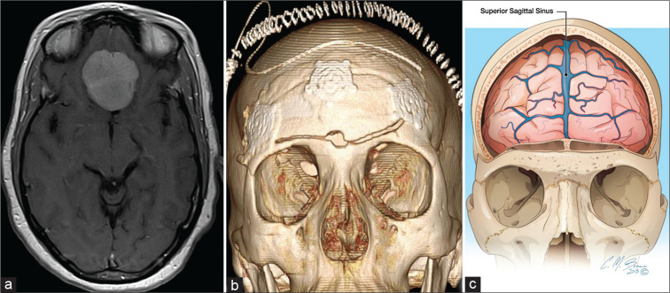
*Figure 1:. A 40-year-old man with planum sphenoidale meningioma on an axial T1 magnetic resonance imaging with gadolinium (a), requiring frontal craniotomy. Three-dimensional volume rendering (b)... Source: [An Illustrative Review of Common Modern Craniotomies](https://pmc.ncbi.nlm.nih.gov/articles/PMC7771396/) — Journal of Clinical Imaging Science 2020; CC BY-NC-SA.*

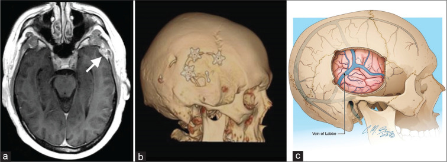
*Figure 2:. A 63-year-old man with the left temporal sclerosing meningioma (a – arrow) on axial T1 MRI with gadolinium, requiring temporal craniotomy. Three-dimensional volume rendering (b)... Source: [An Illustrative Review of Common Modern Craniotomies](https://pmc.ncbi.nlm.nih.gov/articles/PMC7771396/) — Journal of Clinical Imaging Science 2020; CC BY-NC-SA.*

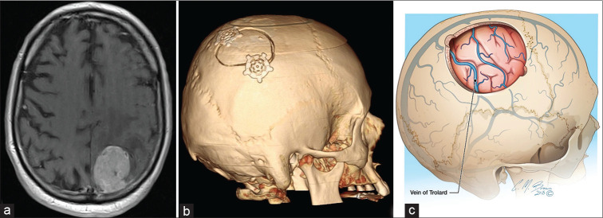
*Figure 3:. A 78-year-old man with the left parietal melanoma metastasis (a) on axial T1 MRI with gadolinium. Three-dimensional volume rendering (b) demonstrates parietal craniotomy, the preferred... Source: [An Illustrative Review of Common Modern Craniotomies](https://pmc.ncbi.nlm.nih.gov/articles/PMC7771396/) — Journal of Clinical Imaging Science 2020; CC BY-NC-SA.*

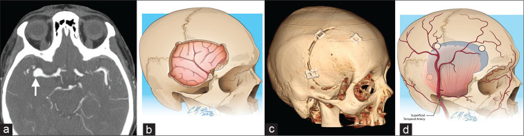
*Figure 4:. A 69-year-old woman with the right middle cerebral artery aneurysm (a – arrow) on axial CT angiogram. Sagittal oblique illustration (b) and three-dimensional volume rendering (c)... Source: [An Illustrative Review of Common Modern Craniotomies](https://pmc.ncbi.nlm.nih.gov/articles/PMC7771396/) — Journal of Clinical Imaging Science 2020; CC BY-NC-SA.*

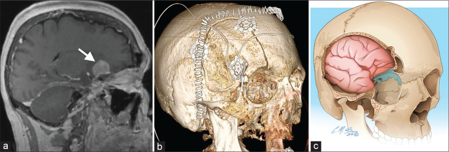
*Figure 5:. A 55-year-old woman with the right paraclinoid meningioma (a – arrow) on sagittal T1 magnetic resonance imaging. Three-dimensional volume rendering (b) demonstrates post-operative... Source: [An Illustrative Review of Common Modern Craniotomies](https://pmc.ncbi.nlm.nih.gov/articles/PMC7771396/) — Journal of Clinical Imaging Science 2020; CC BY-NC-SA.*

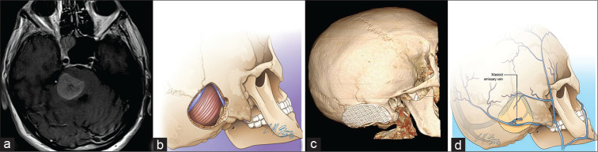
*Figure 6:. A 59-year-old man with pontine melanoma metastasis (a) on axial T1 magnetic resonance imaging. Sagittal oblique illustration (b) and three-dimensional volume rendering (c) demonstrating... Source: [An Illustrative Review of Common Modern Craniotomies](https://pmc.ncbi.nlm.nih.gov/articles/PMC7771396/) — Journal of Clinical Imaging Science 2020; CC BY-NC-SA.*

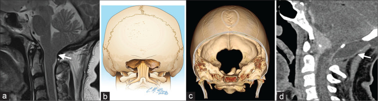
*Figure 7:. A 45-year-old woman with Chiari I malformation (a – arrow) on axial and sagittal T2W magnetic resonance imaging. Coronal view illustration (b) and three-dimensional volume rendering (c)... Source: [An Illustrative Review of Common Modern Craniotomies](https://pmc.ncbi.nlm.nih.gov/articles/PMC7771396/) — Journal of Clinical Imaging Science 2020; CC BY-NC-SA.*

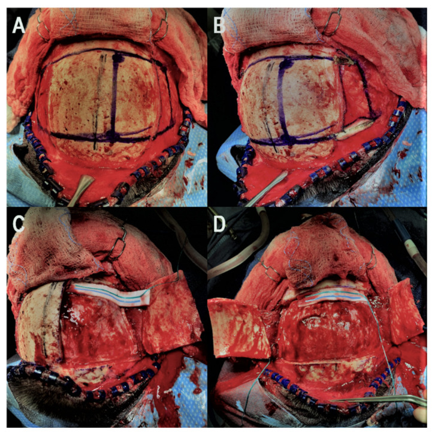
*Figure 1. Illustration of the key steps for the bifrontal osteoplastic flap technique. (A): The midline is identified using the sagittal suture and the six necessary burr holes are marked. (B):... Source: [Bifrontal Osteoplastic Flap: An Option to Decrease Infection in Bifrontal Craniotomies with Skull Base Osteotomies](https://pmc.ncbi.nlm.nih.gov/articles/PMC8870631/) — Brain Sciences 2022; CC BY.*

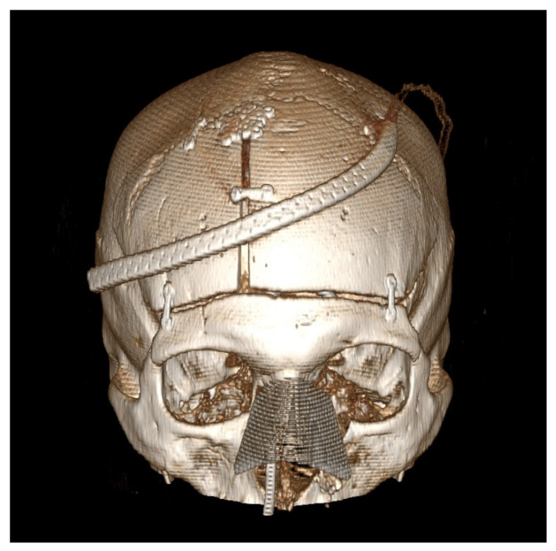
*Figure 2. Post-operative computed tomography 3D reconstruction of the patient is presented in Figure 1. This patient underwent a combined bifrontal osteoplastic flap and transnasal approach for... Source: [Bifrontal Osteoplastic Flap: An Option to Decrease Infection in Bifrontal Craniotomies with Skull Base Osteotomies](https://pmc.ncbi.nlm.nih.gov/articles/PMC8870631/) — Brain Sciences 2022; CC BY.*

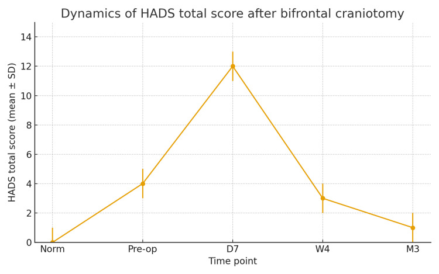
*Figure 1. HADS score timeline.HADS: Hospital Anxiety and Depression Scale Source: [Transient Psychiatric Disturbances Following Bifrontal Craniotomy for Suprasellar Tumors](https://pmc.ncbi.nlm.nih.gov/articles/PMC12740201/) — Cureus 2025; CC BY.*

<!-- END CURATED IMAGE SET -->

---

## General Considerations
- **What it accesses:** the entire **anterior cranial fossa floor** bilaterally — crista galli/cribriform, planum sphenoidale, both orbital roofs, the suprasellar cistern, and (posteriorly) the optic nerves/chiasm and the **ACA/AComA complex.**
- **Why bilateral:** large midline tumors that **cross the midline and splay both frontal lobes** are addressed in one field with excellent orientation; the approach also gives the **best access for watertight anterior-fossa-floor reconstruction** (large dural/bony defects, CSF leaks) using a long **pericranial flap.**
- **The cost is olfaction and frontal-lobe handling.** For olfactory groove meningiomas the **olfactory tracts are usually sacrificed** (anosmia); bifrontal retraction and anterior SSS ligation carry frontal-lobe and venous considerations. Lateralized or smaller lesions are increasingly done via **[supraorbital keyhole](supraorbital-keyhole-craniotomy.md)**, unilateral subfrontal/**[pterional](pterional-craniotomy.md)**, or **[endoscopic endonasal](endoscopic-endonasal-approach.md)** routes — reserve the full bifrontal for **large midline** disease and reconstruction needs.

### Indications
- **Large olfactory groove meningioma** (prototype) → [olfactory-groove-meningioma.md](../cranial-tumor/olfactory-groove-meningioma.md)
- **Planum / large tuberculum sellae meningioma** crossing midline → [tuberculum-sellae-meningioma.md](../cranial-tumor/tuberculum-sellae-meningioma.md)
- **Sinonasal tumors with intracranial extension** (cranionasal/craniofacial), esthesioneuroblastoma
- **Traumatic anterior skull base** fractures / **CSF rhinorrhea** repair, anterior fossa reconstruction

### Corridor Selection

| Lesion pattern | Bifrontal advantage | Alternative to consider |
|----------------|--------------------|-------------------------|
| Large midline olfactory groove tumor with bilateral extension | Bilateral devascularization and reconstruction field | Unilateral subfrontal/pterional for smaller lateralized tumors |
| Large planum/tuberculum tumor with major optic canal work | Wide midline access and optic apparatus control | Pterional/OZ for lateral optic canal/cavernous extension; endonasal for selected midline inferior tumors |
| Sinonasal tumor crossing skull base | Combined craniofacial field and pericranial flap | Endoscopic endonasal alone for limited midline disease |
| Traumatic anterior fossa CSF leak with broad defect | Direct multilayer floor repair | Endoscopic repair for focal medial leaks |
| Small anterior skull-base lesion with preserved olfaction priority | Often excessive | Supraorbital keyhole, pterional, or endonasal depending on origin |

The bifrontal approach is a reconstruction-heavy corridor. If a robust pericranial flap and sinus plan are not needed, ask whether a unilateral or endonasal route gives the same target control with less frontal-lobe cost.

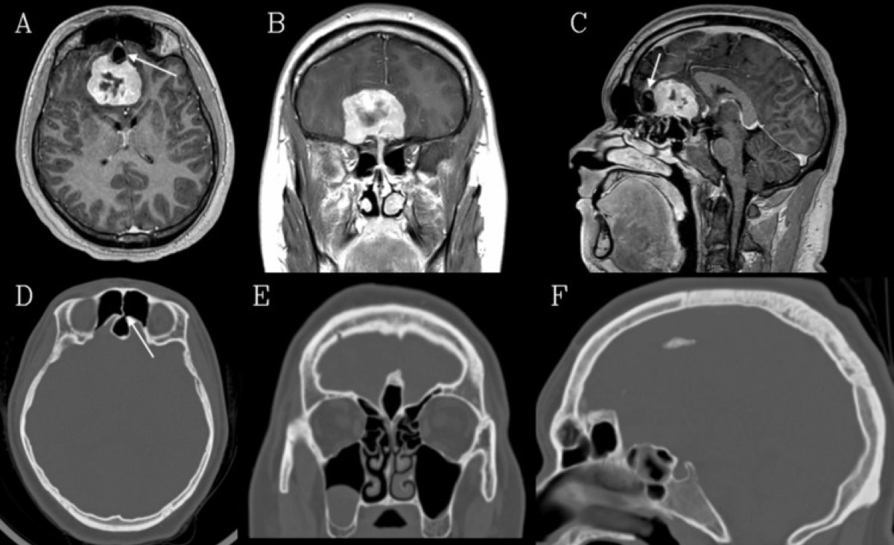

*Cureus 2026;18:e101289 (PMC12889192) — CC BY 4.0. The prototypical bifrontal target; the **pneumatized crista galli** (arrows) warns of an anterior-fossa CSF communication.*

---

## Relevant Surgical Anatomy
- **Scalp / bicoronal flap & pericranium:** the **vascularized pericranial flap** (supraorbital/supratrochlear pedicled) is harvested with the exposure — the **workhorse of anterior-fossa-floor reconstruction.**
- **Frontal sinus:** routinely entered by a low bifrontal flap → must be **cranialized** (mucosa exenterated, duct plugged, buttressed) to prevent mucocele/CSF leak.
- **Superior sagittal sinus (SSS) & falx:** the **anterior third of the SSS can be ligated and divided** (with the falx) to open the interhemispheric midline; the posterior SSS cannot.
- **Anterior fossa floor:** **crista galli, cribriform plate, anterior/posterior ethmoidal arteries** (the dural blood supply of olfactory groove meningiomas — coagulated early at the base), **olfactory bulbs/tracts**, planum, **tuberculum/optic canals.**
- **Posterior limit:** optic nerves/chiasm and the **ACA–AComA complex** — the deep neurovascular boundary.

## Preoperative Evaluation
- **CT (bone):** **frontal sinus and crista galli pneumatization**, cribriform/ethmoid involvement, hyperostosis, and bony invasion (see figure); plan sinus cranialization and floor reconstruction.
- **MRI ± CTA:** tumor extent/vascularity, **brain edema**, optic apparatus and **ACA** encasement; consider **preoperative embolization** for very vascular tumors.
- **Vision and endocrine** baseline; counsel re: **anosmia** and CSF-leak risk. Plan the **pericranial flap.**

### Reconstruction Plan Before Incision
- Identify frontal sinus boundaries and nasofrontal ducts on CT; decide whether the sinus will be avoided, exenterated, or fully cranialized.
- Check for pneumatized crista galli, ethmoid roof defects, and sinonasal extension; these often determine the need for multilayer repair.
- Plan a pericranial flap long enough to reach the planum/cribriform defect without tension; preserve pedicles during scalp reflection.
- Decide whether lumbar drainage is needed and when it is safe; avoid early overdrainage before dural opening if there is major mass effect.
- Coordinate ENT/plastics when sinonasal resection, orbital wall work, free flap, or complex revision reconstruction is expected.

## Anesthesia & Neuromonitoring
- GA; **lumbar drain** to aid frontal-lobe relaxation (drain after dura is open); navigation; vision-relevant monitoring as indicated. Normotension.

---

## Positioning

- **Supine, head neutral**, in Mayfield, with **slight extension** so the frontal lobes fall away from the anterior fossa floor (gravity retraction); vertex neutral. Bicoronal field prepped.

## Incision, Pericranial Flap & Craniotomy

1. **Bicoronal incision** behind the hairline; reflect the scalp and **harvest a long, robust pericranial flap** (preserve its supraorbital/supratrochlear pedicles) for later floor reconstruction.
2. **Bifrontal bone flap** low to the anterior fossa floor, **crossing the SSS** (strip the sinus off the inner table carefully). 
3. **Frontal sinus cranialization** when entered: exenterate mucosa, occlude the nasofrontal duct, and buttress with pericranium — a key CSF-leak/mucocele preventer.
4. Open the dura along the floor; **ligate and divide the anterior SSS and falx** if a midline interhemispheric corridor is needed.

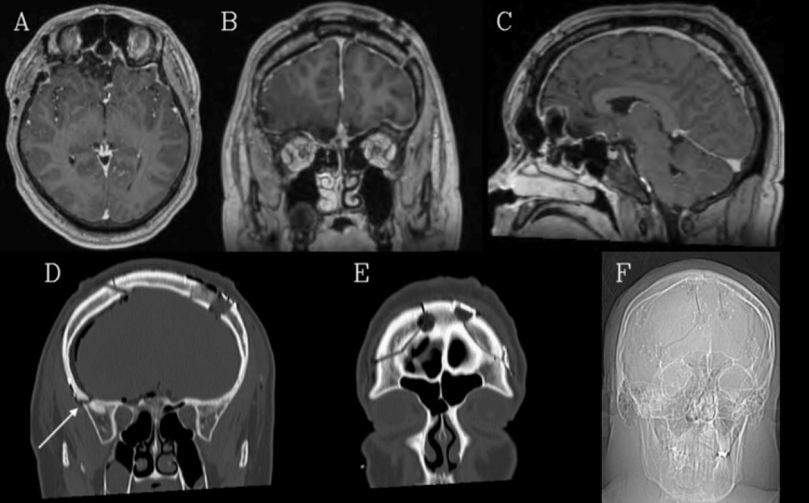

*Cureus 2026;18:e101289 — CC BY 4.0. Bifrontal craniotomy outlines after midline anterior-skull-base tumor resection.*

## Subfrontal Exposure & Tumor Work

- After CSF release (lumbar drain), **gently elevate the frontal lobes** to expose the floor. **Devascularize the tumor base early** by coagulating the **ethmoidal arteries** at the cribriform; **drill hyperostotic bone/crista galli** and remove involved dura (Simpson grade).
- Internally debulk, then dissect the capsule off the **frontal lobes, optic nerves/chiasm, and ACA–AComA complex** posteriorly, preserving perforators. For invasive tumors, resect involved cribriform/ethmoid and plan a **cranionasal reconstruction.**

### Tumor and Skull-Base Work Sequence
1. Open cisterns or drain CSF after the dura is open to relax the frontal lobes.
2. Identify both olfactory bulbs/tracts early; if preservation is unrealistic, sacrifice deliberately rather than avulsing them during retraction.
3. Coagulate ethmoidal/cribriform dural supply at the base before deep debulking to reduce blood loss.
4. Debulk centrally, then roll the capsule away from frontal lobes, optic nerves, chiasm, ACA/AComA, and perforators under direct vision.
5. Drill hyperostotic crista galli/planum/orbital roof bone until healthy bone margins are reached, balancing Simpson grade with reconstruction risk.
6. Treat invaded dura and sinonasal communication as a skull-base reconstruction problem, not merely a tumor-removal problem.

### Intraoperative Rescue
- **Frontal-lobe swelling:** stop fixed retraction, drain CSF safely, optimize venous outflow/head position, mannitol/hyperventilation as appropriate, and avoid pushing deeper until the brain relaxes.
- **Anterior SSS/falx bleeding:** control with clips/suture/packing only in the anterior third; preserve posterior drainage and bridging veins.
- **Ethmoidal artery bleeding into orbit:** coagulate/clip at the cranial base before it retracts; monitor orbit and avoid orbital compartment syndrome.
- **ACA/perforator adherence:** leave a rind rather than avulsing a perforator; postoperative radiosurgery is better than an avoidable infarct.
- **Unexpected sinus contamination:** complete cranialization, remove mucosa, obliterate ducts, isolate with vascularized pericranium, and consider antibiotics/drainage strategy.

---

## Closure & Anterior-Fossa Reconstruction
- **Watertight dural closure** (graft as needed); **lay the vascularized pericranial flap across the anterior fossa floor** to seal any dural/bony defect and separate cranium from sinonasal cavity — the cornerstone of CSF-leak prevention.
- **Complete frontal-sinus cranialization**; replace the bone flap; meticulous scalp closure. Lumbar drain managed per leak risk.

---

## Nuances & Pitfalls (surgeon-level)
- **Anosmia** is expected with OGM resection — counsel preoperatively; bilateral olfactory tracts are usually sacrificed.
- **Frontal sinus & pneumatized crista galli** (see figure) are the CSF-leak/mucocele traps — **cranialize the sinus and reconstruct the floor with pericranium.**
- **SSS:** only the **anterior third** may be ligated; preserve the rest to avoid **venous infarction.**
- **Frontal-lobe retraction/edema:** relax with the lumbar drain and gravity; minimize/avoid fixed retraction; bifrontal contusion/edema causes abulia/cognitive change.
- **Control the ethmoidal arteries early** at the base — both to devascularize the tumor and to prevent retraction of a bleeding vessel into the orbit.
- **Posterior limit:** protect the **optic apparatus and ACA complex**; don't chase tumor blindly into the chiasmatic/interpeduncular region.
- **Harvest a generous pericranial flap at the start** — you cannot make it later.

## Complications
**Anosmia**; **CSF rhinorrhea / mucocele**; frontal-lobe retraction injury, **edema/contusion, abulia/cognitive change**; **SSS/venous infarction**; visual loss; **ACA/perforator injury**; seizures; wound/bone-flap infection; cosmetic/contour issues.

---

## Cross-links
- Pathology: [olfactory-groove-meningioma.md](../cranial-tumor/olfactory-groove-meningioma.md) · [tuberculum-sellae-meningioma.md](../cranial-tumor/tuberculum-sellae-meningioma.md)
- Related corridors: [supraorbital-keyhole-craniotomy.md](supraorbital-keyhole-craniotomy.md) · [anterior-interhemispheric-approach.md](anterior-interhemispheric-approach.md) · [endoscopic-endonasal-approach.md](endoscopic-endonasal-approach.md) · [pterional-craniotomy.md](pterional-craniotomy.md)

## References
1. Tomasello F, et al. **Bifrontal approach for anterior skull base meningiomas** (olfactory tract preservation considerations).
2. Spektor S, et al. **Olfactory groove meningiomas: comparison of bifrontal vs unilateral approaches.**
3. DeMonte F, et al. **Anterior skull base surgery and pericranial flap reconstruction.**
4. **Crista Galli Pneumatization Complicating Olfactory Groove Meningioma Resection.** *Cureus.* 2026;18:e101289. CC BY 4.0. (figures embedded above) — [PMC12889192](https://pmc.ncbi.nlm.nih.gov/articles/PMC12889192/)
5. Cohen-Gadol AA. *Olfactory Groove Meningioma / bifrontal technique.* The Neurosurgical Atlas. [link](https://www.neurosurgicalatlas.com/volumes/cranial-base-surgery/skull-base-meningioma/olfactory-groove-meningioma)
