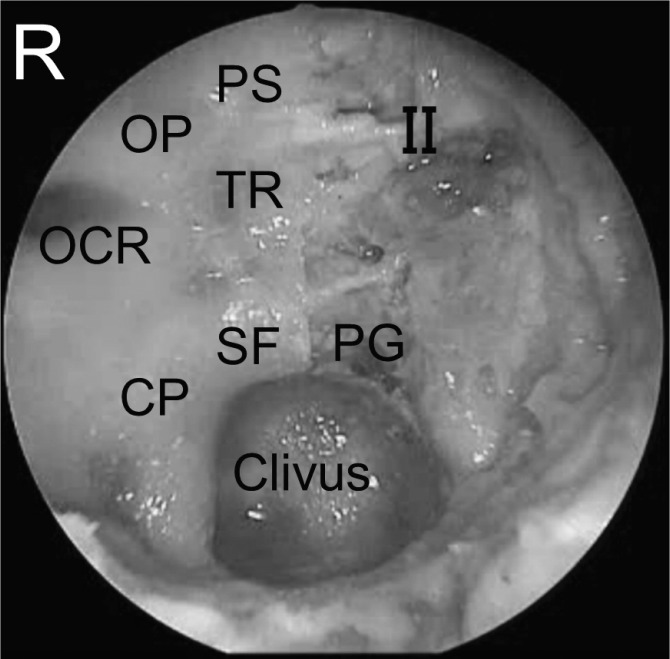
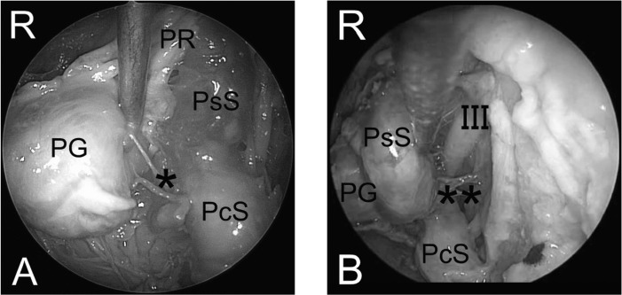
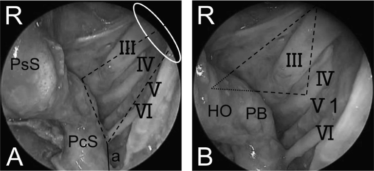
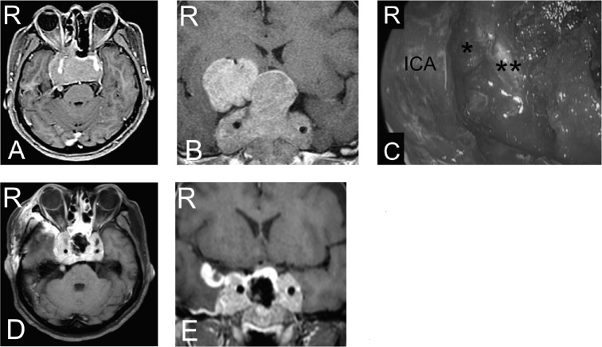
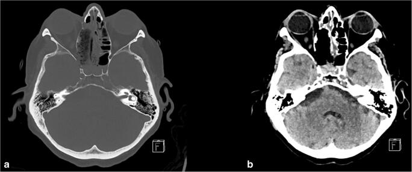
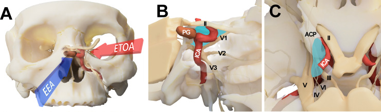
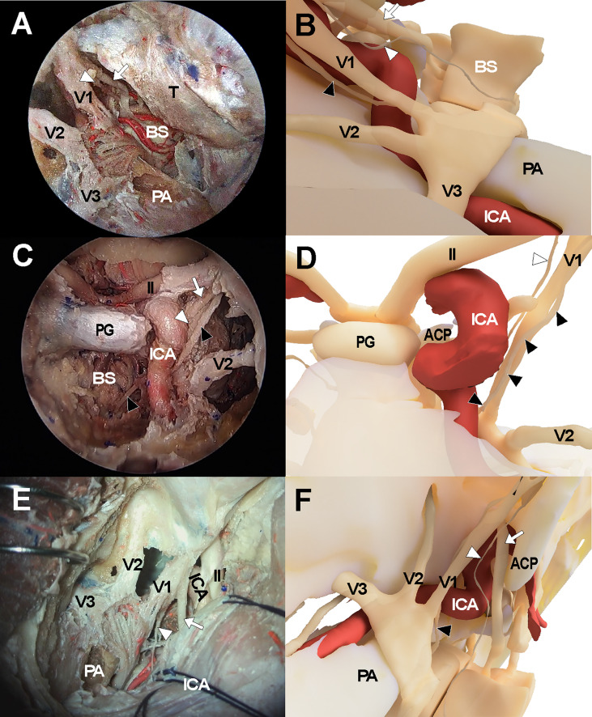
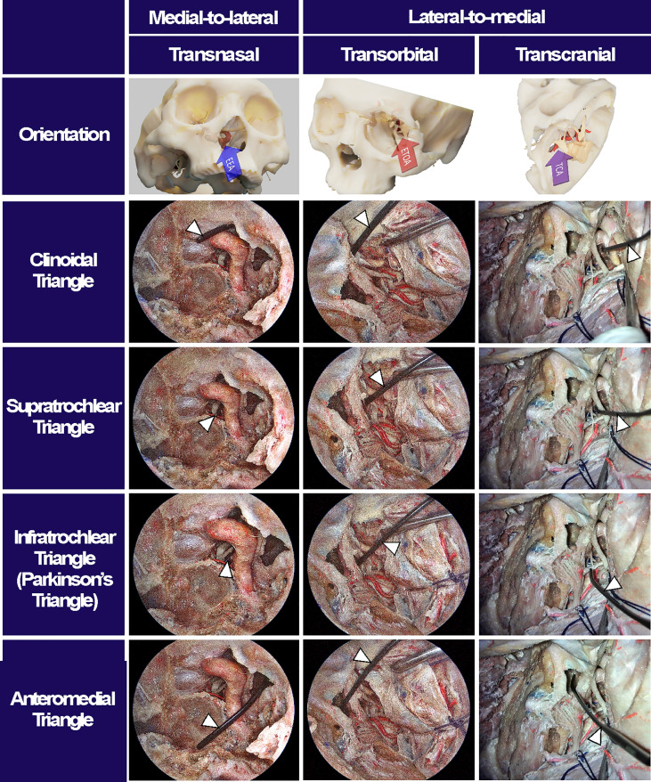
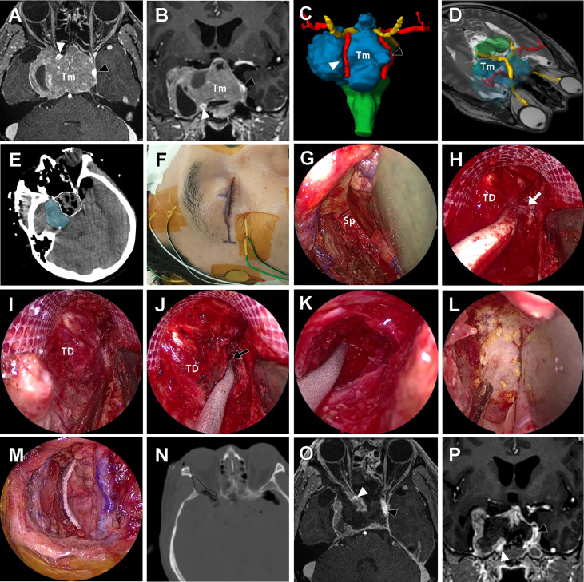
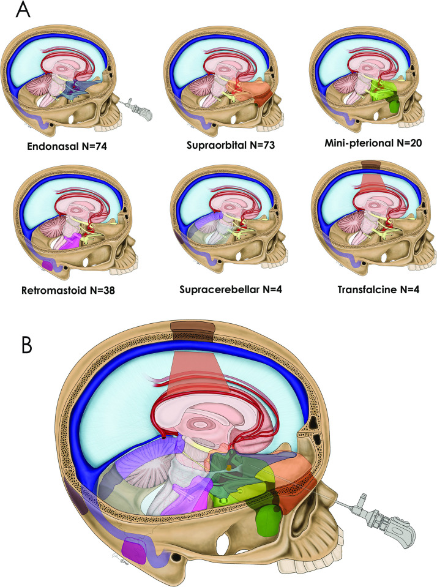

# Approach: Endoscopic Endonasal (Transsphenoidal) Approach

<!-- BEGIN CASE SNAPSHOT -->

## Case / Approach Snapshot

- **Anatomy at risk:** corridor-defining nerves, arteries, veins/sinuses, cisterns, bone landmarks, muscle/fascial planes, and closure structures that determine exposure and morbidity.
- **Operative steps:** confirm position and trajectory, mark landmarks, protect soft tissue and named neurovascular structures, perform the bone/soft-tissue corridor, open/close dura or target compartment deliberately, and verify hemostasis/reconstruction; use the detailed operative sequence and approach notes below as the step-by-step source.
- **Rescue plans:** brain relaxation failure, venous or sinus bleeding, cranial nerve/perforator risk, exposure that is too narrow, CSF leak, cosmetic/temporalis/frontalis problems, and conversion to a wider or alternate corridor.
- **Figures:** review [Figures, Imaging & Video](#figures-imaging--video) and the [Curated Image Set](#curated-image-set); embedded local figures should remain open-access, public-domain, or otherwise reusable with attribution.
- **Papers:** review [High-Yield Literature](#high-yield-literature) for seminal sources, modern reviews, and outcome data specific to this page.

<!-- END CASE SNAPSHOT -->

*Detailed operative reference written for a senior resident / fellow / attending. Pathology guides (e.g., [pituitary adenoma](../cranial-tumor/pituitary-adenoma-transsphenoidal.md), [craniopharyngioma](../cranial-tumor/craniopharyngioma.md)) link here for technique.*

> **About the figures (read once):** Operative step illustrations/photos (Neurosurgical Atlas, Rhoton) are **copyrighted** and are **linked, not copied**. Embedded images here are **public-domain** anatomy plates. See [media-sources.md](../../resources/media-sources.md).

**Atlas operative videos** — open on the [**Endoscopic Endonasal Approach chapter page**](https://www.neurosurgicalatlas.com/volumes/cranial-base-surgery/endoscopic-endonasal-approach): *Endonasal Endoscopic Approach · Pituitary Surgery · Extended Endonasal Approaches · Nasoseptal Flap Harvest.*

---

## Figures, Imaging & Video

**CNS Video Library**

<iframe src="https://www.youtube-nocookie.com/embed/O9F2r5u6kDo" title="CNS Neurosurgery 100: Surgical Anatomy of the Open and Endonasal Approaches to the Anterior Cranial" loading="lazy" allow="accelerometer; clipboard-write; encrypted-media; picture-in-picture; web-share" allowfullscreen></iframe>

<iframe src="https://www.youtube-nocookie.com/embed/B7lcL7uz938" title="CNS Neurosurgery 100: Surgical Anatomy of the Open and Endonasal Approaches to the Anterior Cranial" loading="lazy" allow="accelerometer; clipboard-write; encrypted-media; picture-in-picture; web-share" allowfullscreen></iframe>

---

## 1. General Considerations
The endoscopic endonasal approach uses **the nostril as a natural corridor** to reach the ventral skull base — from the cribriform plate to the odontoid — without a skin incision or craniotomy. It has largely replaced the microscopic transsphenoidal approach for sellar lesions and, in experienced hands, extends to the planum, clivus, and beyond.

- **Evolution:** Hardy's sublabial microscopic approach (1960s) → direct transnasal microscopic (1990s) → endoscopic (Jho & Carrau, mid-1990s) → extended endonasal modules (Kassam & Snyderman, 2000s). The panoramic, angled-lens view of the endoscope overcame the deep, narrow "tunnel" of the operating microscope.
- **Binostril / four-hands technique:** one surgeon drives the endoscope through one nostril while the operating surgeon works bimanually through the other. This restores the bimanual microsurgical dexterity lost in early single-nostril, single-surgeon endoscopic work — and is essential for extended approaches. The ENT / otolaryngology co-surgeon typically manages the endoscope and nasal corridor while the neurosurgeon performs the intradural dissection.
- **Philosophy:** tailor the corridor to the pathology. A simple sellar adenoma needs only a small sphenoidotomy and sellar opening; a tuberculum meningioma or transclival chordoma demands a wide bilateral corridor, a nasoseptal flap, and meticulous multilayer reconstruction.
- **Modular concept (Kassam classification):** the skull base is divided into sagittal (transellar, transplanum, transclival, transodontoid, transcribriform) and coronal (transpterygoid, transmaxillary, transorbital) modules — each adding bone removal in one direction to expand the corridor without a separate approach.

## 2. Indications
- **Sellar:** pituitary adenomas (functional and non-functional — the most common indication), Rathke cleft cyst, pituitary apoplexy, sellar meningioma, metastasis to the sella.
- **Suprasellar:** craniopharyngioma (transplanum extension), tuberculum sellae meningioma, suprasellar arachnoid cyst, hypothalamic hamartoma, epidermoid cyst.
- **Clival:** chordoma, chondrosarcoma, clival meningioma; petroclival access via the transpterygoid lateral extension.
- **Craniocervical junction:** odontoid pannus / rheumatoid pannus (transodontoid approach); basilar invagination.
- **Other:** CSF leak repair (spontaneous/traumatic), optic nerve/canal decompression, select sinonasal malignancies with intracranial extension (transcribriform module), cavernous sinus biopsy.
- **Generally NOT preferred:** lesions lateral to the ICA (transcranial approaches preferred), highly vascular lesions without preop embolization options, patients with prior radiation causing severely scarred/devascularized nasal mucosa (flap unreliable), conchal-type sphenoid (very thick bone, poor landmarks).

## 3. Preoperative Considerations
- **Endocrine workup (mandatory before any sellar surgery):** serum **prolactin** (rule out prolactinoma — medical, not surgical; prolactin > 200 ng/mL is virtually diagnostic), **GH + IGF-1** (acromegaly), **morning cortisol + 24-h UFC or late-night salivary cortisol** (Cushing disease), **TSH/free T4**, **LH/FSH/testosterone or estradiol**, **alpha-subunit**. A functioning adenoma changes the entire operative plan — Cushing patients need perioperative stress-dose steroids; acromegaly patients have airway and cardiac considerations.
- **Visual fields:** formal Humphrey perimetry — chiasmal compression pattern (bitemporal hemianopia); serves as the baseline for postop comparison.
- **Imaging:** MRI brain with gadolinium + **thin-cut (1 mm) coronal sequences through the sella**; CTA or dedicated MRA to define **carotid artery position** (dehiscent carotid canal, kissing carotids, aberrant ICA). CT sinuses (axial + coronal) for septal deviation, sphenoid pneumatization pattern, and prior sinus surgery.
- **Nasal assessment:** ENT co-evaluation for septal deviation, polyps, prior surgery, or mucosal disease that may alter the corridor or limit flap harvest.
- **Preop hydrocortisone stress dose:** for confirmed/suspected Cushing disease or hypopituitarism — **100 mg IV hydrocortisone at induction**, then q8h taper. Patients with normal axes still receive a stress dose at many centers for extended approaches.
- **Lumbar drain:** placed for extended approaches (transplanum, transclival) where a large dural/arachnoid defect is anticipated — provides CSF diversion during the early healing period.
- **Neuronavigation:** frameless stereotactic registration (MRI ± CT fusion) — essential for all cases; confirms midline, sellar floor, and carotid positions intraoperatively. Register to surface anatomy (nasion, tragus, orbital rim) and verify on a known landmark before draping.
- **Antibiotics:** perioperative cefazolin (or vancomycin if penicillin-allergic); some centers add gram-negative coverage for extended approaches given the contaminated nasal corridor.

## 4. Positioning
- **Supine**, head neutral or slightly extended (10–15°); **Mayfield 3-pin fixation** for neuronavigation registration and to prevent intraoperative drift (some centers use a horseshoe for simple sellar cases).
- **Head elevated ~15–20°** above the heart (reverse Trendelenburg) to reduce venous congestion and improve sinus drainage.
- **Endoscope tower / monitors:** positioned directly behind the patient's head so the operating team looks straight ahead through the nasal corridor; a second monitor at the foot provides the ENT co-surgeon a view during the nasal phase.
- **Thigh or abdomen prepped** if fat graft / fascia lata harvest anticipated (extended approaches or anticipated CSF leak).
- **Topical decongestion:** cocaine-soaked pledgets (4%) or oxymetazoline in both nostrils for 5–10 minutes; submucosal injection of 1% lidocaine with 1:100,000 epinephrine along the septum and lateral nasal wall to hydrodissect and reduce bleeding.
- **Equipment check:** 0°, 30°, and 45° rigid endoscopes (4 mm diameter); high-definition camera/monitor system; high-speed drill with diamond and cutting burrs; extended-shaft bayoneted instruments (ring curettes, suctions, bipolar, scissors); micro-Doppler probe; neuronavigation registered and confirmed.

## 5. Operative Anatomy

### Nasal cavity
- **Nasal septum** (perpendicular plate of ethmoid + vomer + septal cartilage) — the midline landmark; the posterior septum is removed to create a binostril corridor.
- **Turbinates:** inferior (preserved), **middle turbinate** (lateralized or partially resected), superior turbinate (removed to access the sphenoid ostium).
- **Sphenoid ostium:** located medial to the superior turbinate, ~1.5 cm above the choana; the entry point into the sphenoid sinus.
- **Sphenopalatine artery (SPA):** terminal branch of the internal maxillary artery; exits the sphenopalatine foramen posterior to the middle turbinate — the pedicle for the **nasoseptal flap**; must be preserved on the flap side and controlled on the contralateral side if bleeding occurs.

### Sphenoid sinus
- **Pneumatization patterns (Hammer & Radberg):** conchal (minimal/no pneumatization — thick bone, rare), **presellar** (pneumatization stops at the anterior sellar wall), **sellar** (most common — thin sellar floor, ideal), **lateral recess** (pneumatization extends lateral to the carotid into the greater wing — risk: carotid dehiscence).
- **Septations:** variable, often **asymmetric**, frequently insert onto the **carotid prominence** — never follow a septation blindly; confirm anatomy with navigation.
- **Key landmarks on the posterior wall:** sellar floor (bulge), **carotid prominences** (bilateral parasellar elevations), **opticocarotid recess (OCR)** — the pneumatized depression between the optic nerve and ICA (corresponds to the optic strut laterally), **clival recess** (inferior), **planum sphenoidale** (superior), **tuberculum sellae** (junction of planum and sellar floor).

### Sellar and parasellar anatomy
- **Sellar floor → dura → pituitary gland:** normal gland is lateralized/flattened by macroadenomas; microadenomas are within the gland substance.
- **Cavernous sinus medial wall:** immediately lateral to the pituitary — paper-thin; the ICA, CN III, IV, V1, V2, and VI lie within/along it. The **medial OCR** marks the superomedial corner of the cavernous sinus.
- **Diaphragma sellae:** dural roof of the sella; the achiasmatic cistern and chiasm sit above. The stalk passes through a central opening. Thinning/descent of the diaphragma after tumor removal is the visual endpoint of sellar surgery.
- **Arachnoid planes:** a preserved arachnoid layer between tumor and chiasm/stalk is the hallmark of a benign plane — **extra-arachnoid dissection** is the goal.
- **Superior and inferior intercavernous sinuses:** venous channels crossing the midline above and below the gland — encountered when opening the dura; control with gentle packing or bipolar.
- **Knosp classification (cavernous sinus invasion):** grades 0–4 based on MRI relationship of tumor to the intracavernous ICA. Grade 3–4 (tumor lateral to or encasing the ICA) predicts cavernous sinus invasion and incomplete resection — important for preoperative counseling and surgical planning.
- **Sellar diaphragm variants:** the central opening ranges from a small pore to a wide deficiency; a large opening transmits CSF pulsation and an arachnoid "cap" that can be mistaken for tumor — recognize and preserve it.

## 6. Step-by-Step Technique

### A. Nasal phase
1. **0° endoscope** into the right nostril; inspect the nasal cavity. **Lateralize the middle turbinate** with a Freer elevator (or partially resect for a narrow nose). Identify the superior turbinate and **sphenoid ostium**.
2. **Posterior septectomy:** remove a ~1.5 cm rectangle of posterior bony septum (vomer/perpendicular plate) to create a binostril corridor. *For extended approaches, harvest the **nasoseptal flap** (Hadad-Bassagasteguy) FIRST, before the posterior septectomy destroys the pedicle.*
3. **Wide bilateral sphenoidotomy:** use a Kerrison rongeur and/or drill to open the anterior sphenoid wall widely from one sphenoid ostium to the other, exposing the entire posterior wall of the sphenoid sinus.

### B. Sphenoid phase
4. **Remove all sphenoid septations** (Kerrison, drill) to expose the sellar floor, bilateral carotid prominences, opticocarotid recesses, clival recess, and planum. **Confirm anatomy with neuronavigation.** The carotid prominences define the lateral safe boundary. *Pearl:* the mucosa of the sphenoid sinus is stripped to expose bare bone — this improves visualization and eliminates a source of postoperative mucocele.
5. For **extended transplanum:** drill the planum sphenoidale and tuberculum sellae superiorly, coagulate and divide the posterior ethmoidal arteries; for **transclival:** drill the clival bone inferiorly, identifying the pharyngobasilar fascia and the clival dura beneath. Each module widens the corridor to its specific target.
6. *Nuance — bone removal is the approach:* the quality of the intradural work is directly proportional to the width and completeness of the bony opening. Under-opened bone forces instrument collision and limits visualization. Take the time to drill widely before opening dura.

### C. Sellar phase
7. **Open the sellar floor** with a micro-osteotome or high-speed drill; enlarge with Kerrison rongeurs bilaterally to the medial cavernous sinus walls and superiorly to the tuberculum. The opening should be large enough to see the dural anatomy clearly — thin bone can be distinguished from thick dura by its white sheen and brittle fracture.
8. **Open the dura** in a cruciate or inverted-U fashion with a sickle knife. Control intercavernous sinus bleeding with Surgicel/thrombin-soaked Gelfoam or gentle bipolar. The tumor is now visible.
9. **Tumor removal:** ring curettes and angled suctions, working systematically — inferior, lateral walls, then superior. For adenomas, curette around the pseudocapsule (Oldfield "pseudocapsular" technique); for craniopharyngiomas, use angled endoscopes (30°, 45°) to visualize the suprasellar component and dissect in the extra-arachnoid plane. The diaphragma descends as the tumor is removed — the visual endpoint.
10. *Nuance — gland identification:* the normal pituitary is typically **posterolateral** in macroadenomas; color (orange-yellow vs. gray-white tumor) and texture (firm gland vs. soft tumor) help distinguish. **Preserve the stalk** unless it is invaded by tumor (craniopharyngioma/null cell adenoma with stalk encasement). Micro-Doppler confirms carotid position if landmarks are ambiguous.
11. **Intraoperative MRI or ultrasound** may be used to assess residual tumor; in Cushing disease, send **frozen-section confirmation of ACTH-positive adenoma** and check **intraoperative cortisol** drop.

### D. Reconstruction
12. **No CSF leak (standard sellar):** sellar floor alone may suffice; some use a thin layer of collagen matrix or absorbable plate.
13. **Intraoperative CSF leak (diaphragma opened):** multilayer closure — **inlay fat graft** (abdominal or thigh) → **fascia lata or collagen onlay** → **nasoseptal flap** (vascularized, laid over the fascia covering the entire defect) → supported with a **Medpor (porous polyethylene) button or Foley balloon** for 3–5 days.
14. **Nasoseptal (Hadad-Bassagasteguy) flap technique:** a posteriorly-based mucoperiosteal/mucoperichondrial flap pedicled on the **posterior nasoseptal branch of the sphenopalatine artery**. Incisions: superior (just below the sphenoid ostium along the skull base), inferior (along the nasal floor), anterior (vertical, connecting the two). Elevated off the septum in the subperichondrial/subperiosteal plane. Stored in the nasopharynx (a "rescue flap" may be pre-cut and stored even if not ultimately needed). The flap must cover the entire bony-dural defect with circumferential contact on native mucosa or bone.
15. **Nasal packing:** absorbable (Nasopore) or gentle non-absorbable packing; Doyle splints bilaterally for 5-7 days to maintain septal alignment. Nasal trumpet for airway if needed.

## 7. Key Pitfalls & Bailouts

| Pitfall | Prevention / Management |
| --- | --- |
| **ICA injury** | Know the carotid position (CTA, navigation, Doppler); stay medial to the carotid prominences. **If the artery is injured:** pack with crushed muscle, apply direct pressure, abandon the tumor operation, close, and go **immediately to angiography** for balloon occlusion test ± sacrifice or covered stent. Do not attempt primary repair. |
| **CSF leak (postop)** | Meticulous multilayer reconstruction; nasoseptal flap for any high-flow leak; lumbar drain for extended approaches (5–7 days, 5–10 mL/h). **If CSF leak persists:** return to OR for re-exploration and re-repair. |
| **Diabetes insipidus (DI)** | Transient DI is common (up to 30%); monitor strict I/O, urine specific gravity, serum Na q6h. Treat with **DDAVP 1 µg IV/SQ** when UO > 250 mL/h with dilute urine (SG < 1.005) and rising Na. Permanent DI (~2–5%) requires long-term DDAVP. |
| **SIADH / delayed hyponatremia** | Typically postop days 5–9; check Na before discharge and at 1-week follow-up. Fluid restrict if Na < 130. |
| **Epistaxis (SPA bleeding)** | Bipolar/clip the SPA stump; posterior nasal packing; ENT co-management; rarely requires angio-embolization. |
| **Sphenoid septation onto carotid** | Never avulse a septation blindly — drill flush or use Kerrison parallel to the septation. |

## 8. Variants
- **Microscopic sublabial transsphenoidal:** the original Hardy approach; sublabial incision, subperiosteal dissection along the nasal septum, Hardy speculum, operating microscope. Still used where endoscopic expertise/equipment is unavailable. *Limitation:* narrow binocular view, poor visualization of lateral/suprasellar extensions.
- **Microscopic transnasal:** direct endonasal with speculum + microscope; avoids the sublabial incision and associated upper-lip numbness but retains the same limited field of view. Many experienced surgeons still use the microscope for straightforward microadenomas.
- **Extended transplanum/transtuberculum:** for suprasellar pathology (craniopharyngioma, tuberculum meningioma); requires opening the planum, cutting the dural arteries (ethmoidal arteries are the anterior limit), and often sacrificing the superior intercavernous sinus. Nasoseptal flap mandatory. *The optic canals may be unroofed to mobilize the optic nerves and gain access to the retrochiasmatic space.*
- **Transclival (upper, middle, lower):** for chordoma, chondrosarcoma, ventral brainstem lesions. The upper clivus is accessed through the standard transsphenoidal corridor; the middle and lower clivus require progressively more inferior bone removal. Lower clivus approaches may overlap with the transoral/transodontoid corridor. The **basilar artery and its perforators** lie immediately behind the clival dura — the surgeon must distinguish tumor from brainstem.
- **Transcribriform:** for olfactory groove meningioma or esthesioneuroblastoma; requires bilateral ethmoidectomy and cribriform plate removal. Highest CSF leak risk; bilateral nasoseptal flaps or pericranial flap (Zanation "above and below" technique) may be needed. Anosmia is expected.
- **Transpterygoid:** lateral extension through the pterygoid base and vidian canal to access the petrous apex, Meckel cave, and infratemporal fossa. Identifies the vidian nerve (leads to the anterior genu of the petrous ICA) and V2 as key landmarks.

## 9. Nuances & Pearls (high-yield)
- **Always harvest or "rescue-cut" a nasoseptal flap** before performing the posterior septectomy in any case where an extended approach is remotely possible — once the septal mucosa is disrupted, the flap cannot be reliably raised.
- **The opticocarotid recess is your best friend:** it identifies both the optic nerve (superolateral) and the ICA (inferolateral) simultaneously. If you cannot identify the OCR, the sphenoid is likely under-pneumatized — rely more heavily on navigation.
- **Angled endoscopes (30°, 45°, 70°)** are essential for looking around corners — above the diaphragma, into the lateral recesses, behind the clivus. Transition from 0° to angled lenses systematically during tumor removal.
- **Postop nasal care matters:** saline irrigations (starting ~week 2), serial endoscopic debridements by ENT (weeks 1, 3, 6), and nasal steroid sprays reduce crusting, synechiae, and long-term nasal morbidity. Counsel the patient preoperatively.
- **Volume-outcome relationship:** complication rates (especially CSF leak) decrease significantly with institutional experience. The learning curve is steep; fellowship-level training under a high-volume team is the current standard.

## 10. Postoperative Management
- **ICU vs floor:** extended approaches and patients with DI risk warrant ICU observation for 24–48 h; straightforward sellar adenomas may go to a step-down unit.
- **Sodium monitoring:** serum Na **q6h for 48 h**, then q12h. The classic "triple-phase response" (DI → SIADH → permanent DI) occurs in ~5% but must be anticipated.
- **Endocrine:** morning cortisol on POD 1–2 (hold stress-dose steroids for the draw if safe); if cortisol < 5 µg/dL, continue replacement. For Cushing disease, a low postop cortisol confirms remission — **do not give steroids until the patient shows signs of adrenal insufficiency** (nausea, hypotension, hyponatremia) to avoid masking the biochemical cure.
- **Visual fields:** repeat formal perimetry at 6 weeks and 3 months; most improvement occurs in the first 3–6 months.
- **Bed rest / CSF precautions:** for extended approaches with lumbar drain — flat bed rest, drain at 10 cm H₂O for 3–5 days; avoid Valsalva, straining, nose-blowing. Remove drain after clamping trial.
- **MRI:** with and without gadolinium at **3 months** (baseline post-resection, before radiation planning if indicated) and annually thereafter.

## 11. Complications
Postoperative CSF leak (1–5% sellar, 10–15% extended); DI (transient ~30%, permanent ~3%); anterior pituitary insufficiency (new deficit ~5%); epistaxis; sinusitis/nasal crusting; meningitis; carotid injury (< 1%); visual deterioration (rare — hematoma, vascular injury); anosmia (transcribriform); nasal septal perforation; saddle-nose deformity (excessive anterior cartilage removal); tension pneumocephalus (rare, with aggressive lumbar drainage).

---

## Pathology guides that use this approach
[Pituitary adenoma (transsphenoidal)](../cranial-tumor/pituitary-adenoma-transsphenoidal.md) · [Craniopharyngioma](../cranial-tumor/craniopharyngioma.md) · [Tuberculum sellae meningioma](../cranial-tumor/tuberculum-sellae-meningioma.md) · [Clival chordoma](../cranial-tumor/clival-chordoma.md)

## References
1. Jho HD, Carrau RL. Endoscopic endonasal transsphenoidal surgery: experience with 50 patients. *J Neurosurg.* 1997;87(1):44–51.
2. Kassam AB, Prevedello DM, Carrau RL, et al. Endoscopic endonasal skull base surgery: analysis of complications in the authors' initial 800 patients. *J Neurosurg.* 2011;114(6):1544–1568.
3. Hadad G, Bassagasteguy L, Carrau RL, et al. A novel reconstructive technique after endoscopic expanded endonasal approaches: vascular pedicle nasoseptal flap. *Laryngoscope.* 2006;116(10):1882–1886.
4. Cappabianca P, Cavallo LM, de Divitiis E. Endoscopic endonasal transsphenoidal surgery. *Neurosurgery.* 2004;55(4):933–941.
5. Snyderman CH, Pant H, Carrau RL, Prevedello DM, Gardner PA, Kassam AB. What are the limits of endoscopic sinus surgery?: the expanded endonasal approach to the skull base. *Keio J Med.* 2009;58(3):152–160.
6. Rhoton AL Jr. The sellar region. *Neurosurgery.* 2002;51(4 Suppl):S335–S374.
7. Couldwell WT. Transsphenoidal and transcranial surgery for pituitary adenomas. *J Neurooncol.* 2004;69(1-3):237–256.
8. The Neurosurgical Atlas (Cohen-Gadol AA) — Endoscopic Endonasal Approach chapter (operative figures/videos, linked).
9. Laws ER Jr, Sheehan JP, eds. *Pituitary Surgery — A Modern Approach.* Karger; 2006.
10. Knosp E, Steiner E, Kitz K, Matula C. Pituitary adenomas with invasion of the cavernous sinus space: a magnetic resonance imaging classification compared with surgical findings. *Neurosurgery.* 1993;33(4):610–618.

<!-- BEGIN CURATED LITERATURE -->

## High-Yield Literature

- **Endoscopic Endonasal Approach to the Ventral Petroclival Fissure: Anatomical Findings and Surgical Techniques** — Xu Y. Journal of neurological surgery. Part B, Skull base 2024. [PubMed](https://pubmed.ncbi.nlm.nih.gov/38966292/)
- **Microsurgical anatomy of the dorsal clinoidal space: implications for endoscopic endonasal parasellar surgery** — Xu Y. Journal of neurosurgery 2022. [PubMed](https://pubmed.ncbi.nlm.nih.gov/35120312/)
- **Extended endoscopic endonasal transsphenoidal approach to the suprasellar area: anatomic considerations--part 1** — Cavallo LM. Neurosurgery 2007. [PubMed](https://pubmed.ncbi.nlm.nih.gov/17876230/)
- **Indications and limitations of the endoscopic endonasal approach for anterior cranial base meningiomas** — Schroeder HW. World neurosurgery 2014. [PubMed](https://pubmed.ncbi.nlm.nih.gov/25496640/)
- **Comparison of Endoscopic Endonasal Approach and Lateral Microsurgical Infratemporal Fossa Approach to the Jugular Foramen: An Anatomical Study** — Liu J. Journal of neurological surgery. Part B, Skull base 2022. [PubMed](https://pubmed.ncbi.nlm.nih.gov/35832999/)
- **Microsurgical anatomy of the cavernous sinus and limitations of surgical approaches: a cadaveric study** — Kına H. Folia morphologica 2023. [PubMed](https://pubmed.ncbi.nlm.nih.gov/36573366/)
- **360° around the orbit: key surgical anatomy of the microsurgical and endoscopic cranio-orbital and orbitocranial approaches** — Agosti E. Neurosurgical focus 2024. [PubMed](https://pubmed.ncbi.nlm.nih.gov/38560949/)
- **From Above and Below: The Microsurgical Anatomy of Endoscopic Endonasal and Transcranial Microsurgical Approaches to the Parasellar Region** — Almeida JP. World neurosurgery 2022. [PubMed](https://pubmed.ncbi.nlm.nih.gov/34906753/)
- **Giant Pituitary Adenoma - Special Considerations** — Tang OY. Otolaryngologic clinics of North America 2022. [PubMed](https://pubmed.ncbi.nlm.nih.gov/35365313/)
- **Lateral compartment of the cavernous sinus from the endoscopic endonasal approach: anatomical considerations and surgical relevance to adenoma surgery** — Xu Y. Journal of neurosurgery 2025. [PubMed](https://pubmed.ncbi.nlm.nih.gov/39126713/)

<!-- END CURATED LITERATURE -->

---

<!-- BEGIN CURATED IMAGE SET -->

## Curated Image Set

Open-access figures are embedded from PubMed Central articles and kept unique to this guide.

*Fig. 1.. Endoscopic view of the posterior wall of the sphenoid sinus and bony landmarks on the right side and exposed medial wall of the cavernous sinus around the intracranial ICA on the left... Source: [Endoscopic Endonasal Surgical Approach to the Oculomotor Trigone from the Cavernous Sinus](https://pmc.ncbi.nlm.nih.gov/articles/PMC4533501/) — Neurologia medico-chirurgica 2014; CC BY-NC-ND.*

*Fig. 2.. A: Endoscopic view of the medial side of the intracavernous ICA. B: Endoscopic view of the lateral side of the intracavernous ICA. ICA: internal carotid artery, PcS: paraclival segment... Source: [Endoscopic Endonasal Surgical Approach to the Oculomotor Trigone from the Cavernous Sinus](https://pmc.ncbi.nlm.nih.gov/articles/PMC4533501/) — Neurologia medico-chirurgica 2014; CC BY-NC-ND.*

*Fig. 3.. A: Endoscopic intracavernous sinus view showing course of cranial nerves and neurovascular relationships. B: Close-up endoscopic view around the entry point of oculomotor nerve into the... Source: [Endoscopic Endonasal Surgical Approach to the Oculomotor Trigone from the Cavernous Sinus](https://pmc.ncbi.nlm.nih.gov/articles/PMC4533501/) — Neurologia medico-chirurgica 2014; CC BY-NC-ND.*

*Fig. 4.. Preoperative contrast-enhanced axial (A) and coronal (B) MR images showing pituitary macroadenoma extending to outside both cavernous sinuses and the suprasellar region and ambient... Source: [Endoscopic Endonasal Surgical Approach to the Oculomotor Trigone from the Cavernous Sinus](https://pmc.ncbi.nlm.nih.gov/articles/PMC4533501/) — Neurologia medico-chirurgica 2014; CC BY-NC-ND.*

*Fig. 3. Postoperative CT-imaging after endonasal endoscopic transpterygoidal approach to Meckel’s cave with a bony and b tissue windowing demonstrating the bone access to Meckel’s cave, as well... Source: [Access to Meckel’s cave for biopsies of indeterminate lesions: a systematic review](https://pmc.ncbi.nlm.nih.gov/articles/PMC7850998/) — Neurosurgical Review 2020; CC BY.*

*Figure 1. Conceptual illustration for endoscopic transorbital approach (ETOA) and endoscopic endonasal approach (EEA) to the cavernous sinus. (A) The cavernous sinus was approached from the... Source: [Endoscopic transorbital approach to the cavernous sinus: Cadaveric anatomy study and clinical application (‡SevEN-009)](https://pmc.ncbi.nlm.nih.gov/articles/PMC9459324/) — Frontiers in Oncology 2022; CC BY.*

*Figure 3. Cadaveric views and three-dimensional illustrations for cavernous sinus and surrounding neurovascular structures in the comparison with endoscopic transorbital approach (A, B),... Source: [Endoscopic transorbital approach to the cavernous sinus: Cadaveric anatomy study and clinical application (‡SevEN-009)](https://pmc.ncbi.nlm.nih.gov/articles/PMC9459324/) — Frontiers in Oncology 2022; CC BY.*

*Figure 4. Surgical triangles of cavernous sinus with different approaches. Using a fresh cadaveric head, the surgical triangles to enter the cavernous sinus were simultaneously observed through an... Source: [Endoscopic transorbital approach to the cavernous sinus: Cadaveric anatomy study and clinical application (‡SevEN-009)](https://pmc.ncbi.nlm.nih.gov/articles/PMC9459324/) — Frontiers in Oncology 2022; CC BY.*

*Figure 6. A 57-year-old male patient with history of repeated surgery and radiosurgery for an invasive pituitary adenoma. (A, B) Preoperative T1-weighted magnetic resonance imaging (MRI) with... Source: [Endoscopic transorbital approach to the cavernous sinus: Cadaveric anatomy study and clinical application (‡SevEN-009)](https://pmc.ncbi.nlm.nih.gov/articles/PMC9459324/) — Frontiers in Oncology 2022; CC BY.*

*Fig 1. (1A) Drawing depicting 6 keyhole approaches for meningioma removal: endonasal, supraorbital, minipterional, retromastoid, suboccipital sitting gravity-assisted and transfalcine... Source: [Critical appraisal of minimally invasive keyhole surgery for intracranial meningioma in a large case series](https://pmc.ncbi.nlm.nih.gov/articles/PMC9333232/) — PLoS ONE 2022; CC BY.*

<!-- END CURATED IMAGE SET -->
