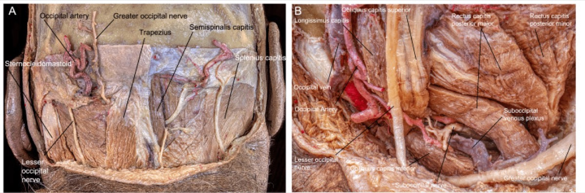
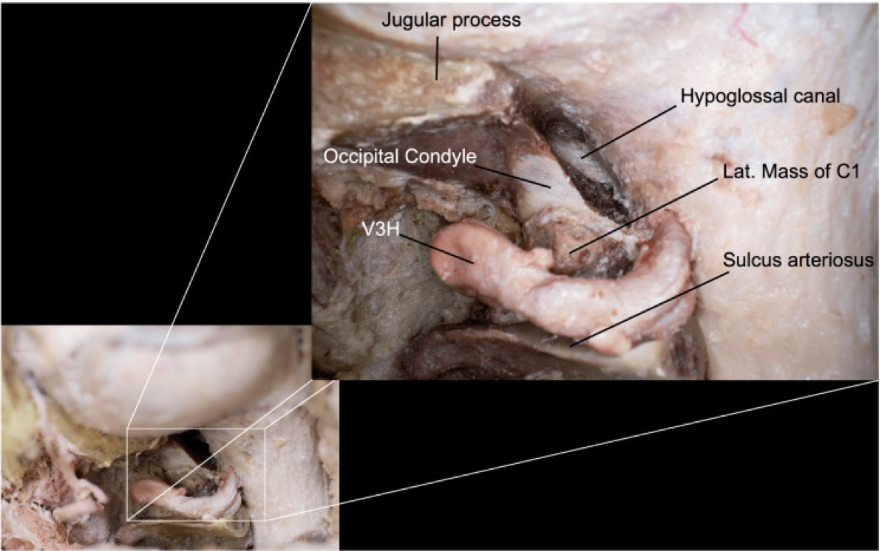
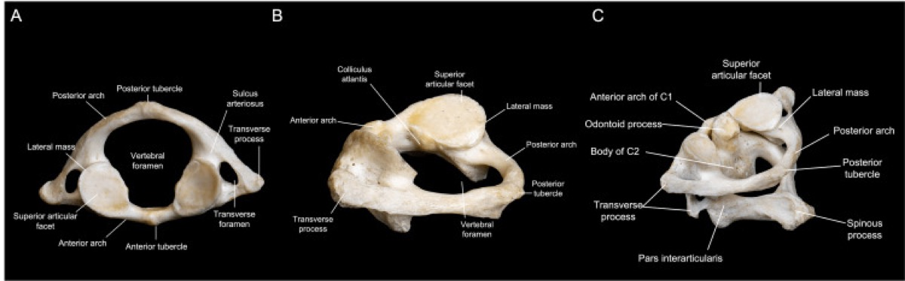
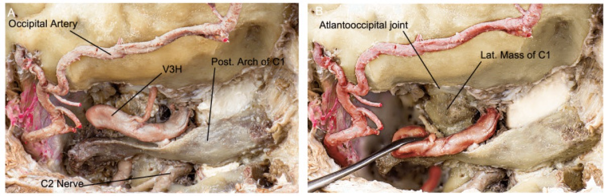
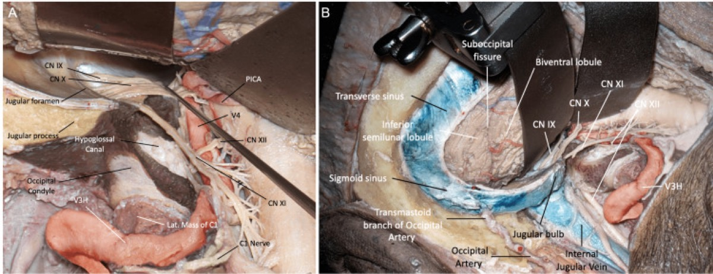

# Operative Approach: Far-Lateral (Transcondylar) Craniotomy

> **About the figures.** Copyrighted operative figures/videos are **linked** (Neurosurgical Atlas, Rhoton); embedded images are **public-domain** (Gray's Anatomy) or **CC‑BY** (open-access cadaveric anatomy), credited beneath each image. See [media-sources.md](../../resources/media-sources.md) and [figures/CREDITS.md](../../figures/CREDITS.md).
>
> **Atlas chapters & neuroanatomy:** [Far-Lateral Suboccipital (Transcondylar) Approach](https://www.neurosurgicalatlas.com/volumes/cranial-base-surgery/skull-base-exposures/transcondylar-approach) · [Far-Lateral & Transcondylar Approaches (Neuroanatomy)](https://www.neurosurgicalatlas.com/neuroanatomy/far-lateral-and-transcondylar-approaches) · [Far-Lateral Approach & Extensions](https://www.neurosurgicalatlas.com/volumes/operative-neuroanatomy/infratentorial-operative-anatomy/far-lateral-approach-and-extensions)

The far-lateral craniotomy is the **posterolateral corridor to the ventral and ventrolateral craniocervical junction** — the anterior foramen magnum, lower clivus, ventral medulla, and the lower cranial nerves (IX–XII), the distal vertebral artery (VA), the vertebrobasilar junction, and PICA. By removing the **lateral rim of the foramen magnum, the posterior arch of C1, and (when needed) the posterior third of the occipital condyle**, the surgeon looks *along the ventral surface of the medulla* — reaching lesions in front of the brainstem **without any brainstem retraction.**

---

## Figures, Imaging & Video

**🎥 Operative videos:** [YouTube](https://www.youtube.com/results?search_query=foramen+magnum+meningioma+surgery) · [Neurosurgical Atlas](https://www.google.com/search?q=foramen+magnum+meningioma+site:neurosurgicalatlas.com) · [JNS Neurosurgical Focus: Video](https://www.google.com/search?q=foramen+magnum+meningioma+%22neurosurgical+focus%22+video)

**📑 Evidence & guidelines:** [PubMed reviews](https://pubmed.ncbi.nlm.nih.gov/?term=foramen+magnum+meningioma+review) · [Guidelines — CNS / AANS](https://www.google.com/search?q=foramen+magnum+meningioma+guidelines+CNS+OR+AANS) · [Google Scholar](https://scholar.google.com/scholar?q=foramen+magnum+meningioma)
[Neurosurgical Atlas — Transcondylar](https://www.neurosurgicalatlas.com/volumes/cranial-base-surgery/skull-base-exposures/transcondylar-approach) · [Rhoton CCJ anatomy (PMC)](https://www.ncbi.nlm.nih.gov/pmc/?term=rhoton+far+lateral+transcondylar+anatomy) · [Radiopaedia — foramen magnum](https://radiopaedia.org/search?q=foramen%20magnum%20meningioma&scope=all) · [PubMed Central — far lateral](https://www.ncbi.nlm.nih.gov/pmc/?term=far+lateral+transcondylar+approach)

*Gray's Anatomy (1918), public domain — via Wikimedia Commons. The far-lateral corridor works around the foramen magnum rim and condyle; the hypoglossal canal is the anteromedial limit of condyle drilling.*

---

## General Considerations
- **What it accesses:** ventral/ventrolateral foramen magnum and lower clivus, the ventral medulla and cervicomedullary junction, CN IX–XII, the **V3 (extradural horizontal) and V4 (intradural) vertebral artery**, PICA origin, and the vertebrobasilar junction.
- **Core principle:** the obstacle to seeing the front of the medulla is **bone (condyle/foramen magnum rim), not brain.** Removing lateral bone — rather than retracting the neuraxis — converts a deep ventral target into a tangential, retractor-free exposure.
- **The graded "condylar" ladder (Salas/Rhoton):**
  - **Far-lateral (retrocondylar):** lateral suboccipital craniectomy + lateral foramen-magnum rim + C1 hemilaminectomy, *without* condyle removal — adequate for many dorsolateral lesions.
  - **Transcondylar:** add resection of the **posterior third of the occipital condyle** (and the lateral C1 mass as needed) to flatten the ventral trajectory — the workhorse extension; the **hypoglossal canal is the anteromedial limit.**
  - **Supracondylar:** drill the **jugular tubercle** (above the condyle) for ventral clival/CN access.
  - **Paracondylar:** remove bone **lateral to the condyle** toward the jugular process for jugular-foramen/glomus lesions.

### Indications
- **Ventral/ventrolateral foramen magnum meningioma** (the prototypical indication) → see [foramen-magnum-meningioma-far-lateral.md](../cranial-tumor/foramen-magnum-meningioma-far-lateral.md)
- **VA, VA–PICA, and vertebrobasilar junction aneurysms**
- Lower clivus / CCJ **chordoma** and chondrosarcoma → see [clival-chordoma.md](../cranial-tumor/clival-chordoma.md)
- **Jugular foramen tumors** (paracondylar extension), hypoglossal schwannoma → see [jugular-foramen-tumor.md](../cranial-tumor/jugular-foramen-tumor.md)
- Cervicomedullary intramedullary lesions, PICA territory exposure

---

## Relevant Surgical Anatomy
- **Suboccipital triangle:** bounded by **rectus capitis posterior major** (medial), **superior oblique** (superolateral), and **inferior oblique** (inferolateral); its floor contains the **horizontal V3 segment of the VA** lying in the **sulcus arteriosus on the superior surface of the C1 posterior arch**, surrounded by a dense **suboccipital venous plexus.** This triangle is the key to safe VA control.
- **Vertebral artery course:** ascends through the C2→C1 transverse foramina (V3), turns **medially and posteriorly along the C1 sulcus**, then pierces the dura at the **foramen magnum** to become V4 intradurally. Anomalies matter: an **extradural PICA origin** or a fenestrated/duplicated VA can be injured during muscle/bone work.
- **Occipital condyle & hypoglossal canal:** the condyle sits at the anterolateral foramen magnum; the **hypoglossal canal (CN XII)** runs anteromedially through its base — the **medial-anterior limit of safe condyle drilling.** Resecting >~50% of a condyle risks **craniocervical instability** (consider occipitocervical fusion).
- **Intradural lower CNs:** **CN XI** spinal rootlets ascend along the lateral cord; **CN IX–X–XI** converge to the jugular foramen; **CN XII** rootlets run between the VA and the medulla to the hypoglossal canal. The **dentate ligament** is a landmark (and can be divided to rotate the cord for ventral access).

---

## Preoperative Evaluation
- **MRI** for the lesion and its relation to the medulla, lower CNs, and VA; **CTA/CT angiogram** for the **VA course, dominance, PICA origin, and any anomaly**, and for **condyle/jugular-tubercle bony anatomy and the hypoglossal canal**.
- Assess baseline **lower cranial nerve function and swallowing** (aspiration risk); flexion-extension imaging if CCJ instability is a question.
- Plan condyle-resection extent preoperatively; counsel about possible **occipitocervical fusion** and lower-CN deficits.

## Anesthesia & Neuromonitoring
- GA/TIVA; **no long-acting paralytic** (CN EMG). **SSEP/MEP**, **lower-CN EMG (IX/X via vocalis, XI trapezius/SCM, XII tongue)**, and brainstem monitoring. 
- If a sitting/semi-sitting position is chosen: **VAE precautions** (precordial Doppler, end-tidal CO₂, right-atrial line) and **PFO screening**. Most surgeons use park-bench/lateral to avoid this.

---

## Positioning
📷 *[Atlas — far-lateral positioning](https://www.neurosurgicalatlas.com/volumes/cranial-base-surgery/skull-base-exposures/transcondylar-approach)*

- **Park-bench (lateral) is the workhorse:** patient lateral, operative side up, in Mayfield fixation; the dependent arm is supported off the table edge in a sling, axillary roll in place.
- **Head maneuver (three moves) to bring the ventral foramen magnum into view:** (1) **flexion** (chin toward sternum), (2) **rotation ~30–45° toward the floor/contralateral side**, and (3) **lateral flexion** of the head toward the contralateral shoulder. The mastoid becomes the highest point and the surgeon looks up the ventral medulla.
- Ipsilateral shoulder taped down caudally to open the cervico-mastoid angle; verify venous outflow and recheck IONM after positioning.

## Incision & Soft-Tissue Dissection
📷 *[Atlas — hockey-stick incision & muscle layers](https://www.neurosurgicalatlas.com/volumes/cranial-base-surgery/skull-base-exposures/transcondylar-approach)*

- **Hockey-stick (inverted-J) incision:** down the midline from the inion to ~C3–C4, then curving laterally along the superior nuchal line toward the mastoid — or a **C-shaped/“lazy-S”** flap. The midline limb uses the avascular nuchal raphe.
- Reflect a **myocutaneous flap** inferolaterally, taking the suboccipital muscles off the occiput and C1; **leave a muscular/nuchal cuff superiorly** for watertight closure.
- **Identify the VA early in the suboccipital triangle:** dissect subperiosteally on the **superior surface of the C1 posterior arch** from medial to lateral, staying on bone, to expose V3 in its sulcus within the venous plexus. Control plexus bleeding with flowable hemostatic/gentle packing; skeletonize and protect (and, if transposition is needed, mobilize) the VA.

*Payman A, et al. "Immersive Surgical Anatomy of the Far-Lateral Approach," Cureus 2022;14(11):e31257 — CC BY. Muscular, vascular (VA), and nervous anatomy of the corridor.*

---

## Bone Work — Craniotomy, C1, and the Condyle

### Craniotomy / craniectomy + C1
📷 *[Atlas — bone removal](https://www.neurosurgicalatlas.com/neuroanatomy/far-lateral-and-transcondylar-approaches)*
1. **Lateral suboccipital craniotomy/craniectomy** carried laterally to the **sigmoid sinus** and inferiorly to the **foramen magnum**; **remove the lateral rim of the foramen magnum** (the key maneuver of the basic far-lateral).
2. **C1 hemilaminectomy** out to the VA sulcus / transverse foramen (protect V3). Wax the abundant venous bleeding.

*Payman A, et al. Cureus 2022;14(11):e31257 — CC BY.*

### Condyle / jugular tubercle (extensions as needed)
📷 *[Atlas — transcondylar drilling](https://www.neurosurgicalatlas.com/volumes/cranial-base-surgery/skull-base-exposures/transcondylar-approach)*
3. **Transcondylar:** drill the **posterior third of the occipital condyle** to flatten the ventral trajectory; the **hypoglossal canal is the anteromedial stop** (identify it; the emissary/condylar veins herald it). Tailor the extent to the lesion — only remove what the trajectory requires.
4. **Supracondylar (jugular tubercle) / paracondylar** drilling added for ventral clival or jugular-foramen reach.
5. If condyle resection approaches/exceeds ~50% (or with pre-existing laxity), plan **occipitocervical fusion** — see [occipitocervical-fusion.md](../spine-trauma/occipitocervical-fusion.md).

*Payman A, et al. Cureus 2022;14(11):e31257 — CC BY.*

---

## Dural Opening & Intradural Work
📷 *[Atlas — dural opening & lower CN microsurgery](https://www.neurosurgicalatlas.com/volumes/cranial-base-surgery/skull-base-exposures/transcondylar-approach)*

- Open the dura in a **curvilinear/C- or T-shaped flap based on the sigmoid sinus**, carrying the limb across the **VA dural entry** (a dural cuff around V4 is preserved/repaired); tack toward the sinus. Beware the **posterior spinal artery** and the dural VA ring.
- Release CSF from the cisterna magna; the cerebellum and tonsil relax. **Identify the lower CNs** (XI rootlets along the cord first, then X and IX to the jugular foramen, XII rootlets between VA and medulla), **PICA**, and V4.
- **Divide the dentate ligament** (and, if needed, the highest dorsal rootlet) to rotate the cord and widen the ventral corridor. Work **between the CN rootlets** to reach a ventral meningioma (which displaces the neuraxis dorsally) or the VA/PICA/vertebrobasilar lesion. Preserve every perforator to the medulla.

---

## Closure
- **Watertight dura**, almost always with a **graft** (the VA cuff and condyle defect make primary closure difficult) + sealant; **fat graft** the condylar/retromastoid defect; **wax all air cells.**
- If the bone flap was free, **replace it (cranioplasty)**; perform **occipitocervical fusion** if condyle resection or instability warrants.
- Reapproximate the **suboccipital muscles in layers to the superior cuff** (second defense against CSF leak/pseudomeningocele). Layered closure.

---

### Further operative anatomy & technique

*Payman A et al., Cureus 2022;14(11):e31257 — CC BY 4.0.*

*Payman A et al., Cureus 2022;14(11):e31257 — CC BY 4.0.*

*Payman A et al., Cureus 2022;14(11):e31257 — CC BY 4.0.*

## Nuances & Pitfalls (surgeon-level)
- **The vertebral artery is the case.** Identify V3 **early** in the suboccipital triangle on the superior C1 arch, dissect on bone, and control the venous plexus deliberately. Know the **VA dominance and PICA origin (including a rare extradural PICA)** from the CTA before you start.
- **Hypoglossal canal = stop sign.** It is the anteromedial limit of condyle drilling; breaching it risks **CN XII palsy** (tongue deviation, dysarthria).
- **Tailor the condyle.** More condyle = more ventral angle but more instability; remove only what the trajectory needs, and **fuse (occipitocervical)** if >~50% is taken or the joint is incompetent.
- **Lower-CN vigilance.** Manipulating IX–XI risks **dysphagia/aspiration and hoarseness**; coordinate hemodynamics with anesthesia and assess swallowing before feeding postoperatively.
- **Venous plexus bleeding** around V3 and the condylar emissary veins is brisk — flowable hemostatics and patience, not blind bipolar near the VA.
- **CSF leak** is the commonest morbidity — meticulous air-cell waxing, fat graft, grafted watertight dura, and tight muscle closure.

## Complications
VA injury / occlusion (medullary/cerebellar infarct); lower-CN palsies (IX–XII) with **dysphagia/aspiration, hoarseness, tongue weakness**; craniocervical instability (condyle resection); CSF leak / pseudomeningocele; cerebellar/medullary injury or perforator stroke; venous air embolism (if sitting); wound infection/meningitis.

---

## Cross-links
- Related corridors: [retrosigmoid-craniotomy.md](retrosigmoid-craniotomy.md) · [midline-suboccipital-craniotomy.md](midline-suboccipital-craniotomy.md) · [presigmoid-petrosal-approach.md](presigmoid-petrosal-approach.md)
- Pathology: [foramen-magnum-meningioma-far-lateral.md](../cranial-tumor/foramen-magnum-meningioma-far-lateral.md) · [jugular-foramen-tumor.md](../cranial-tumor/jugular-foramen-tumor.md) · [clival-chordoma.md](../cranial-tumor/clival-chordoma.md) · [occipitocervical-fusion.md](../spine-trauma/occipitocervical-fusion.md)

## References
1. Heros RC. **Lateral suboccipital approach for vertebral and vertebrobasilar artery lesions.** *J Neurosurg.* 1986;64(4):559–562.
2. Rhoton AL Jr. **The far-lateral approach and its transcondylar, supracondylar, and paracondylar extensions.** *Neurosurgery.* 2000;47(3 Suppl):S195–S209.
3. Salas E, Sekhar LN, Ziyal IM, et al. **Variations of the extreme-lateral craniocervical approach.** *J Neurosurg (Spine).* 1999;90(2 Suppl):206–219.
4. Wen HT, Rhoton AL Jr, et al. **Microsurgical anatomy of the transcondylar, supracondylar, and paracondylar extensions of the far-lateral approach.** *J Neurosurg.* 1997;87(4):555–585.
5. **Payman A, Rios Zermeno J, Hirpara A, El-Sayed IH, Abla A, Rodriguez Rubio R. Immersive Surgical Anatomy of the Far-Lateral Approach.** *Cureus.* 2022;14(11):e31257. CC BY. [PMC9733796](https://www.ncbi.nlm.nih.gov/pmc/articles/PMC9733796/)
6. Cohen-Gadol AA. *Far-Lateral Suboccipital (Transcondylar) Approach.* The Neurosurgical Atlas. [link](https://www.neurosurgicalatlas.com/volumes/cranial-base-surgery/skull-base-exposures/transcondylar-approach)
