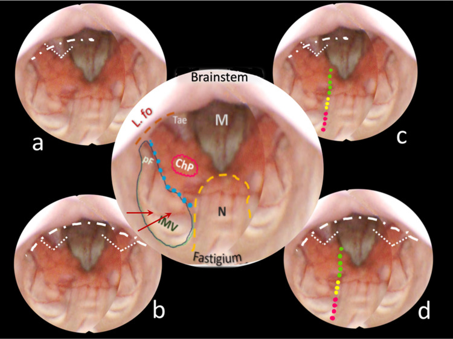
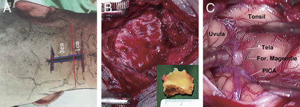
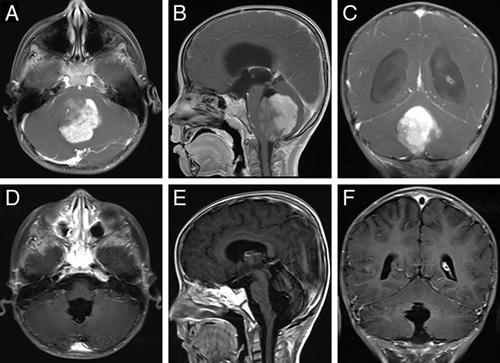
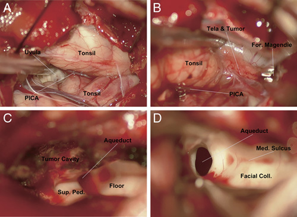
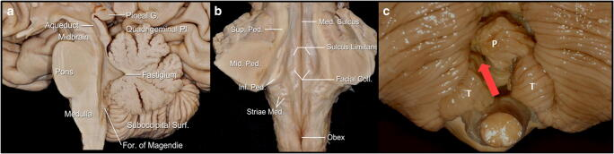
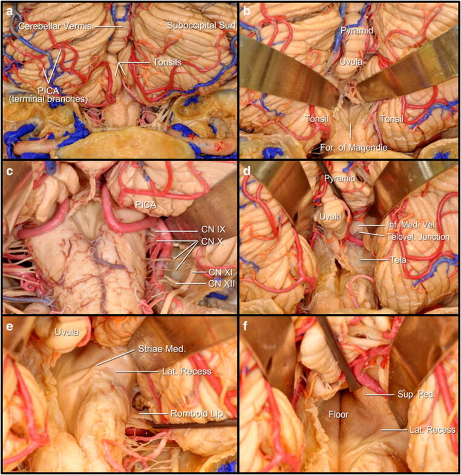
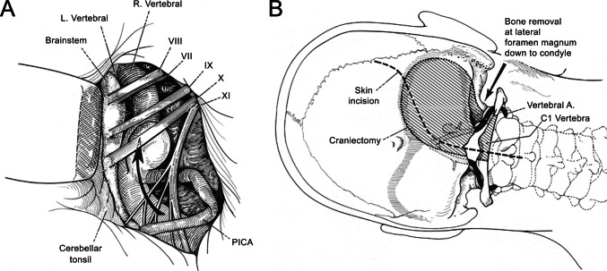
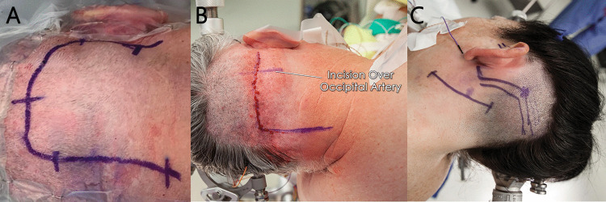
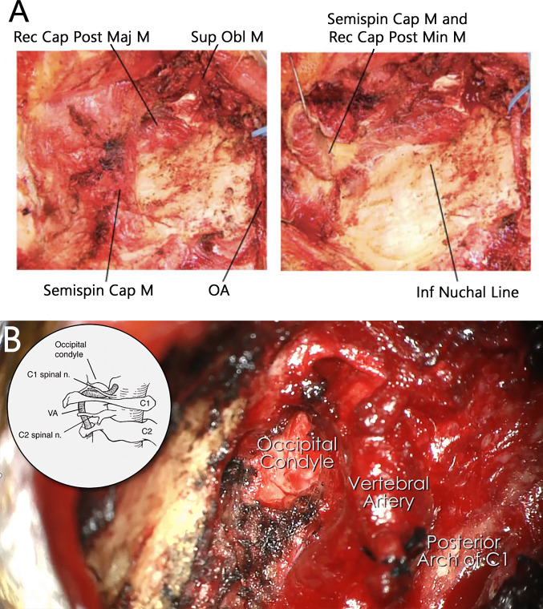

# Operative Approach: Midline Suboccipital Craniotomy (Posterior Fossa Craniotomy / Craniectomy)

<!-- BEGIN CASE SNAPSHOT -->

## Case / Approach Snapshot

- **Anatomy at risk:** corridor-defining nerves, arteries, veins/sinuses, cisterns, bone landmarks, muscle/fascial planes, and closure structures that determine exposure and morbidity.
- **Operative steps:** confirm position and trajectory, mark landmarks, protect soft tissue and named neurovascular structures, perform the bone/soft-tissue corridor, open/close dura or target compartment deliberately, and verify hemostasis/reconstruction; use the detailed operative sequence and approach notes below as the step-by-step source.
- **Rescue plans:** brain relaxation failure, venous or sinus bleeding, cranial nerve/perforator risk, exposure that is too narrow, CSF leak, cosmetic/temporalis/frontalis problems, and conversion to a wider or alternate corridor.
- **Figures:** review [Figures, Imaging & Video](#figures-imaging--video) and the [Curated Image Set](#curated-image-set); embedded local figures should remain open-access, public-domain, or otherwise reusable with attribution.
- **Papers:** review [High-Yield Literature](#high-yield-literature) for seminal sources, modern reviews, and outcome data specific to this page.

<!-- END CASE SNAPSHOT -->

## Figures, Imaging & Video

**🎥 Operative video** — [search operative video on YouTube ▸](https://www.youtube.com/results?search_query=posterior+fossa+tumor+surgery) · [The Neurosurgical Atlas ▸](https://www.neurosurgicalatlas.com)

[Neurosurgical Atlas — Midline Suboccipital](https://www.neurosurgicalatlas.com/volumes/cranial-approaches/midline-suboccipital-craniotomy) · [Rhoton posterior fossa anatomy (PMC)](https://www.ncbi.nlm.nih.gov/pmc/?term=rhoton+posterior+fossa+surgical+anatomy) · [Radiopaedia — posterior fossa](https://radiopaedia.org/search?q=posterior+fossa+tumor&scope=all) · [PubMed Central — suboccipital craniotomy](https://www.ncbi.nlm.nih.gov/pmc/?term=suboccipital+craniotomy+posterior+fossa)

---

<!-- BEGIN CURATED LITERATURE -->

## High-Yield Literature

- **Telovelar surgical approach** — Ghali MGZ. Neurosurgical review 2021. [PubMed](https://pubmed.ncbi.nlm.nih.gov/31807931/)
- **Anatomical Step-by-Step Dissection of Midline Suboccipital Approaches to the Fourth Ventricle for Trainees: Surgical Anatomy of the Telovelar, Transvermian, and Superior Transvelar Routes, Surgical Principles, and Illustrative Cases** — Dang DD. Journal of neurological surgery. Part B, Skull base 2024. [PubMed](https://pubmed.ncbi.nlm.nih.gov/38449580/)
- **The far-lateral approach for foramen magnum meningiomas** — Flores BC. Neurosurgical focus 2013. [PubMed](https://pubmed.ncbi.nlm.nih.gov/24289120/)
- **Midline Suboccipital Unilateral Trans-Cerebellomedullary Fissure Approach for Clipping of Ruptured VA-PICA Aneurysm: Two-Dimensional Operative Video** — Matsuo S. World neurosurgery 2023. [PubMed](https://pubmed.ncbi.nlm.nih.gov/36739896/)
- **Primary intraventricular schwannomas** — Oertel MF. Clinical neurology and neurosurgery 2009. [PubMed](https://pubmed.ncbi.nlm.nih.gov/19632768/)
- **Lateral supracerebellar infratentorial approach for microsurgical resection of large midline pineal region tumors: techniques to expand the operative corridor** — Kulwin C. Journal of neurosurgery 2016. [PubMed](https://pubmed.ncbi.nlm.nih.gov/26275000/)
- **A system of anatomical triangles defining dissection routes to brainstem cavernous malformations: definitions and application to a cohort of 183 patients** — Benner D. Journal of neurosurgery 2023. [PubMed](https://pubmed.ncbi.nlm.nih.gov/36029260/)
- **Microsurgical Treatment for a Ruptured Posterior Inferior Cerebellar Artery Aneurysm: A 3-Dimensional Surgical Video and Anatomic Landmarks Review** — Chang Mulato JE. World neurosurgery 2022. [PubMed](https://pubmed.ncbi.nlm.nih.gov/34856402/)
- **Anatomic, qualitative, and quantitative evaluation of the variants of the infratentorial supracerebellar approach to the posteroinferior thalamus** — de Oliveira Manduca Palmiero H. Neurosurgical review 2021. [PubMed](https://pubmed.ncbi.nlm.nih.gov/33098480/)
- **A surgical technique to expand the operative corridor for supracerebellar infratentorial approaches: technical note** — Rey-Dios R. Acta neurochirurgica 2013. [PubMed](https://pubmed.ncbi.nlm.nih.gov/23982230/)

<!-- END CURATED LITERATURE -->

<!-- BEGIN CURATED IMAGE SET -->

## Curated Image Set

Open-access figures are embedded from PubMed Central articles and kept unique to this guide.

*Fig. 1. Cerebellomedullary fissure approaches mapped on the external surface of the fourth ventricle. Source: [The telovelar approach reshaped: a new perspective from inside the fourth ventricle](https://pmc.ncbi.nlm.nih.gov/articles/PMC12963120/) — Child's Nervous System 2026; CC BY.*

*Fig. 2. Endoscopic anatomical mapping of the fourth ventricle from aqueduct to caudal floor. Source: [The telovelar approach reshaped: a new perspective from inside the fourth ventricle](https://pmc.ncbi.nlm.nih.gov/articles/PMC12963120/) — Child's Nervous System 2026; CC BY.*

*FIGURE 1. Midline suboccipital keyhole craniotomy for lesions of the fourth ventricle. (A) The skin incision was placed median extending from the line between the tips of the bilateral mastoid to... Source: [Microsurgical Management of Fourth Ventricle Lesions Via the Median Suboccipital Keyhole Telovelar Approach](https://pmc.ncbi.nlm.nih.gov/articles/PMC9944752/) — The Journal of Craniofacial Surgery 2023; CC BY-NC-ND.*

*FIGURE 2. Preoperative and postoperative enhanced magnetic resonance imaging in a typical case. (A–C) Preoperative magnetic resonance imaging revealed a mass in the fourth ventricle with... Source: [Microsurgical Management of Fourth Ventricle Lesions Via the Median Suboccipital Keyhole Telovelar Approach](https://pmc.ncbi.nlm.nih.gov/articles/PMC9944752/) — The Journal of Craniofacial Surgery 2023; CC BY-NC-ND.*

*FIGURE 3. Intraoperative photos of a typical case. (A) The bilateral cerebellar tonsils, uvula, and posterior inferior cerebellar artery (PICA) could be observed after opening and retraction of... Source: [Microsurgical Management of Fourth Ventricle Lesions Via the Median Suboccipital Keyhole Telovelar Approach](https://pmc.ncbi.nlm.nih.gov/articles/PMC9944752/) — The Journal of Craniofacial Surgery 2023; CC BY-NC-ND.*

*Fig. 1. Main anatomic external landmarks of brainstem and cerebellum: a Midline sagittal view of the brainstem and cerebellum; b coronal view at the level of the middle cerebellar peduncles of... Source: [Medial-tonsillar telovelar approach for resection of a superior medullary velum cerebral cavernous malformation: anatomical and tractography study of the surgical approach and functional implications](https://pmc.ncbi.nlm.nih.gov/articles/PMC7886669/) — Acta Neurochirurgica 2020; CC BY.*

*Fig. 2. Anatomy of the microsurgical approach to the superior medullary velum via a medial-tonsillar approach: a suboccipital surface of the cerebellum and posterior aspect of the medulla... Source: [Medial-tonsillar telovelar approach for resection of a superior medullary velum cerebral cavernous malformation: anatomical and tractography study of the surgical approach and functional implications](https://pmc.ncbi.nlm.nih.gov/articles/PMC7886669/) — Acta Neurochirurgica 2020; CC BY.*

*Fig. 2. Early anatomical description of the far-lateral approach (FLA). Early anatomical and technical depictions of the FLA from the report by Heros [25], which was widely regarded as the first... Source: [History and evolution of the far-lateral approach in neurosurgery](https://pmc.ncbi.nlm.nih.gov/articles/PMC13230306/) — Acta Neurochirurgica 2026; CC BY-NC-ND.*

*Fig. 3. Variations in skin incision design for the far-lateral approach. A Photograph showing a right-sided U-shaped modified far lateral incision extending from just below the mastoid tip... Source: [History and evolution of the far-lateral approach in neurosurgery](https://pmc.ncbi.nlm.nih.gov/articles/PMC13230306/) — Acta Neurochirurgica 2026; CC BY-NC-ND.*

*Fig. 4. Variation in soft tissue and muscle dissection for the far-lateral approach. A Intraoperative photographs showing a layered, anatomically meticulous dissection technique, demonstrating... Source: [History and evolution of the far-lateral approach in neurosurgery](https://pmc.ncbi.nlm.nih.gov/articles/PMC13230306/) — Acta Neurochirurgica 2026; CC BY-NC-ND.*

<!-- END CURATED IMAGE SET -->

The midline suboccipital craniotomy is the **workhorse posterior approach to the cerebellum, fourth ventricle, and dorsal brainstem.** Its midline trajectory through the avascular nuchal raphe gives rapid, low-morbidity access to the vermis, cerebellar hemispheres, cisterna magna, and fourth ventricle floor — the corridor used for cerebellar metastases, hemangioblastomas, medulloblastomas, Chiari decompression, cerebellar hemorrhage evacuation, and fourth ventricle tumors. The approach can be extended superiorly toward the tentorial incisura (supracerebellar infratentorial variant for pineal region lesions) or laterally to incorporate the foramen magnum and C1 arch for tonsillar/craniocervical pathology.

---

## General Considerations

- **What it accesses:** the cerebellar vermis and hemispheres, the roof and cavity of the fourth ventricle (via the telovelar route), the cisterna magna, the cerebellar tonsils, and the dorsal surface of the brainstem. Extended superiorly, it reaches the tentorial incisura and the pineal region (supracerebellar infratentorial); extended inferolaterally, it reaches the foramen magnum rim and the craniocervical junction.
- **Core principle:** a midline approach through the **nuchal raphe (ligamentum nuchae)** is nearly avascular and avoids denervating the paraspinal muscles, keeping morbidity low. The surgeon works between or through the cerebellar tonsils and the inferior medullary velum to enter the fourth ventricle — **not through the vermis** — to preserve the posterior cerebellar peduncles and vermian function.
- **Retraction philosophy:** open the cisterna magna early for CSF egress and cerebellar relaxation; **fixed cerebellar retraction causes avoidable mutism and ataxia**, especially in children. Dynamic retraction and gravity (prone or concorde position) suffice when the brain is slack.
- **Craniotomy vs craniectomy:** in adults, a replaced bone flap is preferred when possible (reduces headache and pseudomeningocele). In pediatric Chiari and some tumor cases, **craniectomy with duraplasty** is standard because reconstitution of the bony opening is the goal. The choice depends on pathology and intent (see Variants).

### Indications
- Cerebellar metastases, hemangioblastomas → see [posterior-fossa-tumor.md](../cranial-tumor/posterior-fossa-tumor.md)
- Medulloblastoma (pediatric and adult), ependymoma, pilocytic astrocytoma → see [pediatric-posterior-fossa-tumor.md](../pediatric/pediatric-posterior-fossa-tumor.md)
- Fourth ventricle tumors (choroid plexus papilloma, subependymoma, ependymoma)
- Chiari I/II decompression → see [chiari-decompression.md](../cranial-functional/chiari-decompression.md)
- Cerebellar hemorrhage evacuation (spontaneous or traumatic)
- Pineal region lesions (supracerebellar infratentorial variant) → see [pineal-region-tumor.md](../cranial-tumor/pineal-region-tumor.md) · [supracerebellar-infratentorial-approach.md](supracerebellar-infratentorial-approach.md)
- Cerebellar abscess, fourth ventricle cysticercosis, dermoid/epidermoid

### Relative limitations
- Lesions ventral to the brainstem (ventral medulla, lower clivus) are not reached — use the [far-lateral](far-lateral-craniotomy.md) or endoscopic endonasal approach.
- Laterally placed CPA lesions are better served by the [retrosigmoid craniotomy](retrosigmoid-craniotomy.md).
- Large tumors with significant supratentorial extension may require a combined or staged approach (occipital transtentorial or sitting-position supracerebellar).

---

## Preoperative Evaluation

- **MRI** with gadolinium and thin-cut axial/sagittal sequences: tumor location (vermian vs hemispheric vs intraventricular), brainstem invasion, leptomeningeal seeding (whole-spine MRI for medulloblastoma/ependymoma), tonsillar position and syrinx for Chiari.
- **CT head:** hydrocephalus assessment (temporal horn size, third ventricle dilation, transependymal edema); bony anatomy of the occiput, foramen magnum, and C1 if craniocervical extension is planned.
- **MRV / CT venogram** if the craniotomy will approach the torcula or transverse sinuses — confirm sinus patency and dominance before any sinus-adjacent bone work.
- **Hydrocephalus management:** acute obstructive hydrocephalus may require **pre-operative EVD** or endoscopic third ventriculostomy before definitive posterior fossa surgery; a temporizing measure at the time of surgery is to place an EVD through Frazier's point before opening the posterior fossa.
- **Steroids:** dexamethasone 10 mg load → 4 mg q6h for tumor-associated edema; not routinely needed for Chiari.
- **AED prophylaxis** is generally **not indicated** for infratentorial lesions (low seizure risk) unless there is supratentorial involvement.

## Logistics, OR Setup & Orders
- **OR setup:** Mayfield, microscope/endoscope as needed, navigation, cranial nerve monitoring/BAER when relevant, Doppler/air-embolism readiness for sitting or semisitting positions, and watertight closure materials.
- **Special needs:** arterial line, Foley, antiemetic plan, dexamethasone when tumor/edema risk warrants it, EVD/CSF diversion plan, VAE monitoring when sitting, and lower-CN airway/swallow contingency.
- **Immediate postop orders:** posterior fossa neuro checks, CN V-XII and swallow/voice screen, HOB elevation, CT for hemorrhage/hydrocephalus when indicated, MRI for tumor EOR, CSF leak/pseudomeningocele watch, and nausea control.

## Anesthesia & Neuromonitoring

- GA; TIVA preferred when motor/sensory evoked potentials are used.
- **Monitoring:** SSEP and MEP routinely for lesions near the brainstem or cerebellar peduncles; **lower cranial nerve EMG** (IX, X, XII) for floor-of-4th-ventricle tumors; facial EMG when working near the facial colliculus.
- **Prone positioning considerations:** secure airway (reinforced ETT, taped), eyes protected with foam headrest or Mayfield with padded horseshoe, no direct pressure on globes.
- Arterial line; consider central access for large tumors or if VAE risk exists in the sitting variant.

---

## Relevant Surgical Anatomy

**Bony anatomy.** The **occipital squama** is thick at the midline ridge (internal occipital crest/protuberance) and thins laterally. The **external occipital protuberance (inion)** marks the surface landmark of the **torcula (confluence of sinuses)** — the craniotomy must stay below this. The **superior nuchal line** corresponds roughly to the transverse sinus. The **foramen magnum** inferior rim and **posterior arch of C1** define the caudal extent.

**Venous sinuses.** The **torcula** (confluence of superior sagittal, straight, and both transverse sinuses) sits at or just below the inion. The **transverse sinuses** run laterally in the tentorium along the superior nuchal line. The **occipital sinus** is variable but runs in the **internal occipital crest** (the falx cerebelli) — it is a midline hazard during dural opening and can bleed briskly; it drains into the torcula above and the marginal sinus/suboccipital venous plexus below.

**Nuchal muscles (superficial → deep).** Trapezius → semispinalis capitis → **rectus capitis posterior major and minor, obliquus capitis superior and inferior** (the suboccipital triangle). The **greater occipital nerve (C2 dorsal ramus)** pierces the semispinalis and runs superiorly under the trapezius — it is encountered laterally and should be preserved to avoid occipital neuralgia.

**Vertebral artery (V3 segment).** After exiting the C1 transverse foramen, the VA runs posteriorly in the **sulcus arteriosus** on the superior surface of the C1 posterior arch, then pierces the atlanto-occipital membrane to enter the dura. Its extradural loop sits **≈1.5 cm lateral to midline at C1** — midline work is safe, but lateral extension of the craniectomy or C1 laminectomy must respect this distance.

**PICA.** Originates from the intradural VA, loops around the cerebellar tonsils (caudal loop in the cisterna magna), then ascends between the tonsils and medulla — its tonsillomedullary and telovelotonsillar segments define the surgical anatomy of the telovelar approach. **Preserving PICA branches is essential** to avoid lateral medullary/cerebellar infarction.

**Fourth ventricle floor.** The rhomboid fossa contains motor nuclei in a small area: **facial colliculus** (CN VII genu wrapping around the abducens nucleus), **hypoglossal and vagal trigones** inferiorly, the **obex** at the caudal apex, and the **area postrema** (chemoreceptor trigger zone). Surgical manipulation of the floor causes bradycardia, apnea, and cranial neuropathies — the floor is a **no-go zone** except for intrinsic lesions, and even then with mapping.

---

## Step-by-Step Technique

### Positioning
- **Prone** is standard for most midline posterior fossa work: patient on a Wilson or Jackson frame, head in **Mayfield 3-pin fixation**, flexed (chin tucked, ~2 fingerbreadths chin-to-sternum) to open the cervicooccipital angle, and slightly elevated above the heart for venous drainage. Pins: two anterior (forehead bilaterally), one posterior (contralateral to dominant hand, low parietal).
- **Concorde (modified prone with head elevated ~30°):** reduces venous pressure further; useful for vascular lesions and hemangioblastomas.
- Confirm the neck is not hyperflexed (risk of cervical cord compression, especially in Chiari/small posterior fossa), and the abdomen hangs free (reduces epidural venous pressure). Eyes off all pressure surfaces. Verify venous drainage (no jugular kinking) after final position.

### Incision & Muscle Dissection
- **Midline linear incision** from ~2 cm above the inion (never above the torcula) to the **spinous process of C2** (extend to C3–4 for Chiari or when C1 laminectomy is needed). Mark the inion, spinous processes, and planned craniotomy on the skin.
- Incise skin and subcutaneous tissue to the **ligamentum nuchae (nuchal raphe)** — this midline avascular plane separates the bilateral paraspinal muscles and is the key to a bloodless dissection. Monopolar cautery splits the raphe directly onto bone.
- Subperiosteal dissection strips the suboccipital muscles laterally off the occiput, exposing the squama from the superior nuchal line to the foramen magnum rim. Extend laterally only as needed — **staying within 1.5 cm of midline at C1** protects the vertebral artery.
- For C1 laminectomy (Chiari, foramen magnum lesions): dissect the posterior arch of C1 subperiosteally from medial to lateral; the VA groove is palpable at ~1.5 cm — do not pass lateral to it.

### Craniotomy / Craniectomy
1. **Burr hole(s):** one or two, placed in the midline just below the transverse sinus (below the inion/superior nuchal line) and ~2 cm lateral if a craniotomy flap is planned. Navigation or palpation of the internal occipital protuberance guides superior placement.
2. **Craniotomy (preferred in adults):** turn a bone flap using a craniotome, keeping the superior cut just below the transverse sinuses. A standard window is ~4–5 cm wide and extends from the foramen magnum rim to 1–2 cm below the transverse sinuses. The bone at the midline ridge/internal occipital crest is thick — a cutting burr thins it before the footplate crosses.
3. **Craniectomy (common in children and Chiari):** rongeur or high-speed drill removes bone piecemeal from the burr hole; this avoids the footplate crossing the midline keel and is faster in thin pediatric bone.
4. For Chiari or fourth ventricle lesions, remove the **posterior lip of the foramen magnum** (foramen magnum decompression) and perform a **C1 posterior arch laminectomy** as needed.
5. **Wax all exposed diploic/emissary veins and occipital bone edges.** Control the suboccipital venous plexus with bipolar and hemostatic agents.

### Dural Opening
- Open the dura in a **Y-shaped** fashion: two limbs diverge superolaterally from a midline vertical incision, creating flaps that are tacked laterally. Alternatively, a cruciate or inverted-U opening based superiorly works well.
- **Beware the occipital sinus** in the midline falx cerebelli — it may be large, especially in children. Coagulate and divide it, or open the dura slightly off-midline and control it under direct vision.
- Release CSF from the **cisterna magna** early (incise the arachnoid between the tonsils inferiorly) to relax the cerebellum before any further dissection.
- For Chiari: the dural opening and duraplasty (with pericranial or synthetic graft) may be the extent of the procedure.

### Intradural Work (Tumor / 4th Ventricle Access)
1. Under the microscope, identify the **cerebellar tonsils, PICA, and the inferior medullary velum** (tela choroidea).
2. **Telovelar approach to the fourth ventricle:** gently separate the tonsils (they may be displaced by tumor); incise the **tela choroidea** and **inferior medullary velum** between the PICA's tonsillomedullary segments — this opens the fourth ventricle floor-to-roof **without splitting the vermis**, preserving posterior cerebellar peduncle fibers and reducing the risk of cerebellar mutism.
3. For **cerebellar hemisphere tumors**: a corticotomy through non-eloquent cerebellar cortex guided by navigation accesses the lesion; internal debulking → capsule dissection using standard microsurgical technique.
4. **Fourth ventricle floor discipline:** tumor attached to the floor is the critical decision point. Mapped safe-entry zones (e.g., the peritrigeminal zone, the suprafacial triangle) guide limited entry; aggressive stripping of the floor causes permanent CN deficits. If residual tumor is densely adherent, accept a subtotal resection and plan adjuvant therapy.
5. Achieve hemostasis meticulously — the posterior fossa is unforgiving of postoperative hematoma given the small volume and proximity to the brainstem.

---

## Closure

- **Watertight dural closure** is critical: primary closure supplemented with a dural graft (autologous pericranium or a synthetic substitute) and fibrin sealant. A lax, watertight duraplasty (not a tight closure) is the goal for Chiari to maintain the decompressed volume.
- **Replace the bone flap** with titanium plates or suture fixation if a craniotomy was performed.
- **Layered muscle and fascial closure** through the nuchal raphe — this is the second barrier against CSF leak and must be meticulous. Close the deep fascial layer, then the superficial muscle/fascia, galea, and skin separately.
- **CSF diversion:** if hydrocephalus persists or is anticipated (large intraventricular tumor, poor preoperative absorption), leave the EVD in place or plan for early ventriculoperitoneal shunt/ETV.

---

## Key Pitfalls & Bailouts

- **Respect the torcula.** The inion is the surface landmark, but the confluence may sit slightly above or below it. Never place burr holes above the inion without navigation. A torcula injury causes catastrophic venous bleeding — control with direct pressure, Gelfoam, and repair; do not ligate or clip the confluence.
- **Occipital sinus can surprise you.** It is variable in size and sometimes dominant in children. Identify and control it before committing the dural opening.
- **Vertebral artery at C1.** The V3 segment is safe at midline but vulnerable ≥1.5 cm laterally. If the laminectomy must extend laterally, identify the VA groove by palpation and stay medial to it; if the VA is inadvertently encountered, do not panic — compress, define the injury, and consider direct repair or clip/wrap.
- **Cerebellar mutism syndrome (posterior fossa syndrome):** most common in pediatric medulloblastoma surgery. Risk factors include vermian splitting, bilateral cerebellar retraction, and tumor adherent to the floor. Use the telovelar approach, avoid fixed retractors, and minimize floor manipulation.
- **Postoperative hydrocephalus:** ~30% of posterior fossa tumors require permanent CSF diversion. Keep the EVD in place and wean gradually postoperatively.
- **Tight posterior fossa swelling:** if the cerebellum is tense at opening (acute hemorrhage, malignant edema), consider EVD drainage before dural opening and have mannitol/hypertonic saline running. If swelling prevents closure, leave the dura open (duraplasty with a lax graft) and craniectomy rather than forcing a tight closure that risks upward transtentorial herniation.

---

## Variants

- **Sitting / semi-sitting position:** provides excellent gravity drainage and a clean surgical field for midline tumors and the supracerebellar infratentorial variant. Requires PFO screening (echocardiogram), precordial Doppler, end-tidal CO₂ monitoring, and a right-atrial catheter for VAE aspiration. Risk of venous air embolism and tension pneumocephalus. Used selectively at experienced centers.
- **Telovelar approach (standard for 4th ventricle access):** dissection through the tela choroidea and inferior medullary velum to enter the fourth ventricle without a vermian incision — this is the default technique described above and has largely replaced the transvermian approach.
- **Supracerebellar infratentorial (SCIT) variant:** the same bony window extended superiorly to the transverse sinuses, with the patient in sitting or Concorde position; the cerebellum falls away from the tentorium by gravity, exposing the pineal region, posterior third ventricle, and tentorial incisura. This is a distinct approach chapter → see [supracerebellar-infratentorial-approach.md](supracerebellar-infratentorial-approach.md).
- **Craniotomy vs craniectomy decision:** craniotomy (bone flap replaced) is preferred in adults for elective tumor surgery — reduces headache and pseudomeningocele. Craniectomy is standard for Chiari decompression (the goal is to enlarge the bony opening) and is often simpler in children with thin bone. Cranioplasty with methylmethacrylate or titanium mesh can reconstruct the defect in revision or large craniectomies.

---

## Cross-links
- Tumors: [posterior-fossa-tumor.md](../cranial-tumor/posterior-fossa-tumor.md) · [pineal-region-tumor.md](../cranial-tumor/pineal-region-tumor.md) · [pediatric-posterior-fossa-tumor.md](../pediatric/pediatric-posterior-fossa-tumor.md)
- Functional: [chiari-decompression.md](../cranial-functional/chiari-decompression.md)
- Related corridors: [retrosigmoid-craniotomy.md](retrosigmoid-craniotomy.md) · [far-lateral-craniotomy.md](far-lateral-craniotomy.md) · [supracerebellar-infratentorial-approach.md](supracerebellar-infratentorial-approach.md)

<!-- BEGIN FIGURE USE ATTRIBUTION -->

## Figure Use & Attribution

> **About the figures.** Copyrighted operative figures/videos are **linked** (Neurosurgical Atlas, Rhoton); embedded images are **public-domain** (Gray's Anatomy) or **CC‑BY** (open-access cadaveric anatomy), credited beneath each image. See [media-sources.md](../../resources/media-sources.md) and [figures/CREDITS.md](../../figures/CREDITS.md).
>
> **Atlas chapters & video:** [Midline Suboccipital Craniotomy — Neurosurgical Atlas](https://www.neurosurgicalatlas.com/volumes/cranial-approaches/midline-suboccipital-craniotomy) · [Posterior Fossa Craniotomy (Neuroanatomy)](https://www.neurosurgicalatlas.com/neuroanatomy/posterior-fossa-craniotomy) · [Telovelar Approach to the Fourth Ventricle](https://www.neurosurgicalatlas.com/volumes/cranial-approaches/telovelar-approach-to-the-fourth-ventricle) · [Cranial Approaches — General Principles](https://www.neurosurgicalatlas.com/volumes/cranial-approaches/general-principles)

<!-- END FIGURE USE ATTRIBUTION -->

<!-- BEGIN CHIEF LEVEL TAKEAWAYS -->

## Chief-Level Corridor Review

Use these as the senior-level mental model for **Midline Suboccipital Craniotomy (Posterior Fossa Craniotomy / Craniectomy)**:

- **Decision point:** Define the exposure goal before incision: target, working angles, proximal/distal control, and the structure that cannot tolerate retraction.
- **Technical lever:** Know the first irreversible step: bone removal, dural opening, vascular control, or muscle/fascial division that commits the corridor.
- **Bailout:** Verbalize the bailout: extend exposure, change trajectory, add CSF drainage, obtain proximal control, convert to a larger corridor, or stop for imaging.
- **Postop watch:** Protect closure from the start: vascularized tissue, watertight dural/reconstruction plan, dead-space control, and drain strategy should be chosen before the final intradural step.

<!-- END CHIEF LEVEL TAKEAWAYS -->

<!-- BEGIN COMMON PIMP QUESTIONS -->

## Common Pimp Questions

Use these to pressure-test preparation for **Midline Suboccipital Craniotomy (Posterior Fossa Craniotomy / Craniectomy)**:

1. What patient position and head rotation make gravity work for this corridor?
2. What named nerve, vessel, sinus, or muscle/fascial plane is most commonly injured?
3. What bone work or soft-tissue step creates the exposure rather than simply using more retraction?
4. What is the bailout if exposure is inadequate, bleeding occurs, or the brain is tight?
5. What closure maneuver prevents the signature complication of this approach?

<!-- END COMMON PIMP QUESTIONS -->

<!-- BEGIN ATTENDING PREFERENCE VARIABLES -->

## Attending Preference Variables

Items that commonly vary by surgeon or institution:

- **Exact head rotation/flexion/extension and pin placement:** [attending-specific]
- **Skin incision length, flap type, and muscle/fascial preservation technique:** [attending-specific]
- **Drill, rongeur, endoscope, microscope, retractor, and navigation preferences:** [attending-specific]
- **Drain use, closure materials, watertightness threshold, and postop imaging routine:** [attending-specific]

<!-- END ATTENDING PREFERENCE VARIABLES -->

<!-- BEGIN REVERSE APPROACH LINKS -->

## Case Guides Using This Approach

- [Chiari I Malformation Decompression](../../cases/cranial-functional/chiari-decompression.md)

<!-- END REVERSE APPROACH LINKS -->

## References
1. Rhoton AL Jr. *The posterior fossa cisterns.* Neurosurgery. 2000;47(3 Suppl):S287–S297.
2. Mussi ACM, Rhoton AL Jr. *Telovelar approach to the fourth ventricle: microsurgical anatomy.* J Neurosurg. 2000;92(5):812–823.
3. Tanriover N, Ulm AJ, Rhoton AL Jr, Yasuda A. *Comparison of the transvermian and telovelar approaches to the fourth ventricle.* J Neurosurg. 2004;101(3):484–498.
4. Rajesh BJ, Rao BRM, Menon G, et al. *Telovelar approach: technical issues for large fourth ventricle tumors.* Childs Nerv Syst. 2007;23(5):555–562.
5. Cohen-Gadol AA. *Midline Suboccipital Craniotomy.* The Neurosurgical Atlas. [link](https://www.neurosurgicalatlas.com/volumes/cranial-approaches/midline-suboccipital-craniotomy)
6. Robertson PL, Muraszko KM, Holmes EJ, et al. *Incidence and severity of postoperative cerebellar mutism syndrome in children with medulloblastoma.* J Neurosurg Pediatr. 2006;105(6):444–451.
