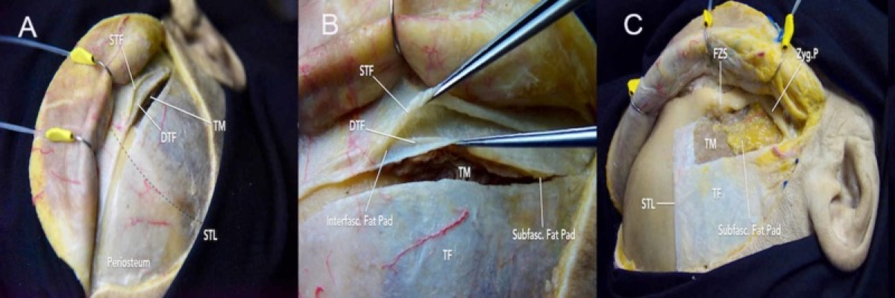
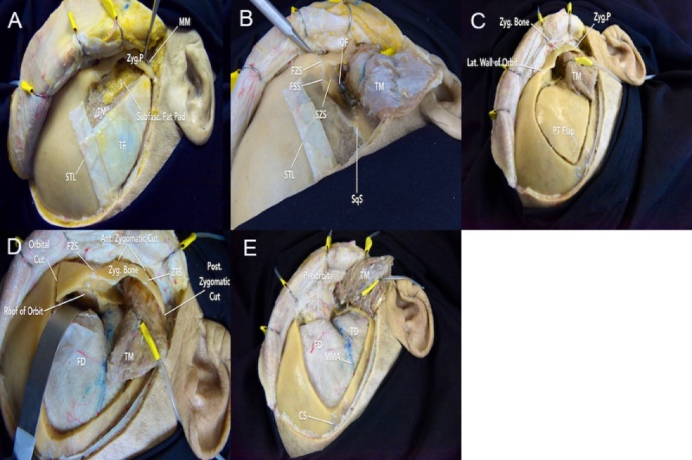
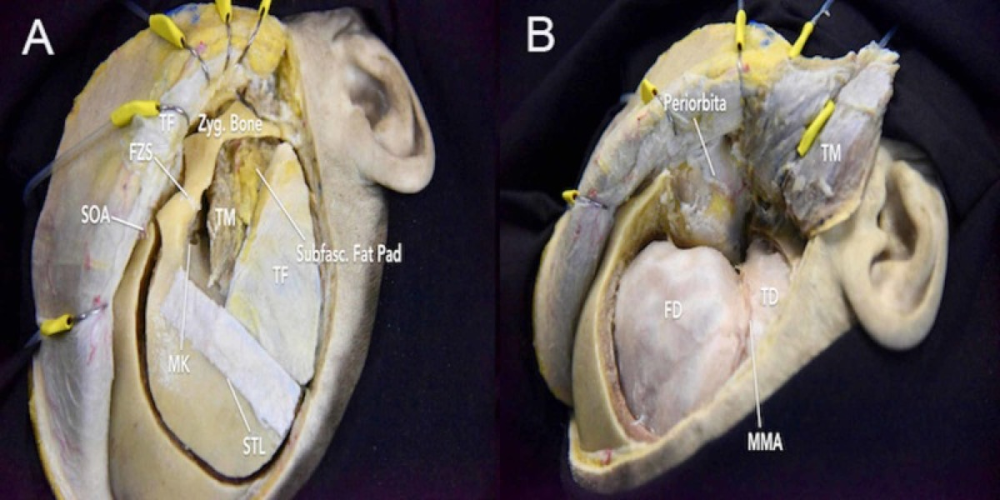
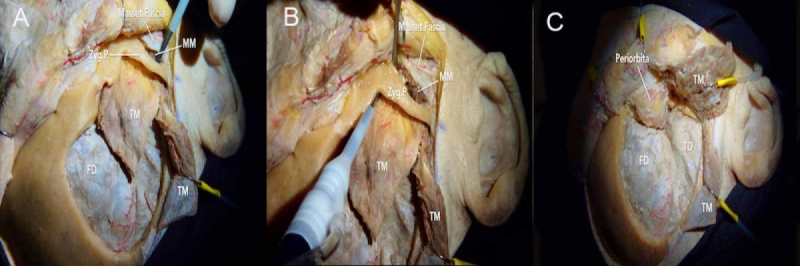
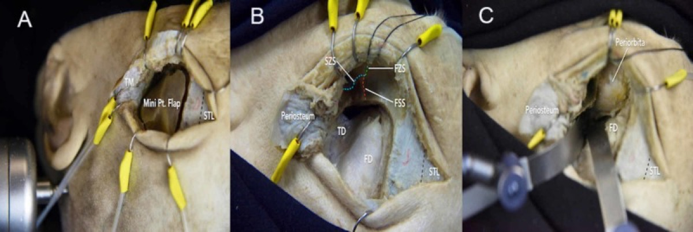

# Operative Approach: Orbitozygomatic (Frontotemporal-Orbitozygomatic, FTOZ) Craniotomy

> **About the figures.** Copyrighted operative figures/videos are **linked** (Neurosurgical Atlas); embedded images are **public-domain** (Gray's Anatomy) or **CC‑BY** (open-access cadaveric anatomy), credited beneath each image. See [media-sources.md](../../resources/media-sources.md) and [figures/CREDITS.md](../../figures/CREDITS.md).
>
> **Atlas chapters & video:** [Orbitozygomatic Craniotomy — Neurosurgical Atlas](https://www.neurosurgicalatlas.com/volumes/cranial-base-surgery/skull-base-exposures/orbitozygomatic-craniotomy) · [Orbitozygomatic Osteotomy: Bone Work (Case)](https://www.neurosurgicalatlas.com/cases/orbitozygomatic-osteotomy-bone-work) · [Orbitozygomatic Operative Neuroanatomy](https://www.neurosurgicalatlas.com/volumes/operative-neuroanatomy/supratentorial-operative-anatomy/orbitozygomatic-approach)

The orbitozygomatic craniotomy is the **maximal anterolateral skull-base exposure** — a [pterional craniotomy](pterional-craniotomy.md) extended by removal of the **superolateral orbital rim/roof and the zygoma**. By taking down the bony bar that the brain otherwise forces you to retract around, it **widens the working angle and shortens the working distance** to the parasellar region, anterior/posterior cavernous sinus, basilar apex, interpeduncular fossa, and upper clivus — while *reducing* brain retraction. It is the surgeon's answer to deep midline and high lesions that a standard pterional reaches only with frontal/temporal lobe retraction.

---

## Figures, Imaging & Video

**🎥 Operative videos:** [YouTube](https://www.youtube.com/results?search_query=orbitozygomatic+surgery) · [Neurosurgical Atlas](https://www.google.com/search?q=orbitozygomatic+site:neurosurgicalatlas.com) · [JNS Neurosurgical Focus: Video](https://www.google.com/search?q=orbitozygomatic+%22neurosurgical+focus%22+video)

**📑 Key evidence — landmark trials & guidelines**

- **ISAT** — Molyneux AJ et al. *Lancet* 2002 — endovascular coiling vs surgical clipping after aneurysmal SAH. [🔗 PubMed](https://pubmed.ncbi.nlm.nih.gov/?term=Molyneux+International+Subarachnoid+Aneurysm+Trial+2002+Lancet)
- **ISUIA** — Wiebers DO et al. *Lancet* 2003 — natural history and treatment risk of unruptured aneurysms. [🔗 PubMed](https://pubmed.ncbi.nlm.nih.gov/?term=Wiebers+unruptured+intracranial+aneurysms+investigators+2003+Lancet)
- **BRAT** — Spetzler RF et al. *J Neurosurg* 2012/2015 — Barrow Ruptured Aneurysm Trial, clip vs coil. [🔗 PubMed](https://pubmed.ncbi.nlm.nih.gov/?term=Spetzler+Barrow+Ruptured+Aneurysm+Trial+clipping+coiling)
- **Guidelines:** [CNS Guidelines](https://www.cns.org/guidelines) · [AANS](https://www.aans.org)
[Neurosurgical Atlas — Orbitozygomatic](https://www.neurosurgicalatlas.com/volumes/cranial-base-surgery/skull-base-exposures/orbitozygomatic-craniotomy) · [Radiopaedia — skull base](https://radiopaedia.org/search?q=orbitozygomatic&scope=all) · [PubMed Central — orbitozygomatic](https://www.ncbi.nlm.nih.gov/pmc/?term=orbitozygomatic+approach+technique)

*Gray's Anatomy (1918), public domain — via Wikimedia Commons. The OZ osteotomy removes the superolateral orbital rim/roof and zygoma to flatten the trajectory across the anterior and middle fossa floors.*

---

## General Considerations

The OZ **builds on the pterional** — review [pterional-craniotomy.md](pterional-craniotomy.md) for the shared scalp, facial-nerve-protecting fascial dissection, temporalis handling, and pterional bone flap; this chapter focuses on **what the orbitozygomatic adds**.

- **Why remove the orbital rim/roof?** It lifts the line of sight off the anterior fossa floor, eliminating the "ski-slope" of frontal-lobe retraction and adding ~20–30° of upward/subfrontal working angle toward the suprasellar and interpeduncular region.
- **Why remove the zygoma?** It lets the temporalis drop inferiorly, opening a flat **subtemporal/transcavernous** trajectory to the petroclival region and basilar apex without temporal-lobe retraction.
- **Variants (know all four):**
  - **One-piece FTOZ** — pterional flap and orbitozygomatic bar removed as a single unit (fewer cuts, faster, robust reconstruction).
  - **Two-piece FTOZ** — pterional flap first, then the orbitozygomatic bar as a separate piece (classic Zabramski/Spetzler; maximal control of the orbital cuts).
  - **Three-piece** — adds a separate zygomatic arch segment.
  - **Mini-orbitozygomatic (MOz) / supraorbital-OZ keyhole** — a MacCarty-keyhole craniotomy plus a limited orbital bar for selected parasellar lesions.
- **When pterional suffices:** an **extended pterional** (orbital-roof flattening + sphenoid drilling, no formal osteotomy) captures much of the benefit for many lesions with less cosmetic cost — reserve the full OZ for high/deep midline targets, large or vascular tumors invading the orbit/cavernous sinus, and low basilar apex aneurysms.

### Indications
- Basilar apex / upper basilar and high-riding aneurysms; giant ICA/ophthalmic aneurysms → see [basilar-tip-aneurysm.md](../cranial-vascular/basilar-tip-aneurysm.md)
- Cavernous sinus, parasellar, and clinoidal meningiomas; tumors crossing orbit ↔ cranium → see [sphenoid-wing-meningioma.md](../cranial-tumor/sphenoid-wing-meningioma.md), [tuberculum-sellae-meningioma.md](../cranial-tumor/tuberculum-sellae-meningioma.md)
- Craniopharyngioma and large suprasellar lesions with superior/retrochiasmatic extension → see [craniopharyngioma.md](../cranial-tumor/craniopharyngioma.md)
- Petroclival meningioma (with subtemporal/transcavernous trajectory) → see [petroclival-meningioma.md](../cranial-tumor/petroclival-meningioma.md)
- Orbital apex / spheno-orbital lesions requiring orbital decompression

---

## Relevant Surgical Anatomy (OZ-specific)
- **MacCarty keyhole:** a single burr hole at the **frontosphenoid/frontozygomatic region** (junction of the frontal process of the zygoma, superior temporal line, and frontozygomatic suture) that exposes **frontal dura above and periorbita below** the orbital roof — the pivot point of the osteotomy.
- **Superior orbital rim & roof;** **lateral orbital wall (greater wing of sphenoid)** between the **superior orbital fissure (SOF)** and **inferior orbital fissure (IOF).** The IOF is the inferior limit of the lateral orbital wall cut and connects the orbit to the infratemporal/pterygopalatine fossa.
- **Zygoma:** body and arch; the **frontozygomatic suture** (superior) and the **zygomaticomaxillary/zygomaticotemporal** junctions are the osteotomy points; the **masseter** attaches to the arch inferiorly.
- **Periorbita** (periosteal sheath of orbital contents) — kept intact to avoid orbital fat herniation/enophthalmos.
- **Frontotemporal (frontalis) branch of CN VII** over the zygoma (protect with interfascial/subfascial dissection — see pterional chapter); **supraorbital nerve/vessels** at the supraorbital notch/foramen (preserve); **infraorbital nerve** in the floor.

---

## Preoperative Evaluation
- Thin-cut **CT** (bone windows) for orbital roof/rim, **frontal sinus** pneumatization, and zygomatic anatomy; **CTA/MRA** for vascular targets; navigation dataset.
- Ophthalmology baseline (vision, fields, motility) for orbital/parasellar lesions.
- Counsel re: transient **periorbital edema, ecchymosis, trismus, and temporal hollowing**; rare **enophthalmos/pulsatile exophthalmos** if periorbita/roof reconstruction is inadequate.

## Anesthesia & Neuromonitoring
- GA, TIVA when MEPs used; lumbar drain for large basal lesions to aid relaxation (see pterional chapter). SSEP/MEP; EEG/burst-suppression capability for temporary clipping; cranial-nerve EMG (III/IV/VI, facial) per target. Normotension (AVM is the BP exception).

---

## Positioning
📷 *[Atlas — OZ positioning](https://www.neurosurgicalatlas.com/volumes/cranial-base-surgery/skull-base-exposures/orbitozygomatic-craniotomy)*

As for the [pterional](pterional-craniotomy.md), supine with the head in Mayfield fixation, but tuned for a basal trajectory:
- **Rotation** ~20–30° to the contralateral side (less for more midline/superior targets such as basilar apex; more for ipsilateral parasellar lesions).
- **Extension** until the **malar eminence is the highest point** so the frontal lobe and orbital contents fall away by gravity — this matters more for the OZ than the pterional because the payoff is the basal subfrontal view.
- Vertex down slightly; ipsilateral shoulder roll if needed; reconfirm IONM after positioning.

## Incision & Soft-Tissue Dissection
📷 *[Atlas — interfascial dissection / exposure](https://www.neurosurgicalatlas.com/volumes/cranial-base-surgery/skull-base-exposures/orbitozygomatic-craniotomy)*

- **Curvilinear (reverse question-mark)** incision behind the hairline, from the zygomatic root (~1 cm anterior to the tragus, **never below the arch** — facial-nerve trunk) to the contralateral mid-pupillary line.
- Use an **interfascial or subfascial** dissection to carry the **superficial temporal fat pad and the frontalis branch of CN VII** down with the flap (see pterional chapter). Expose the **superior and lateral orbital rim, the frontozygomatic suture, the body of the zygoma, and the zygomatic arch** subperiosteally. Preserve the **supraorbital nerve** (release from its notch/foramen with a small osteotome if it is in a true foramen).

*Rodriguez Rubio R, et al. "Immersive Surgical Anatomy of the Frontotemporal-Orbitozygomatic Approach," Cureus 2019;11(11):e6053 — CC BY. The fat pad and facial-nerve branch are kept within the flap.*

- **Temporalis:** reflect (interfascial cuff for reattachment, or single myocutaneous layer) and **mobilize inferiorly**; for the zygomatic osteotomy the muscle is retracted to expose the arch. Preserving the deep temporal pedicle limits atrophy/trismus (see pterional chapter).

---

## Bone Work — Pterional Flap + Orbitozygomatic Osteotomy

### Step 1 — Pterional craniotomy
📷 *[Atlas — pterional flap](pterional-craniotomy.md)*
Perform the standard pterional craniotomy and sphenoid-wing removal first (one-piece OZ keeps the flap connected to the bar; two/three-piece removes the pterional flap separately). Strip dura off the orbital roof and flatten the sphenoid ridge as in the [extended pterional](pterional-craniotomy.md).

### Step 2 — Expose orbit and protect periorbita
With malleable retractors, separate the **periorbita from the orbital roof and lateral wall** (extraperiosteal) above, and from the **inferior orbital fissure** below; protect the globe and periorbita throughout. The **MacCarty keyhole** is completed so frontal dura and periorbita are both visible.

### Step 3 — The osteotomy cuts (reciprocating saw / craniotome)
The classic **two-piece** orbitozygomatic bar is freed by cuts that, together, isolate the orbital rim + lateral orbital wall + zygoma as one unit:
1. **Superior orbital rim** — across the orbital roof, from the MacCarty keyhole medially toward (but sparing) the supraorbital notch.
2. **Lateral orbital wall** — from the keyhole down the greater wing of the sphenoid to the **inferior orbital fissure**, protecting periorbita.
3. **Zygomatic body** — across the **frontozygomatic suture / lateral orbital rim** above and the **zygomatic body** (toward the IOF) so the cuts connect.
4. **Zygomatic arch** — an oblique cut through the arch (anterior to the articular eminence) so the bar, with the malar eminence, lifts free.

*Rodriguez Rubio R, et al. Cureus 2019;11(11):e6053 — CC BY. Two-piece frontotemporal-orbitozygomatic technique.*

*Rodriguez Rubio R, et al. Cureus 2019;11(11):e6053 — CC BY. One-piece variant — flap and bar removed together.*

### Step 4 — Flatten residual bone
Drill the remaining **lateral sphenoid wing, orbital roof irregularities, and the anterior clinoid** (extradural anterior clinoidectomy when needed for paraclinoid/cavernous targets) until the floor is flat — this is where the OZ working angle is truly won.

---

## Dural Opening & Intradural Work
📷 *[Atlas — dural opening / basal cisterns](https://www.neurosurgicalatlas.com/volumes/cranial-base-surgery/skull-base-exposures/orbitozygomatic-craniotomy)*

- Open the dura curvilinearly and reflect it anteroinferiorly toward the now-flattened base; the **frontal and temporal lobes fall away**, exposing the basal cisterns with little or no retraction.
- Release CSF from the carotid/chiasmatic/Sylvian cisterns; split the Sylvian fissure as needed. The expanded corridor supports **subfrontal, trans-Sylvian, subtemporal, and transcavernous** trajectories — proceed to the pathology-specific intradural steps (basilar apex clipping, cavernous/parasellar tumor, craniopharyngioma via the opticocarotid/lamina terminalis windows).

*Sobotta 1909, public domain — via Wikimedia Commons.*

---

## Closure & Reconstruction
📷 *[Atlas — orbital/zygomatic reconstruction](https://www.neurosurgicalatlas.com/cases/orbitozygomatic-osteotomy-bone-work)*

- **Watertight dura** (graft any defect; especially if the SOF/orbit or ventricle was entered). Reconstruct the **orbital roof** if removed (the periorbita must be supported to prevent **pulsatile exophthalmos/enophthalmos**) — bone, mesh, or graft.
- **Replace the orbitozygomatic bar and pterional flap** with low-profile titanium plates; **precise anatomic reduction of the orbital rim and zygomatic arch is essential for cosmesis** (malar projection, no step-off). Burr-hole covers/cranioplasty for contour.
- **Obliterate/patch the frontal sinus** with pericranium if entered. **Reattach temporalis** to its cuff anatomically; suspend to limit hollowing. Layered scalp closure; periorbital pressure dressing reduces edema.

---

### Further operative anatomy & technique

*Rodriguez Rubio R et al., Cureus 2019;11(11):e6053 — CC BY.*

*Rodriguez Rubio R et al., Cureus 2019;11(11):e6053 — CC BY.*

## Nuances & Pitfalls (surgeon-level)
- **Protect the periorbita** — a tear lets orbital fat herniate into the field and predisposes to enophthalmos; repair and support the roof at closure.
- **Reconstruct the orbital rim/roof precisely** — the two feared cosmetic/functional sequelae are **temporal hollowing** (temporalis handling) and **enophthalmos/pulsatile exophthalmos** (roof/periorbita).
- **Spare the supraorbital nerve** (forehead numbness) — release it from its notch/foramen rather than transecting.
- **Mind the frontal sinus** medially (navigation; exenterate + pericranial buttress if entered) and the **IOF** inferiorly (venous/maxillary branches — pack/wax).
- **Don't over-build the approach.** Decide preoperatively whether an extended pterional suffices; the OZ's morbidity is mostly cosmetic and is justified only when the working angle is genuinely needed.
- **Facial-nerve frontal branch** — same rules as pterional: interfascial/subfascial flap, never skeletonize the nerve.
- **Temporalis** — preserve the deep pedicle and reattach anatomically to limit trismus/atrophy.

## Complications
Frontalis (CN VII) palsy; **temporal hollowing/atrophy, trismus**; **enophthalmos / pulsatile exophthalmos / diplopia**; periorbital edema and ecchymosis; supraorbital hypesthesia; CSF leak / frontal-sinus mucocele; cosmetic step-off (rim/arch malreduction); vascular and cranial-nerve injury from the deep work; infection.

---

## Cross-links
- Builds on: [pterional-craniotomy.md](pterional-craniotomy.md) · related: [subtemporal-craniotomy.md](subtemporal-craniotomy.md) · [supraorbital-keyhole-craniotomy.md](supraorbital-keyhole-craniotomy.md)
- Pathology: [basilar-tip-aneurysm.md](../cranial-vascular/basilar-tip-aneurysm.md) · [sphenoid-wing-meningioma.md](../cranial-tumor/sphenoid-wing-meningioma.md) · [tuberculum-sellae-meningioma.md](../cranial-tumor/tuberculum-sellae-meningioma.md) · [craniopharyngioma.md](../cranial-tumor/craniopharyngioma.md) · [petroclival-meningioma.md](../cranial-tumor/petroclival-meningioma.md)

## References
1. Zabramski JM, Kiriş T, Sankhla SK, Cabiol J, Spetzler RF. **Orbitozygomatic craniotomy. Technical note.** *J Neurosurg.* 1998;89(2):336–341.
2. Lemole GM Jr, Henn JS, Zabramski JM, Spetzler RF. **Modifications to the orbitozygomatic approach.** *J Neurosurg.* 2003;99(5):924–930.
3. Shimizu S, Tanriover N, Rhoton AL Jr, Yoshioka N, Fujii K. **MacCarty keyhole and inferior orbital fissure in orbitozygomatic craniotomy.** *Neurosurgery.* 2005;57(1 Suppl):152–159.
4. **Rodriguez Rubio R, et al. Immersive Surgical Anatomy of the Frontotemporal-Orbitozygomatic Approach.** *Cureus.* 2019;11(11):e6053. CC BY. [PMC6945284](https://www.ncbi.nlm.nih.gov/pmc/articles/PMC6945284/)
5. Tanriover N, Rhoton AL Jr, et al. *Microsurgical anatomy of the orbitozygomatic region.*
6. Cohen-Gadol AA. *Orbitozygomatic Craniotomy.* The Neurosurgical Atlas. [link](https://www.neurosurgicalatlas.com/volumes/cranial-base-surgery/skull-base-exposures/orbitozygomatic-craniotomy)
