# Operative Approach: Posterior Cervical Approach (Laminectomy / Laminoplasty / Foraminotomy / Lateral Mass Fixation)

<!-- BEGIN CASE SNAPSHOT -->

## Case / Approach Snapshot

- **Anatomy at risk:** myelopathic cord, exiting roots, dorsal dura, epidural venous plexus, C2 semispinalis attachment, C7/T1 transition, lateral masses, vertebral artery in the transverse foramina, C2 pars/pedicle anatomy, and posterior tension-band musculature.
- **Operative steps:** position the myelopathic neck safely, localize levels, split the nuchal raphe in the midline, expose only the necessary lateral mass/facet anatomy, choose laminectomy/laminoplasty/foraminotomy/fusion strategy, place fixation with VA/root-aware trajectories, decompress without cord manipulation, and close the posterior fascial envelope securely.
- **Rescue plans:** wrong-level exposure, neuromonitoring change, C5 palsy risk, lateral mass or pedicle breach, vertebral artery injury, epidural bleeding, dural tear, post-laminectomy kyphosis, wound dehiscence/infection, and inadequate decompression in kyphotic alignment.
- **Figures:** review [Figures, Imaging & Video](#figures-imaging--video) and the [Curated Image Set](#curated-image-set); embedded local figures should remain open-access, public-domain, or otherwise reusable with attribution.
- **Papers:** review [High-Yield Literature](#high-yield-literature) for seminal sources, modern reviews, and outcome data specific to this page.

<!-- END CASE SNAPSHOT -->

> **About the figures.** Copyrighted operative figures/videos are **linked** (Neurosurgical Atlas, AO Surgery Reference); embedded images are **public-domain** (Gray's Anatomy) or **CC‑BY** (open-access), credited beneath each image. See [media-sources.md](../../resources/media-sources.md) and [figures/CREDITS.md](../../figures/CREDITS.md).
>
> **Technique references:** [AO Surgery Reference — Posterior cervical](https://surgeryreference.aofoundation.org) · [Neurosurgical Atlas — Spine](https://www.neurosurgicalatlas.com) · [Radiopaedia — cervical](https://radiopaedia.org/search?q=cervical%20myelopathy&scope=all)

The posterior cervical approach is the **midline corridor to the posterior elements and dorsal cord/roots** of the cervical spine. Through the avascular **nuchal raphe** it exposes the laminae, facets, and lateral masses for **laminectomy, laminoplasty, laminoforaminotomy, and posterior instrumented fusion (lateral mass / pedicle screws).** It is the approach for **multilevel myelopathy with preserved/lordotic alignment, posterior compression, dorsal tumors, and posterior stabilization** — chosen over the [anterior approach](anterior-cervical-approach.md) when disease is multilevel/dorsal or when posterior tension-band reconstruction is required.

---

## Figures, Imaging & Video

**🎥 Operative video** — [search operative video on YouTube ▸](https://www.youtube.com/results?search_query=cervical+myelopathy+surgery) · [The Neurosurgical Atlas ▸](https://www.neurosurgicalatlas.com)

**CNS Video Library**

<iframe src="https://www.youtube-nocookie.com/embed/5VMTJRhn8oY" title="CNS Neurosurgery 100: Techniques for Open Cervical Spine Instrumentation" loading="lazy" allow="accelerometer; clipboard-write; encrypted-media; picture-in-picture; web-share" allowfullscreen></iframe>

[AO Surgery Reference — posterior cervical](https://surgeryreference.aofoundation.org) · [Neurosurgical Atlas — Spine](https://www.neurosurgicalatlas.com) · [Radiopaedia — cervical stenosis](https://radiopaedia.org/search?q=cervical%20canal%20stenosis&scope=all) · [PubMed Central — lateral mass fixation](https://www.ncbi.nlm.nih.gov/pmc/?term=cervical+lateral+mass+screw+fixation)

---

<!-- BEGIN CURATED LITERATURE -->

## High-Yield Literature

- **Microsurgical Neurovascular Anatomy of the Brain: The Posterior Circulation (Part II)** — Giotta Lucifero A. Acta bio-medica : Atenei Parmensis 2021. [PubMed](https://pubmed.ncbi.nlm.nih.gov/34437362/)
- **Why the Craniovertebral Junction?** — Visocchi M. Acta neurochirurgica. Supplement 2019. [PubMed](https://pubmed.ncbi.nlm.nih.gov/30610295/)
- **High anterior cervical approach to the clivus and foramen magnum: a microsurgical anatomy study** — Russo VM. Neurosurgery 2011. [PubMed](https://pubmed.ncbi.nlm.nih.gov/21415787/)
- **Microsurgical cervical nerve root decompression by anterolateral approach** — Bruneau M. Neurosurgery 2006. [PubMed](https://pubmed.ncbi.nlm.nih.gov/16543867/)
- **The Anterolateral Approach, Revisited for Benign Jugular Foramen Tumors With Predominant Extracranial Extension: Microsurgical Anatomy and Case Series (SevEN-012)** — Park HH. Operative neurosurgery (Hagerstown, Md.) 2023. [PubMed](https://pubmed.ncbi.nlm.nih.gov/37195061/)
- **Anterior Microsurgical Approach to Ventral Lower Cervical Spine Meningiomas: Indications, Surgical Technique and Long Term Outcome** — Fraioli MF. Technology in cancer research & treatment 2015. [PubMed](https://pubmed.ncbi.nlm.nih.gov/26269613/)
- **Applied anatomy of a minimally invasive muscle-splitting approach to posterior C1-C2 fusion: an anatomical feasibility study** — Bodon G. Surgical and radiologic anatomy : SRA 2014. [PubMed](https://pubmed.ncbi.nlm.nih.gov/24584907/)
- **Cochlear implantation using posterior suprameatal approach** — Répássy G. Ear, nose, & throat journal 2018. [PubMed](https://pubmed.ncbi.nlm.nih.gov/30036438/)
- **Microsurgical and endoscopic anatomy of the extended retrosigmoid inframeatal infratemporal approach** — Colasanti R. Neurosurgery 2015. [PubMed](https://pubmed.ncbi.nlm.nih.gov/25599206/)
- **The posterior cervical transdural approach for retro-odontoid mass pseudotumor resection: report of three cases and discussion of the current literature** — Schomacher M. European spine journal : official publication of the European Spine Society, the European Spinal Deformity Society, and the European Section of the Cervical Spine Research Society 2020. [PubMed](https://pubmed.ncbi.nlm.nih.gov/32296950/)

<!-- END CURATED LITERATURE -->

---

<!-- BEGIN CURATED IMAGE SET -->

## Curated Image Set

Open-access figures are embedded from PubMed Central articles and kept unique to this guide.

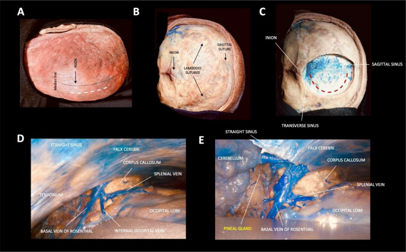
*Fig. 2. A–E. Step-by-step dissection illustrating the occipital interhemispheric transtentorial (OITA) approach Source: [What is the best surgical approach for Pineal Region Tumors? A systematic literature review and anatomical comparative study](https://pmc.ncbi.nlm.nih.gov/articles/PMC13230278/) — Child's Nervous System 2026; CC BY.*

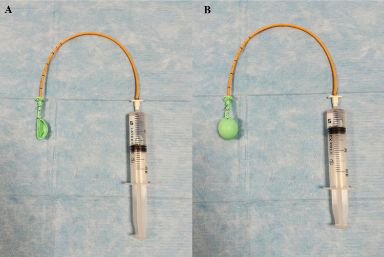
*Fig. 3. Illustration of the water-balloon technique simulating a pineal-region tumor. The latex balloon attached to a ventricular catheter is shown deflated (A) and inflated with water and... Source: [What is the best surgical approach for Pineal Region Tumors? A systematic literature review and anatomical comparative study](https://pmc.ncbi.nlm.nih.gov/articles/PMC13230278/) — Child's Nervous System 2026; CC BY.*

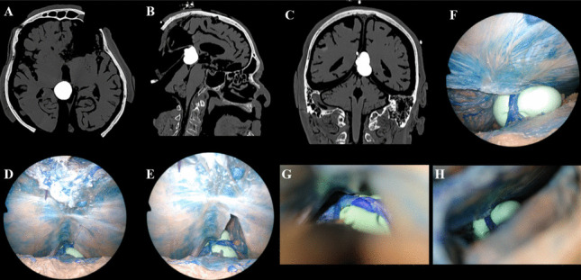
*Fig. 4. A–H. Tumor simulation in Head 1 demonstrating exposure with the SCIT and OITA approaches Source: [What is the best surgical approach for Pineal Region Tumors? A systematic literature review and anatomical comparative study](https://pmc.ncbi.nlm.nih.gov/articles/PMC13230278/) — Child's Nervous System 2026; CC BY.*

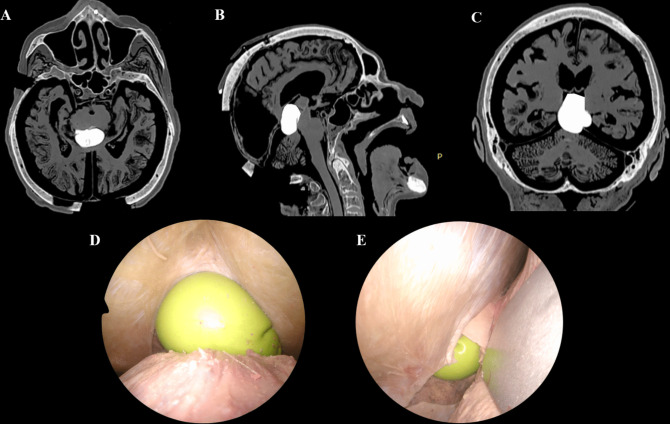
*Fig. 5. A–E. Tumor simulation in Head 2 demonstrating exposure with the SCIT and OITA approaches Source: [What is the best surgical approach for Pineal Region Tumors? A systematic literature review and anatomical comparative study](https://pmc.ncbi.nlm.nih.gov/articles/PMC13230278/) — Child's Nervous System 2026; CC BY.*

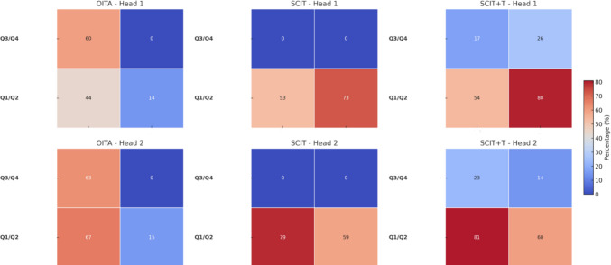
*Fig. 7. Heatmap representation of mean exposure volumes across surgical approaches and anatomical quadrants Source: [What is the best surgical approach for Pineal Region Tumors? A systematic literature review and anatomical comparative study](https://pmc.ncbi.nlm.nih.gov/articles/PMC13230278/) — Child's Nervous System 2026; CC BY.*

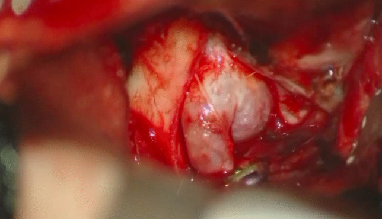
*Fig. 2. After the cervical carotid is clamped at the neck, a temporary clip is applied distal to the aneurysm Source: [Paraclinoid aneurysm clipping: how I do it](https://pmc.ncbi.nlm.nih.gov/articles/PMC12279894/) — Acta Neurochirurgica 2025; CC BY.*

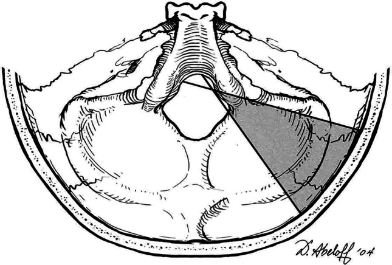
*Fig. 1. Artist’s illustration showing the exposure of the anterolateral brainstem, vertebral artery, basilar region, and the lower cranial nerves afforded by the far-lateral approach. ©... Source: [History and evolution of the far-lateral approach in neurosurgery](https://pmc.ncbi.nlm.nih.gov/articles/PMC13230306/) — Acta Neurochirurgica 2026; CC BY-NC-ND.*

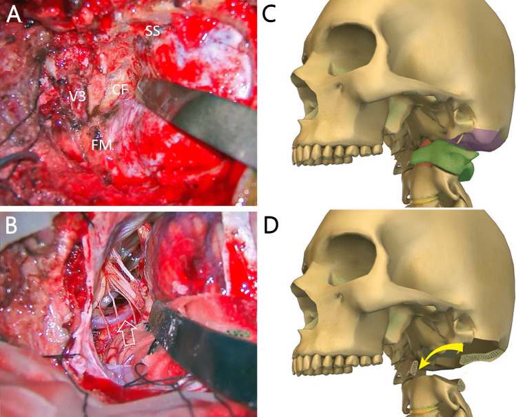
*Fig. 5. Variation in bony exposure of the far-lateral approach (FLA). This figure demonstrates adaptations in bony exposure to different targets along the craniovertebral junction. A, B... Source: [History and evolution of the far-lateral approach in neurosurgery](https://pmc.ncbi.nlm.nih.gov/articles/PMC13230306/) — Acta Neurochirurgica 2026; CC BY-NC-ND.*

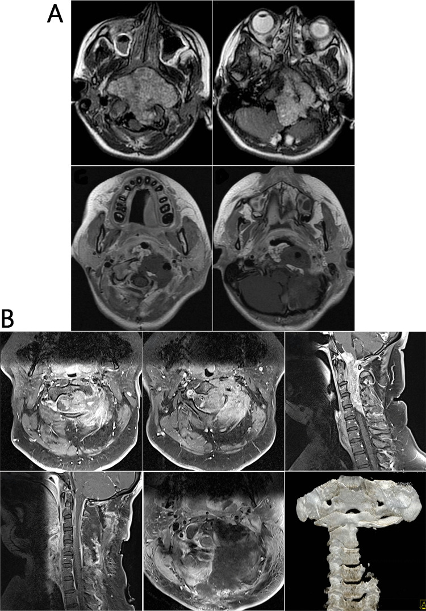
*Fig. 6. Examples of cases in which extensions of the far-lateral approach (FLA) are utilized. A This adolescent patient had a massive clival chordoma with brainstem compression. The ELTO... Source: [History and evolution of the far-lateral approach in neurosurgery](https://pmc.ncbi.nlm.nih.gov/articles/PMC13230306/) — Acta Neurochirurgica 2026; CC BY-NC-ND.*

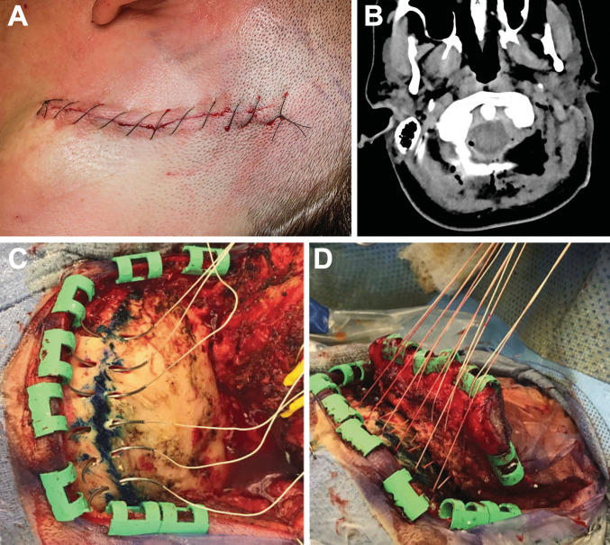
*Fig. 7. Variation in closure technique following the far-lateral approach. A Postoperative photograph showing a curvilinear far lateral skin closure using running nylon sutures. B Axial CT image... Source: [History and evolution of the far-lateral approach in neurosurgery](https://pmc.ncbi.nlm.nih.gov/articles/PMC13230306/) — Acta Neurochirurgica 2026; CC BY-NC-ND.*

<!-- END CURATED IMAGE SET -->

---

## General Considerations
- **What it accesses:** laminae, spinous processes, facet joints, **lateral masses**, the dorsal dura/cord and exiting roots (via foraminotomy), C1 posterior arch and C2 to the cervicothoracic junction.
- **Decompression vs decompression + fusion:** posterior decompression (laminectomy/laminoplasty) relieves dorsal/multilevel compression; **add instrumented fusion** when there is instability, kyphosis risk, or after wide facet resection. **Laminoplasty** preserves the posterior tension band and motion (lower post-laminectomy kyphosis risk) and is favored in younger patients with lordotic alignment.
- **Alignment is the key selection rule:** posterior decompression relies on the cord drifting **dorsally** away from anterior compression — it works in **lordosis/neutral** alignment but **fails in fixed kyphosis** (the cord stays draped over the front), where an anterior or combined approach is needed.

### Indications
- **Multilevel cervical spondylotic myelopathy / OPLL** with lordotic-neutral alignment → [posterior cervical laminectomy & fusion](../spine-degenerative/posterior-cervical-laminectomy-fusion.md), [laminoplasty](../spine-degenerative/cervical-laminoplasty.md)
- **Foraminal radiculopathy** (soft lateral disc/foraminal stenosis) → [posterior cervical foraminotomy](../spine-degenerative/posterior-cervical-foraminotomy.md)
- **Trauma / instability** (facet fracture-dislocation) → [subaxial cervical fracture](../spine-trauma/subaxial-cervical-fracture.md); **CVJ** → [occipitocervical fusion](../spine-trauma/occipitocervical-fusion.md)
- Dorsal intradural/extradural tumors, infection

### Posterior Cervical Decision Table

| Problem | Preferred posterior option | Key caveat |
|---------|----------------------------|------------|
| Multilevel myelopathy, lordotic/neutral alignment | Laminoplasty or laminectomy/fusion | Posterior decompression depends on dorsal cord drift |
| Multilevel myelopathy with instability, kyphosis risk, or neck pain | Laminectomy + fusion | Preserve adjacent facets and restore alignment |
| Young patient with preserved lordosis and motion priority | Laminoplasty | Avoid if significant axial pain/instability/kyphosis |
| Unilateral radiculopathy from foraminal stenosis/lateral disc | Posterior foraminotomy | Avoid excessive facet removal; preserve stability |
| Trauma/facet dislocation/instability | Posterior fixation ± reduction/decompression | CT/CTA defines screw choices and VA risk |
| Fixed kyphosis with anterior compression | Anterior or combined approach | Posterior-only decompression may fail |

---

## Relevant Surgical Anatomy
- **Midline raphe / ligamentum nuchae:** the avascular plane — staying exactly midline minimizes muscle bleeding and denervation.
- **Paraspinal muscles** (trapezius, splenius, semispinalis cervicis, multifidus) — elevated **subperiosteally**; the **semispinalis insertion on C2** is preserved when possible (its detachment contributes to post-op kyphosis/pain).
- **Lateral mass:** the rhomboid of bone between the superior/inferior facets — the screw target (entry ~1 mm medial/inferior to its center; trajectory **lateral and superior** to avoid the **vertebral artery** and **nerve root** — Magerl/An/Roy-Camille variants).
- **Vertebral artery:** in the foramen transversarium, **ventral and medial** to the lateral mass — at risk with errant screw trajectory; **C1 lateral mass** (venous plexus, C2 root/ganglion) and **C2 pars/pedicle** have their own VA relationships; **C7** often takes a **pedicle screw** (small lateral mass).
- **Nerve roots & dura** at the laminae/foramina; the **cord** beneath (no retraction).

## Preoperative Evaluation
- **MRI** (levels, cord signal, dorsal vs ventral compression) and **CT** (bony anatomy, OPLL, facet/lateral mass size); **assess alignment (lordosis vs kyphosis)** — decisive for posterior vs anterior.
- **CTA / review vertebral artery** dominance and anomalies (high-riding VA at C2) before planning C1–C2/pars screws.
- Baseline myelopathy exam; plan instrumentation levels and whether laminoplasty vs laminectomy+fusion.

### Preoperative Planning Checklist
- Document Nurick/mJOA-style myelopathy severity, hand function, gait, bowel/bladder symptoms, and baseline deltoid/biceps strength for C5 palsy comparison.
- Review standing or dynamic films for lordosis, instability, and C2-C7 sagittal vertical axis; supine MRI alone can hide kyphotic failure risk.
- On CT, size lateral masses, identify anomalous/hypoplastic pedicles, facet fractures, OPLL, and prior fusion/laminectomy defects.
- For C1-C2/C2 screws, evaluate vertebral artery course, high-riding VA, pars height, pedicle width, and C2 ganglion/venous plexus exposure.
- Decide whether the construct should stop at C7 or cross the cervicothoracic junction; stopping at a weak transition can invite junctional failure in selected patients.

## Logistics, OR Setup & Orders
- **Typical bed:** floor or step-down for elective degenerative exposure; ICU if trauma, myelopathy with cord signal change, major deformity, thoracic exposure, high EBL, or postoperative airway concern.
- **OR setup:** Jackson/radiolucent spine table or approach-specific lateral/anterior setup, C-arm/O-arm/navigation availability, microscope/loupes, neuromonitoring leads before positioning, and implant trays opened only after final level/plan confirmation.
- **Special needs:** arterial line and Foley for long instrumented cases, type/screen or crossmatch for deformity/corpectomy/trauma, antibiotic redosing plan, MAP support for SCI/myelopathy, and no long paralytic when MEPs are needed.
- **Immediate postop orders:** neuro checks focused on myotomes/sensory level, postop CT/X-rays per construct, brace/activity orders, drain output thresholds, DVT prophylaxis timing, dysphagia/airway monitoring for anterior cervical cases, and rehab mobilization plan.

## Anesthesia & Neuromonitoring
- GA, prone; **SSEP/MEP and EMG** (myelopathy/instrumentation); no long-acting paralytic with MEPs. **Careful prone positioning of the myelopathic neck** (neutral, avoid hyperextension); MAP support for the compressed cord.

---

## Positioning

- **Prone**, head in **Mayfield 3-pin** (or a prone headrest), neck **neutral** (slight flexion opens interlaminar spaces for laminectomy; **avoid flexion in instability**), **reverse Trendelenburg** to lower venous pressure/bleeding and keep the field horizontal.
- **Tape shoulders down** for lower-level fluoroscopy; chest rolls/Wilson-type support; abdomen free; eyes/face protected (prone ION risk). Re-check IONM after final positioning.

## Incision & Soft-Tissue Dissection

- **Midline incision** over the target levels; cut through skin and subcutaneous tissue to the **ligamentum nuchae**, then split the **avascular midline raphe** down to the spinous processes — **staying precisely midline limits blood loss.**
- **Subperiosteal dissection** of the paraspinal muscles off the laminae out to the **lateral masses** (only as far lateral as the construct needs; **preserve facet capsules** at non-fused levels and the **C2 semispinalis** insertion when possible). Self-retaining retractors.
- **Fluoroscopic level localization** before bone work.

→ proceed to the procedure-specific steps ([laminectomy/fusion](../spine-degenerative/posterior-cervical-laminectomy-fusion.md), [laminoplasty](../spine-degenerative/cervical-laminoplasty.md), [foraminotomy](../spine-degenerative/posterior-cervical-foraminotomy.md)).

---

## Lateral Mass / Posterior Fixation

- **Lateral mass screws (C3–C6)** via a Magerl/An-type trajectory: entry ~1 mm medial and inferior to the lateral-mass center, angled **~25–30° laterally and ~15–30° superiorly** (parallel to the facet) to stay clear of the **vertebral artery (medial/ventral)** and **nerve root (inferolateral)**. **C7/C2** often take **pedicle screws**; **C1** a lateral-mass screw; rods connect the construct after decortication and grafting.

### Decompression and Fixation Sequence
1. Confirm level with fluoroscopy after exposure and again before irreversible decompression.
2. Place pilot holes/screws before decompression when anatomy is stable and bleeding is controlled; in severe stenosis, avoid maneuvers that transmit force to the cord.
3. Perform troughs/laminectomy with a drill until the inner cortex is thin; lift bone away from dura rather than levering into the canal.
4. In laminoplasty, create a complete opening-side trough and controlled hinge side; avoid greenstick fracture into the canal.
5. In foraminotomy, remove the minimum medial facet needed for root decompression and preserve at least half of the facet whenever possible.
6. Decorticate fusion surfaces, place graft, contour rods without excessive lordosis/extension, and check final alignment and screw position.

### Intraoperative Rescue
- **MEP/SSEP decline:** pause, raise MAP, check neck position/anesthesia, remove compressive bone/hematoma, reverse correction/distraction, and obtain imaging if hardware is suspect.
- **C5 palsy concern:** verify no foraminal tethering at C4-C5/C5 root, avoid over-distraction, and consider targeted foraminotomy when high risk.
- **Lateral mass breach:** redirect immediately; do not accept a medial/inferior trajectory that threatens root/VA.
- **Vertebral artery bleeding:** maintain tamponade, avoid blind bipolar, pack with hemostatic material, obtain vascular help/endovascular backup, and preserve neurologic perfusion.
- **Dural tear:** expose enough dura for repair, primary suture when possible, patch/sealant adjunct, Valsalva, and drain strategy tailored to repair quality.

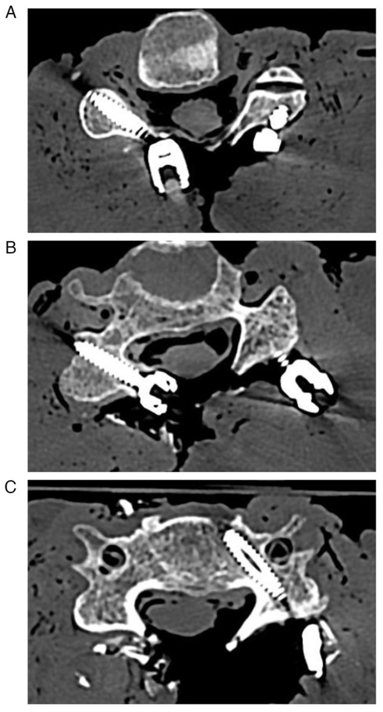

*Attallah M, et al. *Med Int.* 2024;4(4):159 — CC BY 4.0. Axial CT illustrating lateral-mass screw placement and trajectory relative to the foramen transversarium.*

---

## Closure
- Meticulous hemostasis; **layered closure of the deep fascia/muscle, then fascia, subcutaneous, skin** — the posterior cervical wound is closure-dependent for infection/dehiscence prevention; a **subfascial drain** is commonly used. Re-approximate the nuchal musculature/C2 attachments.

---

## Nuances & Pitfalls (surgeon-level)
- **Stay midline** in the raphe — straying into muscle causes troublesome bleeding and denervation atrophy/pain.
- **Vertebral artery & nerve root** are the screw hazards — respect the lateral/superior trajectory; **check CT for a high-riding VA** before C2 pars/pedicle screws.
- **Post-laminectomy kyphosis:** laminectomy **without fusion** in a young or kyphosis-prone patient risks swan-neck deformity — favor **laminoplasty or laminectomy + fusion**; preserve the **C2/C7 muscular attachments.**
- **C5 palsy** (deltoid/biceps) after posterior decompression — counsel; usually recovers; foraminotomy/avoiding over-distraction may reduce it.
- **Alignment rule:** don't decompress posteriorly in **fixed kyphosis** (cord won't drift back).
- **Prone positioning:** protect eyes (ischemic optic neuropathy), keep the myelopathic neck neutral, lower venous pressure (reverse Trendelenburg) to reduce epidural bleeding.

## Complications
**C5 palsy**; **post-laminectomy kyphosis**; **vertebral artery or nerve root injury** (screws); dural tear/CSF leak; **wound infection / dehiscence** (higher than anterior); axial neck pain; pseudarthrosis; epidural hematoma; positioning injuries (ION, pressure).

---

## Cross-links
- Procedures: [posterior cervical laminectomy & fusion](../spine-degenerative/posterior-cervical-laminectomy-fusion.md) · [laminoplasty](../spine-degenerative/cervical-laminoplasty.md) · [posterior cervical foraminotomy](../spine-degenerative/posterior-cervical-foraminotomy.md) · [occipitocervical fusion](../spine-trauma/occipitocervical-fusion.md) · [subaxial cervical fracture](../spine-trauma/subaxial-cervical-fracture.md)
- Related corridors: [anterior-cervical-approach.md](anterior-cervical-approach.md) · [posterior-thoracolumbar-approach.md](posterior-thoracolumbar-approach.md)

## References
1. Roy-Camille R, Saillant G, Mazel C. **Internal fixation of the unstable cervical spine by a posterior osteosynthesis with plates and screws.** (lateral mass technique).
2. Magerl F, Seemann PS. **Stable posterior fusion of the atlas and axis by transarticular screw fixation.** 1987.
3. An HS, et al. **Anatomic considerations for plate-screw fixation of the cervical spine.** *Spine.* 1991.
4. AO Foundation. **Posterior approach and lateral mass fixation, cervical spine.** AO Surgery Reference. [link](https://surgeryreference.aofoundation.org)
5. **Attallah M, et al. (lateral mass screw biomechanics / trajectory).** *Med Int.* 2024;4(4):159. CC BY 4.0. (figure embedded above) — [PMC11097134](https://pmc.ncbi.nlm.nih.gov/articles/PMC11097134/)
