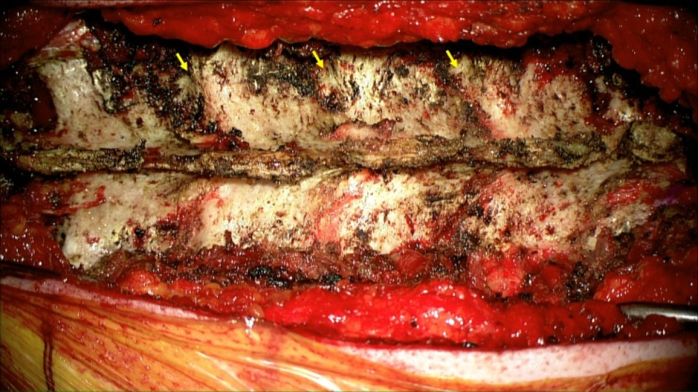
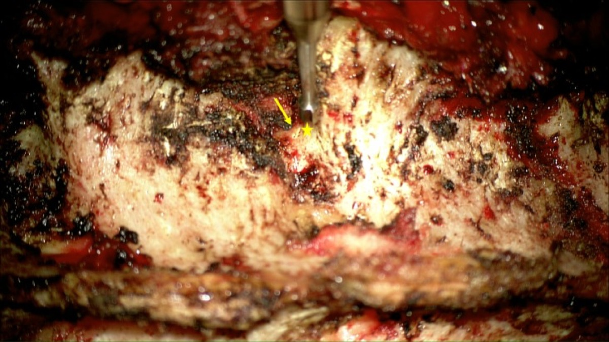
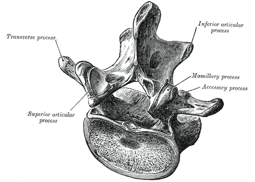

# Operative Approach: Posterior Thoracolumbar Approach (Midline & Wiltse / Pedicle Screw Fixation)

> **About the figures.** Copyrighted operative figures/videos are **linked** (Neurosurgical Atlas, AO Surgery Reference); embedded images are **public-domain** (Gray's Anatomy), credited beneath each image. See [media-sources.md](../../resources/media-sources.md) and [figures/CREDITS.md](../../figures/CREDITS.md).
>
> **Technique references:** [AO Surgery Reference — Thoracolumbar](https://surgeryreference.aofoundation.org) · [Neurosurgical Atlas — Spine](https://www.neurosurgicalatlas.com) · [Radiopaedia — thoracolumbar](https://radiopaedia.org/search?q=thoracolumbar%20fracture&scope=all)

The posterior thoracolumbar approach is the **universal posterior corridor to the thoracic and lumbar spine** — the basis for laminectomy, **TLIF/PLIF**, pedicle-screw fixation, deformity correction, and tumor/trauma stabilization. It is performed **midline** (subperiosteal exposure of the posterior elements) or via the muscle-splitting **Wiltse paramedian** plane for lateral/percutaneous screw placement with less muscle stripping.

---

## Figures, Imaging & Video

**🎥 Operative video** — [search operative video on YouTube ▸](https://www.youtube.com/results?search_query=thoracolumbar+fracture+surgery) · [The Neurosurgical Atlas ▸](https://www.neurosurgicalatlas.com)

**📑 Key evidence — landmark trials & guidelines**

- **SLIP** — Ghogawala Z et al. *NEJM* 2016 — laminectomy ± fusion for degenerative spondylolisthesis. [🔗 PubMed](https://pubmed.ncbi.nlm.nih.gov/?term=Ghogawala+SLIP+laminectomy+fusion+spondylolisthesis+2016+NEJM)
- **Swedish fusion study** — Försth P et al. *NEJM* 2016 — fusion surgery for lumbar stenosis. [🔗 PubMed](https://pubmed.ncbi.nlm.nih.gov/?term=Forsth+fusion+surgery+lumbar+spinal+stenosis+2016+NEJM)
- **Guidelines:** [CNS Guidelines](https://www.cns.org/guidelines) · [AANS](https://www.aans.org)
[AO Surgery Reference — posterior thoracolumbar](https://surgeryreference.aofoundation.org) · [Neurosurgical Atlas — Spine](https://www.neurosurgicalatlas.com) · [Radiopaedia — pedicle screws](https://radiopaedia.org/search?q=pedicle%20screw&scope=all) · [PubMed Central — Wiltse approach](https://www.ncbi.nlm.nih.gov/pmc/?term=wiltse+paraspinal+approach)

*Gray's Anatomy (1918), public domain — via Wikimedia Commons.*

---

## General Considerations
- **What it accesses:** the posterior elements (spinous processes, laminae, facets, pars, transverse processes) and, through them, the **pedicles** (for screws), the canal/thecal sac and roots (decompression), and the disc space (TLIF/PLIF).
- **Midline vs Wiltse:**
  - **Midline subperiosteal:** the standard for open decompression + fusion; full exposure of laminae/facets but more **paraspinal muscle stripping/denervation.**
  - **Wiltse paramedian (muscle-splitting):** a plane **between multifidus and longissimus** that goes directly onto the facet/transverse process — ideal for **far-lateral discs, percutaneous/MIS pedicle screws,** and reducing muscle morbidity.
- **Abdomen free** (Jackson/Wilson frame) is the single most important set-up detail — it lowers epidural venous pressure and **blood loss** and helps restore **lordosis.**

### Indications
- Degenerative: stenosis/spondylolisthesis → [lumbar laminectomy](../spine-degenerative/lumbar-laminectomy.md), [TLIF](../spine-degenerative/tlif.md); far-lateral disc (Wiltse)
- **Trauma:** [thoracolumbar burst fracture](../spine-trauma/thoracolumbar-burst-fracture.md), [flexion-distraction (Chance)](../spine-trauma/flexion-distraction-chance.md)
- **Deformity:** [adult deformity / osteotomy](../spine-deformity/adult-spinal-deformity-osteotomy.md)
- Tumor (posterolateral decompression / [vertebral corpectomy](../spine-tumor/vertebral-corpectomy.md)), infection

---

## Relevant Surgical Anatomy
- **Midline:** supraspinous/interspinous ligaments and the **avascular raphe**; **paraspinal muscles** — **multifidus** (medial) and **longissimus/iliocostalis** (lateral); the **Wiltse plane** is the natural cleft between multifidus and longissimus.
- **Pedicle entry points:** **lumbar** — at the junction of the **transverse process, superior articular facet, and pars** (Roy-Camille / Magerl); **thoracic** — just below the facet/transverse-process junction with a steeper medial/caudal angle. Trajectory must respect the **medial pedicle wall (canal/cord/root)** and inferior wall (exiting root).
- **Neural elements:** thecal sac, **traversing and exiting nerve roots** (TLIF works through Kambin's triangle / facetectomy window), conus (upper lumbar), thoracic **cord** (low tolerance — thoracic medial breach is catastrophic).

## Preoperative Evaluation
- **CT/MRI** for levels, **pedicle diameter and trajectory**, deformity/alignment; navigation/robotics dataset; bone quality (osteoporosis → augmentation). **Level localization plan** (counting is error-prone in the thoracic spine).

## Anesthesia & Neuromonitoring
- GA, prone; **SSEP/MEP and free-run/triggered EMG** (pedicle screw stimulation), especially for thoracic/deformity; no long-acting paralytic with MEPs; antifibrinolytics for deformity; blood available.

---

## Positioning
📷 *[AO Surgery Reference — prone positioning](https://surgeryreference.aofoundation.org)*

- **Prone on a Jackson or Wilson frame with the abdomen hanging free** (reduces venous bleeding; Jackson preserves lordosis, Wilson flexes for stenosis exposure). Pad eyes/face (prone ION), chest, knees, ulnar nerves; arms ≤90°. Reverse Trendelenburg slightly; confirm orthogonal fluoroscopy.

## Incision & Exposure
📷 *[AO Surgery Reference — exposure](https://surgeryreference.aofoundation.org)*

- **Midline:** incise to the fascia, split the **avascular raphe**, and **subperiosteally** elevate the paraspinals off the spinous processes/laminae **out to the transverse-process tips** for fusion levels (preserve facet capsules at non-fused segments). 
- **Wiltse:** paramedian fascial incisions ~1.5–2 finger-breadths off midline; finger-develop the **multifidus–longissimus plane** directly to the facet/TP (the corridor for percutaneous/MIS screws).
- **Localize the level fluoroscopically before bone work.**

*Gray's Anatomy (1918), public domain — via Wikimedia Commons.*

## Pedicle Screw Fixation & Decompression
📷 *[AO Surgery Reference — pedicle screws](https://surgeryreference.aofoundation.org)*

*Avila MJ, Baaj AA. *Cureus* 2016;8(3):e501 — CC BY.*

*Avila MJ, Baaj AA. *Cureus* 2016;8(3):e501 — CC BY.*

- **Cannulate the pedicles** at the level-specific entry/trajectory (freehand, fluoro, navigation, or robotic); confirm with **triggered EMG** and imaging — respect the **medial and inferior pedicle walls.** Decorticate and graft the posterolateral gutter; place rods after decompression/interbody.
- Decompression (laminectomy/facetectomy) and **interbody fusion** (TLIF/PLIF) proceed per the procedure guide → [TLIF](../spine-degenerative/tlif.md).

## Closure
- Hemostasis, **layered closure of fascia/muscle, then fascia, subcutaneous, skin**; subfascial drain common. Meticulous posterior closure limits infection/dehiscence.

---

### Bony anatomy (vertebra / pedicle detail)

*Gray's Anatomy (1918), public domain — via Wikimedia Commons.*

*Gray's Anatomy (1918), public domain — via Wikimedia Commons.*

*Gray's Anatomy (1918), public domain — via Wikimedia Commons.*

## Nuances & Pitfalls (surgeon-level)
- **Abdomen free** = less bleeding and better lordosis — never skip it.
- **Pedicle breach:** **medial** → dura/root/cord (thoracic medial breach = cord injury); **lateral** → poor purchase/vascular; use triggered EMG/navigation and check walls.
- **Wrong-level surgery** — fluoroscopic localization, count from fixed landmarks (sacrum/ribs), mark.
- **Muscle morbidity:** prefer **Wiltse/MIS** when extensive midline stripping isn't needed (less denervation/atrophy and pain).
- **Maintain sagittal alignment** (lordosis) — flat-back/junctional failure follows poor restoration.
- **Dural tear** (revision/ossified ligamentum) — repair/augment; **infection/dehiscence** risk is higher posteriorly.

## Complications
Pedicle-screw malposition (neuro/vascular), **dural tear/CSF leak**, **wound infection/dehiscence**, blood loss/epidural hematoma, junctional kyphosis/flat-back, pseudarthrosis, positioning injuries (ION, pressure, brachial plexus), wrong-level surgery.

---

## Cross-links
- Procedures: [lumbar laminectomy](../spine-degenerative/lumbar-laminectomy.md) · [TLIF](../spine-degenerative/tlif.md) · [thoracolumbar burst fracture](../spine-trauma/thoracolumbar-burst-fracture.md) · [adult deformity osteotomy](../spine-deformity/adult-spinal-deformity-osteotomy.md) · [vertebral corpectomy](../spine-tumor/vertebral-corpectomy.md)
- Related corridors: [transpsoas-approach.md](transpsoas-approach.md) · [transthoracic-approach.md](transthoracic-approach.md) · [posterior-cervical-approach.md](posterior-cervical-approach.md)

## References
1. Wiltse LL, Bateman JG, Hutchinson RH, Nelson WE. **The paraspinal sacrospinalis-splitting approach to the lumbar spine.** *J Bone Joint Surg Am.* 1968;50(5):919–926.
2. Roy-Camille R, Saillant G, Mazel C. **Internal fixation of the lumbar spine with pedicle screw plating.** *Clin Orthop.* 1986.
3. Magerl F. **External skeletal fixation of the lower thoracic and lumbar spine.** 1984.
4. AO Foundation. **Posterior approach, thoracolumbar spine; pedicle screw fixation.** AO Surgery Reference. [link](https://surgeryreference.aofoundation.org)
