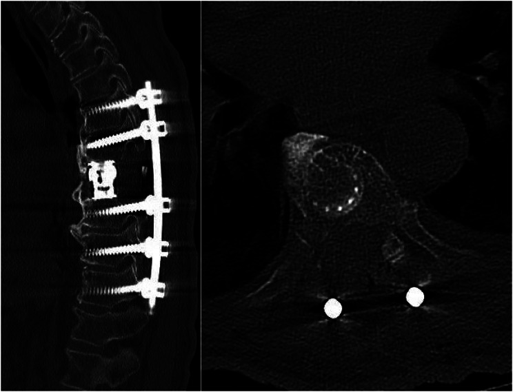
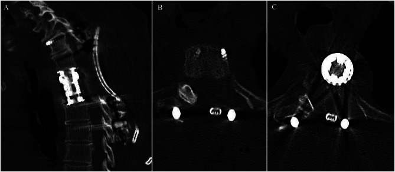
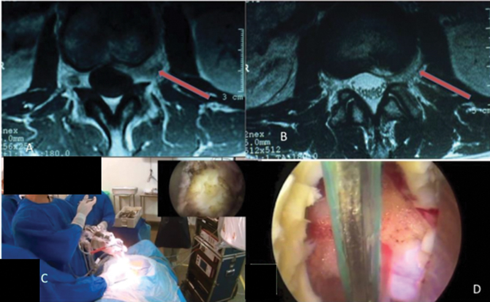
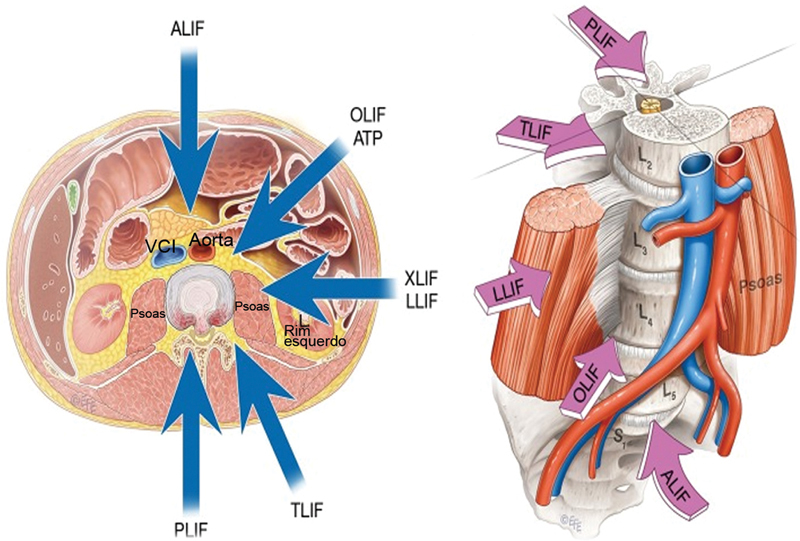
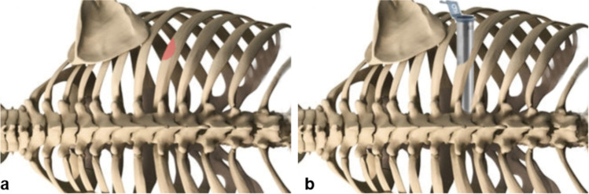
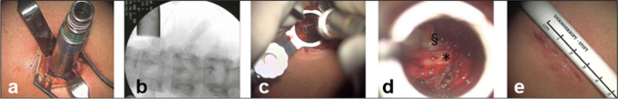
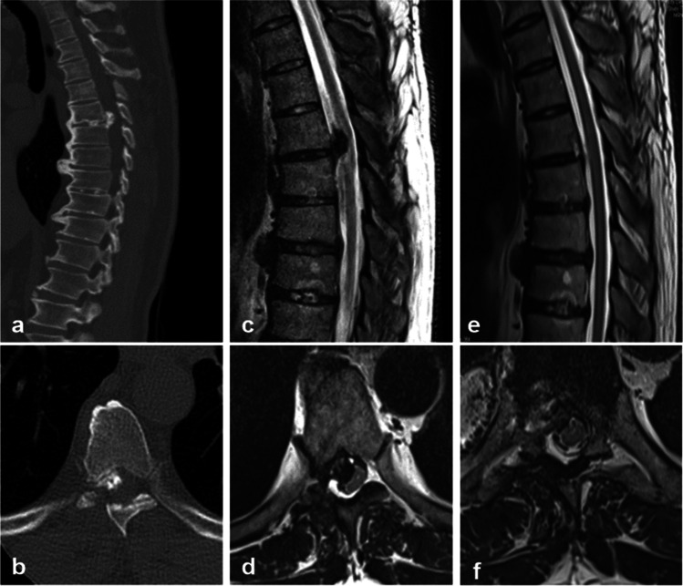
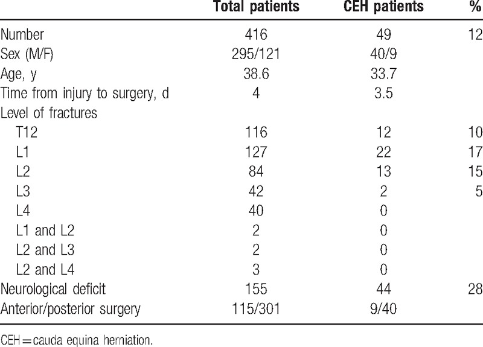
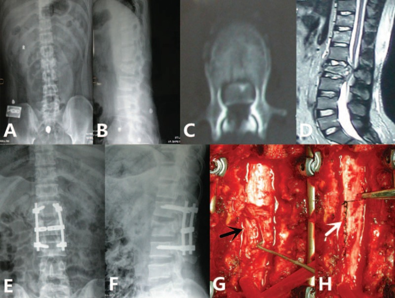
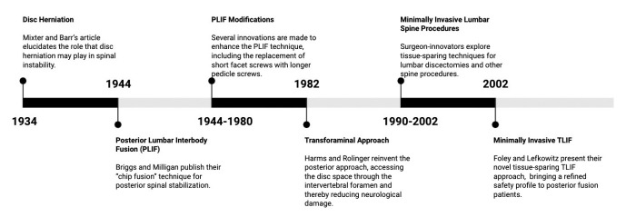

# Operative Approach: Posterior Thoracolumbar Approach (Midline & Wiltse / Pedicle Screw Fixation)

<!-- BEGIN CASE DOSSIER -->

## Case / Approach Dossier

- **Anatomy at risk:** corridor-defining nerves, arteries, veins/sinuses, cisterns, bone landmarks, muscle/fascial planes, and closure structures that determine exposure and morbidity.
- **Operative steps:** confirm position and trajectory, mark landmarks, protect soft tissue and named neurovascular structures, perform the bone/soft-tissue corridor, open/close dura or target compartment deliberately, and verify hemostasis/reconstruction; use the detailed operative sequence and approach notes below as the step-by-step source.
- **Rescue plans:** brain relaxation failure, venous or sinus bleeding, cranial nerve/perforator risk, exposure that is too narrow, CSF leak, cosmetic/temporalis/frontalis problems, and conversion to a wider or alternate corridor.
- **Figures:** review [Figures, Imaging & Video](#figures-imaging--video) and the [Curated Image Set](#curated-image-set); embedded local figures should remain open-access, public-domain, or otherwise reusable with attribution.
- **Papers:** review [High-Yield Literature](#high-yield-literature) for seminal sources, modern reviews, and outcome data specific to this page.
- **Textbook cross-checks:** use [Textbook Cross-Checks](#textbook-cross-checks) and the [Source Crosswalk](../../resources/source-crosswalk.md) to cite copyrighted textbooks/atlases while summarizing in original words.

<!-- END CASE DOSSIER -->

> **About the figures.** Copyrighted operative figures/videos are **linked** (Neurosurgical Atlas, AO Surgery Reference); embedded images are **public-domain** (Gray's Anatomy), credited beneath each image. See [media-sources.md](../../resources/media-sources.md) and [figures/CREDITS.md](../../figures/CREDITS.md).
>
> **Technique references:** [AO Surgery Reference — Thoracolumbar](https://surgeryreference.aofoundation.org) · [Neurosurgical Atlas — Spine](https://www.neurosurgicalatlas.com) · [Radiopaedia — thoracolumbar](https://radiopaedia.org/search?q=thoracolumbar%20fracture&scope=all)

The posterior thoracolumbar approach is the **universal posterior corridor to the thoracic and lumbar spine** — the basis for laminectomy, **TLIF/PLIF**, pedicle-screw fixation, deformity correction, and tumor/trauma stabilization. It is performed **midline** (subperiosteal exposure of the posterior elements) or via the muscle-splitting **Wiltse paramedian** plane for lateral/percutaneous screw placement with less muscle stripping.

---

## Figures, Imaging & Video

**🎥 Operative video** — [search operative video on YouTube ▸](https://www.youtube.com/results?search_query=thoracolumbar+fracture+surgery) · [The Neurosurgical Atlas ▸](https://www.neurosurgicalatlas.com)

[AO Surgery Reference — posterior thoracolumbar](https://surgeryreference.aofoundation.org) · [Neurosurgical Atlas — Spine](https://www.neurosurgicalatlas.com) · [Radiopaedia — pedicle screws](https://radiopaedia.org/search?q=pedicle%20screw&scope=all) · [PubMed Central — Wiltse approach](https://www.ncbi.nlm.nih.gov/pmc/?term=wiltse+paraspinal+approach)

---

<!-- BEGIN TEXTBOOK CROSS-CHECKS -->

## Textbook Cross-Checks

- **Microsurgical corridor anatomy:** Rhoton Cranial Anatomy; Brain Anatomy and Neurosurgical Approaches; Youmans and Winn — confirm surface landmarks, bone-removal limits, cisternal/venous relationships, and the named neurovascular structures that define the working corridor.
- **Technique sequence:** Schmidek and Sweet; Youmans and Winn; Neurosurgical Atlas chapter links — review positioning, incision, soft-tissue handling, bone work, dural opening, and intradural exposure sequence.
- **Complication avoidance:** Rhoton; Greenberg; approach-specific operative references — cross-check cranial nerve, venous, sinus, perforator, CSF-leak, and cosmetic risks before committing to the corridor.
- **Copyright-safe use:** cite these sources as private cross-checks, then write the guide content in original words; do not re-host textbook pages, figures, tables, or board-review card material. See [Source Crosswalk & Copyright-Safe Use](../../resources/source-crosswalk.md).

<!-- END TEXTBOOK CROSS-CHECKS -->

<!-- BEGIN CURATED LITERATURE -->

## High-Yield Literature

- **Microsurgical anatomy and treatment of dural defects in spontaneous spinal cerebrospinal fluid leaks** — Matsuhashi A. Journal of neurosurgery. Spine 2021. [PubMed](https://pubmed.ncbi.nlm.nih.gov/33186904/)
- **Clinicopathologic Features of Thoracolumbar Interdural Disc Herniations: A Retrospective Case Series with a Systematic Literature Review** — Fiorenza V. World neurosurgery 2020. [PubMed](https://pubmed.ncbi.nlm.nih.gov/32305597/)
- **[Microsurgical treatment of spinal cavernous malformation]** — Gu XC. Zhonghua yi xue za zhi 2008. [PubMed](https://pubmed.ncbi.nlm.nih.gov/19035102/)
- **Posterior Thoracolumbar Instrumented Fusion for Burst Fractures: A Meta-analysis** — Ituarte F. Clinical spine surgery 2019. [PubMed](https://pubmed.ncbi.nlm.nih.gov/30614840/)
- **Recognition of posterior thoracolumbar instrumentations used in spinal deformity surgery and techniques for implant removal** — Kato S. Journal of clinical neuroscience : official journal of the Neurosurgical Society of Australasia 2021. [PubMed](https://pubmed.ncbi.nlm.nih.gov/33775331/)
- **Comparison of Anterior Versus Posterior Approach in the Treatment of Thoracolumbar Fractures: A Systematic Review** — Zhu Q. International surgery 2015. [PubMed](https://pubmed.ncbi.nlm.nih.gov/26414835/)
- **Posterior thoracolumbar hemivertebra resection and short-segment fusion in congenital scoliosis: surgical outcomes and complications with more than 5-year follow-up** — Bao B. BMC surgery 2021. [PubMed](https://pubmed.ncbi.nlm.nih.gov/33765989/)
- **Postoperative ileus risk after posterior thoracolumbar fusion performed with total intravenous anesthesia versus inhaled anesthesia** — Sherrod BA. Journal of neurosurgery. Spine 2023. [PubMed](https://pubmed.ncbi.nlm.nih.gov/36308475/)
- **Biomechanical effects of osteoporosis severity on the occurrence of proximal junctional kyphosis following long-segment posterior thoracolumbar fusion** — Zhao G. Clinical biomechanics (Bristol, Avon) 2023. [PubMed](https://pubmed.ncbi.nlm.nih.gov/37924756/)
- **Spinal instrumentation** — Spivak JM. Current opinion in rheumatology 1994. [PubMed](https://pubmed.ncbi.nlm.nih.gov/8024965/)

<!-- END CURATED LITERATURE -->

---

<!-- BEGIN CURATED IMAGE SET -->

## Curated Image Set

Open-access figures are embedded from PubMed Central articles and kept unique to this guide.

*Fig. 4. Sagittal (left) and axial (right) slices from the patient’s post-operative CT scan demonstrating the sagittal anterior column reconstruction and intact costocentral articulation on the... Source: [A rib-sparing unilateral transpedicular thoracic corpectomy using the ultrasonic bone scalpel: a novel technique and pictorial guide](https://pmc.ncbi.nlm.nih.gov/articles/PMC11466036/) — BMC Surgery 2024; CC BY-NC-ND.*

*Fig. 6. Sagittal (A), axial T3 level (B), and axial T4 level (C) slices from the patient’s post-operative CT scan demonstrating the two-level sagittal anterior column reconstruction and... Source: [A rib-sparing unilateral transpedicular thoracic corpectomy using the ultrasonic bone scalpel: a novel technique and pictorial guide](https://pmc.ncbi.nlm.nih.gov/articles/PMC11466036/) — BMC Surgery 2024; CC BY-NC-ND.*

*Fig. 2. Transforaminal endoscopic approach. (A) location of the nerve root ganglion, (B) direct access to the disc abscess, (C) positioning of the team, (D) endoscopic view of the neural root. Source: [Access to the Lumbosacral Spine: A Current View](https://pmc.ncbi.nlm.nih.gov/articles/PMC11006527/) — Revista Brasileira de Ortopedia 2024; CC BY.*

*Fig. 1. Possíveis abordagens à fusão intervertebral lombar. ALIF, fusão intersomática lombar anterior; OLIF, fusão intersomática lombar lateral oblíqua; ATP, abordagem anterior ao psoas; XLIF,... Source: [Access to the Lumbosacral Spine: A Current View](https://pmc.ncbi.nlm.nih.gov/articles/PMC11006527/) — Revista Brasileira de Ortopedia 2024; CC BY.*

*Fig. 1. Schematic illustration of partial resection of the lower rib (a) and positioning of the tubular retractor (b) for the retropleural, retractor-assisted approach to thoracic disc herniations Source: [A minimally invasive tubular retractor–assisted retropleural approach for thoracic disc herniations — case series and technical note](https://pmc.ncbi.nlm.nih.gov/articles/PMC10006021/) — Acta Neurochirurgica 2023; CC BY.*

*Fig. 2. Insertion of the tubular retractor (a) with the aid of intraoperative fluoroscopy at the level Th 10/11 (b) and drilling of the head of the rib and posterior lateral part of the disc (c)... Source: [A minimally invasive tubular retractor–assisted retropleural approach for thoracic disc herniations — case series and technical note](https://pmc.ncbi.nlm.nih.gov/articles/PMC10006021/) — Acta Neurochirurgica 2023; CC BY.*

*Fig. 3. Preoperative (a–d) and postoperative (e–f) MRI of patient No. 5 with a mediolateral left-sided, partially calcified disc herniation at level Th 7/8 causing relevant spinal cord... Source: [A minimally invasive tubular retractor–assisted retropleural approach for thoracic disc herniations — case series and technical note](https://pmc.ncbi.nlm.nih.gov/articles/PMC10006021/) — Acta Neurochirurgica 2023; CC BY.*

*Figure 8. Source: [Clinical case-series report of traumatic cauda equina herniation: A pathological phenomena occurring with thoracolumbar and lumbar burst fractures](https://pmc.ncbi.nlm.nih.gov/articles/PMC5411193/) — Medicine (Baltimore). 2017 Apr 7;96(14):e6446. doi: 10.1097/MD.0000000000006446; CC BY.*

*Figure 2. A 32-year-old male patient with L2 burst fracture, with ASIA C neurological impairment. (A and B) preoperative anteroposterior and lateral radiographs showed a L2 burst fracture; (C and... Source: [Clinical case-series report of traumatic cauda equina herniation](https://pmc.ncbi.nlm.nih.gov/articles/PMC5411193/) — Medicine 2017; CC BY.*

*Fig. 3.. The evolution of posterior-approach lumbar fusion, from 1934–2002. Source: [History and Evolution of the Minimally Invasive Transforaminal Lumbar Interbody Fusion](https://pmc.ncbi.nlm.nih.gov/articles/PMC9537838/) — Neurospine 2022; CC BY-NC.*

<!-- END CURATED IMAGE SET -->

---

## General Considerations
- **What it accesses:** the posterior elements (spinous processes, laminae, facets, pars, transverse processes) and, through them, the **pedicles** (for screws), the canal/thecal sac and roots (decompression), and the disc space (TLIF/PLIF).
- **Midline vs Wiltse:**
  - **Midline subperiosteal:** the standard for open decompression + fusion; full exposure of laminae/facets but more **paraspinal muscle stripping/denervation.**
  - **Wiltse paramedian (muscle-splitting):** a plane **between multifidus and longissimus** that goes directly onto the facet/transverse process — ideal for **far-lateral discs, percutaneous/MIS pedicle screws,** and reducing muscle morbidity.
- **Abdomen free** (Jackson/Wilson frame) is the single most important set-up detail — it lowers epidural venous pressure and **blood loss** and helps restore **lordosis.**

### Indications
- Degenerative: stenosis/spondylolisthesis → [lumbar laminectomy](../spine-degenerative/lumbar-laminectomy.md), [TLIF](../spine-degenerative/tlif.md); far-lateral disc (Wiltse)
- **Trauma:** [thoracolumbar burst fracture](../spine-trauma/thoracolumbar-burst-fracture.md), [flexion-distraction (Chance)](../spine-trauma/flexion-distraction-chance.md)
- **Deformity:** [adult deformity / osteotomy](../spine-deformity/adult-spinal-deformity-osteotomy.md)
- Tumor (posterolateral decompression / [vertebral corpectomy](../spine-tumor/vertebral-corpectomy.md)), infection

---

## Relevant Surgical Anatomy
- **Midline:** supraspinous/interspinous ligaments and the **avascular raphe**; **paraspinal muscles** — **multifidus** (medial) and **longissimus/iliocostalis** (lateral); the **Wiltse plane** is the natural cleft between multifidus and longissimus.
- **Pedicle entry points:** **lumbar** — at the junction of the **transverse process, superior articular facet, and pars** (Roy-Camille / Magerl); **thoracic** — just below the facet/transverse-process junction with a steeper medial/caudal angle. Trajectory must respect the **medial pedicle wall (canal/cord/root)** and inferior wall (exiting root).
- **Neural elements:** thecal sac, **traversing and exiting nerve roots** (TLIF works through Kambin's triangle / facetectomy window), conus (upper lumbar), thoracic **cord** (low tolerance — thoracic medial breach is catastrophic).

## Preoperative Evaluation
- **CT/MRI** for levels, **pedicle diameter and trajectory**, deformity/alignment; navigation/robotics dataset; bone quality (osteoporosis → augmentation). **Level localization plan** (counting is error-prone in the thoracic spine).

## Anesthesia & Neuromonitoring
- GA, prone; **SSEP/MEP and free-run/triggered EMG** (pedicle screw stimulation), especially for thoracic/deformity; no long-acting paralytic with MEPs; antifibrinolytics for deformity; blood available.

---

## Positioning

- **Prone on a Jackson or Wilson frame with the abdomen hanging free** (reduces venous bleeding; Jackson preserves lordosis, Wilson flexes for stenosis exposure). Pad eyes/face (prone ION), chest, knees, ulnar nerves; arms ≤90°. Reverse Trendelenburg slightly; confirm orthogonal fluoroscopy.

## Incision & Exposure

- **Midline:** incise to the fascia, split the **avascular raphe**, and **subperiosteally** elevate the paraspinals off the spinous processes/laminae **out to the transverse-process tips** for fusion levels (preserve facet capsules at non-fused segments). 
- **Wiltse:** paramedian fascial incisions ~1.5–2 finger-breadths off midline; finger-develop the **multifidus–longissimus plane** directly to the facet/TP (the corridor for percutaneous/MIS screws).
- **Localize the level fluoroscopically before bone work.**

## Pedicle Screw Fixation & Decompression

*Avila MJ, Baaj AA. *Cureus* 2016;8(3):e501 — CC BY.*

*Avila MJ, Baaj AA. *Cureus* 2016;8(3):e501 — CC BY.*

- **Cannulate the pedicles** at the level-specific entry/trajectory (freehand, fluoro, navigation, or robotic); confirm with **triggered EMG** and imaging — respect the **medial and inferior pedicle walls.** Decorticate and graft the posterolateral gutter; place rods after decompression/interbody.
- Decompression (laminectomy/facetectomy) and **interbody fusion** (TLIF/PLIF) proceed per the procedure guide → [TLIF](../spine-degenerative/tlif.md).

## Closure
- Hemostasis, **layered closure of fascia/muscle, then fascia, subcutaneous, skin**; subfascial drain common. Meticulous posterior closure limits infection/dehiscence.

---

### Bony anatomy (vertebra / pedicle detail)

## Nuances & Pitfalls (surgeon-level)
- **Abdomen free** = less bleeding and better lordosis — never skip it.
- **Pedicle breach:** **medial** → dura/root/cord (thoracic medial breach = cord injury); **lateral** → poor purchase/vascular; use triggered EMG/navigation and check walls.
- **Wrong-level surgery** — fluoroscopic localization, count from fixed landmarks (sacrum/ribs), mark.
- **Muscle morbidity:** prefer **Wiltse/MIS** when extensive midline stripping isn't needed (less denervation/atrophy and pain).
- **Maintain sagittal alignment** (lordosis) — flat-back/junctional failure follows poor restoration.
- **Dural tear** (revision/ossified ligamentum) — repair/augment; **infection/dehiscence** risk is higher posteriorly.

## Complications
Pedicle-screw malposition (neuro/vascular), **dural tear/CSF leak**, **wound infection/dehiscence**, blood loss/epidural hematoma, junctional kyphosis/flat-back, pseudarthrosis, positioning injuries (ION, pressure, brachial plexus), wrong-level surgery.

---

## Cross-links
- Procedures: [lumbar laminectomy](../spine-degenerative/lumbar-laminectomy.md) · [TLIF](../spine-degenerative/tlif.md) · [thoracolumbar burst fracture](../spine-trauma/thoracolumbar-burst-fracture.md) · [adult deformity osteotomy](../spine-deformity/adult-spinal-deformity-osteotomy.md) · [vertebral corpectomy](../spine-tumor/vertebral-corpectomy.md)
- Related corridors: [transpsoas-approach.md](transpsoas-approach.md) · [transthoracic-approach.md](transthoracic-approach.md) · [posterior-cervical-approach.md](posterior-cervical-approach.md)

## References
1. Wiltse LL, Bateman JG, Hutchinson RH, Nelson WE. **The paraspinal sacrospinalis-splitting approach to the lumbar spine.** *J Bone Joint Surg Am.* 1968;50(5):919–926.
2. Roy-Camille R, Saillant G, Mazel C. **Internal fixation of the lumbar spine with pedicle screw plating.** *Clin Orthop.* 1986.
3. Magerl F. **External skeletal fixation of the lower thoracic and lumbar spine.** 1984.
4. AO Foundation. **Posterior approach, thoracolumbar spine; pedicle screw fixation.** AO Surgery Reference. [link](https://surgeryreference.aofoundation.org)
