# Operative Approach: Presigmoid / Petrosal Approaches (Retrolabyrinthine · Translabyrinthine · Transcochlear · Combined Petrosal)

<!-- BEGIN CASE SNAPSHOT -->

## Case / Approach Snapshot

- **Anatomy at risk:** sigmoid/transverse sinuses, superior petrosal sinus, vein of Labbe, mastoid air cells, labyrinth/cochlea, facial nerve canal/geniculate, endolymphatic sac, jugular bulb, tentorium/CN IV, CN V-VIII and lower cranial nerves, basilar/AICA/SCA perforators, and eustachian tube-facing air cells.
- **Operative steps:** select the least morbid petrosal rung, plan hearing/facial/venous tradeoffs, expose mastoid-temporal bone, skeletonize sinuses/labyrinth/facial nerve, drill retrolabyrinthine/translabyrinthine/transcochlear/anterior petrosectomy corridors as needed, open presigmoid and temporal dura, manage SPS/tentorium, work the petroclival target, then obliterate air cells and reconstruct against CSF leak.
- **Rescue plans:** sigmoid/SPS bleeding, dominant venous drainage or Labbe compromise, facial nerve stimulation/injury, unintended labyrinth breach, high jugular bulb, petrous carotid/cochlear risk, brainstem/perforator adherence, CSF leak through mastoid/eustachian route, and need to downshift or stage rather than escalate exposure.
- **Figures:** review [Figures, Imaging & Video](#figures-imaging--video) and the [Curated Image Set](#curated-image-set); embedded local figures should remain open-access, public-domain, or otherwise reusable with attribution.
- **Papers:** review [High-Yield Literature](#high-yield-literature) for seminal sources, modern reviews, and outcome data specific to this page.

<!-- END CASE SNAPSHOT -->

## Figures, Imaging & Video

**🎥 Operative video** — [search operative video on YouTube ▸](https://www.youtube.com/results?search_query=petroclival+meningioma+surgery) · [The Neurosurgical Atlas ▸](https://www.neurosurgicalatlas.com)

[Neurosurgical Atlas — petrosectomy](https://www.neurosurgicalatlas.com/volumes/cranial-base-surgery/skull-base-exposures/extended-posterior-petrosectomy) · [Radiopaedia — petroclival meningioma](https://radiopaedia.org/search?q=petroclival%20meningioma&scope=all) · [PubMed Central — combined petrosal](https://www.ncbi.nlm.nih.gov/pmc/?term=combined+petrosal+approach)

---

<!-- BEGIN CURATED LITERATURE -->

## High-Yield Literature

- **Petrosal Approach With Preservation of the Superior Petrosal Sinus (the Graceful Petrosal) for Resection of Giant Trigeminal Schwannoma: 2-Dimensional Operative Video** — Almefty KK. Operative neurosurgery (Hagerstown, Md.) 2021. [PubMed](https://pubmed.ncbi.nlm.nih.gov/33855455/)
- **Microsurgical Resection of Giant Petroclival Meningioma via the Posterior Petrosal Approach: 2-Dimensional Operative Video** — Ceccato GHW. World neurosurgery 2022. [PubMed](https://pubmed.ncbi.nlm.nih.gov/35963609/)
- **Partial labyrinthectomy petrous apicectomy approach to the petroclival region: an anatomic and technical study** — Chanda A. Neurosurgery 2002. [PubMed](https://pubmed.ncbi.nlm.nih.gov/12182413/)
- **Combined petrosal approach** — Polster SP. Current opinion in otolaryngology & head and neck surgery 2018. [PubMed](https://pubmed.ncbi.nlm.nih.gov/30045103/)
- **Presigmoid approach preserving the superior petrosal sinus in a pontine cavernous malformation associated to abnormal venous drainage of the brainstem: how I do it** — Butrón-Díaz C. Acta neurochirurgica 2023. [PubMed](https://pubmed.ncbi.nlm.nih.gov/36331611/)
- **Combined presigmoid approach: A literature review** — Albairmani SS. Surgical neurology international 2024. [PubMed](https://pubmed.ncbi.nlm.nih.gov/39372980/)
- **Dissection of the Petrosal Presigmoid-Retrolabyrinthine Approach for the Petroclival Region on a Cadaver: 2-Dimensional Operative Video** — Borba Moreira L. Operative neurosurgery (Hagerstown, Md.) 2020. [PubMed](https://pubmed.ncbi.nlm.nih.gov/32392291/)
- **Combined petrosal approach: a systematic review and meta-analysis of surgical complications** — Giammattei L. Neurosurgical review 2023. [PubMed](https://pubmed.ncbi.nlm.nih.gov/37439884/)
- **Development of a virtual dissection environment integrated into cadaveric dissection for skull base anatomy education** — Uchida T. Journal of neurosurgery 2025. [PubMed](https://pubmed.ncbi.nlm.nih.gov/40513247/)
- **Pediatric Pontine Cavernous Malformations: The Presigmoid, Posterior Petrosal Approach** — Kulwin CG. Operative neurosurgery (Hagerstown, Md.) 2018. [PubMed](https://pubmed.ncbi.nlm.nih.gov/29514285/)

<!-- END CURATED LITERATURE -->

<!-- BEGIN CURATED IMAGE SET -->

## Curated Image Set

Open-access figures are embedded from PubMed Central articles and kept unique to this guide.

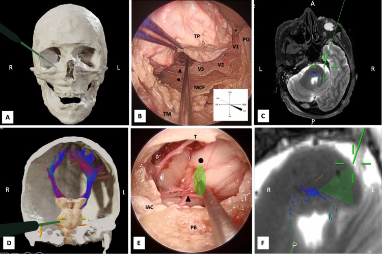
*Fig. 4. Transorbital approach. A 3D reconstruction of the skull prior to dissection. A neuronavigation probe (green) indicates the trajectory of the right transorbital approach. The lateral... Source: [Anatomical insights into the peri-trigeminal zone via transorbital, transclival, and retrosigmoid routes: a comparative cadaveric study with surgical implications](https://pmc.ncbi.nlm.nih.gov/articles/PMC12950089/) — Acta Neurochirurgica 2026; CC BY.*

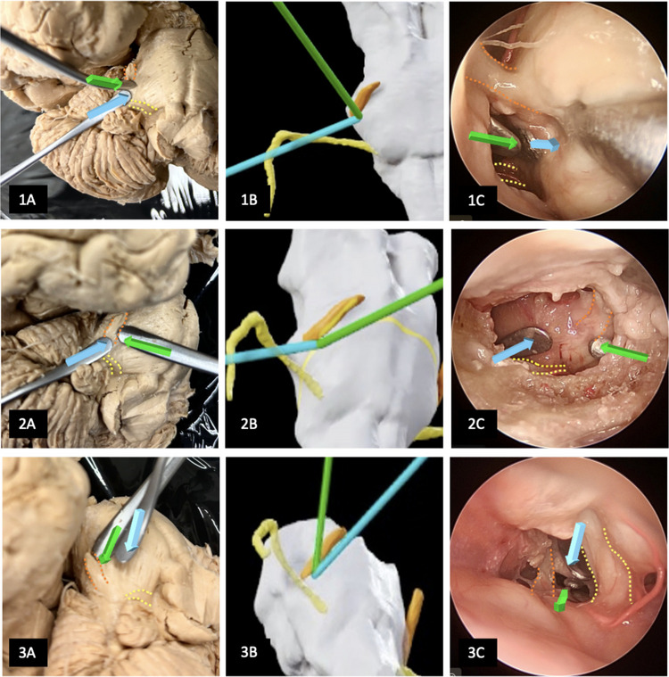
*Fig. 5. Comparative image of the three surgical approaches. The peritrigeminal zone (PTZ) is bounded laterally by the root entry zone of the trigeminal nerve (highlighted with an orange dotted... Source: [Anatomical insights into the peri-trigeminal zone via transorbital, transclival, and retrosigmoid routes: a comparative cadaveric study with surgical implications](https://pmc.ncbi.nlm.nih.gov/articles/PMC12950089/) — Acta Neurochirurgica 2026; CC BY.*

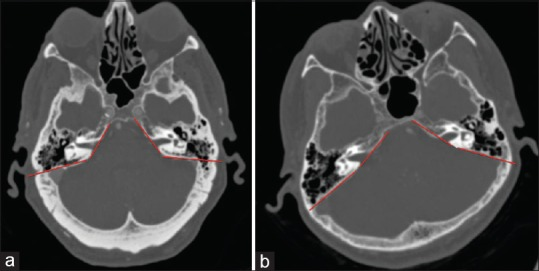
*Figure 1. Example of petrous slope angle. (a) Example of a small petrous slope angle of approximately 116 degrees. (b) Example of a large petrous slope of approximately 155 degrees Source: [Radiographic Assessment of the presigmoid retrolabyrinthine approach](https://pmc.ncbi.nlm.nih.gov/articles/PMC5502293/) — Surgical Neurology International 2017; CC BY-NC-SA.*

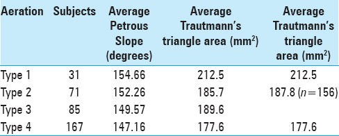
*Figure 4. Source: [Radiographic Assessment of the presigmoid retrolabyrinthine approach](https://pmc.ncbi.nlm.nih.gov/articles/PMC5502293/) — Surg Neurol Int. 2017 Jun 27;8:129. doi: 10.4103/sni.sni_243_16; CC BY-NC-SA.*

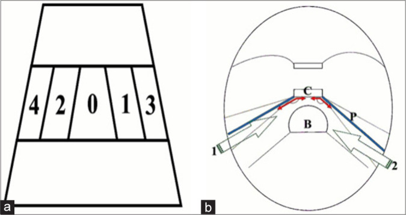
*Figure 1:. (a) Depiction of the clival zone II with longitudinal classification of the basilar artery position in relation to the midline: grade-0, midline; grade-1, right paramedian; grade-2; left... Source: [A standalone minimally invasive presigmoid retrolabyrinthine suprameatal approach: A cadaveric morphometric study](https://pmc.ncbi.nlm.nih.gov/articles/PMC11878714/) — Surgical Neurology International 2025; CC BY-NC-SA.*

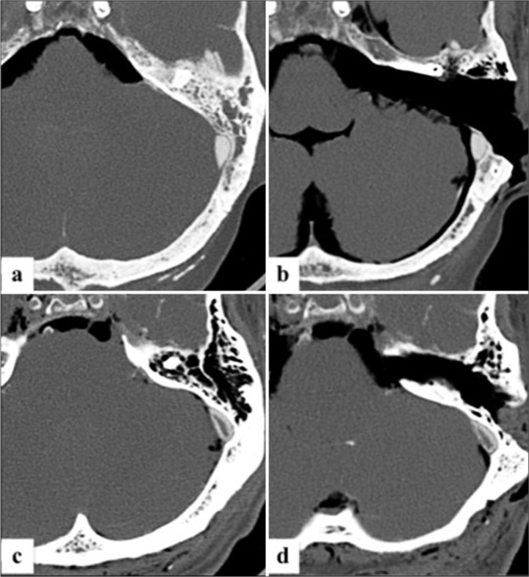
*Figure 2:. Pre- and post-procedural cranial computed tomography scans showing the variation of the presigmoid retrolabyrinthine suprameatal approach (PRSA) corridor and the exposure of prepontine... Source: [A standalone minimally invasive presigmoid retrolabyrinthine suprameatal approach: A cadaveric morphometric study](https://pmc.ncbi.nlm.nih.gov/articles/PMC11878714/) — Surgical Neurology International 2025; CC BY-NC-SA.*

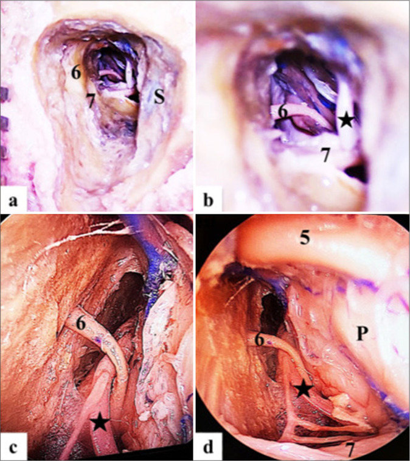
*Figure 3:. Operative steps on injected cadaver head showing the extent of the minimally invasive bone cavity of left side Presigmoid retrolabyrinthine suprameatal approach: (a and b) microscopic... Source: [A standalone minimally invasive presigmoid retrolabyrinthine suprameatal approach: A cadaveric morphometric study](https://pmc.ncbi.nlm.nih.gov/articles/PMC11878714/) — Surgical Neurology International 2025; CC BY-NC-SA.*

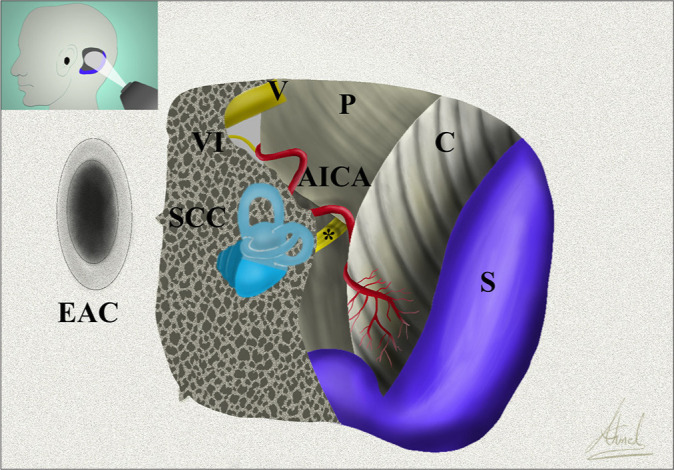
*Figure 4:. Artistic depiction of the Presigmoid retrolabyrinthine suprameatal approach with related operative anatomy. AICA: Anterior inferior cerebellar artery; C: Cerebellum; EAC: External... Source: [A standalone minimally invasive presigmoid retrolabyrinthine suprameatal approach: A cadaveric morphometric study](https://pmc.ncbi.nlm.nih.gov/articles/PMC11878714/) — Surgical Neurology International 2025; CC BY-NC-SA.*

*Figure 9. Source: [A standalone minimally invasive presigmoid retrolabyrinthine suprameatal approach: A cadaveric morphometric study](https://pmc.ncbi.nlm.nih.gov/articles/PMC11878714/) — Surg Neurol Int. 2025 Feb 28;16:68. doi: 10.25259/SNI_1110_2024; CC BY-NC-SA.*

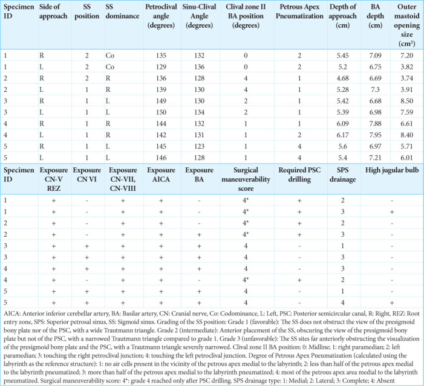
*Figure 10. Source: [A standalone minimally invasive presigmoid retrolabyrinthine suprameatal approach: A cadaveric morphometric study](https://pmc.ncbi.nlm.nih.gov/articles/PMC11878714/) — Surg Neurol Int. 2025 Feb 28;16:68. doi: 10.25259/SNI_1110_2024; CC BY-NC-SA.*

<!-- END CURATED IMAGE SET -->

The petrosal (presigmoid) approaches drill **through the petrous temporal bone** to reach the **petroclival region, mid-clivus, Meckel's cave, and the ventral pons** along the shortest, most anterior trajectory — opening the dura **in front of the sigmoid sinus (presigmoid)** and dividing the tentorium to combine supra- and infratentorial exposure. They form a **graded ladder** trading hearing/facial function for ventral reach: **retrolabyrinthine** (hearing-preserving) → **translabyrinthine** (sacrifices hearing) → **transcochlear** (sacrifices hearing + reroutes the facial nerve); the **combined petrosal** adds an [anterior petrosectomy (Kawase)](subtemporal-craniotomy.md) for maximal petroclival exposure. These are the **big-gun skull-base approaches** for large petroclival meningiomas and chordomas.

---

## General Considerations
- **What it accesses:** the **petroclival junction, middle/upper clivus, Meckel's cave, prepontine cistern, and ventral pons**, with control of CN III–XI and the basilar trunk/AICA/SCA.
- **The presigmoid principle:** drilling the mastoid/petrous bone lets the dura be opened **anterior to the sigmoid sinus**, bringing the surgeon's line of sight directly onto the petroclival dura — far more anterior than the [retrosigmoid](retrosigmoid-craniotomy.md) route — and dividing the **tentorium** unites the middle and posterior fossa corridors.
- **The graded ladder (hearing/facial trade-off):**
  - **Retrolabyrinthine** — bone removed *behind* the labyrinth; **hearing and facial function preserved**; narrowest presigmoid window.
  - **Translabyrinthine** — labyrinth removed; **hearing sacrificed**, facial nerve preserved; wider.
  - **Transcochlear** — cochlea removed and **facial nerve rerouted**; widest ventral access; **hearing lost, facial-palsy risk.**
  - **Combined petrosal** — posterior petrosectomy + **anterior petrosectomy (Kawase)** + tentorial division for the largest petroclival lesions.
- **Reserve for the right lesion.** These approaches are long and morbid; many petroclival lesions are now managed with [retrosigmoid](retrosigmoid-craniotomy.md) ± [subtemporal/Kawase](subtemporal-craniotomy.md), staged routes, or radiosurgery. Choose petrosal when a **large, firm, ventral petroclival** tumor demands the exposure.

### Indications
- **Large petroclival meningioma** (the prototypical indication) → [petroclival-meningioma.md](../cranial-tumor/petroclival-meningioma.md)
- **Clival / petroclival chordoma, chondrosarcoma** → [clival-chordoma.md](../cranial-tumor/clival-chordoma.md)
- **Trigeminal schwannoma** (Meckel's/posterior fossa dumbbell), epidermoid
- **Mid-basilar/ventral pontine vascular lesions**, brainstem cavernoma (anterolateral)

### Petrosal Ladder: What You Gain and Spend

| Variant | Exposure gained | Function spent | Best fit |
|---------|-----------------|----------------|----------|
| Retrolabyrinthine | Presigmoid window with hearing preservation | Narrower corridor, more limited anterior reach | Serviceable hearing, smaller petroclival/ventral pontine target |
| Translabyrinthine | Wider presigmoid/CPA exposure | Sacrifices hearing | Nonserviceable hearing, large CPA/petroclival lesion |
| Transcochlear | Most anterior posterior-petrosal reach | Hearing lost, facial rerouting morbidity | Extreme ventral clival/petroclival disease when facial/hearing tradeoff justified |
| Combined petrosal | Adds Kawase/anterior petrosectomy and supratentorial control | Longer, more venous/CSF-leak morbidity | Large petroclival meningioma/chordoma crossing middle and posterior fossae |
| Retrosigmoid or Kawase alone | Less drilling and morbidity | Less ventral/combined exposure | Softer, smaller, lateralized, or staged lesions |

The right answer is often not "maximum petrosectomy." Escalate only when the lesion’s anterior/ventral extension, consistency, and neurovascular encasement demand the extra bone removal.

---

## Relevant Surgical Anatomy
- **Temporal bone:** mastoid air cells, the **labyrinth (semicircular canals) and cochlea**, the **facial nerve** (mastoid/tympanic segments, geniculate), the **endolymphatic sac**, and the **sinodural (Citelli) angle.**
- **Venous framework:** **sigmoid and transverse sinuses, superior petrosal sinus (SPS), jugular bulb**, and the **vein of Labbé** — the petrosal corridor lives between the sigmoid (behind) and the labyrinth/cochlea (in front), under the SPS/tentorium.
- **Tentorium and incisura:** divided (behind CN IV's entry) to connect fossae; **CN IV, V** at the incisura.
- **Petroclival contents:** CN VI (Dorello's canal), the basilar artery, AICA/SCA, and the pons.

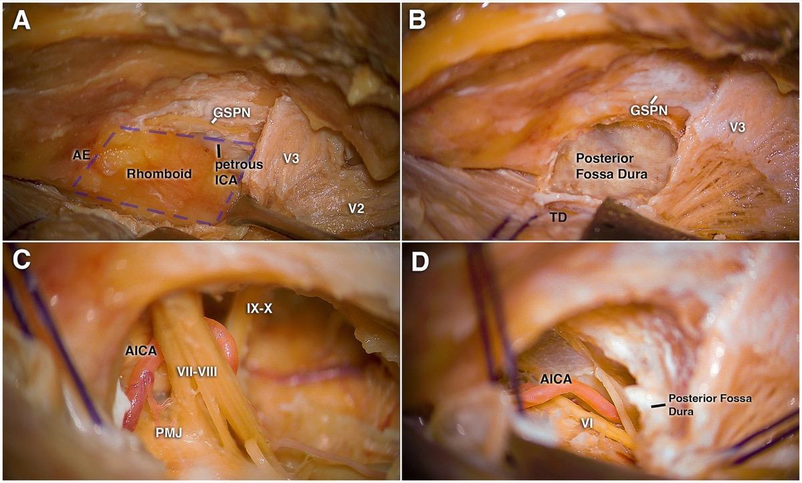

*Front Neurol 2026;17:1736101 — CC BY 4.0. The anterior petrosectomy (Kawase) component of the combined petrosal approach.*

---

## Preoperative Evaluation
- **High-resolution CT temporal bone:** labyrinth, cochlea, **facial nerve canal**, jugular bulb height, degree of pneumatization, and tumor bony involvement — decides which rung of the ladder is feasible.
- **MRI / MRV:** tumor extent and consistency, brainstem/CN/vessel relations, **venous dominance (sigmoid), and the vein of Labbé** (its drainage governs temporal-lobe safety).
- **Audiometry and facial-nerve baseline** — central to choosing retro- vs trans-labyrinthine vs transcochlear and to counseling.

### Preoperative No-Go / Modify Flags
- Serviceable hearing with a lesion manageable by retrosigmoid/Kawase should push away from translabyrinthine/transcochlear escalation.
- Dominant ipsilateral sigmoid sinus, high-riding jugular bulb, large emissary veins, or critical vein of Labbe drainage may force a different position, smaller corridor, or staged plan.
- Highly pneumatized temporal bone increases CSF leak risk; plan wax/fat/fascial/vascularized flap reconstruction before the drill starts.
- Facial nerve weakness, prior mastoid surgery, radiation, or cholesteatoma/infection changes drilling risk and may require neurotology leadership.
- A soft tumor with safe retrosigmoid debulking may not need the morbidity of a full petrosal route.

## Logistics, OR Setup & Orders
- **OR setup:** Mayfield, microscope/endoscope as needed, navigation, cranial nerve monitoring/BAER when relevant, Doppler/air-embolism readiness for sitting or semisitting positions, and watertight closure materials.
- **Special needs:** arterial line, Foley, antiemetic plan, dexamethasone when tumor/edema risk warrants it, EVD/CSF diversion plan, VAE monitoring when sitting, and lower-CN airway/swallow contingency.
- **Immediate postop orders:** posterior fossa neuro checks, CN V-XII and swallow/voice screen, HOB elevation, CT for hemorrhage/hydrocephalus when indicated, MRI for tumor EOR, CSF leak/pseudomeningocele watch, and nausea control.

## Anesthesia & Neuromonitoring
- GA/TIVA; **continuous facial EMG, BAER (if hearing preservation), SSEP/MEP, lower-CN and CN III–VI EMG.** Lumbar drain often placed. Neurotologist/skull-base team commonly co-operate. **VAE precautions** if semi-sitting.

---

## Positioning

- **Supine with the head turned** to the contralateral side (or lateral/park-bench), mastoid uppermost, Mayfield fixation; the ipsilateral shoulder is supported/tucked. The vein-of-Labbé–bearing temporal lobe must not be compromised by positioning or retraction.

## Exposure — Craniotomy + Petrosectomy Drilling

1. **Large C-shaped retroauricular + temporal incision**; a **temporo-occipital craniotomy spanning the transverse sinus** (presigmoid + subtemporal exposure), preserving a vascularized pericranial/temporalis flap for reconstruction.
2. **Mastoidectomy:** skeletonize the **sigmoid sinus, SPS, and sinodural angle**; identify the **labyrinth and facial nerve canal.**
3. Select the rung: **retrolabyrinthine** (preserve labyrinth, hearing) vs **translabyrinthine** (drill the canals — hearing lost) vs **transcochlear** (remove cochlea, reroute the facial nerve). Drill anteriorly toward the petrous apex; an **anterior petrosectomy (Kawase rhomboid)** is added for the combined petrosal.

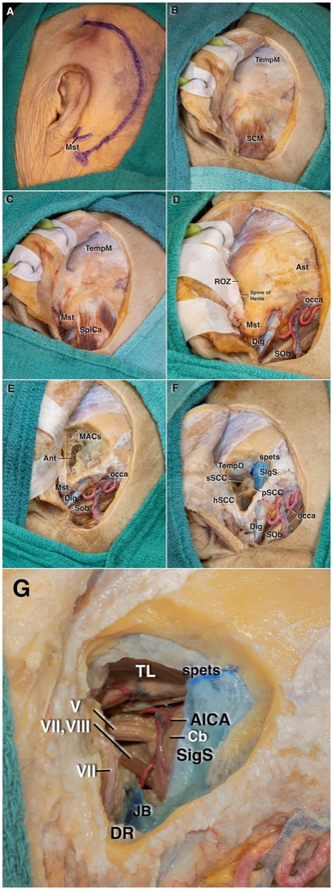

*Front Neurol 2026;17:1736101 — CC BY 4.0. Stepwise temporal-bone drilling exposing the presigmoid corridor and CPA.*

## Dural Opening, Tentorial Division & Intradural Work

- Open the dura **presigmoid (anterior to the sigmoid sinus)** and along the temporal base; **ligate/divide the superior petrosal sinus** and **divide the tentorium behind the entry of CN IV**, uniting the supra- and infratentorial fields.
- **Protect the vein of Labbé** (do not tether/sacrifice), the sigmoid sinus, and CN IV. Work the petroclival lesion: devascularize the clival/petrous dural base, debulk, and dissect the capsule off the **brainstem, basilar/AICA/SCA, and CN III–XI**; preserve perforators.

### Drilling and Dural-Opening Pearls
- Skeletonize before sacrificing: know sigmoid, jugular bulb, facial canal, labyrinth, and dura before deepening the petrosectomy.
- Use diamond burrs and copious irrigation near labyrinth, facial nerve, sigmoid sinus, and petrous carotid; heat injury is still injury.
- Open air cells deliberately and seal them immediately enough that they are not forgotten at closure.
- Divide tentorium under direct visualization and behind CN IV; the trochlear nerve is small, unforgiving, and easy to injure during tentorial division.
- If preserving SPS, work around it intentionally; if dividing it, confirm venous collateral tolerance and control both ends.

### Intraoperative Rescue
- **Sigmoid/SPS bleeding:** pack, lower venous pressure, expose both ends, repair/clip/suture when possible, and avoid sinus sacrifice without dominance/collateral confidence.
- **Vein of Labbe tension:** release temporal retraction, alter the working angle, or stage; sacrificing Labbe can create a dominant temporal venous infarct.
- **Facial nerve irritation:** stop drilling/traction, irrigate cool, verify stimulation threshold, and change trajectory; do not drill blind around a dehiscent canal.
- **Unintended labyrinth opening in a hearing-preservation case:** stop and reassess hearing goal, seal appropriately, counsel postoperatively, and avoid compounding with cochlear/facial injury.
- **Brainstem/perforator adherence:** leave adherent capsule rather than avulsing AICA/SCA/basilar perforators; radiosurgery/staged reoperation is better than a perforator stroke.
- **CSF leak risk at closure:** add fat, fascia, muscle/pericranial flap, eustachian-tube/air-cell occlusion, lumbar drainage when appropriate, and low threshold for early repair if rhinorrhea/otorrhea occurs.

---

## Closure & Reconstruction
- **Meticulous closure is critical — CSF leak is the signature complication.** **Obliterate the mastoid/petrous defect and eustachian tube–facing air cells with autologous fat**, achieve a **watertight (grafted) dural closure**, and buttress with a **vascularized pericranial/temporalis flap.** Replace bone; lumbar drain managed per leak risk.

---

### Further operative anatomy & technique

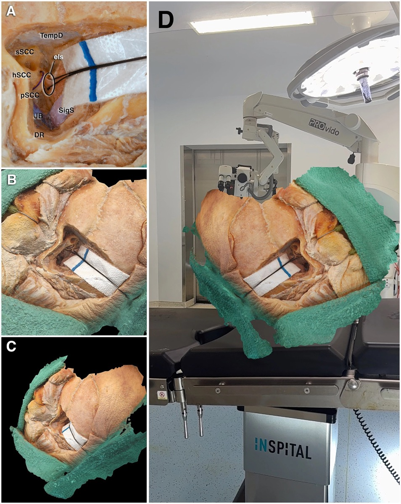

*Front Neurol 2026;17:1736101 — CC BY 4.0.*

## Nuances & Pitfalls (surgeon-level)
- **Match the rung to the hearing/facial reality.** Don't sacrifice a hearing ear or risk the facial nerve for exposure you don't need — retrolabyrinthine if hearing is serviceable; escalate only as the lesion demands.
- **Vein of Labbé and the temporal lobe** — positioning and tentorial work must protect Labbé; its loss causes temporal venous infarction/aphasia (dominant side).
- **CSF leak** is the dominant morbidity — fat obliteration + vascularized flap + watertight dura; under-treated air cells leak to the middle ear/eustachian tube.
- **Facial nerve** is at risk throughout drilling (and is deliberately rerouted in transcochlear) — continuous EMG, identify the canal early.
- **Sinus/SPS handling** — confirm sigmoid dominance before any sinus sacrifice; control the SPS deliberately.
- **Reserve the approach** — for many lesions a [retrosigmoid](retrosigmoid-craniotomy.md) or [subtemporal/Kawase](subtemporal-craniotomy.md) (or staged/combined) route is less morbid; the full petrosal is for large, firm, ventral petroclival disease.

## Complications
**CSF leak** (most common); **hearing loss** (trans-labyrinthine/cochlear) and **facial palsy**; **vein of Labbé / temporal venous infarction**; CN IV/V/VI and lower-CN deficits; sigmoid-sinus thrombosis/venous infarct; brainstem/vascular injury; meningitis; long operative time/approach morbidity.

---

## Cross-links
- Pathology: [petroclival-meningioma.md](../cranial-tumor/petroclival-meningioma.md) · [clival-chordoma.md](../cranial-tumor/clival-chordoma.md) · [vestibular-schwannoma.md](../cranial-tumor/vestibular-schwannoma.md)
- Related corridors: [subtemporal-craniotomy.md](subtemporal-craniotomy.md) (anterior petrosectomy/Kawase) · [retrosigmoid-craniotomy.md](retrosigmoid-craniotomy.md) · [far-lateral-craniotomy.md](far-lateral-craniotomy.md)

<!-- BEGIN FIGURE USE ATTRIBUTION -->

## Figure Use & Attribution

> **About the figures.** Copyrighted operative figures/videos are **linked** (Neurosurgical Atlas, Rhoton); embedded images are **public-domain** (Gray's Anatomy) or **CC‑BY** (open-access), credited beneath each image. See [media-sources.md](../../resources/media-sources.md) and [figures/CREDITS.md](../../figures/CREDITS.md).
>
> **Atlas chapter:** [Extended Posterior Petrosectomy — Neurosurgical Atlas](https://www.neurosurgicalatlas.com/volumes/cranial-base-surgery/skull-base-exposures/extended-posterior-petrosectomy)

<!-- END FIGURE USE ATTRIBUTION -->

<!-- BEGIN CHIEF LEVEL TAKEAWAYS -->

## Chief-Level Corridor Review

Use these as the senior-level mental model for **Presigmoid / Petrosal Approaches (Retrolabyrinthine · Translabyrinthine · Transcochlear · Combined Petrosal)**:

- **Decision point:** Define the exposure goal before incision: target, working angles, proximal/distal control, and the structure that cannot tolerate retraction.
- **Technical lever:** Know the first irreversible step: bone removal, dural opening, vascular control, or muscle/fascial division that commits the corridor.
- **Bailout:** Verbalize the bailout: extend exposure, change trajectory, add CSF drainage, obtain proximal control, convert to a larger corridor, or stop for imaging.
- **Postop watch:** Protect closure from the start: vascularized tissue, watertight dural/reconstruction plan, dead-space control, and drain strategy should be chosen before the final intradural step.

<!-- END CHIEF LEVEL TAKEAWAYS -->

<!-- BEGIN COMMON PIMP QUESTIONS -->

## Common Pimp Questions

Use these to pressure-test preparation for **Presigmoid / Petrosal Approaches (Retrolabyrinthine · Translabyrinthine · Transcochlear · Combined Petrosal)**:

1. What patient position and head rotation make gravity work for this corridor?
2. What named nerve, vessel, sinus, or muscle/fascial plane is most commonly injured?
3. What bone work or soft-tissue step creates the exposure rather than simply using more retraction?
4. What is the bailout if exposure is inadequate, bleeding occurs, or the brain is tight?
5. What closure maneuver prevents the signature complication of this approach?

<!-- END COMMON PIMP QUESTIONS -->

<!-- BEGIN ATTENDING PREFERENCE VARIABLES -->

## Attending Preference Variables

Items that commonly vary by surgeon or institution:

- **Exact head rotation/flexion/extension and pin placement:** [attending-specific]
- **Skin incision length, flap type, and muscle/fascial preservation technique:** [attending-specific]
- **Drill, rongeur, endoscope, microscope, retractor, and navigation preferences:** [attending-specific]
- **Drain use, closure materials, watertightness threshold, and postop imaging routine:** [attending-specific]

<!-- END ATTENDING PREFERENCE VARIABLES -->

<!-- BEGIN REVERSE APPROACH LINKS -->

## Case Guides Using This Approach

- [Petroclival Meningioma Resection](../../cases/cranial-tumor/petroclival-meningioma.md)

<!-- END REVERSE APPROACH LINKS -->

## References
1. Al-Mefty O, Fox JL, Smith RR. **Petrosal approach for petroclival meningiomas.** *Neurosurgery.* 1988;22(3):510–517.
2. House WF, Hitselberger WE. **The transcochlear approach to the skull base.** *Arch Otolaryngol.* 1976.
3. Kawase T, Shiobara R, Toya S. **Anterior transpetrosal-transtentorial approach for sphenopetroclival meningiomas.** *Neurosurgery.* 1991;28(6):869–876.
4. **Anterolateral, lateral, and posterior corridors to complex skull base lesions in sphenocavernous and petroclival regions: microsurgical anatomy with 3D reconstructions.** *Front Neurol.* 2026;17:1736101. CC BY 4.0. (figures embedded above)
5. Cohen-Gadol AA. *Extended Posterior Petrosectomy.* The Neurosurgical Atlas. [link](https://www.neurosurgicalatlas.com/volumes/cranial-base-surgery/skull-base-exposures/extended-posterior-petrosectomy)
