# Approach: Pterional (Frontotemporal) Craniotomy

<!-- BEGIN CASE SNAPSHOT -->

## Case / Approach Snapshot

- **Anatomy at risk:** corridor-defining nerves, arteries, veins/sinuses, cisterns, bone landmarks, muscle/fascial planes, and closure structures that determine exposure and morbidity.
- **Operative steps:** confirm position and trajectory, mark landmarks, protect soft tissue and named neurovascular structures, perform the bone/soft-tissue corridor, open/close dura or target compartment deliberately, and verify hemostasis/reconstruction; use the detailed operative sequence and approach notes below as the step-by-step source.
- **Rescue plans:** brain relaxation failure, venous or sinus bleeding, cranial nerve/perforator risk, exposure that is too narrow, CSF leak, cosmetic/temporalis/frontalis problems, and conversion to a wider or alternate corridor.
- **Figures:** review [Figures, Imaging & Video](#figures-imaging--video) and the [Curated Image Set](#curated-image-set); embedded local figures should remain open-access, public-domain, or otherwise reusable with attribution.
- **Papers:** review [High-Yield Literature](#high-yield-literature) for seminal sources, modern reviews, and outcome data specific to this page.

<!-- END CASE SNAPSHOT -->

*Detailed operative reference written for a senior resident / fellow / attending. Pathology guides (e.g., [MCA aneurysm](../cranial-vascular/mca-aneurysm-clipping.md), [sphenoid wing meningioma](../cranial-tumor/sphenoid-wing-meningioma.md)) link here for technique.*

> **About the figures (read once):** Operative step illustrations/photos (Neurosurgical Atlas, Rhoton) are **copyrighted** and are **linked, not copied**. Embedded images here are **public-domain** anatomy plates (+ open-access CC-BY figures where added). See [media-sources.md](../../resources/media-sources.md).

**Atlas operative videos** — open on the [**Pterional Craniotomy chapter page**](https://www.neurosurgicalatlas.com/volumes/cranial-approaches/pterional-craniotomy): *How Do I Do It · Improving the Efficiency of Exposure · Nuances & Pitfalls · Subfascial Technique · Placement of the Pins.* (Rhoton: [*Preserving the Frontalis Muscle*](https://www.neurosurgicalatlas.com/volumes/cranial-approaches/pterional-craniotomy).)

---

## 1. General Considerations
The pterional (frontotemporal) craniotomy is the **workhorse** of supratentorial surgery — the most flexible, efficient corridor to the anterior and middle skull base. Its leverage comes from removing the **sphenoid wing** so you look *down* the subfrontal corridor and *along* the ridge into the sylvian fissure, minimizing frontal-lobe retraction.

- **Standard vs extended:** the **extended pterional** adds (1) osteotomy of the lateral sphenoid wing to the superior orbital fissure, (2) drilling/flattening of the **orbital roof**, and (3) rongeuring temporal squama to the middle-fossa floor — capturing much of the orbitozygomatic benefit with less morbidity/cosmetic cost. *These bone-removal maneuvers, not a bigger skin flap, are what create the exposure.*
- **Philosophy:** tailor rotation, sphenoid drilling, and the sylvian split to the specific target. Yaşargil's principle — *spend time on the approach/bone work and arachnoid dissection so the deep work is safe.* Routine indiscriminate use of one fixed exposure should be avoided.
- **Keyhole variants:** mini-pterional and **supraorbital "eyebrow"** achieve similar deep reach for selected parasellar/anterior lesions.

## 2. Indications
- **Aneurysms:** MCA, AComA, PComA, ICA bifurcation, ophthalmic/paraclinoid; basilar apex (with extension ± OZ); selected contralateral ophthalmic/MCA/P1.
- **Tumors:** sphenoid wing / clinoidal / tuberculum sellae / planum meningiomas; suprasellar, parasellar, cavernous-sinus tumors; anterior temporal & insular lesions.
- **Generally NOT:** purely third-ventricular tumors; pituitary adenomas (endoscopic endonasal preferred); giant midline anterior-fossa-floor meningiomas may still favor a unilateral subfrontal/extended pterional over bifrontal in many hands.

## 3. Preoperative Considerations
- **AEDs** for cortical/temporal lesions; some stop ~7 days post-op if seizure-free.
- **Lumbar drain** for large skull-base lesions filling the basal cisterns (blocked CSF pathways prevent relaxation on dural opening).
- **Mannitol** per mass effect; **dexamethasone** for vasogenic edema; **embolization** used *sparingly* for vascular meningiomas/AVMs.
- **Neuronavigation** (CTA/MR); **IONM** (SSEP/MEP); **EEG** for burst suppression if temporary clipping anticipated.
- **BP:** normotensive throughout, *except AVM* (SBP kept ~20–30% below baseline).

## Logistics, OR Setup & Orders
- **Typical bed:** ICU or step-down depending on lesion risk, approach corridor, EBL, vascular manipulation, and baseline neurologic status.
- **OR setup:** Mayfield/head holder plan, microscope/endoscope, navigation, vascular instruments/ICG when applicable, skull base reconstruction supplies, and approach-specific retractors/drills ready before opening.
- **Special needs:** arterial line for major intracranial or vascular cases, Foley for long cases, neuromonitoring by corridor, dexamethasone/antiepileptic/BP plan by pathology, and blood products for vascular or skull base exposure.
- **Immediate postop orders:** disposition and neuro-check frequency, HOB/activity, postop CT/MRI/CTA timing, BP goals, steroid/antiepileptic plan, DVT prophylaxis timing, drain management, and focused cranial nerve/visual/language/motor exams.

## 4. Operative Anatomy (what you must own)
- **Scalp — 5 layers (SCALP):** Skin · subCutaneous (vessels/nerves) · Aponeurosis (galea) · Loose areolar · Pericranium. The galea continues over the temporal region as the **temporoparietal fascia (TPF)**.
- **Temporal fascia:** below the TPF and loose areolar plane lies the **temporalis (deep temporal) fascia**, which near the arch **splits into superficial and deep laminae enclosing the superficial temporal fat pad.**
- **Frontotemporal (frontalis) branches of CN VII:** run within/over the fat pad as they cross the zygomatic arch toward frontalis — **the structure most often injured.** Protected by **interfascial** or **subfascial** dissection (carry the fat pad down with the flap) or a **single-layer myocutaneous flap**.
- **STA:** main trunk anterior to the tragus; **frontal & parietal branches** — preserve if any chance of future bypass; the incision should **not extend below the zygoma** (facial-nerve trunk risk).
- **Keyhole (MacCarty point):** frontal process of zygoma + superior temporal line + frontozygomatic suture; one burr hole exposes periorbita below and frontal dura above.
- **Pterion:** frontal-parietal-temporal-sphenoid confluence; **anterior division of the MMA** runs beneath — bleeds when the wing is drilled.
- **Sphenoid wing → superior orbital fissure → orbital roof; sylvian fissure;** deep targets: ICA & branches, optic nerve/chiasm, A1/M1, basal cisterns.

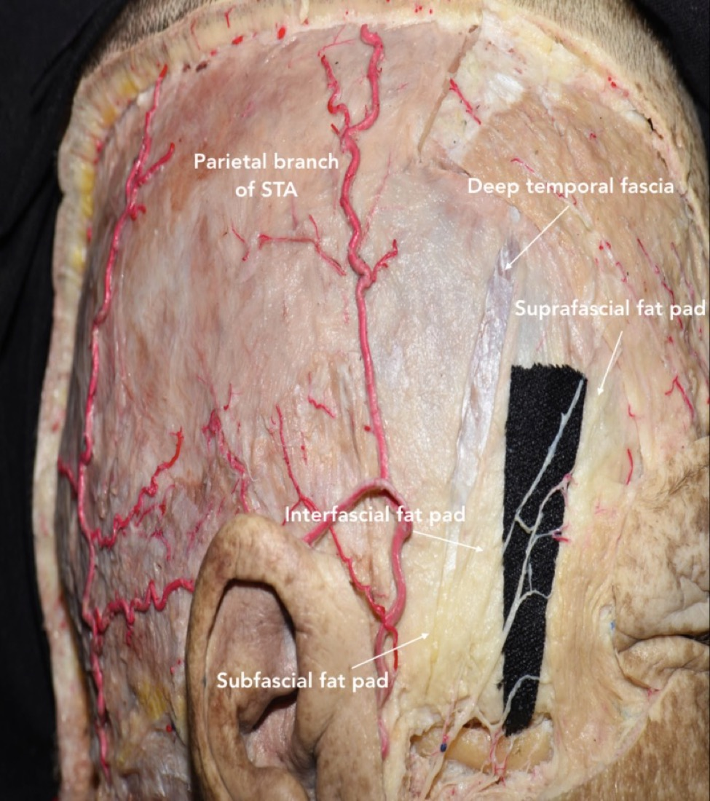
*Cadaveric dissection — Rodriguez Rubio R et al., Cureus 2019;11(7):e5216 (CC BY).*

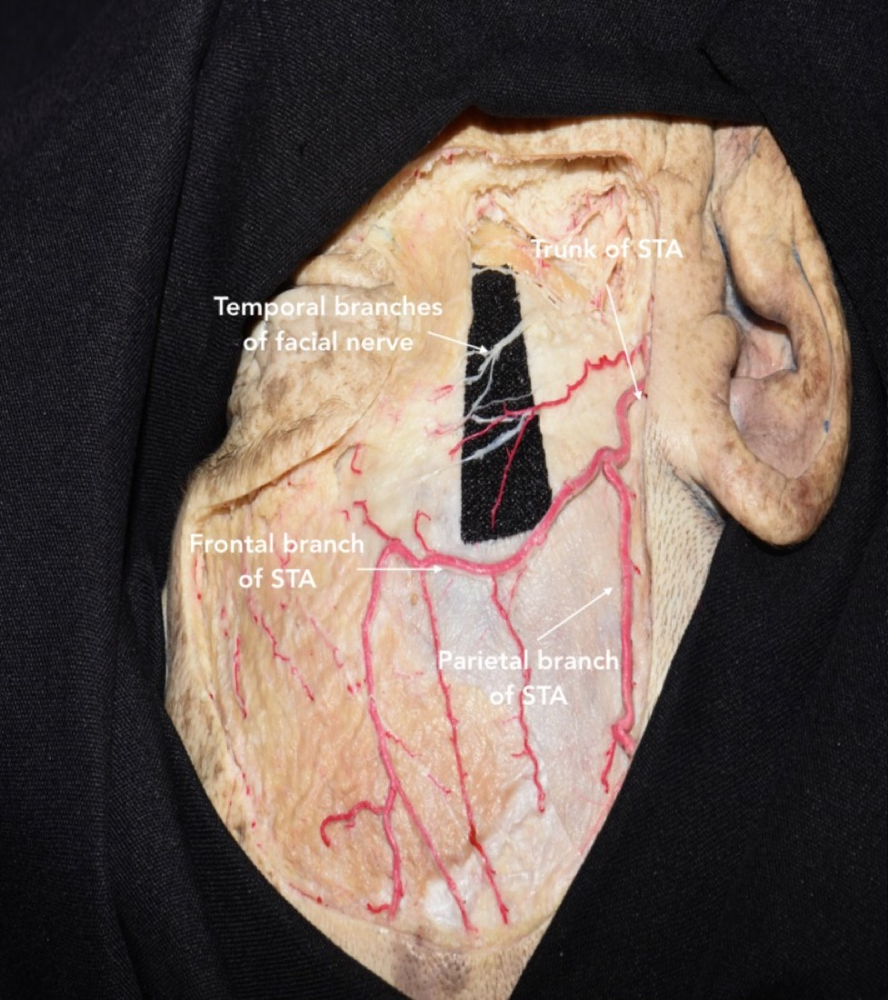
*Cadaveric dissection — Rodriguez Rubio R et al., Cureus 2019;11(7):e5216 (CC BY).*

## 5. Positioning
- **Supine**, knees flexed, **table up ~15–20°** (reverse Trendelenburg); head above the heart.
- **Mayfield 3-pin:** **double-pin rocker on the contralateral superior temporal line**, **single pin on the ipsilateral mastoid** — all well behind the planned incision, out of the flap, away from the temporalis and frontal sinus/orbit.
- **Rotation (target-driven):** *closer to midline / more anterior ⇒ turn LESS.* ~**30°** AComA; ~**45°** MCA; less rotation + more deflection for superiorly-extending suprasellar tumors; basal lesions (ophthalmic/PComA, cavernous sinus) ⇒ **less deflection, more rotation** to keep the orbital rim in the superior plane.
- **Extension** until the **malar eminence is the highest point** → frontal lobe falls off the anterior fossa floor by gravity; **vertex down ~15°.**
- **Ipsilateral shoulder roll** if neck mobility is limited; re-check IONM after positioning.
*Nuance:* over-rotation drops the temporal lobe into your subfrontal view and tents the sylvian veins — under-rotate and let gravity, not retractors, do the work.

## 6. Skin Marking & Incision
- **Curvilinear (reverse question-mark)** behind the hairline: start **~1 cm anterior to the tragus at the zygomatic root**, curve posterosuperiorly, then forward to the **midline / contralateral mid-pupillary line.**
- Keep the **STA posterior** in the flap when feasible; **frontalis branch stays anterior** to the incision. For a pure subfrontal target, do not extend far behind the hairline; keep the flap's connecting line within ~1 cm of the keyhole.

## 7. Scalp Incision Technique
- Infiltrate; **Raney clips / bipolar** for hemostasis. As the incision reaches the **superior temporal line**, slide a **periosteal elevator under the subcutaneous tissue to protect the STA and temporalis**, then cut skin onto the elevator.
- **STA:** identify, dissect to the frontal/parietal bifurcation; **coagulate & divide the frontal branch** (preserve parietal) for a standard flap — *but preserve branches if a bypass is conceivable or for a large posteriorly-extended flap (flap vascularity/healing).*

## 8. Frontalis-Branch Protection — choose your technique
- **Single-layer myocutaneous flap (one layer):** raise skin + temporalis together; fast, robust vascularity. *Nuance:* reflect maximally anteroinferiorly to reveal the pterion; **place rolled gauze under the flap to prevent kinking/ischemia** of the scalp.
- **Interfascial:** ~4 cm above the orbital rim, incise the **superficial layer of temporalis fascia** at the upper edge of the fat pad and carry the fat pad + superficial layer (with the nerve on its outer surface) down with the flap.
- **Subfascial:** elevate beneath the **superficial temporal fat pad** off the deep layer.
- *Pearl:* **never skeletonize the frontalis branch off the fat pad** — keep it sandwiched in tissue. Frontalis palsy is the signature avoidable complication.

## 9. Temporalis Dissection & Reflection
- Incise temporalis with **monopolar in two limbs** (along the superior temporal line and the inferior incision) leaving a **fascial cuff superiorly for reattachment**, OR reflect as one myocutaneous layer.
- **Preserve the deep temporal fascia / deep temporal neurovascular pedicle** (avoid heavy monopolar on the deep surface) to **minimize temporalis atrophy & trismus.**
- Reflect inferiorly over the zygoma; secure with **fishhooks**; expose the **frontal process of the zygoma just anterior to the keyhole** for orbital-roof extension.

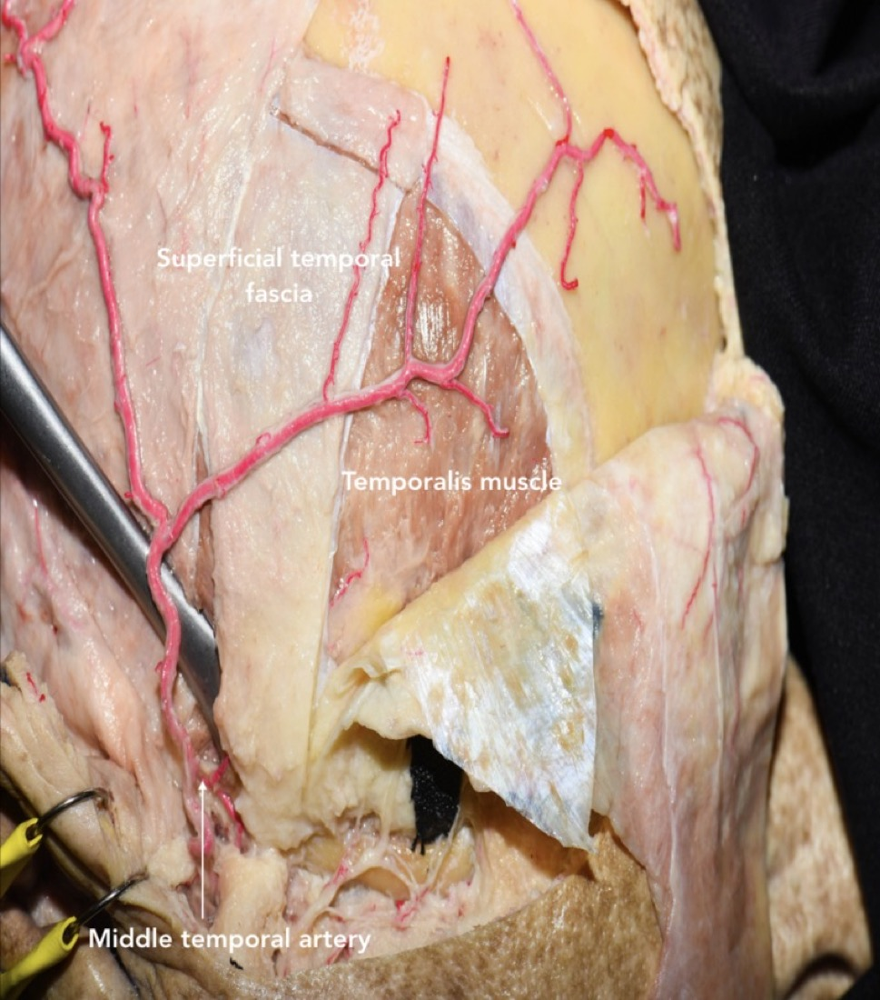
*Cadaveric dissection — Rodriguez Rubio R et al., Cureus 2019;11(7):e5216 (CC BY).*

## 10. Keyhole & Burr Hole(s)
- **Single burr hole** just inferior to the most posterior exposed superior temporal line; sweep the dura free with a **#3 Penfield** to mobilize the whole flap toward the pterion. *Nuance:* a single hole **behind the hairline, under muscle** minimizes cosmetic defect vs. the classic 2-hole (keyhole + zygomatic root) technique.
- The **MacCarty keyhole** is used when orbit + anterior fossa need to be entered together; a "**modified pterional without MacCarty keyhole**" is also valid.

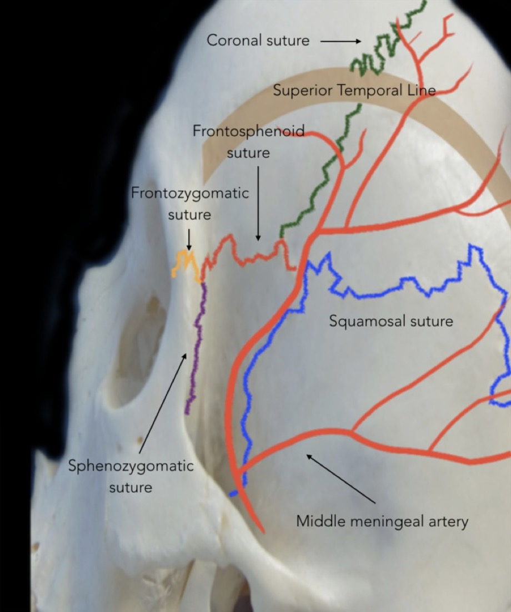
*Cadaveric dissection — Rodriguez Rubio R et al., Cureus 2019;11(7):e5216 (CC BY).*

## 11. Craniotomy
- **Footplate craniotome (B1):** two osteotomies. After the first cut, the drill stalls at the **lateral sphenoid wing** → **turn 180° at the pterion** to create room, remove the heel, and start the second osteotomy. Outline matches pathology (MCA vs AComA outlines differ; anterior-fossa tumors follow the AComA outline).
- *Pitfall:* the footplate **tears dura on the turns, especially the frontal turn** — go slow, lift, and irrigate.

## 12. Frontal Sinus Management
- The **anteromedial cut may enter the frontal sinus** (supraorbital notch is an unreliable lateral landmark — use navigation). If entered: **exenterate the mucosa, pack with muscle/bone wax**, and plan a pericranial buttress at closure to prevent **CSF leak / mucocele.**

## 13. Sphenoid Wing Drilling — *the key step*
- After elevating the flap, **strip dura off the orbital roof (Penfield #1)** and mobilize dura off both frontal and temporal surfaces of the ridge.
- **Remove the lateral/mid sphenoid ridge aggressively** — **rongeur first for speed, then a side-cutting air drill** — until **flat to the skull base.** Control **MMA** bleeding at the wing.
- **Extended pterional:** continue to the **superior orbital fissure**, **flatten the orbital roof and supraorbital edge** — *critical for an unobstructed subfrontal view toward the midline anterior skull base.*

## 14. Dural Opening
- **Curvilinear**, reflected anteroinferiorly toward the sphenoid ridge; **tack-up sutures placed close to the brain** to pull dura + muscle out of the subfrontal working zone. Three tack-ups typically. Protect cortex and **sylvian/superficial middle cerebral vein.**

## 15. Brain Relaxation & Intradural Orientation
- Relax via **cisternal CSF egress** (carotid, chiasmatic, lamina terminalis), **lumbar drain**, mannitol, head-up. **Split the sylvian fissure** (inside-out or outside-in) to the extent the target requires, preserving the superficial middle cerebral vein. → proceed to pathology-specific intradural steps (see the relevant guide).

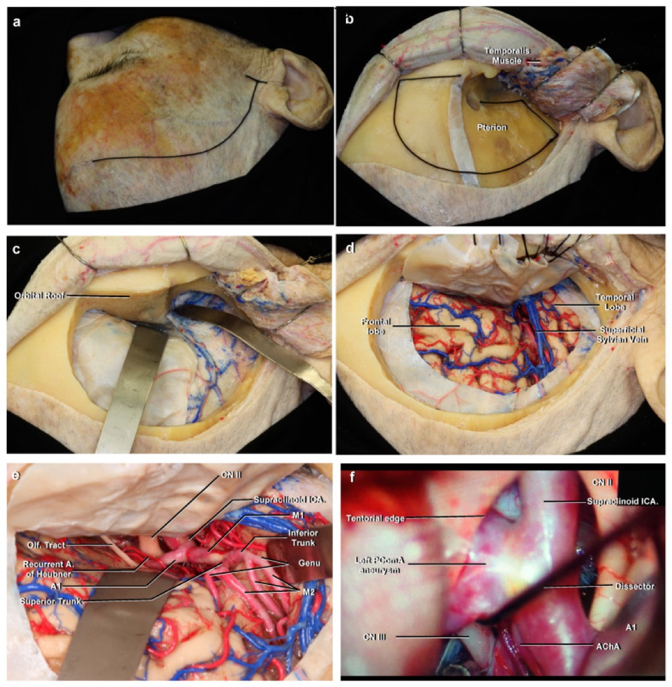
*Poblete T et al., "Microsurgical Anatomy of the Anterior Circulation…" Brain Sci 2021;11(4):519 (CC BY 4.0).*

## 16. Closure
- **Dura:** approximate; *watertight closure not obligatory for a supratentorial craniotomy unless the ventricle was entered or hydrocephalus/raised CSF pressure is expected* — then close watertight ± graft.
- **Bone flap:** **≥3 mini-plates**; central dural tack-up optional; the behind-hairline burr hole preserves keyhole bone for cosmesis.
- **Temporalis:** reattach **fascia to its superior cuff** (single-layer flap: reattach posteriorly; approximate fascia gently to limit jaw-movement pain). Subgaleal drain only if scalp hemostasis is problematic. Layered scalp closure.

## 17. Nuances & Pitfalls (high-yield)
- **Frontalis palsy** — interfascial/subfascial or single-layer flap; never dissect the nerve free.
- **Temporalis atrophy/trismus** — preserve deep temporal pedicle; reattach anatomically; avoid monopolar on the deep muscle surface.
- **Under-drilled sphenoid wing** = "deep, narrow" exposure — the most common technical shortfall; flatten to base ± orbital roof.
- **Frontal sinus entry** — exenterate/pack + pericranial buttress.
- **Dural tear on craniotome turns** — anticipate at the frontal turn.
- **MMA/wing bleeding** — control early; wax the wing.
- **Sylvian/bridging vein sacrifice** — venous infarct; preserve the SMCV.
- **Over-rotation/under-extension** — temporal lobe obscures the subfrontal corridor.

## 18. Complications
Frontalis (CN VII) palsy; temporalis atrophy / trismus; CSF leak / mucocele (sinus, dura); wound infection; seizures; retraction injury; vascular injury (SMCV, MCA/ICA branches, perforators); cosmetic contour deformity; pseudomeningocele.

---

## Pathology guides that use this approach
[MCA aneurysm](../cranial-vascular/mca-aneurysm-clipping.md) · [AComA aneurysm](../cranial-vascular/acomm-aneurysm-clipping.md) · [PComA aneurysm](../cranial-vascular/pcomm-aneurysm-clipping.md) · [Sphenoid wing meningioma](../cranial-tumor/sphenoid-wing-meningioma.md) · [Tuberculum sellae meningioma](../cranial-tumor/tuberculum-sellae-meningioma.md) · [Insular glioma](../cranial-tumor/insular-glioma.md)

## References
1. Yaşargil MG. *Microneurosurgery*, Vol. I. Georg Thieme Verlag; 1984:217–220.
2. Krayenbühl N, Isolan GR, Hafez A, Yaşargil MG. The relationship of the fronto-temporal branches of the facial nerve to the fascias of the temporal region: a literature review applied to practical anatomical dissection. *Neurosurg Rev.* 2007;30(1):8–15.
3. Shimizu S, Tanriover N, Rhoton AL Jr, Yoshioka N, Fujii K. MacCarty keyhole and inferior orbital fissure in orbitozygomatic craniotomy. *Neurosurgery.* 2005;57(1 Suppl):152–159.
4. Figueiredo EG, Deshmukh P, Nakaji P, et al. The minipterional craniotomy: technical description and anatomic assessment. *Neurosurgery.* 2007;61(5 Suppl 2):256–265.
5. **Rodriguez Rubio R, Chae R, Vigo V, Abla AA, McDermott M. Immersive Surgical Anatomy of the Pterional Approach. *Cureus.* 2019;11(7):e5216.** (CC BY — cadaveric figures embedded above) — [PMC6759424](https://pmc.ncbi.nlm.nih.gov/articles/PMC6759424/)
6. **Poblete T, Casanova D, Soto M, Campero A, Mura J. Microsurgical Anatomy of the Anterior Circulation of the Brain Adjusted to the Neurosurgeon's Daily Practice. *Brain Sci.* 2021;11(4):519.** (CC BY 4.0 — figure embedded above) — [PMC8073207](https://pmc.ncbi.nlm.nih.gov/articles/PMC8073207/)
7. Rhoton AL Jr. *Cranial Anatomy and Surgical Approaches.* Congress of Neurological Surgeons.
8. The Neurosurgical Atlas (Cohen-Gadol AA) — Pterional Craniotomy chapter (operative figures/videos, linked).
9. Further open-access technique papers: [PubMed Central — pterional craniotomy](https://www.ncbi.nlm.nih.gov/pmc/?term=pterional+craniotomy+technique); [Surgical Neurology International — suprafascial dissection](https://surgicalneurologyint.com/surgicalint-articles/suprafascial-dissection-for-pterional-craniotomy-to-preserve-the-frontotemporal-branch-of-the-facial-nerve-with-less-temporal-hollowing/).

<!-- BEGIN CURATED LITERATURE -->

## High-Yield Literature

- **Anterior interhemispheric vs. pterional approach in the microsurgical management of anterior communicating artery aneurysms: a comparative analysis employing a novel multidimensional matching-tool** — Swiatek VM. Neurosurgical review 2024. [PubMed](https://pubmed.ncbi.nlm.nih.gov/39069603/)
- **Temporalis Muscle Dissection Techniques in the Pterional Approach: Quantitative Impact on Operative Corridor and Surgical Freedom** — Hasimoglu S. World neurosurgery 2026. [PubMed](https://pubmed.ncbi.nlm.nih.gov/42177943/)
- **Tuberculum sellae meningiomas: microsurgical anatomy and surgical technique** — Jallo GI. Neurosurgery 2002. [PubMed](https://pubmed.ncbi.nlm.nih.gov/12445348/)
- **Cranio-Orbito-Zygomatic Approach: Core Techniques for Tailoring Target Exposure and Surgical Freedom** — Luzzi S. Brain sciences 2022. [PubMed](https://pubmed.ncbi.nlm.nih.gov/35326360/)
- **The pterional approach for the microsurgical removal of olfactory groove meningiomas** — Turazzi S. Neurosurgery 1999. [PubMed](https://pubmed.ncbi.nlm.nih.gov/10515476/)
- **Microsurgical Anatomy of the Interfascial Vein. Its Significance in the Interfascial Dissection of the Pterional Approach** — Campero A. Operative neurosurgery (Hagerstown, Md.) 2017. [PubMed](https://pubmed.ncbi.nlm.nih.gov/28922882/)
- **Lipotranferences in post neurosurgical esthetic defects** — Demichelis MDRE. Surgical neurology international 2023. [PubMed](https://pubmed.ncbi.nlm.nih.gov/38213453/)
- **Minimally invasive approaches to aneurysms of the anterior circulation: selection criteria and clinical outcomes** — Gandhi S. Journal of neurosurgical sciences 2018. [PubMed](https://pubmed.ncbi.nlm.nih.gov/30207433/)
- **Applying objective metrics to neurosurgical skill development with simulation and spaced repetition learning** — Robertson FC. Journal of neurosurgery 2023. [PubMed](https://pubmed.ncbi.nlm.nih.gov/36905658/)
- **Diagnosis and surgical treatment of cavernous sinus hemangiomas: an experience of 20 cases** — Zhou LF. Surgical neurology 2003. [PubMed](https://pubmed.ncbi.nlm.nih.gov/12865008/)

<!-- END CURATED LITERATURE -->

---

<!-- BEGIN CURATED IMAGE SET -->

## Curated Image Set

Open-access figures are embedded from PubMed Central articles and kept unique to this guide.

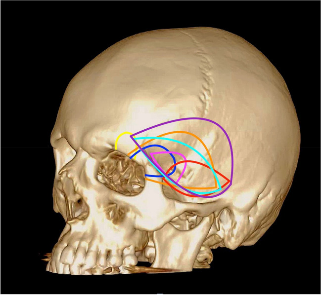
*Fig. 2. Schematic illustration demonstrating the anatomical locations of the described craniotomies. Each coloured line represents a different anatomical location for the reviewed craniotomies:... Source: [‘What’s in a name’, a systematic review of the pterional craniotomy for aneurysm surgery and its many modifications with a proposal for simplified nomenclature](https://pmc.ncbi.nlm.nih.gov/articles/PMC10791755/) — Acta Neurochirurgica 2024; CC BY.*

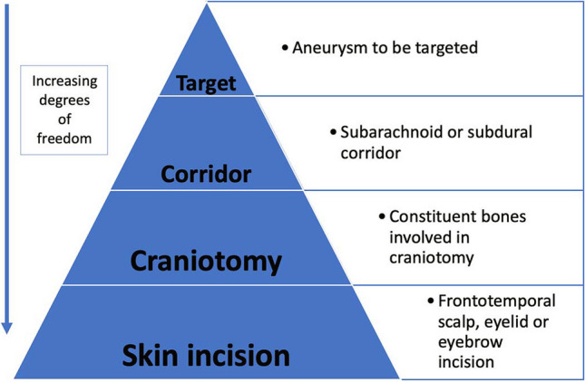
*Fig. 3. Proposal of how to apply the ‘inside-out’ concept for aneurysm surgery and a way to simplify the approach related nomenclature Source: [‘What’s in a name’, a systematic review of the pterional craniotomy for aneurysm surgery and its many modifications with a proposal for simplified nomenclature](https://pmc.ncbi.nlm.nih.gov/articles/PMC10791755/) — Acta Neurochirurgica 2024; CC BY.*

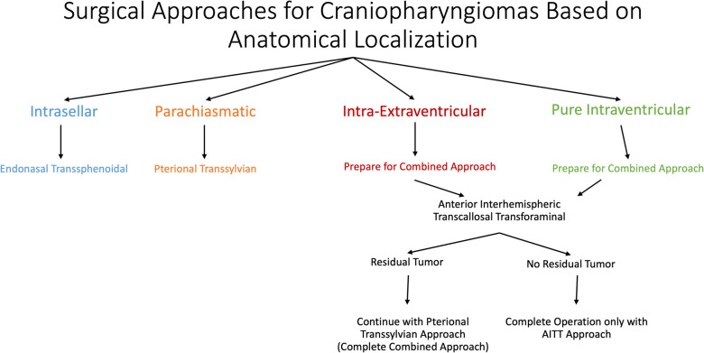
*Fig. 2. Surgical approaches for craniopharyngiomas based on anatomical localization. The endonasal transsphenoidal approach was preferred for intrasellar tumors. For parachiasmatic tumors, the... Source: [Revisiting the combined approach of Yaşargil for microsurgical removal of intra-extraventricular and pure intraventricular craniopharyngiomas](https://pmc.ncbi.nlm.nih.gov/articles/PMC12102001/) — Acta Neurochirurgica 2025; CC BY.*

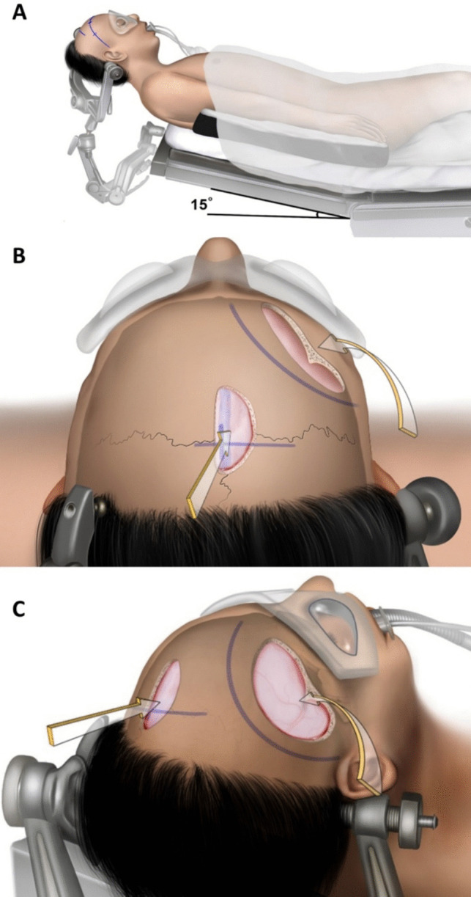
*Fig. 3. Surgical position and skin incisions. A First, for the interhemispheric approach, the head is fixed in the supine position with neutral, slight flexion. B After a linear skin incision is... Source: [Revisiting the combined approach of Yaşargil for microsurgical removal of intra-extraventricular and pure intraventricular craniopharyngiomas](https://pmc.ncbi.nlm.nih.gov/articles/PMC12102001/) — Acta Neurochirurgica 2025; CC BY.*

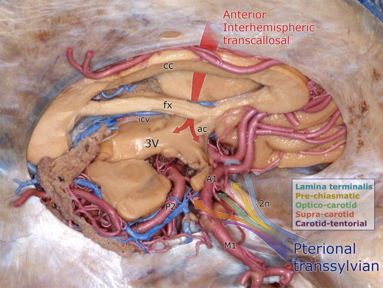
*Fig. 4. Demonstration of the combined approach on an anatomical specimen. Red arrow: interhemispheric transcallosal route. The multicolor arrow indicates the pterional transsylvian route with... Source: [Revisiting the combined approach of Yaşargil for microsurgical removal of intra-extraventricular and pure intraventricular craniopharyngiomas](https://pmc.ncbi.nlm.nih.gov/articles/PMC12102001/) — Acta Neurochirurgica 2025; CC BY.*

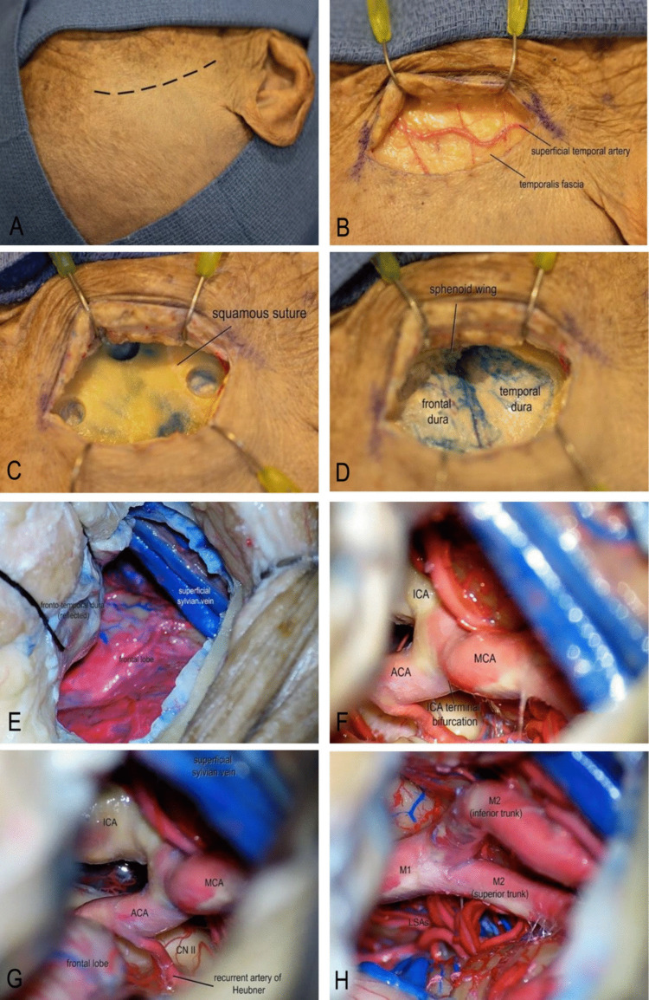
*Fig. 1. Step-by-step illustration of the standardized mini-pterional approach. A A curvilinear frontotemporal skin incision centered over the pterion was made. B After skin incision, the... Source: [Microscopic transorbital vs mini-pterional approach to MCA bifurcation aneurysms: a quantitative cadaveric comparative study with surgical implications](https://pmc.ncbi.nlm.nih.gov/articles/PMC12967600/) — Acta Neurochirurgica 2026; CC BY.*

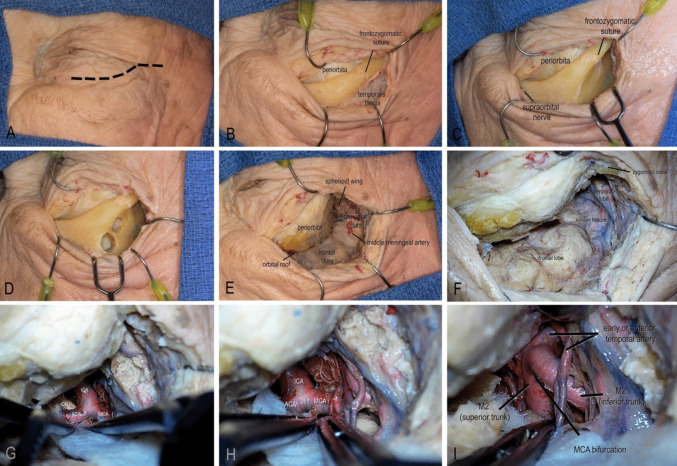
*Fig. 2. Step-by-step illustration of the eyelid transorbital approach. A The incision was planned along the natural eyelid crease, extending laterally from the medial limbus to the lateral... Source: [Microscopic transorbital vs mini-pterional approach to MCA bifurcation aneurysms: a quantitative cadaveric comparative study with surgical implications](https://pmc.ncbi.nlm.nih.gov/articles/PMC12967600/) — Acta Neurochirurgica 2026; CC BY.*

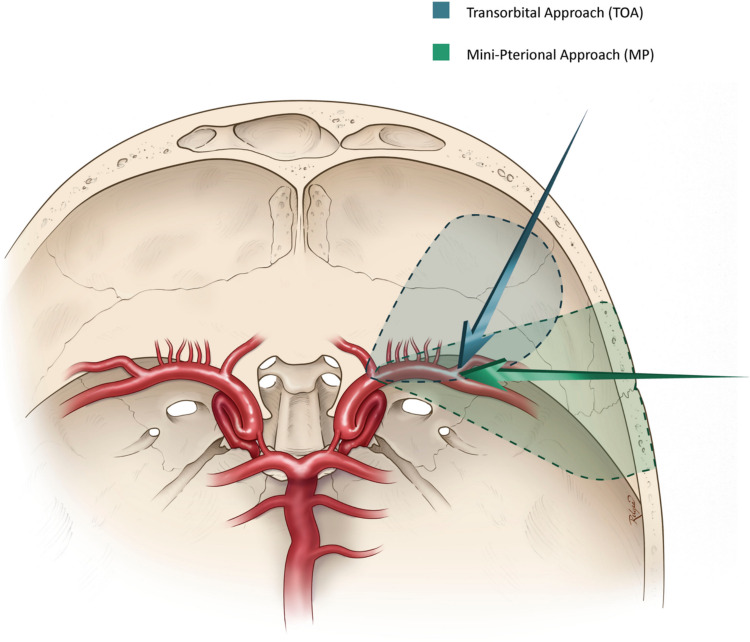
*Fig. 3. Axial illustration demonstrating the MP and TOA approaches and their respective angles to the MCA bifurcation Source: [Microscopic transorbital vs mini-pterional approach to MCA bifurcation aneurysms: a quantitative cadaveric comparative study with surgical implications](https://pmc.ncbi.nlm.nih.gov/articles/PMC12967600/) — Acta Neurochirurgica 2026; CC BY.*

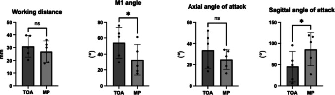
*Fig. 4. Quantitative analysis represented as bar charts. * Indicates statistically significant difference, p < 0.005. (TOA = transorbital approach, MP = mini-pterional approach) Source: [Microscopic transorbital vs mini-pterional approach to MCA bifurcation aneurysms: a quantitative cadaveric comparative study with surgical implications](https://pmc.ncbi.nlm.nih.gov/articles/PMC12967600/) — Acta Neurochirurgica 2026; CC BY.*

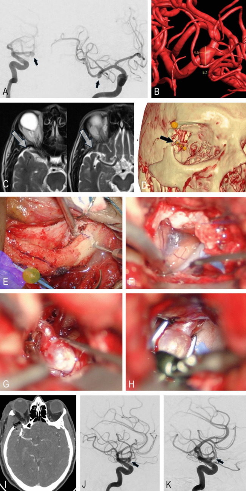
*Fig. 5. Illustrative case. A Preoperative lateral and anteroposterior DSA showing a right MCA bifurcation aneurysm (black arrows). B 3D reconstructed aneurysm model with size measurements and... Source: [Microscopic transorbital vs mini-pterional approach to MCA bifurcation aneurysms: a quantitative cadaveric comparative study with surgical implications](https://pmc.ncbi.nlm.nih.gov/articles/PMC12967600/) — Acta Neurochirurgica 2026; CC BY.*

<!-- END CURATED IMAGE SET -->
