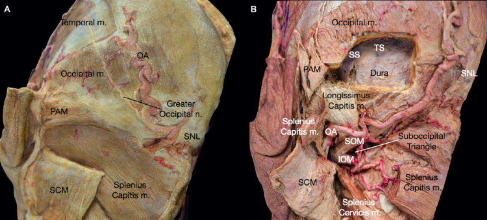
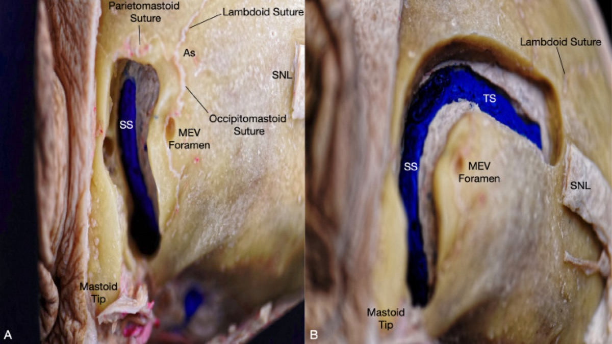
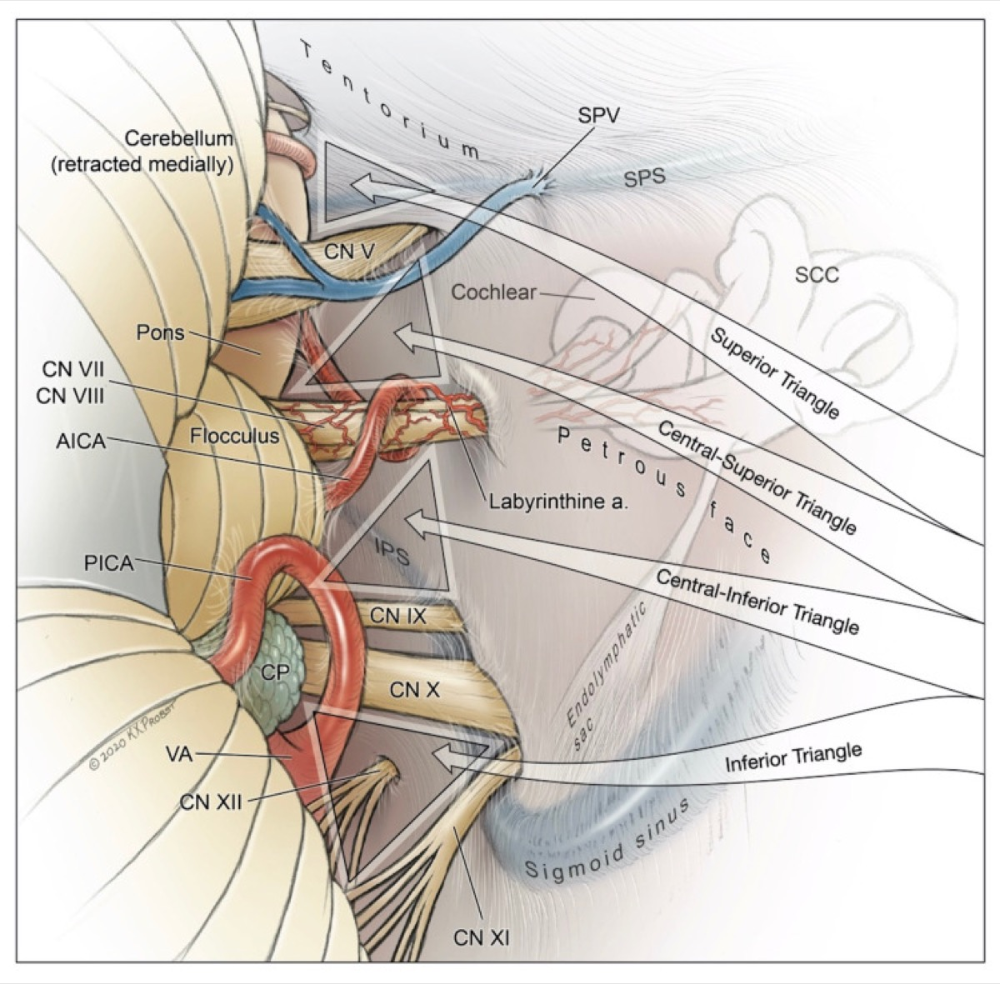
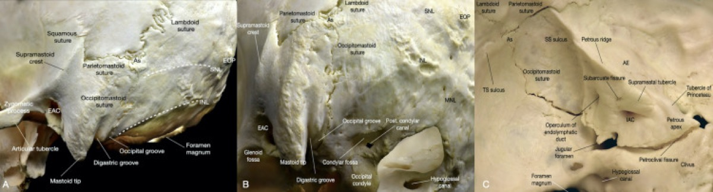
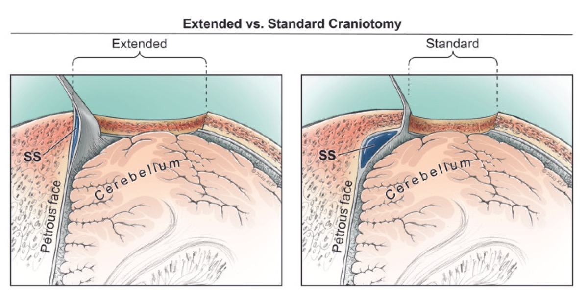

# Operative Approach: Retrosigmoid (Retromastoid) Craniotomy

> **About the figures.** Copyrighted operative figures and videos are **linked** (Neurosurgical Atlas, Rhoton collection); embedded images are **public-domain** (Gray's Anatomy) or **Creative Commons CC‑BY** (open-access cadaveric anatomy), each credited beneath the image. See [media-sources.md](../../resources/media-sources.md) and [figures/CREDITS.md](../../figures/CREDITS.md).
>
> **Atlas chapters & video:** [Retromastoid Craniotomy — Neurosurgical Atlas](https://www.neurosurgicalatlas.com/volumes/cranial-approaches/retromastoid-craniotomy) · [The Retrosigmoid Craniotomy (Neuroanatomy)](https://www.neurosurgicalatlas.com/neuroanatomy/the-retrosigmoid-craniotomy) · [Retrosigmoid Approach — 3D Model](https://www.neurosurgicalatlas.com/3d-models/retrosigmoid-approach) · [Cranial Approaches — General Principles](https://www.neurosurgicalatlas.com/volumes/cranial-approaches/general-principles)

The retrosigmoid craniotomy is the **workhorse posterolateral corridor to the cerebellopontine angle (CPA), petroclival region, and lateral posterior fossa.** It is the approach for vestibular schwannoma, CPA meningioma and epidermoid, microvascular decompression (trigeminal neuralgia, hemifacial spasm, glossopharyngeal neuralgia), and selected petroclival and foramen magnum lesions. Its power lies in a small, low-morbidity bony window placed precisely at the **transverse–sigmoid sinus junction**, combined with early CSF drainage that lets the cerebellum fall away from the petrous face — giving a wide, retractor-light view of cranial nerves III–XII.

---

## Figures, Imaging & Video

**🎥 Operative video** — [search operative video on YouTube ▸](https://www.youtube.com/results?search_query=cerebellopontine+angle+surgery) · [The Neurosurgical Atlas ▸](https://www.neurosurgicalatlas.com)

**📑 Key evidence — landmark trials & guidelines**

- **SRS vs microsurgery** — Pollock BE et al. *Neurosurgery* 2006 — prospective comparison for small/medium VS. [🔗 PubMed](https://pubmed.ncbi.nlm.nih.gov/?term=Pollock+vestibular+schwannoma+radiosurgery+resection+prospective+2006)
- **Natural history** — Stangerup SE et al. — growth and hearing in conservatively managed VS. [🔗 PubMed](https://pubmed.ncbi.nlm.nih.gov/?term=Stangerup+vestibular+schwannoma+natural+history+hearing+growth)
- **Guidelines:** [CNS Guidelines](https://www.cns.org/guidelines) · [AANS](https://www.aans.org)
[Neurosurgical Atlas — Retromastoid](https://www.neurosurgicalatlas.com/volumes/cranial-approaches/retromastoid-craniotomy) · [Rhoton CPA anatomy (PMC)](https://www.ncbi.nlm.nih.gov/pmc/?term=rhoton+cerebellopontine+angle+anatomy) · [Radiopaedia — CPA](https://radiopaedia.org/search?q=cerebellopontine%20angle&scope=all) · [PubMed Central — retrosigmoid](https://www.ncbi.nlm.nih.gov/pmc/?term=retrosigmoid+approach+surgical+anatomy)

*Gray's Anatomy (1918), public domain — via Wikimedia Commons. The retrosigmoid corridor targets the posterior petrous face: porus acusticus (CN VII/VIII), jugular foramen (IX–XI) below, and the trigeminal porus above.*

---

## General Considerations

- **What it accesses:** the CPA and lateral posterior fossa from the foramen magnum (CN XII) below to the trigeminal nerve and tentorial incisura above; with intradural suprameatal drilling (RISA) and petrous apex work it reaches the upper clivus and Meckel's cave.
- **Core principle:** expose the **medial edge of the sigmoid sinus** and the **inferior edge of the transverse sinus** so the surgeon can look *along* the petrous face rather than across the cerebellum. The single most important determinant of a good CPA view is how far laterally (to the sigmoid) and superiorly (to the transverse) the bone is removed — not the diameter of the craniotomy.
- **Retraction philosophy:** modern practice is **retractor-light or retractor-free.** CSF egress from the cerebellomedullary (cisterna magna) and CPA cisterns relaxes the cerebellum; gravity (lateral/park-bench positioning) does the rest. Fixed blade retraction on the cerebellum is a leading cause of avoidable ataxia and should be transient if used at all.
- **Craniotomy vs craniectomy:** a replaced bone flap (cranioplasty) reduces postoperative headache and pseudomeningocele compared with craniectomy and is preferred when feasible; craniectomy remains acceptable, especially in revision or when the bone is thin/pneumatized.

### Indications
- Vestibular schwannoma (hearing-preservation candidate, any size with brainstem reach) → see [vestibular-schwannoma.md](../cranial-tumor/vestibular-schwannoma.md)
- CPA meningioma, epidermoid → see [epidermoid.md](../cranial-tumor/epidermoid.md)
- Microvascular decompression: trigeminal neuralgia, hemifacial spasm, glossopharyngeal neuralgia → see [mvd-trigeminal-neuralgia.md](../cranial-functional/mvd-trigeminal-neuralgia.md), [mvd-hemifacial-spasm.md](../cranial-functional/mvd-hemifacial-spasm.md)
- Petroclival meningioma (smaller, or combined/staged) → see [petroclival-meningioma.md](../cranial-tumor/petroclival-meningioma.md)
- Foramen magnum / lower CN lesions (with far-lateral extension) → see [foramen-magnum-meningioma-far-lateral.md](../cranial-tumor/foramen-magnum-meningioma-far-lateral.md), [jugular-foramen-tumor.md](../cranial-tumor/jugular-foramen-tumor.md)

### Relative limitations
- Ventral brainstem and mid/lower clivus are seen only obliquely (consider far-lateral, endoscopic endonasal transclival, or petrosal approaches).
- A high-riding jugular bulb or anteriorly placed sigmoid narrows the inferolateral corridor.
- Hearing-destructive alternatives (translabyrinthine) trade hearing for a shorter, more lateral route to the IAC.

---

## Relevant Surgical Anatomy

**Venous sinuses (the frame of the approach).**
- **Transverse sinus (TS)** runs in the attachment of the tentorium, roughly along the **superior nuchal line**.
- **Sigmoid sinus (SS)** curves down in the sigmoid groove behind the mastoid, anterior/deep to the **digastric groove**, to the jugular bulb.
- **Transverse–sigmoid junction (TSJ)** is the superolateral corner of the bony window and the key landmark.
- **Asterion** (meeting of lambdoid, parietomastoid, occipitomastoid sutures) overlies the TSJ or the inferior transverse sinus in most heads — but its position is **variable**, so it guides, and navigation/anatomy confirms.
- **Mastoid emissary vein** pierces bone near the SS and reliably bleeds — anticipate and wax it.

**Cranial nerve relationships at the CPA** (superior → inferior on the petrous face): **CN V** (trigeminal porus, superomedial); **CN VII/VIII** complex entering the **internal acoustic meatus** (VII anterosuperior, cochlear inferior, vestibular posterior); **flocculus and choroid plexus** marking the foramen of Luschka just dorsal to the VII/VIII root exit; **CN IX–X–XI** to the jugular foramen; **CN XII** to the hypoglossal canal below. **AICA** loops near the VII/VIII complex and into the IAC (subarcuate/labyrinthine branches) — its preservation is mandatory.

---

## Preoperative Evaluation

- **MRI** with thin-cut (CISS/FIESTA) sequences through the CPA/IAC: lesion size, brainstem contact, IAC fundus extension, and for MVD the offending vessel and conflict point.
- **CT / CT venogram (or MRV):** pneumatization of the mastoid/petrous (air-cell risk for CSF leak), **jugular bulb height/dominance**, sigmoid position, and patency of the contralateral transverse sinus before any sinus sacrifice is contemplated.
- **Audiometry** (pure-tone average, speech discrimination) for hearing-preservation decision-making in VS.
- **Baseline facial function** (House-Brackmann), lower cranial nerve and swallowing assessment for larger or inferiorly placed lesions.

## Anesthesia & Neuromonitoring

- GA, total intravenous anesthesia favored when MEPs/facial EMG are used; **no long-acting paralytic** after intubation so facial/lower-CN EMG is interpretable.
- **Monitoring:** continuous **facial nerve EMG** (and stimulation) for VS/MVD; **BAERs** for hearing preservation; SSEP/MEP and lower-CN (IX/X, XI, XII) EMG as dictated by lesion location; **lateral spread response** for hemifacial spasm.
- **If a sitting/semi-sitting position is used:** precordial Doppler, end-tidal CO₂, and a right-atrial catheter for **venous air embolism (VAE)** detection/aspiration; **pre-op echocardiogram to exclude a PFO** (relative contraindication to sitting).
- Lumbar drain is generally unnecessary (CSF is released intradurally) but can be considered case-by-case.

---

## Positioning

📷 *[Atlas — retromastoid positioning & set-up](https://www.neurosurgicalatlas.com/volumes/cranial-approaches/retromastoid-craniotomy)*

Several positions achieve the same goal — the **mastoid eminence as the highest point**, the petrous face perpendicular to the floor, and gravity assisting cerebellar relaxation:

- **Lateral / park-bench (most common):** patient lateral, operative side up; head in **Mayfield 3-pin** fixation, flexed (≈2 fingerbreadths chin-to-sternum), rotated so the nose turns ~10–15° toward the floor, and laterally flexed toward the contralateral shoulder to open the **cervicomastoid angle**. The **ipsilateral shoulder is taped down** caudally to keep it out of the surgeon's hands. An axillary roll protects the dependent brachial plexus.
- **Supine with ipsilateral shoulder roll, head turned ~90°:** simple and stable for thinner patients; can strain the neck if rotation is excessive.
- **Semi-sitting / sitting (selected centers, esp. for venous drainage and a bloodless field):** excellent gravity drainage and clean field, at the cost of **VAE risk** and the need for PFO screening and air-embolism monitoring.

Pin placement keeps the single pin on the operative side low and posterior so it does not encroach on the incision; the contralateral two pins sit above the ear and at the forehead. Confirm the venous outflow (no kinking of the dependent jugular) after final positioning. All pressure points padded; eyes protected.

---

## Incision & Soft-Tissue Dissection

📷 *[Atlas — incision & exposure](https://www.neurosurgicalatlas.com/volumes/cranial-approaches/retromastoid-craniotomy)*

- **Incision options:** a **vertical/slightly curved linear** incision ~1 fingerbreadth behind the mastoid groove, centered on the asterion and extending from just above the pinna to the level of the mastoid tip (workhorse for MVD and most VS); or a **C-/inverted-U myocutaneous flap** for larger tumors needing wider exposure. Mark the **asterion, mastoid tip, digastric groove, and superior nuchal line**; navigation or Doppler can mark the sinuses on the skin.
- Incise scalp and the suboccipital muscles in line with the skin and elevate as a cuff, preserving a **muscular/fascial cuff superiorly and at the superior nuchal line** for a secure, watertight closure later (key to preventing CSF leak/pseudomeningocele).
- Subperiosteal dissection exposes the asterion, the mastoid behind the spine of Henle, and enough occipital bone medial to the sigmoid. Protect and wax the **mastoid emissary vein** when encountered. Avoid straying anterior over the mastoid (facial nerve in its vertical segment is at risk in extensive drilling).

*Belykh E, et al. "Immersive Surgical Anatomy of the Retrosigmoid Approach," Cureus 2021;13(7):e16068 — CC BY 4.0. Superficial (A) and deep (B) postauricular muscle layers; the suboccipital muscle cuff is preserved for watertight closure.*

---

## Craniotomy / Craniectomy

📷 *[Atlas — bone work & sinus exposure](https://www.neurosurgicalatlas.com/neuroanatomy/the-retrosigmoid-craniotomy)*

1. **Burr hole** placed just **inferomedial to the asterion**, over the inferior transverse sinus or the TSJ (navigation/anatomy-guided). Some surgeons use a single keyhole at the junction; care is taken to separate dura from bone over the sinus before turning the flap.
2. **Turn a craniotomy (preferred) or perform a craniectomy** ~2.5–3 cm, deliberately carrying the superolateral margin to **unroof the medial edge of the sigmoid sinus and the inferior edge of the transverse sinus.** A diamond/cutting burr thins the bone over the sinuses, which are then exposed with a small curette/Kerrison — bony decompression of the sinuses (not their retraction) is what opens the trajectory.
3. **Meticulously wax all exposed mastoid/petrous air cells** — this single step is the best defense against postoperative CSF rhinorrhea/otorrhea and pseudomeningocele.
4. Tack-up sutures (or the bone edge) control epidural venous ooze; the dura is exposed flush with the sinus margins.

*Belykh E, et al. Cureus 2021;13(7):e16068 — CC BY 4.0. The sigmoid sinus lies anterior/inferior to the asterion and connects to the mastoid emissary vein; the transverse sinus runs deep to the superior nuchal line.*

---

## Dural Opening

📷 *[Atlas — dural opening](https://www.neurosurgicalatlas.com/volumes/cranial-approaches/retromastoid-craniotomy)*

- Open the dura in a **C-shaped (or cruciate/Y-shaped) flap based on the sigmoid sinus**, hinged laterally, and tack the flap toward the sinuses with stay sutures to widen the corridor and protect the sinus.
- Before wide opening, gently elevate the inferolateral cerebellum and **open the cisterna magna / cerebellomedullary cistern to release CSF**; the cerebellum relaxes and falls medially, opening the CPA without fixed retraction.
- Take care that the dural opening edge does not tether bridging veins (e.g., the superior petrosal vein/Dandy's vein complex), which are addressed deliberately under magnification.

---

## Intradural Work

📷 *[Atlas — CPA microsurgery](https://www.neurosurgicalatlas.com/volumes/cranial-approaches/retromastoid-craniotomy)*

1. Under the microscope, follow the petrous face medially. **Sharp arachnoid dissection** opens the CPA cistern; identify the **CN VII/VIII complex** at the porus acusticus, the **flocculus and choroid plexus** at Luschka marking the root exit zone, and **AICA** looping nearby.
2. Define the lesion-specific targets:
   - **Vestibular schwannoma:** facial-nerve mapping, internal debulking, then capsule dissection off the facial nerve; **drill the IAC posterior wall** (after waxing/identifying air cells) for fundal tumor; protect the labyrinth for hearing preservation.
   - **MVD (TN):** expose the trigeminal **root entry zone** at the pons, sharply free arachnoid, identify the conflicting vessel (commonly SCA), and interpose **Teflon felt** (or transpose the vessel). For **HFS**, work at the CN VII root exit zone at the pontomedullary junction (commonly AICA/PICA/vertebral artery); the lateral spread response should resolve.
   - **CPA meningioma/epidermoid:** devascularize the dural base, debulk, then dissect the capsule off the brainstem and cranial nerves; epidermoid pearls are teased out of every cistern with care to protect perforators and nerves.
3. **Preserve every perforator and the AICA**; keep cranial-nerve manipulation minimal and watch EMG/BAER trends. Lower-CN handling can cause bradycardia/asystole — communicate with anesthesia.

*Belykh E, et al. Cureus 2021;13(7):e16068 — CC BY 4.0. The four operative steps of the retrosigmoid exposure.*

---

## Closure

- **Watertight dural closure** is paramount; use a graft (pericranium, fascia, or a dural substitute) for any defect. A small piece of muscle/fat and dural sealant reinforce the suture line.
- **Re-wax/obliterate opened air cells**; pack the mastoid defect with **autologous fat** if pneumatized, to prevent CSF leak into the mastoid/middle ear.
- **Replace the bone flap (cranioplasty)** with plate/mesh, or perform titanium/methyl-methacrylate cranioplasty if craniectomy was done — restoring the bony contour reduces headache and pseudomeningocele.
- **Reapproximate the suboccipital muscle and fascia in distinct, tight layers** to the preserved cuff; this muscular closure is the second line of defense against CSF leak. Galea and skin closed meticulously.

---

### Further operative anatomy & technique

*Belykh E et al., Cureus 2021;13(7):e16068 — CC BY 4.0.*

*Belykh E et al., Cureus 2021;13(7):e16068 — CC BY 4.0.*

## Nuances & Pitfalls (surgeon-level)

- **Don't trust the asterion alone.** Its overlap with the TSJ is variable; confirm sinus position with navigation, the suture pattern, and direct exposure before committing the superolateral bone cut.
- **Expose the sinuses, don't injure them.** Decompressing the sigmoid/transverse edges buys trajectory; a sigmoid tear is controlled with Gelfoam/Surgicel and gentle pressure (not aggressive packing, which risks **sinus thrombosis** and venous infarction). Confirm a dominant contralateral outflow before any deliberate sinus sacrifice.
- **Air cells are the enemy of a dry post-op.** Wax them at the craniotomy and again at closure; fat-graft a pneumatized mastoid. CSF rhinorrhea after retrosigmoid surgery is almost always through unwaxed petromastoid cells into the middle ear and eustachian tube.
- **CSF first, then work.** Release the cisterna magna early; a relaxed cerebellum eliminates most need for retraction and dramatically reduces ataxia.
- **Mind the AICA and the petrosal vein.** Sacrificing a dominant superior petrosal (Dandy's) vein can cause venous cerebellar/brainstem edema; coagulate sparingly and only when necessary.
- **Sitting position is a deliberate trade-off.** Superb drainage and a clean field versus VAE/PFO risk — screen and monitor accordingly, or default to lateral/park-bench.
- **Lower-cranial-nerve vigilance** in inferior exposures: anticipate hemodynamic responses and protect IX–XII to avoid aspiration and hoarseness.

## Complications
- CSF leak / pseudomeningocele (incisional, rhinorrhea, otorrhea) — air-cell and dural/muscle closure dependent
- Facial weakness, hearing loss (VS), trigeminal/lower-CN dysfunction
- Cerebellar retraction injury / ataxia, venous infarction (petrosal vein/sinus)
- Vascular injury (AICA, perforators), brainstem injury
- Venous air embolism (sitting), tension pneumocephalus, postoperative headache
- Wound infection, meningitis

---

## Cross-links
- Tumors: [vestibular-schwannoma.md](../cranial-tumor/vestibular-schwannoma.md) · [epidermoid.md](../cranial-tumor/epidermoid.md) · [petroclival-meningioma.md](../cranial-tumor/petroclival-meningioma.md) · [jugular-foramen-tumor.md](../cranial-tumor/jugular-foramen-tumor.md) · [foramen-magnum-meningioma-far-lateral.md](../cranial-tumor/foramen-magnum-meningioma-far-lateral.md)
- Functional: [mvd-trigeminal-neuralgia.md](../cranial-functional/mvd-trigeminal-neuralgia.md) · [mvd-hemifacial-spasm.md](../cranial-functional/mvd-hemifacial-spasm.md)
- Related corridors: [far-lateral-craniotomy.md](far-lateral-craniotomy.md) · [presigmoid-petrosal-approach.md](presigmoid-petrosal-approach.md) · [midline-suboccipital-craniotomy.md](midline-suboccipital-craniotomy.md)

## References
1. Rhoton AL Jr. *The cerebellopontine angle and posterior fossa cranial nerves by the retrosigmoid approach.* Neurosurgery. 2000;47(3 Suppl):S93–S129.
2. Samii M, Gerganov VM. *Surgery of Cerebellopontine Lesions.* Springer, 2013.
3. Jannetta PJ. *Microvascular decompression of the trigeminal nerve root entry zone.* In: Trigeminal Neuralgia. 
4. Belykh E, et al. **Immersive Surgical Anatomy of the Retrosigmoid Approach.** *Cureus.* 2021;13(7):e16068. CC BY 4.0. [PMC8336623](https://www.ncbi.nlm.nih.gov/pmc/articles/PMC8336623/)
5. Cohen-Gadol AA. *Retromastoid Craniotomy.* The Neurosurgical Atlas. [link](https://www.neurosurgicalatlas.com/volumes/cranial-approaches/retromastoid-craniotomy)
6. Tanriover N, Rhoton AL, et al. *Microsurgical anatomy of the cerebellopontine angle and internal acoustic meatus.*
