# Operative Approach: Subtemporal Craniotomy (± Zygomatic Osteotomy / Anterior Petrosectomy)

<!-- BEGIN CASE SNAPSHOT -->

## Case / Approach Snapshot

- **Anatomy at risk:** corridor-defining nerves, arteries, veins/sinuses, cisterns, bone landmarks, muscle/fascial planes, and closure structures that determine exposure and morbidity.
- **Operative steps:** confirm position and trajectory, mark landmarks, protect soft tissue and named neurovascular structures, perform the bone/soft-tissue corridor, open/close dura or target compartment deliberately, and verify hemostasis/reconstruction; use the detailed operative sequence and approach notes below as the step-by-step source.
- **Rescue plans:** brain relaxation failure, venous or sinus bleeding, cranial nerve/perforator risk, exposure that is too narrow, CSF leak, cosmetic/temporalis/frontalis problems, and conversion to a wider or alternate corridor.
- **Figures:** review [Figures, Imaging & Video](#figures-imaging--video) and the [Curated Image Set](#curated-image-set); embedded local figures should remain open-access, public-domain, or otherwise reusable with attribution.
- **Papers:** review [High-Yield Literature](#high-yield-literature) for seminal sources, modern reviews, and outcome data specific to this page.

<!-- END CASE SNAPSHOT -->

> **About the figures.** Copyrighted operative figures/videos are **linked** (Neurosurgical Atlas); embedded images are **public-domain** (Gray's Anatomy) or **CC‑BY** (open-access cadaveric anatomy), credited beneath each image. See [media-sources.md](../../resources/media-sources.md) and [figures/CREDITS.md](../../figures/CREDITS.md).
>
> **Atlas chapter:** [Temporal / Subtemporal Craniotomy — Neurosurgical Atlas](https://www.neurosurgicalatlas.com/volumes/cranial-approaches/temporal-subtemporal-craniotomy)

The subtemporal craniotomy is the **inferolateral middle-fossa corridor to the tentorial incisura, lateral midbrain, and upper posterior fossa.** By elevating the temporal lobe off the middle-fossa floor, the surgeon looks **medially across the incisura** to the crural/ambient/interpeduncular cisterns — reaching the **basilar trunk and apex, SCA/PCA, P1–P2, CN III and IV, the posterior cavernous sinus, and Meckel's cave.** Adding a **zygomatic osteotomy** drops the temporalis and reduces temporal-lobe retraction; adding an **anterior petrosectomy (Kawase)** extends the reach to the **petroclival junction, upper clivus, and ventral pons.**

---

## Figures, Imaging & Video

**🎥 Operative video** — [search operative video on YouTube ▸](https://www.youtube.com/results?search_query=petroclival+surgery) · [The Neurosurgical Atlas ▸](https://www.neurosurgicalatlas.com)

[Neurosurgical Atlas — Subtemporal](https://www.neurosurgicalatlas.com/volumes/cranial-approaches/temporal-subtemporal-craniotomy) · [Radiopaedia — petroclival](https://radiopaedia.org/search?q=petroclival&scope=all) · [PubMed Central — subtemporal / Kawase](https://www.ncbi.nlm.nih.gov/pmc/?term=anterior+petrosectomy+kawase+approach)

---

<!-- BEGIN CURATED LITERATURE -->

## High-Yield Literature

- **Anterior Petrosectomy vs. Retrosigmoid Approach-Surgical Anatomy and Navigation-Augmented Morphometric Analysis: A Comparative Study in Cadaveric Laboratory Setting** — Signoretti S. Brain sciences 2025. [PubMed](https://pubmed.ncbi.nlm.nih.gov/40002437/)
- **Cranio-Orbito-Zygomatic Approach: Core Techniques for Tailoring Target Exposure and Surgical Freedom** — Luzzi S. Brain sciences 2022. [PubMed](https://pubmed.ncbi.nlm.nih.gov/35326360/)
- **The posterior subtemporal keyhole approach combined with the transchoroidal approach to the ambient cistern: microsurgical anatomy and image-guided quantitative analysis** — Wang H. Acta neurochirurgica 2010. [PubMed](https://pubmed.ncbi.nlm.nih.gov/20852900/)
- **Tentorial dural arteriovenous fistulas** — Zhou LF. Surgical neurology 2007. [PubMed](https://pubmed.ncbi.nlm.nih.gov/17445607/)
- **Combined transsylvian-subtemporal exposure of cerebral aneurysms involving the basilar apex** — Kopitnik TA. Microsurgery 1994. [PubMed](https://pubmed.ncbi.nlm.nih.gov/7830534/)
- **Subtemporal approach to posterior cerebral artery aneurysms** — Goehre F. World neurosurgery 2015. [PubMed](https://pubmed.ncbi.nlm.nih.gov/25683130/)
- **Surgical approaches for the lateral mesencephalic sulcus** — Cavalcanti DD. Journal of neurosurgery 2020. [PubMed](https://pubmed.ncbi.nlm.nih.gov/30978690/)
- **Microsurgical Management of Blister-Type Basilar Artery Apex Region Aneurysms: Companion Cases Demonstrate Technical Nuances of the Subtemporal Approach: 2-Dimensional Operative Video** — Howard BM. Operative neurosurgery (Hagerstown, Md.) 2021. [PubMed](https://pubmed.ncbi.nlm.nih.gov/34332497/)
- **Comparison of lateral microsurgical preauricular and anterior endoscopic approaches to the jugular foramen** — Komune N. The Journal of laryngology and otology 2015. [PubMed](https://pubmed.ncbi.nlm.nih.gov/25706154/)
- **The oculomotor-tentorial triangle. Part 1: microsurgical anatomy and techniques to enhance exposure** — Tayebi Meybodi A. Journal of neurosurgery 2019. [PubMed](https://pubmed.ncbi.nlm.nih.gov/29957111/)

<!-- END CURATED LITERATURE -->

---

<!-- BEGIN CURATED IMAGE SET -->

## Curated Image Set

Open-access figures are embedded from PubMed Central articles and kept unique to this guide.

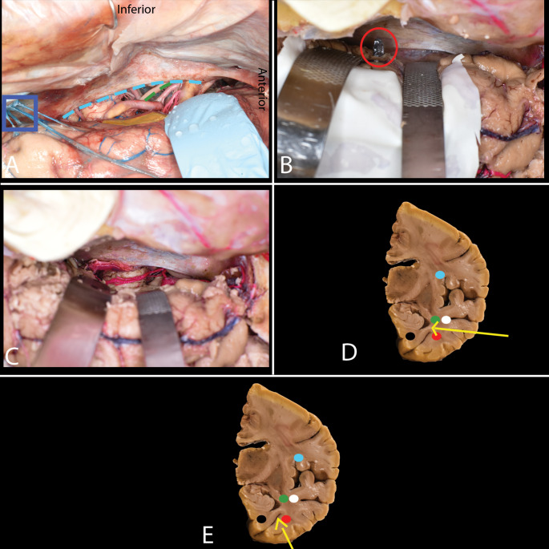
*Fig. 4. Subtemporal approach. A-E. A A retractor is placed under the brain, identifying the collateral sulcus. A cortical incision is made near the uncus (yellow), and care is taken to preserve... Source: [Anatomical considerations in selective amygdalohippocampectomy techniques for refractory temporal lobe epilepsy: a cadaveric study with emphasis on white matter tract anatomy](https://pmc.ncbi.nlm.nih.gov/articles/PMC11602787/) — Surgical and Radiologic Anatomy 2024; CC BY.*

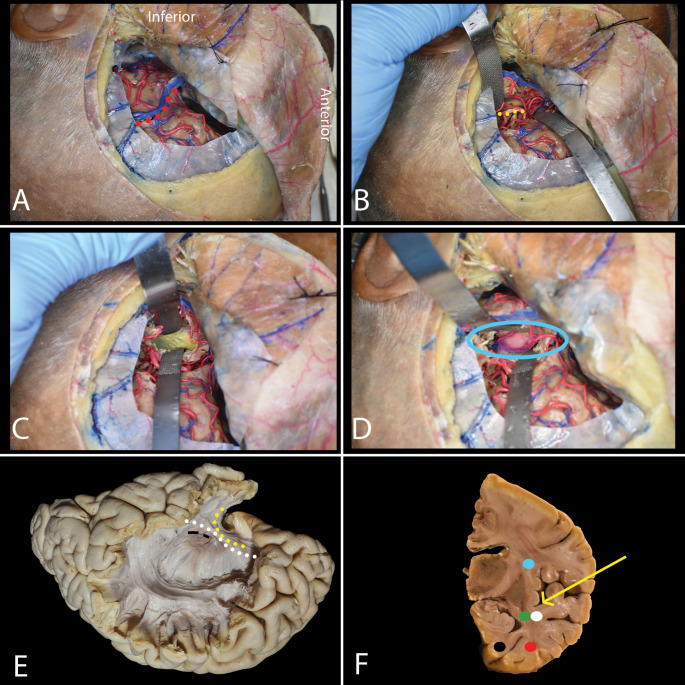
*Fig. 5. Transsylvian approach. A-E. A A pterional craniotomy is performed. The sylvian fissure (red dots) is opened from the internal carotid artery bifurcation to 2 cm beyond the MCA... Source: [Anatomical considerations in selective amygdalohippocampectomy techniques for refractory temporal lobe epilepsy: a cadaveric study with emphasis on white matter tract anatomy](https://pmc.ncbi.nlm.nih.gov/articles/PMC11602787/) — Surgical and Radiologic Anatomy 2024; CC BY.*

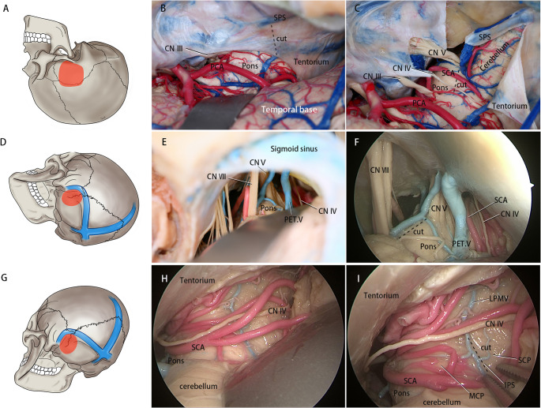
*Fig. 1. A-C Subtemporal Transtentorial Approach (A): Schematic of the Subtemporal Transtentorial Approach craniotomy bone flap. (B): Following elevation of the temporal base, the tentorium is... Source: [Analysis of Pontine cavernous malformation resection based on 3D microanatomical study](https://pmc.ncbi.nlm.nih.gov/articles/PMC12678574/) — Neurosurgical Review 2025; CC BY-NC-ND.*

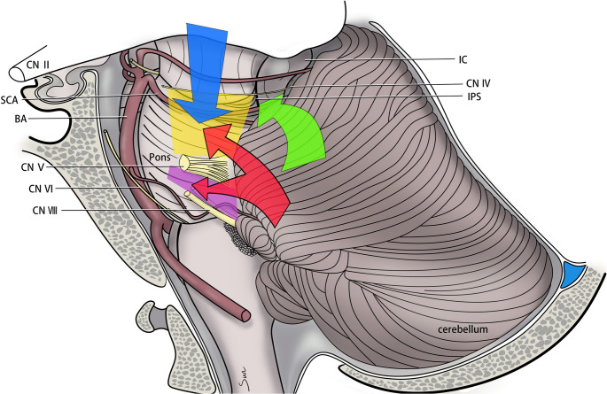
*Fig. 4. Exposure ranges of surgical approaches and safety entry zones (Yellow quadrilateral: Superior trigeminal quadrangular space. Purple quadrilateral: Inferior trigeminal quadrangular space.... Source: [Analysis of Pontine cavernous malformation resection based on 3D microanatomical study](https://pmc.ncbi.nlm.nih.gov/articles/PMC12678574/) — Neurosurgical Review 2025; CC BY-NC-ND.*

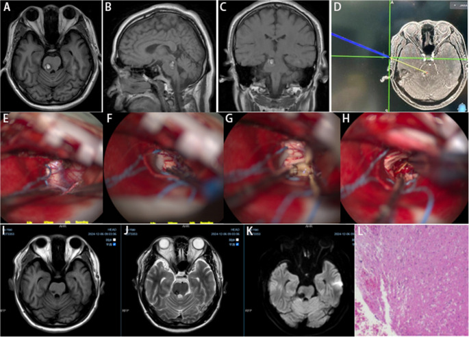
*Fig. 5. A-C Preoperative magnetic resonance imaging (MRI) demonstrates hemorrhagic stroke within the right PCMs. D Stereotactic guidance was employed to define the surgical trajectory. E-H A... Source: [Analysis of Pontine cavernous malformation resection based on 3D microanatomical study](https://pmc.ncbi.nlm.nih.gov/articles/PMC12678574/) — Neurosurgical Review 2025; CC BY-NC-ND.*

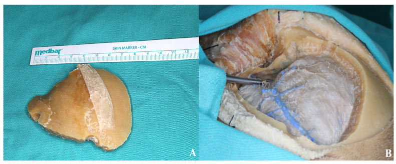
*Figure 6. (A) Bone flap. (B) The thinned sphenoid ridge is demonstrated following basal drilling with the aid of a dissector. Source: [Exploring the Lamina Terminalis: A Stepwise Anatomical Comparison of Pterional and Orbitozygomatic Craniotomy Approaches](https://pmc.ncbi.nlm.nih.gov/articles/PMC12733489/) — Life 2025; CC BY.*

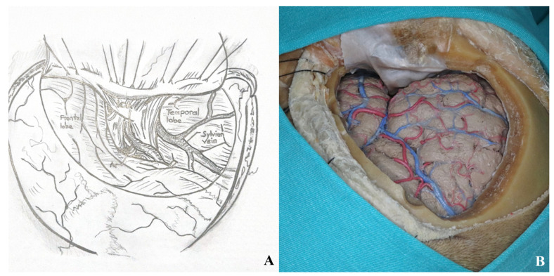
*Figure 7. After the dural incision was made, the dura was elevated and suspended. (A). Illustration, (B). Cadaver footage. Source: [Exploring the Lamina Terminalis: A Stepwise Anatomical Comparison of Pterional and Orbitozygomatic Craniotomy Approaches](https://pmc.ncbi.nlm.nih.gov/articles/PMC12733489/) — Life 2025; CC BY.*

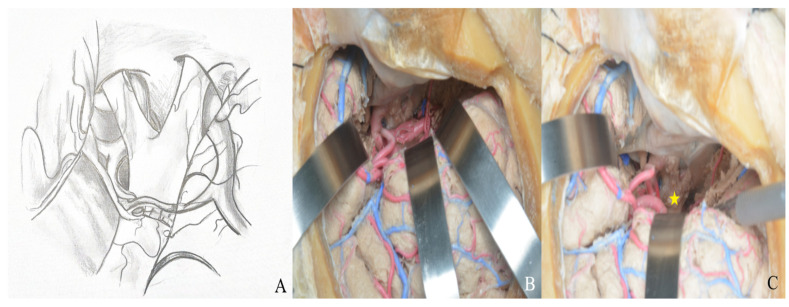
*Figure 8. (A) Exposure of the lamina terminalis. (B) After Sylvian fissure dissection, retractors provided access to the anterior and middle skull base. (C) The lamina terminalis cistern was... Source: [Exploring the Lamina Terminalis: A Stepwise Anatomical Comparison of Pterional and Orbitozygomatic Craniotomy Approaches](https://pmc.ncbi.nlm.nih.gov/articles/PMC12733489/) — Life 2025; CC BY.*

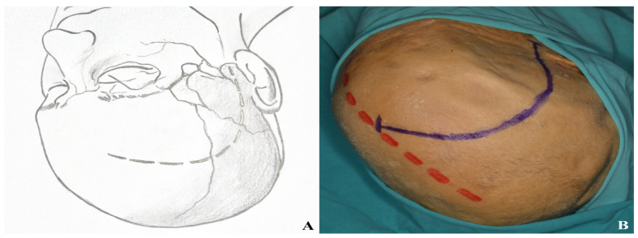
*Figure 9. Incision plan for the one-piece orbitozygomatic approach [(A) incision sketch, (B) cadaver view: red line indicating midline; blue line indicating incision]. Source: [Exploring the Lamina Terminalis: A Stepwise Anatomical Comparison of Pterional and Orbitozygomatic Craniotomy Approaches](https://pmc.ncbi.nlm.nih.gov/articles/PMC12733489/) — Life 2025; CC BY.*

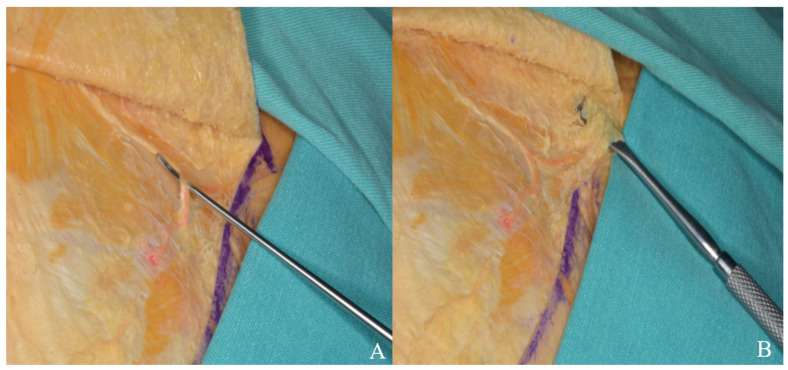
*Figure 10. The skin flap was retracted anteriorly, and the superficial temporal artery (A) and facial nerve branches (B) were carefully dissected and mobilized with a dissector. Source: [Exploring the Lamina Terminalis: A Stepwise Anatomical Comparison of Pterional and Orbitozygomatic Craniotomy Approaches](https://pmc.ncbi.nlm.nih.gov/articles/PMC12733489/) — Life 2025; CC BY.*

<!-- END CURATED IMAGE SET -->

---

## General Considerations
- **What it accesses:** the **tentorial incisura and its three cisternal compartments** (crural, ambient, interpeduncular) and the **lateral midbrain**; the **upper basilar** complex; Meckel's cave and the posterior cavernous sinus. With petrous apex drilling it crosses into the **petroclival** region.
- **The defining trade-off is temporal-lobe retraction.** Everything in this approach is organized around minimizing it: a craniotomy flush to the floor, gravity (lateral position), CSF drainage (lumbar drain), and — when needed — a zygomatic osteotomy. **The vein of Labbé is the anatomic limit**; its preservation governs how far posteriorly the temporal lobe may be elevated.
- **Extensions (know the ladder):**
  - **+ Zygomatic osteotomy** → temporalis drops inferiorly; less retraction, wider upward angle (useful for higher basilar apex).
  - **+ Anterior petrosectomy (Kawase/Glasscock-Kawase rhomboid)** → extradural drilling of the petrous apex medial to the IAC opens the petroclival junction and the **ventral pons / upper basilar trunk** with tentorial division.
  - **Combined petrosal / presigmoid** when the lesion spans the whole clivus (see [presigmoid-petrosal-approach.md](presigmoid-petrosal-approach.md)).

### Indications
- **Low-lying basilar apex / basilar trunk and SCA aneurysms** (an alternative/complement to [orbitozygomatic](orbitozygomatic-craniotomy.md)) → see [basilar-tip-aneurysm.md](../cranial-vascular/basilar-tip-aneurysm.md)
- **Petroclival meningioma** (anterior petrosectomy variant) → see [petroclival-meningioma.md](../cranial-tumor/petroclival-meningioma.md)
- **Trigeminal schwannoma / Meckel's cave** and posterior cavernous sinus lesions
- **Lateral mesencephalic / tentorial-incisural lesions** (e.g., midbrain cavernoma via the lateral mesencephalic sulcus), tentorial meningioma
- Selected **P2 PCA aneurysms**, tentorial dural fistulas

---

## Relevant Surgical Anatomy
- **Middle-fossa floor:** from lateral to medial — **foramen spinosum** (MMA), **foramen ovale** (V3), **arcuate eminence** (superior semicircular canal), **greater superficial petrosal nerve (GSPN)** running to the facial hiatus, and the **petrous ridge.**
- **Kawase's (Glasscock-Kawase) rhomboid / anterior petrosectomy triangle:** bounded by the **GSPN** (anterolateral), the **petrous ridge/superior petrosal sinus** (posterior), the **arcuate eminence** (posterolateral), and **V3 / the trigeminal porus** (anteromedial). Drilling this bone — *medial to the IAC and cochlea, above the petrous ICA, anterior to the labyrinth* — opens the petroclival window.
- **Tentorial incisura:** the free edge carries **CN IV** (enters the tentorium near the incisural apex — protect it during tentorial division), with **CN III** anteriorly at the interpeduncular cistern.
- **Vein of Labbé:** the dominant inferior anastomotic vein from the temporal lobe to the transverse sinus — sacrifice risks **temporal venous infarction and (dominant side) aphasia.**

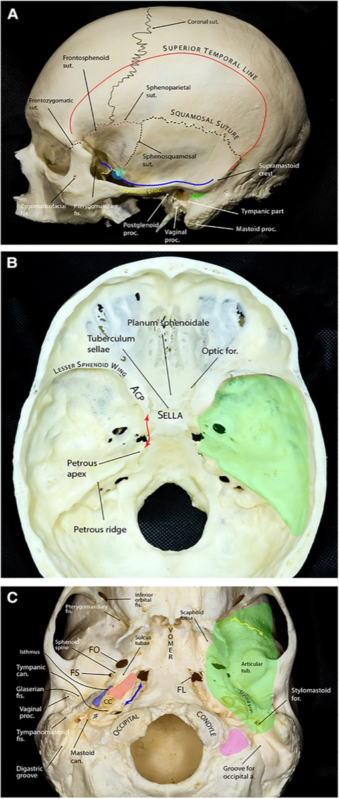

*Comprehensive microsurgical anatomy of the middle cranial fossa, Part I. Front Surg 2023;10:1132774 — CC BY 4.0.*

---

## Preoperative Evaluation
- **MRI/CISS** for the lesion and the incisural cisterns; **CTA/MRA** for vascular targets and basilar apex height relative to the posterior clinoid.
- **Thin-cut CT** of the petrous bone before any petrosectomy: position of the **cochlea, IAC, petrous ICA, and labyrinth**; degree of air-cell pneumatization (CSF-leak risk).
- **Vein of Labbé / venous anatomy** (MRV) — dominant drainage influences retraction strategy and side.
- Audiometry/facial baseline if petrous drilling is planned. Dominant-hemisphere considerations for retraction.

## Anesthesia & Neuromonitoring
- GA/TIVA; **lumbar drain** is commonly placed to relax the temporal lobe (drain after dura is opened to avoid herniation). SSEP/MEP, **BAER** and **facial EMG** for petrous work, CN III/IV/VI EMG as indicated; EEG/burst-suppression for temporary clipping. Normotension.

---

## Positioning

- **Lateral or supine with a large ipsilateral shoulder roll**, head in Mayfield, **turned ~90°** so the **middle-fossa floor is roughly horizontal (vertex slightly down)** — the temporal lobe then falls away from the floor by gravity, the single most effective way to limit retraction.
- The **lateral position** is favored for extensive work (gravity does more of the retraction); ensure the dependent shoulder/brachial plexus is protected and venous outflow is unobstructed.
- Slight neck extension brings the floor into view; confirm the zygoma is accessible if an osteotomy is planned.

## Incision & Soft Tissue

- A **question-mark or vertical/linear** temporal incision centered over the ear root and zygoma (a "T"-bar or reverse-question-mark for larger exposures). Stay above the arch anteriorly to protect the **facial nerve frontal branch** (interfascial dissection if the flap extends anteriorly — see [pterional](pterional-craniotomy.md)).
- Reflect temporalis inferiorly; for a **zygomatic osteotomy**, expose the arch subperiosteally and cut it (anterior and posterior) so the temporalis drops, opening a flat trajectory to the floor.

---

## Craniotomy

1. A **temporal craniotomy** centered low over the middle fossa; **rongeur/drill the inferior bone edge flush with the middle-fossa floor** — any residual bony lip forces additional temporal-lobe retraction and must be removed.
2. Wax exposed air cells. If a **zygomatic osteotomy** was done, the inferior trajectory is now flat.
3. For the **anterior petrosectomy** variant, elevate the **middle-fossa dura extradurally** from posterior to anterior (to avoid avulsing the GSPN and a dehiscent geniculate facial nerve), identify the landmarks, and drill **Kawase's rhomboid.**

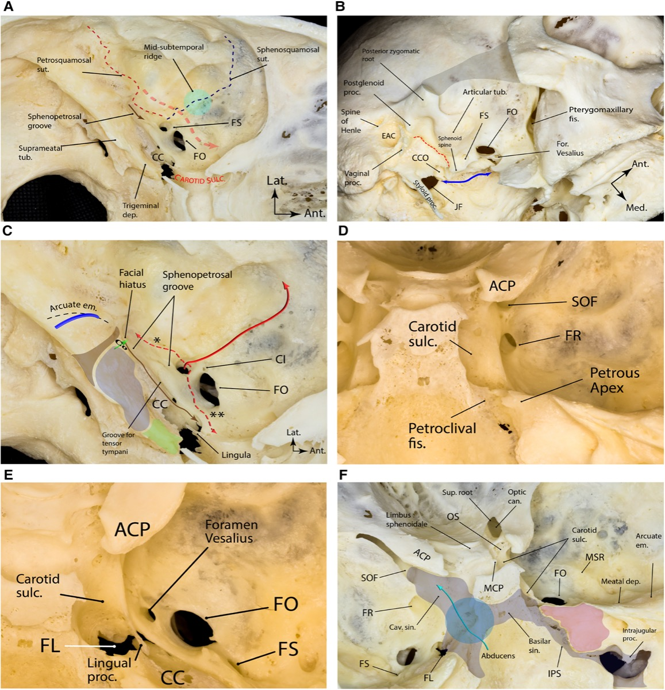

*Comprehensive microsurgical anatomy of the middle cranial fossa, Part I. Front Surg 2023;10:1132774 — CC BY 4.0. The anterior petrosectomy is drilled within this rhomboid, medial to the IAC/cochlea and above the petrous ICA.*

---

## Dural Opening & Intradural Work

1. Open the temporal dura based inferiorly; **elevate the temporal lobe gently** (after CSF egress via the lumbar drain) to reach the **tentorial edge.** **Identify and protect the vein of Labbé** — do not tether or sacrifice it.
2. Follow the free edge medially; **identify CN IV** entering the tentorium and **CN III** anteriorly. To open the posterior fossa, **place a tentorial-edge stitch and divide the tentorium behind the entry point of CN IV**, reflecting it to expose the **petroclival/upper-basilar** region.
3. Open the incisural cisterns sharply: the **crural and ambient cisterns** (P2/PCA, SCA, basal vein), and the **interpeduncular cistern** (basilar apex, P1, perforators, CN III). Proceed to lesion-specific steps (basilar apex clipping, petroclival tumor via the petrosectomy window, Meckel's cave/trigeminal schwannoma).
4. **Anterior petrosectomy completed:** with the rhomboid drilled and the superior petrosal sinus/tentorium divided, the **ventral pons and mid-upper clivus** come into view for petroclival lesions.

---

## Closure
- **Watertight dura** with graft as needed (the temporal floor and any petrous defect are leak-prone); **obliterate drilled petrous air cells with fat/wax** and reinforce with a vascularized flap (temporalis/pericranium) for petrosectomy defects.
- Replace the bone flap and **re-plate the zygomatic arch** anatomically if osteotomized. Reattach temporalis to limit hollowing/trismus. Lumbar drain managed per leak risk.

---

### Further operative anatomy & technique

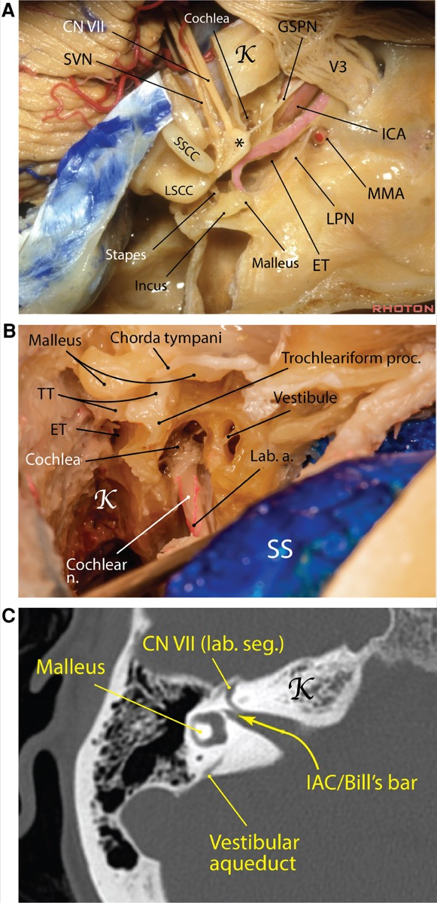

*Comprehensive microsurgical anatomy of the middle cranial fossa, Part I. Front Surg 2023;10:1132774 — CC BY 4.0.*

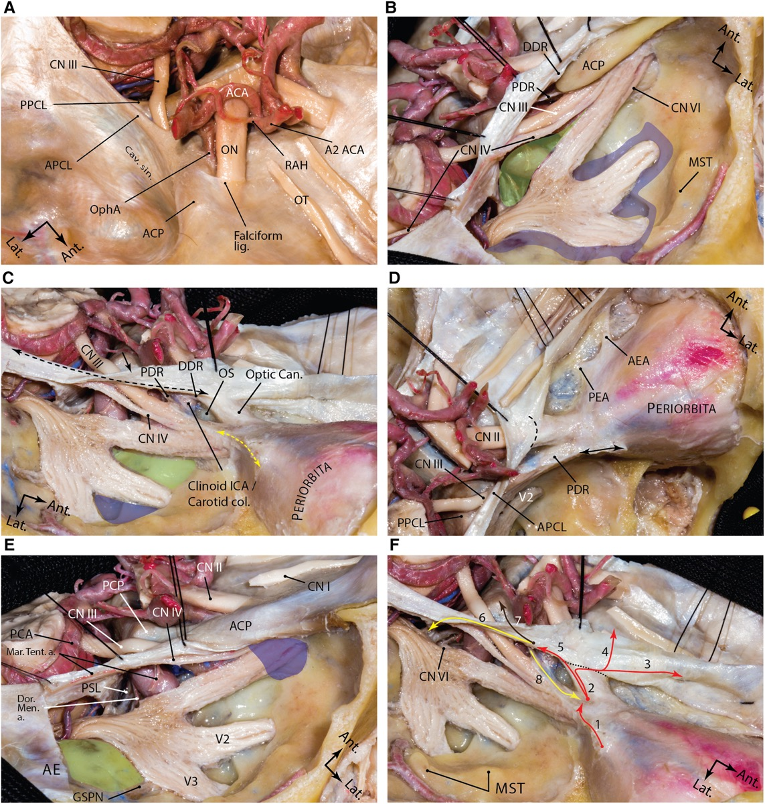

*Comprehensive microsurgical anatomy of the middle cranial fossa, Part I. Front Surg 2023;10:1132774 — CC BY 4.0.*

## Nuances & Pitfalls (surgeon-level)
- **The vein of Labbé is sacrosanct.** Plan the corridor anterior to it; if posterior reach is needed, mobilize rather than divide. Venous infarction is the signature catastrophic complication.
- **Take the bone to the floor.** The commonest technical error is leaving an inferior bony lip that converts a gravity approach into a retraction approach.
- **Lumbar drain *then* elevate.** Relax the temporal lobe with CSF before any retraction; intermittent (not fixed, prolonged) retraction limits contusion/aphasia.
- **Protect CN IV during tentorial division** — divide behind its tentorial entry and tag the edge.
- **Petrosectomy hazards:** the **petrous ICA** (below the GSPN — avulsing the GSPN can tear a dehiscent geniculate facial nerve or injure the ICA), the **cochlea** (at the GSPN–arcuate-eminence angle), and the **IAC/labyrinth.** Drill within the rhomboid under navigation and with facial/BAER monitoring.
- **Air cells = CSF leak.** Wax/fat-graft meticulously, especially after petrous drilling.
- **Decide on the zygomatic osteotomy up front** when the target is high (basilar apex above the posterior clinoid) — it buys upward angle without more brain retraction.

## Complications
Temporal-lobe contusion / **venous infarction (vein of Labbé) and aphasia**; CN III/IV palsy (diplopia); hearing loss/facial palsy and **petrous ICA injury** (petrosectomy); CSF leak; seizures; vascular/perforator injury at the basilar apex; trismus/temporal hollowing; infection.

---

## Cross-links
- Related corridors: [orbitozygomatic-craniotomy.md](orbitozygomatic-craniotomy.md) · [presigmoid-petrosal-approach.md](presigmoid-petrosal-approach.md) · [pterional-craniotomy.md](pterional-craniotomy.md)
- Pathology: [basilar-tip-aneurysm.md](../cranial-vascular/basilar-tip-aneurysm.md) · [petroclival-meningioma.md](../cranial-tumor/petroclival-meningioma.md)

## References
1. Kawase T, Toya S, Shiobara R, Mine T. **Transpetrosal approach for aneurysms of the lower basilar artery.** *J Neurosurg.* 1985;63(6):857–861.
2. Kawase T, Shiobara R, Toya S. **Anterior transpetrosal-transtentorial approach for sphenopetroclival meningiomas.** *Neurosurgery.* 1991;28(6):869–876.
3. Day JD, Fukushima T, Giannotta SL. **Cranial base approaches to posterior circulation aneurysms.** *J Neurosurg.* 1997.
4. **Comprehensive microsurgical anatomy of the middle cranial fossa: Part I — Osseous and meningeal anatomy.** *Front Surg.* 2023;10:1132774. CC BY 4.0. (figures embedded above)
5. Rhoton AL Jr. *The tentorial incisura* and *The middle cranial fossa.* Neurosurgery (Rhoton anatomy series).
6. Cohen-Gadol AA. *Temporal/Subtemporal Craniotomy.* The Neurosurgical Atlas. [link](https://www.neurosurgicalatlas.com/volumes/cranial-approaches/temporal-subtemporal-craniotomy)
