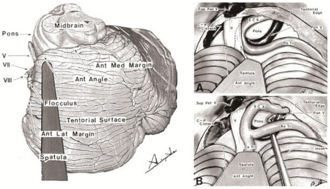
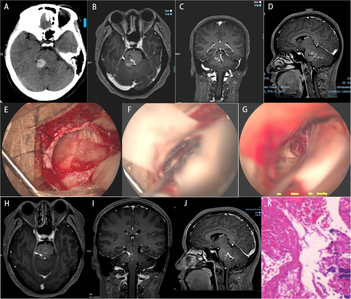
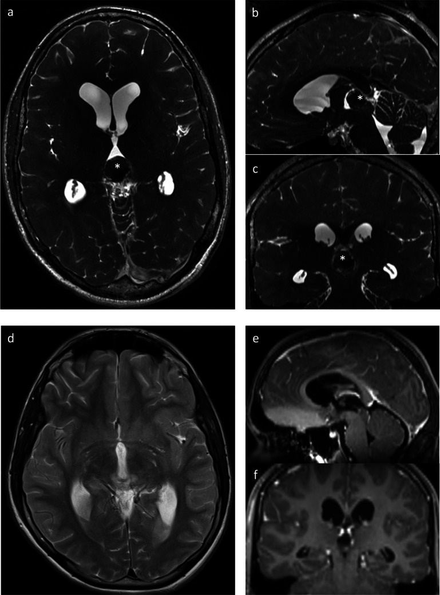
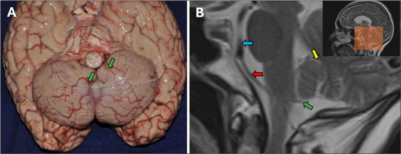
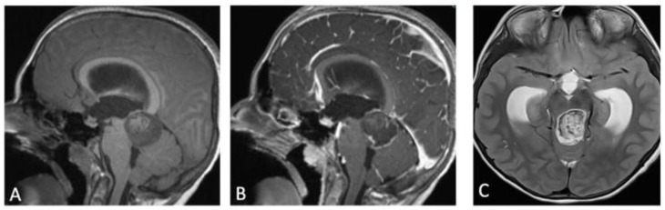
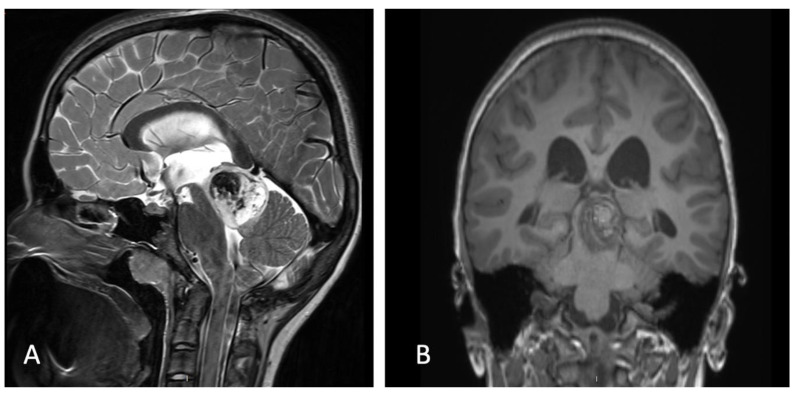
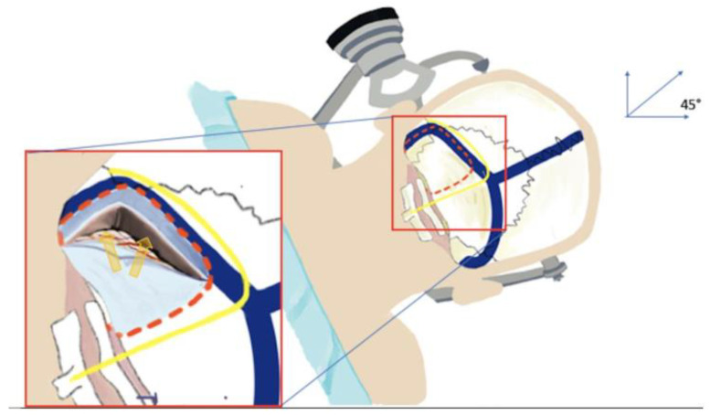
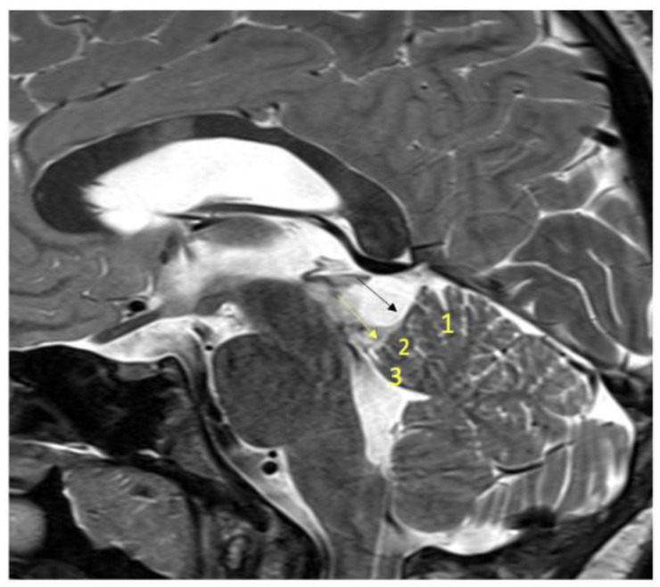
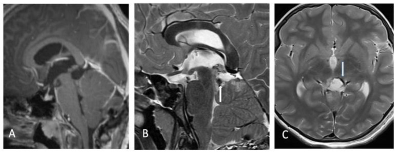
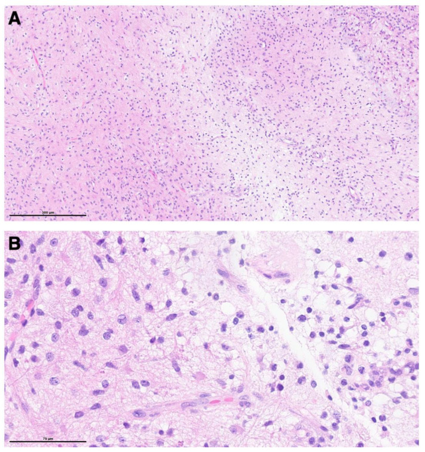

# Operative Approach: Supracerebellar Infratentorial (Krause)

<!-- BEGIN CASE SNAPSHOT -->

## Case / Approach Snapshot

- **Anatomy at risk:** corridor-defining nerves, arteries, veins/sinuses, cisterns, bone landmarks, muscle/fascial planes, and closure structures that determine exposure and morbidity.
- **Operative steps:** confirm position and trajectory, mark landmarks, protect soft tissue and named neurovascular structures, perform the bone/soft-tissue corridor, open/close dura or target compartment deliberately, and verify hemostasis/reconstruction; use the detailed operative sequence and approach notes below as the step-by-step source.
- **Rescue plans:** brain relaxation failure, venous or sinus bleeding, cranial nerve/perforator risk, exposure that is too narrow, CSF leak, cosmetic/temporalis/frontalis problems, and conversion to a wider or alternate corridor.
- **Figures:** review [Figures, Imaging & Video](#figures-imaging--video) and the [Curated Image Set](#curated-image-set); embedded local figures should remain open-access, public-domain, or otherwise reusable with attribution.
- **Papers:** review [High-Yield Literature](#high-yield-literature) for seminal sources, modern reviews, and outcome data specific to this page.
- **Textbook cross-checks:** use [Textbook Cross-Checks](#textbook-cross-checks) and the [Source Crosswalk](../../resources/source-crosswalk.md) to cite copyrighted textbooks/atlases while summarizing in original words.

<!-- END CASE SNAPSHOT -->

> **About the figures.** Copyrighted operative figures and videos are **linked** (Neurosurgical Atlas, Rhoton collection); embedded images are **public-domain** (Gray's Anatomy) or **Creative Commons CC-BY** (open-access cadaveric anatomy), each credited beneath the image. See [media-sources.md](../../resources/media-sources.md) and [figures/CREDITS.md](../../figures/CREDITS.md).
>
> **Atlas chapters & video:** [Supracerebellar Infratentorial Approach — Neurosurgical Atlas](https://www.neurosurgicalatlas.com/volumes/pineal-region/supracerebellar-infratentorial-craniotomy) · [Pineal Region Surgery](https://www.neurosurgicalatlas.com/volumes/pineal-region) · [Anatomy of the Pineal Region (Rhoton)](https://www.neurosurgicalatlas.com/neuroanatomy/the-pineal-region)

The supracerebellar infratentorial approach is the **primary corridor to the pineal region, posterior third ventricle, and quadrigeminal cistern.** First described by Krause (1926) and refined by Stein (1971), it exploits the natural plane between the tentorial undersurface and the cerebellar apex — using gravity to retract the cerebellum away from the tentorium rather than transgressing cerebral cortex to reach deep midline structures. Its chief advantage over supratentorial alternatives (occipital transtentorial, interhemispheric transcallosal) is that it avoids cortical manipulation and reaches the pineal from below, where bridging veins are fewer and the critical deep venous system sits *above* the surgical corridor.

---

## Figures, Imaging & Video

**🎥 Operative video** — [search operative video on YouTube ▸](https://www.youtube.com/results?search_query=pineal+region+surgery) · [The Neurosurgical Atlas ▸](https://www.neurosurgicalatlas.com)

[Neurosurgical Atlas — Supracerebellar Infratentorial](https://www.neurosurgicalatlas.com/volumes/pineal-region/supracerebellar-infratentorial-craniotomy) · [Rhoton Pineal Region Anatomy (PMC)](https://www.ncbi.nlm.nih.gov/pmc/?term=rhoton+pineal+region+anatomy) · [Radiopaedia — Pineal Region](https://radiopaedia.org/search?q=pineal+region&scope=all) · [PubMed Central — supracerebellar infratentorial](https://www.ncbi.nlm.nih.gov/pmc/?term=supracerebellar+infratentorial+approach)

---

<!-- BEGIN TEXTBOOK CROSS-CHECKS -->

## Textbook Cross-Checks

- **Microsurgical corridor anatomy:** Rhoton Cranial Anatomy; Brain Anatomy and Neurosurgical Approaches; Youmans and Winn — confirm surface landmarks, bone-removal limits, cisternal/venous relationships, and the named neurovascular structures that define the working corridor.
- **Technique sequence:** Schmidek and Sweet; Youmans and Winn; Neurosurgical Atlas chapter links — review positioning, incision, soft-tissue handling, bone work, dural opening, and intradural exposure sequence.
- **Complication avoidance:** Rhoton; Greenberg; approach-specific operative references — cross-check cranial nerve, venous, sinus, perforator, CSF-leak, and cosmetic risks before committing to the corridor.
- **Copyright-safe use:** cite these sources as private cross-checks, then write the guide content in original words; do not re-host textbook pages, figures, tables, or board-review card material. See [Source Crosswalk & Copyright-Safe Use](../../resources/source-crosswalk.md).

<!-- END TEXTBOOK CROSS-CHECKS -->

<!-- BEGIN CURATED LITERATURE -->

## High-Yield Literature

- **[Microsurgical anatomy and clinical application of infratentorial supracerebellar keyhole approach]** — Lan Q. Zhonghua yi xue za zhi 2009. [PubMed](https://pubmed.ncbi.nlm.nih.gov/19537028/)
- **Endoscopic Far-Lateral Supracerebellar Infratentorial Approach for Petroclival Region Meningioma: Surgical Technique and Clinical Experience** — Xie T. Operative neurosurgery (Hagerstown, Md.) 2022. [PubMed](https://pubmed.ncbi.nlm.nih.gov/35315837/)
- **Microsurgical anatomy and surgical exposure of the cerebellar peduncles** — Baran O. Neurosurgical review 2022. [PubMed](https://pubmed.ncbi.nlm.nih.gov/34997381/)
- **The microsurgical anatomy of the infratentorial lateral supracerebellar approach to the trigeminal nerve for tic douloureux** — Matsushima T. Neurosurgery 1989. [PubMed](https://pubmed.ncbi.nlm.nih.gov/2747863/)
- **Supracerebellar-supratrochlear and supracerebellar-infratrochlear triangles as gateways to the posterolateral midbrain and ambient cistern: descriptive and quantitative analysis of microsurgical anatomy** — Hanalioglu S. Neurosurgical review 2025. [PubMed](https://pubmed.ncbi.nlm.nih.gov/40668419/)
- **The microsurgical infratentorial supracerebellar approach for lesions of the pineal gland: feasibility, morbidity, and functional outcomes from a single-center experience** — Ahmed M. Neurosurgical review 2025. [PubMed](https://pubmed.ncbi.nlm.nih.gov/39883229/)
- **Unedited pineal cyst microneurosurgery** — Choque-Velasquez J. Surgical neurology international 2018. [PubMed](https://pubmed.ncbi.nlm.nih.gov/30687572/)
- **Midline and Paramedian Supracerebellar Infratentorial Approach to The Pineal Region: A Comparative Clinical Study in 112 Patients** — Choque-Velasquez J. World neurosurgery 2020. [PubMed](https://pubmed.ncbi.nlm.nih.gov/32001412/)
- **Supracerebellar-supratrochlear and infratentorial-infratrochlear approaches: gravity-dependent variations of the lateral approach over the cerebellum** — Sanai N. Neurosurgery 2010. [PubMed](https://pubmed.ncbi.nlm.nih.gov/20489515/)
- **Endoscopic supracerebellar infratentorial approach to pineal and posterior third ventricle lesions in prone position with head extension: a technical note** — Spazzapan P. Neurological research 2020. [PubMed](https://pubmed.ncbi.nlm.nih.gov/32892737/)

<!-- END CURATED LITERATURE -->

---

<!-- BEGIN CURATED IMAGE SET -->

## Curated Image Set

Open-access figures are embedded from PubMed Central articles and kept unique to this guide.

*Fig. 4. Lateral supracerebellar-infratentorial route for TN. Tailored exposure along the tentorial surface provides a direct view of the trigeminal nerve while minimizing cerebellar retraction... Source: [Historical evolution of microvascular decompression after Jannetta’s establishment: Anatomical maps and physiological compasses—a narrative review](https://pmc.ncbi.nlm.nih.gov/articles/PMC12999832/) — Acta Neurochirurgica 2026; CC BY-NC-ND.*

*Fig. 7. A-D Preoperative CT and MRI demonstrate right-sided multiple PCMs, with hemorrhagic stroke in the dorsolateral pontine CMs. E-F Utilizing a right extreme lateral supracerebellar... Source: [Analysis of Pontine cavernous malformation resection based on 3D microanatomical study](https://pmc.ncbi.nlm.nih.gov/articles/PMC12678574/) — Neurosurgical Review 2025; CC BY-NC-ND.*

*Fig. 3. Pre (a-c) and postoperative (d-f) MRI imaging of a hemorrhaged pineal cyst (white *) and consecutive aqueduct stenosis with hydrocephalus occlusus removed by microscopic approach via a... Source: [Comparison of surgical approaches and outcome for symptomatic pineal cysts: microscopic/endoscopic fenestration vs. stereotactic catheter implantation](https://pmc.ncbi.nlm.nih.gov/articles/PMC11785698/) — Acta Neurochirurgica 2025; CC BY.*

*Figure 14:. (A) Basal view of the cerebrum. The posterior cerebellomedullary cistern lies dorsal to the bulb and cerebellar vermis and is divided by the PICA membranes into one medial compartment... Source: [Subarachnoid cisterns as surgical corridors: Integrating microsurgical anatomy and neuroimaging for intracranial navigation](https://pmc.ncbi.nlm.nih.gov/articles/PMC13224219/) — Surgical Neurology International 2026; CC BY-NC-SA.*

*Figure 1. (A) T1-weighted MRI sagittal image showing a mass centered on superior cerebellar peduncle, spontaneously iso-intense. (B) Contrast enhanced T1 sagittal MRI showing peripheral... Source: [Endoscope-Assisted Extreme Lateral Supracerebellar Infratentorial Approach for Resection of Superior Cerebellar Peduncle Pilocytic Astrocytoma: Technical Note](https://pmc.ncbi.nlm.nih.gov/articles/PMC9140165/) — Children 2022; CC BY.*

*Figure 2. (A) Post-ETV CISS MRI showing patent stoma and regression of hydrocephalus. (B) Coronal T1-weighted MRI showing a well localized mass on the SCP. Source: [Endoscope-Assisted Extreme Lateral Supracerebellar Infratentorial Approach for Resection of Superior Cerebellar Peduncle Pilocytic Astrocytoma: Technical Note](https://pmc.ncbi.nlm.nih.gov/articles/PMC9140165/) — Children 2022; CC BY.*

*Figure 3. Artist work showing the appropriate head positioning. The head is slightly flexed and turned 45° towards the floor in order to place the genu of the sigmoid sinus at the highest point of... Source: [Endoscope-Assisted Extreme Lateral Supracerebellar Infratentorial Approach for Resection of Superior Cerebellar Peduncle Pilocytic Astrocytoma: Technical Note](https://pmc.ncbi.nlm.nih.gov/articles/PMC9140165/) — Children 2022; CC BY.*

*Figure 4. T2-weighted MRI showing the following:(1:)culmen; (2) central lobule; (3) lingula; black arrow: the preculminate sulcus between the culmen and central lobule; yellow arrow: precentral... Source: [Endoscope-Assisted Extreme Lateral Supracerebellar Infratentorial Approach for Resection of Superior Cerebellar Peduncle Pilocytic Astrocytoma: Technical Note](https://pmc.ncbi.nlm.nih.gov/articles/PMC9140165/) — Children 2022; CC BY.*

*Figure 5. Immediate post-operative MRI (A) sagittal contrast enhanced, (B) T2 sagittal and (C) T2 axial showing near complete resection with a residual tumor on the latero-inferior surface of the... Source: [Endoscope-Assisted Extreme Lateral Supracerebellar Infratentorial Approach for Resection of Superior Cerebellar Peduncle Pilocytic Astrocytoma: Technical Note](https://pmc.ncbi.nlm.nih.gov/articles/PMC9140165/) — Children 2022; CC BY.*

*Figure 6. Histological analysis showed a moderately cellular glial neoplasm with biphasic growth pattern (A), characterized by tumor cells with bipolar processes and the presence of occasional... Source: [Endoscope-Assisted Extreme Lateral Supracerebellar Infratentorial Approach for Resection of Superior Cerebellar Peduncle Pilocytic Astrocytoma: Technical Note](https://pmc.ncbi.nlm.nih.gov/articles/PMC9140165/) — Children 2022; CC BY.*

<!-- END CURATED IMAGE SET -->

---

## General Considerations

- **What it accesses:** the pineal gland, quadrigeminal plate (superior and inferior colliculi), posterior third ventricle roof, velum interpositum, and the tentorial undersurface — essentially everything in the "triangle" bounded by the splenium above, the tentorium laterally, and the cerebellar vermis below.
- **Core principle (Krause's concept):** with the patient positioned so the tentorium is horizontal or slopes upward, gravity pulls the cerebellar surface downward and opens a natural corridor along the tentorial undersurface. No fixed retractor on the cerebellum is needed in most cases — CSF release and gravity do the work.
- **Why not go from above?** Supratentorial routes (occipital transtentorial, posterior interhemispheric transcallosal) require occipital lobe retraction or callosotomy, risk visual-field deficits, and approach the tumor *through* the deep venous system. The infratentorial route comes from below, keeping the vein of Galen and internal cerebral veins in the ceiling of the corridor — visible and protected rather than obscured by the tumor.
- **Limits of the approach:** the working angle is steep and narrow; very large tumors (>3-4 cm), tumors extending laterally into the middle fossa, or tumors with significant supratentorial extension may require a combined or alternative approach.

### Indications
- Pineal region tumors: pineocytoma, pineoblastoma, pineal parenchymal tumors of intermediate differentiation
- Pineal germ cell tumors (germinoma, teratoma, mixed GCT) — biopsy or resection after marker/imaging workup
- Tectal plate gliomas — stereotactic or open biopsy when tissue is needed
- Posterior third ventricle tumors (meningioma, ependymoma)
- Tentorial meningiomas (posterior/falcotentorial) with infratentorial bulk
- Vein of Galen malformations (surgical component, selected cases)
- Quadrigeminal cistern arachnoid cysts and epidermoids

### Relative Limitations
- Very large tumors (>4 cm) with supratentorial extension — consider occipital transtentorial or combined approach
- Tumors extending anterior to the third ventricle or into the lateral ventricles
- Steep tentorial angle in some patients limits the superior reach of the corridor
- The sitting position carries venous air embolism risk (see below)

---

## Preoperative Evaluation

- **MRI (critical sequences):**
  - **Sagittal T1 with gadolinium** — defines tumor relationship to the vein of Galen, internal cerebral veins, and splenium; shows the tentorial angle and available working corridor
  - **MR venogram (MRV)** — maps the deep venous system (vein of Galen, basal veins of Rosenthal, internal cerebral veins, straight sinus); identifies dominant drainage and any venous encasement
  - **Axial/coronal T2 and FLAIR** — tumor extent, tectal compression, aqueductal patency
- **CT head** — assess for hydrocephalus (aqueductal obstruction is common with pineal tumors); calcification pattern may suggest tumor histology (dense calcification in pineoblastoma, "exploded" calcification in germinoma)
- **Serum and CSF tumor markers** — AFP and beta-HCG before any surgical manipulation; elevated markers may diagnose a germ cell tumor and obviate biopsy in favor of chemoradiation
- **CSF cytology** via lumbar puncture (if safe) — staging for drop metastases
- **Hydrocephalus management:** an EVD or endoscopic third ventriculostomy (ETV) may be required before definitive surgery; ETV can be performed at the same sitting through a separate approach or as a staged procedure
- **Stealth/neuronavigation** — register with volumetric MRI; particularly useful for planning the craniotomy extent and confirming trajectory to the lesion

## Anesthesia & Neuromonitoring

- GA with total intravenous anesthesia; **no long-acting paralytic** if motor monitoring is planned
- **Monitoring:** SSEP and MEP (proximity to tectum and cerebral peduncles); BAER if the approach extends laterally near CN IV or the brainstem
- **If sitting position is used:** precordial Doppler, end-tidal CO2 monitoring, right-atrial catheter for VAE detection/aspiration; **pre-op echocardiogram to exclude a patent foramen ovale (PFO)** — a PFO is a relative contraindication to the sitting position
- EVD should be available intraoperatively for CSF drainage and ICP management

---

## Relevant Surgical Anatomy

**Tentorium cerebelli (the ceiling).**
The tentorium forms the roof of the posterior fossa and the upper boundary of this approach. The **straight sinus** runs in the junction of the falx cerebri and tentorium along the midline. The **transverse sinuses** run laterally in the tentorial attachment to the occipital bone. The **tentorial edge (free margin)** curves anteromedially around the midbrain. Bridging veins from the cerebellar surface cross the subdural space to enter the tentorium and transverse sinuses — these are the structures at risk during the approach.

**Cerebellar surface (the floor).**
The superior vermis — specifically the **culmen** and **declive** — forms the working surface. The **precentral cerebellar vein** runs in the precentral cerebellar fissure (between the lingula and the central lobule) and drains into the vein of Galen; it is the most consistent venous landmark on the superior vermian surface and should be preserved when possible.

**Deep venous system (the "no-fly zone").**
- **Internal cerebral veins (ICVs)** — paired veins running in the velum interpositum (roof of the third ventricle), converging posteriorly
- **Basal veins of Rosenthal** — sweep around the midbrain to join the vein of Galen
- **Vein of Galen (great cerebral vein)** — formed by confluence of the ICVs and basal veins; runs posteriorly beneath the splenium to join the **straight sinus** at the **confluence of sinuses (torcula)**
- These veins sit *above* and *behind* the pineal — in the supracerebellar infratentorial corridor they are in the ceiling and should be visible throughout dissection. Injury to any of these structures can cause devastating venous infarction.

**Pineal region (the target).**
- **Pineal gland** — a midline structure at the posterosuperior margin of the third ventricle, below the splenium and between the superior colliculi
- **Quadrigeminal plate** — the **superior colliculi** (visual reflexes) and **inferior colliculi** (auditory relay) form the tectal surface of the midbrain, immediately ventral to the pineal
- **Posterior commissure** — white matter tract at the dorsal midbrain-diencephalic junction, just rostral to the pineal; injury causes Parinaud syndrome (upgaze palsy)
- **Splenium of the corpus callosum** — the thick posterior end of the callosum arching over the pineal; defines the superior limit of the corridor
- **Velum interpositum** — the double layer of tela choroidea forming the roof of the third ventricle, containing the ICVs; opening it accesses the posterior third ventricle
- **Third ventricle (posterior roof)** — lies deep to the velum interpositum; tumors here may be accessed by opening the velum between the ICVs

---

## Positioning

Several positions achieve the same goal — **the tentorium horizontal or sloping upward** so that gravity retracts the cerebellum away from the tentorial undersurface:

- **Sitting (Krause's original position, selected centers):** the patient sits with the head flexed and fixed in Mayfield pins. *Advantages:* gravity provides excellent cerebellar relaxation, the surgical field is clean (blood and CSF drain away from the operative site), and the working angle to the pineal is the most direct. *Disadvantages:* risk of **venous air embolism (VAE)** is highest (2-10% in published series); requires PFO screening, precordial Doppler, right-atrial catheter, and an experienced anesthesia team. Hypotension and pneumocephalus are additional concerns.
- **Concorde (prone with head flexed):** the patient lies prone with the head flexed in pins, the face angled toward the floor (the "Concorde" or "praying" position). *Advantages:* VAE risk is substantially lower than sitting; the surgeon can work comfortably at the microscope. *Disadvantages:* venous engorgement from neck flexion can increase bleeding; the cerebellar relaxation is less than in the sitting position but usually adequate with CSF drainage.
- **Lateral park-bench:** the patient lies on one side with the head flexed and slightly rotated. *Advantages:* familiar to most surgeons, good venous drainage, lower VAE risk than sitting. *Disadvantages:* the midline corridor is slightly angled; better suited for the **paramedian** variant of the approach.

Pin placement: the single pin sits contralateral and posterior; the two-pin arm is ipsilateral, above the ear and at the forehead. **Confirm that neck flexion does not compress the jugular veins** (at least two fingerbreadths chin-to-sternum). Protect eyes and all pressure points.

---

## Step-by-Step Technique

1. **Incision and exposure:** a **midline linear incision** from just above the inion to C2, or a **hockey-stick incision** curving laterally at the superior end. Subperiosteal dissection exposes the suboccipital bone from one transverse sinus to the other. Identify the **inion, superior nuchal lines, and the external occipital protuberance** as landmarks.

2. **Suboccipital craniotomy:** place burr holes bilaterally below the transverse sinuses and at the midline (avoiding the torcula). Turn a craniotomy flap that exposes the **inferior edge of both transverse sinuses** and the **torcula Herophili** — the superolateral extent of bone removal is the most important determinant of the available working corridor. The craniotomy should extend laterally enough to see both transverse sinuses (typically 4-5 cm wide, 3-4 cm tall). Use a diamond burr to thin bone over the sinuses before elevating the flap. Wax all open diploic veins.

3. **Dural opening:** open the dura in a **Y-shaped or cruciate flap** with the superior limbs based along the transverse sinuses. Tack the dural flaps superiorly to the bone edge or transverse sinus periosteum — this pulls the tentorium slightly upward and widens the corridor. Immediately release CSF from the **quadrigeminal and cerebellomesencephalic cisterns** to relax the cerebellum.

4. **Microsurgical corridor — bridging veins:** identify the **bridging veins** running from the cerebellar surface to the tentorium and transverse sinuses. These are variable in number (typically 3-8); **preserve as many as possible**, but 1-2 laterally placed veins can be coagulated and divided if they tether the cerebellum and prevent it from falling away. Midline bridging veins (especially the precentral cerebellar vein) should be preserved.

5. **Arachnoid dissection:** under the operating microscope, open the arachnoid over the superior cerebellar surface and work anteriorly and superiorly along the tentorial undersurface. The cerebellum falls with gravity; gentle dynamic retraction with a cottonoid-padded suction suffices. Dissect into the **quadrigeminal cistern**, identifying the **superior and inferior colliculi** on the tectal surface.

6. **Identification of deep veins and tumor:** as the dissection deepens, the **precentral cerebellar vein** comes into view, followed by the **vein of Galen** and the **internal cerebral veins** in the roof of the corridor. The tumor is typically visible between the colliculi below and the deep venous system above. Define the tumor-vein interface meticulously — the plane between tumor capsule and vein of Galen/ICVs must be developed with sharp dissection under high magnification.

7. **Tumor removal:** internally debulk the tumor (ultrasonic aspirator, bipolar/suction), then dissect the capsule away from surrounding structures. The order of dissection: free the inferior pole from the tectum, then the lateral margins, then carefully separate the superior pole from the deep veins. **Preserve the posterior commissure** (rostral to the tumor) to avoid Parinaud syndrome. For tumors extending into the third ventricle, the velum interpositum can be opened between the ICVs.

8. **Closure:** meticulous hemostasis. Watertight dural closure with running suture and a pericranial or fascial graft if needed. Replace the bone flap. Reapproximate the suboccipital musculature and fascia in layers. Standard skin closure.

---

## Key Pitfalls & Bailouts

- **Venous air embolism (sitting position).** The head is above the heart; open venous sinuses or cortical veins entrain air. *Prevention:* PFO screening, PEEP, meticulous waxing of bone edges and venous hemostasis, precordial Doppler and ETCO2 monitoring. *Rescue:* flood the field with saline/wet Gelfoam, lower the head, aspirate air through the right-atrial catheter, left lateral decubitus if cardiovascular collapse.
- **Injury to the vein of Galen or internal cerebral veins.** Catastrophic venous infarction of the thalami and deep hemispheric white matter — often fatal or devastating. *Prevention:* never dissect blindly at the superior pole; identify the veins early and keep them in the ceiling of the corridor; use sharp dissection, not blunt stripping.
- **Steep angle and limited visualization.** The supracerebellar corridor is narrow and deep. *Solutions:* maximize bone removal superiorly (expose the transverse sinuses fully), use the paramedian variant for laterally placed tumors, consider 30-degree endoscope assistance for "around the corner" views.
- **Cerebellar swelling.** Can occur from venous congestion (excessive bridging vein sacrifice, neck flexion compressing jugular veins) or prolonged retraction. *Prevention:* limit bridging vein sacrifice, confirm jugular patency during positioning, rely on gravity rather than fixed retractors.
- **Parinaud syndrome.** Upgaze palsy from injury to the posterior commissure or pretectal area. Often present preoperatively from tumor compression; new-onset postoperative Parinaud suggests surgical traction on the dorsal midbrain. Usually improves over weeks to months.

---

## Variants

- **Median vs. paramedian:** the classic (median) approach splits the corridor along the midline vermis; the **paramedian** variant enters lateral to the vermis and provides a more lateral trajectory — preferred for tumors eccentric to one side, tentorial meningiomas, or lesions extending toward the ambient cistern.
- **Sitting vs. prone position debate:** most high-volume pineal centers have moved to the **prone/Concorde position** as the default, reserving sitting for complex re-operations or surgeons experienced with VAE management. The prone position offers comparable visualization with substantially lower anesthetic risk.
- **Extreme lateral supracerebellar infratentorial (Matsushima):** a laterally extended variant that accesses the ambient cistern, the cerebellopontine angle from above, and petroclival/tentorial lesions. The patient is positioned lateral or park-bench; the approach passes lateral to the vermis and along the tentorial surface toward the tentorial edge.
- **Combined supracerebellar infratentorial + occipital transtentorial:** for large tumors with both infratentorial and supratentorial components, the tentorium can be divided (after confirming the venous anatomy) to combine the infratentorial and supratentorial corridors into a single expanded exposure.

---

## Complications
- Venous air embolism (sitting position) and tension pneumocephalus
- Injury to the deep venous system (vein of Galen, ICVs, basal veins) — venous infarction
- Parinaud syndrome (upgaze palsy) from posterior commissure/pretectal injury
- Cerebellar injury, edema, or hemorrhage from retraction or bridging vein sacrifice
- Hydrocephalus (persistent or new — from aqueductal manipulation or blood products)
- CSF leak, pseudomeningocele, meningitis, wound infection
- Brainstem injury (tectum, periaqueductal gray)

---

## Cross-links
- Tumors: [pineal-region-tumor.md](../cranial-tumor/pineal-region-tumor.md) · [posterior-fossa-tumor.md](../cranial-tumor/posterior-fossa-tumor.md)
- Related corridors: [midline-suboccipital-craniotomy.md](midline-suboccipital-craniotomy.md) · [retrosigmoid-craniotomy.md](retrosigmoid-craniotomy.md) · [far-lateral-craniotomy.md](far-lateral-craniotomy.md)

## References
1. Krause F. *Operative Freilegung der Vierhugel, nebst Beobachtungen uber Hirndruck und Dekompression.* Zentralbl Chir. 1926;53:2812-2819.
2. Stein BM. *The infratentorial supracerebellar approach to pineal lesions.* J Neurosurg. 1971;35(2):197-202.
3. Rhoton AL Jr. *The cerebellar arteries and veins and the cerebellopontine angle.* Neurosurgery. 2000;47(3 Suppl):S29-S68.
4. Matsushima T, et al. *The extreme lateral supracerebellar infratentorial approach to the pineal region.* J Neurosurg. 2014;121:1-6.
5. Hernesniemi J, et al. *Supracerebellar infratentorial approach: principles and surgical technique.* In: Pineal Region Tumors: Diagnosis and Treatment Options. Prog Neurol Surg. Karger, 2009;23:92-107.
6. Cohen-Gadol AA. *Supracerebellar Infratentorial Craniotomy.* The Neurosurgical Atlas. [link](https://www.neurosurgicalatlas.com/volumes/pineal-region/supracerebellar-infratentorial-craniotomy)
