# Operative Approach: Supraorbital "Eyebrow" Keyhole Craniotomy

<!-- BEGIN CASE SNAPSHOT -->

## Case / Approach Snapshot

- **Anatomy at risk:** corridor-defining nerves, arteries, veins/sinuses, cisterns, bone landmarks, muscle/fascial planes, and closure structures that determine exposure and morbidity.
- **Operative steps:** confirm position and trajectory, mark landmarks, protect soft tissue and named neurovascular structures, perform the bone/soft-tissue corridor, open/close dura or target compartment deliberately, and verify hemostasis/reconstruction; use the detailed operative sequence and approach notes below as the step-by-step source.
- **Rescue plans:** brain relaxation failure, venous or sinus bleeding, cranial nerve/perforator risk, exposure that is too narrow, CSF leak, cosmetic/temporalis/frontalis problems, and conversion to a wider or alternate corridor.
- **Figures:** review [Figures, Imaging & Video](#figures-imaging--video) and the [Curated Image Set](#curated-image-set); embedded local figures should remain open-access, public-domain, or otherwise reusable with attribution.
- **Papers:** review [High-Yield Literature](#high-yield-literature) for seminal sources, modern reviews, and outcome data specific to this page.

<!-- END CASE SNAPSHOT -->

> **About the figures.** Copyrighted operative figures/videos are **linked** (Neurosurgical Atlas); embedded images are **public-domain** (Gray's Anatomy) or **CC‑BY** (open-access), credited beneath each image. See [media-sources.md](../../resources/media-sources.md) and [figures/CREDITS.md](../../figures/CREDITS.md).
>
> **Atlas chapters & video:** [Supraorbital Craniotomy — Neurosurgical Atlas](https://www.neurosurgicalatlas.com/volumes/cranial-approaches/supraorbital-craniotomy) · [Fronto-orbital Craniotomy](https://www.neurosurgicalatlas.com/volumes/cranial-base-surgery/skull-base-exposures/frontoorbital-craniotomy) · [Supraorbital Eyebrow Craniotomy for an AComA Aneurysm (case)](https://www.neurosurgicalatlas.com/cases/supraorbital-eye-brow-craniotomy-for-an-a-comm-aneurysm)

The supraorbital keyhole ("eyebrow") craniotomy is the **minimally invasive subfrontal corridor** to the anterior skull base — a ~2.5 cm frontal craniotomy at the superior orbital rim, hidden in an **eyebrow incision**, giving a conical, retractor-light view of the **subfrontal/suprasellar region, optic apparatus, AComA complex, lamina terminalis, olfactory groove, tuberculum/planum, and selected ICA/MCA targets.** It is the practical embodiment of Perneczky's **keyhole concept**: a small bony window, CSF release so the brain falls away, and a working cone that *widens with depth* — frequently combined with endoscopic assistance.

---

## Figures, Imaging & Video

**🎥 Operative video** — [search operative video on YouTube ▸](https://www.youtube.com/results?search_query=tuberculum+sellae+meningioma+surgery) · [The Neurosurgical Atlas ▸](https://www.neurosurgicalatlas.com)

[Neurosurgical Atlas — Supraorbital](https://www.neurosurgicalatlas.com/volumes/cranial-approaches/supraorbital-craniotomy) · [Radiopaedia — tuberculum sellae meningioma](https://radiopaedia.org/search?q=tuberculum%20sellae%20meningioma&scope=all) · [PubMed Central — supraorbital keyhole](https://www.ncbi.nlm.nih.gov/pmc/?term=supraorbital+keyhole+eyebrow+craniotomy)

---

<!-- BEGIN CURATED LITERATURE -->

## High-Yield Literature

- **Factors determining the side of approach for clipping ruptured anterior communicating artery aneurysm via supraorbital eyebrow keyhole approach** — Bhattarai R. Chinese journal of traumatology = Zhonghua chuang shang za zhi 2020. [PubMed](https://pubmed.ncbi.nlm.nih.gov/32081450/)
- **The fully endoscopic supraorbital trans-eyebrow keyhole approach to the anterior and middle skull base** — Berhouma M. Acta neurochirurgica 2011. [PubMed](https://pubmed.ncbi.nlm.nih.gov/21818644/)
- **Obtaining the olfactory bulb as a source of olfactory ensheathing cells with the use of minimally invasive neuroendoscopy-assisted supraorbital keyhole approach--cadaveric feasibility study** — Czyz M. British journal of neurosurgery 2015. [PubMed](https://pubmed.ncbi.nlm.nih.gov/25659961/)
- **Same viewing angle, minimal craniotomy enlargement, extreme exposure increase: the extended supraorbital eyebrow approach** — Martinez-Perez R. Neurosurgical review 2021. [PubMed](https://pubmed.ncbi.nlm.nih.gov/32394302/)
- **Supraorbital Keyhole Craniotomy via Eyebrow Incision: A Systematic Review and Meta-Analysis** — Robinow ZM. World neurosurgery 2022. [PubMed](https://pubmed.ncbi.nlm.nih.gov/34775096/)
- **Eyebrow supraorbital keyhole craniotomy for olfactory groove meningiomas with endoscope assistance: case series and systematic review of extent of resection, quantification of postoperative frontal lobe injury, anosmia, and recurrence** — Youngerman BE. Acta neurochirurgica 2021. [PubMed](https://pubmed.ncbi.nlm.nih.gov/32888076/)
- **Trans-eyebrow supraorbital keyhole approach for suprasellar and intra-suprasellar Rathke cleft cysts: the experience of 16 cases and a literature review** — Cai M. British journal of neurosurgery 2024. [PubMed](https://pubmed.ncbi.nlm.nih.gov/35762111/)
- **Keyhole supraorbital eyebrow approach for fully endoscopic resection of tuberculum sellae meningioma** — Zheng X. Frontiers in surgery 2022. [PubMed](https://pubmed.ncbi.nlm.nih.gov/36157417/)
- **The Supraorbital Eyebrow Approach in Pediatric Neurosurgery: Perspectives and Challenges of Frontal Keyhole Surgery** — Sanchin A. Advances and technical standards in neurosurgery 2023. [PubMed](https://pubmed.ncbi.nlm.nih.gov/37770683/)
- **The Supraorbital Keyhole Approach** — Tatarli N. The Journal of craniofacial surgery 2015. [PubMed](https://pubmed.ncbi.nlm.nih.gov/26114521/)

<!-- END CURATED LITERATURE -->

---

<!-- BEGIN CURATED IMAGE SET -->

## Curated Image Set

Open-access figures are embedded from PubMed Central articles and kept unique to this guide.

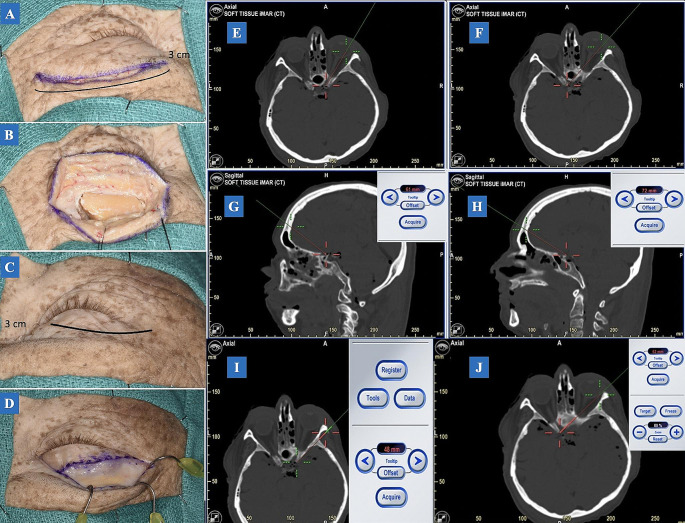
*Fig. 1. A: An incision with a 15-scalpel blade was performed on the left eyebrow. The incision length is approximately 3 cm with an extension of 5 mm laterally for access to the MacCarty... Source: [Exploring optimal microscopic keyhole access to the skull base: an anatomical evaluation of transciliary supraorbital and transpalpebral orbitofrontal craniotomy approaches](https://pmc.ncbi.nlm.nih.gov/articles/PMC11249509/) — Neurosurgical Review 2024; CC BY.*

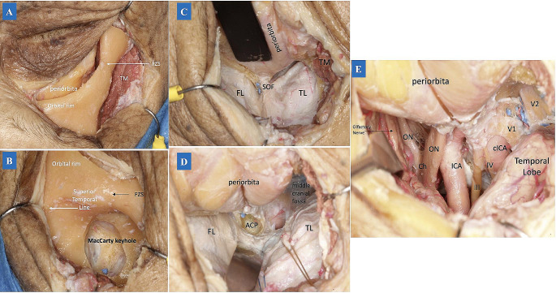
*Fig. 2. (A) After the temporal muscle was detached from the superior temporal line, the periorbita was also detached from the orbital bone. Then the periosteum was dissected laterally, exposing... Source: [Exploring optimal microscopic keyhole access to the skull base: an anatomical evaluation of transciliary supraorbital and transpalpebral orbitofrontal craniotomy approaches](https://pmc.ncbi.nlm.nih.gov/articles/PMC11249509/) — Neurosurgical Review 2024; CC BY.*

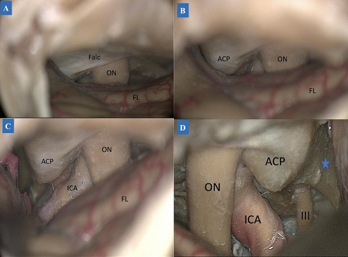
*Fig. 3. TCA subfrontal dissection. (A-C: left side) A: During the dissection, the ipsilateral optic nerve was first accessed on the anterior skull base, with the falciform ligament covering the... Source: [Exploring optimal microscopic keyhole access to the skull base: an anatomical evaluation of transciliary supraorbital and transpalpebral orbitofrontal craniotomy approaches](https://pmc.ncbi.nlm.nih.gov/articles/PMC11249509/) — Neurosurgical Review 2024; CC BY.*

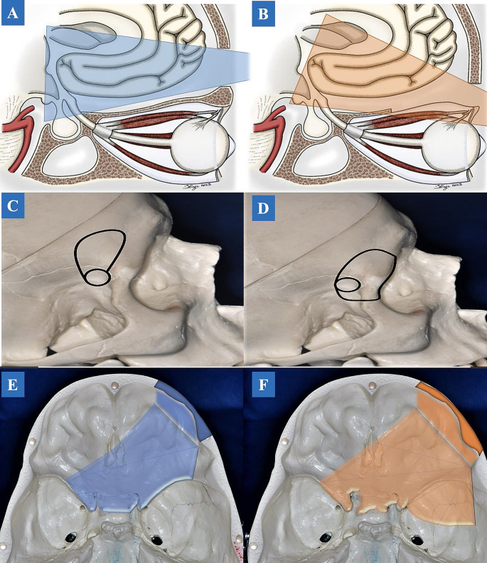
*Fig. 4. Illustration drawing. The angle of attack between the TCA and TPA. A. TCA allows a better cranial-caudal angle of attack. B. In TPA, the angle of attack is directed from a caudal-cranial... Source: [Exploring optimal microscopic keyhole access to the skull base: an anatomical evaluation of transciliary supraorbital and transpalpebral orbitofrontal craniotomy approaches](https://pmc.ncbi.nlm.nih.gov/articles/PMC11249509/) — Neurosurgical Review 2024; CC BY.*

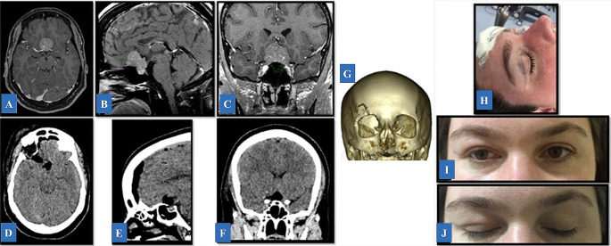
*Fig. 5. Illustrative Case 2. A-C: Pre-operative T1-weighted post-contrast magnetic resonance imaging demonstrating an extra-axial, enhanced lesion in the tuberculum extending to the planum... Source: [Exploring optimal microscopic keyhole access to the skull base: an anatomical evaluation of transciliary supraorbital and transpalpebral orbitofrontal craniotomy approaches](https://pmc.ncbi.nlm.nih.gov/articles/PMC11249509/) — Neurosurgical Review 2024; CC BY.*

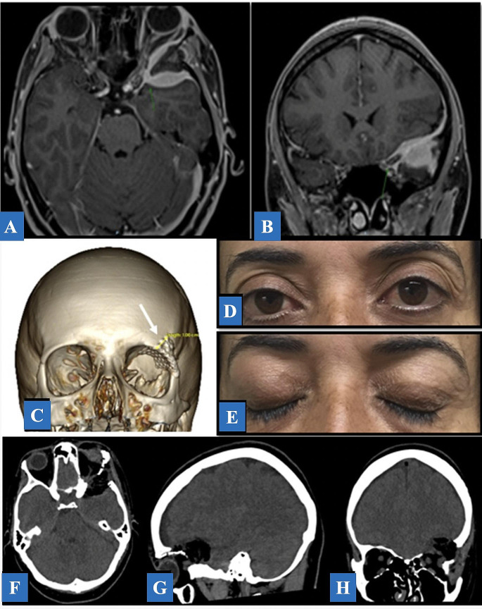
*Fig. 6. Illustrative Case 3. A, B: Axial and coronal T1-weighted with contrast MRI post-contrast demonstrating an extra-axial, enhancing, spheno-orbital left-sided lesion. C: A 3D-CT... Source: [Exploring optimal microscopic keyhole access to the skull base: an anatomical evaluation of transciliary supraorbital and transpalpebral orbitofrontal craniotomy approaches](https://pmc.ncbi.nlm.nih.gov/articles/PMC11249509/) — Neurosurgical Review 2024; CC BY.*

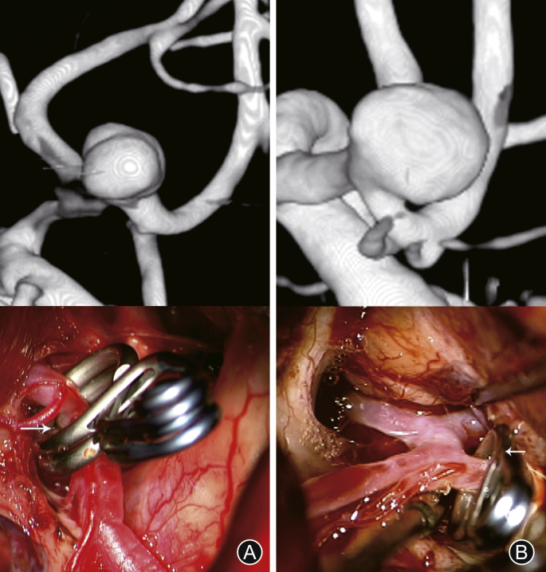
*Fig. 1. Computed tomography angiography and intraoperative photographs of the procedure. Supraorbital eyebrow keyhole approach. (A) Open A2 plane; (B) Closed A2 planes4. Source: [Factors determining the side of approach for clipping ruptured anterior communicating artery aneurysm via supraorbital eyebrow keyhole approach](https://pmc.ncbi.nlm.nih.gov/articles/PMC7049606/) — Chinese Journal of Traumatology 2020; CC BY-NC-ND.*

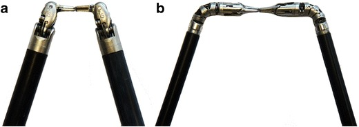
*Fig. 3. Comparison of a 8-mm da Vinci instruments with articulated wrist joints and (b) 5-mm da Vinci instruments with tentacle-like continuum tool shafts Source: [da Vinci robot-assisted keyhole neurosurgery: a cadaver study on feasibility and safety](https://pmc.ncbi.nlm.nih.gov/articles/PMC4365271/) — Neurosurgical Review 2014; CC BY.*

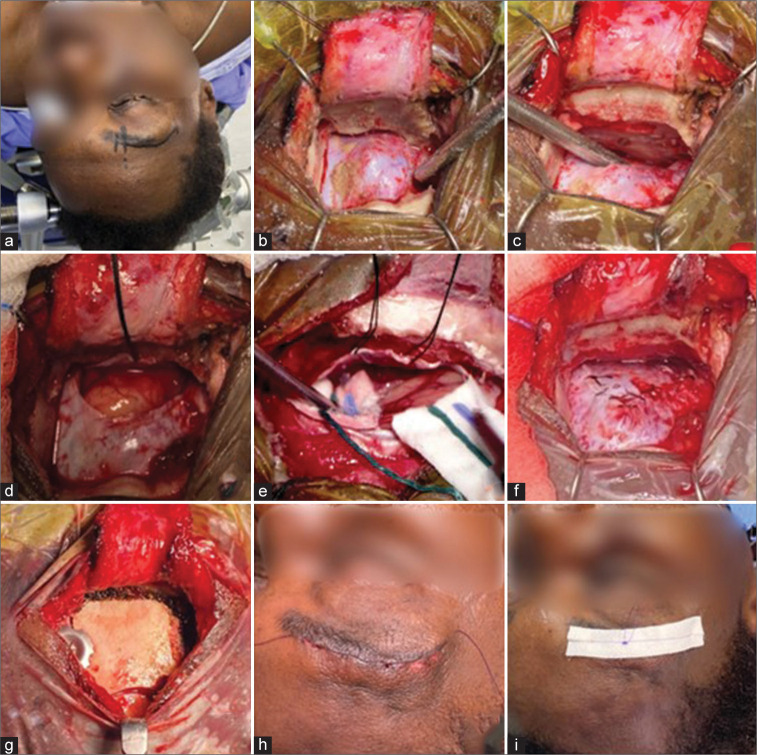
*Figure 1:. Representative case illustrating the surgical technique of the supraorbital eyebrow approach. (a) Proper positioning including head extension and rotation, with the line marking the skin... Source: [Supraorbital eyebrow approach: A single-center experience](https://pmc.ncbi.nlm.nih.gov/articles/PMC9805653/) — Surgical Neurology International 2022; CC BY-NC-SA.*

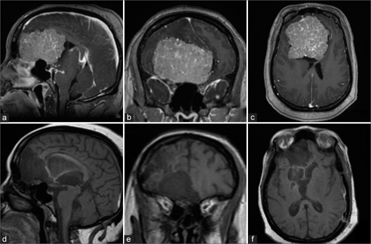
*Figure 2:. Preoperative postgadolinium-enhanced T1 magnetic resonance imaging (MRI) images (a) sagittal, (b) coronal, and (c) axial views showing a giant olfactory groove meningioma spanning the... Source: [Supraorbital eyebrow approach: A single-center experience](https://pmc.ncbi.nlm.nih.gov/articles/PMC9805653/) — Surgical Neurology International 2022; CC BY-NC-SA.*

<!-- END CURATED IMAGE SET -->

---

## General Considerations
- **What it accesses:** the **subfrontal corridor** — anterior fossa floor, **olfactory groove, planum sphenoidale, tuberculum sellae, suprasellar/parasellar cisterns, optic nerves/chiasm, AComA complex, lamina terminalis (and the third ventricle through it)**, and with angled scopes the retrochiasmatic and contralateral spaces.
- **Keyhole concept (Perneczky/Reisch):** the bony opening is small, but after **CSF release the frontal lobe settles**, opening a **cone of vision that expands with depth** — so a 2.5 cm window can address deep midline targets. **Patient selection is everything.**
- **Endoscope-assisted:** angled (30°) endoscopes inspect the blind corners (under the chiasm, contralateral optic canal, retrosellar) and have extended the approach's reach; it can be microscopic, endoscope-assisted, or fully endoscopic.
- **Versus pterional/OZ:** trades the wide lateral exposure and easy proximal vascular control of the [pterional](pterional-craniotomy.md)/[orbitozygomatic](orbitozygomatic-craniotomy.md) for cosmesis and reduced soft-tissue morbidity. **Have a low threshold to convert** to a formal pterional if proximal control or wider access is needed.

### Indications
- **AComA and selected anterior-circulation aneurysms** (favorable projection) → see [acomm-aneurysm-clipping.md](../cranial-vascular/acomm-aneurysm-clipping.md)
- **Tuberculum sellae / planum / olfactory groove meningiomas** (small–moderate, midline) → see [tuberculum-sellae-meningioma.md](../cranial-tumor/tuberculum-sellae-meningioma.md), [olfactory-groove-meningioma.md](../cranial-tumor/olfactory-groove-meningioma.md)
- **Suprasellar lesions** — selected craniopharyngioma/Rathke cyst → see [craniopharyngioma.md](../cranial-tumor/craniopharyngioma.md)
- Anterior-fossa-floor and frontobasal lesions; biopsy of subfrontal lesions

### Selection caveats / relative contraindications
- Large, highly vascular, or **laterally/posteriorly extending** tumors; lesions needing wide proximal control
- **Heavily pneumatized frontal sinus** (CSF-leak risk); significant brain swelling that won't relax

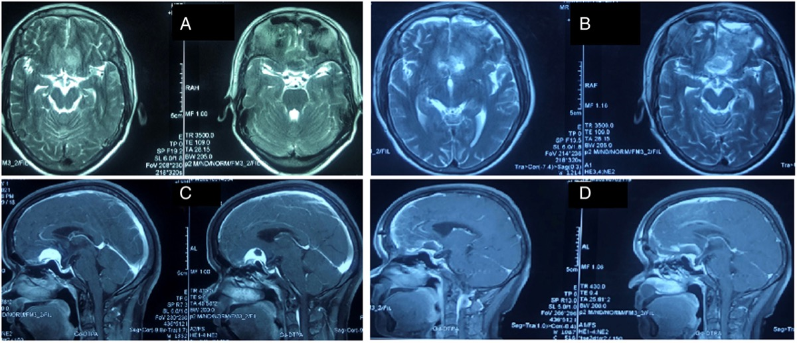

*Wang et al., "Keyhole supraorbital eyebrow approach…," Front Surg 2022;9:971063 — CC BY 4.0.*

---

## Relevant Surgical Anatomy
- **Eyebrow & supraorbital rim:** the incision sits in the **lateral two-thirds of the eyebrow**, **lateral to the supraorbital notch/foramen** (preserve the **supraorbital nerve**) and **below the frontal (frontotemporal) branch of the facial nerve** (which runs superolateral — staying low avoids it).
- **Frontal sinus:** its lateral extent is variable — the **single most important preoperative anatomic check** (CT), because entry risks CSF leak/mucocele.
- **Orbital roof / anterior fossa floor:** an internal bony prominence of the orbital roof is **drilled flat** to flatten the subfrontal trajectory.
- **Deep targets:** optic nerves and chiasm, the **opticocarotid and chiasmatic cisterns**, ICA and AComA complex (A1–A2), lamina terminalis.

## Preoperative Evaluation
- **CT (bone):** **frontal sinus pneumatization/lateral extent**, orbital roof, supraorbital notch vs foramen.
- **MRI / CTA:** lesion size, **lateral/posterior extension** (selection), vascularity, relation to optic apparatus and vessels; aneurysm projection.
- **Ophthalmology** (acuity/fields) and **endocrine** workup for sellar/suprasellar lesions.
- Counsel: forehead/eyelid numbness, transient periorbital edema, cosmesis, and possible conversion to a larger craniotomy.

## Logistics, OR Setup & Orders
- **Typical bed:** ICU or step-down depending on lesion risk, approach corridor, EBL, vascular manipulation, and baseline neurologic status.
- **OR setup:** Mayfield/head holder plan, microscope/endoscope, navigation, vascular instruments/ICG when applicable, skull base reconstruction supplies, and approach-specific retractors/drills ready before opening.
- **Special needs:** arterial line for major intracranial or vascular cases, Foley for long cases, neuromonitoring by corridor, dexamethasone/antiepileptic/BP plan by pathology, and blood products for vascular or skull base exposure.
- **Immediate postop orders:** disposition and neuro-check frequency, HOB/activity, postop CT/MRI/CTA timing, BP goals, steroid/antiepileptic plan, DVT prophylaxis timing, drain management, and focused cranial nerve/visual/language/motor exams.

## Anesthesia & Neuromonitoring
- GA; **lumbar drain or cisternal CSF release** is central to brain relaxation in this small corridor; navigation; **endoscope availability**. SSEP/MEP and visual-evoked considerations as indicated. Normotension (AVM/aneurysm rules apply).

---

## Positioning

- **Supine, Mayfield 3-pin.** Head **extended ~15–20°** so the frontal lobe falls away from the anterior fossa floor (gravity retraction), **rotated ~15–30° to the contralateral side** (more rotation for ipsilateral parasellar targets, less/neutral for midline AComA), with slight lateral tilt; **vertex slightly down.**
- The goal is the same as the pterional: let gravity, CSF, and bone removal — not retractors — create the exposure.

## Incision & Soft-Tissue Dissection

- **Eyebrow incision within the lateral two-thirds of the eyebrow**, along the supraorbital rim, **lateral to the supraorbital notch** (do **not** shave the eyebrow). Incise skin, then **orbicularis oculi/frontalis in line with their fibers**, staying **below the frontalis nerve branch.**
- Elevate a small **subperiosteal/galeal flap** to expose the supraorbital rim and the frontal bone just above it; a **pericranial/galeal flap is preserved** for frontal-sinus repair if needed. Protect the **supraorbital nerve** (release from a true foramen with a fine osteotome).

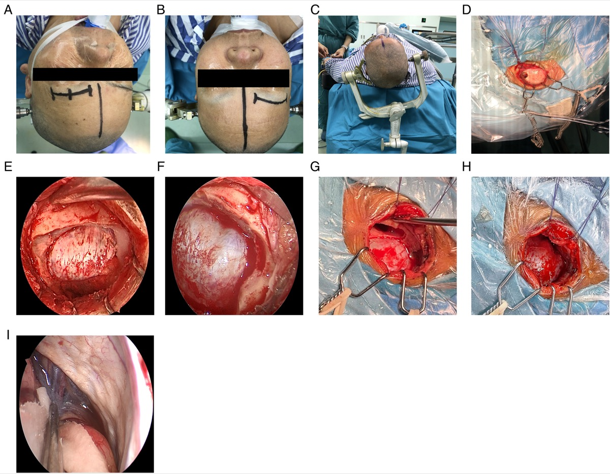

*Wang et al., Front Surg 2022;9:971063 — CC BY 4.0. (A,B) approach location, (C) head fixation, (D) fishhook retraction, (E) free bone flap, (F) supraorbital nerve, (G,H) frontal sinus before/after, (I) CSF release.*

---

## Craniotomy

1. A **single burr hole** behind the superior temporal line (under the muscle, for cosmesis), then a **small frontal craniotomy (~2.5 × 1.5–2 cm)** flush with the supraorbital rim/anterior fossa floor.
2. **Drill the inner table and the orbital-roof bump flat** — this, not a bigger window, is what opens the subfrontal trajectory.
3. **Frontal sinus management:** if entered, **exenterate the mucosa, occlude the ostium, and buttress with the pericranial/galeal flap** (± fat/wax) to prevent CSF leak and mucocele.

## Dural Opening & Intradural Work

- Open the dura in a **C-shaped flap based inferiorly toward the orbital rim**; tack it down out of the working line.
- **Release CSF** from the chiasmatic/carotid cisterns (or via the lumbar drain); the frontal lobe relaxes and the **subfrontal cone opens** to the optic nerves, chiasm, ICA, and AComA complex — **retractor-free** in most cases.
- Work the lesion: devascularize and internally debulk a meningioma, then dissect the capsule off the **optic apparatus and perforators**; for an AComA aneurysm, follow the A1 to the complex and clip. **Angled endoscopes** inspect under the chiasm, the contralateral optic canal, and the retrosellar space.

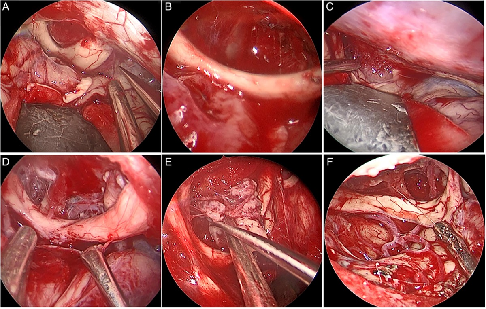

*Wang et al., Front Surg 2022;9:971063 — CC BY 4.0. The optic nerve is displaced by tumor (A,C) and decompressed after resection (B,D).*

---

## Closure
- **Watertight dura** (graft small defects); definitive **frontal-sinus repair** (pericranial flap) if entered. **Replace the small bone flap** with 1–2 low-profile plates; fill the burr hole for cosmesis.
- **Meticulous layered closure** of orbicularis/frontalis and a **subcuticular skin closure** within the eyebrow — cosmesis is a primary goal; typically no drain. Periorbital pressure dressing limits edema.

---

## Nuances & Pitfalls (surgeon-level)
- **The frontal sinus is the chief pitfall.** Check pneumatization on CT; if entered, exenterate + pericranial buttress — under-treated sinus entry is the usual source of postoperative CSF rhinorrhea/mucocele.
- **Protect the supraorbital nerve and the frontalis branch** — stay lateral to the notch and below the nerve; forehead numbness and frontalis palsy are the avoidable soft-tissue complications.
- **Relaxation is mandatory.** This corridor is unforgiving of a tight brain — drain CSF early; if the brain won't relax, reconsider/convert.
- **Know the corridor's limits.** Proximal vascular control is constrained; for large/vascular/laterally-extending lesions or difficult aneurysms, **convert to a pterional/OZ** rather than struggle.
- **Instrument conflict** in a narrow window — bayoneted instruments, dynamic (not fixed) retraction, and endoscope assistance for the blind corners.
- **Drill the orbital-roof prominence flat** — the commonest reason the subfrontal view feels "deep and narrow."

## Complications
CSF rhinorrhea / frontal-sinus mucocele; **supraorbital hypesthesia, frontalis (eyebrow) palsy**; anosmia; periorbital edema/ecchymosis; incomplete resection or aneurysm exposure (selection error); cosmetic eyebrow/scar issues; standard infection/seizure/vascular risks.

---

## Cross-links
- Related corridors: [pterional-craniotomy.md](pterional-craniotomy.md) · [orbitozygomatic-craniotomy.md](orbitozygomatic-craniotomy.md) · [endoscopic-endonasal-approach.md](endoscopic-endonasal-approach.md)
- Pathology: [acomm-aneurysm-clipping.md](../cranial-vascular/acomm-aneurysm-clipping.md) · [tuberculum-sellae-meningioma.md](../cranial-tumor/tuberculum-sellae-meningioma.md) · [olfactory-groove-meningioma.md](../cranial-tumor/olfactory-groove-meningioma.md) · [craniopharyngioma.md](../cranial-tumor/craniopharyngioma.md)

<!-- BEGIN COMMON PIMP QUESTIONS -->

## Common Pimp Questions

Use these to pressure-test preparation for **Supraorbital \"Eyebrow\" Keyhole Craniotomy**:

1. What patient position and head rotation make gravity work for this corridor?
2. What named nerve, vessel, sinus, or muscle/fascial plane is most commonly injured?
3. What bone work or soft-tissue step creates the exposure rather than simply using more retraction?
4. What is the bailout if exposure is inadequate, bleeding occurs, or the brain is tight?
5. What closure maneuver prevents the signature complication of this approach?

<!-- END COMMON PIMP QUESTIONS -->

<!-- BEGIN ATTENDING PREFERENCE VARIABLES -->

## Attending Preference Variables

Items that commonly vary by surgeon or institution:

- **Exact head rotation/flexion/extension and pin placement:** [attending-specific]
- **Skin incision length, flap type, and muscle/fascial preservation technique:** [attending-specific]
- **Drill, rongeur, endoscope, microscope, retractor, and navigation preferences:** [attending-specific]
- **Drain use, closure materials, watertightness threshold, and postop imaging routine:** [attending-specific]

<!-- END ATTENDING PREFERENCE VARIABLES -->

<!-- BEGIN REVERSE APPROACH LINKS -->

## Case Guides Using This Approach

- [Craniopharyngioma Resection](../../cases/cranial-tumor/craniopharyngioma.md)
- [Tuberculum Sellae Meningioma Resection](../../cases/cranial-tumor/tuberculum-sellae-meningioma.md)

<!-- END REVERSE APPROACH LINKS -->

## References
1. Perneczky A, Reisch R. *Keyhole Approaches in Neurosurgery.* Springer, 2008.
2. Reisch R, Perneczky A. **Ten-year experience with the supraorbital subfrontal approach through an eyebrow skin incision.** *Neurosurgery.* 2005;57(4 Suppl):242–255.
3. Wilson DA, Duong H, Teo C, Kelly DF. **The supraorbital eyebrow craniotomy for intra- and extra-axial brain tumors.** *World Neurosurg.* 2014.
4. Cavalcanti DD, et al. **Anatomical and objective evaluation of the supraorbital keyhole; addition of orbital rim osteotomy.** (working angles to anterior-circulation aneurysms).
5. **Wang X, et al. Keyhole supraorbital eyebrow approach for fully endoscopic resection of tuberculum sellae meningioma.** *Front Surg.* 2022;9:971063. CC BY 4.0. (figures embedded above) — [PMC9491022](https://www.ncbi.nlm.nih.gov/pmc/articles/PMC9491022/)
6. Cohen-Gadol AA. *Supraorbital Craniotomy.* The Neurosurgical Atlas. [link](https://www.neurosurgicalatlas.com/volumes/cranial-approaches/supraorbital-craniotomy)
