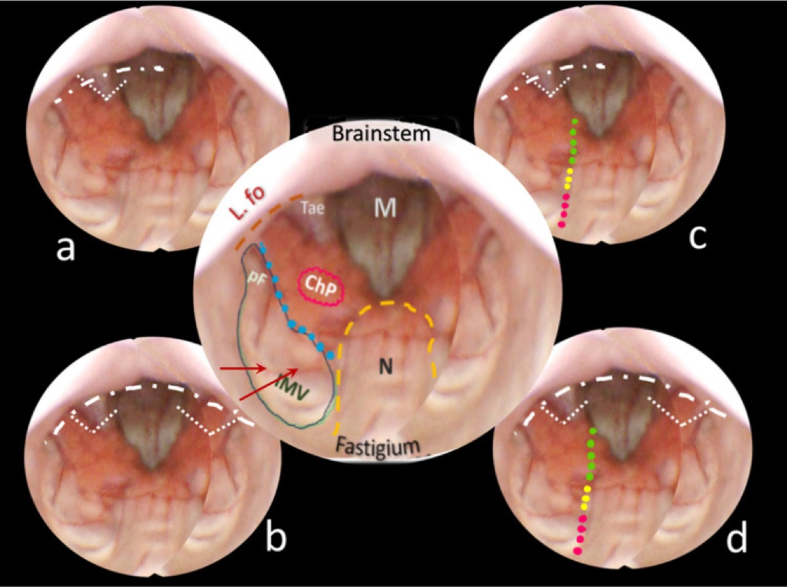

# Operative Approach: Telovelar (Trans-Cerebellomedullary Fissure) Approach to the Fourth Ventricle

> **About the figures.** Copyrighted operative figures/videos are **linked** (Neurosurgical Atlas, Rhoton); embedded images are **public-domain** (Gray's Anatomy) or **CC‑BY** (open-access), credited beneath each image. See [media-sources.md](../../resources/media-sources.md) and [figures/CREDITS.md](../../figures/CREDITS.md).
>
> **References:** [Neurosurgical Atlas — Suboccipital Craniotomy](https://www.neurosurgicalatlas.com/volumes/cranial-approaches/suboccipital-craniotomy) · [Radiopaedia — fourth ventricle](https://radiopaedia.org/search?q=fourth%20ventricle%20tumour&scope=all) · [PubMed Central — telovelar](https://www.ncbi.nlm.nih.gov/pmc/?term=telovelar+approach+fourth+ventricle)

The telovelar approach reaches the **entire fourth ventricle through the cerebellomedullary fissure — without splitting the vermis.** By opening the **tela choroidea** (and, when more rostral reach is needed, the **inferior medullary velum**), the surgeon enters the ventricle along its natural roof, exposing the floor from the obex to the aqueduct and out to the lateral recess/foramen of Luschka. It has largely **replaced the transvermian approach** because sparing the vermis markedly reduces **cerebellar mutism** and ataxia.

---

## Figures, Imaging & Video
[Neurosurgical Atlas — posterior fossa](https://www.neurosurgicalatlas.com/volumes/cranial-approaches/suboccipital-craniotomy) · [Rhoton fourth-ventricle anatomy (PMC)](https://www.ncbi.nlm.nih.gov/pmc/?term=rhoton+fourth+ventricle+cerebellomedullary+fissure) · [Radiopaedia — medulloblastoma/ependymoma](https://radiopaedia.org/search?q=fourth%20ventricle%20tumour&scope=all)

*Gray's Anatomy (1918), public domain — via Wikimedia Commons.*

---

## General Considerations
- **What it accesses:** the **whole fourth ventricle** (floor from obex to aqueduct), the **lateral recess and foramen of Luschka**, and — via safe entry zones — the **dorsal pons/medulla.**
- **The roof is the door, not the vermis.** The fourth-ventricular roof has a lower membranous part (**tela choroidea**) and an upper neural part (**inferior medullary velum**). Opening the tela (± velum) on one or both sides exposes the ventricle **without any vermian incision** — the central advantage over the transvermian route.
- **Graded opening:** unilateral tela opening for caudal/floor lesions; add the **inferior medullary velum** and/or extend along the **taenia/lateral recess** for rostral or laterally extending tumors.

### Indications
- **Fourth-ventricular tumors** — ependymoma, medulloblastoma, subependymoma, choroid plexus, pilocytic astrocytoma → [pediatric posterior fossa tumor](../pediatric/pediatric-posterior-fossa-tumor.md), [posterior fossa tumor](../cranial-tumor/posterior-fossa-tumor.md)
- **Dorsal pontine/medullary lesions** via floor safe-entry zones (cavernoma, focal glioma)
- Lateral recess / foramen of Luschka lesions; rhomboid-fossa lesions

---

## Relevant Surgical Anatomy
- **Cerebellomedullary fissure:** the cleft between the **cerebellar tonsil/uvula above and the medulla below** — the natural plane the approach develops.
- **Fourth-ventricular roof:** **tela choroidea** (lower, membranous, with choroid plexus) and **inferior medullary velum** (upper, between nodulus/uvula); the **taenia** is the line of attachment of the tela.
- **Tonsil, uvula, nodulus** (retracted, not resected); **foramen of Magendie** (median) and **Luschka** (lateral recess).
- **PICA** (telovelar/tonsillomedullary segments and choroidal branches) courses in the fissure — protect it.
- **Floor (rhomboid fossa) safe zones:** the **facial colliculus, hypoglossal and vagal trigones, striae medullares** mark cranial-nerve nuclei to avoid; entry through the **suprafacial/infrafacial triangles or median sulcus** as appropriate.

*Telovelar approach reshaped, *Neurosurg Rev* 2026 (PMC12963120) — CC BY 4.0. External cerebellomedullary-fissure dissection mapped to the internal fourth-ventricular anatomy.*

*Telovelar approach reshaped, *Neurosurg Rev* 2026 — CC BY 4.0. The tela choroidea and inferior medullary velum are the layers opened to enter the ventricle.*

---

## Preoperative Evaluation
- **MRI** — tumor extent, **floor involvement/adherence**, rostral (aqueduct) and lateral-recess extension, brainstem invasion; **hydrocephalus** (very common with fourth-ventricular tumors).
- **CTA / MRV** for **PICA** and the venous sinuses; **DTI** if a brainstem safe-entry plan is needed.
- **Hydrocephalus plan:** preop EVD vs intraoperative ventricular access vs ETV; counsel re: postoperative shunt need (esp. medulloblastoma).

## Anesthesia & Neuromonitoring
- GA/TIVA; **fourth-ventricular floor mapping**, **lower-CN EMG (IX/X, XII), facial EMG**, SSEP/MEP, BAER. Arrhythmia/hemodynamic vigilance during floor manipulation. **VAE precautions** if a sitting position is used.

---

## Positioning
📷 *[Atlas — posterior fossa positioning](https://www.neurosurgicalatlas.com/volumes/cranial-approaches/suboccipital-craniotomy)*

- **Prone "Concorde"** (head flexed, slightly elevated) is the workhorse; **sitting/semi-sitting** is used by some for gravity drainage (VAE trade-off). Mayfield fixation; **neck flexion opens the suboccipital–C1 interval and the cerebellomedullary fissure** (avoid over-flexion / airway-ETT kinking and cervicomedullary compression).

## Craniotomy
📷 *[Atlas — midline suboccipital craniotomy](https://www.neurosurgicalatlas.com/volumes/cranial-approaches/suboccipital-craniotomy)*

- **Midline suboccipital craniotomy/craniectomy** (± **C1 arch removal** for low/Magendie tumors and CSF access) — see [midline suboccipital craniotomy](midline-suboccipital-craniotomy.md). Open the dura in a Y/V, release CSF from the **cisterna magna**; the tonsils relax.

## Telovelar Dissection (the approach proper)
📷 *[Atlas — cerebellomedullary fissure dissection](https://www.neurosurgicalatlas.com/volumes/cranial-approaches/suboccipital-craniotomy)*

1. **Retract the cerebellar tonsils laterally/superiorly** (dynamic, not fixed) to open the cerebellomedullary fissure; identify the **tela choroidea** and the **taenia.**
2. **Incise the tela choroidea** (unilateral or bilateral) along the taenia, coagulating the choroid plexus — this alone exposes the caudal floor and ventricle.
3. For rostral exposure (toward the aqueduct), **incise the inferior medullary velum**; extend laterally along the recess toward **Luschka** for laterally projecting tumors. The **entire floor up to the aqueduct is now exposed without a vermian split.**
4. **Tumor work:** internally debulk, define the tumor–floor plane, and protect the **floor** (no fixed retraction; map safe-entry zones); preserve **PICA branches** and floor perforators.

---

## Closure
- **Watertight dural closure** (graft as needed), **fat graft** the suboccipital defect, wax air cells; replace bone (cranioplasty) when feasible. Manage **hydrocephalus** (EVD weaning, shunt if needed). Layered muscle closure to prevent **pseudomeningocele/CSF leak.**

---

## Nuances & Pitfalls (surgeon-level)
- **Spare the vermis** — that is the entire point; the telovelar route avoids the vermian-split contribution to **cerebellar mutism**, though mutism can still occur with **dentate/vermian/brainstem** injury — counsel families (children).
- **The floor is sacred.** Tumor adherent to the floor is left rather than chased; never use fixed retraction on the rhomboid fossa; respect the **facial colliculus** and lower-CN trigones (floor mapping) — injury causes CN palsies, dysphagia, and hemodynamic instability.
- **Protect PICA** and its telovelar/choroidal branches in the fissure.
- **Hydrocephalus** is the rule — plan CSF diversion; watch for postoperative deterioration and the need for a shunt.
- **Tonsillar retraction** should be gentle/dynamic — over-retraction bruises the tonsils/PICA.
- **Lateral recess/Luschka** extension needs deliberate taenia dissection laterally — know where the lower cranial nerves exit.

## Complications
**Cerebellar mutism** (less than transvermian) / ataxia; **fourth-ventricular floor injury** → CN VI/VII and lower-CN palsies, dysphagia, gaze palsy, hemodynamic instability; **PICA injury**; **hydrocephalus / CSF leak / pseudomeningocele**; pseudobulbar/respiratory issues; meningitis.

---

## Cross-links
- Pathology: [pediatric posterior fossa tumor](../pediatric/pediatric-posterior-fossa-tumor.md) · [posterior fossa tumor](../cranial-tumor/posterior-fossa-tumor.md)
- Related corridors: [midline-suboccipital-craniotomy.md](midline-suboccipital-craniotomy.md) · [retrosigmoid-craniotomy.md](retrosigmoid-craniotomy.md) · [supracerebellar-infratentorial-approach.md](supracerebellar-infratentorial-approach.md)

## References
1. **Mussi AC, Rhoton AL Jr. Telovelar approach to the fourth ventricle: microsurgical anatomy.** *J Neurosurg.* 2000;92(5):812–823.
2. Matsushima T, Rhoton AL Jr, et al. **Microsurgical anatomy of the cerebellomedullary fissure.**
3. Tanriover N, et al. **Comparison of the transvermian and telovelar approaches to the fourth ventricle.**
4. Deshmukh VR, et al. **Quantification and comparison of telovelar and transvermian approaches.** *Neurosurgery.* 2006.
5. **The telovelar approach reshaped: a new perspective from inside the fourth ventricle.** *Neurosurg Rev.* 2026. CC BY 4.0. (figures embedded above) — [PMC12963120](https://pmc.ncbi.nlm.nih.gov/articles/PMC12963120/)
