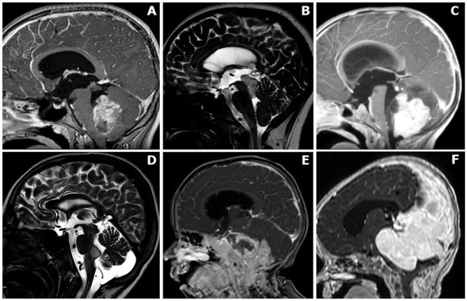
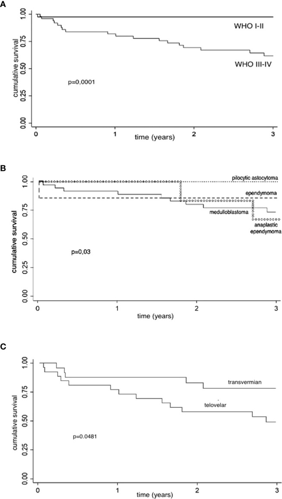
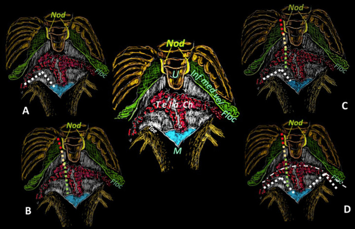
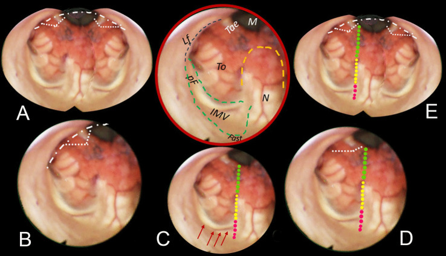
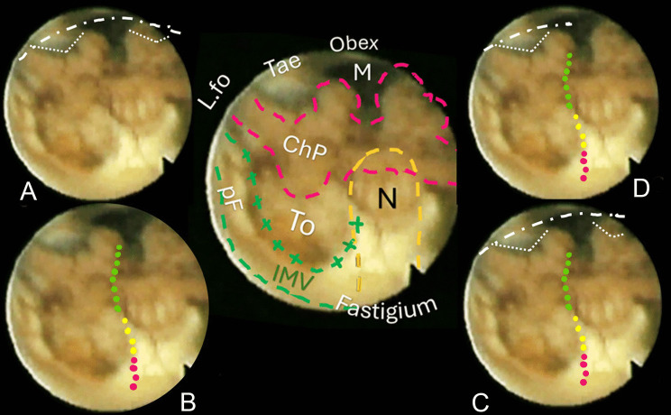
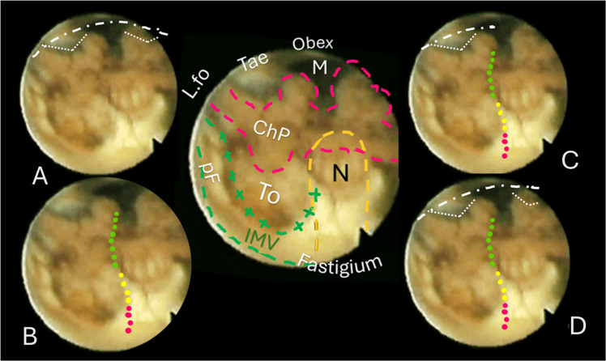
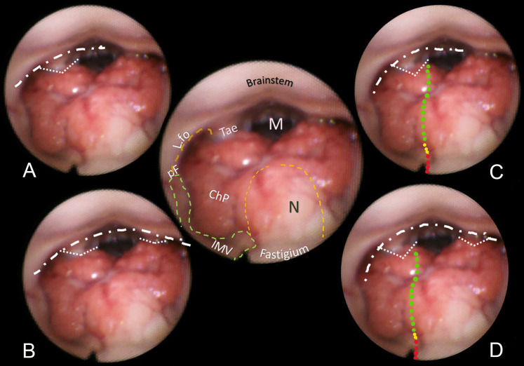
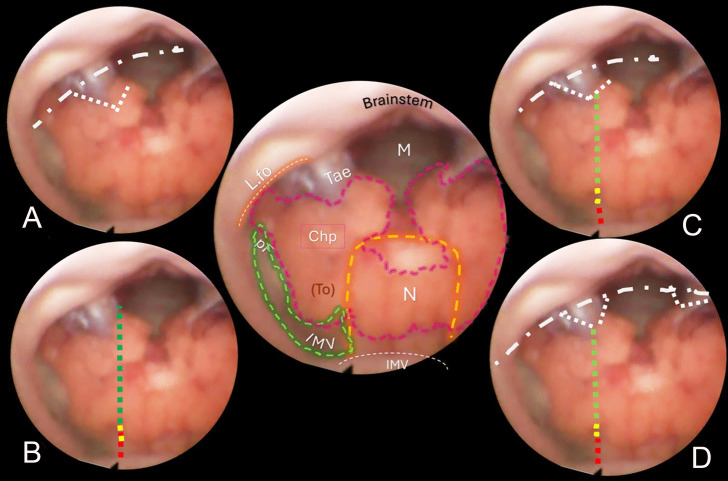
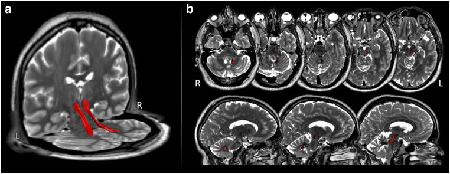
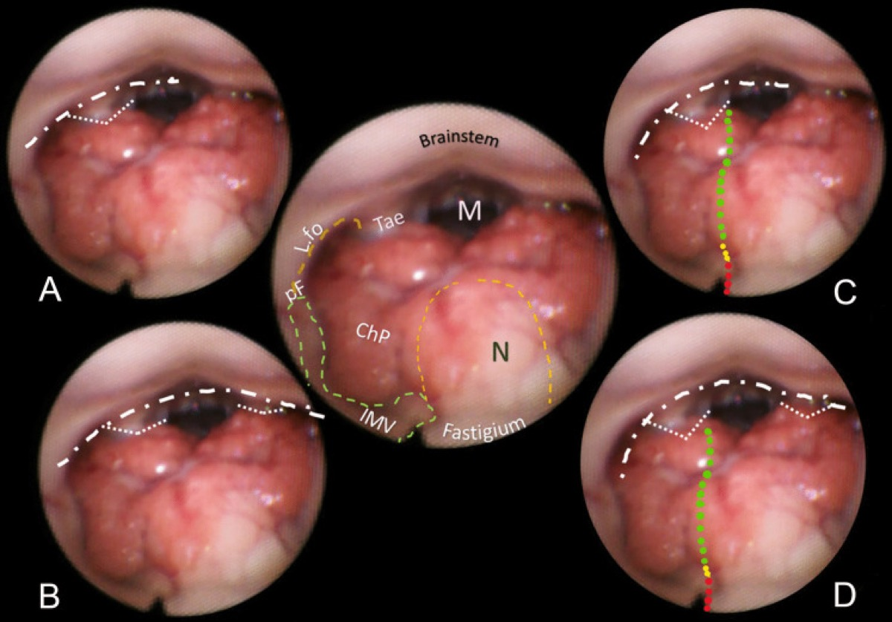

# Operative Approach: Telovelar (Trans-Cerebellomedullary Fissure) Approach to the Fourth Ventricle

<!-- BEGIN CASE SNAPSHOT -->

## Case / Approach Snapshot

- **Anatomy at risk:** corridor-defining nerves, arteries, veins/sinuses, cisterns, bone landmarks, muscle/fascial planes, and closure structures that determine exposure and morbidity.
- **Operative steps:** confirm position and trajectory, mark landmarks, protect soft tissue and named neurovascular structures, perform the bone/soft-tissue corridor, open/close dura or target compartment deliberately, and verify hemostasis/reconstruction; use the detailed operative sequence and approach notes below as the step-by-step source.
- **Rescue plans:** brain relaxation failure, venous or sinus bleeding, cranial nerve/perforator risk, exposure that is too narrow, CSF leak, cosmetic/temporalis/frontalis problems, and conversion to a wider or alternate corridor.
- **Figures:** review [Figures, Imaging & Video](#figures-imaging--video) and the [Curated Image Set](#curated-image-set); embedded local figures should remain open-access, public-domain, or otherwise reusable with attribution.
- **Papers:** review [High-Yield Literature](#high-yield-literature) for seminal sources, modern reviews, and outcome data specific to this page.
- **Textbook cross-checks:** use [Textbook Cross-Checks](#textbook-cross-checks) and the [Source Crosswalk](../../resources/source-crosswalk.md) to cite copyrighted textbooks/atlases while summarizing in original words.

<!-- END CASE SNAPSHOT -->

> **About the figures.** Copyrighted operative figures/videos are **linked** (Neurosurgical Atlas, Rhoton); embedded images are **public-domain** (Gray's Anatomy) or **CC‑BY** (open-access), credited beneath each image. See [media-sources.md](../../resources/media-sources.md) and [figures/CREDITS.md](../../figures/CREDITS.md).
>
> **References:** [Neurosurgical Atlas — Suboccipital Craniotomy](https://www.neurosurgicalatlas.com/volumes/cranial-approaches/suboccipital-craniotomy) · [Radiopaedia — fourth ventricle](https://radiopaedia.org/search?q=fourth%20ventricle%20tumour&scope=all) · [PubMed Central — telovelar](https://www.ncbi.nlm.nih.gov/pmc/?term=telovelar+approach+fourth+ventricle)

The telovelar approach reaches the **entire fourth ventricle through the cerebellomedullary fissure — without splitting the vermis.** By opening the **tela choroidea** (and, when more rostral reach is needed, the **inferior medullary velum**), the surgeon enters the ventricle along its natural roof, exposing the floor from the obex to the aqueduct and out to the lateral recess/foramen of Luschka. It has largely **replaced the transvermian approach** because sparing the vermis markedly reduces **cerebellar mutism** and ataxia.

---

## Figures, Imaging & Video

**🎥 Operative video** — [search operative video on YouTube ▸](https://www.youtube.com/results?search_query=fourth+ventricle+tumour+surgery) · [The Neurosurgical Atlas ▸](https://www.neurosurgicalatlas.com)

[Neurosurgical Atlas — posterior fossa](https://www.neurosurgicalatlas.com/volumes/cranial-approaches/suboccipital-craniotomy) · [Rhoton fourth-ventricle anatomy (PMC)](https://www.ncbi.nlm.nih.gov/pmc/?term=rhoton+fourth+ventricle+cerebellomedullary+fissure) · [Radiopaedia — medulloblastoma/ependymoma](https://radiopaedia.org/search?q=fourth%20ventricle%20tumour&scope=all)

---

<!-- BEGIN TEXTBOOK CROSS-CHECKS -->

## Textbook Cross-Checks

- **Microsurgical corridor anatomy:** Rhoton Cranial Anatomy; Brain Anatomy and Neurosurgical Approaches; Youmans and Winn — confirm surface landmarks, bone-removal limits, cisternal/venous relationships, and the named neurovascular structures that define the working corridor.
- **Technique sequence:** Schmidek and Sweet; Youmans and Winn; Neurosurgical Atlas chapter links — review positioning, incision, soft-tissue handling, bone work, dural opening, and intradural exposure sequence.
- **Complication avoidance:** Rhoton; Greenberg; approach-specific operative references — cross-check cranial nerve, venous, sinus, perforator, CSF-leak, and cosmetic risks before committing to the corridor.
- **Copyright-safe use:** cite these sources as private cross-checks, then write the guide content in original words; do not re-host textbook pages, figures, tables, or board-review card material. See [Source Crosswalk & Copyright-Safe Use](../../resources/source-crosswalk.md).

<!-- END TEXTBOOK CROSS-CHECKS -->

<!-- BEGIN CURATED LITERATURE -->

## High-Yield Literature

- **Telovelar surgical approach** — Ghali MGZ. Neurosurgical review 2021. [PubMed](https://pubmed.ncbi.nlm.nih.gov/31807931/)
- **Microsurgical anatomy of the fourth ventricle** — Mercier P. Neuro-Chirurgie 2021. [PubMed](https://pubmed.ncbi.nlm.nih.gov/29875069/)
- **Anatomical Step-by-Step Dissection of Midline Suboccipital Approaches to the Fourth Ventricle for Trainees: Surgical Anatomy of the Telovelar, Transvermian, and Superior Transvelar Routes, Surgical Principles, and Illustrative Cases** — Dang DD. Journal of neurological surgery. Part B, Skull base 2024. [PubMed](https://pubmed.ncbi.nlm.nih.gov/38449580/)
- **Microsurgical anatomy and surgical exposure of the cerebellar peduncles** — Baran O. Neurosurgical review 2022. [PubMed](https://pubmed.ncbi.nlm.nih.gov/34997381/)
- **Fourth Ventricle Epidermoid Cyst: Case Report of Precision Telovelar Microsurgery, Functional Preservation, and Lifelong Surveillance** — Costea D. Diagnostics (Basel, Switzerland) 2025. [PubMed](https://pubmed.ncbi.nlm.nih.gov/41153272/)
- **Neuroendoscopy improves operability and reduces hazardous vermian manipulation during the telovelar approach to the fourth ventricle's floor: an anatomical study** — Serrano Sponton L. Neurosurgical review 2026. [PubMed](https://pubmed.ncbi.nlm.nih.gov/41843243/)
- **Telovelar Approach for Fourth-Ventricular Epidermoid Cyst: Anatomical Respect, Functional Recovery, and Long-Term Stability** — Pantu C. Diagnostics (Basel, Switzerland) 2026. [PubMed](https://pubmed.ncbi.nlm.nih.gov/41515624/)
- **Full-Endoscopic Minimally-Invasive Trans-Magendie Approach to the Fourth Ventricle: An Anatomical Feasibility Study** — Leone A. World neurosurgery 2025. [PubMed](https://pubmed.ncbi.nlm.nih.gov/40368086/)
- **Telovelar approach for choroid plexus papilloma in the foramen of Luschka: a safe way using a neuromonitor** — Lee CC. Clinical neurology and neurosurgery 2012. [PubMed](https://pubmed.ncbi.nlm.nih.gov/22209142/)
- **Subtonsillar and vallecular triangles as gateways to dorsal brainstem and fourth ventricle lesions: descriptive and quantitative analysis of microsurgical anatomy** — Gurses ME. Neurosurgical review 2025. [PubMed](https://pubmed.ncbi.nlm.nih.gov/41191114/)

<!-- END CURATED LITERATURE -->

---

<!-- BEGIN CURATED IMAGE SET -->

## Curated Image Set

Open-access figures are embedded from PubMed Central articles and kept unique to this guide.

*Figure 1. Anatomical classification of posterior fossa tumors requiring surgical access to the fourth ventricle. (A) Mainly/purely intraventricular, without evident brainstem infiltration or... Source: [The Clinical and Prognostic Impact of the Choice of Surgical Approach to Fourth Ventricular Tumors in a Single-Center, Single-Surgeon Cohort of 92 Consecutive Pediatric Patients](https://pmc.ncbi.nlm.nih.gov/articles/PMC8912940/) — Frontiers in Oncology 2022; CC BY.*

*Figure 2. Kaplan–Meier survival estimates. CS, cumulative survival; CI, confidence interval; y, year. (A) Kaplan–Meier survival estimates (histological grading): 1- and 3-year CS are analyzed in... Source: [The Clinical and Prognostic Impact of the Choice of Surgical Approach to Fourth Ventricular Tumors in a Single-Center, Single-Surgeon Cohort of 92 Consecutive Pediatric Patients](https://pmc.ncbi.nlm.nih.gov/articles/PMC8912940/) — Frontiers in Oncology 2022; CC BY.*

*Fig. 1. These sketches resume the cerebellomedullary fissure approaches upon the external surface of the fourth ventricle and shall be the map for designing the same dissection lines on the... Source: [The telovelar approach reshaped: a new perspective from inside the fourth ventricle](https://pmc.ncbi.nlm.nih.gov/articles/PMC12963120/) — Child's Nervous System 2026; CC BY.*

*Fig. 2. Central round: an anatomical mapping of almost the entire fourth ventricle. The image is captured once the endoscopic camera tip has emerged from the aqueduct and is moving caudally. The... Source: [The telovelar approach reshaped: a new perspective from inside the fourth ventricle](https://pmc.ncbi.nlm.nih.gov/articles/PMC12963120/) — Child's Nervous System 2026; CC BY.*

*Fig. 3. Brown-bordered upper central round: anatomical perspective of almost the entire fourth ventricle. The nodulus (N, orange dashed line) and the inferior medullary velum (IMV, green dashed... Source: [The telovelar approach reshaped: a new perspective from inside the fourth ventricle](https://pmc.ncbi.nlm.nih.gov/articles/PMC12963120/) — Child's Nervous System 2026; CC BY.*

*Fig. 4. Central sketch: anatomical morphology of the roof of the fourth ventricle. The nodulus (N, orange dashed line) lies caudal to the Fastigium, as well as the inferior medullary velum (IMV,... Source: [The telovelar approach reshaped: a new perspective from inside the fourth ventricle](https://pmc.ncbi.nlm.nih.gov/articles/PMC12963120/) — Child's Nervous System 2026; CC BY.*

*Fig. 5. The case of a normal pressure hydrocephalus. Ventricular distention caused an apparent downshift of the choroidal plexus and distension of the cranial part of the roof with enlargement... Source: [The telovelar approach reshaped: a new perspective from inside the fourth ventricle](https://pmc.ncbi.nlm.nih.gov/articles/PMC12963120/) — Child's Nervous System 2026; CC BY.*

*Fig. 6. Central round: view of a normal fourth ventricle after endoscopic aqueductoplasty in a 61-year-old man, and comparison with previous figures for anatomical morphology and shortcuts. A... Source: [The telovelar approach reshaped: a new perspective from inside the fourth ventricle](https://pmc.ncbi.nlm.nih.gov/articles/PMC12963120/) — Child's Nervous System 2026; CC BY.*

*Fig. 7. Central round: shape of a normal fourth ventricle after endoscopic aqueductoplasty. The ventricular inferior roof is prevalently dwelt in by the choroid plexus (Chp) that reaches the... Source: [The telovelar approach reshaped: a new perspective from inside the fourth ventricle](https://pmc.ncbi.nlm.nih.gov/articles/PMC12963120/) — Child's Nervous System 2026; CC BY.*

*Fig. 3. Dentatorubrothalamic tract dissection: 3D (a) and 2D (b) dissection of the dentatorubrothalamic tracts (red) imposed on the patient’s T2 volumetric MRI Source: [Medial-tonsillar telovelar approach for resection of a superior medullary velum cerebral cavernous malformation: anatomical and tractography study of the surgical approach and functional implications](https://pmc.ncbi.nlm.nih.gov/articles/PMC7886669/) — Acta Neurochirurgica 2020; CC BY.*

<!-- END CURATED IMAGE SET -->

---

## General Considerations
- **What it accesses:** the **whole fourth ventricle** (floor from obex to aqueduct), the **lateral recess and foramen of Luschka**, and — via safe entry zones — the **dorsal pons/medulla.**
- **The roof is the door, not the vermis.** The fourth-ventricular roof has a lower membranous part (**tela choroidea**) and an upper neural part (**inferior medullary velum**). Opening the tela (± velum) on one or both sides exposes the ventricle **without any vermian incision** — the central advantage over the transvermian route.
- **Graded opening:** unilateral tela opening for caudal/floor lesions; add the **inferior medullary velum** and/or extend along the **taenia/lateral recess** for rostral or laterally extending tumors.

### Indications
- **Fourth-ventricular tumors** — ependymoma, medulloblastoma, subependymoma, choroid plexus, pilocytic astrocytoma → [pediatric posterior fossa tumor](../pediatric/pediatric-posterior-fossa-tumor.md), [posterior fossa tumor](../cranial-tumor/posterior-fossa-tumor.md)
- **Dorsal pontine/medullary lesions** via floor safe-entry zones (cavernoma, focal glioma)
- Lateral recess / foramen of Luschka lesions; rhomboid-fossa lesions

---

## Relevant Surgical Anatomy
- **Cerebellomedullary fissure:** the cleft between the **cerebellar tonsil/uvula above and the medulla below** — the natural plane the approach develops.
- **Fourth-ventricular roof:** **tela choroidea** (lower, membranous, with choroid plexus) and **inferior medullary velum** (upper, between nodulus/uvula); the **taenia** is the line of attachment of the tela.
- **Tonsil, uvula, nodulus** (retracted, not resected); **foramen of Magendie** (median) and **Luschka** (lateral recess).
- **PICA** (telovelar/tonsillomedullary segments and choroidal branches) courses in the fissure — protect it.
- **Floor (rhomboid fossa) safe zones:** the **facial colliculus, hypoglossal and vagal trigones, striae medullares** mark cranial-nerve nuclei to avoid; entry through the **suprafacial/infrafacial triangles or median sulcus** as appropriate.

*Telovelar approach reshaped, *Neurosurg Rev* 2026 (PMC12963120) — CC BY 4.0. External cerebellomedullary-fissure dissection mapped to the internal fourth-ventricular anatomy.*

*Telovelar approach reshaped, *Neurosurg Rev* 2026 — CC BY 4.0. The tela choroidea and inferior medullary velum are the layers opened to enter the ventricle.*

---

## Preoperative Evaluation
- **MRI** — tumor extent, **floor involvement/adherence**, rostral (aqueduct) and lateral-recess extension, brainstem invasion; **hydrocephalus** (very common with fourth-ventricular tumors).
- **CTA / MRV** for **PICA** and the venous sinuses; **DTI** if a brainstem safe-entry plan is needed.
- **Hydrocephalus plan:** preop EVD vs intraoperative ventricular access vs ETV; counsel re: postoperative shunt need (esp. medulloblastoma).

## Anesthesia & Neuromonitoring
- GA/TIVA; **fourth-ventricular floor mapping**, **lower-CN EMG (IX/X, XII), facial EMG**, SSEP/MEP, BAER. Arrhythmia/hemodynamic vigilance during floor manipulation. **VAE precautions** if a sitting position is used.

---

## Positioning

- **Prone "Concorde"** (head flexed, slightly elevated) is the workhorse; **sitting/semi-sitting** is used by some for gravity drainage (VAE trade-off). Mayfield fixation; **neck flexion opens the suboccipital–C1 interval and the cerebellomedullary fissure** (avoid over-flexion / airway-ETT kinking and cervicomedullary compression).

## Craniotomy

- **Midline suboccipital craniotomy/craniectomy** (± **C1 arch removal** for low/Magendie tumors and CSF access) — see [midline suboccipital craniotomy](midline-suboccipital-craniotomy.md). Open the dura in a Y/V, release CSF from the **cisterna magna**; the tonsils relax.

## Telovelar Dissection (the approach proper)

1. **Retract the cerebellar tonsils laterally/superiorly** (dynamic, not fixed) to open the cerebellomedullary fissure; identify the **tela choroidea** and the **taenia.**
2. **Incise the tela choroidea** (unilateral or bilateral) along the taenia, coagulating the choroid plexus — this alone exposes the caudal floor and ventricle.
3. For rostral exposure (toward the aqueduct), **incise the inferior medullary velum**; extend laterally along the recess toward **Luschka** for laterally projecting tumors. The **entire floor up to the aqueduct is now exposed without a vermian split.**
4. **Tumor work:** internally debulk, define the tumor–floor plane, and protect the **floor** (no fixed retraction; map safe-entry zones); preserve **PICA branches** and floor perforators.

---

## Closure
- **Watertight dural closure** (graft as needed), **fat graft** the suboccipital defect, wax air cells; replace bone (cranioplasty) when feasible. Manage **hydrocephalus** (EVD weaning, shunt if needed). Layered muscle closure to prevent **pseudomeningocele/CSF leak.**

---

### Further operative anatomy & technique

*Telovelar approach reshaped, Neurosurg Rev 2026 — CC BY 4.0.*

## Nuances & Pitfalls (surgeon-level)
- **Spare the vermis** — that is the entire point; the telovelar route avoids the vermian-split contribution to **cerebellar mutism**, though mutism can still occur with **dentate/vermian/brainstem** injury — counsel families (children).
- **The floor is sacred.** Tumor adherent to the floor is left rather than chased; never use fixed retraction on the rhomboid fossa; respect the **facial colliculus** and lower-CN trigones (floor mapping) — injury causes CN palsies, dysphagia, and hemodynamic instability.
- **Protect PICA** and its telovelar/choroidal branches in the fissure.
- **Hydrocephalus** is the rule — plan CSF diversion; watch for postoperative deterioration and the need for a shunt.
- **Tonsillar retraction** should be gentle/dynamic — over-retraction bruises the tonsils/PICA.
- **Lateral recess/Luschka** extension needs deliberate taenia dissection laterally — know where the lower cranial nerves exit.

## Complications
**Cerebellar mutism** (less than transvermian) / ataxia; **fourth-ventricular floor injury** → CN VI/VII and lower-CN palsies, dysphagia, gaze palsy, hemodynamic instability; **PICA injury**; **hydrocephalus / CSF leak / pseudomeningocele**; pseudobulbar/respiratory issues; meningitis.

---

## Cross-links
- Pathology: [pediatric posterior fossa tumor](../pediatric/pediatric-posterior-fossa-tumor.md) · [posterior fossa tumor](../cranial-tumor/posterior-fossa-tumor.md)
- Related corridors: [midline-suboccipital-craniotomy.md](midline-suboccipital-craniotomy.md) · [retrosigmoid-craniotomy.md](retrosigmoid-craniotomy.md) · [supracerebellar-infratentorial-approach.md](supracerebellar-infratentorial-approach.md)

## References
1. **Mussi AC, Rhoton AL Jr. Telovelar approach to the fourth ventricle: microsurgical anatomy.** *J Neurosurg.* 2000;92(5):812–823.
2. Matsushima T, Rhoton AL Jr, et al. **Microsurgical anatomy of the cerebellomedullary fissure.**
3. Tanriover N, et al. **Comparison of the transvermian and telovelar approaches to the fourth ventricle.**
4. Deshmukh VR, et al. **Quantification and comparison of telovelar and transvermian approaches.** *Neurosurgery.* 2006.
5. **The telovelar approach reshaped: a new perspective from inside the fourth ventricle.** *Neurosurg Rev.* 2026. CC BY 4.0. (figures embedded above) — [PMC12963120](https://pmc.ncbi.nlm.nih.gov/articles/PMC12963120/)
