# Operative Approach: Transpsoas Lateral Approach (LLIF / XLIF / OLIF) to the Lumbar Spine

<!-- BEGIN CASE SNAPSHOT -->

## Case / Approach Snapshot

- **Anatomy at risk:** corridor-defining nerves, arteries, veins/sinuses, cisterns, bone landmarks, muscle/fascial planes, and closure structures that determine exposure and morbidity.
- **Operative steps:** confirm position and trajectory, mark landmarks, protect soft tissue and named neurovascular structures, perform the bone/soft-tissue corridor, open/close dura or target compartment deliberately, and verify hemostasis/reconstruction; use the detailed operative sequence and approach notes below as the step-by-step source.
- **Rescue plans:** brain relaxation failure, venous or sinus bleeding, cranial nerve/perforator risk, exposure that is too narrow, CSF leak, cosmetic/temporalis/frontalis problems, and conversion to a wider or alternate corridor.
- **Figures:** review [Figures, Imaging & Video](#figures-imaging--video) and the [Curated Image Set](#curated-image-set); embedded local figures should remain open-access, public-domain, or otherwise reusable with attribution.
- **Papers:** review [High-Yield Literature](#high-yield-literature) for seminal sources, modern reviews, and outcome data specific to this page.

<!-- END CASE SNAPSHOT -->

> **About the figures.** Copyrighted operative figures/videos are **linked** (Neurosurgical Atlas, AO Surgery Reference); embedded images are **public-domain** (Gray's Anatomy), credited beneath each image. See [media-sources.md](../../resources/media-sources.md) and [figures/CREDITS.md](../../figures/CREDITS.md).
>
> **Technique references:** [AO Surgery Reference — Lateral lumbar](https://surgeryreference.aofoundation.org) · [Neurosurgical Atlas — Spine](https://www.neurosurgicalatlas.com) · [Radiopaedia — LLIF](https://radiopaedia.org/search?q=lateral%20lumbar%20interbody%20fusion&scope=all)

The transpsoas lateral approach reaches the **lumbar disc spaces (L1–2 through L4–5) from the side**, through a **retroperitoneal, trans-psoas corridor**, to place a **large interbody cage** spanning the strong apophyseal ring. That big cage gives powerful **indirect decompression, deformity (coronal) correction, and fusion** with minimal posterior muscle disruption. Its defining hazard is the **lumbar plexus, which runs within the psoas** — so the approach is built around **neuromonitoring and disc-level "safe zones."** (The **OLIF/anterior-to-psoas** variant slips in front of the psoas to avoid traversing the plexus, trading off vascular proximity.)

---

## Figures, Imaging & Video

**🎥 Operative video** — [search operative video on YouTube ▸](https://www.youtube.com/results?search_query=lateral+lumbar+interbody+fusion+surgery) · [The Neurosurgical Atlas ▸](https://www.neurosurgicalatlas.com)

**CNS Video Library**

<iframe src="https://www.youtube-nocookie.com/embed/OSmaNg1bW3g" title="CNS Neurosurgery 100: Anterior and Lateral Spine Anatomy" loading="lazy" allow="accelerometer; clipboard-write; encrypted-media; picture-in-picture; web-share" allowfullscreen></iframe>

[AO Surgery Reference — lateral approach](https://surgeryreference.aofoundation.org) · [Neurosurgical Atlas — Spine](https://www.neurosurgicalatlas.com) · [Radiopaedia — XLIF/OLIF](https://radiopaedia.org/search?q=lateral%20interbody%20fusion&scope=all) · [PubMed Central — transpsoas safe zone](https://www.ncbi.nlm.nih.gov/pmc/?term=transpsoas+lumbar+plexus+safe+zone)

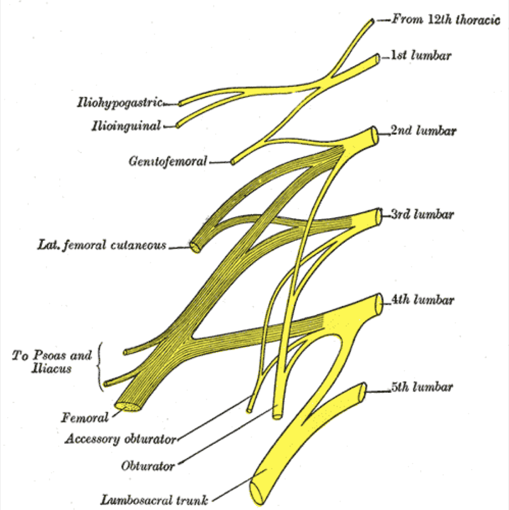

*Gray's Anatomy (1918), public domain — via Wikimedia Commons. The lumbar plexus forms within the psoas; its branches migrate **ventrally as you descend**, making L4–5 the highest-risk level.*

---

<!-- BEGIN CURATED LITERATURE -->

## High-Yield Literature

- **Transpsoas Approaches to the Lumbar Spine: Lateral and Prone** — White MD. Neurosurgery clinics of North America 2023. [PubMed](https://pubmed.ncbi.nlm.nih.gov/37718107/)
- **Minimally invasive lateral transpsoas approach to the lumbar spine: pitfalls and complication avoidance** — Graham RB. Neurosurgery clinics of North America 2014. [PubMed](https://pubmed.ncbi.nlm.nih.gov/24703442/)
- **Prone Transpsoas Lateral Lumbar Interbody Fusion for Degenerative Lumbar Spine Disease: Case Series With an Operative Video Using Fluoroscopy-Based Instrument Tracking Guidance** — Soliman MAR. Operative neurosurgery (Hagerstown, Md.) 2022. [PubMed](https://pubmed.ncbi.nlm.nih.gov/36227242/)
- **Lateral transpsoas lumbar interbody fusion: outcomes and deformity correction** — Dahdaleh NS. Neurosurgery clinics of North America 2014. [PubMed](https://pubmed.ncbi.nlm.nih.gov/24703453/)
- **Endoscopic lateral transpsoas approach to the lumbar spine** — Bergey DL. Spine 2004. [PubMed](https://pubmed.ncbi.nlm.nih.gov/15284517/)
- **Transpsoas Approach Nuances** — Hlubek RJ. Neurosurgery clinics of North America 2018. [PubMed](https://pubmed.ncbi.nlm.nih.gov/29933808/)
- **Lateral Transpsoas Interbody Fusion** — Sullivan TB. International journal of spine surgery 2025. [PubMed](https://pubmed.ncbi.nlm.nih.gov/39773399/)
- **Prone transpsoas lumbar corpectomy: simultaneous posterior and lateral lumbar access for difficult clinical scenarios** — Gandhi SD. Journal of neurosurgery. Spine 2021. [PubMed](https://pubmed.ncbi.nlm.nih.gov/34171838/)
- **The lateral transpsoas approach to the lumbar and thoracic spine: A review** — Arnold PM. Surgical neurology international 2012. [PubMed](https://pubmed.ncbi.nlm.nih.gov/22905326/)
- **Minimally invasive lateral retroperitoneal transpsoas approach for lumbar corpectomy and fusion with posterior instrumentation** — Srinivasan ES. Neurosurgical focus: Video 2022. [PubMed](https://pubmed.ncbi.nlm.nih.gov/36284723/)

<!-- END CURATED LITERATURE -->

---

<!-- BEGIN CURATED IMAGE SET -->

## Curated Image Set

Open-access figures are embedded from PubMed Central articles and kept unique to this guide.

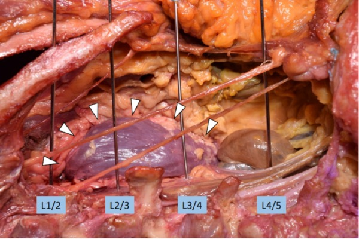
*Figure 1. Measurement of the closest distance from the wire for the disc space of L1/2, L2/3 and L3/4 to the kidney (arrowheads). Source: [Anatomical Study of the Extreme Lateral Transpsoas Lumbar Interbody Fusion with Application to Minimizing Injury to the Kidney](https://pmc.ncbi.nlm.nih.gov/articles/PMC5875975/) — Cureus 2018; CC BY.*

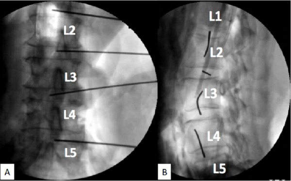
*Figure 2. Fluoroscopy of the wire trajectory. Note that all the wires are within disc spaces.A: Lateral viewB: Posterior-anterior view Source: [Anatomical Study of the Extreme Lateral Transpsoas Lumbar Interbody Fusion with Application to Minimizing Injury to the Kidney](https://pmc.ncbi.nlm.nih.gov/articles/PMC5875975/) — Cureus 2018; CC BY.*

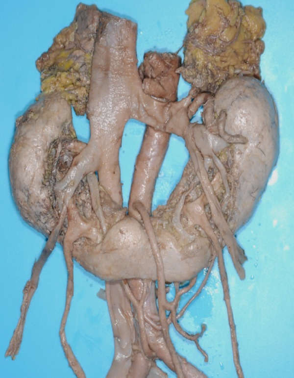
*Figure 3. Horseshoe kidney.Slightly lower than normal kidney and often having aberrant renal arteries. Source: [Anatomical Study of the Extreme Lateral Transpsoas Lumbar Interbody Fusion with Application to Minimizing Injury to the Kidney](https://pmc.ncbi.nlm.nih.gov/articles/PMC5875975/) — Cureus 2018; CC BY.*

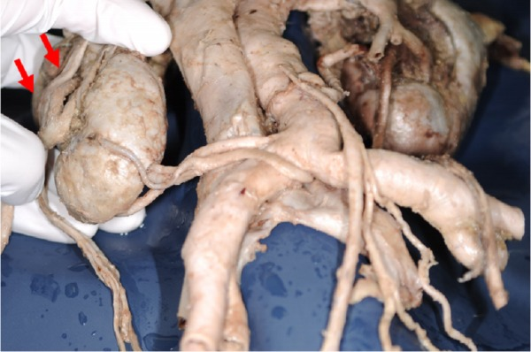
*Figure 4. Laterally malrotated kidney.Right renal artery entering the laterally faced hilum (arrows). Source: [Anatomical Study of the Extreme Lateral Transpsoas Lumbar Interbody Fusion with Application to Minimizing Injury to the Kidney](https://pmc.ncbi.nlm.nih.gov/articles/PMC5875975/) — Cureus 2018; CC BY.*

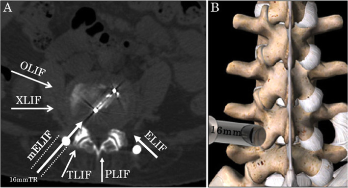
*Fig. 1. Schema of the approach. a Schema on a CT axial image. The approach for mELIF is more lateral than that of TLIF. The spinal canal is not surgically invaded. b Drawing from the posterior... Source: [Microendoscopy-assisted extraforaminal lumbar interbody fusion for treating single-level spondylodesis](https://pmc.ncbi.nlm.nih.gov/articles/PMC7923334/) — Journal of Orthopaedic Surgery and Research 2021; CC BY.*

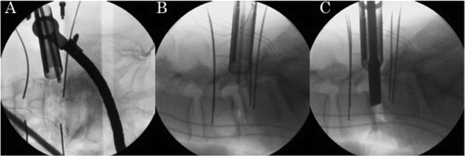
*Fig. 2. Fluoroscopic images during surgery. a A tubular retractor with a microendoscope installed posterolaterally on the anteroposterior view. Four percutaneous pedicle screw guide wires were... Source: [Microendoscopy-assisted extraforaminal lumbar interbody fusion for treating single-level spondylodesis](https://pmc.ncbi.nlm.nih.gov/articles/PMC7923334/) — Journal of Orthopaedic Surgery and Research 2021; CC BY.*

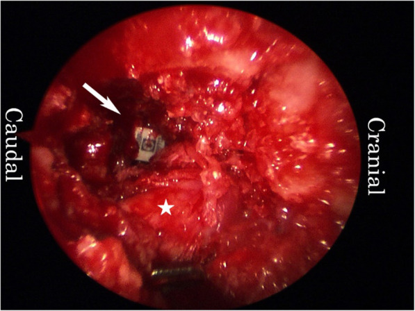
*Fig. 3. Endoscopic image. An interbody cage was inserted into the disc space. Arrow head: cage. Asterisk: right L5 exiting nerve root Source: [Microendoscopy-assisted extraforaminal lumbar interbody fusion for treating single-level spondylodesis](https://pmc.ncbi.nlm.nih.gov/articles/PMC7923334/) — Journal of Orthopaedic Surgery and Research 2021; CC BY.*

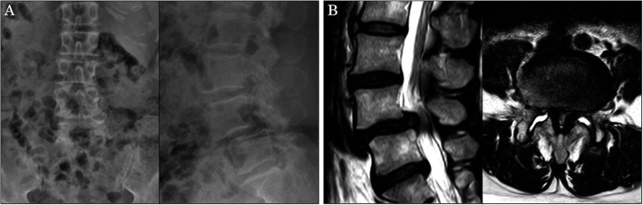
*Fig. 4. Images at presentation. a Anteroposterior and lateral X-ray films. Note grade II spondylolisthesis at L4/5. b Sagittal and axial magnetic resonance images. The spinal canal is severely... Source: [Microendoscopy-assisted extraforaminal lumbar interbody fusion for treating single-level spondylodesis](https://pmc.ncbi.nlm.nih.gov/articles/PMC7923334/) — Journal of Orthopaedic Surgery and Research 2021; CC BY.*

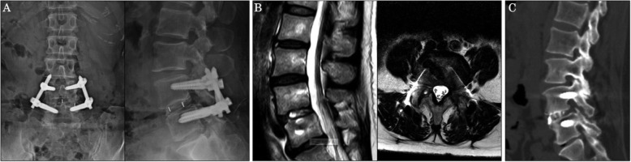
*Fig. 5. Images at 1-year post-surgery. a Anteroposterior and lateral X-ray films. Spondylolisthesis was corrected, and the hardware was in place. b Sagittal and axial magnetic resonance images.... Source: [Microendoscopy-assisted extraforaminal lumbar interbody fusion for treating single-level spondylodesis](https://pmc.ncbi.nlm.nih.gov/articles/PMC7923334/) — Journal of Orthopaedic Surgery and Research 2021; CC BY.*

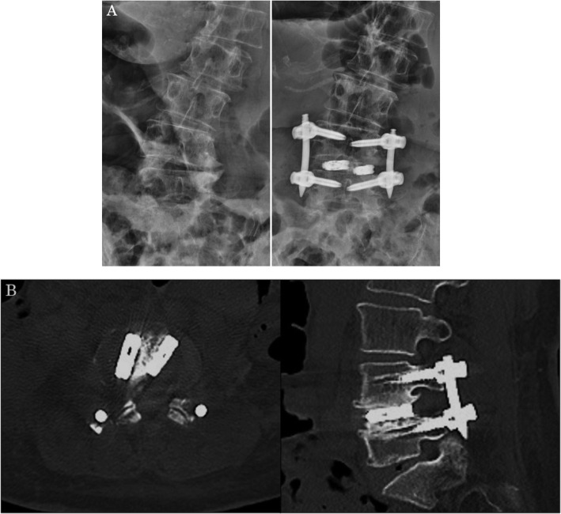
*Fig. 6. Insertion of two cages. a Anteroposterior X-ray films before and after surgery. b Computed tomography sagittal and axial images Source: [Microendoscopy-assisted extraforaminal lumbar interbody fusion for treating single-level spondylodesis](https://pmc.ncbi.nlm.nih.gov/articles/PMC7923334/) — Journal of Orthopaedic Surgery and Research 2021; CC BY.*

<!-- END CURATED IMAGE SET -->

---

## General Considerations
- **What it accesses:** **L1–2 to L4–5** disc spaces laterally (NOT **L5–S1** — the iliac crest blocks it; use [ALIF](../spine-degenerative/alif.md) or TLIF there). Often combined with posterior percutaneous screws.
- **Why a lateral cage:** a wide cage resting on the dense **apophyseal ring** restores disc/foraminal height (**indirect decompression**), corrects coronal deformity, and fuses — with far less posterior muscle damage than open PLIF/TLIF.
- **The plexus rule:** the lumbar plexus lies in the **posterior third** of the disc/vertebral body in the upper levels but the nerves **shift anteriorly at L4–5**, narrowing the safe window — hence **continuous/triggered EMG** and docking in the **mid-to-posterior disc "safe zone" (Moro zones)**, with caution at L4–5.
- **OLIF (anterior-to-psoas):** an oblique retroperitoneal window **in front of the psoas** avoids traversing the plexus but works next to the **great vessels/segmental vessels** — a different risk profile.

### Indications
- Degenerative disc disease, spondylolisthesis, **adjacent-segment disease**, recurrent stenosis needing indirect decompression → [XLIF/OLIF](../spine-degenerative/xlif-olif.md)
- **Adult degenerative scoliosis / coronal deformity** (powerful interbody correction) → [adult deformity](../spine-deformity/adult-spinal-deformity-osteotomy.md)
- Selected trauma/tumor/infection requiring anterior column support

### Relative contraindications
- **L5–S1** (iliac crest), severe rotatory scoliosis/retroperitoneal scarring, a **"rising/high" psoas** with anteriorly displaced plexus, prior retroperitoneal surgery.

---

## Relevant Surgical Anatomy
- **Layers (lateral, retroperitoneal):** skin → external oblique → internal oblique → transversus abdominis → **retroperitoneal fat** → **psoas major.**
- **Lumbar plexus:** forms within the psoas; **femoral nerve** and the motor components are **dorsal**; the **genitofemoral nerve runs on the ventral/anterior surface of the psoas** (groin/anterior-thigh symptoms if injured). **Subcostal/iliohypogastric/ilioinguinal** nerves cross the abdominal-wall corridor.
- **Anterior structures:** **aorta/IVC and iliac vessels**, **segmental vessels**, **sympathetic chain**, **ureter**, and bowel — anterior to the working zone (OLIF concern).
- **Disc/endplate:** target the **apophyseal ring**; violate the endplate → subsidence.

## Preoperative Evaluation
- **MRI:** **plexus position and psoas morphology** (axial — a "rising psoas" pushes nerves anterior), level, vascular anatomy; **side selection** (usually approach the concavity in scoliosis, away from great vessels). **Standing films** for alignment.
- Confirm **L5–S1 is not the target**; assess iliac crest height vs L4–5.

## Case-Selection and Side Strategy
- Best fit: L1-2 through L4-5 disc access for indirect decompression, coronal correction, disc-height restoration, and large-footprint interbody support when posterior-only access is less attractive.
- Caution/avoid: high iliac crest at L4-5, severe psoas migration/rising psoas, plexus anterior to the disc target, active infection through the corridor, retroperitoneal scarring, anomalous vessels, or severe central stenosis where indirect decompression is unlikely.
- Side selection balances deformity concavity, vascular position, prior abdominal/retroperitoneal surgery, symptoms, and the working-room available between rib, iliac crest, and plexus.
- Plan supplemental posterior fixation when instability, deformity correction, spondylolisthesis, osteoporosis, or multilevel constructs make standalone lateral cage failure likely.

## Logistics, OR Setup & Orders
- **Typical bed:** floor or step-down for elective degenerative exposure; ICU if trauma, myelopathy with cord signal change, major deformity, thoracic exposure, high EBL, or postoperative airway concern.
- **OR setup:** Jackson/radiolucent spine table or approach-specific lateral/anterior setup, C-arm/O-arm/navigation availability, microscope/loupes, neuromonitoring leads before positioning, and implant trays opened only after final level/plan confirmation.
- **Special needs:** arterial line and Foley for long instrumented cases, type/screen or crossmatch for deformity/corpectomy/trauma, antibiotic redosing plan, MAP support for SCI/myelopathy, and no long paralytic when MEPs are needed.
- **Immediate postop orders:** neuro checks focused on myotomes/sensory level, postop CT/X-rays per construct, brace/activity orders, drain output thresholds, DVT prophylaxis timing, dysphagia/airway monitoring for anterior cervical cases, and rehab mobilization plan.

## Anesthesia & Neuromonitoring
- GA; **continuous and triggered EMG is mandatory** (femoral/plexus), with no long-acting paralytic; fluoroscopy. Some add MEP/SSEP for deformity.

---

## Positioning

- **True 90° lateral decubitus**, secured to the table (tape at iliac crest, chest, legs); **break/flex the table** at the level to open the space between the iliac crest and ribs (and lengthen the lateral abdominal wall). Obtain **true orthogonal AP and lateral fluoroscopy** (the implant trajectory depends on it). Pad the down-side, axillary roll, flex the hip slightly to relax the psoas/plexus.

## Approach & Docking

1. **Lateral skin incision** over the target disc (± a second posterolateral incision for finger-guided retroperitoneal access); **bluntly split the abdominal-wall muscles** and enter the **retroperitoneal space**, sweeping the peritoneum/contents anteriorly.
2. Palpate the psoas and the transverse process; **dock the initial dilator on the disc at the safe zone (mid-to-posterior body; more anterior caution at L4–5)** under fluoroscopy.
3. **Traverse the psoas with sequential dilators under continuous/triggered EMG** — advance slowly, redirect if EMG thresholds drop (plexus nearby); seat the retractor and expose the disc.

## Discectomy & Interbody

- Complete discectomy, **release the contralateral annulus** (for correction/cage width), prepare endplates **without violating them** (subsidence), and place a **wide lateral cage on the apophyseal ring** (lordotic/large footprint). ± **lateral plate** and/or **posterior percutaneous pedicle screws.** Confirm position on fluoroscopy.

## Closure
- Confirm hemostasis and an intact peritoneum; allow the **psoas to fall back**; close the abdominal-wall layers and skin. No drain typically.

---

### Bony anatomy (vertebra / pedicle detail)

### Retroperitoneal corridor & psoas anatomy

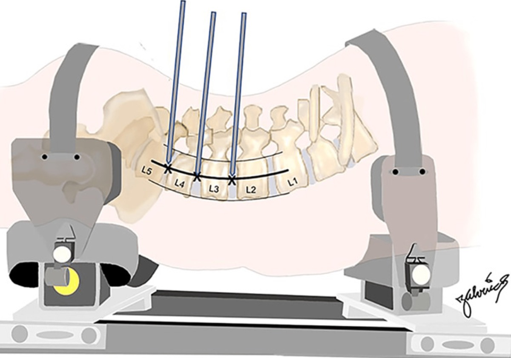

*Cureus 2023;15(7):e41733 — CC BY 4.0.*

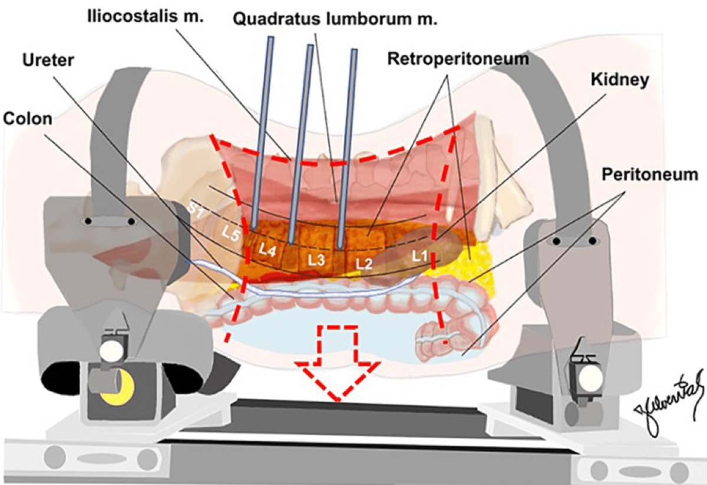

*Cureus 2023;15(7):e41733 — CC BY 4.0.*

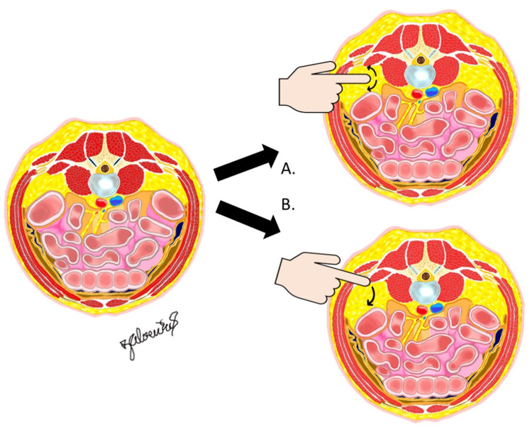

*Cureus 2023;15(7):e41733 — CC BY 4.0.*

## Nuances & Pitfalls (surgeon-level)
- **The lumbar plexus is the case.** Use continuous + triggered EMG, dock in the safe zone, traverse the psoas slowly, and **respect L4–5** (plexus most anterior). Expect **transient hip-flexor/psoas weakness and anterior-thigh numbness**; warn the patient.
- **Genitofemoral nerve** on the anterior psoas → groin/anterior-thigh dysesthesia; avoid anterior dissection on the psoas surface.
- **Endplate violation → subsidence**; prepare carefully and size the cage to the ring.
- **Great vessels/segmental vessels and ureter** are anterior (OLIF especially) — know where they are; control segmental bleeding.
- **Side selection & table break** determine the whole case — true lateral and true orthogonal fluoro are non-negotiable.
- **Not for L5–S1** (iliac crest) — plan ALIF/TLIF there.

## Intraoperative Rescue Logic
- **Low triggered EMG threshold while dilating:** stop, withdraw to a safe depth, redirect more anterior/posterior per anatomy and fluoroscopy, and abandon the level if no safe corridor exists.
- **Loss of true AP/lateral fluoroscopy:** reposition before docking or cage insertion; oblique imaging can make a safe-looking trajectory violate endplate, canal, or anterior vessels.
- **Peritoneal breach:** inspect bowel/contents, close or consult general surgery if significant, and do not leave the cage corridor contaminated or unstable.
- **Segmental/great-vessel bleeding:** pack, maintain exposure, avoid blind bipolar deep to psoas, and obtain vascular help early for brisk anterior bleeding.
- **Endplate fracture/subsidence during trialing:** upsize footprint only if safe, reduce distraction, consider supplemental posterior fixation, and avoid forcing lordosis through weak bone.
- **Postoperative femoral neuropathy:** check psoas hematoma with imaging if severe/progressive, document quadriceps/iliopsoas strength, and distinguish expected transient psoas irritation from compressive injury.

## Complications
**Lumbar plexus / femoral nerve injury** (quadriceps/hip-flexor weakness), **anterior-thigh numbness & groin pain (genitofemoral)**, transient psoas weakness; **cage subsidence**; vascular injury (great/segmental vessels — OLIF), ureteral/bowel injury; retroperitoneal hematoma; incisional hernia/abdominal-wall pseudohernia (flank bulge); pseudarthrosis.

---

## Cross-links
- Procedures: [XLIF / OLIF](../spine-degenerative/xlif-olif.md) · [ALIF](../spine-degenerative/alif.md) · [adult deformity](../spine-deformity/adult-spinal-deformity-osteotomy.md)
- Related corridors: [posterior-thoracolumbar-approach.md](posterior-thoracolumbar-approach.md) · [transthoracic-approach.md](transthoracic-approach.md)

## References
1. Ozgur BM, Aryan HE, Pimenta L, Taylor WR. **Extreme lateral interbody fusion (XLIF): a novel surgical technique for anterior lumbar interbody fusion.** *Spine J.* 2006;6(4):435–443.
2. Moro T, Kikuchi S, Konno S, Yaginuma H. **An anatomic study of the lumbar plexus with respect to retroperitoneal endoscopic surgery.** *Spine.* 2003;28(5):423–428.
3. Uribe JS, et al. **Defining the safe working zones using the lumbar plexus for lateral transpsoas approaches.** *J Neurosurg Spine.* 2011.
4. Benglis DM, Vanni S, Levi AD. **An anatomical study of the lumbosacral plexus as related to the lateral transpsoas approach.** *J Neurosurg Spine.* 2009.
5. AO Foundation. **Lateral lumbar interbody fusion.** AO Surgery Reference. [link](https://surgeryreference.aofoundation.org)
