# Operative Approach: Transthoracic (Anterior Thoracic) Approach to the Spine

<!-- BEGIN CASE SNAPSHOT -->

## Case / Approach Snapshot

- **Anatomy at risk:** lung/pleura, ribs/intercostal bundle, sympathetic chain, thoracic duct, esophagus, aorta/azygos/segmental vessels, artery of Adamkiewicz/radiculomedullary supply, diaphragm at the thoracolumbar junction, ventral dura, and watershed thoracic cord.
- **Operative steps:** confirm level and side, assess pulmonary/vascular tolerance, position lateral with lung isolation, open thoracotomy/VATS/retropleural corridor, control segmental vessels selectively, preserve cord blood supply, decompress ventral pathology away from the cord, reconstruct anterior column, place chest tube, and close with pulmonary/CSF/chyle surveillance.
- **Rescue plans:** wrong-level exposure, hypoxia or failed lung isolation, segmental/aortic/azygos bleeding, Adamkiewicz or cord ischemia, pleural violation/air leak, thoracic duct injury/chylothorax, transdural calcified disc CSF leak, cage/plate malposition, and need for posterior supplemental fixation.
- **Figures:** review [Figures, Imaging & Video](#figures-imaging--video) and the [Curated Image Set](#curated-image-set); embedded local figures should remain open-access, public-domain, or otherwise reusable with attribution.
- **Papers:** review [High-Yield Literature](#high-yield-literature) for seminal sources, modern reviews, and outcome data specific to this page.

<!-- END CASE SNAPSHOT -->

## Figures, Imaging & Video

**🎥 Operative video** — [search operative video on YouTube ▸](https://www.youtube.com/results?search_query=thoracic+spine+tumour+surgery) · [The Neurosurgical Atlas ▸](https://www.neurosurgicalatlas.com)

[AO Spine / Surgery Reference — anterior thoracic](https://www.aofoundation.org/spine) · [Neurosurgical Atlas — Spine](https://www.neurosurgicalatlas.com) · [Radiopaedia — thoracic disc/tumour](https://radiopaedia.org/search?q=thoracic%20disc%20calcified&scope=all) · [PubMed Central — transthoracic corpectomy](https://www.ncbi.nlm.nih.gov/pmc/?term=transthoracic+thoracic+corpectomy)

---

<!-- BEGIN CURATED LITERATURE -->

## High-Yield Literature

- **Transthoracic approaches to thoracic disc herniations** — Vollmer DG. Neurosurgical focus 2000. [PubMed](https://pubmed.ncbi.nlm.nih.gov/16833250/)
- **Microsurgical anatomy and related techniques to an anterolateral transthoracic approach to thoracic disc herniations** — Safdari H. Surgical neurology 1985. [PubMed](https://pubmed.ncbi.nlm.nih.gov/3992459/)
- **Surgical treatment of the symptomatic herniated thoracic disk** — Rogers MA. Clinical orthopaedics and related research 1994. [PubMed](https://pubmed.ncbi.nlm.nih.gov/8131358/)
- **Anterior thoracic foraminotomy through mini-thoracotomy for the treatment of giant thoracic disc herniations** — Russo A. European spine journal : official publication of the European Spine Society, the European Spinal Deformity Society, and the European Section of the Cervical Spine Research Society 2012. [PubMed](https://pubmed.ncbi.nlm.nih.gov/22430542/)
- **Surgical treatment of ossification of the posterior longitudinal ligament in the thoracic spine** — Kojima T. Neurosurgery 1994. [PubMed](https://pubmed.ncbi.nlm.nih.gov/8052382/)
- **SPINAL DUMBBELL EPIDURAL HEMANGIOMA: TWO STAGE/SAME SITTING/SAME POSITION POSTERIOR MICROSURGICAL AND TRANSTHORACIC ENDOSCOPIC RESECTION - CASE REPORT AND REVIEW OF THE LITERATURE** — Pojskić M. Acta clinica Croatica 2018. [PubMed](https://pubmed.ncbi.nlm.nih.gov/31168222/)
- **Multilevel anterior thoracic discectomies and anterior interbody fusion using a microsurgical thoracoscopic approach. Case report** — Dickman CA. Journal of neurosurgery 1996. [PubMed](https://pubmed.ncbi.nlm.nih.gov/8613815/)
- **Thoracic disc herniation: Surgical treatment** — Court C. Orthopaedics & traumatology, surgery & research : OTSR 2018. [PubMed](https://pubmed.ncbi.nlm.nih.gov/29225115/)
- **Burnei's anterior transthoracic retropleural approach of the thoracic spine: a new operative technique in the treatment of spinal disorders** — Gavriliu TS. Journal of medicine and life 2015. [PubMed](https://pubmed.ncbi.nlm.nih.gov/25866572/)
- **En-bloc resection of giant neuroma of thoracic spine via transthoracic extrapleural access: a case report and literature review** — Lisitsky IY. Zhurnal voprosy neirokhirurgii imeni N. N. Burdenko 2023. [PubMed](https://pubmed.ncbi.nlm.nih.gov/36763558/)

<!-- END CURATED LITERATURE -->

<!-- BEGIN CURATED IMAGE SET -->

## Curated Image Set

Open-access figures are embedded from PubMed Central articles and kept unique to this guide.

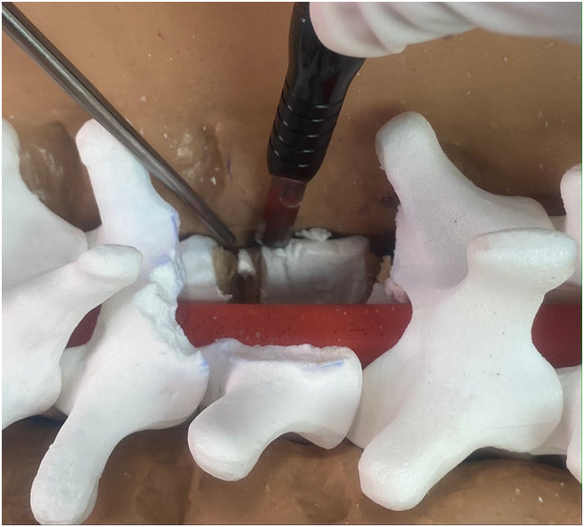
*Fig. 1. The fine tip of the ultrasonic bone scalpel allows the lateral vertebral body to be carefully tailored to the desired width rather than resected en toto as demonstrated on this molded... Source: [A rib-sparing unilateral transpedicular thoracic corpectomy using the ultrasonic bone scalpel: a novel technique and pictorial guide](https://pmc.ncbi.nlm.nih.gov/articles/PMC11466036/) — BMC Surgery 2024; CC BY-NC-ND.*

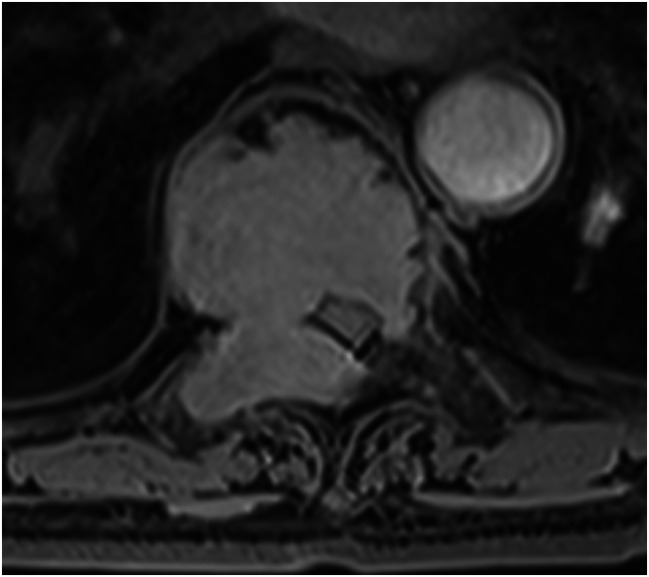
*Fig. 3. An axial post-gadolinium T1-weighted image of the thoracic spine in an elderly female demonstrating a homogeneously enhancing mass at T8 with pathology consistent with a plasma cell neoplasm Source: [A rib-sparing unilateral transpedicular thoracic corpectomy using the ultrasonic bone scalpel: a novel technique and pictorial guide](https://pmc.ncbi.nlm.nih.gov/articles/PMC11466036/) — BMC Surgery 2024; CC BY-NC-ND.*

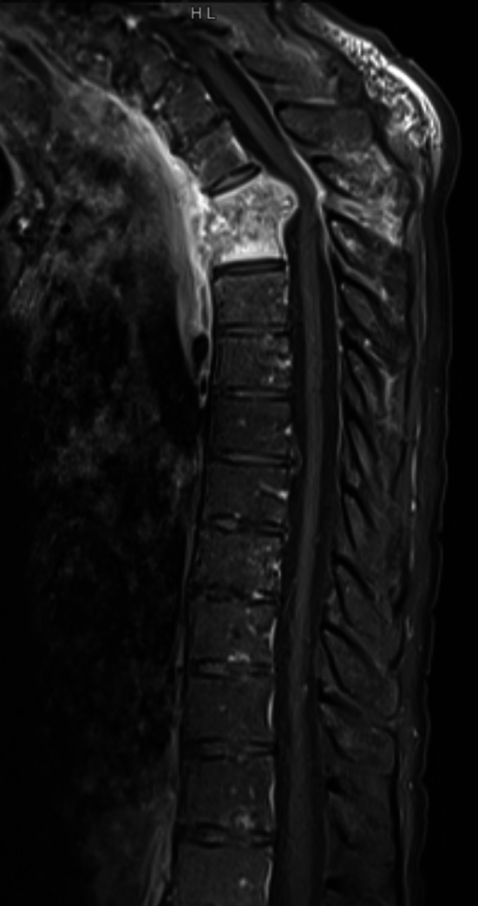
*Fig. 5. A sagittal post-gadolinium T1-weighted image of the thoracic spine in an elderly male demonstrating disc-osteomyelitis of the T3 and T4 vertebral bodies with acute kyphotic deformity,... Source: [A rib-sparing unilateral transpedicular thoracic corpectomy using the ultrasonic bone scalpel: a novel technique and pictorial guide](https://pmc.ncbi.nlm.nih.gov/articles/PMC11466036/) — BMC Surgery 2024; CC BY-NC-ND.*

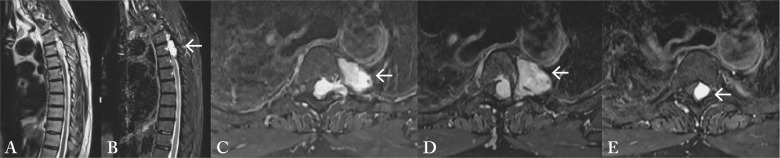
*Fig. 1. MRI of the thoracic spine: (A) T2-weighted sagittal sequence showing the intraspinal tumor T3-5 with hyperintense signal (arrow); (B) post-contrast T1-weighted sagittal sequences showed... Source: [SPINAL DUMBBELL EPIDURAL HEMANGIOMA: TWO STAGE/SAME SITTING/SAME POSITION POSTERIOR MICROSURGICAL AND TRANSTHORACIC ENDOSCOPIC RESECTION – CASE REPORT AND REVIEW OF THE LITERATURE](https://pmc.ncbi.nlm.nih.gov/articles/PMC6544093/) — Acta Clinica Croatica 2018; CC BY-NC-ND.*

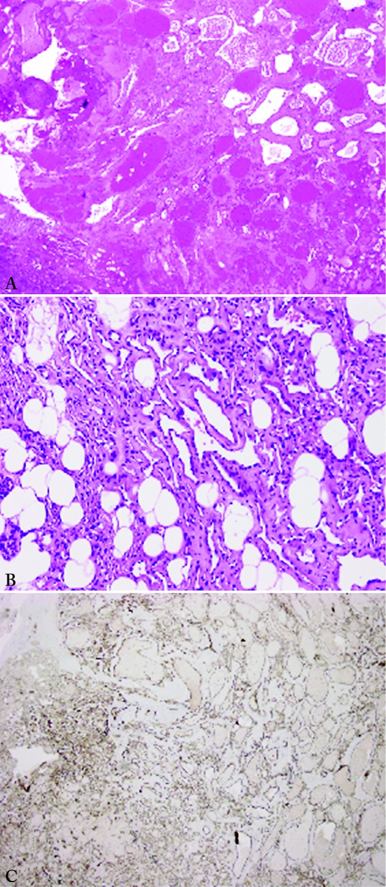
*Fig. 2. Tumor composition of variably-sized vessels and capillaries that permeate adipose tissue: (A) low power; (B) high power. Immunostaining showed that vessels were positive for CD31... Source: [SPINAL DUMBBELL EPIDURAL HEMANGIOMA: TWO STAGE/SAME SITTING/SAME POSITION POSTERIOR MICROSURGICAL AND TRANSTHORACIC ENDOSCOPIC RESECTION – CASE REPORT AND REVIEW OF THE LITERATURE](https://pmc.ncbi.nlm.nih.gov/articles/PMC6544093/) — Acta Clinica Croatica 2018; CC BY-NC-ND.*

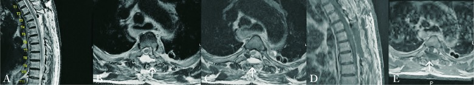
*Fig. 3. Postoperative MRI of the thoracic spine: (A) T2-weighted sagittal sequence showing complete resection of the tumor; (B, C) T2-weighted axial sequences; (D) post-contrast T1-weighted... Source: [SPINAL DUMBBELL EPIDURAL HEMANGIOMA: TWO STAGE/SAME SITTING/SAME POSITION POSTERIOR MICROSURGICAL AND TRANSTHORACIC ENDOSCOPIC RESECTION – CASE REPORT AND REVIEW OF THE LITERATURE](https://pmc.ncbi.nlm.nih.gov/articles/PMC6544093/) — Acta Clinica Croatica 2018; CC BY-NC-ND.*

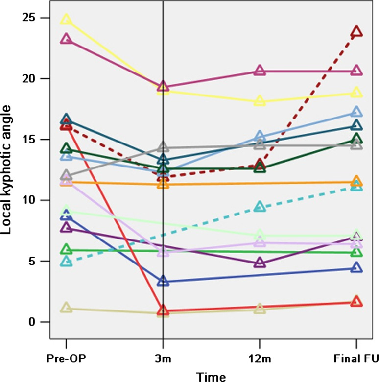
*Fig. 5. The lines represent the 16 patients who attended the final follow-up and the small triangles represent the local kyphotic angles of the fusion levels before surgery (Pre-OP), at 3 months... Source: [Circumspinal decompression and fusion through a posterior midline incision to treat central calcified thoracolumbar disc herniation: a minimal 2-year follow-up study with reconstruction CT](https://pmc.ncbi.nlm.nih.gov/articles/PMC3906463/) — European Spine Journal 2013; CC BY.*

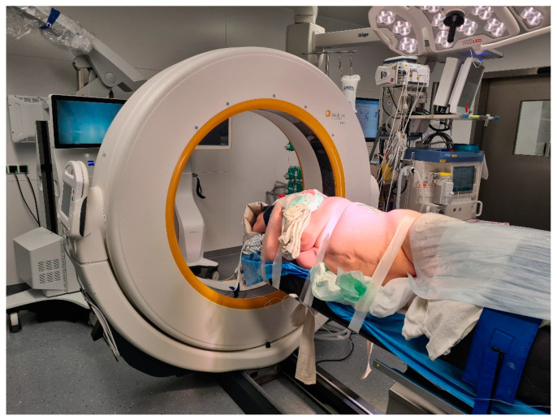
*Figure 1. Lateral decubitus position of the patient for a left lateral transthoracic transpleural approach (patient Number 6). Source: [Surgical Treatment of Calcified Thoracic Herniated Disc Disease via the Transthoracic Approach with the Use of Intraoperative Computed Tomography (iCT) and Microscope-Based Augmented Reality (AR)](https://pmc.ncbi.nlm.nih.gov/articles/PMC11206109/) — Medicina 2024; CC BY.*

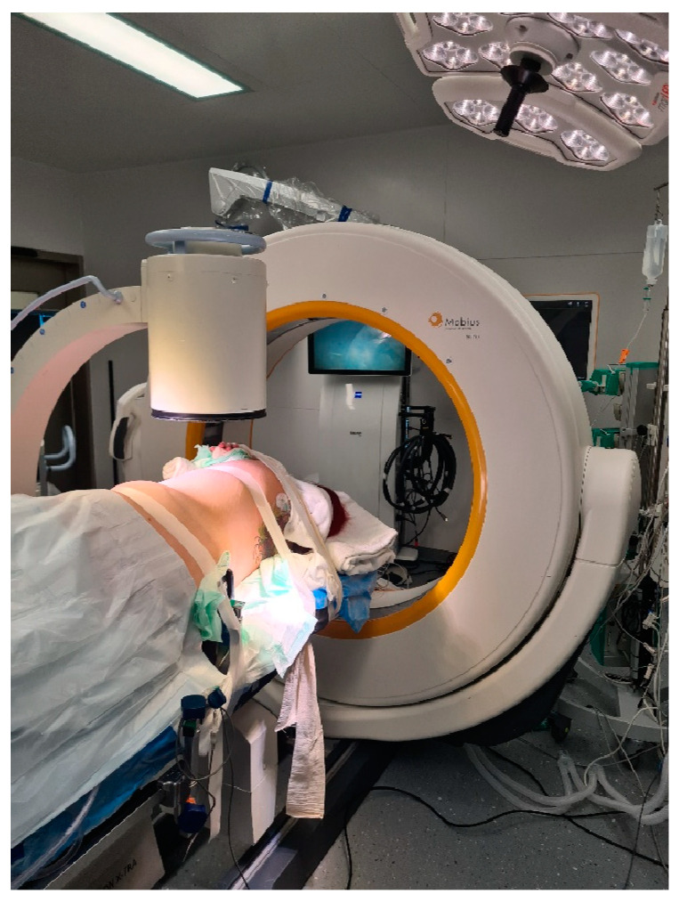
*Figure 2. Use of standard C-arm X-ray for level definition prior to skin incision (same as Figure 1). Source: [Surgical Treatment of Calcified Thoracic Herniated Disc Disease via the Transthoracic Approach with the Use of Intraoperative Computed Tomography (iCT) and Microscope-Based Augmented Reality (AR)](https://pmc.ncbi.nlm.nih.gov/articles/PMC11206109/) — Medicina 2024; CC BY.*

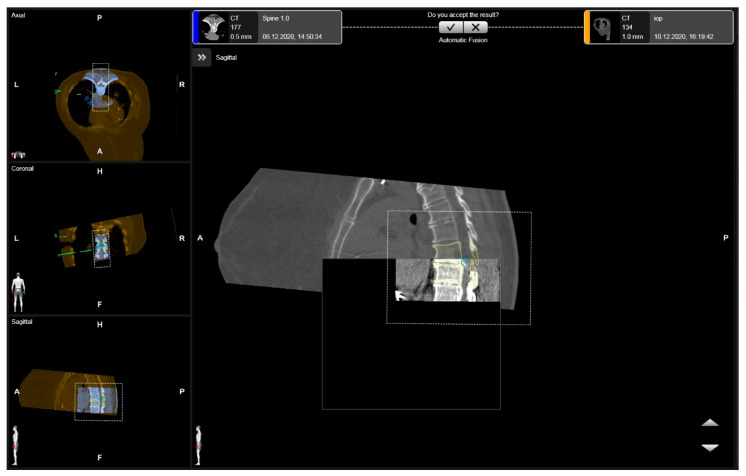
*Figure 3. Rigid fusion of levels of interest, with the segmented vertebras in yellow and the herniated disc in blue in the axial, coronal, and sagittal views (patient number 3). Source: [Surgical Treatment of Calcified Thoracic Herniated Disc Disease via the Transthoracic Approach with the Use of Intraoperative Computed Tomography (iCT) and Microscope-Based Augmented Reality (AR)](https://pmc.ncbi.nlm.nih.gov/articles/PMC11206109/) — Medicina 2024; CC BY.*

<!-- END CURATED IMAGE SET -->

The transthoracic approach reaches the **front of the thoracic vertebral bodies** — for **corpectomy and anterior reconstruction, ventral cord decompression** (calcified central disc, retropulsed burst fragment, tumor, infection), and deformity. It is performed as an **open thoracotomy**, **thoracoscopic (VATS)**, or **mini-open lateral retropleural** exposure, with **single-lung ventilation** to deflate the lung and open the corridor. Its power is **direct ventral access to the cord without any cord retraction**; its demands are pulmonary, vascular (segmental arteries / artery of Adamkiewicz), and thoracic-access expertise.

---

## General Considerations
- **What it accesses:** the **anterior/lateral thoracic vertebral bodies and discs (≈T2–T12)** and the **ventral thecal sac/cord** — for direct decompression and anterior column reconstruction (cage/plate).
- **Why anterior:** central thoracic pathology (calcified disc, retropulsed fragment, tumor, abscess) sits **ventral to the cord**; a posterior laminectomy would require **catastrophic cord retraction**, so the lesion is reached **from the front/side and pushed away from the cord** (see [thoracic discectomy](../spine-degenerative/thoracic-discectomy.md), [anterior thoracic corpectomy](../spine-degenerative/anterior-thoracic-corpectomy.md)).
- **Access options:** **open thoracotomy** (widest, for large/multilevel/tumor), **thoracoscopic/VATS** (less morbidity, steep learning curve), **mini-open lateral retropleural** (avoids entering the pleural cavity).
- **Side of approach:** generally **left for mid-thoracic** (the aorta is more forgiving/repairable than the IVC/liver), **right for upper thoracic** (avoid the heart/aortic arch and great vessels) — but **the artery of Adamkiewicz** (usually left, T8–L1) and the lesion side modify this.

### Indications
- **Calcified central thoracic disc with myelopathy** → [thoracic discectomy](../spine-degenerative/thoracic-discectomy.md)
- **Thoracic corpectomy / reconstruction** — burst fracture, tumor, infection → [anterior thoracic corpectomy](../spine-degenerative/anterior-thoracic-corpectomy.md), [vertebral corpectomy](../spine-tumor/vertebral-corpectomy.md)
- Anterior deformity correction / release

### Access Selection

| Pathology / patient factor | Open thoracotomy | VATS / thoracoscopic | Mini-open retropleural |
|----------------------------|------------------|----------------------|------------------------|
| Large tumor, multilevel corpectomy, major reconstruction | Best exposure/control | Limited | Sometimes inadequate |
| Calcified central disc | Strong direct access | Possible in expert hands | Useful for selected lateral/ventral targets |
| Poor pulmonary reserve | More morbidity | Less incision morbidity but still lung isolation | May avoid pleural cavity |
| Need vascular control | Best | Limited | Limited-moderate |
| Thoracolumbar junction | Thoracoabdominal extension may be needed | Less common | Retropleural/retroperitoneal blend useful |
| Revision pleural disease | Adhesions make difficult | Often difficult | Retropleural may help |

Choose the exposure that gives safe ventral decompression and reconstruction, not just the smallest incision. A minimally invasive thoracic corridor that cannot control a bleeding segmental vessel or calcified transdural disc is the wrong minimally invasive corridor.

---

## Relevant Surgical Anatomy
- **Chest wall & cavity:** ribs (a **rib over/one above the level is resected** for access and graft), intercostal bundles, **parietal pleura, lung**; the **diaphragm** (a thoraco-abdominal/retropleural extension reaches the **thoracolumbar junction T12–L1**).
- **Great vessels:** **aorta and azygos vein**, **segmental (intercostal) arteries** crossing the vertebral bodies — **ligated at the mid-body** at the involved level(s), **preserving the artery of Adamkiewicz** (the dominant radiculomedullary feeder; cord infarction if sacrificed).
- **Other:** **sympathetic chain** (on the lateral bodies), **thoracic duct** (left, lower thoracic — chylothorax), **esophagus** (anterior).
- **Spinal:** vertebral body/disc, **posterior longitudinal ligament**, ventral dura and the **watershed thoracic cord** (low ischemic tolerance — no retraction).

---

## Preoperative Evaluation
- **Pulmonary function** (single-lung ventilation/thoracotomy tolerance), cardiac assessment.
- **CT/MRI** — level, ventral compression, calcification/dural involvement, body destruction; **CTA for segmental vessels / artery of Adamkiewicz** and great-vessel anatomy (influences side).
- **Level localization plan** — thoracic counting is notoriously error-prone (count from C2 and the sacrum, use a fiducial/rib, confirm intraoperatively). **Type & crossmatch.**

### Side and Vascular Planning
- Map the artery of Adamkiewicz and dominant radiculomedullary feeders when feasible; avoid sacrificing the dominant feeder level.
- Left-sided approaches are common for mid/lower thoracic anterior bodies, but a left Adamkiewicz, aortic pathology, prior thoracotomy, or lesion laterality can change the plan.
- Right upper thoracic approaches may avoid the aortic arch/heart but bring azygos and vena caval/liver considerations.
- Identify calcified transdural disc signs on CT/MRI; these cases need a CSF-leak and dural-repair plan before decompression.
- Decide preoperatively whether posterior supplemental fixation is needed for instability, multicolumn disease, deformity, infection, or poor bone quality.

## Logistics, OR Setup & Orders
- **OR table/bed:** radiolucent table configured for lateral or anterior thoracic exposure, with C-arm access and chest/vascular exposure needs coordinated before positioning.
- **OR setup:** Jackson/radiolucent spine table or approach-specific lateral/anterior setup, C-arm/O-arm/navigation availability, microscope/loupes, neuromonitoring leads before positioning, and implant trays opened only after final level/plan confirmation.
- **Special needs:** arterial line and Foley for long instrumented cases, type/screen or crossmatch for deformity/corpectomy/trauma, antibiotic redosing plan, MAP support for SCI/myelopathy, and no long paralytic when MEPs are needed.
- **Immediate postop orders:** neuro checks focused on myotomes/sensory level, postop CT/X-rays per construct, brace/activity orders, drain output thresholds, DVT prophylaxis timing, dysphagia/airway monitoring for anterior cervical cases, and rehab mobilization plan.

## Anesthesia & Neuromonitoring
- GA with a **double-lumen tube / bronchial blocker (lung isolation)**; arterial line, central access, **crossmatched blood/cell saver**; **SSEP/MEP** with **MAP support** for the cord; **no paralytic** with MEPs. A **thoracic/access surgeon** commonly assists; **chest tube** at closure.

---

## Positioning

- **OR table/bed:** radiolucent table configured for lateral or anterior thoracic exposure, with C-arm access and chest/vascular exposure needs coordinated before positioning.
- **Lateral decubitus** (side up = side of approach), **table flexed** to open the rib interspaces, axillary roll, arms supported forward; **operative-side lung deflated.** Fluoroscopy/navigation and IONM baselines before incision.

## Exposure

1. **Thoracotomy** over the appropriate rib (often the rib 1–2 levels above the target; the rib is harvested for graft) — or **thoracoscopic portals**; **deflate the lung.**
2. **Reflect the parietal pleura** over the spine; identify and **ligate the segmental vessels at the mid-vertebral-body level** of the involved segment(s) — **preserve the artery of Adamkiewicz** per CTA.
3. **Confirm the level** (fluoroscopy) before bone work.

## Decompression & Reconstruction

- **Discectomies above and below**, then **corpectomy** with **ventral decompression of the canal** (remove the retropulsed fragment/calcified disc/tumor away from the cord — never toward it). Reconstruct the anterior column with an **expandable cage/mesh + graft** and **anterior instrumentation (lateral plate/rod)**; add **posterior fixation** for unstable/3-column injuries. **Chest tube**, re-inflate the lung.

### Decompression Sequence
1. Confirm level with fluoroscopy/navigation before rib resection and before vertebral body drilling.
2. Control segmental vessels at the mid-body only after confirming the vascular plan; preserve critical radiculomedullary supply.
3. Create a working cavity in disc/body first, then thin ventral compressive pathology into that cavity.
4. For calcified discs, detach lateral/ventral margins before teasing the fragment away from dura; never lever a hard fragment into the cord.
5. For tumor/infection, obtain pathology/cultures early and plan margins/debridement with reconstruction and adjuvant therapy in mind.
6. Size cage/graft under compression and image confirmation; avoid over-distraction of the thoracic cord and segmental vessels.

### Intraoperative Rescue
- **MEP/SSEP loss:** raise MAP, stop vessel ligation/distraction, restore oxygenation/hemoglobin, reverse correction, inspect decompression/hardware, and consider revascularization implications if a segmental feeder was sacrificed.
- **Aortic/azygos/segmental bleeding:** pack with direct pressure, improve exposure, call vascular/thoracic help early, and avoid blind clamping near the cord blood supply.
- **Pleural/lung injury or failed single-lung ventilation:** pause spine work, repair air leak, optimize tube/bronchial blocker, and convert exposure if oxygenation is unsafe.
- **Chylothorax risk:** ligate thoracic duct injury when recognized; monitor milky/high-output chest drainage postoperatively.
- **Transdural disc CSF leak:** repair/patch from anterior corridor if possible, seal, drain strategy, and avoid leaving a sharp calcified remnant against the dura.

---

## Closure
- Confirm hemostasis and cord decompression; **place a chest tube**, re-expand the lung, and close the thoracotomy/portals in layers. Monitor chest-tube output (**air leak, effusion, chyle**). ICU with pulmonary care and serial neuro exams.

---

### Bony anatomy (vertebra / pedicle detail)

### Operative sequence (mini-thoracotomy example)

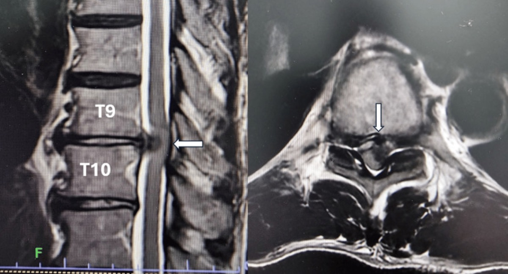

*Cureus 2025;17:e94142 — CC BY 4.0.*

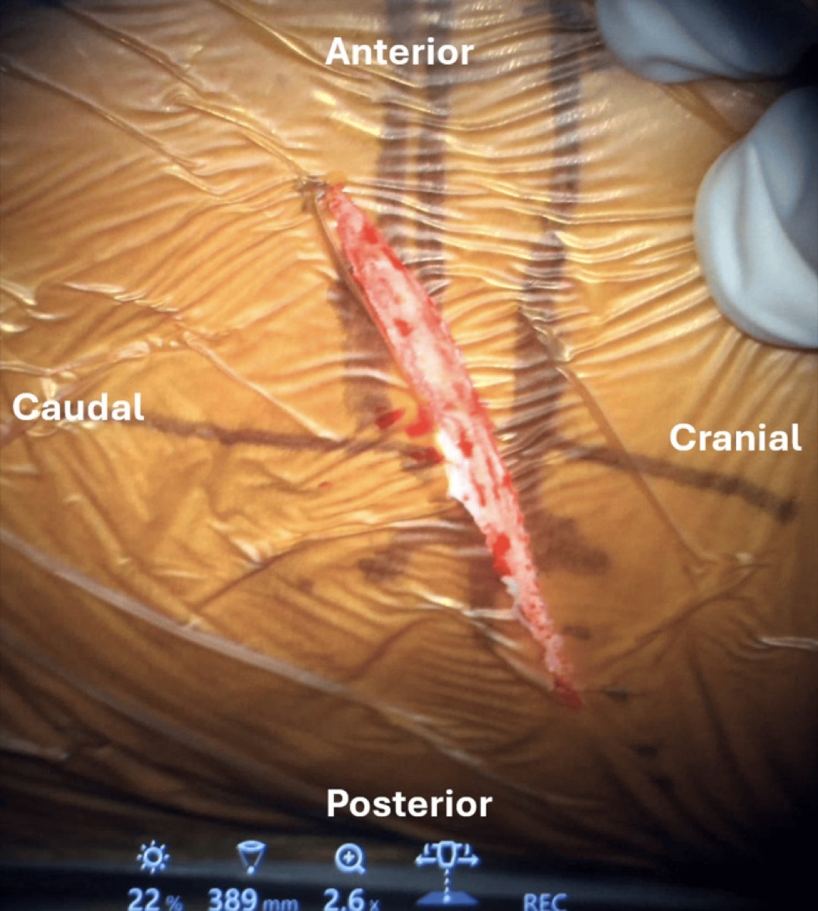

*Cureus 2025;17:e94142 — CC BY 4.0.*

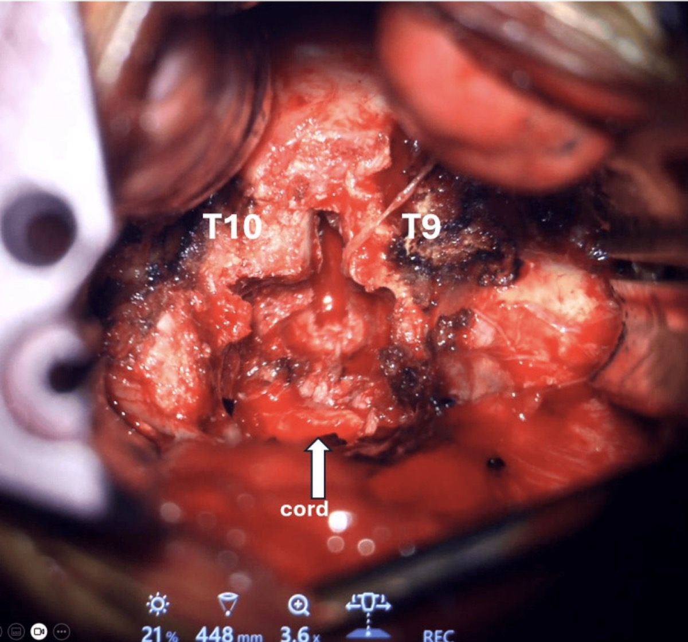

*Cureus 2025;17:e94142 — CC BY 4.0.*

## Nuances & Pitfalls (surgeon-level)
- **Protect the cord's blood supply** — identify and preserve the **artery of Adamkiewicz** (CTA), ligate segmental vessels **selectively at the mid-body**; cord infarction is devastating and avoidable.
- **No cord retraction** — reach ventral pathology from the side/front and deliver it **into the corpectomy/disc cavity, away from the cord.**
- **Wrong-level surgery** is a classic thoracic error — meticulous localization and intraoperative confirmation.
- **Pulmonary/pleural:** anticipate pneumothorax/effusion; **thoracic duct** injury on the left → **chylothorax** (monitor output); manage the chest tube.
- **Great-vessel proximity** (aorta/azygos) — careful segmental-vessel control; have vascular backup for tumor cases.
- **Thoracolumbar junction (T12–L1)** needs a **thoraco-abdominal/diaphragm-takedown** extension — plan diaphragm repair.

## Complications
**Cord injury / infarction (Adamkiewicz / segmental sacrifice)**; pulmonary (pneumothorax, effusion, atelectasis, prolonged air leak); **chylothorax**; great-vessel/hemorrhage; hardware subsidence/failure; CSF leak (calcified transdural disc); intercostal neuralgia/post-thoracotomy pain; approach-related morbidity.

---

## Cross-links
- Procedures: [thoracic discectomy](../spine-degenerative/thoracic-discectomy.md) · [anterior thoracic corpectomy](../spine-degenerative/anterior-thoracic-corpectomy.md) · [vertebral corpectomy](../spine-tumor/vertebral-corpectomy.md)
- Related corridors: [posterior-thoracolumbar-approach.md](posterior-thoracolumbar-approach.md) · [transpsoas-approach.md](transpsoas-approach.md)

<!-- BEGIN FIGURE USE ATTRIBUTION -->

## Figure Use & Attribution

> **About the figures.** Copyrighted operative figures/videos are **linked** (Neurosurgical Atlas, AO Spine / Surgery Reference); embedded images are **public-domain** (Gray's Anatomy), credited beneath each image. See [media-sources.md](../../resources/media-sources.md) and [figures/CREDITS.md](../../figures/CREDITS.md).
>
> **Technique references:** [AO Spine / Surgery Reference — Anterior thoracic](https://www.aofoundation.org/spine) · [Neurosurgical Atlas — Spine](https://www.neurosurgicalatlas.com) · [Radiopaedia — thoracic spine](https://radiopaedia.org/search?q=thoracic%20spine%20tumour&scope=all)

<!-- END FIGURE USE ATTRIBUTION -->

<!-- BEGIN COMMON PIMP QUESTIONS -->

## Common Pimp Questions

Use these to pressure-test preparation for **Transthoracic (Anterior Thoracic) Approach to the Spine**:

1. What patient position and head rotation make gravity work for this corridor?
2. What named nerve, vessel, sinus, or muscle/fascial plane is most commonly injured?
3. What bone work or soft-tissue step creates the exposure rather than simply using more retraction?
4. What is the bailout if exposure is inadequate, bleeding occurs, or the brain is tight?
5. What closure maneuver prevents the signature complication of this approach?

<!-- END COMMON PIMP QUESTIONS -->

<!-- BEGIN ATTENDING PREFERENCE VARIABLES -->

## Attending Preference Variables

Items that commonly vary by surgeon or institution:

- **Exact head rotation/flexion/extension and pin placement:** [attending-specific]
- **Skin incision length, flap type, and muscle/fascial preservation technique:** [attending-specific]
- **Drill, rongeur, endoscope, microscope, retractor, and navigation preferences:** [attending-specific]
- **Drain use, closure materials, watertightness threshold, and postop imaging routine:** [attending-specific]

<!-- END ATTENDING PREFERENCE VARIABLES -->

<!-- BEGIN REVERSE APPROACH LINKS -->

## Case Guides Using This Approach

- [Anterior Thoracic Corpectomy and Reconstruction (Transthoracic / Thoracoscopic)](../../cases/spine-degenerative/anterior-thoracic-corpectomy.md)
- [Thoracic Discectomy (Transpedicular / Costotransversectomy / Lateral Extracavitary / Thoracoscopic)](../../cases/spine-degenerative/thoracic-discectomy.md)
- [Vertebral Corpectomy and Reconstruction (Metastatic / Primary Vertebral Tumor)](../../cases/spine-tumor/vertebral-corpectomy.md)
- [Vertebral Osteomyelitis / Discitis — Surgical Management](../../cases/spine-infection/vertebral-osteomyelitis-discitis.md)

<!-- END REVERSE APPROACH LINKS -->

## References
1. AO Foundation. **Anterior approach to the thoracic and thoracolumbar spine.** AO Spine / Surgery Reference. [link](https://www.aofoundation.org/spine)
2. McCormick PC. **Retropleural/lateral extracavitary and transthoracic approaches to thoracic disc and tumor.**
3. Kaneda K, et al. **Anterior decompression and stabilization for thoracolumbar burst fractures.** *J Bone Joint Surg Am.* 1997.
4. Mulier S, Debois V. **Thoracoscopic anterior approaches to the thoracic spine** (VATS technique and outcomes).
