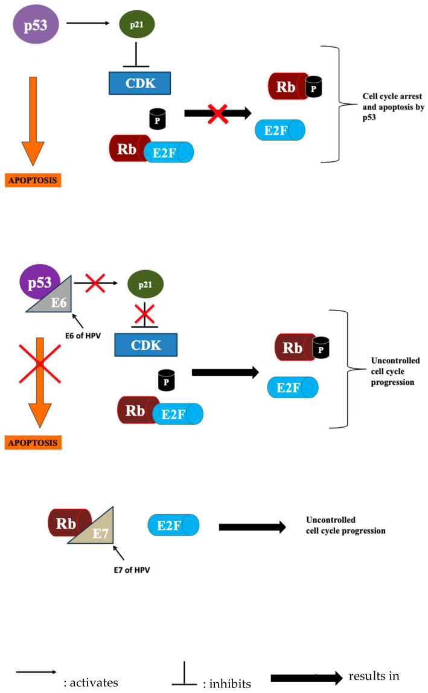
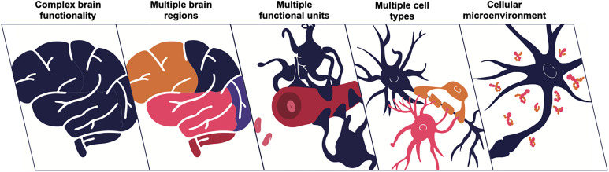
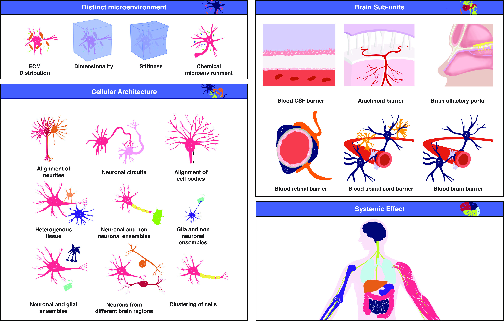
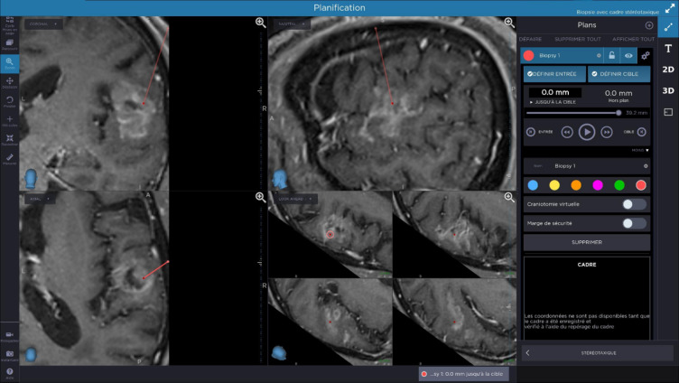
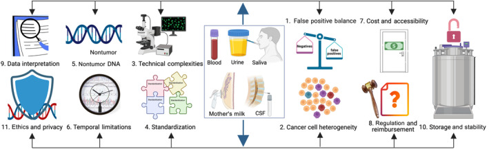
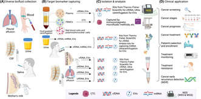
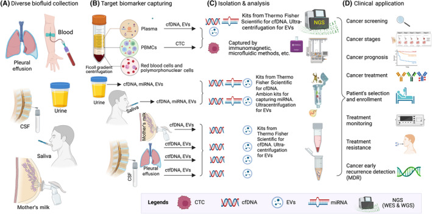
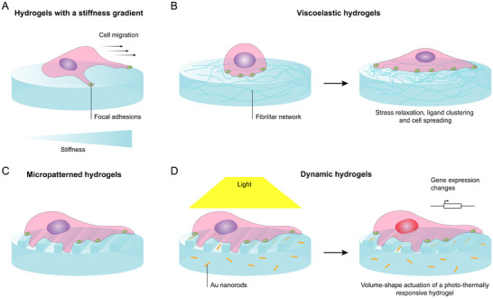
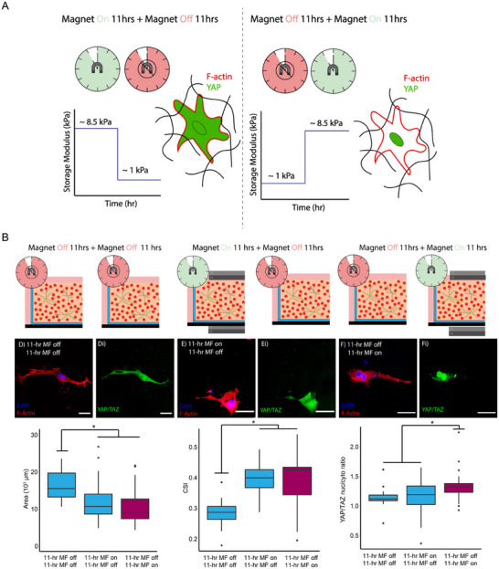
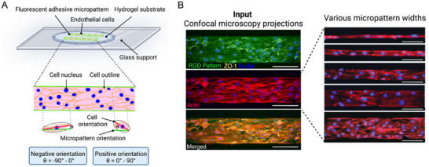

# Reference: Brain Biopsy Systems and Stereotactic Platforms

<!-- BEGIN CASE SNAPSHOT -->

## Case / Approach Snapshot

- **Anatomy at risk:** target margins, vascular/necrotic zones, entry cortex, sulci/vessels, ventricles, deep nuclei, and eloquent tracts along the trajectory.
- **Operative steps:** choose the safest diagnostic target, plan trajectory, verify registration or frame coordinates, obtain staged samples, confirm hemostasis/trajectory imaging, and coordinate pathology/molecular testing; use the detailed operative sequence and approach notes below as the step-by-step source.
- **Rescue plans:** nondiagnostic tissue, hemorrhage, seizure, edema, neurologic change, target shift, infection, and open biopsy or repeat sampling plan.
- **Figures:** review [Figures, Imaging & Video](#figures-imaging--video) and the [Curated Image Set](#curated-image-set); embedded local figures should remain open-access, public-domain, or otherwise reusable with attribution.
- **Papers:** review [High-Yield Literature](#high-yield-literature) for seminal sources, modern reviews, and outcome data specific to this page.

<!-- END CASE SNAPSHOT -->

## Figures, Imaging & Video

**🎥 Operative video** — [search operative video on YouTube ▸](https://www.youtube.com/results?search_query=Reference%3A+Brain+Biopsy+Systems+and+Stereotactic+Platforms+surgery) · [The Neurosurgical Atlas ▸](https://www.neurosurgicalatlas.com)

A comparison reference for choosing a brain biopsy technique and platform. See individual procedure files for framed, frameless, robotic, and open biopsy.

---

## 1. When to Biopsy (Indications)
- Diagnosis of a lesion that is **not safely or beneficially resectable**, or where tissue diagnosis changes management:
  - Deep/eloquent lesions (basal ganglia, thalamus, brainstem, pineal)
  - Multifocal disease, suspected **CNS lymphoma** (do NOT give steroids before biopsy if lymphoma suspected — can vanish/obscure diagnosis), infection vs tumor
  - Suspected high-grade glioma in non-resectable location
  - Immunocompromised (toxoplasmosis vs lymphoma), unclear etiology
- **Open biopsy** when a larger sample, decompression, or accessible superficial lesion makes open approach preferable

---

## 2. Stereotactic Platforms (Closed/Needle Biopsy)

### A. Frame-Based Stereotaxy
- **Systems:** Leksell (Elekta), CRW (Cosman-Roberts-Wells, Integra), ZD
- **Method:** rigid stereotactic frame fixed to skull → stereotactic CT/MRI → arc/coordinate system (x, y, z + arc/ring angles) directs the needle to target
- **Pros:** highest accuracy and rigidity (sub-millimeter), gold standard for deep/small targets, no reliance on intraoperative registration drift
- **Cons:** frame application (uncomfortable, awake placement), less flexible trajectory planning, separate imaging step, cumbersome for multiple targets
- See [stereotactic-brain-biopsy-framed](stereotactic-brain-biopsy-framed.md)

### B. Frameless Stereotaxy (Navigation-Based)
- **Systems:** Medtronic StealthStation, Brainlab (with skull fiducials or surface/mask registration), VarioGuide, navigation + biopsy needle guide/arm
- **Method:** preop thin-cut MRI/CT → intraoperative registration (fiducials/surface) → navigated trajectory with an aiming device/arm; needle passed along the planned trajectory
- **Pros:** no frame (more comfortable, often GA), flexible planning, integrates with image guidance, good for convexity/lobar targets
- **Cons:** registration error/brain shift, slightly less rigid than frame for very deep small targets (mitigated by skull-mounted devices)
- See [stereotactic-brain-biopsy-frameless](stereotactic-brain-biopsy-frameless.md)

### C. Robot-Assisted Stereotaxy
- **Systems:** **ROSA (Zimmer Biomet), Mazor Renaissance/X, Neuromate, iSYS, Cirq (Brainlab)**
- **Method:** robotic arm aligns to the planned trajectory after registration (frame/frameless/skull fiducials/surface/intraop CT like O-arm); rigid robotic guide for needle
- **Pros:** highly accurate and efficient, **ideal for multiple trajectories** (SEEG, multiple biopsy targets), reproducible, fast for many electrodes/passes
- **Cons:** capital cost, setup/registration, learning curve
- See [robotic-brain-biopsy](robotic-brain-biopsy.md)

### D. Intraoperative MRI-Guided (e.g., ClearPoint)
- Real-time MRI-guided trajectory (also used for laser ablation/DBS); near-real-time confirmation, no brain-shift error

---

## 3. Biopsy Needle Types
- **Sedan side-cutting cannula** (most common) — aspiration side-cutting needle; samples along the trajectory
- **Nashold**, **Backlund** needles
- Technique: take **serial specimens at staged depths** (e.g., every few mm through the target), and from multiple radial directions if needed; **frozen section / smear confirmation** that diagnostic tissue is obtained before finishing

---

## 4. Platform Selection Summary

| Scenario | Preferred |
|----------|-----------|
| Deep, small, single target (thalamus, brainstem, pineal) | Frame-based or robotic |
| Lobar/convexity target, want GA & comfort | Frameless navigation |
| Multiple targets / combined with SEEG | Robotic |
| Real-time confirmation, ablation combo | iMRI (ClearPoint) |
| Need larger sample / accessible lesion / decompression | Open biopsy |

### Decision Points That Actually Change the Plan
- **Target biology:** for suspected glioma, target enhancing, hypercellular, or diffusion-restricting tumor while avoiding necrotic center; for suspected lymphoma, avoid pre-biopsy steroids unless needed for life-threatening mass effect; for infection/inflammation, coordinate microbiology, flow cytometry, molecular testing, and frozen pathology before incision.
- **Target geometry:** tiny deep targets, brainstem targets, and lesions adjacent to ventricle or deep perforators favor maximal mechanical rigidity (frame or robotic skull-mounted guide) and the shortest safe transgyral route.
- **Trajectory risk:** avoid sulci, cortical veins, MCA/ACA branches, choroid plexus, ependymal surfaces when possible, and long tangential intraparenchymal paths. A slightly longer white-matter route is often safer than crossing a sulcus or vessel-rich cortical entry.
- **Imaging fusion:** fuse contrast MRI, FLAIR, DWI/ADC, SWI/GRE, CTA/MRA, and tractography when relevant; use SWI/GRE to avoid occult cavernoma/hemorrhage and tractography for internal capsule, arcuate fasciculus, corticospinal tract, and optic radiations.
- **Pathology logistics:** confirm frozen/smear availability, lymphoma flow cytometry, culture media, molecular/NGS handling, and whether additional cores should be sent fresh rather than in formalin.

### Platform-Specific Failure Modes
- **Frame-based:** coordinate transcription error, arc/ring reversal, wrong target image series, frame motion after imaging, patient movement during frame placement, and insufficient burr-hole trajectory clearance. Do an independent coordinate read-back before prepping.
- **Frameless:** registration drift, skin fiducial shift, poor surface registration, navigation pointer calibration error, and loss of accuracy in deep targets. Recheck accuracy at bony landmarks after draping and again before passing the needle.
- **Robotic:** registration-to-robot transform error, guide-arm collision, skiving at the skull, unrecognized skull fiducial looseness, and trajectory mismatch after head/table movement. Lock table/head position after registration.
- **iMRI:** scanner-compatible equipment constraints, longer anesthesia time, limited access to the patient during imaging, and workflow delays; the advantage is immediate confirmation of trajectory and hemorrhage.

---

## 5. Pre-Case Checklist
- Indication confirmed: tissue diagnosis will change management and resection is not safer/more useful.
- Steroids held if lymphoma is on the differential and the patient can tolerate it.
- Imaging reviewed in multiple planes with vascular/SWI sequences; target is viable tissue, not necrosis or blood product.
- Entry avoids sulcus, cortical vessel, ventricle, deep perforator territory, and eloquent cortex/tracts when possible.
- Coagulation corrected: platelet count, INR/PTT, antiplatelet/anticoagulant plan documented.
- Pathology plan confirmed: smear/frozen, permanent, flow cytometry, cultures, molecular testing, and specimen containers.
- Bailout discussed: nondiagnostic sample, hemorrhage along tract, seizure, edema, and conversion to open biopsy.

---

## 6. Universal Safety Principles (All Biopsy Techniques)
1. **Plan an avascular trajectory** — review MRI/CTA/contrast; avoid sulci, vessels, ventricles (unless intended), eloquent cortex
2. **Target the enhancing/representative portion** (avoid central necrosis — non-diagnostic); for ring-enhancing lesions sample the enhancing rim
3. **Correct coagulopathy**, stop antiplatelets/anticoagulants (hemorrhage is the principal risk, ~1-3% symptomatic)
4. **If lymphoma suspected — avoid steroids pre-biopsy** if clinically safe (can render tissue non-diagnostic)
5. **Frozen section / intraoperative smear** to confirm diagnostic (not just necrotic/gliotic) tissue before concluding
6. **Hemostasis** — observe the tract; post-biopsy bleeding from the cannula → irrigate, wait, re-image if concern
7. **Postop CT** to exclude hemorrhage

### Sampling Strategy
- Make the first pass through the most diagnostic target; do not "save" the best tissue for later if hemorrhage could end the case.
- Take small, deliberate samples at the target and slightly proximal/distal margins rather than repeated blind passes through the same point.
- If frozen shows necrosis only, move to enhancing rim or diffusion-restricting/solid tissue along the same safe trajectory if possible.
- For suspected lymphoma, prioritize fresh tissue for flow cytometry and molecular work; for infection, send aerobic/anaerobic, fungal, AFB, and molecular studies per institutional protocol.
- Stop after adequate diagnostic tissue rather than chasing excess cores, especially in deep targets or anticoagulation-risk patients.

### Hemorrhage Response
- Leave the cannula in place initially; rapid removal can remove tamponade.
- Pause, irrigate gently if the system allows, reverse hypertension/coagulopathy, and obtain immediate CT or intraoperative imaging if there is neurologic change or persistent bloody return.
- Keep the patient intubated for postoperative imaging and ICU handoff if concern for tract hemorrhage, intraventricular hemorrhage, or swelling.
- Have an open evacuation plan for superficial accessible hemorrhage or mass effect, but deep biopsy hemorrhage is often managed with airway, BP control, reversal, EVD if hydrocephalus, and ICU observation.

---

<!-- BEGIN CURATED LITERATURE -->

## High-Yield Literature

- **Predictors of diagnostic yield and surgical safety in stereotactic brain biopsy** — Ghoche MT. *Journal of Neuro-Oncology* 2026. [PubMed](https://pubmed.ncbi.nlm.nih.gov/41995978/)
- **Diagnostic yield and safety of frame-based versus robot-assisted stereotactic brain biopsy: a matched cohort analysis** — Mallereau CH. *Neurosurgical Review* 2026. [PubMed](https://pubmed.ncbi.nlm.nih.gov/41577860/)
- **Diagnostic performance and safety of stereotactic frame-based biopsy for sub centimeter intracranial lesions: A matched cohort analysis** — Mallereau CH. *Neurosurgical Review* 2026. [PubMed](https://pubmed.ncbi.nlm.nih.gov/41569317/)
- **Safety and diagnostic yield of robotic-assisted stereotactic biopsy for pediatric brainstem lesions: a systematic review and single-arm meta-analysis** — Zhao J. *Journal of Robotic Surgery* 2025. [PubMed](https://pubmed.ncbi.nlm.nih.gov/40991094/)
- **Comparison meta-analysis of intraoperative MRI-guided needle biopsy versus conventional stereotactic needle biopsies** — Dhawan S. *Neuro-Oncology Advances* 2024. [PubMed](https://pubmed.ncbi.nlm.nih.gov/38187873/)
- **Biopsy of diffuse midline glioma is safe and impacts targeted therapy: a systematic review and meta-analysis** — Fu AY. *Child's Nervous System* 2024. [PubMed](https://pubmed.ncbi.nlm.nih.gov/37980290/)
- **Survival and neurological outcomes after stereotactic biopsy of diffuse intrinsic pontine glioma: a systematic review** — Dalmage M. *Journal of Neurosurgery: Pediatrics* 2023. [PubMed](https://pubmed.ncbi.nlm.nih.gov/37724839/)
- **Frame-Based Stereotactic Biopsy - A Single Neurosurgeon Experience of 604 Diagnostic Procedures and Literature Review** — Samanci Y. *Turkish Neurosurgery* 2022. [PubMed](https://pubmed.ncbi.nlm.nih.gov/36066051/)
- **Concordance and diagnostic yield of stereotactic biopsies for posterior fossa: Technique and experience in a reference hospital** — Navarro-Olvera JL. *Cirugia y Cirujanos* 2022. [PubMed](https://pubmed.ncbi.nlm.nih.gov/35944421/)
- **An Update on Neurosurgical Management of Primary CNS Lymphoma in Immunocompetent Patients** — Scheichel F. *Frontiers in Oncology* 2022. [PubMed](https://pubmed.ncbi.nlm.nih.gov/35515113/)
- **Functional-guided frameless stereotactic biopsy of highly eloquent brain tumors** — Schwendner M. *Brain & Spine* 2025. [PubMed](https://pubmed.ncbi.nlm.nih.gov/40528873/)

<!-- END CURATED LITERATURE -->

---

<!-- BEGIN CURATED IMAGE SET -->

## Curated Image Set

Open-access figures are embedded from PubMed Central articles and kept unique to this guide.

*Figure 1. Illustration of various genes and their roles in cell cycle progression and arrest. Source: [Liquid Biopsy’s Role in Head and Neck Tumors: Changing Paradigms in the Era of Precision Medicine](https://pmc.ncbi.nlm.nih.gov/articles/PMC12428747/) — Diagnostics 2025; CC BY.*

*FIG. 1.. The brain is a multiscale system. Source: [Brain-on-a-Chip: Characterizing the next generation of advanced in vitro platforms for modeling the central nervous system](https://pmc.ncbi.nlm.nih.gov/articles/PMC8325567/) — APL Bioengineering 2021; CC BY.*

*FIG. 2.. Different aspects of the brain's complexity. As the brain is a multiscale system, it is challenging to incorporate all these aspects in vitro. One should keep in mind all these aspects... Source: [Brain-on-a-Chip: Characterizing the next generation of advanced in vitro platforms for modeling the central nervous system](https://pmc.ncbi.nlm.nih.gov/articles/PMC8325567/) — APL Bioengineering 2021; CC BY.*

*Fig. 1. Pre-operative planning: biopsy path (red line) was set on pre-operative MRI in order to preserve arteries and veins, functional areas and it is double-checked by two surgeons. Source: [Evaluation of feasibility accuracy and safety after 79 O-ARM based stereotactic brain biopsies](https://pmc.ncbi.nlm.nih.gov/articles/PMC11754428/) — Scientific Reports 2025; CC BY-NC-ND.*

*FIGURE 2. Multifaceted challenges in liquid biopsy implementation. This figure outlines key challenges encountered in liquid biopsy from sample procurement to clinical utility. (1) Diagnostic... Source: [Beyond blood: Advancing the frontiers of liquid biopsy in oncology and personalized medicine](https://pmc.ncbi.nlm.nih.gov/articles/PMC11007055/) — Cancer Science 2024; CC BY-NC.*

*Figure 6. Source: [Beyond blood: Advancing the frontiers of liquid biopsy in oncology and personalized medicine](https://pmc.ncbi.nlm.nih.gov/articles/PMC11007055/) — Cancer Sci. 2024 Feb 3;115(4):1060–72. doi: 10.1111/cas.16097; CC BY-NC.*

*FIGURE 1. Comprehensive workflow of liquid biopsy from biofluid collection to clinical application. (A) Diverse biofluid collection. The liquid biopsy workflow begins with the collection of... Source: [Beyond blood: Advancing the frontiers of liquid biopsy in oncology and personalized medicine](https://pmc.ncbi.nlm.nih.gov/articles/PMC11007055/) — Cancer Science 2024; CC BY-NC.*

*Figure 4. A schematic representation of examples of 2D hydrogel platforms used to study cell mechanotransduction. A) Static hydrogels with a stiffness gradient to study cellular durotaxis.[ 60 ]... Source: [Actuated Hydrogel Platforms To Study Brain Cell Behavior](https://pmc.ncbi.nlm.nih.gov/articles/PMC12004428/) — Advanced Healthcare Materials 2025; CC BY-NC.*

*Figure 11. Dynamically stiffened and softened hydrogels in mechanobiology. A) A schematic representation of the reversible stiffness actuation of collagen‐based hydrogels containing carbonyl iron... Source: [Actuated Hydrogel Platforms To Study Brain Cell Behavior](https://pmc.ncbi.nlm.nih.gov/articles/PMC12004428/) — Advanced Healthcare Materials 2025; CC BY-NC.*

*Figure 5. Micro‐ and nanofabricated hydrogel platforms used to study brain cell mechanotransduction. A) A schematic representation of cell‐laden HA‐am hydrogels with line patterns, displaying cell... Source: [Actuated Hydrogel Platforms To Study Brain Cell Behavior](https://pmc.ncbi.nlm.nih.gov/articles/PMC12004428/) — Advanced Healthcare Materials 2025; CC BY-NC.*

<!-- END CURATED IMAGE SET -->
