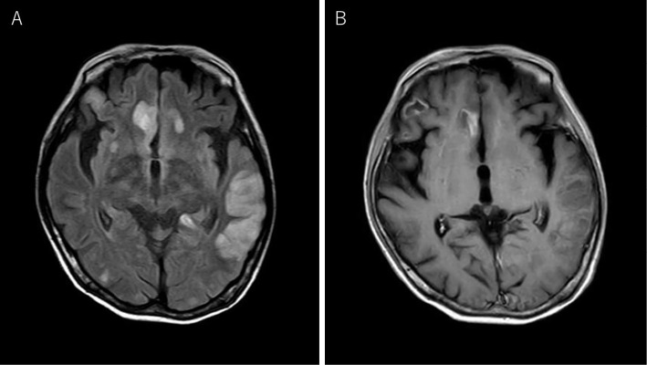
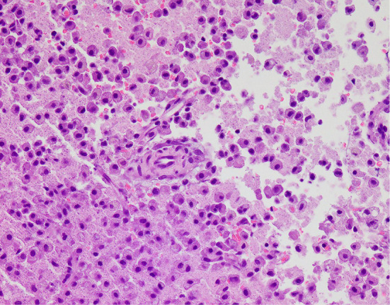
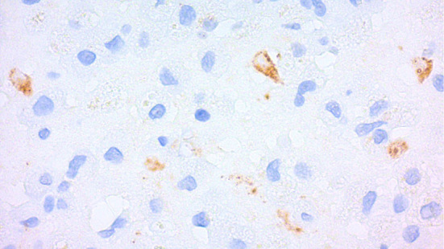
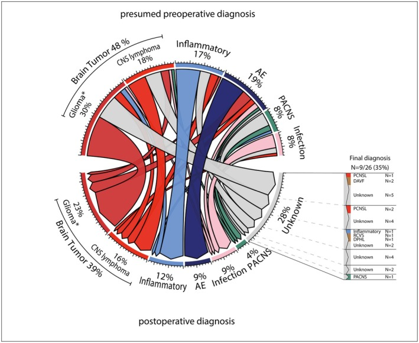
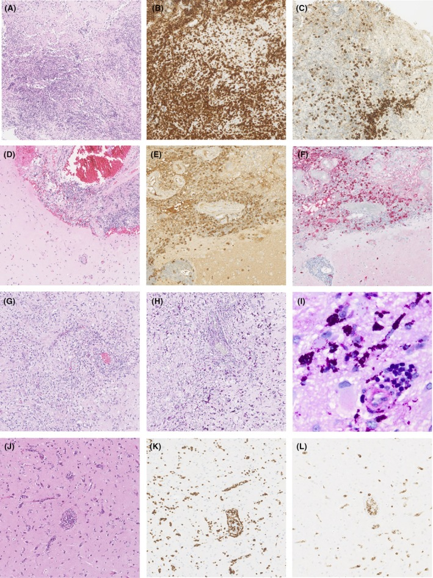
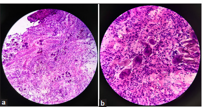
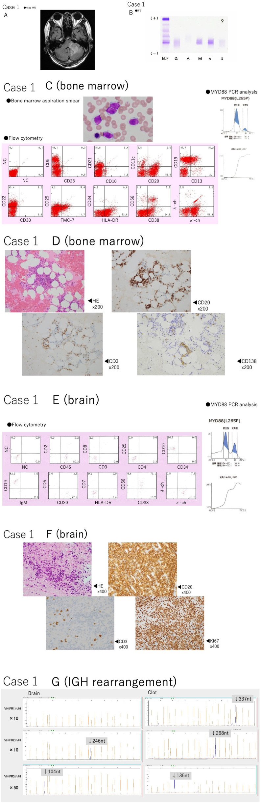
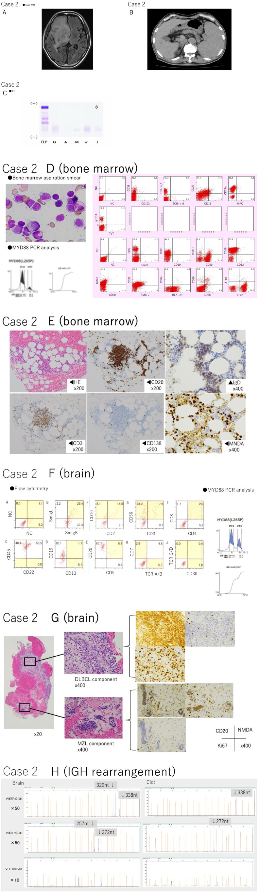
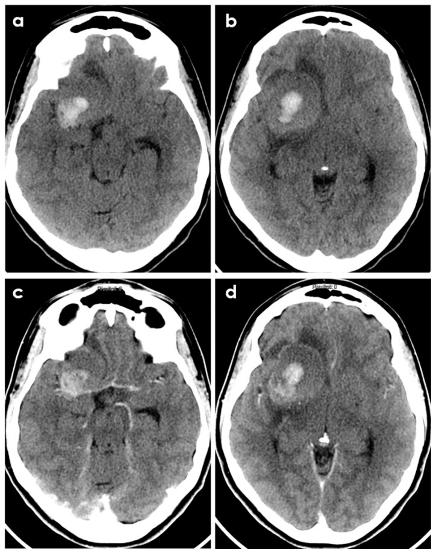
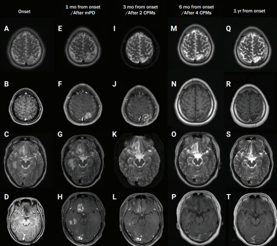

# Case Prep: Open Brain Biopsy (Craniotomy/Burr-Hole Open Biopsy)

---

## One-Liner
[Age]yo [M/F] with a [superficial/accessible / large] [location] brain lesion of uncertain diagnosis planned for open biopsy via [mini-craniotomy / burr hole] [± limited resection/decompression].

---

## Figures, Imaging & Video

**🎥 Operative video** — [search operative video on YouTube ▸](https://www.youtube.com/results?search_query=brain+biopsy+surgery) · [The Neurosurgical Atlas ▸](https://www.neurosurgicalatlas.com)

[Neurosurgical Atlas](https://www.neurosurgicalatlas.com) · [Radiopaedia](https://radiopaedia.org/search?q=brain%20biopsy&scope=all) · [PubMed Central](https://www.ncbi.nlm.nih.gov/pmc/?term=open+brain+biopsy) — operative figures © linked; see [media-sources.md](../../resources/media-sources.md)

---

<!-- BEGIN TEXTBOOK CROSS-CHECKS -->

## Textbook Cross-Checks

- **Trajectory and device anatomy:** Greenberg; Youmans and Winn; Schmidek and Sweet — confirm entry point, trajectory, ventricular/lesion target, hardware pathway, and structures to avoid.
- **Technique sequence:** Greenberg; Youmans and Winn — review setup, navigation/fluoro/endoscopy use, sterile tunneling or stereotactic workflow, and troubleshooting steps.
- **Failure modes:** Greenberg; shunt/device literature; institution-specific protocols — summarize obstruction, malposition, infection, hemorrhage, over/under-drainage, and revision algorithms in original words.
- **Copyright-safe use:** cite these sources as private cross-checks, then write the guide content in original words; do not re-host textbook pages, figures, tables, or board-review card material. See [Source Crosswalk & Copyright-Safe Use](../../resources/source-crosswalk.md).

<!-- END TEXTBOOK CROSS-CHECKS -->

<!-- BEGIN CURATED LITERATURE -->

## High-Yield Literature

- **Open brain biopsy for nonneoplastic undiagnosed neurological conditions: diagnostic yield, clinical impact, and contemporary role** — Greeneway GP. Irish journal of medical science 2026. [PubMed](https://pubmed.ncbi.nlm.nih.gov/42348063/)
- **Diagnostic open brain biopsy following initial negative results of cerebrospinal fluid assessment for Toxoplasma** — Senoo Y. Transplant infectious disease : an official journal of the Transplantation Society 2017. [PubMed](https://pubmed.ncbi.nlm.nih.gov/28100042/)
- **Angiography-negative childhood primary angiitis of the central nervous system diagnosed by open brain biopsy: a case report** — Kang D. Encephalitis (Seoul, Korea) 2022. [PubMed](https://pubmed.ncbi.nlm.nih.gov/37469609/)
- **Open biopsy in patients with acute progressive neurologic decline and absence of mass lesion** — Schuette AJ. Neurology 2010. [PubMed](https://pubmed.ncbi.nlm.nih.gov/20679635/)
- **Intravascular Large B-Cell Lymphoma Diagnosed by Open Brain Biopsy and Achievement of Remission After Early Initiation of Chemotherapy: Case Report** — Tsukamoto E. Cureus 2022. [PubMed](https://pubmed.ncbi.nlm.nih.gov/35282552/)
- **Primary diffuse large B-cell lymphoma of the central nervous system identified with CSF biomarkers** — Loser V. BMC neurology 2024. [PubMed](https://pubmed.ncbi.nlm.nih.gov/39039441/)
- **Impact of brain biopsy on the management of patients with nonneoplastic undiagnosed neurological disorders** — Pulhorn H. Neurosurgery 2008. [PubMed](https://pubmed.ncbi.nlm.nih.gov/18496189/)
- **Incidentalomas to glioblastoma multiforme** — Sachdev B. Oxford medical case reports 2014. [PubMed](https://pubmed.ncbi.nlm.nih.gov/25988042/)
- **Long-term utility and complication profile of open craniotomy for biopsy in patients with idiopathic encephalitis** — Abdullah KG. Journal of clinical neuroscience : official journal of the Neurosurgical Society of Australasia 2017. [PubMed](https://pubmed.ncbi.nlm.nih.gov/27979652/)
- **[A case of intracranial tuberculoma early diagnosed by open brain biopsy]** — Nakamura H. No to shinkei = Brain and nerve 2001. [PubMed](https://pubmed.ncbi.nlm.nih.gov/11360481/)

<!-- END CURATED LITERATURE -->

---

<!-- BEGIN CURATED IMAGE SET -->

## Curated Image Set

Open-access figures are embedded from PubMed Central articles and kept unique to this guide.

*Figure 1.. Brain MRI images on admission. Multiple high-intensity lesions on FLAIR images were observed above the tent (A). Gadolinium-enhanced T1-weighted imaging showed a contrast effect in part... Source: [Varicella Zoster Virus Encephalitis with Advanced Human Immunodeficiency Virus Disease Diagnosed by Brain Biopsy](https://pmc.ncbi.nlm.nih.gov/articles/PMC12183404/) — Internal Medicine 2024; CC BY-NC-ND.*

*Figure 2.. Pathological findings of a brain biopsy specimen (Hematoxylin and Eosin staining). Necrotic tissue with abundant foam cells is surrounded by degenerative tissue and proliferating blood... Source: [Varicella Zoster Virus Encephalitis with Advanced Human Immunodeficiency Virus Disease Diagnosed by Brain Biopsy](https://pmc.ncbi.nlm.nih.gov/articles/PMC12183404/) — Internal Medicine 2024; CC BY-NC-ND.*

*Figure 3.. Immunohistochemistry findings for VZV of a brain biopsy specimen. Immunohistochemistry with a monoclonal antibody for the VZV glycoprotein showed positive signals (brown area) in the... Source: [Varicella Zoster Virus Encephalitis with Advanced Human Immunodeficiency Virus Disease Diagnosed by Brain Biopsy](https://pmc.ncbi.nlm.nih.gov/articles/PMC12183404/) — Internal Medicine 2024; CC BY-NC-ND.*

*Figure 2. Chord diagram demonstrating change of diagnosis before and after brain biopsy. AE, autoimmune encephalitis; CNS, central nervous system; DAVF, dural arteriovenous fistulas; DPHL, delayed... Source: [Clinical impact and safety of brain biopsy in unexplained central nervous system disorders: a real‐world cohort study](https://pmc.ncbi.nlm.nih.gov/articles/PMC12040505/) — Annals of Clinical and Translational Neurology 2025; CC BY.*

*Figure 3. Neuropathological findings of brain biopsy in unexplained CNS disorders. (A–C) Chronic lymphocytic inflammation with pontine perivascular enhancement responsive to steroids (CLIPPERS);... Source: [Clinical impact and safety of brain biopsy in unexplained central nervous system disorders: a real‐world cohort study](https://pmc.ncbi.nlm.nih.gov/articles/PMC12040505/) — Annals of Clinical and Translational Neurology 2025; CC BY.*

*Figure 2:. Biopsy demonstrating scattered perivascular aggregates of schistosoma eggs with surrounding gliosis. (a) Low-power field. (b) High-power field. Stain used: Hematoxylin and eosin. Source: [Neuroschistosomiasis presenting as recurrent seizures: A case report](https://pmc.ncbi.nlm.nih.gov/articles/PMC11878708/) — Surgical Neurology International 2025; CC BY-NC-SA.*

*Fig. 1. Case details of Case 1.(A) Magnetic resonance imaging was performed, revealing a single mass in the left cerebellar peduncle. It was hypointense on T1- and T2-weighted imaging. The mass... Source: [MYD88 mutation-positive indolent B-cell lymphoma with CNS involvement: Bing–Neel syndrome mimickers](https://pmc.ncbi.nlm.nih.gov/articles/PMC11528247/) — Journal of Clinical and Experimental Hematopathology : JCEH 2024; CC BY-NC-SA.*

*Fig. 2. Case details of Case 2.(A) Magnetic resonance imaging (MRI) showed a single mass in the right basal ganglia, which was hypointense on T1- and T2-weighted imaging. The mass was... Source: [MYD88 mutation-positive indolent B-cell lymphoma with CNS involvement: Bing–Neel syndrome mimickers](https://pmc.ncbi.nlm.nih.gov/articles/PMC11528247/) — Journal of Clinical and Experimental Hematopathology : JCEH 2024; CC BY-NC-SA.*

*Figure 2. Brain CT of a young patient with biopsy-proven PACNS and ICH at presentation. The patient had a history of headache lasting 6 months before imaging. Panels (a,b) show the non-contrast CT... Source: [The Hemorrhagic Side of Primary Angiitis of the Central Nervous System (PACNS)](https://pmc.ncbi.nlm.nih.gov/articles/PMC10886751/) — Biomedicines 2024; CC BY.*

*Figure 1.. Serial brain MRI findings at onset (A–D), 1 month after onset, after steroid treatment (E–H), 3 months after onset, after two cycles of intravenous cyclophosphamide (I–L), after... Source: [Angiography-negative childhood primary angiitis of the central nervous system diagnosed by open brain biopsy: a case report](https://pmc.ncbi.nlm.nih.gov/articles/PMC10295908/) — Encephalitis 2022; CC BY-NC.*

<!-- END CURATED IMAGE SET -->

---

## History of Present Illness
- Chief complaint: Lesion requiring tissue diagnosis where an **open approach is preferable** to needle biopsy
- **Open biopsy indications:**
  - Superficial/accessible lesion
  - Need for a **larger tissue sample** (e.g., diagnostic uncertainty, suspected lymphoma after non-diagnostic needle, inflammatory/demyelinating, specialized studies)
  - Vascular lesion where needle biopsy is hazardous (visualize and control bleeding)
  - Concurrent need for **decompression / partial resection** (mass effect)
  - Failed stereotactic biopsy
- Same diagnostic considerations (lymphoma — **avoid pre-biopsy steroids** if feasible; infection)

---

## Past Medical History
- Anticoagulant/antiplatelet (stop/correct), immunocompromise, prior malignancy
- Standard PMH

---

## Imaging Review
### MRI (T1±Gad, T2, FLAIR, DWI, SWI) ± CTA
- Lesion location/depth, **enhancing/representative target**, vascularity, eloquence
- Navigation planning (localize lesion for a small targeted craniotomy)

---

## Labs
- CBC, BMP, **Coags**, type and screen

---

## Neurological Examination
- Baseline focal exam

---

## Surgical Planning

### Position & Approach
- Per lesion location; **navigation-guided small craniotomy or burr hole** over the lesion; Mayfield; lesion at accessible/highest point

### Key Surgical Steps
1. Navigation-planned incision and **small (mini) craniotomy or burr hole** over the lesion
2. Open dura
3. **Localize the lesion** (navigation, ultrasound, surface appearance — discoloration, abnormal cortex)
4. If subcortical: small corticotomy (through a sulcus/non-eloquent cortex) to reach the lesion
5. **Obtain generous tissue samples** under direct vision — including the enhancing/representative portion (avoid necrotic core); take multiple samples
6. **Frozen section/smear** confirmation of diagnostic tissue (re-sample if non-diagnostic)
7. **Direct hemostasis** under vision (bipolar) — advantage of open biopsy for vascular lesions
8. ± **Limited debulking/decompression** if mass effect and tissue confirms a process where decompression helps (judgment)
9. Watertight dural closure, bone flap replacement (craniotomy) or closure (burr hole), standard closure

### Critical Anatomy & Structures at Risk
1. **Eloquent cortex / tracts** (corticotomy site — use navigation, sulcal entry)
2. **Vessels** — direct visualization aids control (advantage over needle)
3. Draining veins, dura/sinuses depending on location

### Equipment
- Microscope, navigation, ultrasound, bipolar
- Standard craniotomy/burr-hole set, biopsy/resection instruments (cup forceps, CUSA if debulking)
- Hemostatic agents, dural substitute, **frozen-section pathology**

### Monitoring
- SSEP/MEP/mapping if near eloquent cortex

### Anesthesia
- GA; cefazolin; mannitol/steroids per mass effect (hold steroids if lymphoma pending and feasible)

### Potential Complications
1. **Hemorrhage** (directly controllable — advantage), edema/mass effect
2. Neurological deficit (corticotomy/eloquent), seizure, infection, CSF leak
3. Non-diagnostic (less likely than needle given larger sample + frozen confirmation)

---

## Operative Note Template
**Preoperative Diagnosis:** [Superficial/accessible] [location] brain lesion of uncertain diagnosis [with mass effect]

**Postoperative Diagnosis:** Same (pending pathology)

**Procedure:** Open biopsy of [location] lesion via [mini-craniotomy / burr hole] [with limited decompression]

**Surgeon / Assistant:**
**Anesthesia:** General endotracheal
**EBL / Fluids:**
**Adjuncts:** Microscope, navigation, ultrasound, bipolar; frozen section
**Specimens:** Brain lesion (generous directed samples)
**Complications:** None

**Indications:** [Age]yo [M/F] with a [superficial/vascular/large] [location] lesion where an open approach is preferable (larger sample / direct hemostasis / decompression / failed needle biopsy). [Steroids withheld if lymphoma suspected.] Risks (hemorrhage, deficit, edema) discussed.

**Description of Procedure:** After consent and time-out, general anesthesia was induced and the head fixed. A **navigation-planned small craniotomy/burr hole** was made over the lesion and the dura opened. The lesion was **localized (navigation/ultrasound/surface appearance)** [via a small corticotomy through a sulcus for the subcortical lesion]. **Generous, directed samples of representative (enhancing, non-necrotic) tissue** were obtained under direct vision and **frozen section confirmed diagnostic tissue.** **Direct hemostasis** was achieved (advantageous for the vascular lesion). [A limited decompression/debulking was performed for mass effect.]

A watertight dural closure was performed, the bone replaced [for craniotomy], and the wound closed in layers. The patient was transferred to the [floor/ICU]; a postoperative CT/MRI was obtained.

---

## Postoperative Plan
- Floor/ICU per extent, neuro checks
- **Postop CT/MRI** (hemorrhage, extent)
- Pathology (permanent/molecular; flow cytometry if lymphoma; cultures/microbiology if infection)
- Hold steroids if lymphoma pending (per team), seizure prophylaxis per practice, DVT prophylaxis
- Tumor board / management per diagnosis; follow-up
