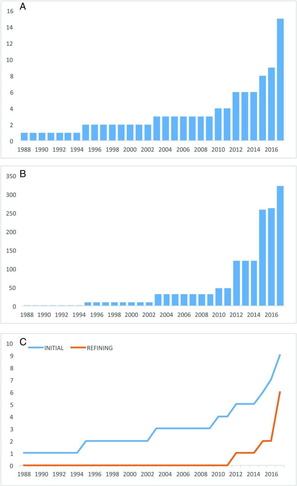

# Case Prep: Robot-Assisted Stereotactic Brain Biopsy (ROSA / Mazor / Neuromate)

<!-- BEGIN CASE SNAPSHOT -->

## Case / Approach Snapshot

- **Anatomy at risk:** target margins, vascular/necrotic zones, entry cortex, sulci/vessels, ventricles, deep nuclei, and eloquent tracts along the trajectory.
- **Operative steps:** choose the safest diagnostic target, plan trajectory, verify registration or frame coordinates, obtain staged samples, confirm hemostasis/trajectory imaging, and coordinate pathology/molecular testing; use the detailed operative sequence and approach notes below as the step-by-step source.
- **Rescue plans:** nondiagnostic tissue, hemorrhage, seizure, edema, neurologic change, target shift, infection, and open biopsy or repeat sampling plan.
- **Figures:** review [Figures, Imaging & Video](#figures-imaging--video) and the [Curated Image Set](#curated-image-set); embedded local figures should remain open-access, public-domain, or otherwise reusable with attribution.
- **Papers:** review [High-Yield Literature](#high-yield-literature) for seminal sources, modern reviews, and outcome data specific to this page.

<!-- END CASE SNAPSHOT -->

## One-Liner
[Age]yo [M/F] with [single/multiple] [deep/eloquent] brain lesion(s) of uncertain diagnosis planned for robot-assisted stereotactic needle biopsy ([ROSA / Mazor / Neuromate]).

---

## Figures, Imaging & Video

**🎥 Operative video** — [search operative video on YouTube ▸](https://www.youtube.com/results?search_query=stereotactic+brain+biopsy+surgery) · [The Neurosurgical Atlas ▸](https://www.neurosurgicalatlas.com)

[Neurosurgical Atlas](https://www.neurosurgicalatlas.com) · [Radiopaedia](https://radiopaedia.org/search?q=stereotactic%20brain%20biopsy&scope=all) · [PubMed Central](https://www.ncbi.nlm.nih.gov/pmc/?term=robot+assisted+stereotactic+brain+biopsy+ROSA) — operative figures © linked; see [media-sources.md](../../resources/media-sources.md)

---

<!-- BEGIN CURATED LITERATURE -->

## High-Yield Literature

- **Frameless robotic stereotactic brain biopsy workflow with CT-MRI fusion and CT-to-fluoroscopy registration: Step-by-step technical note and early experience** — Taravilla-Loma M. Brain & spine 2026. [PubMed](https://pubmed.ncbi.nlm.nih.gov/41584997/)
- **Robot-assisted stereotactic brain biopsy: A systematic review and meta-analysis** — Porto Junior S. Neurosurgical review 2024. [PubMed](https://pubmed.ncbi.nlm.nih.gov/39627622/)
- **Robot-assisted stereotactic brain biopsy: systematic review and bibliometric analysis** — Marcus HJ. Child's nervous system : ChNS : official journal of the International Society for Pediatric Neurosurgery 2018. [PubMed](https://pubmed.ncbi.nlm.nih.gov/29744625/)
- **Robot-assisted versus manually guided stereotactic biopsy for intracranial lesions - a systematic review and meta-analysis** — Gomes FC. Neurosurgical review 2024. [PubMed](https://pubmed.ncbi.nlm.nih.gov/39615014/)
- **Frameless Robotic-Assisted Biopsy of Pediatric Brainstem Lesions: A Systematic Review and Meta-Analysis of Efficacy and Safety** — Lu VM. World neurosurgery 2023. [PubMed](https://pubmed.ncbi.nlm.nih.gov/36307039/)
- **Comparative Analysis of Efficacy and Safety of Frame-Based, Frameless, and Robot-Assisted Stereotactic Brain Biopsies: A Systematic Review and Meta-Analysis** — Gecici NN. Operative neurosurgery (Hagerstown, Md.) 2025. [PubMed](https://pubmed.ncbi.nlm.nih.gov/40062857/)
- **The Feasibility of Robot-assisted Laser Interstitial Thermal Therapy (LITT) for Brain Tumors in Octogenarians** — Lu VM. World neurosurgery 2024. [PubMed](https://pubmed.ncbi.nlm.nih.gov/38986945/)
- **Robotic-assisted foot and ankle surgery: a review of the present status and the future** — Yoon YK. Biomedical engineering letters 2023. [PubMed](https://pubmed.ncbi.nlm.nih.gov/37872981/)
- **Stereoelectroencephalography: Indication and Efficacy** — Iida K. Neurologia medico-chirurgica 2017. [PubMed](https://pubmed.ncbi.nlm.nih.gov/28637943/)
- **How I do it: sequential robot-assisted stereotactic biopsy and laser interstitial thermal therapy for epilepsy associated with brain tumors** — Aboubakr O. Acta neurochirurgica 2025. [PubMed](https://pubmed.ncbi.nlm.nih.gov/41339600/)

<!-- END CURATED LITERATURE -->

<!-- BEGIN CURATED IMAGE SET -->

## Curated Image Set

Open-access figures are embedded from PubMed Central articles and kept unique to this guide.

*Fig. 2. Graphs demonstrating a the number of overall publications per annum, b the number of patients reported undergoing robot-assisted biopsy per annum, and c the number of initial and... Source: [Robot-assisted stereotactic brain biopsy: systematic review and bibliometric analysis](https://pmc.ncbi.nlm.nih.gov/articles/PMC5996011/) — Child's Nervous System 2018; CC BY.*

*Figure 10. Source: [Robot-assisted frameless brain biopsy with computed tomography-to-fluoroscopy registration: Step-by-step surgical video](https://pmc.ncbi.nlm.nih.gov/articles/PMC13224175/) — Surg Neurol Int. 2026 May 15;17:284. doi: 10.25259/SNI_158_2026; CC BY-NC-SA.*

<!-- END CURATED IMAGE SET -->

---

## History of Present Illness
- Chief complaint: Lesion(s) requiring tissue diagnosis, not safely resectable
- Robotic platform chosen for **accuracy, efficiency, and especially multiple targets/trajectories** (also used for SEEG, laser ablation)
- Same diagnostic considerations (lymphoma — **avoid pre-biopsy steroids** if feasible; infection; unresectable glioma; deep/eloquent)

---

## Past Medical History
- **Anticoagulant/antiplatelet (stop/correct)**, bleeding disorder, immunocompromise, prior malignancy
- Standard PMH

---

## Imaging Review
### MRI (thin-cut navigation protocol, T1±Gad, T2, FLAIR) + **vascular imaging (CTA/MRA or gad MRI)**
- Target(s) (enhancing/representative), **avascular trajectories** (robot executes exactly what is planned — vascular planning is critical)
- Plan each trajectory (entry, target, angle) on the robotic planning software
- Registration plan: frame, frameless/surface, **skull fiducials, or intraoperative CT (O-arm)** registration

### Robotic Planning Checks
- Confirm the MRI sequence used for targeting is geometrically reliable and fused to CT without scalp/brain mismatch; inspect fusion at skull, ventricles, falx, and lesion margins.
- Choose an entry that avoids sulci, cortical vessels, venous lakes, ventricle, deep perforator territory, and eloquent cortex/tracts.
- Make the skull entry as close to perpendicular as feasible so the drill/bolt does not skid; very oblique skull entry undermines robotic precision.
- Confirm robot-arm clearance before prepping: microscope, C-arm/O-arm, anesthesia circuit, Mayfield pins, drapes, and surgeon access can all collide with the planned trajectory.
- For multiple trajectories, order them by risk and diagnostic priority; sample the most important target before swelling or hemorrhage can abort the case.
- Build a specimen plan with pathology before incision: frozen/smear, permanent, flow cytometry, culture, methylation/NGS, and which samples stay fresh.

---

## Labs
- CBC (Plt), **Coags**, BMP, type and screen

---

## Neurological Examination
- Baseline focal exam

---

## Surgical Planning

### Case Logistics, OR Needs & Orders
- **OR setup:** frame/robot/navigation system registered and independently checked, biopsy needle and specimen cups/media ready, frozen/smear pathology available, trajectory images displayed, and immediate CT access planned.
- **Special needs:** coagulopathy/antiplatelet correction, steroids held when lymphoma is suspected and clinically safe, seizure prophylaxis by lesion/location, BP control, and specimen handling for flow cytometry, cultures, and molecular testing.
- **Immediate postop orders:** neuro checks, CT head to exclude hemorrhage, BP parameters, dexamethasone only if clinically indicated, antiepileptic plan, pathology follow-up, and escalation plan for tract hemorrhage or nondiagnostic result.

### Position
- Supine/per target; head fixed (Mayfield or robot-specific clamp) and **rigidly coupled to the robot reference**; register and **verify accuracy** before drilling

### Key Surgical Steps
1. Plan trajectory(ies) on robotic workstation (entry, target, avascular path)
2. Register patient to the robot (frame/fiducials/surface/intraop CT), **confirm accuracy** (sub-mm goal)
3. Robot arm **automatically aligns to the planned trajectory** and locks (rigid guide tube)
4. For each target: stab incision, **twist-drill** through skull along the robot-defined trajectory, coagulate/open dura
5. Pass the **biopsy needle through the robotic guide** to the planned depth
6. **Serial biopsies** at staged depths/orientations (side-cutting needle)
7. **Frozen section/smear** confirmation of diagnostic tissue
8. Hemostasis (observe tract); repeat for additional targets (efficient — robot repositions)
9. Closure; **postop/intraoperative CT** to confirm and exclude hemorrhage

### Registration and Accuracy Pitfalls
- Recheck accuracy after draping and after any table/head/robot movement. A perfect plan becomes unsafe if the reference array moves.
- Do not accept a registration that is "close enough" for a deep nucleus, brainstem, pineal, or small enhancing rim target; the error budget is smaller than the lesion.
- Verify the actual instrument length, stopper depth, guide-tube offset, and needle side-window orientation against the planned target depth.
- If using skull fiducials, confirm each fiducial is rigid; a loose fiducial poisons the whole registration.
- If intraoperative CT/O-arm is used, check that the reference frame is visible and rigid throughout acquisition and biopsy.

### Sampling Strategy
- Take diagnostic tissue from enhancing/solid/restricting margins first; avoid necrotic center as the first pass.
- Rotate the side-cutting window deliberately and record orientation/depth if the specimen is scant.
- If frozen is nondiagnostic, use the same safe trajectory to sample adjacent viable target before planning a second trajectory.
- For suspected lymphoma, minimize steroid exposure when clinically safe and prioritize fresh tissue for flow cytometry/molecular diagnosis.
- For infection, send culture before placing all tissue in formalin.

### Critical Anatomy & Structures at Risk
1. **Trajectory vessels** — hemorrhage (robot executes the plan precisely, so vascular planning is paramount)
2. Registration error (verify), eloquent structures, ventricles
3. Deep targets — robot rigidity is advantageous

### Equipment
- **Robotic stereotactic platform (ROSA / Mazor / Neuromate / Cirq)** + planning software
- Registration tools (fiducials / O-arm / surface), Mayfield/robot clamp
- Twist drill, **biopsy needle (Sedan side-cutting)**, bipolar
- Intraoperative/postop CT, frozen-section pathology

### Anesthesia
- GA (common); BP control; cefazolin

### Potential Complications
1. **Hemorrhage** (~1-3%), non-diagnostic sample
2. Registration/coupling error → off-target (verify accuracy), seizure, infection, deficit
3. Technical/robot setup issues

### Rescue Plans
- **Bloody return:** keep the cannula/needle in place briefly for tamponade, stop sampling, control BP/coagulation, obtain immediate CT if persistent or symptomatic, and keep the patient intubated for imaging/ICU if needed.
- **Registration concern after incision:** stop; repeat registration or convert to frame/frameless navigation rather than chasing an uncertain trajectory.
- **Robot collision or unreachable angle:** replan trajectory before drilling; do not bend the workflow around an unsafe arm position.
- **Nondiagnostic frozen:** sample planned adjacent target/depth if safe, then decide between second trajectory, open biopsy, or staged repeat after imaging.
- **Seizure/edema:** abort further passes, treat medically, image, and hand off with steroid/antiepileptic plan tailored to the suspected diagnosis.

---

## Operative Note Template
**Preoperative Diagnosis:** [Single/multiple] brain lesion(s) of uncertain diagnosis ([deep/eloquent])

**Postoperative Diagnosis:** Same (pending pathology)

**Procedure:** Robot-assisted ([ROSA/Mazor]) stereotactic biopsy of [location] lesion(s)

**Surgeon / Assistant:**
**Anesthesia:** General endotracheal
**EBL / Fluids:** Minimal
**Adjuncts:** Robotic platform + planning software, registration (fiducials/surface/O-arm), Sedan side-cutting needle, intraoperative/postop CT; frozen section
**Specimens:** Brain lesion (multiple cores per target)
**Complications:** None

**Indications:** [Age]yo [M/F] with [a deep/eloquent / multiple] lesion(s) requiring tissue diagnosis; the robotic platform was chosen for accuracy/efficiency [and multiple trajectories]. [Steroids withheld if lymphoma suspected.] Coagulopathy corrected. Risks (hemorrhage, non-diagnostic) discussed.

**Description of Procedure:** After consent and time-out, general anesthesia was induced, the head fixed, and the patient **registered to the robot with accuracy verified.** For each target, the **robot arm aligned to the pre-planned avascular trajectory** and locked; a stab incision and **twist-drill** were made, the dura opened, and the **Sedan side-cutting needle** passed through the robotic guide to the target, taking **serial specimens at staged depths**. **Frozen section confirmed diagnostic tissue.** [Additional targets were sampled with robot repositioning.] Tracts were observed and hemostasis confirmed.

The incision(s) were closed and a **CT obtained to confirm positions and exclude hemorrhage.** The patient was transferred to the floor.

---

## Postoperative Plan
- **Postop CT head (hemorrhage)**
- Floor/observation, neuro checks
- Pathology (permanent/molecular; flow cytometry if lymphoma; cultures if infection)
- Hold steroids if lymphoma pending; resume meds per bleeding risk
- Tumor board/management; follow-up

<!-- BEGIN CHIEF LEVEL TAKEAWAYS -->

## Chief-Level Case Review

Use these as the senior-level mental model for **Robot-Assisted Stereotactic Brain Biopsy (ROSA / Mazor / Neuromate)**:

- **Decision point:** The target must answer the question: choose tissue/trajectory/dose based on diagnostic yield, molecular testing, treatment impact, and safest corridor.
- **Technical lever:** Risk lives along the path: vessels, sulci, ventricles, necrotic center, eloquent tracts, prior radiation, and anticoagulation decide whether the plan is acceptable.
- **Bailout:** Confirm before committing: frame/robot registration, coordinates, fiducials, trajectory collision, specimen adequacy, and postop scan threshold should be explicit.
- **Postop watch:** Postop plan should anticipate the rare catastrophe: hemorrhage, edema, seizure, steroid need, neurologic checks, pathology handoff, and treatment-board timing.

<!-- END CHIEF LEVEL TAKEAWAYS -->

<!-- BEGIN COMMON PIMP QUESTIONS -->

## Common Pimp Questions

Use these to pressure-test preparation for **Robot-Assisted Stereotactic Brain Biopsy (ROSA / Mazor / Neuromate)**:

1. What target coordinate, trajectory, and no-fly-zone were chosen?
2. What imaging confirms target accuracy and avoids vessel/ventricle/sulcus violation?
3. What specimen, pathology, culture, or molecular study must be obtained?
4. What hemorrhage, edema, seizure, or thermal-injury sign must be watched for tonight?
5. What postop scan timing and steroid/antiepileptic plan is appropriate?

<!-- END COMMON PIMP QUESTIONS -->

<!-- BEGIN ATTENDING PREFERENCE VARIABLES -->

## Attending Preference Variables

Items that commonly vary by surgeon or institution:

- **Frame versus frameless/robot platform and planning software:** [attending-specific]
- **Trajectory constraints, number of cores/targets, and frozen/permanent pathology plan:** [attending-specific]
- **Steroid/antiepileptic prophylaxis and postop scan timing:** [attending-specific]
- **Admit versus discharge threshold and neuro-check frequency:** [attending-specific]

<!-- END ATTENDING PREFERENCE VARIABLES -->
