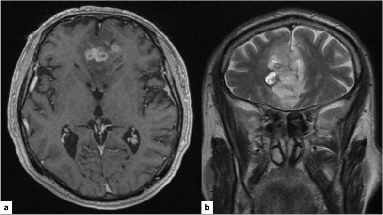
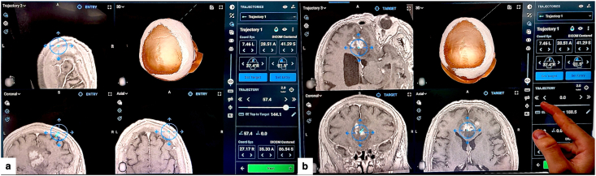
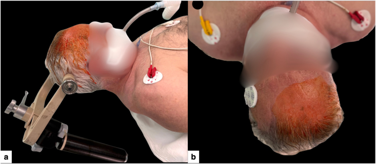
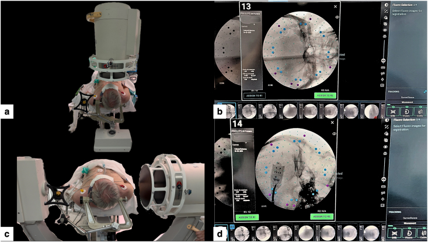
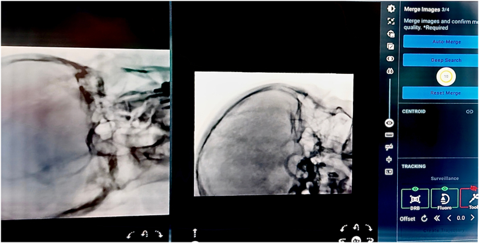
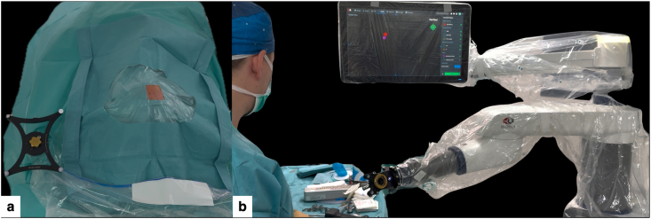
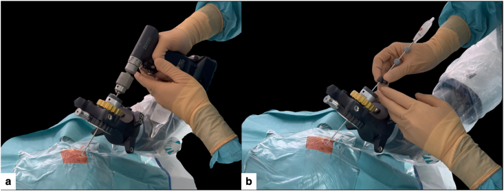
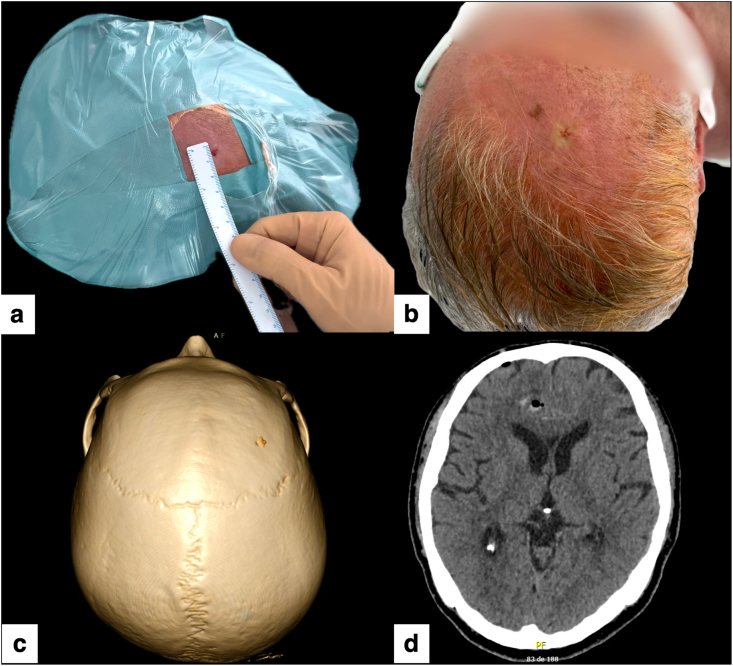

# Case Prep: Robot-Assisted Stereotactic Brain Biopsy (ROSA / Mazor / Neuromate)

---

## One-Liner
[Age]yo [M/F] with [single/multiple] [deep/eloquent] brain lesion(s) of uncertain diagnosis planned for robot-assisted stereotactic needle biopsy ([ROSA / Mazor / Neuromate]).

---

## Figures, Imaging & Video

**🎥 Operative video** — [search operative video on YouTube ▸](https://www.youtube.com/results?search_query=stereotactic+brain+biopsy+surgery) · [The Neurosurgical Atlas ▸](https://www.neurosurgicalatlas.com)

[Neurosurgical Atlas](https://www.neurosurgicalatlas.com) · [Radiopaedia](https://radiopaedia.org/search?q=stereotactic%20brain%20biopsy&scope=all) · [PubMed Central](https://www.ncbi.nlm.nih.gov/pmc/?term=robot+assisted+stereotactic+brain+biopsy+ROSA) — operative figures © linked; see [media-sources.md](../../resources/media-sources.md)

---

<!-- BEGIN TEXTBOOK CROSS-CHECKS -->

## Textbook Cross-Checks

- **Trajectory and device anatomy:** Greenberg; Youmans and Winn; Schmidek and Sweet — confirm entry point, trajectory, ventricular/lesion target, hardware pathway, and structures to avoid.
- **Technique sequence:** Greenberg; Youmans and Winn — review setup, navigation/fluoro/endoscopy use, sterile tunneling or stereotactic workflow, and troubleshooting steps.
- **Failure modes:** Greenberg; shunt/device literature; institution-specific protocols — summarize obstruction, malposition, infection, hemorrhage, over/under-drainage, and revision algorithms in original words.
- **Copyright-safe use:** cite these sources as private cross-checks, then write the guide content in original words; do not re-host textbook pages, figures, tables, or board-review card material. See [Source Crosswalk & Copyright-Safe Use](../../resources/source-crosswalk.md).

<!-- END TEXTBOOK CROSS-CHECKS -->

<!-- BEGIN CURATED LITERATURE -->

## High-Yield Literature

- **Frameless robotic stereotactic brain biopsy workflow with CT-MRI fusion and CT-to-fluoroscopy registration: Step-by-step technical note and early experience** — Taravilla-Loma M. Brain & spine 2026. [PubMed](https://pubmed.ncbi.nlm.nih.gov/41584997/)
- **Robot-assisted stereotactic brain biopsy: A systematic review and meta-analysis** — Porto Junior S. Neurosurgical review 2024. [PubMed](https://pubmed.ncbi.nlm.nih.gov/39627622/)
- **Robot-assisted stereotactic brain biopsy: systematic review and bibliometric analysis** — Marcus HJ. Child's nervous system : ChNS : official journal of the International Society for Pediatric Neurosurgery 2018. [PubMed](https://pubmed.ncbi.nlm.nih.gov/29744625/)
- **Robot-assisted versus manually guided stereotactic biopsy for intracranial lesions - a systematic review and meta-analysis** — Gomes FC. Neurosurgical review 2024. [PubMed](https://pubmed.ncbi.nlm.nih.gov/39615014/)
- **Frameless Robotic-Assisted Biopsy of Pediatric Brainstem Lesions: A Systematic Review and Meta-Analysis of Efficacy and Safety** — Lu VM. World neurosurgery 2023. [PubMed](https://pubmed.ncbi.nlm.nih.gov/36307039/)
- **Comparative Analysis of Efficacy and Safety of Frame-Based, Frameless, and Robot-Assisted Stereotactic Brain Biopsies: A Systematic Review and Meta-Analysis** — Gecici NN. Operative neurosurgery (Hagerstown, Md.) 2025. [PubMed](https://pubmed.ncbi.nlm.nih.gov/40062857/)
- **The Feasibility of Robot-assisted Laser Interstitial Thermal Therapy (LITT) for Brain Tumors in Octogenarians** — Lu VM. World neurosurgery 2024. [PubMed](https://pubmed.ncbi.nlm.nih.gov/38986945/)
- **Robotic-assisted foot and ankle surgery: a review of the present status and the future** — Yoon YK. Biomedical engineering letters 2023. [PubMed](https://pubmed.ncbi.nlm.nih.gov/37872981/)
- **Stereoelectroencephalography: Indication and Efficacy** — Iida K. Neurologia medico-chirurgica 2017. [PubMed](https://pubmed.ncbi.nlm.nih.gov/28637943/)
- **How I do it: sequential robot-assisted stereotactic biopsy and laser interstitial thermal therapy for epilepsy associated with brain tumors** — Aboubakr O. Acta neurochirurgica 2025. [PubMed](https://pubmed.ncbi.nlm.nih.gov/41339600/)

<!-- END CURATED LITERATURE -->

---

<!-- BEGIN CURATED IMAGE SET -->

## Curated Image Set

Open-access figures are embedded from PubMed Central articles and kept unique to this guide.

*Fig. 2. Graphs demonstrating a the number of overall publications per annum, b the number of patients reported undergoing robot-assisted biopsy per annum, and c the number of initial and... Source: [Robot-assisted stereotactic brain biopsy: systematic review and bibliometric analysis](https://pmc.ncbi.nlm.nih.gov/articles/PMC5996011/) — Child's Nervous System 2018; CC BY.*

*Fig. 1. Preoperative MRI.(a) Axial T1-weighted post-contrast image showing a bilateral frontal “butterfly” lesion crossing the corpus callosum.(b) Coronal T2-weighted image demonstrating the... Source: [Frameless robotic stereotactic brain biopsy workflow with CT-MRI fusion and CT-to-fluoroscopy registration: Step-by-step technical note and early experience](https://pmc.ncbi.nlm.nih.gov/articles/PMC12830220/) — Brain & Spine 2026; CC BY.*

*Fig. 2. Robotic planning of the stereotactic trajectory (ExcelsiusGPS).(a) CT-MRI fusion and 3D reconstruction showing a right frontal entry point providing the shortest safe, near-perpendicular... Source: [Frameless robotic stereotactic brain biopsy workflow with CT-MRI fusion and CT-to-fluoroscopy registration: Step-by-step technical note and early experience](https://pmc.ncbi.nlm.nih.gov/articles/PMC12830220/) — Brain & Spine 2026; CC BY.*

*Fig. 3. Patient positioning for minimal-access robot-assisted stereotactic biopsy.(a) Supine positioning with the head fixed in a three-pin Mayfield skull clamp and slightly rotated to elevate... Source: [Frameless robotic stereotactic brain biopsy workflow with CT-MRI fusion and CT-to-fluoroscopy registration: Step-by-step technical note and early experience](https://pmc.ncbi.nlm.nih.gov/articles/PMC12830220/) — Brain & Spine 2026; CC BY.*

*Fig. 4. CT-to-fluoroscopy acquisition for ExcelsiusGPS registration.(a) Intraoperative setup with the C-arm positioned for orthogonal anteroposterior cranial fluoroscopy, with the dynamic... Source: [Frameless robotic stereotactic brain biopsy workflow with CT-MRI fusion and CT-to-fluoroscopy registration: Step-by-step technical note and early experience](https://pmc.ncbi.nlm.nih.gov/articles/PMC12830220/) — Brain & Spine 2026; CC BY.*

*Fig. 5. “Merge Images” fusion verification (ExcelsiusGPS).CT-to-fluoroscopy “Merge Images” verification screen on the ExcelsiusGPS platform, showing alignment of skull base bony landmarks and a... Source: [Frameless robotic stereotactic brain biopsy workflow with CT-MRI fusion and CT-to-fluoroscopy registration: Step-by-step technical note and early experience](https://pmc.ncbi.nlm.nih.gov/articles/PMC12830220/) — Brain & Spine 2026; CC BY.*

*Fig. 6. Sterile setup and robotic docking for minimal-access biopsy.(a) Standard sterile surgical field exposing only the planned entry site and the sterile dynamic reference base (DRB),... Source: [Frameless robotic stereotactic brain biopsy workflow with CT-MRI fusion and CT-to-fluoroscopy registration: Step-by-step technical note and early experience](https://pmc.ncbi.nlm.nih.gov/articles/PMC12830220/) — Brain & Spine 2026; CC BY.*

*Fig. 7. Micro-burr hole creation through a punctiform scalp opening and navigation-guided biopsy.(a) A 2.7 mm drill advanced through the sterile end-effector under ExcelsiusGPS guidance,... Source: [Frameless robotic stereotactic brain biopsy workflow with CT-MRI fusion and CT-to-fluoroscopy registration: Step-by-step technical note and early experience](https://pmc.ncbi.nlm.nih.gov/articles/PMC12830220/) — Brain & Spine 2026; CC BY.*

*Fig. 8. Postoperative wound appearance, micro-burr hole visualization, and radiological control.(a) Immediate postoperative view showing a single pinpoint entry site of only a few millimeters,... Source: [Frameless robotic stereotactic brain biopsy workflow with CT-MRI fusion and CT-to-fluoroscopy registration: Step-by-step technical note and early experience](https://pmc.ncbi.nlm.nih.gov/articles/PMC12830220/) — Brain & Spine 2026; CC BY.*

*Figure 10. Source: [Robot-assisted frameless brain biopsy with computed tomography-to-fluoroscopy registration: Step-by-step surgical video](https://pmc.ncbi.nlm.nih.gov/articles/PMC13224175/) — Surg Neurol Int. 2026 May 15;17:284. doi: 10.25259/SNI_158_2026; CC BY-NC-SA.*

<!-- END CURATED IMAGE SET -->

---

## History of Present Illness
- Chief complaint: Lesion(s) requiring tissue diagnosis, not safely resectable
- Robotic platform chosen for **accuracy, efficiency, and especially multiple targets/trajectories** (also used for SEEG, laser ablation)
- Same diagnostic considerations (lymphoma — **avoid pre-biopsy steroids** if feasible; infection; unresectable glioma; deep/eloquent)

---

## Past Medical History
- **Anticoagulant/antiplatelet (stop/correct)**, bleeding disorder, immunocompromise, prior malignancy
- Standard PMH

---

## Imaging Review
### MRI (thin-cut navigation protocol, T1±Gad, T2, FLAIR) + **vascular imaging (CTA/MRA or gad MRI)**
- Target(s) (enhancing/representative), **avascular trajectories** (robot executes exactly what is planned — vascular planning is critical)
- Plan each trajectory (entry, target, angle) on the robotic planning software
- Registration plan: frame, frameless/surface, **skull fiducials, or intraoperative CT (O-arm)** registration

---

## Labs
- CBC (Plt), **Coags**, BMP, type and screen

---

## Neurological Examination
- Baseline focal exam

---

## Surgical Planning

### Position
- Supine/per target; head fixed (Mayfield or robot-specific clamp) and **rigidly coupled to the robot reference**; register and **verify accuracy** before drilling

### Key Surgical Steps
1. Plan trajectory(ies) on robotic workstation (entry, target, avascular path)
2. Register patient to the robot (frame/fiducials/surface/intraop CT), **confirm accuracy** (sub-mm goal)
3. Robot arm **automatically aligns to the planned trajectory** and locks (rigid guide tube)
4. For each target: stab incision, **twist-drill** through skull along the robot-defined trajectory, coagulate/open dura
5. Pass the **biopsy needle through the robotic guide** to the planned depth
6. **Serial biopsies** at staged depths/orientations (side-cutting needle)
7. **Frozen section/smear** confirmation of diagnostic tissue
8. Hemostasis (observe tract); repeat for additional targets (efficient — robot repositions)
9. Closure; **postop/intraoperative CT** to confirm and exclude hemorrhage

### Critical Anatomy & Structures at Risk
1. **Trajectory vessels** — hemorrhage (robot executes the plan precisely, so vascular planning is paramount)
2. Registration error (verify), eloquent structures, ventricles
3. Deep targets — robot rigidity is advantageous

### Equipment
- **Robotic stereotactic platform (ROSA / Mazor / Neuromate / Cirq)** + planning software
- Registration tools (fiducials / O-arm / surface), Mayfield/robot clamp
- Twist drill, **biopsy needle (Sedan side-cutting)**, bipolar
- Intraoperative/postop CT, frozen-section pathology

### Anesthesia
- GA (common); BP control; cefazolin

### Potential Complications
1. **Hemorrhage** (~1-3%), non-diagnostic sample
2. Registration/coupling error → off-target (verify accuracy), seizure, infection, deficit
3. Technical/robot setup issues

---

## Operative Note Template
**Preoperative Diagnosis:** [Single/multiple] brain lesion(s) of uncertain diagnosis ([deep/eloquent])

**Postoperative Diagnosis:** Same (pending pathology)

**Procedure:** Robot-assisted ([ROSA/Mazor]) stereotactic biopsy of [location] lesion(s)

**Surgeon / Assistant:**
**Anesthesia:** General endotracheal
**EBL / Fluids:** Minimal
**Adjuncts:** Robotic platform + planning software, registration (fiducials/surface/O-arm), Sedan side-cutting needle, intraoperative/postop CT; frozen section
**Specimens:** Brain lesion (multiple cores per target)
**Complications:** None

**Indications:** [Age]yo [M/F] with [a deep/eloquent / multiple] lesion(s) requiring tissue diagnosis; the robotic platform was chosen for accuracy/efficiency [and multiple trajectories]. [Steroids withheld if lymphoma suspected.] Coagulopathy corrected. Risks (hemorrhage, non-diagnostic) discussed.

**Description of Procedure:** After consent and time-out, general anesthesia was induced, the head fixed, and the patient **registered to the robot with accuracy verified.** For each target, the **robot arm aligned to the pre-planned avascular trajectory** and locked; a stab incision and **twist-drill** were made, the dura opened, and the **Sedan side-cutting needle** passed through the robotic guide to the target, taking **serial specimens at staged depths**. **Frozen section confirmed diagnostic tissue.** [Additional targets were sampled with robot repositioning.] Tracts were observed and hemostasis confirmed.

The incision(s) were closed and a **CT obtained to confirm positions and exclude hemorrhage.** The patient was transferred to the floor.

---

## Postoperative Plan
- **Postop CT head (hemorrhage)**
- Floor/observation, neuro checks
- Pathology (permanent/molecular; flow cytometry if lymphoma; cultures if infection)
- Hold steroids if lymphoma pending; resume meds per bleeding risk
- Tumor board/management; follow-up
