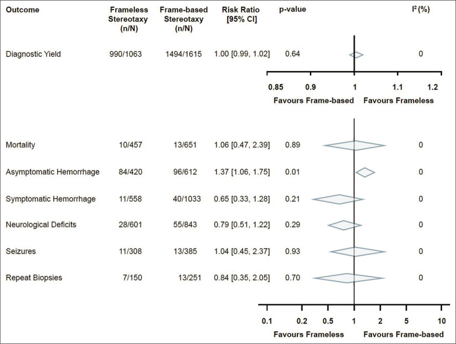
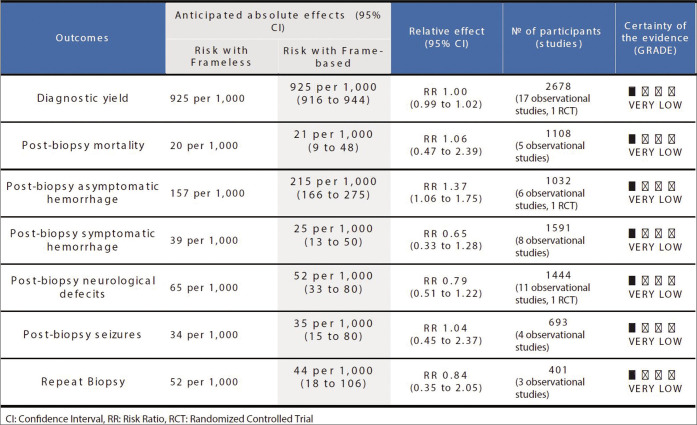
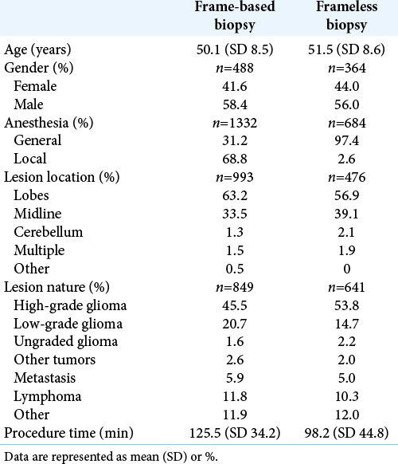
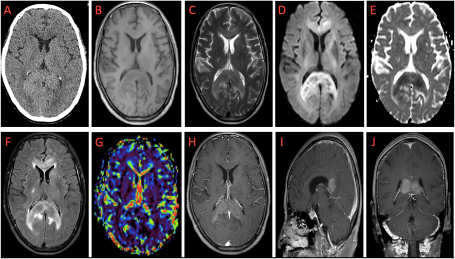
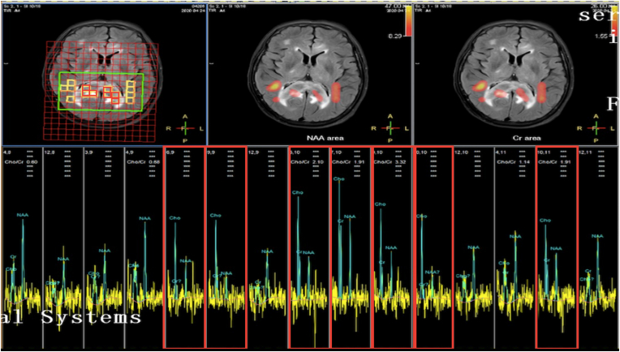
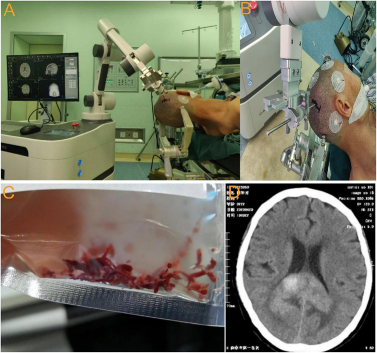
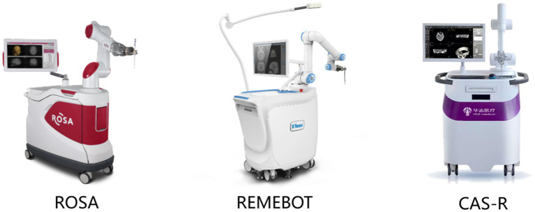
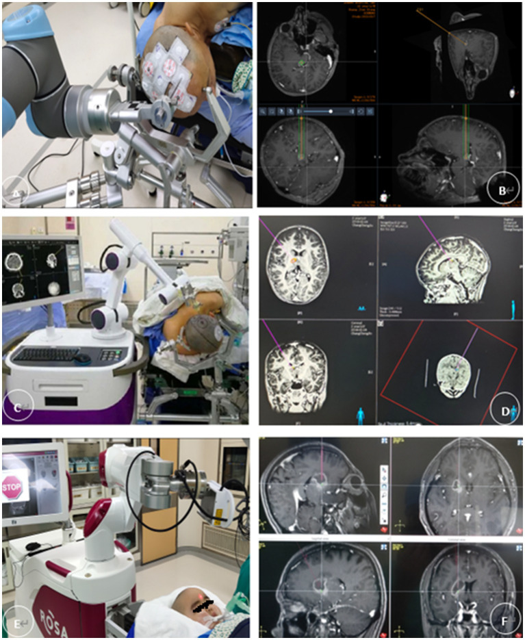
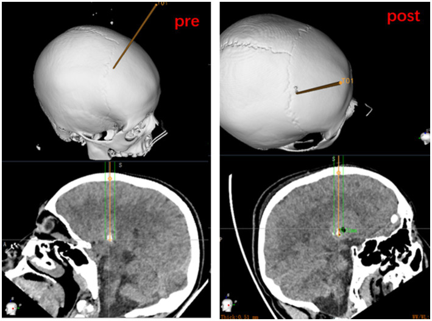

# Case Prep: Frame-Based Stereotactic Brain Biopsy (Leksell / CRW)

---

<!-- BEGIN CASE SNAPSHOT -->

## Case / Approach Snapshot

- **Anatomy at risk:** target margins, vascular/necrotic zones, entry cortex, sulci/vessels, ventricles, deep nuclei, and eloquent tracts along the trajectory.
- **Operative steps:** choose the safest diagnostic target, plan trajectory, verify registration or frame coordinates, obtain staged samples, confirm hemostasis/trajectory imaging, and coordinate pathology/molecular testing; use the detailed operative sequence and approach notes below as the step-by-step source.
- **Rescue plans:** nondiagnostic tissue, hemorrhage, seizure, edema, neurologic change, target shift, infection, and open biopsy or repeat sampling plan.
- **Figures:** review [Figures, Imaging & Video](#figures-imaging--video) and the [Curated Image Set](#curated-image-set); embedded local figures should remain open-access, public-domain, or otherwise reusable with attribution.
- **Papers:** review [High-Yield Literature](#high-yield-literature) for seminal sources, modern reviews, and outcome data specific to this page.
- **Textbook cross-checks:** use [Textbook Cross-Checks](#textbook-cross-checks) and the [Source Crosswalk](../../resources/source-crosswalk.md) to cite copyrighted textbooks/atlases while summarizing in original words.

<!-- END CASE SNAPSHOT -->

## One-Liner
[Age]yo [M/F] with a [deep / eloquent / multifocal] [location] brain lesion of uncertain diagnosis planned for frame-based stereotactic needle biopsy ([Leksell / CRW]) for tissue diagnosis.

---

## Figures, Imaging & Video

**🎥 Operative video** — [search operative video on YouTube ▸](https://www.youtube.com/results?search_query=stereotactic+brain+biopsy+surgery) · [The Neurosurgical Atlas ▸](https://www.neurosurgicalatlas.com)

[Neurosurgical Atlas](https://www.neurosurgicalatlas.com) · [Radiopaedia](https://radiopaedia.org/search?q=stereotactic%20brain%20biopsy&scope=all) · [PubMed Central](https://www.ncbi.nlm.nih.gov/pmc/?term=frame+based+stereotactic+brain+biopsy) — operative figures © linked; see [media-sources.md](../../resources/media-sources.md)

---

<!-- BEGIN TEXTBOOK CROSS-CHECKS -->

## Textbook Cross-Checks

- **Trajectory and device anatomy:** Greenberg; Youmans and Winn; Schmidek and Sweet — confirm entry point, trajectory, ventricular/lesion target, hardware pathway, and structures to avoid.
- **Technique sequence:** Greenberg; Youmans and Winn — review setup, navigation/fluoro/endoscopy use, sterile tunneling or stereotactic workflow, and troubleshooting steps.
- **Failure modes:** Greenberg; shunt/device literature; institution-specific protocols — summarize obstruction, malposition, infection, hemorrhage, over/under-drainage, and revision algorithms in original words.
- **Copyright-safe use:** cite these sources as private cross-checks, then write the guide content in original words; do not re-host textbook pages, figures, tables, or board-review card material. See [Source Crosswalk & Copyright-Safe Use](../../resources/source-crosswalk.md).

<!-- END TEXTBOOK CROSS-CHECKS -->

<!-- BEGIN CURATED LITERATURE -->

## High-Yield Literature

- **Complications after frame-based stereotactic brain biopsy: a systematic review** — Riche M. Neurosurgical review 2021. [PubMed](https://pubmed.ncbi.nlm.nih.gov/31900737/)
- **Frame-based versus frameless stereotactic brain biopsies: A systematic review and meta-analysis** — Kesserwan MA. Surgical neurology international 2021. [PubMed](https://pubmed.ncbi.nlm.nih.gov/33654555/)
- **Comparison of Frame-Based Versus Frameless Image-Guided Intracranial Stereotactic Brain Biopsy: A Retrospective Analysis of Safety and Efficacy** — Ungar L. World neurosurgery 2022. [PubMed](https://pubmed.ncbi.nlm.nih.gov/34332151/)
- **Blurring the boundaries between frame-based and frameless stereotaxy: feasibility study for brain biopsies performed with the use of a head-mounted robot** — Grimm F. Journal of neurosurgery 2015. [PubMed](https://pubmed.ncbi.nlm.nih.gov/26067616/)
- **Comparison of Frame-Based Versus Frameless Intracranial Stereotactic Biopsy: Systematic Review and Meta-Analysis** — Dhawan S. World neurosurgery 2019. [PubMed](https://pubmed.ncbi.nlm.nih.gov/30974279/)
- **Frame-Based Stereotactic Biopsy - A Single Neurosurgeon Experience of 604 Diagnostic Procedures and Literature Review** — Samanci Y. Turkish neurosurgery 2022. [PubMed](https://pubmed.ncbi.nlm.nih.gov/36066051/)
- **Surgical technique** — Guénot M. Neurophysiologie clinique = Clinical neurophysiology 2018. [PubMed](https://pubmed.ncbi.nlm.nih.gov/29273384/)
- **Related factors with diagnostic yield and intracranial hemorrhagic complications in frame-based stereotactic biopsy. Review** — Lara-Almunia M. Neurocirugia 2021. [PubMed](https://pubmed.ncbi.nlm.nih.gov/33446460/)
- **Related factors with diagnostic yield and intracranial hemorrhagic complications in frame-based stereotactic biopsy. Review** — Lara-Almunia M. Neurocirugia 2021. [PubMed](https://pubmed.ncbi.nlm.nih.gov/34743826/)
- **Comparative Analysis of Efficacy and Safety of Frame-Based, Frameless, and Robot-Assisted Stereotactic Brain Biopsies: A Systematic Review and Meta-Analysis** — Gecici NN. Operative neurosurgery (Hagerstown, Md.) 2025. [PubMed](https://pubmed.ncbi.nlm.nih.gov/40062857/)

<!-- END CURATED LITERATURE -->

---

<!-- BEGIN CURATED IMAGE SET -->

## Curated Image Set

Open-access figures are embedded from PubMed Central articles and kept unique to this guide.

*Figure 2:. Pooled analysis of risk ratios of measured outcomes. Source: [Frame-based versus frameless stereotactic brain biopsies: A systematic review and meta-analysis](https://pmc.ncbi.nlm.nih.gov/articles/PMC7911151/) — Surgical Neurology International 2021; CC BY-NC-SA.*

*Figure 3:. Grading of Recommendations Assessment, Development, and Evaluation summary of findings. Source: [Frame-based versus frameless stereotactic brain biopsies: A systematic review and meta-analysis](https://pmc.ncbi.nlm.nih.gov/articles/PMC7911151/) — Surgical Neurology International 2021; CC BY-NC-SA.*

*Figure 3. Source: [Frame-based versus frameless stereotactic brain biopsies: A systematic review and meta-analysis](https://pmc.ncbi.nlm.nih.gov/articles/PMC7911151/) — Surg Neurol Int. 2021 Feb 10;12:52. doi: 10.25259/SNI_824_2020; CC BY-NC-SA.*

*Figure 4. Source: [Frame-based versus frameless stereotactic brain biopsies: A systematic review and meta-analysis](https://pmc.ncbi.nlm.nih.gov/articles/PMC7911151/) — Surg Neurol Int. 2021 Feb 10;12:52. doi: 10.25259/SNI_824_2020; CC BY-NC-SA.*

*Figure 1. Multimodal imaging findings of a patient with primary CNS lymphoma in the splenium of the corpus callosum: A: slightly higher CT plain scan density; B: hypointense in T1; C: hypointense... Source: [Preliminary clinical application of multimodal imaging combined with frameless robotic stereotactic biopsy in the diagnosis of primary central nervous system lymphoma](https://pmc.ncbi.nlm.nih.gov/articles/PMC9758408/) — Heliyon 2022; CC BY.*

*Figure 2. The spectra showed an obvious increase in CHO, a decrease in NAA, and an increase in CHO/Cr and Cho/NAA ratios in the lesion (in the red boxes) compared with the normal brain (in the... Source: [Preliminary clinical application of multimodal imaging combined with frameless robotic stereotactic biopsy in the diagnosis of primary central nervous system lymphoma](https://pmc.ncbi.nlm.nih.gov/articles/PMC9758408/) — Heliyon 2022; CC BY.*

*Figure 3. Procedure of frameless stereotactic robotic needle biopsy in the patient with PCNSL: A: the puncture trajectory was determined according to the puncture target; B: Four spherical... Source: [Preliminary clinical application of multimodal imaging combined with frameless robotic stereotactic biopsy in the diagnosis of primary central nervous system lymphoma](https://pmc.ncbi.nlm.nih.gov/articles/PMC9758408/) — Heliyon 2022; CC BY.*

*Figure 1. All patients underwent robot-assisted stereotactic brain biopsy using one of three systems: a ROSA robotic system (Zimmer Biomet Robotics, Montpellier, France), the CAS-R-2 (Tianjin... Source: [Novel application of robot-guided stereotactic technique on biopsy diagnosis of intracranial lesions](https://pmc.ncbi.nlm.nih.gov/articles/PMC10421699/) — Frontiers in Neurology 2023; CC BY.*

*Figure 2. (A,B) The REMEBOT and (C,D) the CAS-R-2 use scalp markers for registration. The patient’s head is prepared for skin adhesion to the scalp markers before surgery (E,F). The ROSA robot... Source: [Novel application of robot-guided stereotactic technique on biopsy diagnosis of intracranial lesions](https://pmc.ncbi.nlm.nih.gov/articles/PMC10421699/) — Frontiers in Neurology 2023; CC BY.*

*Figure 3. Measurement of entry point and target point error based on preoperatively planned target and on the fusion of postoperative CT to the preoperative dataset. Source: [Novel application of robot-guided stereotactic technique on biopsy diagnosis of intracranial lesions](https://pmc.ncbi.nlm.nih.gov/articles/PMC10421699/) — Frontiers in Neurology 2023; CC BY.*

<!-- END CURATED IMAGE SET -->

---

## History of Present Illness
- Chief complaint: New neurological deficit / seizure / lesion(s) on imaging requiring diagnosis
- Lesion not safely resectable, or diagnosis would change management (lymphoma, infection, unresectable glioma, deep/eloquent location)
- **If lymphoma suspected: avoid steroids pre-biopsy** (if clinically tolerable) — steroids can make lymphoma non-diagnostic
- Immune status (toxoplasmosis vs lymphoma in HIV), prior cancer

---

## Past Medical History
- **Anticoagulant/antiplatelet (stop/correct — hemorrhage risk)**, bleeding disorder
- HIV/immunocompromise, prior malignancy, prior radiation
- Standard PMH

---

## Imaging Review
### MRI (T1±Gad, T2, FLAIR, DWI) ± CTA
- Lesion location, **enhancing/representative target** (avoid necrotic core), size
- **Plan avascular trajectory** (avoid sulci, vessels, ventricles, eloquent cortex)
- Multifocality (choose safest/most diagnostic target)
### Stereotactic planning imaging
- **Stereotactic CT or MRI with the frame applied** (frame fiducials) → merge with diagnostic MRI → calculate target and entry coordinates

---

## Labs
- CBC (Plt), **Coags (INR < 1.4)**, BMP, type and screen
- HIV/toxoplasma serology if relevant

---

## Neurological Examination
- Baseline focal exam; document for comparison

---

## Surgical Planning

### Workflow
1. **Apply stereotactic frame** (Leksell/CRW) under local anesthesia ± sedation (4 pins to skull) — keep frame aligned to anatomy
2. **Stereotactic imaging** (CT, or MRI) with frame/fiducial box
3. **Plan on workstation:** select target (enhancing tissue), entry point, **trajectory avoiding vessels/sulci/ventricles**; compute frame coordinates (x, y, z) and arc/ring angles
4. Transfer to OR

### Position
- Supine (or per target), frame fixed to the OR table adapter; HOB per trajectory; usually local + sedation (can be GA)

### Key Surgical Steps
1. Set the frame coordinates and arc/ring angles per plan; mount the arc
2. Confirm entry point on the scalp; small incision and **twist-drill burr hole** at the planned entry
3. Coagulate and open the dura (and pia) at entry
4. **Advance the biopsy needle (Sedan side-cutting cannula)** along the frame-defined trajectory to target depth
5. **Take serial biopsies:** obtain specimens at staged depths through the lesion and from multiple radial orientations (rotate the side-cutting window)
6. **Frozen section / smear** confirmation that diagnostic tissue is present before finishing (re-sample if non-diagnostic/necrotic)
7. **Hemostasis:** observe the cannula for bleeding; if bleeding, leave cannula, irrigate, wait; persistent → manage/re-image
8. Withdraw needle, closure of the small incision
9. Remove frame

### Critical Anatomy & Structures at Risk
1. **Vessels along the trajectory** (sulcal/cortical, deep) — **hemorrhage is the main risk**
2. Ventricles (CSF egress, deviation), eloquent cortex/tracts
3. Deep structures (thalamus/brainstem targets — narrow margins)

### Equipment
- **Stereotactic frame (Leksell/CRW)** + arc + table adapter
- Planning workstation, stereotactic CT/MRI
- Twist drill, **biopsy needle (Sedan side-cutting)**, bipolar
- Frozen section / smear pathology available intraoperatively

### Anesthesia
- Local + sedation (awake — allows neuro monitoring) or GA; BP control (hemorrhage); cefazolin

### Potential Complications
1. **Hemorrhage** (~1-3% symptomatic — into tract/lesion) — deficit, rarely catastrophic
2. **Non-diagnostic sample** (necrosis/sampling error) — frozen confirmation reduces; may need repeat
3. Seizure, infection, neurological deficit (eloquent trajectory), transient worsening

---

## Operative Note Template
**Preoperative Diagnosis:** [Location] brain lesion of uncertain diagnosis ([deep/eloquent/multifocal])

**Postoperative Diagnosis:** Same (pending pathology)

**Procedure:** Frame-based ([Leksell/CRW]) stereotactic biopsy of [location] lesion

**Surgeon / Assistant:**
**Anesthesia:** [Local + sedation / general]
**EBL / Fluids:** Minimal
**Adjuncts:** Stereotactic frame + arc, planning workstation, stereotactic CT/MRI, Sedan side-cutting needle; intraoperative frozen section
**Specimens:** Brain lesion (multiple cores) for permanent ± flow cytometry/microbiology
**Complications:** None

**Indications:** [Age]yo [M/F] with a [deep/eloquent] [location] lesion where resection is not indicated and tissue diagnosis will guide management. [Steroids were withheld given lymphoma suspicion.] Coagulopathy corrected. Risks (hemorrhage, non-diagnostic sample) discussed.

**Description of Procedure:** After consent and time-out, the **stereotactic frame was applied** under local anesthesia, a stereotactic CT obtained and merged with the planning MRI, and the **target (enhancing tissue), entry, and an avascular trajectory** computed. In the OR, the arc was set to the calculated coordinates and a small incision and **twist-drill burr hole** made at the entry; the dura/pia were coagulated and opened.

The **Sedan side-cutting biopsy needle** was advanced along the frame-defined trajectory to the target, and **serial specimens taken at staged depths and radial orientations**. **Frozen section confirmed diagnostic tissue.** The tract was observed for bleeding and hemostasis confirmed, the needle withdrawn, the incision closed, and the frame removed.

A **postoperative CT was obtained to exclude hemorrhage.** The patient was transferred to the floor.

---

## Postoperative Plan
- **Postop CT head (rule out hemorrhage)** — routine
- Floor/observation, neuro checks q1-2h initially
- Resume meds per bleeding risk; hold steroids if lymphoma pending (per team)
- Pathology (permanent + molecular — IDH, etc.; flow cytometry if lymphoma; cultures if infection)
- Tumor board / management per diagnosis; follow-up
