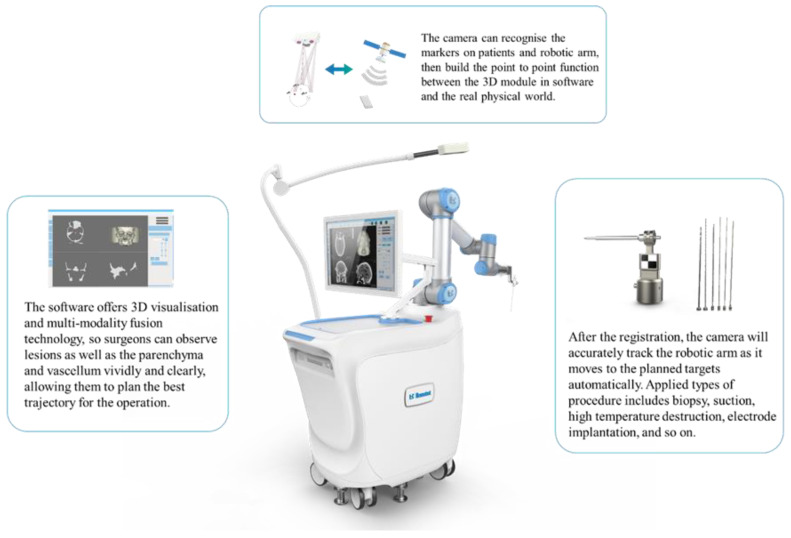
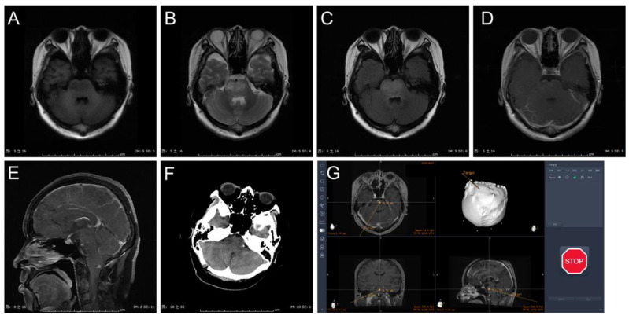
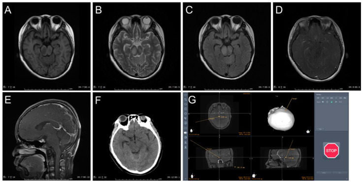
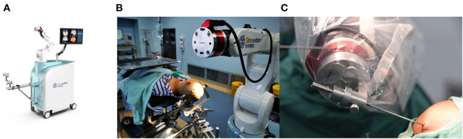
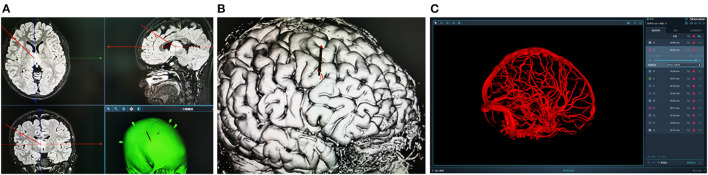
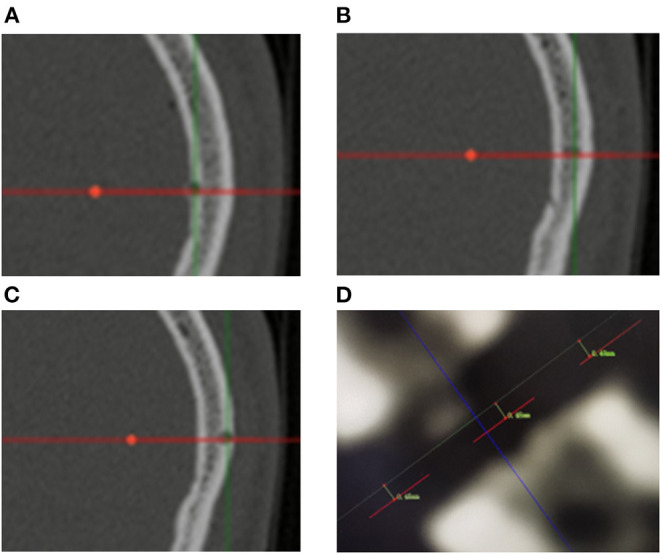
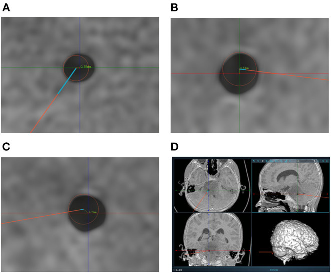
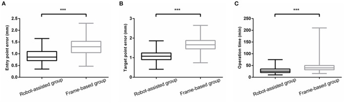
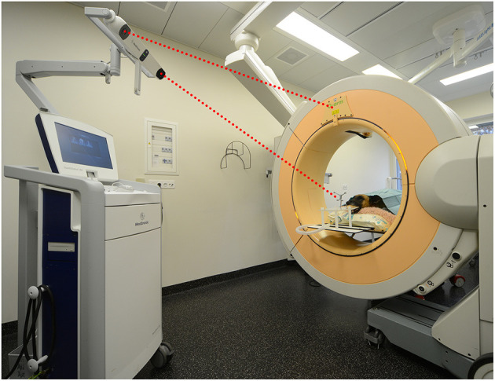
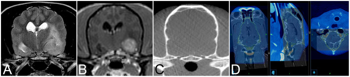

# Case Prep: Frameless (Navigation-Based) Stereotactic Brain Biopsy

<!-- BEGIN CASE SNAPSHOT -->

## Case / Approach Snapshot

- **Anatomy at risk:** target margins, vascular/necrotic zones, entry cortex, sulci/vessels, ventricles, deep nuclei, and eloquent tracts along the trajectory.
- **Operative steps:** choose the safest diagnostic target, plan trajectory, verify registration or frame coordinates, obtain staged samples, confirm hemostasis/trajectory imaging, and coordinate pathology/molecular testing; use the detailed operative sequence and approach notes below as the step-by-step source.
- **Rescue plans:** nondiagnostic tissue, hemorrhage, seizure, edema, neurologic change, target shift, infection, and open biopsy or repeat sampling plan.
- **Figures:** review [Figures, Imaging & Video](#figures-imaging--video) and the [Curated Image Set](#curated-image-set); embedded local figures should remain open-access, public-domain, or otherwise reusable with attribution.
- **Papers:** review [High-Yield Literature](#high-yield-literature) for seminal sources, modern reviews, and outcome data specific to this page.

<!-- END CASE SNAPSHOT -->

## One-Liner
[Age]yo [M/F] with a [lobar / accessible deep] [location] brain lesion of uncertain diagnosis planned for frameless (navigation-guided) stereotactic needle biopsy.

---

## Figures, Imaging & Video

**🎥 Operative video** — [search operative video on YouTube ▸](https://www.youtube.com/results?search_query=stereotactic+brain+biopsy+surgery) · [The Neurosurgical Atlas ▸](https://www.neurosurgicalatlas.com)

[Neurosurgical Atlas](https://www.neurosurgicalatlas.com) · [Radiopaedia](https://radiopaedia.org/search?q=stereotactic%20brain%20biopsy&scope=all) · [PubMed Central](https://www.ncbi.nlm.nih.gov/pmc/?term=frameless+navigation+brain+biopsy) — operative figures © linked; see [media-sources.md](../../resources/media-sources.md)

---

<!-- BEGIN CURATED LITERATURE -->

## High-Yield Literature

- **Feasability of a Frameless Brain Biopsy System for Companion Animals Using Cone-Beam CT-Based Automated Registration** — Meneses F. Frontiers in veterinary science 2021. [PubMed](https://pubmed.ncbi.nlm.nih.gov/35224071/)
- **Robot-assisted frameless brain biopsy with computed tomography-to-fluoroscopy registration: Step-by-step surgical video** — Taravilla-Loma M. Surgical neurology international 2026. [PubMed](https://pubmed.ncbi.nlm.nih.gov/42232440/)
- **MRI-guided frameless biopsy robotic system with the inclusion of unfocused ultrasound transducer for brain cancer ablation** — Giannakou M. The international journal of medical robotics + computer assisted surgery : MRCAS 2019. [PubMed](https://pubmed.ncbi.nlm.nih.gov/30157310/)
- **Frame-based versus frameless stereotactic brain biopsies: A systematic review and meta-analysis** — Kesserwan MA. Surgical neurology international 2021. [PubMed](https://pubmed.ncbi.nlm.nih.gov/33654555/)
- **Real-Time 2D Ultrasound Guided Frameless Biopsy of a Multifocal Glioma: Improving Accuracy and Diagnostic Yield** — Yeole U. Neurology India 2021. [PubMed](https://pubmed.ncbi.nlm.nih.gov/34979640/)
- **A comparison of the efficacy, safety, and duration of frame-based and Remebot robot-assisted frameless stereotactic biopsy** — Wu S. British journal of neurosurgery 2021. [PubMed](https://pubmed.ncbi.nlm.nih.gov/32940070/)
- **A Comparation Between Frame-Based and Robot-Assisted in Stereotactic Biopsy** — Hu Y. Frontiers in neurology 2022. [PubMed](https://pubmed.ncbi.nlm.nih.gov/35923834/)
- **Blurring the boundaries between frame-based and frameless stereotaxy: feasibility study for brain biopsies performed with the use of a head-mounted robot** — Grimm F. Journal of neurosurgery 2015. [PubMed](https://pubmed.ncbi.nlm.nih.gov/26067616/)
- **A Comparison of the Safety, Efficacy, and Accuracy of Frame-Based versus Remebot Robot-Assisted Stereotactic Systems for Biopsy of Brainstem Tumors** — Li C. Brain sciences 2023. [PubMed](https://pubmed.ncbi.nlm.nih.gov/36831906/)
- **[Automated proton magnetic resonance spectroscopy imaging guided frameless stereotactic biopsy of intracranial lesions]** — Zhu W. Zhonghua wai ke za zhi [Chinese journal of surgery] 2014. [PubMed](https://pubmed.ncbi.nlm.nih.gov/24924574/)

<!-- END CURATED LITERATURE -->

<!-- BEGIN CURATED IMAGE SET -->

## Curated Image Set

Open-access figures are embedded from PubMed Central articles and kept unique to this guide.

*Figure 1. Image of the Remebot system. Source: [A Comparison of the Safety, Efficacy, and Accuracy of Frame-Based versus Remebot Robot-Assisted Stereotactic Systems for Biopsy of Brainstem Tumors](https://pmc.ncbi.nlm.nih.gov/articles/PMC9954386/) — Brain Sciences 2023; CC BY.*

*Figure 2. Case presentation: (A) MRI with T1 sequence in axial view. (B) MRI T2 sequence in axial view. (C) MRI T2 flair sequence in axial view. (D) MRI T1 gadolinium sequence in axial view. (E)... Source: [A Comparison of the Safety, Efficacy, and Accuracy of Frame-Based versus Remebot Robot-Assisted Stereotactic Systems for Biopsy of Brainstem Tumors](https://pmc.ncbi.nlm.nih.gov/articles/PMC9954386/) — Brain Sciences 2023; CC BY.*

*Figure 3. Case presentation: (A) MRI with T1 sequence in axial view. (B) MRI T2 sequence in axial view. (C) MRI T2 flair sequence in axial view. (D) MRI T1 gadolinium sequence in axial view. (E)... Source: [A Comparison of the Safety, Efficacy, and Accuracy of Frame-Based versus Remebot Robot-Assisted Stereotactic Systems for Biopsy of Brainstem Tumors](https://pmc.ncbi.nlm.nih.gov/articles/PMC9954386/) — Brain Sciences 2023; CC BY.*

*Figure 1. (A) The SINO surgical robot. (B,C) The robot for brain biopsy. Source: [A Comparation Between Frame-Based and Robot-Assisted in Stereotactic Biopsy](https://pmc.ncbi.nlm.nih.gov/articles/PMC9339900/) — Frontiers in Neurology 2022; CC BY.*

*Figure 2. (A,B) Design the stereotactic trajectory on the Sinoplan software. (C) Three-dimensional (3D) visualization technology of craniocerebral vascular. Source: [A Comparation Between Frame-Based and Robot-Assisted in Stereotactic Biopsy](https://pmc.ncbi.nlm.nih.gov/articles/PMC9339900/) — Frontiers in Neurology 2022; CC BY.*

*Figure 3. (A–C) Measurement of entry point error based on postoperative CT scanning. The red lines represent the biopsy trajectory planned preoperatively. Bone defects represent the actual biopsy... Source: [A Comparation Between Frame-Based and Robot-Assisted in Stereotactic Biopsy](https://pmc.ncbi.nlm.nih.gov/articles/PMC9339900/) — Frontiers in Neurology 2022; CC BY.*

*Figure 4. (A–C) Measurement of target point error based on postoperative CT scanning. The centers of the red circles represent the target points planned preoperatively. The TPEs are computed based... Source: [A Comparation Between Frame-Based and Robot-Assisted in Stereotactic Biopsy](https://pmc.ncbi.nlm.nih.gov/articles/PMC9339900/) — Frontiers in Neurology 2022; CC BY.*

*Figure 5. (A,B) The EPE and TPE of robot-assisted group were significantly less than that of frame-based group. (C) There was a significant reduction in operation time ***means P < 0.001. Source: [A Comparation Between Frame-Based and Robot-Assisted in Stereotactic Biopsy](https://pmc.ncbi.nlm.nih.gov/articles/PMC9339900/) — Frontiers in Neurology 2022; CC BY.*

*Figure 1. Set up of the mobile cone-beam computed tomography and navigation system in the operating room showing a dog cadaver in sternal recumbency. The head has been secured to the bite plate.... Source: [Feasability of a Frameless Brain Biopsy System for Companion Animals Using Cone-Beam CT-Based Automated Registration](https://pmc.ncbi.nlm.nih.gov/articles/PMC8863864/) — Frontiers in Veterinary Science 2022; CC BY.*

*Figure 2. Transverse T2-weighted (A) and T1-weighted contrast enhanced (B) image and of an 11-year-old female spayed Poodle with biopsy proven vasculitis and meningoencephalitis of unknown origin.... Source: [Feasability of a Frameless Brain Biopsy System for Companion Animals Using Cone-Beam CT-Based Automated Registration](https://pmc.ncbi.nlm.nih.gov/articles/PMC8863864/) — Frontiers in Veterinary Science 2022; CC BY.*

<!-- END CURATED IMAGE SET -->

---

## History of Present Illness
- Chief complaint: Lesion(s) requiring tissue diagnosis where resection is not indicated/safe
- Same diagnostic considerations as framed biopsy (lymphoma — **avoid pre-biopsy steroids** if feasible; infection vs tumor; unresectable/deep/eloquent)
- Frameless chosen for comfort (GA, no frame), flexible trajectory, convexity/lobar targets, integration with navigation

---

## Past Medical History
- **Anticoagulant/antiplatelet (stop/correct)**, bleeding disorder, immunocompromise, prior malignancy
- Standard PMH

---

## Imaging Review
### MRI (T1±Gad, T2, FLAIR) ± CTA — **thin-cut navigation protocol**
- Target (enhancing/representative), avascular trajectory, eloquent structure avoidance
- **Loaded to navigation** (StealthStation/Brainlab); plan entry, target, trajectory
- Registration plan: **skull-implanted fiducials** (most accurate frameless), surface/laser/mask registration

### Accuracy Read Before Incision
- Choose frameless biopsy for lobar/convexity or moderate-depth targets where navigation error is acceptable; favor frame/robot/iMRI for tiny, brainstem, thalamic, pineal, or very deep targets.
- Prefer skull fiducials or skull-mounted guides when precision matters; surface registration is convenient but can drift with skin/scalp shift.
- Check registration against bony landmarks near the entry, not just the face; a good facial fit can still be wrong at the cranial target.
- Plan a trajectory that is near perpendicular to the skull, avoids sulci/vessels/ventricle, and crosses the least eloquent tissue.
- Confirm the path samples viable target: enhancing rim, diffusion-restricting or solid tissue, not necrotic center.

---

## Labs
- CBC (Plt), **Coags**, BMP, type and screen

---

## Neurological Examination
- Baseline focal exam

---

## Surgical Planning

### Case Logistics, OR Needs & Orders
- **OR setup:** frame/robot/navigation system registered and independently checked, biopsy needle and specimen cups/media ready, frozen/smear pathology available, trajectory images displayed, and immediate CT access planned.
- **Special needs:** coagulopathy/antiplatelet correction, steroids held when lymphoma is suspected and clinically safe, seizure prophylaxis by lesion/location, BP control, and specimen handling for flow cytometry, cultures, and molecular testing.
- **Immediate postop orders:** neuro checks, CT head to exclude hemorrhage, BP parameters, dexamethasone only if clinically indicated, antiepileptic plan, pathology follow-up, and escalation plan for tract hemorrhage or nondiagnostic result.

### Position
- Per target; head fixed in **Mayfield** (rigid fixation important for navigation accuracy); register and **confirm navigation accuracy** (< 2 mm) before proceeding

### Key Surgical Steps
1. Register patient to navigation (fiducials/surface), **verify accuracy** on known landmarks
2. Plan/confirm entry and trajectory on navigation; mark entry on scalp
3. Mount a **navigated biopsy guide / aiming device** (e.g., navigation arm, VarioGuide, or skull-mounted device like Navigus) aligned to the planned trajectory
4. Small incision, **twist-drill burr hole** at entry, coagulate/open dura
5. Pass the **biopsy needle along the navigated trajectory** to target depth (depth from plan; some use a stop)
6. **Serial biopsies** at staged depths / radial orientations (side-cutting needle)
7. **Frozen section / smear** confirmation of diagnostic tissue
8. Hemostasis (observe tract), withdraw needle, closure

### Brain Shift Caveat
- Frameless accuracy can be degraded by **brain shift** (CSF loss, large cystic lesions); minimize CSF egress, rely on rigid skull-mounted guides for deep targets, consider intraoperative imaging if concern

### Sampling and Confirmation Strategy
- Use a mechanical depth stop and independently read back target depth, needle length, and side-window orientation before each pass.
- Take the first diagnostic sample from the highest-yield target; hemorrhage or swelling can end the case early.
- Send tissue according to the differential: fresh lymphoma flow cytometry, cultures for infection, permanent/molecular for glioma, and frozen/smear adequacy for all.
- If frozen shows necrosis/gliosis only, sample adjacent viable target along the same safe trajectory before adding a second trajectory.
- Obtain immediate CT if there is bloody return, neurologic change, unexpected hypertension/bradycardia, or concern for off-target passage.

### Critical Anatomy & Structures at Risk
1. **Trajectory vessels** — hemorrhage (main risk)
2. **Registration/brain-shift error** → off-target (non-diagnostic or eloquent injury)
3. Ventricles, eloquent cortex/tracts

### Equipment
- **Navigation system (StealthStation/Brainlab)** + biopsy guide/arm (VarioGuide / skull-mounted)
- Mayfield, fiducials (if used), twist drill, **biopsy needle (Sedan side-cutting)**, bipolar
- Intraoperative frozen-section pathology

### Anesthesia
- GA (common) or local + sedation; BP control; cefazolin

### Potential Complications
1. **Hemorrhage** (~1-3%), **non-diagnostic sample / off-target** (registration/brain-shift error)
2. Seizure, infection, neurological deficit
3. Inaccuracy for very deep/small targets vs frame (mitigated by skull-mounted guide)

### Rescue Plans
- **Registration mismatch:** stop, repeat registration, replace fiducials/reference if needed, or convert to frame/robot/open biopsy; do not proceed with a known-bad registration.
- **Brain shift/CSF loss:** pause, minimize further egress, reassess navigation reliability, and consider intraoperative CT/MRI if available.
- **Bloody aspirate:** leave the needle/cannula briefly for tamponade, stop further sampling, control BP/coagulation, obtain CT, and keep the airway protected if the patient is symptomatic.
- **Nondiagnostic tissue:** confirm target/trajectory, sample adjacent viable tissue, then decide whether repeat/open biopsy is safer than repeated blind passes.
- **Seizure:** irrigate, abort further passes if needed, treat with antiseizure medication, image if prolonged or associated with deficit.

---

## Operative Note Template
**Preoperative Diagnosis:** [Location] brain lesion of uncertain diagnosis ([lobar/accessible])

**Postoperative Diagnosis:** Same (pending pathology)

**Procedure:** Frameless navigation-guided stereotactic biopsy of [location] lesion

**Surgeon / Assistant:**
**Anesthesia:** General endotracheal [or local + sedation]
**EBL / Fluids:** Minimal
**Adjuncts:** Navigation (StealthStation/Brainlab) + biopsy guide/arm, Mayfield, [fiducials], Sedan side-cutting needle; frozen section
**Specimens:** Brain lesion (multiple cores)
**Complications:** None

**Indications:** [Age]yo [M/F] with a [lobar/accessible] [location] lesion requiring tissue diagnosis; frameless approach chosen for comfort/flexibility. [Steroids withheld if lymphoma suspected.] Coagulopathy corrected. Risks (hemorrhage, registration/brain-shift error) discussed.

**Description of Procedure:** After consent and time-out, [general anesthesia was induced and] the head fixed in Mayfield. The patient was **registered to navigation and accuracy verified** on known landmarks. The planned entry and avascular trajectory were confirmed and a **navigated biopsy guide/arm** aligned. A small incision and **twist-drill burr hole** were made and the dura opened.

The **Sedan side-cutting needle** was passed along the navigated trajectory to the target, minimizing CSF egress to limit brain shift, and **serial specimens taken at staged depths**. **Frozen section confirmed diagnostic tissue.** The tract was observed and hemostasis confirmed, the needle withdrawn, and the incision closed.

A **postoperative CT excluded hemorrhage.** The patient was transferred to the floor.

---

## Postoperative Plan
- **Postop CT head (hemorrhage)**
- Floor/observation, neuro checks
- Pathology (permanent/molecular; flow cytometry if lymphoma; cultures if infection)
- Hold steroids if lymphoma pending (per team), resume meds per bleeding risk
- Tumor board/management per diagnosis; follow-up

<!-- BEGIN CHIEF LEVEL TAKEAWAYS -->

## Chief-Level Case Review

Use these as the senior-level mental model for **Frameless (Navigation-Based) Stereotactic Brain Biopsy**:

- **Decision point:** The target must answer the question: choose tissue/trajectory/dose based on diagnostic yield, molecular testing, treatment impact, and safest corridor.
- **Technical lever:** Risk lives along the path: vessels, sulci, ventricles, necrotic center, eloquent tracts, prior radiation, and anticoagulation decide whether the plan is acceptable.
- **Bailout:** Confirm before committing: frame/robot registration, coordinates, fiducials, trajectory collision, specimen adequacy, and postop scan threshold should be explicit.
- **Postop watch:** Postop plan should anticipate the rare catastrophe: hemorrhage, edema, seizure, steroid need, neurologic checks, pathology handoff, and treatment-board timing.

<!-- END CHIEF LEVEL TAKEAWAYS -->

<!-- BEGIN COMMON PIMP QUESTIONS -->

## Common Pimp Questions

Use these to pressure-test preparation for **Frameless (Navigation-Based) Stereotactic Brain Biopsy**:

1. What target coordinate, trajectory, and no-fly-zone were chosen?
2. What imaging confirms target accuracy and avoids vessel/ventricle/sulcus violation?
3. What specimen, pathology, culture, or molecular study must be obtained?
4. What hemorrhage, edema, seizure, or thermal-injury sign must be watched for tonight?
5. What postop scan timing and steroid/antiepileptic plan is appropriate?

<!-- END COMMON PIMP QUESTIONS -->

<!-- BEGIN ATTENDING PREFERENCE VARIABLES -->

## Attending Preference Variables

Items that commonly vary by surgeon or institution:

- **Frame versus frameless/robot platform and planning software:** [attending-specific]
- **Trajectory constraints, number of cores/targets, and frozen/permanent pathology plan:** [attending-specific]
- **Steroid/antiepileptic prophylaxis and postop scan timing:** [attending-specific]
- **Admit versus discharge threshold and neuro-check frequency:** [attending-specific]

<!-- END ATTENDING PREFERENCE VARIABLES -->
