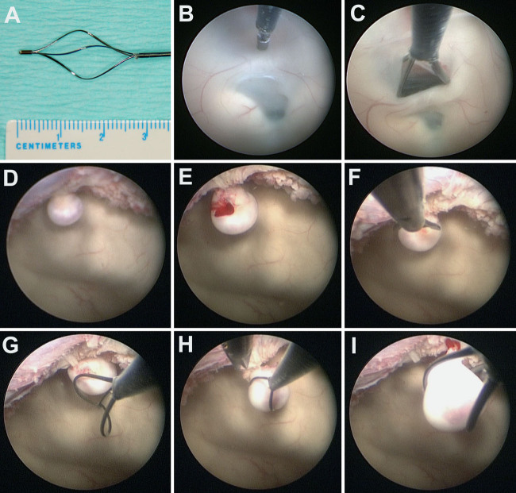
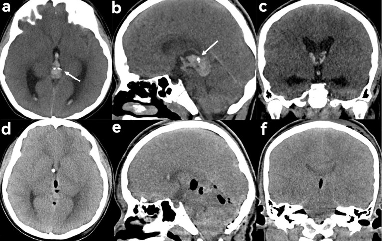
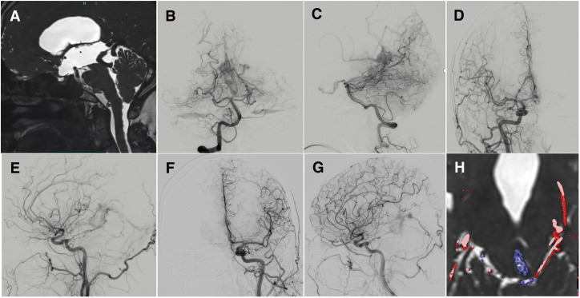
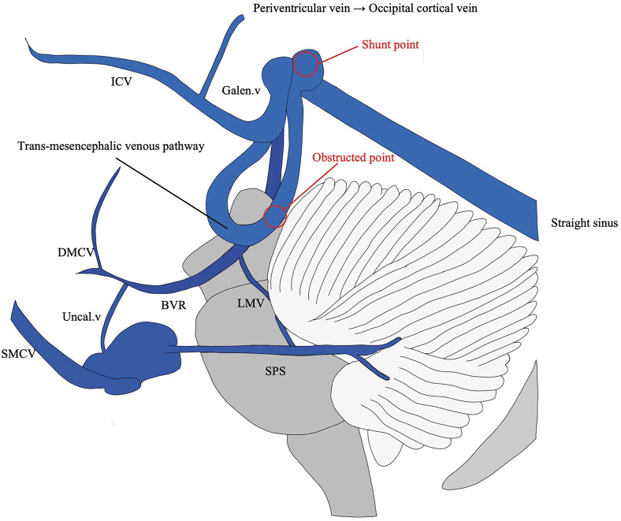
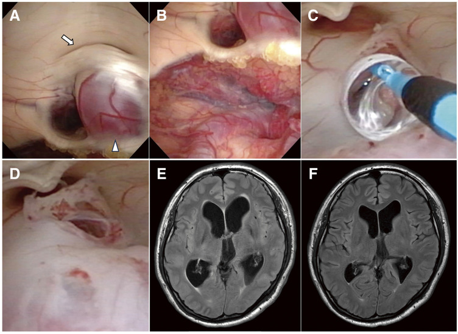
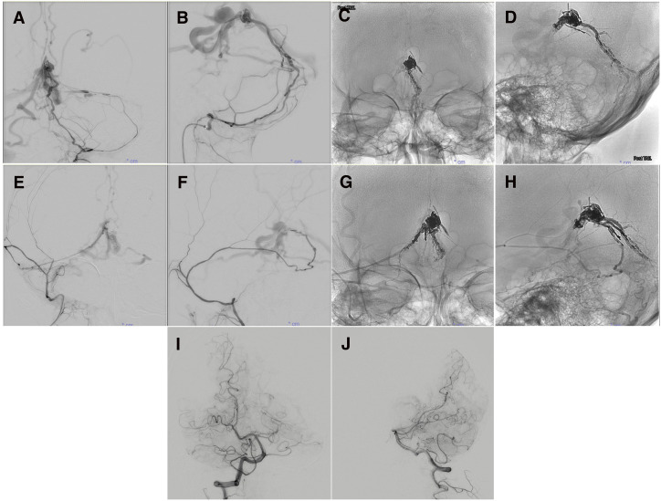
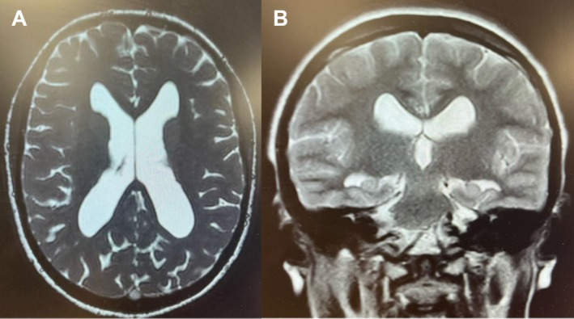
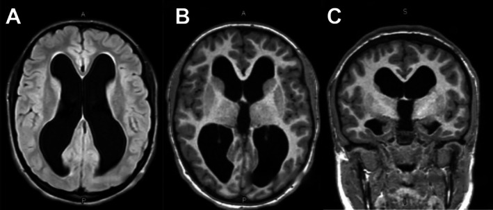
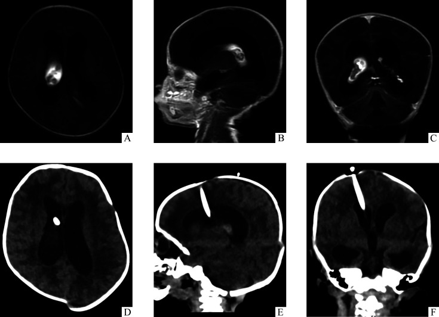
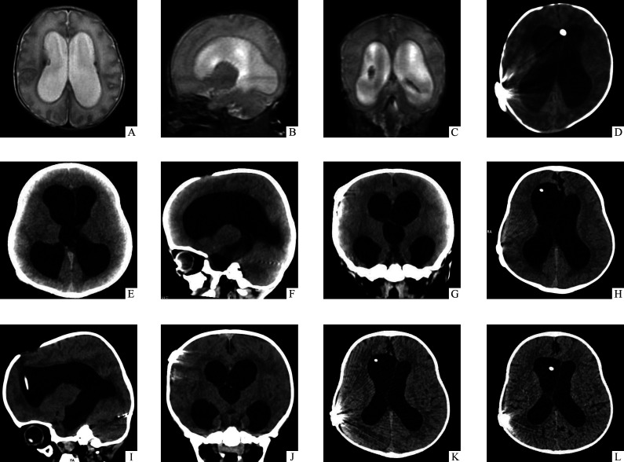

# Case Prep: Endoscopic Third Ventriculostomy (ETV)

---

## One-Liner
[Age]yo [M/F] with **obstructive (non-communicating) hydrocephalus** due to [aqueductal stenosis / tectal or pineal tumor / posterior fossa mass] planned for endoscopic third ventriculostomy [± endoscopic biopsy].

---

## Figures, Imaging & Video

**🎥 Operative video** — [search operative video on YouTube ▸](https://www.youtube.com/results?search_query=third+ventriculostomy+surgery) · [The Neurosurgical Atlas ▸](https://www.neurosurgicalatlas.com)

[Neurosurgical Atlas](https://www.neurosurgicalatlas.com) · [Radiopaedia](https://radiopaedia.org/search?q=third%20ventriculostomy&scope=all) · [PubMed Central](https://www.ncbi.nlm.nih.gov/pmc/?term=endoscopic+third+ventriculostomy) — operative figures © linked; see [media-sources.md](../../resources/media-sources.md)

---

<!-- BEGIN TEXTBOOK CROSS-CHECKS -->

## Textbook Cross-Checks

- **Trajectory and device anatomy:** Greenberg; Youmans and Winn; Schmidek and Sweet — confirm entry point, trajectory, ventricular/lesion target, hardware pathway, and structures to avoid.
- **Technique sequence:** Greenberg; Youmans and Winn — review setup, navigation/fluoro/endoscopy use, sterile tunneling or stereotactic workflow, and troubleshooting steps.
- **Failure modes:** Greenberg; shunt/device literature; institution-specific protocols — summarize obstruction, malposition, infection, hemorrhage, over/under-drainage, and revision algorithms in original words.
- **Copyright-safe use:** cite these sources as private cross-checks, then write the guide content in original words; do not re-host textbook pages, figures, tables, or board-review card material. See [Source Crosswalk & Copyright-Safe Use](../../resources/source-crosswalk.md).

<!-- END TEXTBOOK CROSS-CHECKS -->

<!-- BEGIN CURATED LITERATURE -->

## High-Yield Literature

- **Failure of Endoscopic Third Ventriculostomy** — Lane J. Cureus 2022. [PubMed](https://pubmed.ncbi.nlm.nih.gov/35733459/)
- **Endoscopic Third Ventriculostomy - A Review** — Yadav YR. Neurology India 2021. [PubMed](https://pubmed.ncbi.nlm.nih.gov/35103009/)
- **[Neuroendoscopic Third Ventriculostomy]** — Shimoji K. No shinkei geka. Neurological surgery 2022. [PubMed](https://pubmed.ncbi.nlm.nih.gov/36426519/)
- **Third ventriculostomy** — Siomin V. Journal of neurosurgery 2003. [PubMed](https://pubmed.ncbi.nlm.nih.gov/14609182/)
- **Third ventriculostomy in shunt malfunction** — Spennato P. World neurosurgery 2013. [PubMed](https://pubmed.ncbi.nlm.nih.gov/22381847/)
- **Endoscopic Third Ventriculostomy: Success and Failure** — Deopujari CE. Journal of Korean Neurosurgical Society 2017. [PubMed](https://pubmed.ncbi.nlm.nih.gov/28490157/)
- **Endoscopic third ventriculostomy for shunt malfunction in children: A review** — Waqar M. Journal of clinical neuroscience : official journal of the Neurosurgical Society of Australasia 2018. [PubMed](https://pubmed.ncbi.nlm.nih.gov/29483013/)
- **Endoscopic third ventriculostomy** — Jallo GI. Neurosurgical focus 2005. [PubMed](https://pubmed.ncbi.nlm.nih.gov/16398476/)
- **Endoscopic Third Ventriculostomy And Choroid Plexus Coagulation in Infants: Current Concepts and Illustrative Cases** — Baticulon RE. Neurology India 2021. [PubMed](https://pubmed.ncbi.nlm.nih.gov/35103010/)
- **Third ventriculostomy: a review** — Grant JA. Surgical neurology 1997. [PubMed](https://pubmed.ncbi.nlm.nih.gov/9068689/)

<!-- END CURATED LITERATURE -->

---

<!-- BEGIN CURATED IMAGE SET -->

## Curated Image Set

Open-access figures are embedded from PubMed Central articles and kept unique to this guide.

*FIG. 2.. NSB-assisted ETV and removal of the intraventricular tumor. A: Expanded tip of the NSB. B: The floor of the third ventricle was penetrated with the blunt tip of the NSB. C: The stoma of... Source: [Pure ventriculoscopic resection of an intraventricular meningioma with a basket retriever through a single burr hole: illustrative case](https://pmc.ncbi.nlm.nih.gov/articles/PMC13273441/) — Journal of Neurosurgery: Case Lessons 2026; CC BY-NC-ND.*

*Figure 1. Choriocarcinoma of the pineal body in a 9-year-old male patient presenting with dizziness and headache. (a–c) Preoperative CT showed a patchy hyperdense, slightly inhomogeneous lesion in... Source: [Case Report: Primary choriocarcinoma of the pineal region](https://pmc.ncbi.nlm.nih.gov/articles/PMC13259689/) — Frontiers in Oncology 2026; CC BY.*

*Fig. 1. Heavily T2-weighted CISS MRI demonstrates obstruction of the cerebral aqueduct caused by a dilated draining vein (A). Right VA angiography shows a falcotentorial dAVF supplied by... Source: [Falcotentorial dAVF with Unusual Venous Drainage Presenting with Obstructive Hydrocephalus: A Case Report and Literature Review of Endoscopic Third Ventriculostomy Followed by Staged Transarterial Embolization](https://pmc.ncbi.nlm.nih.gov/articles/PMC13253064/) — JNET Journal of Neuroendovascular Therapy 2026; CC BY-NC.*

*Fig. 2. A schematic illustration depicts the venous anatomy of the falcotentorial dAVF. In association with an occluded straight sinus, the draining vein from the shunt point initially descends... Source: [Falcotentorial dAVF with Unusual Venous Drainage Presenting with Obstructive Hydrocephalus: A Case Report and Literature Review of Endoscopic Third Ventriculostomy Followed by Staged Transarterial Embolization](https://pmc.ncbi.nlm.nih.gov/articles/PMC13253064/) — JNET Journal of Neuroendovascular Therapy 2026; CC BY-NC.*

*Fig. 3. Endoscopic views obtained during ETV demonstrate an obstructed cerebral aqueduct (arrow) compressed by a dilated trans-mesencephalic venous pathway (arrowhead) (A). An additional... Source: [Falcotentorial dAVF with Unusual Venous Drainage Presenting with Obstructive Hydrocephalus: A Case Report and Literature Review of Endoscopic Third Ventriculostomy Followed by Staged Transarterial Embolization](https://pmc.ncbi.nlm.nih.gov/articles/PMC13253064/) — JNET Journal of Neuroendovascular Therapy 2026; CC BY-NC.*

*Fig. 4. Preoperative left APA angiography shows arterial supply to the shunt point via the hypoglossal branch (A, B). Left APA angiography after TAE with Onyx via the hypoglossal branch shows... Source: [Falcotentorial dAVF with Unusual Venous Drainage Presenting with Obstructive Hydrocephalus: A Case Report and Literature Review of Endoscopic Third Ventriculostomy Followed by Staged Transarterial Embolization](https://pmc.ncbi.nlm.nih.gov/articles/PMC13253064/) — JNET Journal of Neuroendovascular Therapy 2026; CC BY-NC.*

*FIGURE 3. Postoperative axial (A) and coronal (B) MRI slices demonstrating reduced ventricular size following endoscopic third ventriculostomy. Source: [A Case of Noncommunicating Hydrocephalus Presenting as Isolated Hyposmia](https://pmc.ncbi.nlm.nih.gov/articles/PMC13238526/) — Clinical Case Reports 2026; CC BY.*

*FIGURE 2. Preoperative axial (A and B) and coronal (C) MRI slices showing symmetrical dilation of the lateral and third ventricles with associated parenchymal thinning, consistent with... Source: [A Case of Noncommunicating Hydrocephalus Presenting as Isolated Hyposmia](https://pmc.ncbi.nlm.nih.gov/articles/PMC13238526/) — Clinical Case Reports 2026; CC BY.*

*图1. 儿童复杂性脑积水女婴(22 d)的头颅影像学表现Figure 1 Cranial imaging findings in a 22-day-old female infant with complex hydrocephalusA-C: Preoperative MRI of axial (A), sagittal (B), and coronal planes (C)... Source: [儿童复杂性脑积水的诊治新策略：阶段性手术管理流程](https://pmc.ncbi.nlm.nih.gov/articles/PMC13229665/) — Journal of Central South University Medical Sciences 2026; CC BY-NC-ND.*

*图2. 儿童复杂性脑积水男婴(1月龄)的头颅影像学表现Figure 2 Cranial imaging findings in a 1-month-old male infant with complex hydrocephalusA-C: Preoperative MRI in the axial (A), sagittal (B), and coronal (C)... Source: [儿童复杂性脑积水的诊治新策略：阶段性手术管理流程](https://pmc.ncbi.nlm.nih.gov/articles/PMC13229665/) — Journal of Central South University Medical Sciences 2026; CC BY-NC-ND.*

<!-- END CURATED IMAGE SET -->

---

## History of Present Illness
- Chief complaint: Headache, nausea, gait/cognitive decline, papilledema; (infants: macrocephaly, sunsetting)
- **Obstructive hydrocephalus** — ETV bypasses obstruction (NOT for communicating hydrocephalus typically)
- ETV Success Score (age, etiology, prior shunt) — predicts success
- Etiology: aqueductal stenosis, tectal glioma, pineal/posterior fossa tumor

---

## Imaging Review
### MRI (T1, T2, **high-resolution sagittal/CISS**, cine CSF flow)
- Triventricular hydrocephalus (dilated lateral + 3rd, normal 4th) = obstructive pattern
- **Third ventricle floor:** thinned, bowed down; adequate space (prepontine cistern) between floor and basilar/clivus
- **Basilar artery and perforators** position below the floor
- Obstruction site (aqueduct, tumor)
- Anatomy: massa intermedia, mammillary bodies, infundibular recess, tuber cinereum

---

## Labs
- CBC, BMP, Coags

---

## Neurological Examination
- Mental status, papilledema, gait, eye movements (Parinaud if tectal)

---

## Surgical Planning

### Diagnosis & Indication
- Indication: Obstructive hydrocephalus; avoids shunt dependence
- Contraindications/cautions: communicating hydrocephalus, distorted anatomy, very young infants (lower success), narrow prepontine cistern

### Position
- Supine, head neutral, slightly flexed; navigation optional
- Right frontal entry (Kocher's point, slightly more anterior/midline-adjusted for trajectory to foramen of Monro)

### Key Surgical Steps
1. Right frontal burr hole at modified Kocher's point (trajectory aimed at foramen of Monro)
2. Introduce peel-away sheath/endoscope into right frontal horn
3. Navigate to **foramen of Monro** — identify landmarks (choroid plexus, septal vein, thalamostriate vein, fornix)
4. Pass through foramen of Monro into the third ventricle
5. Identify third ventricle floor landmarks: **mammillary bodies (posterior), infundibular recess (anterior), tuber cinereum (between)**
6. **Fenestrate the floor at the midline** in front of the mammillary bodies, behind the dorsum sellae/infundibular recess — through the tuber cinereum
7. Blunt perforation (not cautery near basilar), then dilate with Fogarty balloon
8. **Inspect below floor** — open membrane of Liliequist; confirm patency into prepontine/interpeduncular cistern; **visualize and avoid the basilar artery**
9. Confirm flow (floor pulsation), hemostasis
10. [± Endoscopic biopsy of tumor in same session]
11. Withdraw endoscope, closure (± Gelfoam in tract)

### Critical Anatomy & Structures at Risk
1. **Basilar artery and its perforators (P1, thalamoperforators)** — directly below floor; injury catastrophic (fatal hemorrhage, infarct)
2. **Fornix** (at foramen of Monro) — memory
3. **Hypothalamus** (floor, tuber cinereum) — endocrine/autonomic
4. **CN III** (interpeduncular cistern)

### Equipment
- Rigid neuroendoscope + working channel, peel-away sheath
- Fogarty/ETV balloon catheter, blunt fenestration probe
- Navigation (optional), irrigation (warm LR), biopsy forceps (if tumor)
- EVD kit (backup)

### Monitoring
- Standard; watch for bradycardia (floor manipulation — vagal/hypothalamic)

### Anesthesia
- General; warm irrigation (avoid hypothermia); watch **bradycardia/asystole** during floor manipulation (stop, irrigate)

### Potential Complications
1. **Basilar artery injury** — rare, catastrophic
2. Bradycardia/cardiac arrest (floor manipulation), hypothalamic injury (memory, endocrine, autonomic)
3. Fornix injury (memory), CN III palsy
4. **ETV failure** (stoma closure) → may need shunt; delayed failure possible
5. CSF leak, hemorrhage (intraventricular), infection

---

## Operative Note Template
**Preoperative Diagnosis:** Obstructive (non-communicating) hydrocephalus due to [aqueductal stenosis / tectal or pineal tumor]

**Postoperative Diagnosis:** Same

**Procedure:** Endoscopic third ventriculostomy [with endoscopic tumor biopsy]

**Surgeon / Assistant:**
**Anesthesia:** General endotracheal
**EBL / Fluids:** Minimal
**Adjuncts:** Rigid neuroendoscope + working channel, Fogarty/ETV balloon, [navigation], warm irrigation, [biopsy forceps]
**Complications:** None
**Note:** Watch for bradycardia during floor manipulation

**Indications:** [Age]yo [M/F] with obstructive hydrocephalus ([etiology]) and a favorable third-ventricle floor anatomy on MRI. ETV was chosen to avoid shunt dependence. Risks (basilar injury, bradycardia, ETV failure) discussed.

**Description of Procedure:** After consent and time-out, general anesthesia was induced. A right frontal burr hole was made at a modified Kocher's point along a trajectory to the foramen of Monro, and the endoscope introduced via a peel-away sheath into the right frontal horn. The **foramen of Monro** was identified (choroid plexus, septal/thalamostriate veins, fornix) and the third ventricle entered. The floor landmarks were identified — **mammillary bodies posteriorly, infundibular recess anteriorly, tuber cinereum between**.

The floor was **bluntly fenestrated in the midline anterior to the mammillary bodies** (not with cautery near the basilar), then dilated with a **Fogarty balloon**. The **membrane of Liliequist was opened** and patency into the prepontine cistern confirmed, with the **basilar artery visualized and avoided**. Floor pulsation confirmed flow. [An endoscopic tumor biopsy was obtained.] Hemostasis was confirmed and the endoscope withdrawn.

The patient was transferred to the [floor/ICU]; postoperative imaging confirmed stoma patency.

---

## Postoperative Plan
- Floor/step-down (ICU if tumor/complex), neuro checks q1-2h
- CT/MRI postop (cine flow shows stoma patency; ventricles may not shrink immediately)
- Monitor for ETV failure (recurrent hydrocephalus symptoms — can be early or delayed → shunt)
- If biopsy: pathology, tumor board
- Follow-up MRI; counsel on signs of failure
