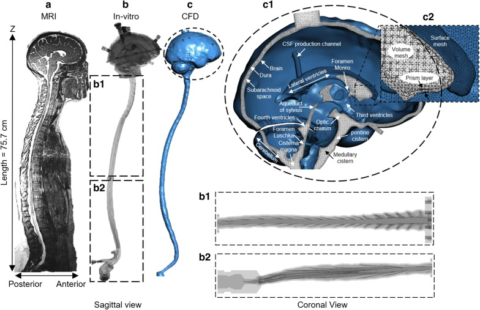
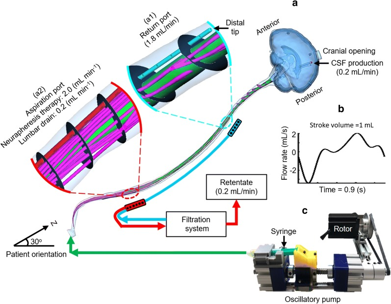
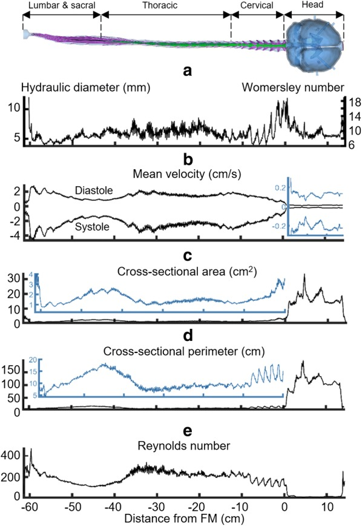
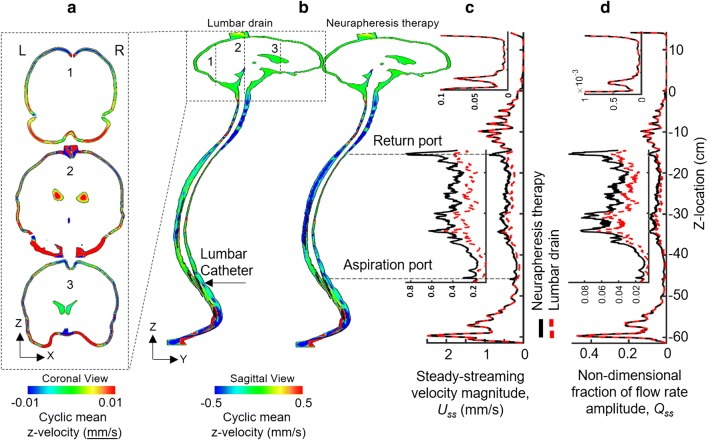
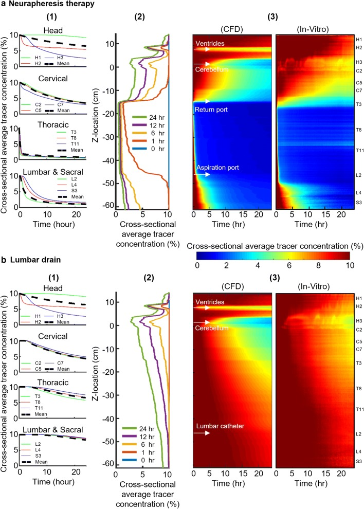
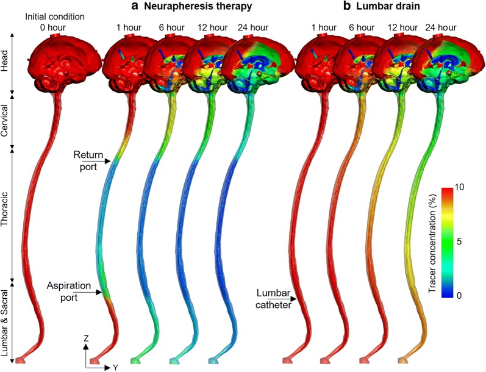
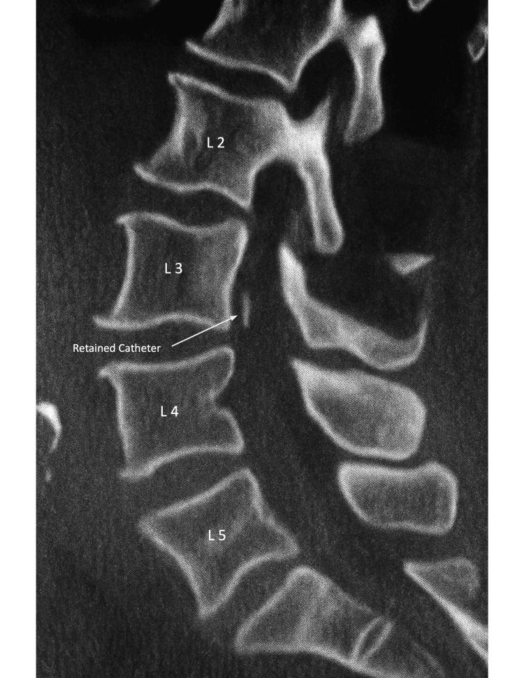
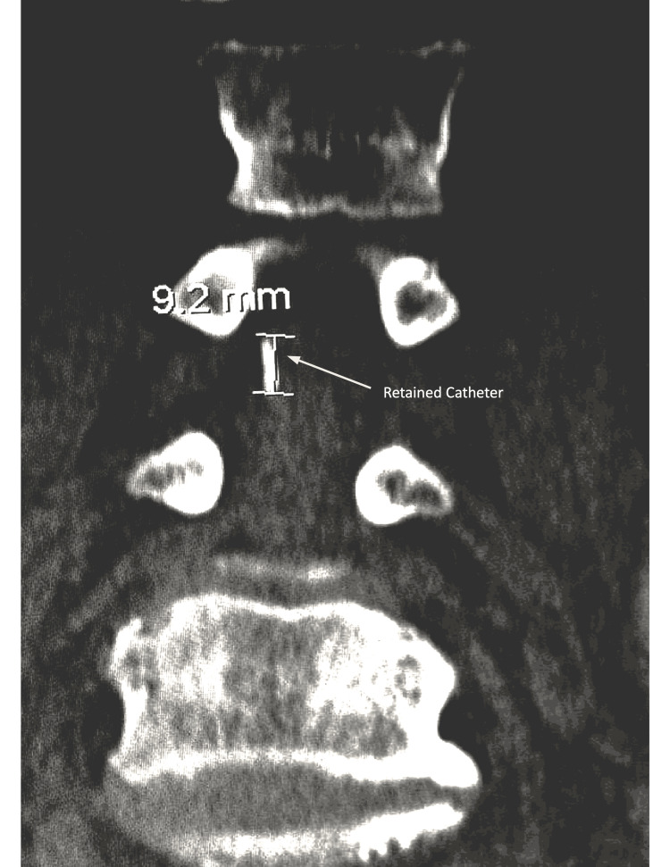
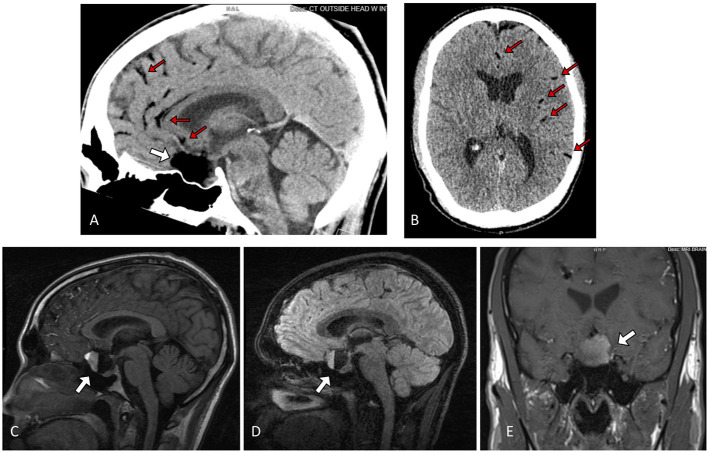
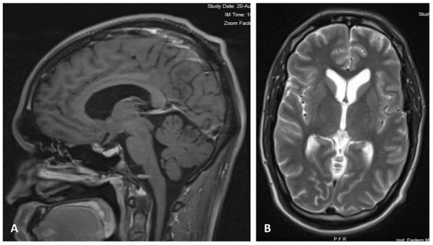

# Case Prep: Lumbar Drain Placement

---

## One-Liner
[Age]yo [M/F] requiring lumbar CSF drainage for [CSF leak / skull base surgery / NPH trial / TAAA spinal cord protection / pseudomeningocele] planned for lumbar drain placement.

---

## Figures, Imaging & Video

**🎥 Operative video** — [search operative video on YouTube ▸](https://www.youtube.com/results?search_query=lumbar+drain+surgery) · [The Neurosurgical Atlas ▸](https://www.neurosurgicalatlas.com)

[Neurosurgical Atlas](https://www.neurosurgicalatlas.com) · [Radiopaedia](https://radiopaedia.org/search?q=lumbar%20drain&scope=all) · [PubMed Central](https://www.ncbi.nlm.nih.gov/pmc/?term=lumbar+drain+cerebrospinal+fluid) — operative figures © linked; see [media-sources.md](../../resources/media-sources.md)

---

<!-- BEGIN TEXTBOOK CROSS-CHECKS -->

## Textbook Cross-Checks

- **Trajectory and device anatomy:** Greenberg; Youmans and Winn; Schmidek and Sweet — confirm entry point, trajectory, ventricular/lesion target, hardware pathway, and structures to avoid.
- **Technique sequence:** Greenberg; Youmans and Winn — review setup, navigation/fluoro/endoscopy use, sterile tunneling or stereotactic workflow, and troubleshooting steps.
- **Failure modes:** Greenberg; shunt/device literature; institution-specific protocols — summarize obstruction, malposition, infection, hemorrhage, over/under-drainage, and revision algorithms in original words.
- **Copyright-safe use:** cite these sources as private cross-checks, then write the guide content in original words; do not re-host textbook pages, figures, tables, or board-review card material. See [Source Crosswalk & Copyright-Safe Use](../../resources/source-crosswalk.md).

<!-- END TEXTBOOK CROSS-CHECKS -->

<!-- BEGIN CURATED LITERATURE -->

## High-Yield Literature

- **Letter: Lumbar Drain Placement in Acute Spinal Cord Injury is Safe: A Review of Available Evidence** — Kolcun JPG. Operative neurosurgery (Hagerstown, Md.) 2023. [PubMed](https://pubmed.ncbi.nlm.nih.gov/37306973/)
- **Tunneled lumbar drain. Technical note** — Hahn M. Journal of neurosurgery 2002. [PubMed](https://pubmed.ncbi.nlm.nih.gov/12066917/)
- **Lumbar drain** — Shimizu S. Journal of neurosurgery 2003. [PubMed](https://pubmed.ncbi.nlm.nih.gov/12593641/)
- **External lumbar drain for fistula leakage in posterior fossa and spinal surgery: a systematic review with meta-analysis** — Falcão L. Neurosurgical review 2025. [PubMed](https://pubmed.ncbi.nlm.nih.gov/41099843/)
- **Efficacy and Safety of Intraoperative Lumbar Drain in Endoscopic Skull Base Tumor Resection: A Meta-Analysis** — Guo X. Frontiers in oncology 2020. [PubMed](https://pubmed.ncbi.nlm.nih.gov/32457833/)
- **Fluoroscopic-guided Lumbar Subarachnoid Drain Placement: A Technical Report** — Lloyd JT. Journal of cardiothoracic and vascular anesthesia 2025. [PubMed](https://pubmed.ncbi.nlm.nih.gov/40133099/)
- **Lumbar drain trial outcomes of normal pressure hydrocephalus: a single-center experience of 254 patients** — El Ahmadieh TY. Journal of neurosurgery 2020. [PubMed](https://pubmed.ncbi.nlm.nih.gov/30611143/)
- **Development of a Lumbar Drain Simulator for Instructional Technique and Skill Assessment** — Clifton WE. Neurocritical care 2020. [PubMed](https://pubmed.ncbi.nlm.nih.gov/31332627/)
- **Brainstem Hemorrhage Following Lumbar Drain for Post-traumatic Hydrocephalus** — Carr MT. Cureus 2022. [PubMed](https://pubmed.ncbi.nlm.nih.gov/35903572/)
- **Lumbar Drain Use during Middle Fossa Approaches for Nonneoplastic Pathology of the Skull Base** — Dambrino RJ. Journal of neurological surgery. Part B, Skull base 2024. [PubMed](https://pubmed.ncbi.nlm.nih.gov/38721362/)

<!-- END CURATED LITERATURE -->

---

<!-- BEGIN CURATED IMAGE SET -->

## Curated Image Set

Open-access figures are embedded from PubMed Central articles and kept unique to this guide.

*Fig. 1. Overview of in vitro and numerical model based on subject specific MRI measurements. a T2-weighted MR image of the entire CSF space for the human analyzed to acquire subject-specific... Source: [In vitro and numerical simulation of blood removal from cerebrospinal fluid: comparison of lumbar drain to Neurapheresis therapy](https://pmc.ncbi.nlm.nih.gov/articles/PMC7077023/) — Fluids and Barriers of the CNS 2020; CC BY.*

*Fig. 2. Schematic of the Neurapheresis system and study protocol. a Three-dimensional CFD model of the SAS with flow boundary conditions and magnified view of the Neurapheresis catheter return... Source: [In vitro and numerical simulation of blood removal from cerebrospinal fluid: comparison of lumbar drain to Neurapheresis therapy](https://pmc.ncbi.nlm.nih.gov/articles/PMC7077023/) — Fluids and Barriers of the CNS 2020; CC BY.*

*Fig. 3. Hydrodynamic and geometric characterization of the computational domain in relation to distance from the foramen magnum (FM). a Hydraulic diameter (Left axis) and Womersley number (right... Source: [In vitro and numerical simulation of blood removal from cerebrospinal fluid: comparison of lumbar drain to Neurapheresis therapy](https://pmc.ncbi.nlm.nih.gov/articles/PMC7077023/) — Fluids and Barriers of the CNS 2020; CC BY.*

*Fig. 4. Quantification of steady-streaming velocities. Steady-streaming within the spinal SAS increases with Neurapheresis therapy compared to lumbar drain. a Coronal view of cyclic mean... Source: [In vitro and numerical simulation of blood removal from cerebrospinal fluid: comparison of lumbar drain to Neurapheresis therapy](https://pmc.ncbi.nlm.nih.gov/articles/PMC7077023/) — Fluids and Barriers of the CNS 2020; CC BY.*

*Fig. 5. Cross-sectional average tracer concentration over 24-h. a Neurapheresis therapy and b lumbar drain. (a1) Cross-sectional average tracer concentration plotted with respect to time at... Source: [In vitro and numerical simulation of blood removal from cerebrospinal fluid: comparison of lumbar drain to Neurapheresis therapy](https://pmc.ncbi.nlm.nih.gov/articles/PMC7077023/) — Fluids and Barriers of the CNS 2020; CC BY.*

*Fig. 6. CFD results for 2D tracer concentration profiles versus time under Neurapheresis therapy and lumbar drain. a Visualization of tracer concentration at 0, 1, 6, 12, and 24 h under... Source: [In vitro and numerical simulation of blood removal from cerebrospinal fluid: comparison of lumbar drain to Neurapheresis therapy](https://pmc.ncbi.nlm.nih.gov/articles/PMC7077023/) — Fluids and Barriers of the CNS 2020; CC BY.*

*Figure 1. Lumbar spine CTSagittal (lateral) view. Vertebral levels are labeled for orientation. The arrow indicates the retained catheter fragment within the intrathecal space. Source: [Retained Lumbar Drain Tip Leading to Intrathecal Hematoma: A Case Report on Perioperative Risks and Management](https://pmc.ncbi.nlm.nih.gov/articles/PMC12543038/) — Cureus 2025; CC BY.*

*Figure 2. Lumbar spine CT Coronal view. The arrow indicates the retained catheter fragment. Source: [Retained Lumbar Drain Tip Leading to Intrathecal Hematoma: A Case Report on Perioperative Risks and Management](https://pmc.ncbi.nlm.nih.gov/articles/PMC12543038/) — Cureus 2025; CC BY.*

*Figure 1. Sagittal (A) and Axial (B) non contrast Head CT showing a hypodense lesion in the sella/suprasellar region (white arrow), with associated scattered hypodense globules along the... Source: [Ruptured Suprasellar Dermoid Cyst Treated With Lumbar Drain to Prevent Postoperative Hydrocephalus: Case Report and Focused Review of Literature](https://pmc.ncbi.nlm.nih.gov/articles/PMC8385128/) — Frontiers in Surgery 2021; CC BY.*

*Figure 2. (A) Contrast-enhanced Sagittal T1 image 6 months after craniotomy, showing decompression of the sellar region with resolved mass effect over the optic pathway. (B) Axial T2 MRI at 6... Source: [Ruptured Suprasellar Dermoid Cyst Treated With Lumbar Drain to Prevent Postoperative Hydrocephalus: Case Report and Focused Review of Literature](https://pmc.ncbi.nlm.nih.gov/articles/PMC8385128/) — Frontiers in Surgery 2021; CC BY.*

<!-- END CURATED IMAGE SET -->

---

## History of Present Illness / Indication
- **Indications:**
  - CSF leak (spontaneous, post-op, post-traumatic rhinorrhea/otorrhea) — divert CSF to allow healing
  - Skull base/posterior fossa surgery (brain relaxation, post-op leak prevention)
  - **NPH evaluation** (lumbar drain trial — sustained drainage to predict shunt response)
  - Thoracoabdominal aortic aneurysm repair (spinal cord perfusion protection)
  - Pseudomeningocele, post-dural puncture management
  - Intrathecal access/pressure monitoring

---

## Imaging Review
### MRI/CT Lumbar Spine (if anatomy concern)
- Lumbar level patency, spinal canal, no mass/Chiari (**contraindicated if obstructive hydrocephalus or posterior fossa mass with downward pressure gradient → herniation risk**)
- Rule out elevated ICP from mass lesion before lumbar drainage

---

## Labs
- CBC (Plt > 50-100K), Coags (INR < 1.4) — correct before placement

---

## Neurological Examination
- Baseline; document for NPH trial (gait, cognition)

---

## Surgical Planning

### Contraindications
- Obstructive hydrocephalus / posterior fossa mass / large supratentorial mass with shift (**herniation risk**)
- Coagulopathy, infection at site, blocked spinal CSF spaces

### Position
- **Lateral decubitus** (knees-to-chest, flexed) or sitting; standard LP positioning

### Key Steps
1. Identify level — **L3-4 or L4-5** (below conus, ~L1-2); palpate iliac crests (intercristal line ~ L4)
2. Sterile prep and drape, local anesthesia
3. Insert Tuohy needle (14g) into subarachnoid space, confirm CSF flow
4. Thread the lumbar catheter through the needle (cephalad), advance ~5-8 cm into the intrathecal space
5. Remove needle over catheter (do not withdraw catheter through needle — shears it)
6. Confirm CSF flow through catheter
7. Secure/tunnel catheter, apply occlusive dressing, connect to closed drainage system
8. Set drainage level/rate (e.g., 10-15 mL/hr, or to a pressure level)

### Critical Considerations
1. **Over-drainage** — most dangerous; can cause tonsillar herniation, subdural hematoma, tension pneumocephalus, abducens palsy. Strict rate control, never open to gravity uncontrolled
2. Conus medullaris — stay below L2
3. Nerve roots (radicular pain on threading — reposition)

### Equipment
- Lumbar drain kit (Tuohy needle, catheter, closed drainage system with graduated chamber)
- Sterile prep, local anesthetic

### Potential Complications
1. **Over-drainage → herniation, subdural hematoma, pneumocephalus, CN VI palsy, severe positional headache**
2. Infection (meningitis) — sterile technique, limit duration
3. Catheter retention/shearing/fracture, nerve root irritation
4. Failure/dislodgement, CSF leak at site

---

## Operative/Procedure Note Template
**Preoperative Diagnosis:** [CSF leak / skull-base surgery adjunct / NPH trial / spinal cord protection]

**Postoperative Diagnosis:** Same

**Procedure:** Lumbar drain placement

**Performed by:**
**Anesthesia:** [Local ± sedation / general]
**Adjuncts:** Lumbar drain kit (Tuohy needle, catheter, closed graduated drainage system)
**Complications:** None

**Indications:** [Age]yo [M/F] requiring controlled lumbar CSF drainage for [indication]. Obstructive hydrocephalus/posterior fossa mass excluded (herniation risk). Coagulation parameters corrected. Risks (overdrainage/herniation, infection, headache) discussed.

**Description of Procedure:** With the patient in [lateral decubitus/sitting] and sterile prep/drape, local anesthesia was infiltrated at [L3-4 / L4-5] (below the conus). A Tuohy needle was advanced into the subarachnoid space with **CSF flow confirmed**, and the lumbar catheter threaded cephalad ~5–8 cm; the needle was removed over the catheter (never withdrawing the catheter through the needle). CSF flow through the catheter was reconfirmed, the catheter secured with an occlusive dressing, and connected to a **closed graduated drainage system set to [10–15 mL/hr / a pressure level]**.

The patient was transferred with a strict controlled-drainage nursing protocol (clamp for transfers/position changes) and neuro monitoring for overdrainage.

---

## Postoperative / Management Plan
- **Controlled drainage** — specify rate (e.g., 10-15 mL/hr) or pressure level; **never uncontrolled gravity drainage**
- Strict nursing protocol: clamp during position changes/transport; monitor hourly output
- Neuro checks q1-2h; watch for over-drainage (severe headache, decreased consciousness, new CN VI palsy → clamp drain, CT)
- Flat or low HOB initially per indication
- CSF sampling for infection surveillance per protocol; limit duration (infection risk rises after ~5 days)
- NPH trial: assess gait/cognition before and during drainage (response predicts shunt benefit)
- Removal: clamp trial, then remove; check site
