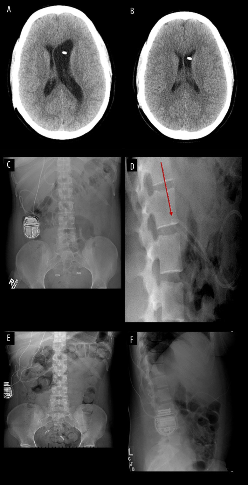
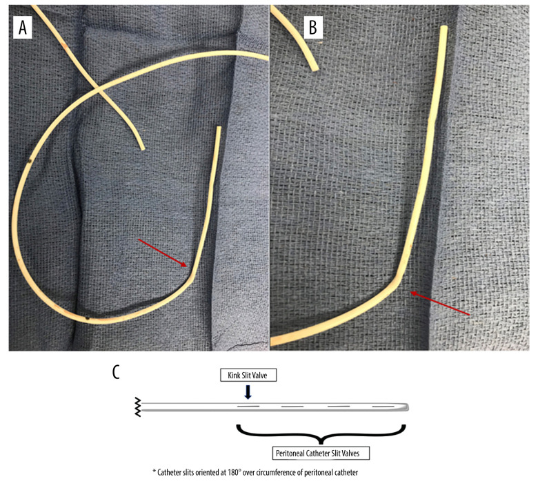
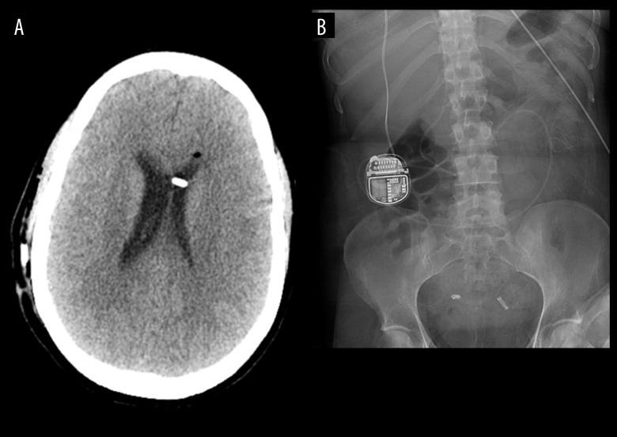
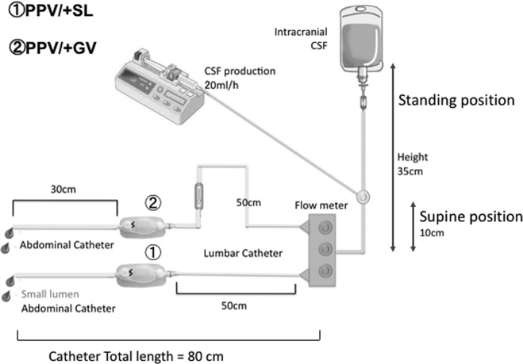
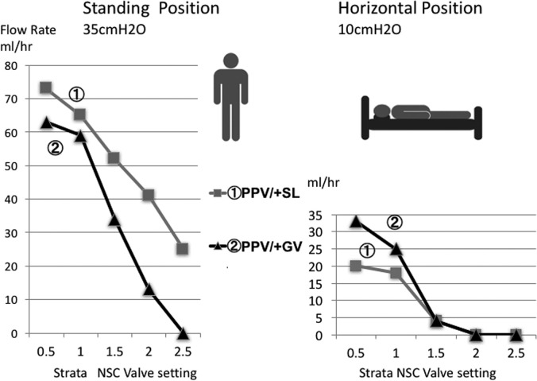
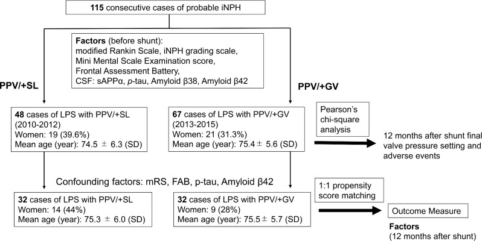
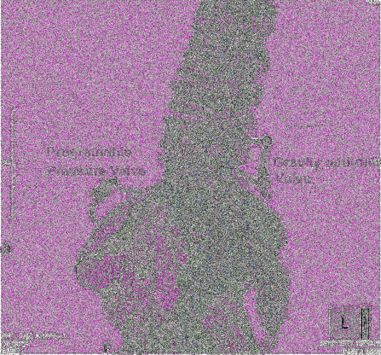
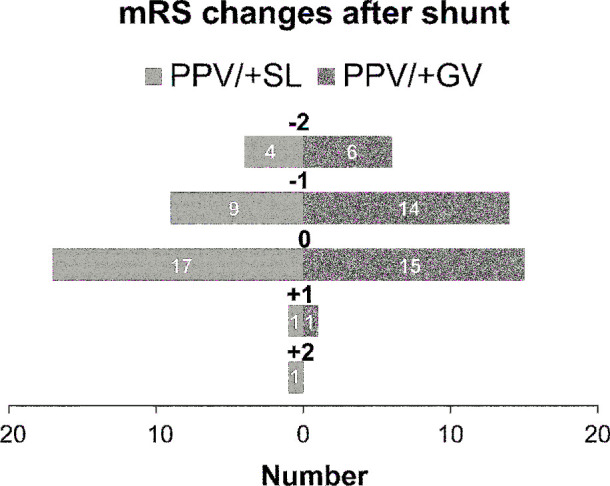
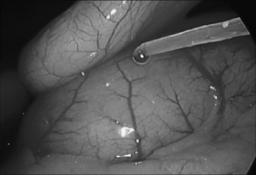
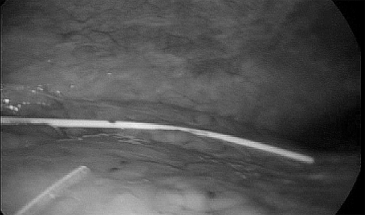

# Case Prep: Lumboperitoneal (LP) Shunt Placement

<!-- BEGIN CASE SNAPSHOT -->

## Case / Approach Snapshot

- **Anatomy at risk:** entry point, ventricular target, choroid plexus and deep veins, cortical vessels, eloquent cortex/tracts, catheter path, and distal hardware route.
- **Operative steps:** confirm indication and side, plan trajectory, prepare hardware, access ventricle or cistern safely, confirm flow/position, tunnel/connect devices when needed, and define infection/obstruction surveillance; use the detailed operative sequence and approach notes below as the step-by-step source.
- **Rescue plans:** malposition, hemorrhage, poor CSF return, overdrainage/underdrainage, obstruction, infection, abdominal/pleural complication, slit ventricles, and revision algorithm.
- **Figures:** review [Figures, Imaging & Video](#figures-imaging--video) and the [Curated Image Set](#curated-image-set); embedded local figures should remain open-access, public-domain, or otherwise reusable with attribution.
- **Papers:** review [High-Yield Literature](#high-yield-literature) for seminal sources, modern reviews, and outcome data specific to this page.

<!-- END CASE SNAPSHOT -->

## One-Liner
[Age]yo [M/F] with [idiopathic intracranial hypertension (IIH/pseudotumor) / communicating hydrocephalus / CSF leak / NPH] planned for lumboperitoneal shunt placement [with horizontal-vertical or programmable valve].

---

## Figures, Imaging & Video

**🎥 Operative video** — [search operative video on YouTube ▸](https://www.youtube.com/results?search_query=lumboperitoneal+shunt+surgery) · [The Neurosurgical Atlas ▸](https://www.neurosurgicalatlas.com)

[Neurosurgical Atlas](https://www.neurosurgicalatlas.com) · [Radiopaedia](https://radiopaedia.org/search?q=lumboperitoneal%20shunt&scope=all) · [PubMed Central](https://www.ncbi.nlm.nih.gov/pmc/?term=lumboperitoneal+shunt+IIH) — operative figures © linked; see [media-sources.md](../../../resources/media-sources.md)

---

<!-- BEGIN CURATED LITERATURE -->

## High-Yield Literature

- **Incidence of radiculopathy following lumboperitoneal shunt placement without fluoroscopy for normal pressure hydrocephalus** — Tanaka T. Surgical neurology international 2022. [PubMed](https://pubmed.ncbi.nlm.nih.gov/36324979/)
- **Early postoperative lumbar catheter severing in a lumboperitoneal shunt due to bite-off by the spinous processes following a fall on the buttocks: illustrative case** — Munakata R. Journal of neurosurgery. Case lessons 2024. [PubMed](https://pubmed.ncbi.nlm.nih.gov/39740214/)
- **Rare complication of lumboperitoneal shunt with distal catheter migration into the inguinal hernia sac in two adults: A case report** — Tanaka T. Surgical neurology international 2023. [PubMed](https://pubmed.ncbi.nlm.nih.gov/38053705/)
- **Laparoscopic transabdominal lumboperitoneal shunt** — Huie F. Surgical endoscopy 1999. [PubMed](https://pubmed.ncbi.nlm.nih.gov/9918621/)
- **Creating of "fascial sheath" around subcutaneous lumboperitoneal shunt catheters largely prevents postoperative subcutaneous shunt catheter migration** — Tanaka T. Surgical neurology international 2022. [PubMed](https://pubmed.ncbi.nlm.nih.gov/36447847/)
- **Minimizing complications in lumboperitoneal shunt for normal pressure hydrocephalus: Technical note and case series** — Pisano P. Surgical neurology international 2026. [PubMed](https://pubmed.ncbi.nlm.nih.gov/41952729/)
- **Intra-bronchial migration of peritoneal catheter of lumboperitoneal shunt** — Kawahara T. Surgical neurology international 2015. [PubMed](https://pubmed.ncbi.nlm.nih.gov/26962468/)
- **New lumboperitoneal shunt catheter** — Selman WR. Surgical neurology 1984. [PubMed](https://pubmed.ncbi.nlm.nih.gov/6689811/)
- **Late intrathecal retraction of a lumboperitoneal shunt** — Kim YJ. Surgical neurology international 2023. [PubMed](https://pubmed.ncbi.nlm.nih.gov/38213441/)
- **Use of Pneumoperitoneal Puncture for Peritoneal Catheter Placement in Lumboperitoneal Shunt Surgery: Technical Note** — He J. World neurosurgery 2017. [PubMed](https://pubmed.ncbi.nlm.nih.gov/28433843/)

<!-- END CURATED LITERATURE -->

<!-- BEGIN CURATED IMAGE SET -->

## Curated Image Set

Open-access figures are embedded from PubMed Central articles and kept unique to this guide.

*Figure 1.. Axial computed tomography (CT) scan depicting enlarged ventricles. (A) compared to prior CT scan (B) concerning for shunt failure. Anteroposterior (C) and lateral (D) shunt series X-rays... Source: [Ventriculoperitoneal Shunt Failure Due to Distal Peritoneal Catheter Kinking](https://pmc.ncbi.nlm.nih.gov/articles/PMC8994830/) — The American Journal of Case Reports 2022; CC BY-NC-ND.*

*Figure 2.. Intraoperative images (A, B) demonstrating kinking of the distal catheter at the site of the distal peritoneal slit valves (arrow). Illustration (C) depicting the location of the... Source: [Ventriculoperitoneal Shunt Failure Due to Distal Peritoneal Catheter Kinking](https://pmc.ncbi.nlm.nih.gov/articles/PMC8994830/) — The American Journal of Case Reports 2022; CC BY-NC-ND.*

*Figure 3.. Axial postoperative computed tomography (CT) scan depicting interval decrease in the size of the ventricles (A). Shunt series X-rays demonstrating intact shunt system with no kinking or... Source: [Ventriculoperitoneal Shunt Failure Due to Distal Peritoneal Catheter Kinking](https://pmc.ncbi.nlm.nih.gov/articles/PMC8994830/) — The American Journal of Case Reports 2022; CC BY-NC-ND.*

*FIGURE 1.. Shunt system experiments. Based on previous studies, we set the standing (vertical) pressure at 35 cmH2O and the supine (horizontal) position pressure at 10 cmH2O. We simulated CSF... Source: [Lumboperitoneal Shunts for the Treatment of Idiopathic Normal Pressure Hydrocephalus: A Comparison of Small-Lumen Abdominal Catheters to Gravitational Add-On Valves in a Single Center](https://pmc.ncbi.nlm.nih.gov/articles/PMC6373832/) — Operative Neurosurgery 2018; CC BY.*

*FIGURE 2.. Comparison between the small-lumen abdominal catheter and gravitational add-on valve. We measured the flow rate (mL/h) at simulated standing (35 cmH2O) and supine (10 cmH2O) positions... Source: [Lumboperitoneal Shunts for the Treatment of Idiopathic Normal Pressure Hydrocephalus: A Comparison of Small-Lumen Abdominal Catheters to Gravitational Add-On Valves in a Single Center](https://pmc.ncbi.nlm.nih.gov/articles/PMC6373832/) — Operative Neurosurgery 2018; CC BY.*

*FIGURE 3.. Subject flow diagram. GV = gravity add-on valve, iNPH = idiopathic normal pressure hydrocephalus, LPS = lumboperitoneal shunt, MMSE = Mini Mental State Examination, PPV = programmable... Source: [Lumboperitoneal Shunts for the Treatment of Idiopathic Normal Pressure Hydrocephalus: A Comparison of Small-Lumen Abdominal Catheters to Gravitational Add-On Valves in a Single Center](https://pmc.ncbi.nlm.nih.gov/articles/PMC6373832/) — Operative Neurosurgery 2018; CC BY.*

*FIGURE 4.. A lumbar 3-dimensional image obtained after LPS implantation with a gravity add-on valve and a Strata NSC programmable pressure valve. Source: [Lumboperitoneal Shunts for the Treatment of Idiopathic Normal Pressure Hydrocephalus: A Comparison of Small-Lumen Abdominal Catheters to Gravitational Add-On Valves in a Single Center](https://pmc.ncbi.nlm.nih.gov/articles/PMC6373832/) — Operative Neurosurgery 2018; CC BY.*

*FIGURE 5.. mRS score changes after LPS implantation. Source: [Lumboperitoneal Shunts for the Treatment of Idiopathic Normal Pressure Hydrocephalus: A Comparison of Small-Lumen Abdominal Catheters to Gravitational Add-On Valves in a Single Center](https://pmc.ncbi.nlm.nih.gov/articles/PMC6373832/) — Operative Neurosurgery 2018; CC BY.*

*Figure 1.. Flow of cerebrospinal fluid is confirmed visually after lumboperitoneal shunt placement. Source: [Laparoscopic Management of Ventriculoperitoneal and Lumboperitoneal Shunt Complications](https://pmc.ncbi.nlm.nih.gov/articles/PMC3015814/) — JSLS : Journal of the Society of Laparoendoscopic Surgeons 2007; CC BY-NC-ND.*

*Figure 2.. Foreign body-detached prior shunt is visualized and retrieved. Source: [Laparoscopic Management of Ventriculoperitoneal and Lumboperitoneal Shunt Complications](https://pmc.ncbi.nlm.nih.gov/articles/PMC3015814/) — JSLS : Journal of the Society of Laparoendoscopic Surgeons 2007; CC BY-NC-ND.*

<!-- END CURATED IMAGE SET -->

---

## History of Present Illness
- Chief complaint: IIH (headache, **papilledema, visual loss, pulsatile tinnitus**, diplopia/CN VI), communicating hydrocephalus, or persistent CSF leak
- **LP requires communicating CSF spaces** (CSF must flow from cranial to lumbar — NOT for obstructive hydrocephalus)
- **IIH:** failed medical therapy (acetazolamide, weight loss), progressive visual loss; LP shunt or VP shunt or venous sinus stenting options
- LP function harder to assess clinically (no easily tappable reservoir)

---

## Past Medical History
- Obesity (IIH association; also affects peritoneal catheter, abdominal pressure)
- **Chiari/tonsillar position** (LP overdrainage can cause acquired tonsillar herniation), prior lumbar surgery/arthritis, scoliosis
- Standard PMH

---

## Imaging Review
### MRI brain
- **Exclude obstructive hydrocephalus and mass** (LP only for communicating), signs of IIH (empty sella, flattened globes, optic nerve tortuosity, slit ventricles), **tonsillar position** (baseline — overdrainage risk)
### MRV
- Venous sinus stenosis (IIH — consider stenting alternative)
### Lumbar imaging
- Anatomy for catheter placement
### LP/opening pressure
- Elevated OP confirms IIH; CSF studies

---

## Labs
- CBC, BMP, Coags, type and screen

---

## Neurological Examination
- **Visual acuity, fields, fundoscopy (papilledema)**, CN VI, headache; baseline for IIH

---

## Surgical Planning

### Case Logistics, OR Needs & Orders
- **OR setup:** navigation or endoscope as indicated, shunt hardware/valve setting verified, distal-access tools or general surgery help when needed, antibiotic-impregnated catheter availability, and postop imaging plan.
- **Special needs:** antibiotic timing, programmable valve documentation, abdominal/chest/vascular distal-site plan, CSF culture plan for revision/infection, anticoagulation plan, and EVD backup if access fails.
- **Immediate postop orders:** neuro checks, CT or shunt-series timing, valve setting documentation and MRI precautions, wound/abdominal/distal-site checks, infection watch, DVT timing, and follow-up for setting adjustment.

### Valve / Overdrainage Consideration
- **Overdrainage is the central challenge** (siphoning when upright); use **horizontal-vertical valve, gravitational, or programmable** valve to reduce postural overdrainage and low-pressure headaches

### Position
- **Lateral decubitus** (lumbar puncture position), flexed; then access abdomen (may reposition)

### Key Surgical Steps
1. **Lumbar (proximal) catheter:** Tuohy needle into the **L3-4 or L4-5 subarachnoid space** (paramedian), confirm CSF flow, thread the lumbar catheter cephalad into the thecal sac several cm; remove needle over catheter (never withdraw catheter through needle — shears)
2. Anchor at the lumbar fascia (avoid kinking; some tunnel through a small fascial incision)
3. **Tunnel** the catheter subcutaneously around the flank to the abdomen
4. **Peritoneal (distal) catheter:** small abdominal incision (as VP), enter peritoneum, insert distal catheter
5. **Interpose valve** (horizontal-vertical/programmable/anti-siphon) along the system (often at the flank)
6. Confirm CSF flow through the system; closure
7. (Some use fluoroscopy to confirm lumbar catheter position)

### Critical Anatomy & Structures at Risk
1. **Lumbar nerve roots / cauda equina** (catheter — radicular pain)
2. **Conus medullaris** (stay below L2)
3. **Peritoneum/bowel** (abdominal entry)
4. **Overdrainage → acquired Chiari/tonsillar herniation, low-pressure headaches**

### Equipment
- LP shunt kit (Tuohy needle, lumbar catheter), **horizontal-vertical/programmable valve**, peritoneal catheter
- Fluoroscopy (optional), antibiotic-impregnated catheter, tunneler

### Anesthesia
- General (or local/sedation for parts); cefazolin

### Potential Complications
1. **Overdrainage** — low-pressure/postural headache, **acquired Chiari I / tonsillar herniation**, slit ventricles
2. **Difficult to assess function/obstruction** (no tappable reservoir), radiculopathy, lumbar catheter migration
3. Infection, CSF leak at lumbar site, peritoneal complications
4. Catheter fracture/migration, scoliosis/arthritis limiting placement (children)

---

## Operative Note Template
**Preoperative Diagnosis:** [Idiopathic intracranial hypertension / communicating hydrocephalus / CSF leak]

**Postoperative Diagnosis:** Same

**Procedure:** Lumboperitoneal shunt placement with [horizontal-vertical / programmable] valve

**Surgeon / Assistant:**
**Anesthesia:** General endotracheal [or local + sedation]
**EBL / Fluids:**
**Adjuncts:** Tuohy needle, [fluoroscopy], tunneler
**Implants:** Lumbar (subarachnoid) catheter, horizontal-vertical/programmable valve, peritoneal catheter
**Complications:** None

**Indications:** [Age]yo [M/F] with [IIH with visual symptoms / communicating hydrocephalus] and confirmed communicating CSF spaces (no obstructive lesion/mass). Risks (overdrainage, acquired Chiari, difficult function assessment) discussed.

**Description of Procedure:** After consent and time-out, the patient was positioned in lateral decubitus. A Tuohy needle was placed into the **L3-4/L4-5 subarachnoid space** (paramedian) with **CSF return confirmed**, and the lumbar catheter threaded cephalad several centimeters; the needle was removed over the catheter (never withdrawing the catheter through the needle). The catheter was anchored at the lumbar fascia and **tunneled** around the flank to a small abdominal incision, where the peritoneum was entered and the distal catheter inserted.

A **horizontal-vertical/programmable valve** was interposed to limit postural overdrainage, and **CSF flow through the system confirmed** before closure.

The patient was transferred with monitoring for overdrainage (postural headache) and visual follow-up (IIH).

---

## Postoperative Plan
- Floor, neuro checks, **visual/headache assessment** (IIH), watch for **overdrainage** (positional headache → may need to raise programmable setting)
- Ophthalmology follow-up (papilledema/visual fields — IIH)
- Shunt series baseline (LP shunt films), document valve setting
- Monitor for acquired Chiari symptoms; counsel that LP function is harder to assess (clinical/imaging follow-up)
- Weight management/medical therapy continuation (IIH)

<!-- BEGIN COMMON PIMP QUESTIONS -->

## Common Pimp Questions

Use these to pressure-test preparation for **Lumboperitoneal (LP) Shunt Placement**:

1. What is the working CSF physiology problem: obstruction, absorption failure, overdrainage, infection, or catheter failure?
2. Where exactly is the entry point, target, and backup trajectory?
3. What valve, catheter, endoscope, or navigation preference does the attending use?
4. What is the infection-prevention plan and what cultures/CSF studies are needed?
5. What postop imaging, valve setting, drainage level, and neuro-check plan should be written?

<!-- END COMMON PIMP QUESTIONS -->

<!-- BEGIN ATTENDING PREFERENCE VARIABLES -->

## Attending Preference Variables

Items that commonly vary by surgeon or institution:

- **Valve brand/setting, antibiotic catheter use, and tunneling side:** [attending-specific]
- **Navigation/endoscope/stylet preference and ventricular target:** [attending-specific]
- **CSF culture/lab routine and perioperative antibiotic duration:** [attending-specific]
- **Postop scan timing, EVD height or valve verification, and activity restrictions:** [attending-specific]

<!-- END ATTENDING PREFERENCE VARIABLES -->
