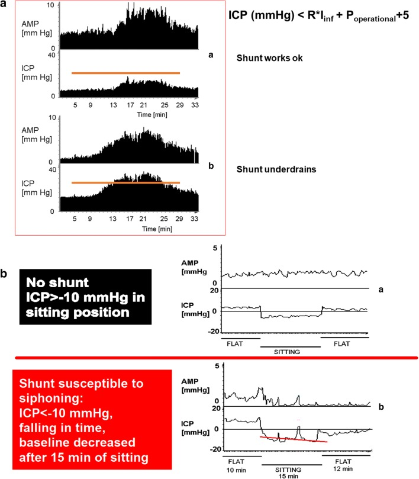
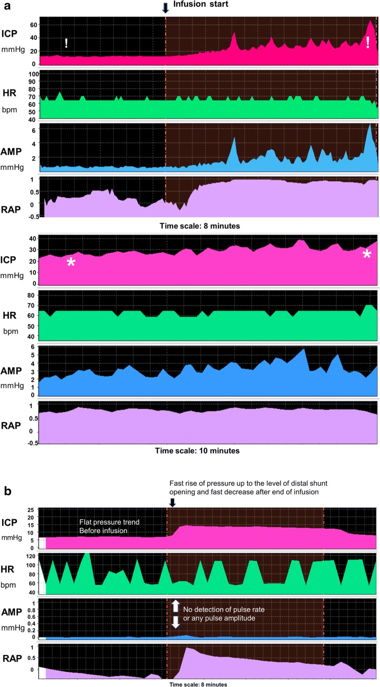
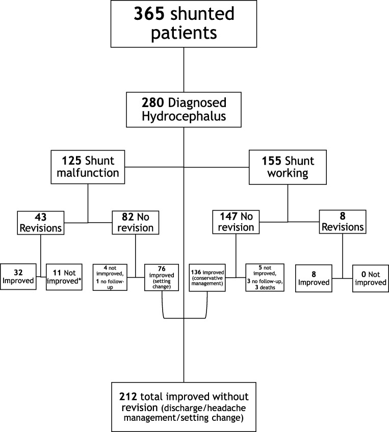
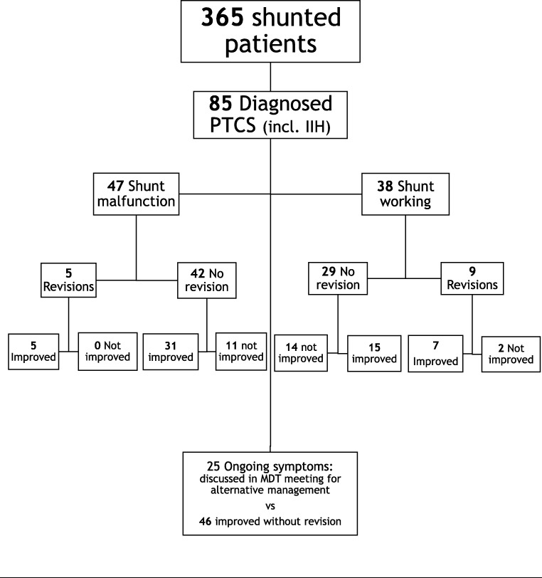
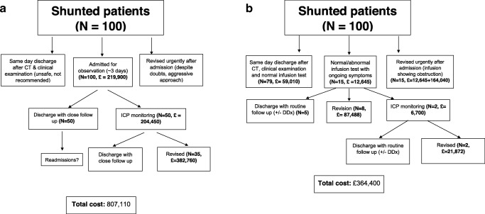
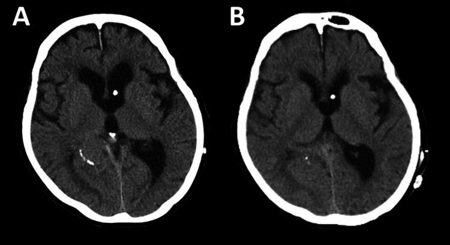
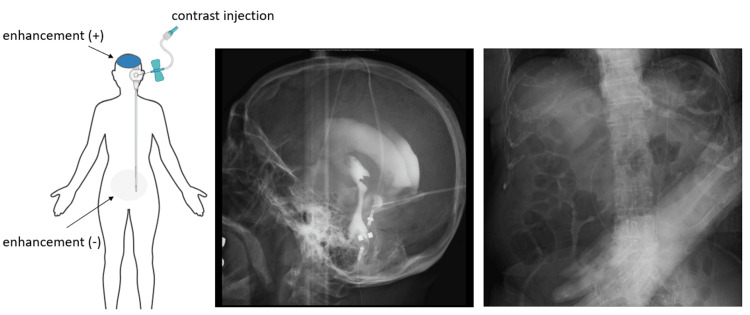
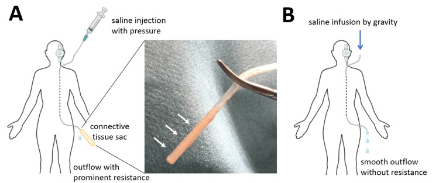
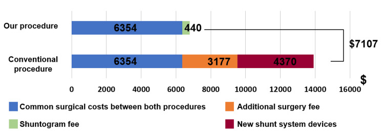
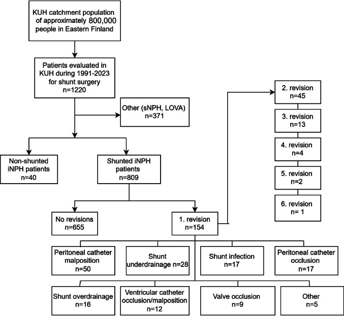

# Case Prep: Shunt Revision / Exploration

---

<!-- BEGIN CASE SNAPSHOT -->

## Case / Approach Snapshot

- **Anatomy at risk:** entry point, ventricular target, choroid plexus and deep veins, cortical vessels, eloquent cortex/tracts, catheter path, and distal hardware route.
- **Operative steps:** confirm indication and side, plan trajectory, prepare hardware, access ventricle or cistern safely, confirm flow/position, tunnel/connect devices when needed, and define infection/obstruction surveillance; use the detailed operative sequence and approach notes below as the step-by-step source.
- **Rescue plans:** malposition, hemorrhage, poor CSF return, overdrainage/underdrainage, obstruction, infection, abdominal/pleural complication, slit ventricles, and revision algorithm.
- **Figures:** review [Figures, Imaging & Video](#figures-imaging--video) and the [Curated Image Set](#curated-image-set); embedded local figures should remain open-access, public-domain, or otherwise reusable with attribution.
- **Papers:** review [High-Yield Literature](#high-yield-literature) for seminal sources, modern reviews, and outcome data specific to this page.

<!-- END CASE SNAPSHOT -->

## One-Liner
[Age]yo [M/F] with an existing [VP/VA/VPL/LP] shunt presenting with [shunt malfunction (raised ICP) / infection / overdrainage / distal failure] planned for shunt exploration and revision.

---

## Figures, Imaging & Video

**🎥 Operative video** — [search operative video on YouTube ▸](https://www.youtube.com/results?search_query=shunt+malfunction+surgery) · [The Neurosurgical Atlas ▸](https://www.neurosurgicalatlas.com)

[Neurosurgical Atlas](https://www.neurosurgicalatlas.com) · [Radiopaedia](https://radiopaedia.org/search?q=shunt%20malfunction&scope=all) · [PubMed Central](https://www.ncbi.nlm.nih.gov/pmc/?term=shunt+revision+malfunction) — operative figures © linked; see [media-sources.md](../../../resources/media-sources.md)

---

<!-- BEGIN COMMON PIMP QUESTIONS -->

## Common Pimp Questions

Use these to pressure-test preparation for **Shunt Revision / Exploration**:

1. What is the working CSF physiology problem: obstruction, absorption failure, overdrainage, infection, or catheter failure?
2. Where exactly is the entry point, target, and backup trajectory?
3. What valve, catheter, endoscope, or navigation preference does the attending use?
4. What is the infection-prevention plan and what cultures/CSF studies are needed?
5. What postop imaging, valve setting, drainage level, and neuro-check plan should be written?

<!-- END COMMON PIMP QUESTIONS -->

<!-- BEGIN ATTENDING PREFERENCE VARIABLES -->

## Attending Preference Variables

Items that commonly vary by surgeon or institution:

- **Valve brand/setting, antibiotic catheter use, and tunneling side:** [attending-specific]
- **Navigation/endoscope/stylet preference and ventricular target:** [attending-specific]
- **CSF culture/lab routine and perioperative antibiotic duration:** [attending-specific]
- **Postop scan timing, EVD height or valve verification, and activity restrictions:** [attending-specific]

<!-- END ATTENDING PREFERENCE VARIABLES -->

<!-- BEGIN CURATED LITERATURE -->

## High-Yield Literature

- **Distal ventriculoperitoneal shunt catheter tightly coiled around the valve in the absence of a subgaleal cerebrospinal fluid collection: illustrative case** — Tamura G. Journal of neurosurgery. Case lessons 2021. [PubMed](https://pubmed.ncbi.nlm.nih.gov/35855019/)
- **Seizures as presentation of shunt malfunction: tertiary paediatric neurosurgery experience** — Goel A. Child's nervous system : ChNS : official journal of the International Society for Pediatric Neurosurgery 2024. [PubMed](https://pubmed.ncbi.nlm.nih.gov/38587624/)
- **Diagnosis of Ventriculoperitoneal Shunt Malfunction: A Practical Algorithm** — Broggi M. World neurosurgery 2020. [PubMed](https://pubmed.ncbi.nlm.nih.gov/32058113/)
- **Lumboperitoneal Shunt Malfunction Due to Misplacement of the Lumbar Catheter Into the Spinal Subdural Extra-arachnoid Space: A Case Report** — Hashida K. Cureus 2025. [PubMed](https://pubmed.ncbi.nlm.nih.gov/41084704/)
- **Cerebrospinal Fluid Shunts to Treat Hydrocephalus and Idiopathic Intracranial Hypertension: Shunt Catheters and Valves** — D'Antona L. Neurosurgery clinics of North America 2025. [PubMed](https://pubmed.ncbi.nlm.nih.gov/40054976/)
- **Ventriculopleural shunts in a pediatric population: a review of 170 consecutive patients** — Christian EA. Journal of neurosurgery. Pediatrics 2021. [PubMed](https://pubmed.ncbi.nlm.nih.gov/34388722/)
- **Risk factors for shunt malfunction in pediatric hydrocephalus: a multicenter prospective cohort study** — Riva-Cambrin J. Journal of neurosurgery. Pediatrics 2016. [PubMed](https://pubmed.ncbi.nlm.nih.gov/26636251/)
- **The role of lumboperitoneal shunts in managing chronic hydrocephalus with slit ventricles** — Marupudi NI. Journal of neurosurgery. Pediatrics 2018. [PubMed](https://pubmed.ncbi.nlm.nih.gov/30239284/)
- **Mechanical complications of cerebrospinal fluid shunt. Differences between adult and pediatric populations: myths or reality?** — Coll G. Child's nervous system : ChNS : official journal of the International Society for Pediatric Neurosurgery 2021. [PubMed](https://pubmed.ncbi.nlm.nih.gov/33768313/)
- **Impact of Early Intervention for Idiopathic Normal Pressure Hydrocephalus on Long-Term Prognosis in Prodromal Phase** — Kajimoto Y. Frontiers in neurology 2022. [PubMed](https://pubmed.ncbi.nlm.nih.gov/35481276/)

<!-- END CURATED LITERATURE -->

---

<!-- BEGIN CURATED IMAGE SET -->

## Curated Image Set

Open-access figures are embedded from PubMed Central articles and kept unique to this guide.

*Fig. 1. Shunt testing results of under- and overdrainage. a Top: Normally functioning shunt, with the plateau (steady-state) pressure after infusion of Hartmann’s not exceeding the shunt’s... Source: [Shunt infusion studies: impact on patient outcome, including health economics](https://pmc.ncbi.nlm.nih.gov/articles/PMC7156359/) — Acta Neurochirurgica 2020; CC BY.*

*Fig. 2. Shunt testing results of proximal and distal obstruction. a Distal obstruction. Upper panel: distal obstruction detected after infusion of fluid. Initial baseline ICP appears normal (c.... Source: [Shunt infusion studies: impact on patient outcome, including health economics](https://pmc.ncbi.nlm.nih.gov/articles/PMC7156359/) — Acta Neurochirurgica 2020; CC BY.*

*Fig. 3. 1-year outcome of patients with diagnosed hydrocephalus of multiple aetiologies undergoing CSF infusion studies for shunt function assessment in vivo. *1: Not improved after revision:... Source: [Shunt infusion studies: impact on patient outcome, including health economics](https://pmc.ncbi.nlm.nih.gov/articles/PMC7156359/) — Acta Neurochirurgica 2020; CC BY.*

*Fig. 4. 1-year outcome of patients with diagnosed pseudotumour cerebri syndrome undergoing CSF infusion studies for shunt function assessment in vivo Source: [Shunt infusion studies: impact on patient outcome, including health economics](https://pmc.ncbi.nlm.nih.gov/articles/PMC7156359/) — Acta Neurochirurgica 2020; CC BY.*

*Fig. 5. Elementary decision tree analysis of a costs of shunt malfunction management without infusion studies, b costs of shunt malfunction management as derived from our infusion study... Source: [Shunt infusion studies: impact on patient outcome, including health economics](https://pmc.ncbi.nlm.nih.gov/articles/PMC7156359/) — Acta Neurochirurgica 2020; CC BY.*

*Figure 1. CT images(A) Preoperative CT. (B) Postoperative CT. Source: [Accurate Preoperative and Intraoperative Evaluation Reduces Surgical Costs and Patient Invasiveness in Ventriculoperitoneal Shunt Revision](https://pmc.ncbi.nlm.nih.gov/articles/PMC11247248/) — Cureus 2024; CC BY.*

*Figure 2. Preoperative shuntogram(Left) Schematic diagram showing the smooth flow of the contrast agent into the ventricles, but no progression toward the abdominal cavity. (Middle) Fluoroscopic... Source: [Accurate Preoperative and Intraoperative Evaluation Reduces Surgical Costs and Patient Invasiveness in Ventriculoperitoneal Shunt Revision](https://pmc.ncbi.nlm.nih.gov/articles/PMC11247248/) — Cureus 2024; CC BY.*

*Figure 3. Schematic diagram of cerebrospinal fluid flow changes during surgery(A) The peritoneal catheter's tip was obstructed by a connective tissue sac (arrows), blocking saline outflow. (B)... Source: [Accurate Preoperative and Intraoperative Evaluation Reduces Surgical Costs and Patient Invasiveness in Ventriculoperitoneal Shunt Revision](https://pmc.ncbi.nlm.nih.gov/articles/PMC11247248/) — Cureus 2024; CC BY.*

*Figure 4. The cost differences between the conventional procedure and the procedure used in this caseConventional shunt revision takes about 135 minutes, whereas our method shortens the process by... Source: [Accurate Preoperative and Intraoperative Evaluation Reduces Surgical Costs and Patient Invasiveness in Ventriculoperitoneal Shunt Revision](https://pmc.ncbi.nlm.nih.gov/articles/PMC11247248/) — Cureus 2024; CC BY.*

*Fig. 1. The study cohort of shunted idiopathic normal pressure hydrocephalus (iNPH) patients from Kuopio University Hospital catchment population in 1991–2023 presented as a flow chart. Causes... Source: [Reduced risk of shunt revision with adjustable valves: a population-based cohort study over three decades](https://pmc.ncbi.nlm.nih.gov/articles/PMC12872731/) — Acta Neurochirurgica 2026; CC BY.*

<!-- END CURATED IMAGE SET -->

---

## History of Present Illness
- Chief complaint: Return of hydrocephalus symptoms (headache, vomiting, lethargy, decreased consciousness, irritability/bulging fontanelle in infants), OR fever/abdominal pain (infection/pseudocyst), OR positional headache (overdrainage)
- **Existing shunt details:** type, valve (programmable? setting?), date placed, prior revisions, manufacturer
- Time course (acute deterioration = emergency)

---

## Past Medical History
- Original etiology of hydrocephalus, **number/dates of prior revisions**, prior infections, peritoneal/distal site history, allergies
- Standard PMH; **obtain prior operative notes and shunt cards**

---

## Imaging Review
### CT/MRI head
- **Ventricle size vs the patient's known baseline** (may be unchanged in slit-ventricle malfunction — clinical correlation key), catheter position
### Shunt series X-rays (skull, neck, chest, abdomen)
- **Disconnection, fracture, migration, kinking, catheter tip position** (distal tip out of peritoneum/atrium/pleura)
### Abdominal US/CT (if distal failure)
- **Pseudocyst**, distal catheter position, ascites
### Programmable valve
- Recheck/confirm setting (esp. after recent MRI — may have changed)

---

## Labs
- CBC, BMP, Coags, type and screen
- **Shunt tap** (reservoir, sterile): opening pressure, function (proximal/distal patency), **CSF cell count, glucose, protein, Gram stain, culture** (infection)
- Inflammatory markers (CRP), blood cultures (if febrile)

---

## Neurological Examination
- Mental status, signs of raised ICP, fontanelle (infants), compare to baseline; abdominal exam (distal)

---

## Surgical Planning

### Case Logistics, OR Needs & Orders
- **Typical bed:** floor or step-down for routine shunt/ETV; ICU for infants, altered mental status, high-pressure hydrocephalus, EVD conversion, infection, or significant comorbidity.
- **OR setup:** navigation or endoscope as indicated, shunt hardware/valve setting verified, distal-access tools or general surgery help when needed, antibiotic-impregnated catheter availability, and postop imaging plan.
- **Special needs:** antibiotic timing, programmable valve documentation, abdominal/chest/vascular distal-site plan, CSF culture plan for revision/infection, anticoagulation plan, and EVD backup if access fails.
- **Immediate postop orders:** neuro checks, CT or shunt-series timing, valve setting documentation and MRI precautions, wound/abdominal/distal-site checks, infection watch, DVT timing, and follow-up for setting adjustment.

### Identify the Failure Point (Systematic)
- **Proximal obstruction** (most common — choroid plexus/debris/ependyma into ventricular catheter)
- **Valve** malfunction/blockage
- **Distal obstruction** (pseudocyst, fibrosis, disconnection, migration out of cavity, tip in subcutaneous tissue)
- **Disconnection/fracture** (shunt series)
- **Infection** (different pathway — usually externalize/remove)
- **Over- vs under-drainage** (valve adjustment vs revision)

### Position
- Per shunt type (supine, head turned for VP/VA/VPL; lateral for LP); prep entire shunt track if exploring multiple components

### Key Surgical Steps (Exploration/Revision)
1. **Confirm setting** (programmable valve) — sometimes "malfunction" is an MRI-altered setting (non-invasive fix)
2. Open at the valve/reservoir; **assess proximal flow** (CSF from ventricular catheter — brisk = proximal patent; none/sluggish = proximal obstruction)
3. **Assess distal flow** (manometer/observe runoff)
4. **Proximal obstruction:** replace ventricular catheter (may use endoscope/navigation; careful — adherent choroid plexus, avoid hemorrhage when removing stuck catheter; may leave a retained fragment if densely adherent rather than avulse vessels)
5. **Distal obstruction:** replace/reposition distal catheter; for **pseudocyst** — relocate distal catheter to a new site (laparoscopy/new quadrant) or convert to VA/VPL; treat infection if present
6. **Disconnection/fracture:** reconnect/replace the fractured component
7. **Valve failure:** replace valve
8. **Infection:** **remove entire shunt**, place EVD (externalize), treat with IV antibiotics until CSF sterile, then **re-implant new shunt** at a new site
9. Confirm whole-system flow, document new components/setting

### Critical Anatomy & Structures at Risk
1. **Choroid plexus / ependyma / cortex** (removing adherent ventricular catheter — hemorrhage)
2. Distal site structures (bowel — pseudocyst/peritoneal; vessels — atrial; lung — pleural)
3. Retained/avulsed catheter fragments

### Equipment
- Replacement shunt components (catheters, valve — **match or upgrade system**), connectors
- Endoscope/navigation (proximal revision), manometer
- EVD kit (if infection → externalize), laparoscopy (pseudocyst/distal), antibiotic-impregnated catheters
- **Prior op notes / shunt card** for component compatibility

### Anesthesia
- General; cefazolin (± vancomycin if infection); per shunt type

### Potential Complications
1. Hemorrhage (removing adherent proximal catheter), recurrent obstruction
2. Infection (revision raises infection risk), incomplete correction
3. Retained catheter fragment, over/under-drainage after revision
4. Distal site complications

---

## Operative Note Template
**Preoperative Diagnosis:** [VP/VA/LP] shunt malfunction ([obstruction / disconnection / infection / overdrainage])

**Postoperative Diagnosis:** Same [+ identified failure point]

**Procedure:** [VP/VA/LP] shunt exploration and revision — [proximal catheter replacement / distal revision / valve replacement / full system removal with EVD for infection]

**Surgeon / Assistant:**
**Anesthesia:** General endotracheal
**EBL / Fluids:**
**Adjuncts:** Replacement components, [endoscope/navigation], manometer, [EVD kit / laparoscopy]
**Implants:** [Components replaced — specify]
**Complications:** None

**Indications:** [Age]yo [M/F] with an existing [VP] shunt presenting with [recurrent hydrocephalus symptoms / fever / overdrainage]. Workup ([CT, shunt series, tap]) suggested [failure point]. Prior op notes/shunt card reviewed. Risks (hemorrhage, infection, recurrent obstruction) discussed.

**Description of Procedure:** After consent and time-out, [the programmable valve setting was first confirmed]. The shunt was opened at the valve/reservoir and **proximal flow assessed** (CSF return = patent; none/sluggish = proximal obstruction) and **distal flow assessed** (manometer/runoff). The failure point was identified as [proximal catheter obstruction / distal obstruction or pseudocyst / disconnection / valve failure / infection].

[Proximal: the ventricular catheter was replaced (endoscope/navigation-assisted; densely adherent choroid plexus managed without avulsion).] [Distal: the peritoneal catheter was repositioned/replaced (or relocated for pseudocyst).] [Valve: replaced.] [Disconnection: reconnected/replaced.] [Infection: the entire shunt was removed, an EVD placed, and re-implantation deferred until CSF sterile.] Whole-system flow was confirmed and the new components/valve setting documented.

The patient was transferred [to the floor / ICU if EVD]; the shunt card/records were updated.

---

## Postoperative Plan
- Floor/step-down (ICU if infected/EVD), neuro checks, compare to baseline
- CT head (ventricles), **shunt series baseline (new configuration)**, document new valve/setting
- If infection: EVD management, IV antibiotics per culture, re-shunt when CSF sterile
- Monitor for recurrent malfunction; update shunt card/records
- Follow-up imaging; educate family on malfunction signs
