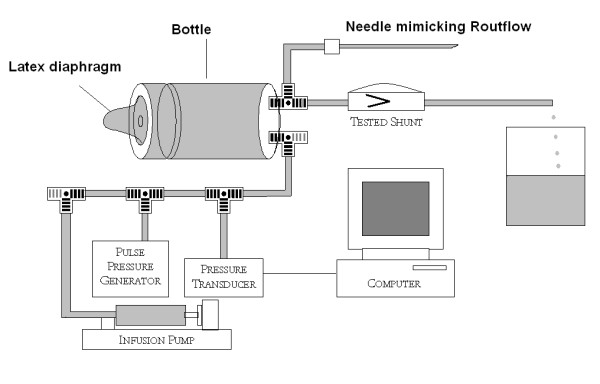
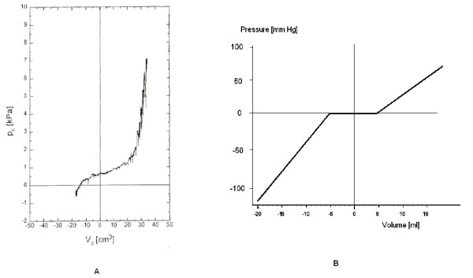
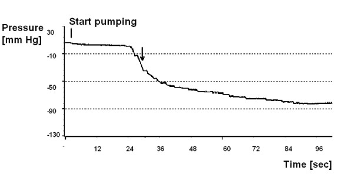
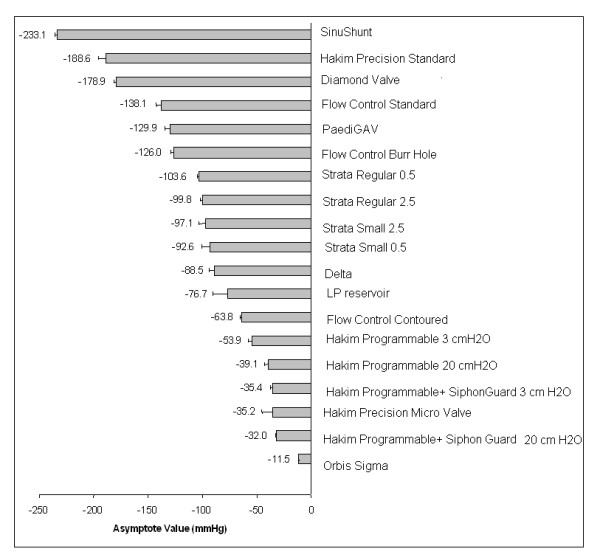
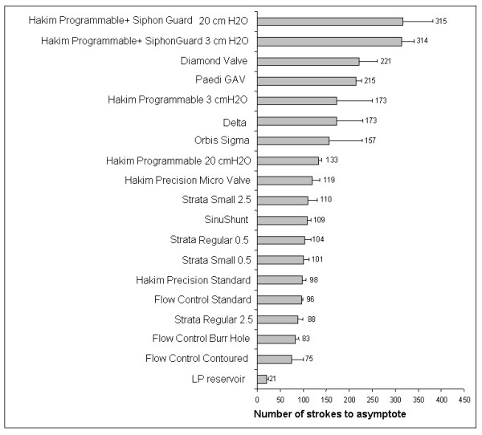
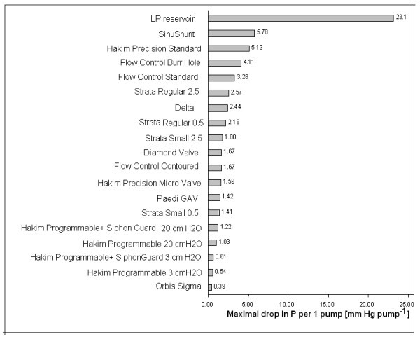
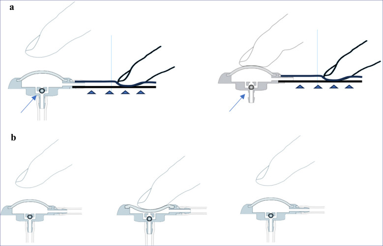
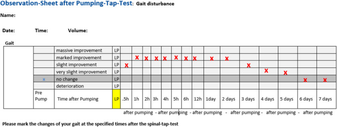
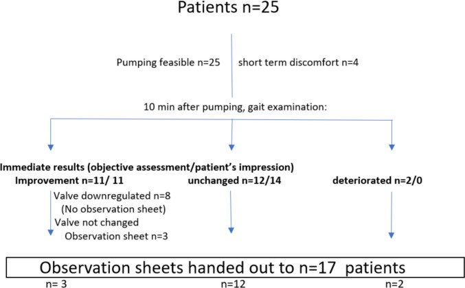
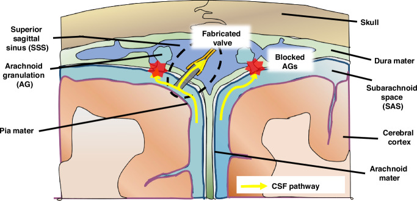

# Reference: CSF Shunt Systems, Types, and Valves

<!-- BEGIN CASE SNAPSHOT -->

## Case / Approach Snapshot

- **Anatomy at risk:** entry point, ventricular target, choroid plexus and deep veins, cortical vessels, eloquent cortex/tracts, catheter path, and distal hardware route.
- **Operative steps:** confirm indication and side, plan trajectory, prepare hardware, access ventricle or cistern safely, confirm flow/position, tunnel/connect devices when needed, and define infection/obstruction surveillance; use the detailed operative sequence and approach notes below as the step-by-step source.
- **Rescue plans:** malposition, hemorrhage, poor CSF return, overdrainage/underdrainage, obstruction, infection, abdominal/pleural complication, slit ventricles, and revision algorithm.
- **Figures:** review [Figures, Imaging & Video](#figures-imaging--video) and the [Curated Image Set](#curated-image-set); embedded local figures should remain open-access, public-domain, or otherwise reusable with attribution.
- **Papers:** review [High-Yield Literature](#high-yield-literature) for seminal sources, modern reviews, and outcome data specific to this page.

<!-- END CASE SNAPSHOT -->

## Figures, Imaging & Video

**🎥 Operative video** — [search operative video on YouTube ▸](https://www.youtube.com/results?search_query=Reference%3A+CSF+Shunt+Systems%2C+Types%2C+and+Valves+surgery) · [The Neurosurgical Atlas ▸](https://www.neurosurgicalatlas.com)

A comprehensive reference for shunt selection. See individual procedure files for VP, VA, ventriculopleural, lumboperitoneal, subduroperitoneal, and revision techniques.

---

## 1. Shunt Types by Proximal (Inflow) and Distal (Outflow) Site

### Proximal (Inflow) Catheter Location

| Proximal site | Entry | Indication |
|---------------|-------|------------|
| **Ventricular** (frontal — Kocher / occipital — Frazier or Keen) | Lateral ventricle frontal/occipital horn | Most hydrocephalus |
| **Lumbar (thecal)** | L3-4/L4-5 subarachnoid | **Communicating** hydrocephalus, IIH/pseudotumor, CSF leak, NPH (selected) |
| **Cyst** (cyst catheter) | Arachnoid cyst, tumor cyst, isolated compartment | Symptomatic cyst, trapped ventricle |
| **Subdural** | Subdural space | Chronic subdural collection (peds), hygroma |
| **Syrinx (syringo-)** | Syrinx cavity | Refractory syringomyelia (last resort) |

### Distal (Outflow) Catheter Location

| Distal site | Absorptive surface | When chosen |
|-------------|-------------------|-------------|
| **Peritoneum** (most common) | Peritoneal cavity | Default; large absorptive capacity, easy revision |
| **Right Atrium** (vascular) | Bloodstream (via IJV/facial → SVC/RA) | Abdominal contraindication (adhesions, pseudocyst, peritonitis, obesity, ascites) |
| **Pleural space** | Pleural cavity | Abdomen and atrium unavailable; **avoid in young children** (respiratory reserve, effusion) |
| **Gallbladder** (rare) | Bile | Salvage when others fail |

### Common Named Configurations
- **VP (ventriculoperitoneal)** — default; see [vp-shunt](../vp-shunt.md)
- **VA (ventriculoatrial)** — abdomen unavailable; see [ventriculoatrial-shunt](ventriculoatrial-shunt.md)
- **VPL (ventriculopleural)** — see [ventriculopleural-shunt](ventriculopleural-shunt.md)
- **LP (lumboperitoneal)** — communicating/IIH; see [lumboperitoneal-shunt](lumboperitoneal-shunt.md)
- **Subduroperitoneal (SDP)** — see [subduroperitoneal-shunt](subduroperitoneal-shunt.md)
- **Cystoperitoneal** — arachnoid/tumor cyst to peritoneum
- **Syringosubarachnoid / syringopleural / syringoperitoneal** — syrinx diversion
- **Ventriculocisternal (Torkildsen)** — historical

---

## 2. Valve Types

### Fixed (Differential) Pressure Valves
- Open at a preset pressure: **Low (~5 cmH2O), Medium (~10), High (~15)**
- Simple, inexpensive; cannot adjust post-op (over/under-drainage requires surgical change)

### Programmable (Adjustable) Valves
- Non-invasively adjustable pressure setting (magnetic)
- Examples: **Medtronic Strata, Codman Hakim Programmable / Certas Plus, Sophysa Polaris/Sophy, Aesculap proGAV 2.0 / M.blue**
- Advantage: adjust for over/under-drainage without surgery
- **MRI considerations:** some require resetting after MRI (older Strata, Codman); newer valves (proGAV, Polaris, Certas) are MRI-resistant/self-locking — **always verify setting after MRI** and document MRI-conditional limits

### Anti-Siphon / Gravitational Components
- Counteract **siphoning** (overdrainage when upright due to hydrostatic column)
- **Anti-siphon device (ASD)**, **gravitational units** (proGAV gravitational unit, Codman SiphonGuard, Sophysa)
- Reduce overdrainage complications (slit ventricles, subdurals, low-pressure headaches)

### Flow-Regulated Valves
- Maintain relatively constant flow across pressure ranges (e.g., Orbis-Sigma)

### Valve Selection Principles
- **Programmable + gravitational/anti-siphon** is common modern default (adjustability + overdrainage protection)
- Infants/young children: account for growth, overdrainage risk
- NPH: often start higher, titrate down; anti-siphon valuable (elderly, ambulatory)
- IIH/LP shunts: horizontal-vertical or programmable to manage posture-related siphoning

---

## 3. Valve Programming and Follow-Up Logic

| Clinical state | Imaging | Typical interpretation | Practical response |
|----------------|---------|------------------------|--------------------|
| Improved symptoms, stable ventricles | Stable or smaller | Desired drainage | Keep setting; document valve type/setting |
| Persistent high-pressure symptoms | Larger or unchanged ventricles | Underdrainage or obstruction | Confirm setting, shunt series, tap/flow study, lower programmable setting only if hardware is patent |
| Positional low-pressure headache | Small ventricles, pachymeningeal enhancement, subdural hygroma/SDH | Overdrainage/siphoning | Raise setting, add/check anti-siphon/gravitational unit, treat subdural if symptomatic |
| NPH partial response | Ventricles may remain large | Drainage may be insufficient | Stepwise lower setting with gait/cognition tracking; avoid fast lowering in anticoagulated/fall-risk patients |
| Slit ventricles with severe symptoms | Very small ventricles | Overdrainage, intermittent obstruction, or slit ventricle syndrome | Raise setting/anti-siphon; evaluate for intermittent proximal occlusion; revision may need catheter/valve strategy |
| Fever, wound erythema, abdominal pain, meningismus | Variable | Infection until proven otherwise | CSF/blood cultures, externalize/remove infected hardware, antibiotics, delayed reimplantation |

### MRI and Documentation Rules
- Record manufacturer, model, opening pressure/setting, anti-siphon/gravitational components, proximal/distal sites, and distal catheter tip location.
- After MRI, verify programmable setting with the correct tool or skull radiograph per valve type; do not rely on the pre-MRI setting.
- If a patient transfers from outside hospital, get skull films to identify unknown programmable valves before changing settings.
- Build a local "known-good baseline" archive: symptoms, valve setting, ventricular size, and shunt-series appearance when the patient is well.

---

## 4. Shunt Components
- **Proximal (ventricular/lumbar/cyst) catheter** — often **antibiotic-impregnated (Bactiseal) or silver-impregnated** to reduce infection
- **Reservoir** (for tapping/CSF sampling, e.g., Rickham/burr-hole reservoir)
- **Valve** (± integrated anti-siphon)
- **Distal catheter** (peritoneal/atrial/pleural)
- **Connectors, anchors**

---

## 5. Antibiotic / Infection-Reduction Measures
- Antibiotic-impregnated catheters (rifampin/clindamycin — Bactiseal), silver catheters
- Shunt infection bundle/protocol (skin prep, double-gloving, limited OR traffic, minimal handling, vancomycin/gentamicin irrigation)
- Perioperative IV antibiotics
- Minimize hardware handling: open valve/catheter packages only when needed, isolate shunt hardware from skin edges, and change gloves before touching implants.
- In revision surgery, send CSF and hardware cultures when infection is plausible; avoid implanting new permanent hardware into a contaminated field.

---

## 6. Key Complications Across Shunt Types
- **Infection** (5-10%; highest in first months; Staph epidermidis/aureus) → externalize/remove, EVD, IV abx, re-shunt
- **Obstruction** — proximal (choroid plexus/debris — most common), valve, or distal (pseudocyst, fibrosis, disconnection, migration)
- **Overdrainage** — subdural hematoma/hygroma, slit ventricle syndrome, low-pressure headache; treat by raising programmable setting / anti-siphon
- **Underdrainage** — persistent symptoms; lower setting or relieve obstruction
- **Distal site-specific:** VA (shunt nephritis, thrombosis, PE, migration, needs lengthening with growth), VPL (effusion, pneumothorax, empyema), LP (overdrainage/Chiari acquired, radiculopathy, hard to assess function), peritoneal (pseudocyst, viscus perforation, hernia, migration)
- **Disconnection/fracture/migration**, skin erosion (peds, thin tissue)

---

## 7. Shunt Evaluation (Malfunction Workup)
- Symptoms of raised ICP (return of original symptoms)
- **Shunt series X-rays** (skull/chest/abdomen) — disconnection, migration, kinks, tip position
- **CT/MRI head** — ventricle size vs baseline (compare to patient's known baseline)
- **Shunt tap** (reservoir) — function, opening pressure, CSF for infection (sterile technique)
- Nuclear medicine shunt patency study (selected)
- Programmable valve: confirm/recheck setting (esp. after MRI)

### Malfunction Workup Pearls
- "Stable ventricles" does not exclude malfunction, especially in slit-ventricle patients, long-standing pediatric shunts, and patients with low-compliance ventricles.
- Compare against the patient's best baseline, not a generic normal ventricle size.
- Papilledema, sixth nerve palsy, somnolence, bradycardia/hypertension, or rapidly worsening headache should escalate the workup even if imaging is equivocal.
- A difficult or dry shunt tap may mean proximal obstruction, but interpretation depends on reservoir type, valve design, ventricular size, and operator technique.
- If infection is suspected, cultures and inflammatory markers matter more than mechanical patency alone; a patent infected shunt still needs infection management.

### Revision Planning Questions
- Which component failed: proximal catheter, valve, connector, distal catheter, or absorptive cavity?
- Is the current distal cavity still usable, or is pseudocyst/adhesion/effusion/thrombosis driving failure?
- Is the patient overdraining, underdraining, or alternating between both?
- Should the revision add navigation, endoscopy, laparoscopic help, anti-siphon/gravitational control, or a different distal site?
- Can ETV or endoscopic septostomy/fenestration reduce shunt dependence in obstructive or compartmentalized hydrocephalus?

---

<!-- BEGIN CURATED LITERATURE -->

## High-Yield Literature

- **Randomized trial of cerebrospinal fluid shunt valve design in pediatric hydrocephalus** — Drake JM. *Neurosurgery* 1998. [PubMed](https://pubmed.ncbi.nlm.nih.gov/9696082/)
- **Determining the best cerebrospinal fluid shunt valve design: the pediatric valve design trial** — Drake JM. *Neurosurgery* 1998. [PubMed](https://pubmed.ncbi.nlm.nih.gov/9802875/)
- **A randomized, controlled study of a programmable shunt valve versus a conventional valve for patients with hydrocephalus** — Hakim-Medos Investigator Group. *Neurosurgery* 1999. [PubMed](https://pubmed.ncbi.nlm.nih.gov/10598708/)
- **Ventriculo-peritoneal shunting devices for hydrocephalus** — Cochrane systematic review of shunt devices and valve comparisons. [PubMed](https://pubmed.ncbi.nlm.nih.gov/32542676/)
- **Pediatric hydrocephalus: systematic literature review and evidence-based guidelines. Part 5: Effect of valve type on cerebrospinal fluid shunt efficacy** — valve-type guideline evidence summary. [PubMed](https://pubmed.ncbi.nlm.nih.gov/25988781/)
- **Efficacy and safety of programmable shunt valves for hydrocephalus: A meta-analysis** — pooled programmable-valve outcomes. [PubMed](https://pubmed.ncbi.nlm.nih.gov/28648796/)
- **Programmable shunt valves for the treatment of hydrocephalus: a systematic review** — programmable-valve evidence review. [PubMed](https://pubmed.ncbi.nlm.nih.gov/23830575/)
- **Safety and efficacy of gravitational shunt valves in patients with idiopathic normal pressure hydrocephalus: SVASONA trial** — gravitational valve randomized trial. [PubMed](https://pubmed.ncbi.nlm.nih.gov/23457222/)
- **Antisiphon device: A review of existing mechanisms and clinical applications to prevent overdrainage in shunted hydrocephalic patients** — antisiphon mechanisms and clinical selection. [PubMed](https://pubmed.ncbi.nlm.nih.gov/34411787/)
- **Shunt Implants - Past, Present and Future** — historical and technical overview of shunt implant evolution. [PubMed](https://pubmed.ncbi.nlm.nih.gov/35103003/)

<!-- END CURATED LITERATURE -->

---

<!-- BEGIN CURATED IMAGE SET -->

## Curated Image Set

Open-access figures are embedded from PubMed Central articles and kept unique to this guide.

*Figure 1. The laboratory rig used to test the pumping actions of hydrocephalus shunts including model of CSF compensation. Source: [Laboratory study on "intracranial hypotension" created by pumping the chamber of a hydrocephalus shunt](https://pmc.ncbi.nlm.nih.gov/articles/PMC1851975/) — Cerebrospinal Fluid Research 2007; CC BY.*

*Figure 2. Cerebrospinal pressure-volume curves. a. Pressure-volume curve plotted using clinical test- with permission from author [13]. b. Pressure-volume curve of the model used for testing in... Source: [Laboratory study on "intracranial hypotension" created by pumping the chamber of a hydrocephalus shunt](https://pmc.ncbi.nlm.nih.gov/articles/PMC1851975/) — Cerebrospinal Fluid Research 2007; CC BY.*

*Figure 3. Single test of the PS Medical Lumboperitoneal Reservoir using the model of human CSF space. Pumping started at the vertical bar. Pressure decreased slowly at first on the plateau (Fig.... Source: [Laboratory study on "intracranial hypotension" created by pumping the chamber of a hydrocephalus shunt](https://pmc.ncbi.nlm.nih.gov/articles/PMC1851975/) — Cerebrospinal Fluid Research 2007; CC BY.*

*Figure 4. Bar chart showing the pressures for the various valves at which the asymptote was achieved by continuously pumping the reservoirs. Source: [Laboratory study on "intracranial hypotension" created by pumping the chamber of a hydrocephalus shunt](https://pmc.ncbi.nlm.nih.gov/articles/PMC1851975/) — Cerebrospinal Fluid Research 2007; CC BY.*

*Figure 5. Bar chart showing the number of pumps required for each valve to reach the asymptote. Source: [Laboratory study on "intracranial hypotension" created by pumping the chamber of a hydrocephalus shunt](https://pmc.ncbi.nlm.nih.gov/articles/PMC1851975/) — Cerebrospinal Fluid Research 2007; CC BY.*

*Figure 6. Bar chart showing the maximum pressure reduction achievable with a single pump on the valve's pumping chamber. Source: [Laboratory study on "intracranial hypotension" created by pumping the chamber of a hydrocephalus shunt](https://pmc.ncbi.nlm.nih.gov/articles/PMC1851975/) — Cerebrospinal Fluid Research 2007; CC BY.*

*Fig. 1. a Testing the anti-reflux valve (arrow) of the Sprung reservoir: the distal catheter (arrowheads), which connects to the actual shunt valve, is occluded with one finger. The reservoir... Source: [PUMP study: reservoir pumping in suspected underdrained shunted patients with normal pressure hydrocephalus – a prospective single-center study](https://pmc.ncbi.nlm.nih.gov/articles/PMC12722420/) — Acta Neurochirurgica 2025; CC BY-NC-ND.*

*Fig. 2. Observation sheet provided to patients or their relatives for documenting subjective gait changes following pumping. The example shown is filled out to indicate a temporary improvement Source: [PUMP study: reservoir pumping in suspected underdrained shunted patients with normal pressure hydrocephalus – a prospective single-center study](https://pmc.ncbi.nlm.nih.gov/articles/PMC12722420/) — Acta Neurochirurgica 2025; CC BY-NC-ND.*

*Fig. 4. Immediate results of pumping after 10 min and number of observation sheets distributed to patients/relatives Source: [PUMP study: reservoir pumping in suspected underdrained shunted patients with normal pressure hydrocephalus – a prospective single-center study](https://pmc.ncbi.nlm.nih.gov/articles/PMC12722420/) — Acta Neurochirurgica 2025; CC BY-NC-ND.*

*Fig. 1. Illustration of alternative methods for CSF drainage in the treatment of hydrocephalus when arachnoid granulations (AGs) fail to regulate CSF flow.The fabricated PDMS duckbill valve can... Source: [Fabrication and in vivo testing of a sub-mm duckbill valve for hydrocephalus treatment](https://pmc.ncbi.nlm.nih.gov/articles/PMC11646279/) — Microsystems & Nanoengineering 2024; CC BY.*

<!-- END CURATED IMAGE SET -->
