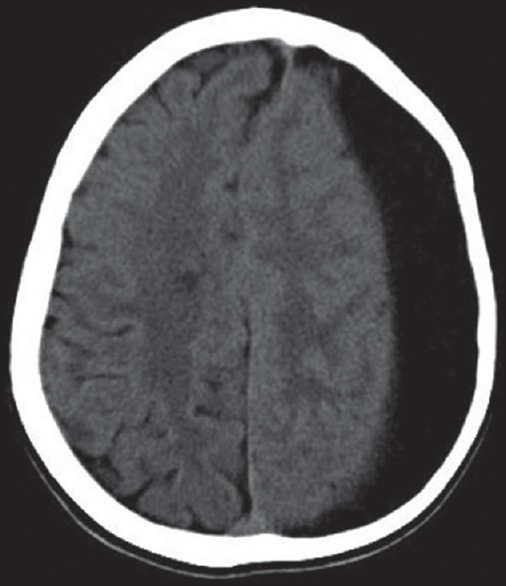
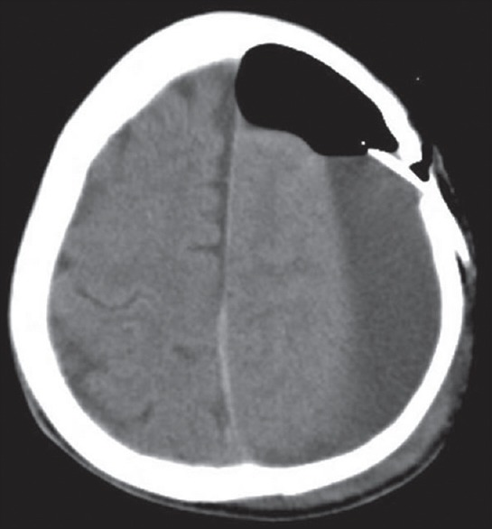
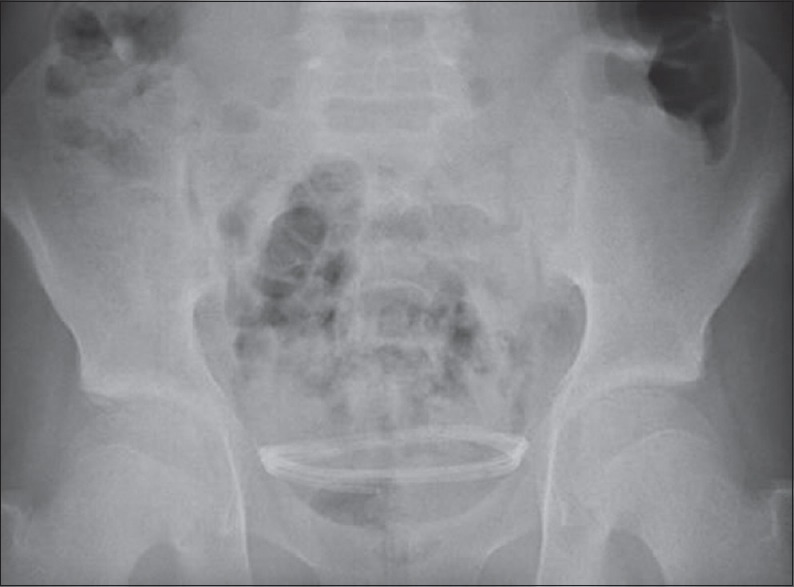
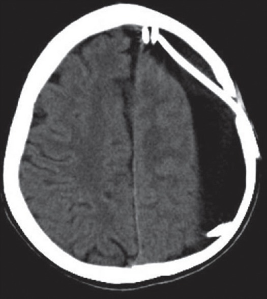
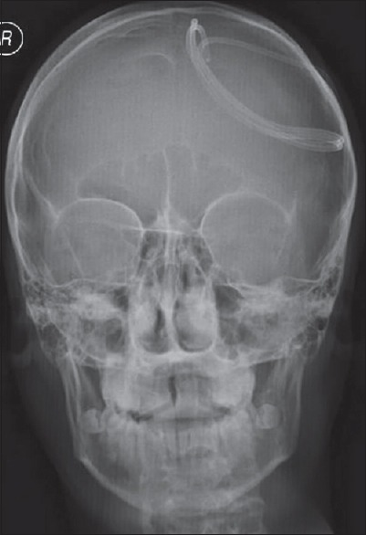
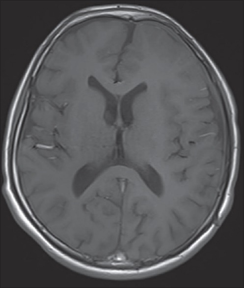
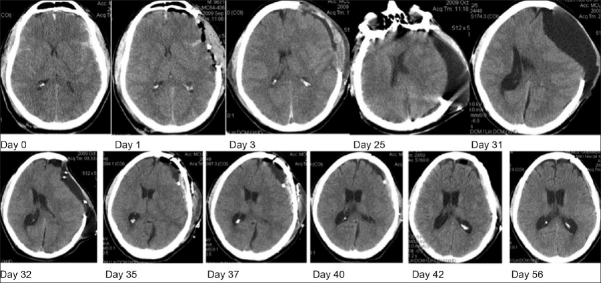
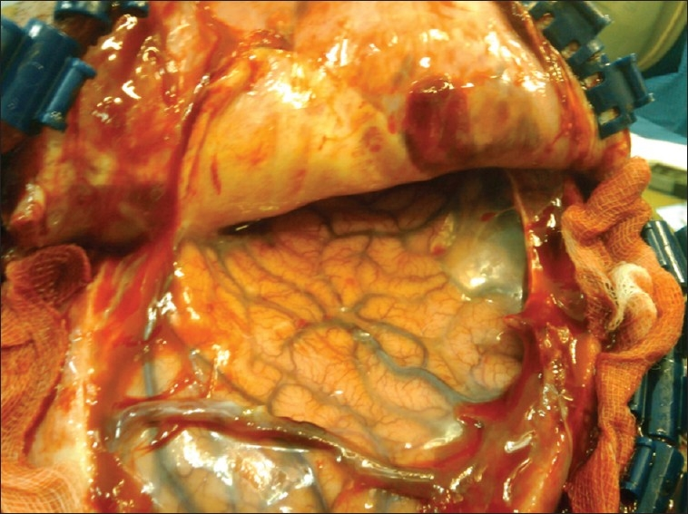
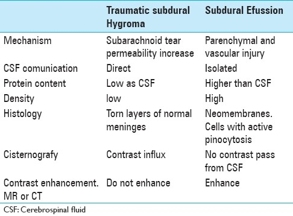
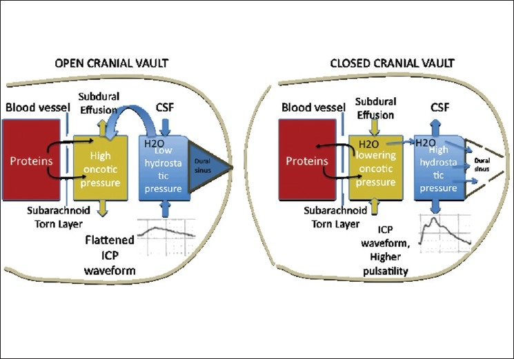

# Case Prep: Subduroperitoneal (Subdural-Peritoneal) Shunt Placement

<!-- BEGIN CASE SNAPSHOT -->

## Case / Approach Snapshot

- **Anatomy at risk:** thin cortex under a chronic collection, bridging veins, subdural membranes, superior sagittal sinus, burr-hole edge, catheter side holes, scalp/valve pocket, tunneling tract, and peritoneal entry.
- **Operative steps:** confirm the collection is a persistent symptomatic subdural compartment rather than hydrocephalus or atrophy, choose a safe burr-hole site, enter subdural space tangentially, confirm fluid egress, secure a low-pressure drainage system, tunnel to the peritoneum, and plan removal/revision once the collection resolves.
- **Rescue plans:** cortical injury, catheter migration into subdural space or peritoneum, overdrainage with rebleeding/collapse, underdrainage/loculation, infection, peritoneal failure, nonaccidental trauma workup, and planned explantation in infants/children.
- **Figures:** review [Figures, Imaging & Video](#figures-imaging--video) and the [Curated Image Set](#curated-image-set); embedded local figures should remain open-access, public-domain, or otherwise reusable with attribution.
- **Papers:** review [High-Yield Literature](#high-yield-literature) for seminal sources, modern reviews, and outcome data specific to this page.

<!-- END CASE SNAPSHOT -->

## One-Liner
[Age — often pediatric] [M/F] with a [chronic subdural hygroma / effusion / refractory subdural collection] planned for subduroperitoneal shunt placement.

---

## Figures, Imaging & Video

**🎥 Operative video** — [search operative video on YouTube ▸](https://www.youtube.com/results?search_query=subdural+hygroma+surgery) · [The Neurosurgical Atlas ▸](https://www.neurosurgicalatlas.com)

[Neurosurgical Atlas](https://www.neurosurgicalatlas.com) · [Radiopaedia](https://radiopaedia.org/search?q=subdural%20hygroma&scope=all) · [PubMed Central](https://www.ncbi.nlm.nih.gov/pmc/?term=subduroperitoneal+shunt) — operative figures © linked; see [media-sources.md](../../../resources/media-sources.md)

---

<!-- BEGIN CURATED LITERATURE -->

## High-Yield Literature

- **Complications of subduroperitoneal shunting** — Ersahin Y. Child's nervous system : ChNS : official journal of the International Society for Pediatric Neurosurgery 2000. [PubMed](https://pubmed.ncbi.nlm.nih.gov/10958553/)
- **A new catheter for subduro-peritoneal shunting** — Erşahin Y. Child's nervous system : ChNS : official journal of the International Society for Pediatric Neurosurgery 2002. [PubMed](https://pubmed.ncbi.nlm.nih.gov/12382178/)
- **Minicraniotomy with a subgaleal pocket for the treatment of subdural fluid collections in infants** — Palmer AW. Journal of neurosurgery. Pediatrics 2019. [PubMed](https://pubmed.ncbi.nlm.nih.gov/30717055/)
- **Managing subdural fluid collection in infants** — Miyake H. Child's nervous system : ChNS : official journal of the International Society for Pediatric Neurosurgery 2002. [PubMed](https://pubmed.ncbi.nlm.nih.gov/12382175/)
- **Subdural-atrial and subdural-peritoneal shunting in infants with chronic subdural fluid collections** — Korinth MC. Journal of pediatric surgery 2000. [PubMed](https://pubmed.ncbi.nlm.nih.gov/10999693/)
- **Rectal dural metastasis masquerading as chronic subdural hematoma: illustrative case** — Siy HFC. Journal of neurosurgery. Case lessons 2023. [PubMed](https://pubmed.ncbi.nlm.nih.gov/37127032/)
- **Subdural hygroma: results of treatment by ventriculo-abdominal shunt** — Njiokiktjien CJ. Child's brain 1980. [PubMed](https://pubmed.ncbi.nlm.nih.gov/7226982/)
- **A Rare Complication of Subdural-peritoneal Shunt: Migration of Catheter Components through the Pelvic Inlet into the Subdural Space** — Çakir M. Journal of pediatric neurosciences 2017. [PubMed](https://pubmed.ncbi.nlm.nih.gov/28904576/)
- **Ruptured intracranial arachnoid cysts in the subdural space: evaluation of subduro-peritoneal shunts in a pediatric population** — Tinois J. Child's nervous system : ChNS : official journal of the International Society for Pediatric Neurosurgery 2020. [PubMed](https://pubmed.ncbi.nlm.nih.gov/32062780/)
- **Management of symptomatic chronic extra-axial fluid collections in pediatric patients** — Litofsky NS. Neurosurgery 1992. [PubMed](https://pubmed.ncbi.nlm.nih.gov/1407427/)

<!-- END CURATED LITERATURE -->

<!-- BEGIN CURATED IMAGE SET -->

## Curated Image Set

Open-access figures are embedded from PubMed Central articles and kept unique to this guide.

*Figure 1. First admission image with left chronic subdural effusion Source: [A Rare Complication of Subdural-peritoneal Shunt: Migration of Catheter Components through the Pelvic Inlet into the Subdural Space](https://pmc.ncbi.nlm.nih.gov/articles/PMC5588643/) — Journal of Pediatric Neurosciences 2017; CC BY-NC-SA.*

*Figure 2. After the subduroperitoneal shunt placement surgery Source: [A Rare Complication of Subdural-peritoneal Shunt: Migration of Catheter Components through the Pelvic Inlet into the Subdural Space](https://pmc.ncbi.nlm.nih.gov/articles/PMC5588643/) — Journal of Pediatric Neurosciences 2017; CC BY-NC-SA.*

*Figure 3. Control abdominal X-ray showing that the shunt material completely migrated into the pelvic inlet Source: [A Rare Complication of Subdural-peritoneal Shunt: Migration of Catheter Components through the Pelvic Inlet into the Subdural Space](https://pmc.ncbi.nlm.nih.gov/articles/PMC5588643/) — Journal of Pediatric Neurosciences 2017; CC BY-NC-SA.*

*Figure 4. Control brain computed tomography scan showing that the shunt material completely migrated into the cranium Source: [A Rare Complication of Subdural-peritoneal Shunt: Migration of Catheter Components through the Pelvic Inlet into the Subdural Space](https://pmc.ncbi.nlm.nih.gov/articles/PMC5588643/) — Journal of Pediatric Neurosciences 2017; CC BY-NC-SA.*

*Figure 5. Control plane anterior-posterior X-ray of the skull showing that the shunt material completely migrated into the cranium Source: [A Rare Complication of Subdural-peritoneal Shunt: Migration of Catheter Components through the Pelvic Inlet into the Subdural Space](https://pmc.ncbi.nlm.nih.gov/articles/PMC5588643/) — Journal of Pediatric Neurosciences 2017; CC BY-NC-SA.*

*Figure 6. Three months later, control magnetic resonance imaging. After the surgical evacuation Source: [A Rare Complication of Subdural-peritoneal Shunt: Migration of Catheter Components through the Pelvic Inlet into the Subdural Space](https://pmc.ncbi.nlm.nih.gov/articles/PMC5588643/) — Journal of Pediatric Neurosciences 2017; CC BY-NC-SA.*

*Figure 1. Evolution of Subdural Collection through sequential computed tomography scans. The collection reaches its peak volume by day 31, then, a subdural catheter is placed by day 32. By day 35,... Source: [Normal pressure subdural hygroma with mass effect as a complication of decompressive craniectomy](https://pmc.ncbi.nlm.nih.gov/articles/PMC3130440/) — Surgical Neurology International 2011; CC BY-NC-SA.*

*Figure 2. Surgical view: Brain parenchyma is depressed, and neomembranes are seeing in the operative field with thick vessels Source: [Normal pressure subdural hygroma with mass effect as a complication of decompressive craniectomy](https://pmc.ncbi.nlm.nih.gov/articles/PMC3130440/) — Surgical Neurology International 2011; CC BY-NC-SA.*

*Figure 9. Source: [Normal pressure subdural hygroma with mass effect as a complication of decompressive craniectomy](https://pmc.ncbi.nlm.nih.gov/articles/PMC3130440/) — Surg Neurol Int. 2011 Jun 30;2:88. doi: 10.4103/2152-7806.82370; CC BY-NC-SA.*

*Figure 3. Open cranial Vault: the abnormal permeability allows the protein leakage, thus increasing the oncotic pressure of the subdural effusion, and drawing water. With the decompressive... Source: [Normal pressure subdural hygroma with mass effect as a complication of decompressive craniectomy](https://pmc.ncbi.nlm.nih.gov/articles/PMC3130440/) — Surgical Neurology International 2011; CC BY-NC-SA.*

<!-- END CURATED IMAGE SET -->

---

## History of Present Illness
- Chief complaint: Persistent/symptomatic subdural fluid collection (hygroma/effusion) refractory to drainage
- **Common scenarios:** pediatric subdural hygromas/effusions (post-meningitis, post-trauma, benign external hydrocephalus complications), chronic subdural collections that re-accumulate after burr-hole drainage, post-craniotomy subdural collections
- Prior drainage attempts, macrocephaly (infants), bulging fontanelle

---

## Past Medical History
- Prior subdural drainage, meningitis/infection, trauma (consider NAT in infants — work up appropriately), coagulopathy
- Etiology of collection
- Standard PMH

---

## Imaging Review
### CT/MRI head
- Subdural collection (size, chronicity, density/signal — hygroma vs chronic SDH vs effusion), bilateral?, mass effect, membranes, **ventricle size** (distinguish from hydrocephalus)
- Underlying brain (atrophy, parenchymal injury)

### Decision Check: Is This Really a Shunt Problem?
- Confirm symptoms or growth: enlarging head circumference, bulging fontanelle, irritability, seizures, developmental regression, focal deficit, or persistent mass effect.
- Distinguish a drainable subdural compartment from benign enlarged subarachnoid spaces, cortical atrophy, communicating hydrocephalus, and recurrent chronic subdural hematoma better treated by burr holes/membrane strategy.
- In infants, evaluate for trauma/nonaccidental trauma, coagulopathy, infection, metabolic disease, and retinal/skull/skeletal findings as clinically appropriate.
- If the collection is bilateral, decide whether unilateral drainage will equilibrate through membranes or whether bilateral catheters/burr holes are needed.
- If membranes or chronic blood dominate, shunt alone may underperform; consider burr-hole evacuation, minicraniotomy, membranectomy, or temporary drainage strategy.

---

## Labs
- CBC, **Coags (correct)**, BMP, type and screen
- Infection workup if indicated

---

## Examination
- Head circumference/fontanelle (infants), neuro exam, signs of raised ICP

---

## Surgical Planning

### Case Logistics, OR Needs & Orders
- **OR setup:** navigation or endoscope as indicated, shunt hardware/valve setting verified, distal-access tools or general surgery help when needed, antibiotic-impregnated catheter availability, and postop imaging plan.
- **Special needs:** antibiotic timing, programmable valve documentation, abdominal/chest/vascular distal-site plan, CSF culture plan for revision/infection, anticoagulation plan, and EVD backup if access fails.
- **Immediate postop orders:** neuro checks, CT or shunt-series timing, valve setting documentation and MRI precautions, wound/abdominal/distal-site checks, infection watch, DVT timing, and follow-up for setting adjustment.

### Position
- Supine, head turned (collection side up), neck/chest/abdomen prepped in continuity (as for VP)

### Key Surgical Steps
1. **Proximal (subdural) catheter:** burr hole over the collection (or via existing burr hole); open dura; **insert the catheter into the subdural space** (tangential, low-profile — avoid cortical injury; do not advance like a ventricular catheter)
2. Confirm fluid egress
3. Connect to a **low-pressure valve** (subdural collections are low pressure; valve choice to avoid overdrainage but allow drainage) — or sometimes valveless/low-pressure system per surgeon
4. **Tunnel** to the abdomen, **peritoneal distal catheter** (as VP)
5. Confirm flow through system; closure
6. Often **temporary** — many are removed/converted once the collection resolves (esp. pediatric)

### Technical Nuances
- Choose a burr hole where the collection is thick enough that catheter side holes sit fully in the subdural compartment without resting on cortex.
- Insert the catheter tangentially along the inner table/subdural plane; a perpendicular trajectory can spear cortex as the collection decompresses.
- Trim side holes so they do not straddle scalp/subgaleal tissue or cortex; all functional holes should live within the subdural collection.
- Anchor the proximal catheter/valve carefully; migration is a distinctive complication in small children with low-resistance systems.
- Avoid rapid decompression if there is chronic membrane vascularity or fragile bridging veins; sudden collapse can promote rebleeding.
- Set expectations that this is often a temporizing device rather than lifelong hardware.

### Critical Anatomy & Structures at Risk
1. **Cortex / bridging veins** (subdural catheter — avoid cortical injury, re-bleeding)
2. **Superior sagittal sinus** (keep burr hole lateral)
3. Overdrainage vs underdrainage balance; peritoneum/bowel (distal)

### Equipment
- Shunt system with **low-pressure valve**, subdural (proximal) catheter, peritoneal catheter
- Burr hole set, antibiotic-impregnated catheter, tunneler

### Anesthesia
- General; cefazolin; pediatric considerations (thermoregulation, blood volume)

### Potential Complications
1. Catheter obstruction/migration, **overdrainage (re-collapse, new collection) or underdrainage**
2. Infection, cortical injury/hemorrhage
3. Persistent collection / conversion needs, peritoneal complications
4. In infants — need removal once resolved (foreign body, infection risk if left)

### Intraoperative and Postoperative Rescue
- **No fluid egress:** confirm location with ultrasound/navigation or enlarge/open membranes; reassess whether the collection is loculated, organized, or not under pressure.
- **Cortical bleeding:** stop further catheter advancement, irrigate, tamponade, obtain postoperative CT, and consider ICU observation if any mass effect or neurologic concern.
- **Overdrainage/new hemorrhage:** raise valve resistance if possible, clamp/externalize selectively, image, and evacuate if symptomatic.
- **Underdrainage:** check catheter position, valve function, distal patency, loculations, and whether a second compartment needs separate drainage.
- **Infection:** treat like infected shunt hardware: cultures, antibiotics, externalization/removal, and delayed reimplantation only if still needed.

---

## Operative Note Template
**Preoperative Diagnosis:** Symptomatic/refractory subdural [hygroma/effusion/collection]

**Postoperative Diagnosis:** Same

**Procedure:** Subduroperitoneal shunt placement with low-pressure valve

**Surgeon / Assistant:**
**Anesthesia:** General endotracheal
**EBL / Fluids:**
**Adjuncts:** Burr-hole set, tunneler
**Implants:** Subdural (proximal) catheter, low-pressure valve, peritoneal catheter
**Complications:** None

**Indications:** [Age]yo [M/F] [often pediatric] with a persistent/symptomatic subdural collection refractory to drainage. Risks (cortical injury, over/under-drainage, infection) discussed; [NAT workup as appropriate].

**Description of Procedure:** After consent and time-out, general anesthesia was induced. A burr hole was made over the collection (lateral to the sagittal sinus) and the dura opened. The **subdural catheter was inserted tangentially into the subdural space** (cortex-sparing, not advanced like a ventricular catheter) with fluid egress confirmed, and connected to a **low-pressure valve**. The catheter was tunneled to a small abdominal incision and the **peritoneal distal catheter** placed, with flow through the system confirmed.

Closure was performed. The patient was transferred with head-circumference/imaging follow-up; **removal/conversion was planned once the collection resolved** (to avoid a long-term foreign body).

---

## Postoperative Plan
- Floor, neuro checks, head circumference/fontanelle (infants)
- CT head (collection reduction, catheter position), shunt series baseline
- Monitor for re-accumulation vs overdrainage, infection
- **Plan for removal/conversion** once collection resolves (pediatric — avoid long-term foreign body)
- Follow-up imaging; NAT workup/social work if applicable

<!-- BEGIN CHIEF LEVEL TAKEAWAYS -->

## Chief-Level Case Review

Use these as the senior-level mental model for **Subduroperitoneal (Subdural-Peritoneal) Shunt Placement**:

- **Decision point:** Trajectory and hardware choice should follow the failure mode: obstruction, infection, overdrainage, loculation, slit ventricle, distal failure, or wrong pressure setting.
- **Technical lever:** Document the system: entry point, catheter target/depth, valve type and setting, distal site, antibiotic-impregnated hardware, and what imaging confirms placement.
- **Bailout:** Rescue plan is practical: poor CSF return, bloody CSF, malposition, distal access failure, abdominal/pleural complication, or inability to safely pass the catheter.
- **Postop watch:** Postop orders must be unambiguous: drain height/rate/max output, valve setting, clamp parameters, imaging, antibiotics, ICP/neuro checks, and overdrainage precautions.

<!-- END CHIEF LEVEL TAKEAWAYS -->

<!-- BEGIN COMMON PIMP QUESTIONS -->

## Common Pimp Questions

Use these to pressure-test preparation for **Subduroperitoneal (Subdural-Peritoneal) Shunt Placement**:

1. What is the working CSF physiology problem: obstruction, absorption failure, overdrainage, infection, or catheter failure?
2. Where exactly is the entry point, target, and backup trajectory?
3. What valve, catheter, endoscope, or navigation preference does the attending use?
4. What is the infection-prevention plan and what cultures/CSF studies are needed?
5. What postop imaging, valve setting, drainage level, and neuro-check plan should be written?

<!-- END COMMON PIMP QUESTIONS -->

<!-- BEGIN ATTENDING PREFERENCE VARIABLES -->

## Attending Preference Variables

Items that commonly vary by surgeon or institution:

- **Valve brand/setting, antibiotic catheter use, and tunneling side:** [attending-specific]
- **Navigation/endoscope/stylet preference and ventricular target:** [attending-specific]
- **CSF culture/lab routine and perioperative antibiotic duration:** [attending-specific]
- **Postop scan timing, EVD height or valve verification, and activity restrictions:** [attending-specific]

<!-- END ATTENDING PREFERENCE VARIABLES -->
