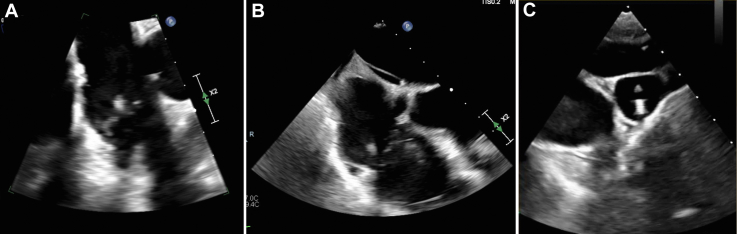
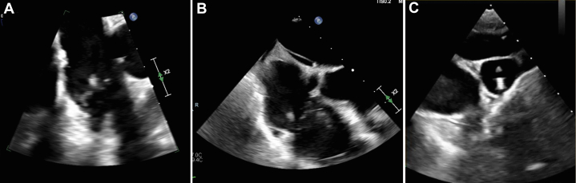
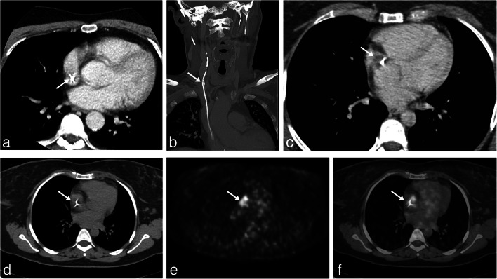
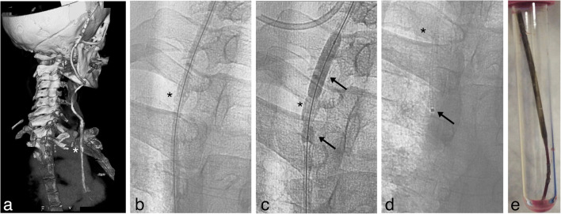
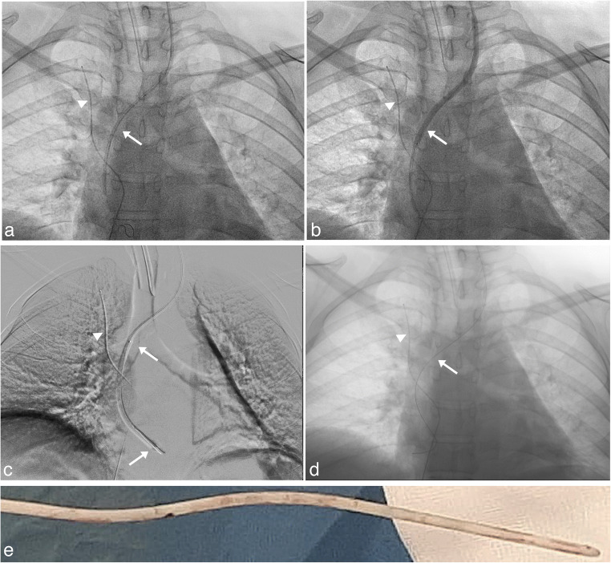
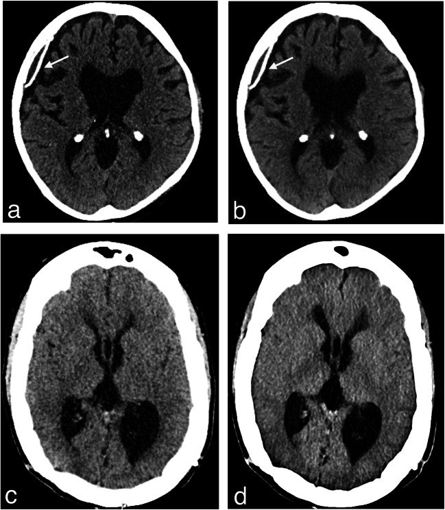
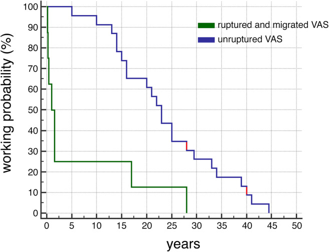
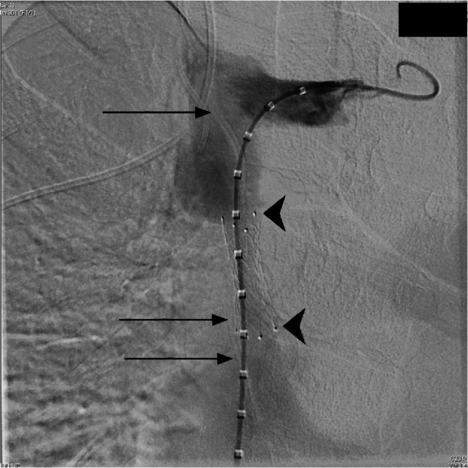
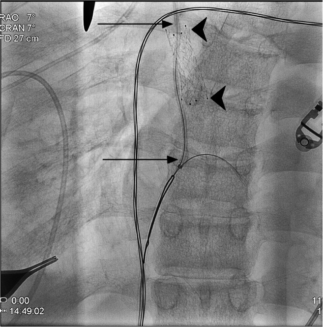
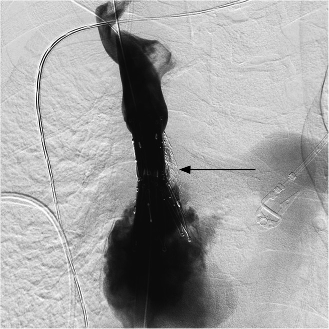

# Case Prep: Ventriculoatrial (VA) Shunt Placement

---

<!-- BEGIN CASE SNAPSHOT -->

## Case / Approach Snapshot

- **Anatomy at risk:** entry point, ventricular target, choroid plexus and deep veins, cortical vessels, eloquent cortex/tracts, catheter path, and distal hardware route.
- **Operative steps:** confirm indication and side, plan trajectory, prepare hardware, access ventricle or cistern safely, confirm flow/position, tunnel/connect devices when needed, and define infection/obstruction surveillance; use the detailed operative sequence and approach notes below as the step-by-step source.
- **Rescue plans:** malposition, hemorrhage, poor CSF return, overdrainage/underdrainage, obstruction, infection, abdominal/pleural complication, slit ventricles, and revision algorithm.
- **Figures:** review [Figures, Imaging & Video](#figures-imaging--video) and the [Curated Image Set](#curated-image-set); embedded local figures should remain open-access, public-domain, or otherwise reusable with attribution.
- **Papers:** review [High-Yield Literature](#high-yield-literature) for seminal sources, modern reviews, and outcome data specific to this page.

<!-- END CASE SNAPSHOT -->

## One-Liner
[Age]yo [M/F] with hydrocephalus and [peritoneal contraindication: extensive adhesions / pseudocyst / peritonitis / morbid obesity / ascites / failed multiple VP shunts] planned for right ventriculoatrial shunt placement.

---

## Figures, Imaging & Video

**🎥 Operative video** — [search operative video on YouTube ▸](https://www.youtube.com/results?search_query=ventriculoatrial+shunt+surgery) · [The Neurosurgical Atlas ▸](https://www.neurosurgicalatlas.com)

[Neurosurgical Atlas](https://www.neurosurgicalatlas.com) · [Radiopaedia](https://radiopaedia.org/search?q=ventriculoatrial%20shunt&scope=all) · [PubMed Central](https://www.ncbi.nlm.nih.gov/pmc/?term=ventriculoatrial+shunt) — operative figures © linked; see [media-sources.md](../../../resources/media-sources.md)

---

<!-- BEGIN COMMON PIMP QUESTIONS -->

## Common Pimp Questions

Use these to pressure-test preparation for **Ventriculoatrial (VA) Shunt Placement**:

1. What is the working CSF physiology problem: obstruction, absorption failure, overdrainage, infection, or catheter failure?
2. Where exactly is the entry point, target, and backup trajectory?
3. What valve, catheter, endoscope, or navigation preference does the attending use?
4. What is the infection-prevention plan and what cultures/CSF studies are needed?
5. What postop imaging, valve setting, drainage level, and neuro-check plan should be written?

<!-- END COMMON PIMP QUESTIONS -->

<!-- BEGIN ATTENDING PREFERENCE VARIABLES -->

## Attending Preference Variables

Items that commonly vary by surgeon or institution:

- **Valve brand/setting, antibiotic catheter use, and tunneling side:** [attending-specific]
- **Navigation/endoscope/stylet preference and ventricular target:** [attending-specific]
- **CSF culture/lab routine and perioperative antibiotic duration:** [attending-specific]
- **Postop scan timing, EVD height or valve verification, and activity restrictions:** [attending-specific]

<!-- END ATTENDING PREFERENCE VARIABLES -->

<!-- BEGIN CURATED LITERATURE -->

## High-Yield Literature

- **Ventriculoatrial shunt remains a safe surgical alternative for hydrocephalus: a systematic review and meta-analysis** — Bue EL. Scientific reports 2024. [PubMed](https://pubmed.ncbi.nlm.nih.gov/39117692/)
- **Ventriculoatrial Shunt Catheter Tip Migration Causing Tricuspid Regurgitation: Case Report and Review of the Literature** — Pradini-Santos L. World neurosurgery 2020. [PubMed](https://pubmed.ncbi.nlm.nih.gov/31931241/)
- **Transesophageal Echocardiography-Guided Ventriculoatrial Shunt Insertion** — Isaacs AM. Operative neurosurgery (Hagerstown, Md.) 2020. [PubMed](https://pubmed.ncbi.nlm.nih.gov/31811299/)
- **Ventriculoatrial Shunt Under Locoregional Anesthesia: A Technical Note** — Aspide R. World neurosurgery 2022. [PubMed](https://pubmed.ncbi.nlm.nih.gov/35870783/)
- **Guidelines for Diagnosis and Management of Idiopathic Normal Pressure Hydrocephalus** — Hamilton MG. Neurosurgery clinics of North America 2025. [PubMed](https://pubmed.ncbi.nlm.nih.gov/40054973/)
- **Ventriculoatrial Shunt Versus Ventriculoperitoneal Shunt: A Systematic Review and Meta-Analysis** — Oliveira LB. Neurosurgery 2023. [PubMed](https://pubmed.ncbi.nlm.nih.gov/38117090/)
- **Robert H. Pudenz (1911-1998) and Ventriculoatrial Shunt: Historical Perspective** — Konar SK. World neurosurgery 2015. [PubMed](https://pubmed.ncbi.nlm.nih.gov/26074435/)
- **Timing of ventriculoatrial shunt removal on renal function recovery of patients with shunt nephritis: Case report and systematic review** — Ajlan B. Clinical neurology and neurosurgery 2022. [PubMed](https://pubmed.ncbi.nlm.nih.gov/35594721/)
- **Ventriculoatrial Shunt Versus Ventriculoperitoneal Shunt: A Systematic Review and Meta-Analysis: Corrigendum** — Brenner LBO. Neurosurgery 2025. [PubMed](https://pubmed.ncbi.nlm.nih.gov/40536344/)
- **Letter: Transesophageal Echocardiography-Guided Ventriculoatrial Shunt Insertion** — Della Pepa GM. Operative neurosurgery (Hagerstown, Md.) 2020. [PubMed](https://pubmed.ncbi.nlm.nih.gov/33074316/)

<!-- END CURATED LITERATURE -->

---

<!-- BEGIN CURATED IMAGE SET -->

## Curated Image Set

Open-access figures are embedded from PubMed Central articles and kept unique to this guide.

*Figure. Source: [Infective Endocarditis as a Complication of a Ventriculoatrial Shunt](https://pmc.ncbi.nlm.nih.gov/articles/PMC11830242/) — JACC Case Reports 2025; CC BY-NC-ND.*

*Figure 1. Transesophageal Echocardiogram Findings(A and B) Transesophageal echocardiogram views demonstrating an 11-mm vegetation on the posterior tricuspid valve with mobility. (C)... Source: [Infective Endocarditis as a Complication of a Ventriculoatrial Shunt](https://pmc.ncbi.nlm.nih.gov/articles/PMC11830242/) — JACC Case Reports 2025; CC BY-NC-ND.*

*Fig. 1. Atrial condition before VAS removal. a Preoperative thoracic axial CT scan with contrast at the level of the atrium showing the VAS catheter (arrow) in patient 1. b Preoperative coronal... Source: [Minimally invasive procedure for removal of infected ventriculoatrial shunts](https://pmc.ncbi.nlm.nih.gov/articles/PMC7815540/) — Acta Neurochirurgica 2020; CC BY.*

*Fig. 2. Removal of VAS catheter in patient 1. a Preoperative 3D CT scan reconstruction of the VAS catheter path from the valve to the right atrium, white asterisk (*) marks the site of... Source: [Minimally invasive procedure for removal of infected ventriculoatrial shunts](https://pmc.ncbi.nlm.nih.gov/articles/PMC7815540/) — Acta Neurochirurgica 2020; CC BY.*

*Fig. 3. Removal of VAS catheter in patient 2. a Fluoroscopy antero-posterior projection, a 0.018 inch guidewire is visible inside the atrial catheter (arrow), a safety wire introduced through... Source: [Minimally invasive procedure for removal of infected ventriculoatrial shunts](https://pmc.ncbi.nlm.nih.gov/articles/PMC7815540/) — Acta Neurochirurgica 2020; CC BY.*

*Fig. 4. Stability of ventricular system after VAS inactivation. CT scans obtained from patient 1 (a and b) and patient 2 (c and d) before surgery (a and c) and after removal of the VAS catheter... Source: [Minimally invasive procedure for removal of infected ventriculoatrial shunts](https://pmc.ncbi.nlm.nih.gov/articles/PMC7815540/) — Acta Neurochirurgica 2020; CC BY.*

*Fig. 5. Plot of the probability of working VAS with time. Data for plot were derived from the literature together with the present cases (red). Median lag before VAS removal for thrombus... Source: [Minimally invasive procedure for removal of infected ventriculoatrial shunts](https://pmc.ncbi.nlm.nih.gov/articles/PMC7815540/) — Acta Neurochirurgica 2020; CC BY.*

*Fig. 1. Anteroposterior view from preprocedural venogram shows the superior vena cava stenosis with decreased luminal size over the previously placed nitinol stent (arrowheads). Borders of the... Source: [Combined cut down and endovascular retrieval of orphaned ventriculoatrial shunt with stenting of chronic superior vena cava occlusion](https://pmc.ncbi.nlm.nih.gov/articles/PMC8266700/) — Pediatric Radiology 2021; CC BY.*

*Fig. 2. Anteroposterior view from intraprocedural venogram shows access of ventriculoatrial shunt catheter using a guidewire. Superior and inferior portions of the shunt catheter with an... Source: [Combined cut down and endovascular retrieval of orphaned ventriculoatrial shunt with stenting of chronic superior vena cava occlusion](https://pmc.ncbi.nlm.nih.gov/articles/PMC8266700/) — Pediatric Radiology 2021; CC BY.*

*Fig. 3. Anteroposterior view from final venogram shows postprocedural visualization of superior vena cava with the Z-stent in place and increased luminal patency (arrow) Source: [Combined cut down and endovascular retrieval of orphaned ventriculoatrial shunt with stenting of chronic superior vena cava occlusion](https://pmc.ncbi.nlm.nih.gov/articles/PMC8266700/) — Pediatric Radiology 2021; CC BY.*

<!-- END CURATED IMAGE SET -->

---

## History of Present Illness
- Chief complaint: Hydrocephalus requiring CSF diversion with **peritoneum unavailable/unsuitable**
- **VA indications:** multiple failed VP distal sites, abdominal pseudocyst/adhesions, peritoneal infection history, morbid obesity, ascites, prior abdominal surgery
- Prior shunt history, etiology of hydrocephalus

---

## Past Medical History
- **Cardiac disease, pulmonary hypertension, congenital heart disease** (VA delivers CSF to circulation — relative contraindications)
- Coagulopathy/anticoagulation, prior central line/vascular access issues, prior shunt infections
- Standard PMH

---

## Imaging Review
### CT/MRI head
- Ventricle size, catheter target (frontal horn), baseline
### Chest imaging / Echo (selective)
- Cardiac anatomy, rule out significant pulmonary HTN
### For placement
- **Fluoroscopy and/or ECG-guided / ultrasound-guided** atrial catheter tip placement (target: SVC–RA junction, ~T6-T7 / carina-to-just below on CXR)

---

## Labs
- CBC, BMP, **Coags (vascular access)**, type and screen

---

## Neurological Examination
- Baseline; hydrocephalus signs

---

## Surgical Planning

### Case Logistics, OR Needs & Orders
- **Typical bed:** floor or step-down for routine shunt/ETV; ICU for infants, altered mental status, high-pressure hydrocephalus, EVD conversion, infection, or significant comorbidity.
- **OR setup:** navigation or endoscope as indicated, shunt hardware/valve setting verified, distal-access tools or general surgery help when needed, antibiotic-impregnated catheter availability, and postop imaging plan.
- **Special needs:** antibiotic timing, programmable valve documentation, abdominal/chest/vascular distal-site plan, CSF culture plan for revision/infection, anticoagulation plan, and EVD backup if access fails.
- **Immediate postop orders:** neuro checks, CT or shunt-series timing, valve setting documentation and MRI precautions, wound/abdominal/distal-site checks, infection watch, DVT timing, and follow-up for setting adjustment.

### Distal-Site Selection
- Ventriculoatrial shunting is a **salvage distal site** when the peritoneum is unavailable and pleural drainage is unsuitable or has failed.
- Pre-case screen should include cardiac history, central venous access history, bacteremia/endocarditis risk, pulmonary hypertension, hypercoagulability, and whether the child will outgrow the catheter length quickly.
- Favor image-guided IJV access when anatomy is usable; use venous cutdown when ultrasound access is unsafe, scarred, thrombosed, or hardware-distorted.
- Avoid or delay if active infection, bacteremia, uncontrolled coagulopathy, central venous thrombosis/occlusion, severe pulmonary hypertension, or no safe venous route is present.

### Tip Position and Surveillance
- Target the distal tip at the **SVC-right atrium junction**, not deep in the atrium; deep tips increase arrhythmia, thrombus, and perforation risk.
- Confirm position with fluoroscopy/ECG guidance intraoperatively and CXR postoperatively; keep a baseline image because migration/retraction is common with growth.
- Long-term surveillance should explicitly include renal/urine monitoring for shunt nephritis, pulmonary symptoms for chronic embolic disease/pulmonary hypertension, and fever/bacteremia/endocarditis awareness.

### Position
- Supine, head turned left (right-sided), neck/chest exposed, **fluoroscopy available**, slight Trendelenburg for venous access (avoid air embolism), shoulder roll

### Key Surgical Steps
1. **Proximal (ventricular) catheter:** right frontal (Kocher) or occipital burr hole, ventricular catheter to frontal horn (as VP), confirm CSF flow, connect to valve
2. **Venous access for distal catheter:**
   - **Open technique:** transverse neck incision, expose and open the **common facial vein or internal jugular vein**, introduce the atrial catheter
   - **Percutaneous (Seldinger):** ultrasound-guided IJV puncture, peel-away sheath
3. **Advance atrial catheter** through IJV → SVC → **tip at SVC–right atrium junction** under **fluoroscopic / ECG guidance** (or intra-atrial ECG); measure appropriate length
4. Confirm tip position (fluoroscopy/CXR — tip at ~T6-7, SVC-RA junction; not too deep into RA → arrhythmia/thrombus)
5. Tunnel and connect valve to atrial catheter; ensure flow
6. **Trendelenburg + valsalva during venous steps** (prevent air embolism)
7. Closure; **postop CXR confirms tip position**

### Critical Anatomy & Structures at Risk
1. **Internal jugular vein / great vessels** — access, injury, air embolism
2. **Right atrium / SVC junction** — tip position (too deep → arrhythmia, thrombus, perforation/tamponade; too high → thrombosis)
3. **Carotid artery** (adjacent to IJV — avoid arterial puncture)
4. Pleura (apex — pneumothorax during low neck access)

### Equipment
- Shunt system with **atrial (vascular) distal catheter**, valve
- **Fluoroscopy ± ECG/ultrasound guidance**, peel-away sheath / venous cutdown set
- Antibiotic-impregnated catheter, anchors

### Anesthesia
- General; **Trendelenburg and air-embolism precautions** during venous cannulation; cefazolin; ECG monitoring (arrhythmia during catheter advancement)

### Potential Complications
1. **Air embolism**, arrhythmia (catheter in RA), vascular/cardiac injury, tamponade (perforation)
2. **Shunt nephritis** (chronic — immune complex, indolent infection), **thromboembolism / pulmonary emboli / pulmonary hypertension** (long-term VA-specific)
3. **Catheter migration / need to lengthen with growth** (children — tip retracts as child grows → must monitor/revise)
4. Infection (bacteremia/endocarditis risk), obstruction, overdrainage

### Rescue and Revision Logic
- **Air embolism during venous access:** flood the field, Trendelenburg/left lateral positioning as feasible, aspirate through the catheter if possible, give 100% oxygen, and involve anesthesia immediately.
- **Arrhythmia during advancement:** withdraw the catheter until ectopy stops, remeasure tip length, and confirm the final position is not deep in the atrium.
- **Carotid puncture/neck hematoma:** hold pressure, image if expanding or airway-threatening, and avoid blind dilatation after arterial puncture.
- **Suspected thrombus, pulmonary emboli, or pulmonary hypertension:** obtain echo/vascular imaging, involve cardiology/hematology, and decide whether anticoagulation or distal-site conversion is safer.
- **Shunt nephritis or bacteremia:** treat as hardware infection until proven otherwise; blood/CSF cultures, renal studies, antibiotics, and externalization/removal are often required.
- **Tip retraction with growth:** revise before the catheter sits high in the SVC/neck and thromboses; track catheter tip on interval chest imaging in children.

---

## Operative Note Template
**Preoperative Diagnosis:** Hydrocephalus with peritoneal cavity unsuitable for distal shunt ([adhesions/pseudocyst/peritonitis/obesity])

**Postoperative Diagnosis:** Same

**Procedure:** Right ventriculoatrial shunt placement with [programmable] valve, atrial catheter tip at the SVC–RA junction under fluoroscopic guidance

**Surgeon / Assistant:**
**Anesthesia:** General endotracheal (Trendelenburg for venous steps)
**EBL / Fluids:**
**Adjuncts:** Fluoroscopy [± ECG/ultrasound guidance], peel-away sheath/venous cutdown
**Implants:** Ventricular catheter, [programmable] valve, atrial (vascular) distal catheter
**Complications:** None

**Indications:** [Age]yo [M/F] with hydrocephalus requiring CSF diversion where the peritoneum is unavailable ([reason]). Cardiac/pulmonary status acceptable. Risks (air embolism, arrhythmia, thromboembolism, shunt nephritis, tip migration with growth) discussed.

**Description of Procedure:** After consent and time-out, general anesthesia was induced. A [right frontal/occipital] ventricular catheter was placed with brisk CSF return and connected to the valve. The neck was exposed and venous access obtained via [the common facial vein / ultrasound-guided IJV puncture with a peel-away sheath]. With **Trendelenburg and air-embolism precautions**, the atrial catheter was advanced through the IJV into the SVC, with the **tip positioned at the SVC–RA junction under fluoroscopic [/ ECG] guidance** and the length confirmed.

The valve was tunneled and connected to the atrial catheter, CSF flow confirmed, and the wounds closed. **A postoperative CXR confirmed the atrial tip position.**

The patient was transferred with cardiac monitoring; long-term surveillance for shunt nephritis/thromboembolism was planned.

---

## Postoperative Plan
- Floor/step-down, neuro checks, **cardiac/ECG monitoring** initially
- **CXR to confirm atrial tip position** (SVC-RA junction), shunt series baseline
- CT head (catheter, ventricles)
- Monitor for arrhythmia, document valve setting
- **Long-term: surveillance for shunt nephritis (UA, renal function), thromboembolism/pulmonary HTN; children need tip-length revision with growth**
- Endocarditis awareness; follow-up imaging
