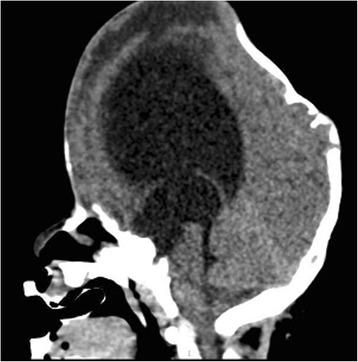
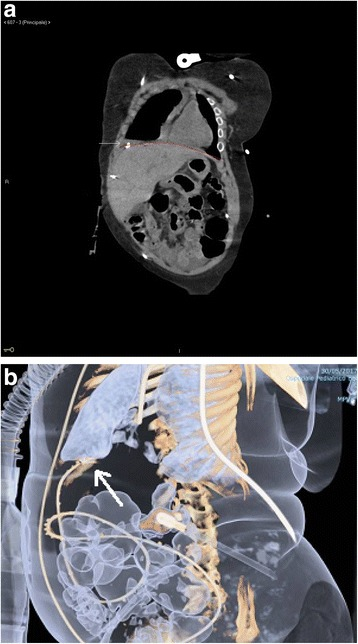
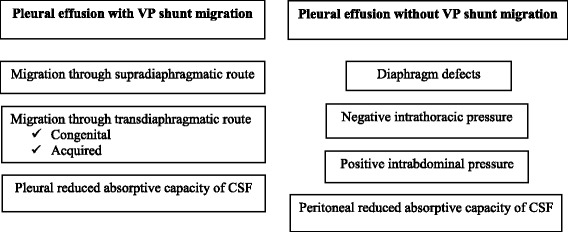
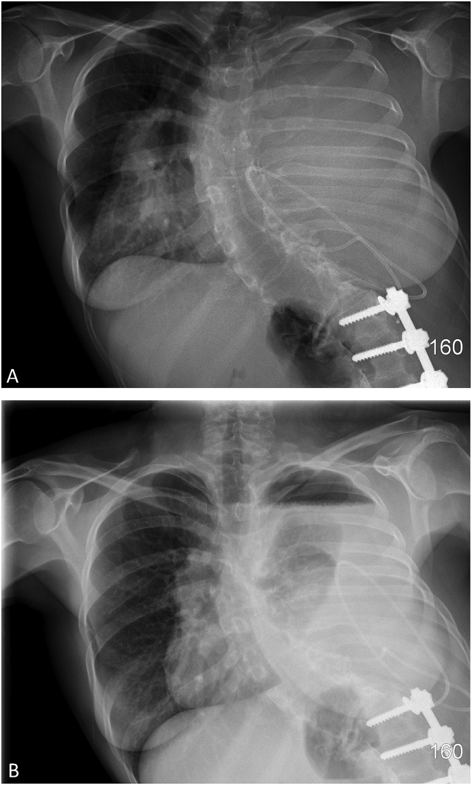
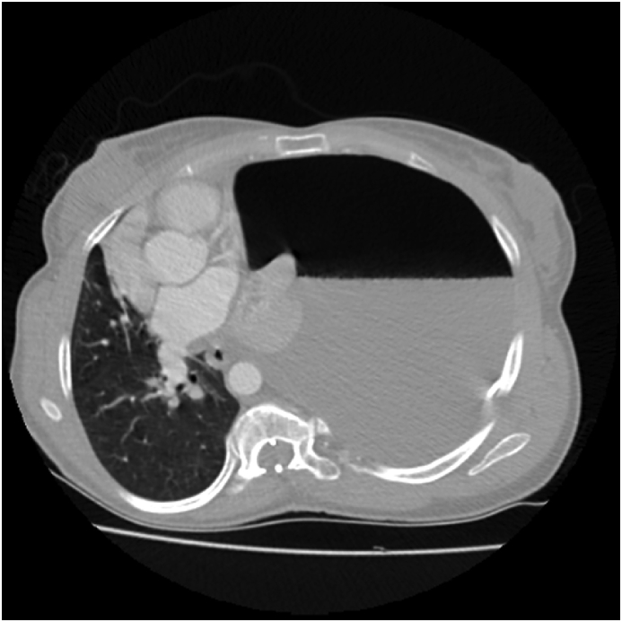
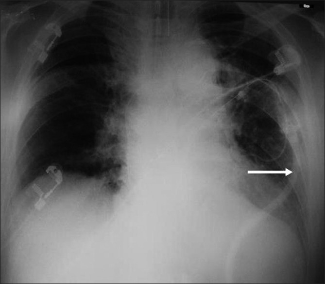
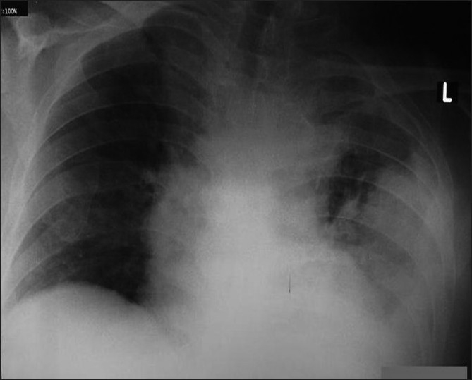
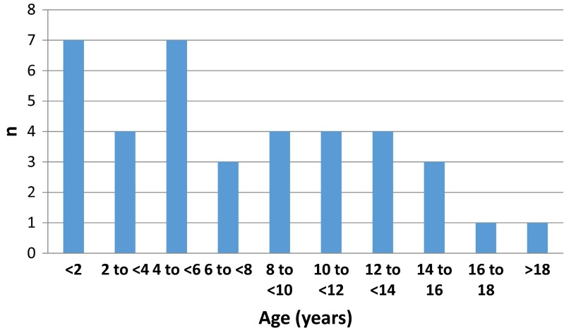
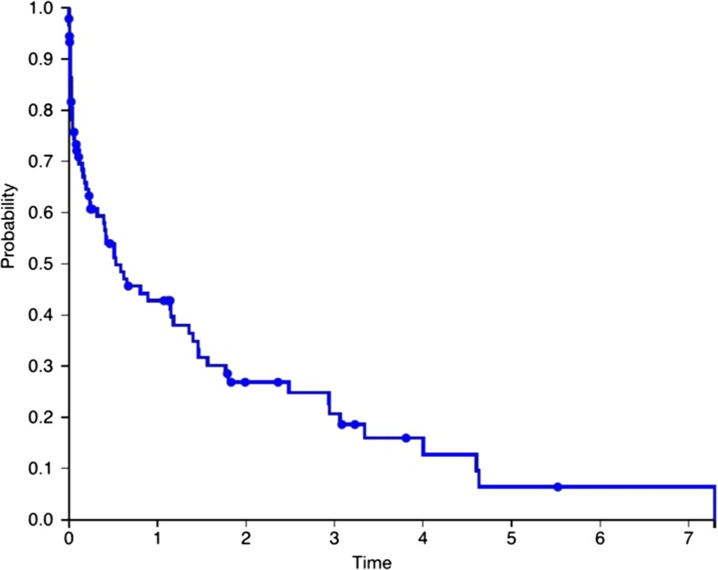
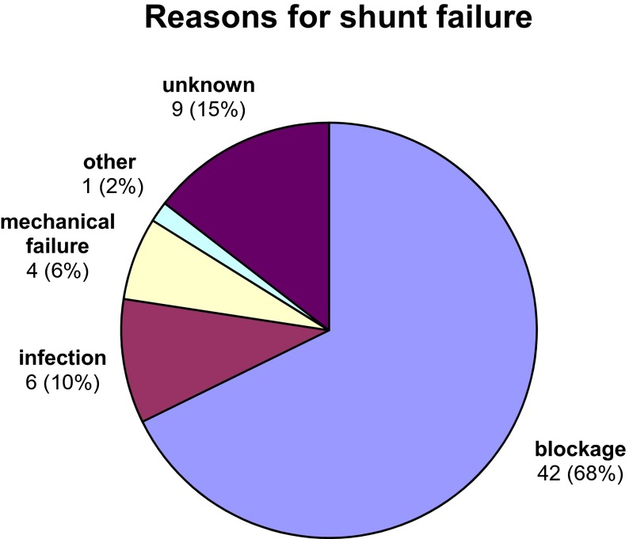

# Case Prep: Ventriculopleural (VPL) Shunt Placement

---

<!-- BEGIN CASE DOSSIER -->

## Case / Approach Dossier

- **Anatomy at risk:** entry point, ventricular target, choroid plexus and deep veins, cortical vessels, eloquent cortex/tracts, catheter path, and distal hardware route.
- **Operative steps:** confirm indication and side, plan trajectory, prepare hardware, access ventricle or cistern safely, confirm flow/position, tunnel/connect devices when needed, and define infection/obstruction surveillance; use the detailed operative sequence and approach notes below as the step-by-step source.
- **Rescue plans:** malposition, hemorrhage, poor CSF return, overdrainage/underdrainage, obstruction, infection, abdominal/pleural complication, slit ventricles, and revision algorithm.
- **Figures:** review [Figures, Imaging & Video](#figures-imaging--video) and the [Curated Image Set](#curated-image-set); embedded local figures should remain open-access, public-domain, or otherwise reusable with attribution.
- **Papers:** review [High-Yield Literature](#high-yield-literature) for seminal sources, modern reviews, and outcome data specific to this page.
- **Textbook cross-checks:** use [Textbook Cross-Checks](#textbook-cross-checks) and the [Source Crosswalk](../../../resources/source-crosswalk.md) to cite copyrighted textbooks/atlases while summarizing in original words.

<!-- END CASE DOSSIER -->

## One-Liner
[Age]yo [M/F] with hydrocephalus and [peritoneal AND atrial sites unavailable] planned for right ventriculopleural shunt placement.

---

## Figures, Imaging & Video

**🎥 Operative video** — [search operative video on YouTube ▸](https://www.youtube.com/results?search_query=ventriculopleural+shunt+surgery) · [The Neurosurgical Atlas ▸](https://www.neurosurgicalatlas.com)

[Neurosurgical Atlas](https://www.neurosurgicalatlas.com) · [Radiopaedia](https://radiopaedia.org/search?q=ventriculopleural%20shunt&scope=all) · [PubMed Central](https://www.ncbi.nlm.nih.gov/pmc/?term=ventriculopleural+shunt) — operative figures © linked; see [media-sources.md](../../../resources/media-sources.md)

---

<!-- BEGIN TEXTBOOK CROSS-CHECKS -->

## Textbook Cross-Checks

- **Trajectory and device anatomy:** Greenberg; Youmans and Winn; Schmidek and Sweet — confirm entry point, trajectory, ventricular/lesion target, hardware pathway, and structures to avoid.
- **Technique sequence:** Greenberg; Youmans and Winn — review setup, navigation/fluoro/endoscopy use, sterile tunneling or stereotactic workflow, and troubleshooting steps.
- **Failure modes:** Greenberg; shunt/device literature; institution-specific protocols — summarize obstruction, malposition, infection, hemorrhage, over/under-drainage, and revision algorithms in original words.
- **Copyright-safe use:** cite these sources as private cross-checks, then write the guide content in original words; do not re-host textbook pages, figures, tables, or board-review card material. See [Source Crosswalk & Copyright-Safe Use](../../../resources/source-crosswalk.md).

<!-- END TEXTBOOK CROSS-CHECKS -->

<!-- BEGIN CURATED LITERATURE -->

## High-Yield Literature

- **Spontaneous Extrusion of Ventriculopleural Shunt Catheter Associated with Pleural Effusion** — Robles LA. World neurosurgery 2020. [PubMed](https://pubmed.ncbi.nlm.nih.gov/32298817/)
- **Ventriculopleural shunt: Review of literature and novel ways to improve ventriculopleural shunt tolerance** — Wong T. Journal of the neurological sciences 2021. [PubMed](https://pubmed.ncbi.nlm.nih.gov/34242833/)
- **Are ventriculopleural shunts the second option for treating hydrocephalus? A meta-analysis of 543 patients** — Brenner LBO. Clinical neurology and neurosurgery 2024. [PubMed](https://pubmed.ncbi.nlm.nih.gov/38981168/)
- **Abdominal pseudocyst complicating ventriculoperitoneal shunt: A rare indication for ventriculopleural shunt conversion** — Shrestha N. Clinical case reports 2023. [PubMed](https://pubmed.ncbi.nlm.nih.gov/37692158/)
- **Ultrasound-guided percutaneous ventriculopleural shunt placement: a minimally invasive technique** — Baro V. Child's nervous system : ChNS : official journal of the International Society for Pediatric Neurosurgery 2020. [PubMed](https://pubmed.ncbi.nlm.nih.gov/31897630/)
- **Ventriculopleural shunts in a pediatric population: a review of 170 consecutive patients** — Christian EA. Journal of neurosurgery. Pediatrics 2021. [PubMed](https://pubmed.ncbi.nlm.nih.gov/34388722/)
- **Case series of ventriculopleural shunts in adults: a single-center experience** — Craven C. Journal of neurosurgery 2017. [PubMed](https://pubmed.ncbi.nlm.nih.gov/27392271/)
- **Ventriculopleural shunts for hydrocephalus: a useful alternative** — Jones RF. Neurosurgery 1988. [PubMed](https://pubmed.ncbi.nlm.nih.gov/3216974/)
- **Cross-sectional imaging of thoracic and abdominal complications of cerebrospinal fluid shunt catheters** — Bolster F. Emergency radiology 2016. [PubMed](https://pubmed.ncbi.nlm.nih.gov/26610766/)
- **Migration of the abdominal catheter of a ventriculoperitoneal shunt into the mouth: a rare presentation** — Low SW. The Malaysian journal of medical sciences : MJMS 2010. [PubMed](https://pubmed.ncbi.nlm.nih.gov/22135552/)

<!-- END CURATED LITERATURE -->

---

<!-- BEGIN CURATED IMAGE SET -->

## Curated Image Set

Open-access figures are embedded from PubMed Central articles and kept unique to this guide.

*Fig. 1. Sagittal MR image shows marked ventricular dilatation in our patient affected by Pfeiffer syndrome Source: [Pleural effusion from intrathoracic migration of a ventriculo-peritoneal shunt catheter: pediatric case report and review of the literature](https://pmc.ncbi.nlm.nih.gov/articles/PMC5870185/) — Italian Journal of Pediatrics 2018; CC BY.*

*Fig. 2. a Coronal plane of chest and abdomen CT scan demonstrating the dislocation of the distal end of VP shunt situated over the diaphragmatic cupola and within the pleural cavity. b Abdomen... Source: [Pleural effusion from intrathoracic migration of a ventriculo-peritoneal shunt catheter: pediatric case report and review of the literature](https://pmc.ncbi.nlm.nih.gov/articles/PMC5870185/) — Italian Journal of Pediatrics 2018; CC BY.*

*Fig. 3. Factors contributing to CSF hydrothorax with or without intrathoracic VP migration Source: [Pleural effusion from intrathoracic migration of a ventriculo-peritoneal shunt catheter: pediatric case report and review of the literature](https://pmc.ncbi.nlm.nih.gov/articles/PMC5870185/) — Italian Journal of Pediatrics 2018; CC BY.*

*Fig. 1. (A) Chest radiograph taken before thoracentesis demonstrating a large left-sided pleural effusion. (B) Post-thoracentesis chest radiograph demonstrating an air-fluid level over the left... Source: [Pleural cerebrospinal fluid shunting causing trapped lung: A respiratory physician's approach to management and prevention](https://pmc.ncbi.nlm.nih.gov/articles/PMC6199769/) — Respiratory Medicine Case Reports 2018; CC BY-NC-ND.*

*Fig. 2. (A) Post-thoracentesis computed tomography scan showing left hydropneumothorax, left lung collapse, and rightwards mediastinum shift. Source: [Pleural cerebrospinal fluid shunting causing trapped lung: A respiratory physician's approach to management and prevention](https://pmc.ncbi.nlm.nih.gov/articles/PMC6199769/) — Respiratory Medicine Case Reports 2018; CC BY-NC-ND.*

*Figure 1. Chest X-ray of case 2 after the VPLS placement. Arrow shows the ventriculo-pleural shunt Source: [Pleural effusion following ventriculopleural shunt: Case reports and review of the literature](https://pmc.ncbi.nlm.nih.gov/articles/PMC2930656/) — Annals of Thoracic Medicine 2010; CC BY.*

*Figure 2. Chest X-ray of the case 2. left-sided large pleural effusion after the VPLS. Source: [Pleural effusion following ventriculopleural shunt: Case reports and review of the literature](https://pmc.ncbi.nlm.nih.gov/articles/PMC2930656/) — Annals of Thoracic Medicine 2010; CC BY.*

*Fig. 1. Range of ages at which the primary VA shunt was inserted Source: [Ultrasound guided placement of the distal catheter in paediatric ventriculoatrial shunts—an appraisal of efficacy and complications](https://pmc.ncbi.nlm.nih.gov/articles/PMC4947480/) — Child's Nervous System 2016; CC BY.*

*Fig. 2. Kaplan-Meier curve of shunt survival over time (in years) Source: [Ultrasound guided placement of the distal catheter in paediatric ventriculoatrial shunts—an appraisal of efficacy and complications](https://pmc.ncbi.nlm.nih.gov/articles/PMC4947480/) — Child's Nervous System 2016; CC BY.*

*Fig. 3. Reasons for shunt failure Source: [Ultrasound guided placement of the distal catheter in paediatric ventriculoatrial shunts—an appraisal of efficacy and complications](https://pmc.ncbi.nlm.nih.gov/articles/PMC4947480/) — Child's Nervous System 2016; CC BY.*

<!-- END CURATED IMAGE SET -->

---

## History of Present Illness
- Chief complaint: Hydrocephalus requiring CSF diversion when peritoneal and atrial sites are exhausted/contraindicated
- **VPL indications:** multiple failed VP shunts, peritoneal contraindication, plus atrial contraindication/exhaustion
- **Avoid in young children/infants** (limited respiratory reserve — pleural effusion poorly tolerated)
- Prior shunt history

---

## Past Medical History
- **Pulmonary disease, limited respiratory reserve** (relative contraindication — effusion), pleural pathology, prior thoracic surgery
- Age (avoid in small children)
- Standard PMH

---

## Imaging Review
### CT/MRI head
- Ventricle size, catheter target, baseline
### Chest imaging
- Baseline lungs/pleura, exclude effusion/pleural disease

---

## Labs
- CBC, BMP, Coags, type and screen

---

## Neurological Examination
- Baseline; hydrocephalus signs; respiratory status

---

## Surgical Planning

### Position
- Supine (slight lateral tilt/roll for chest access), head turned, right neck/chest exposed

### Key Surgical Steps
1. **Proximal (ventricular) catheter** — as VP (frontal/occipital), CSF flow, connect to valve
2. **Pleural distal catheter placement:**
   - Small incision over the anterior/lateral chest (e.g., 4th-5th intercostal space, mid-axillary or anterior)
   - Dissect to the intercostal space (over the rib to avoid the neurovascular bundle under the rib)
   - Enter the pleural space carefully under controlled ventilation (brief hold) — avoid lung injury
   - Insert the distal catheter into the pleural space (several cm)
3. Tunnel catheter from cranial/neck to chest incision, connect valve to pleural catheter, confirm flow
4. **Purse-string / layered closure** around the pleural entry to prevent air leak; consider valsalva to check for air leak
5. **A valve with anti-siphon/appropriate pressure is important** (negative intrapleural pressure can promote overdrainage/siphoning)
6. **Postop CXR** — confirm catheter position, rule out pneumothorax

### Critical Anatomy & Structures at Risk
1. **Lung** — pneumothorax during pleural entry
2. **Intercostal neurovascular bundle** (under the rib — go over the rib)
3. **Pleura** — effusion (CSF accumulation), empyema
4. Overdrainage (negative intrapleural pressure siphons CSF)

### Equipment
- Shunt system with valve (anti-siphon/gravitational recommended), distal catheter
- Chest entry/thoracic instruments, antibiotic-impregnated catheter
- CXR capability

### Anesthesia
- General; **brief ventilation hold during pleural entry**; cefazolin; monitor for pneumothorax

### Potential Complications
1. **Pneumothorax** (entry), **symptomatic pleural effusion / hydrothorax** (CSF — may need higher-pressure/anti-siphon valve, or conversion), **empyema**
2. **Overdrainage** (negative intrapleural pressure) — anti-siphon valve mitigates
3. Catheter migration, obstruction, infection
4. Respiratory compromise (esp. children/limited reserve)

---

## Operative Note Template
**Preoperative Diagnosis:** Hydrocephalus with peritoneal and atrial distal sites unavailable/exhausted

**Postoperative Diagnosis:** Same

**Procedure:** Right ventriculopleural shunt placement with [anti-siphon/programmable] valve

**Surgeon / Assistant:**
**Anesthesia:** General endotracheal
**EBL / Fluids:**
**Adjuncts:** Thoracic entry set, tunneler, CXR
**Implants:** Ventricular catheter, anti-siphon/programmable valve, pleural distal catheter
**Complications:** None

**Indications:** [Age]yo [M/F] (not a young child) with hydrocephalus requiring CSF diversion where peritoneal and atrial sites are unavailable. Risks (pneumothorax, pleural effusion, overdrainage) discussed.

**Description of Procedure:** After consent and time-out, general anesthesia was induced. A [frontal/occipital] ventricular catheter was placed with CSF return and connected to the valve. A small incision was made over the [4th–5th] intercostal space and dissection carried to the intercostal space **over the rib** (avoiding the neurovascular bundle). The **pleural space was entered carefully during a brief ventilation hold**, and the distal catheter inserted several centimeters into the pleural space.

The catheter was tunneled and connected to the **anti-siphon valve** (to counter negative intrapleural pressure), CSF flow confirmed, and an **air-tight purse-string/layered closure** performed around the pleural entry. **A postoperative CXR confirmed catheter position and excluded pneumothorax.**

The patient was transferred with respiratory monitoring and serial CXR surveillance for effusion.

---

## Postoperative Plan
- Floor/step-down, neuro and **respiratory checks**
- **CXR** (pneumothorax, catheter position; recheck for effusion)
- CT head (ventricles), shunt series baseline, document valve setting
- **Monitor for pleural effusion** (dyspnea, decreased breath sounds — serial CXR; large effusion may need valve adjustment or conversion)
- Follow-up imaging; counsel re: effusion risk
