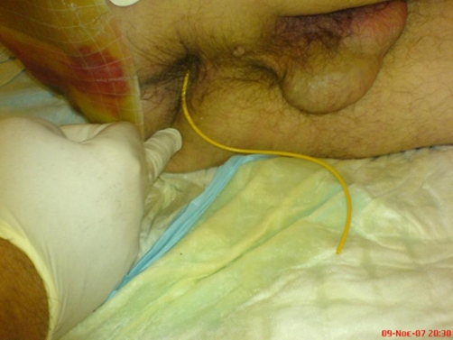
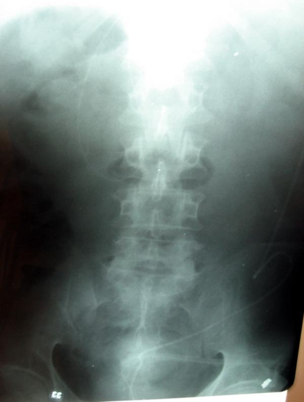
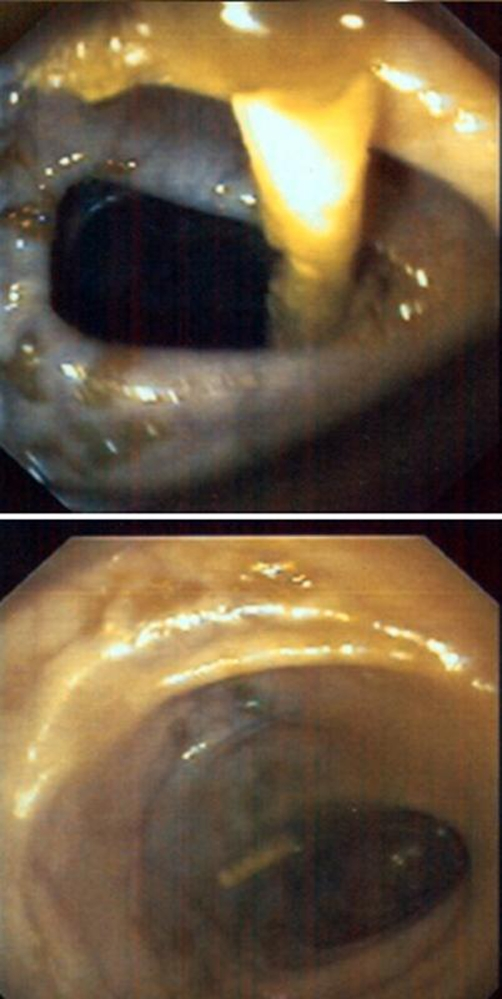
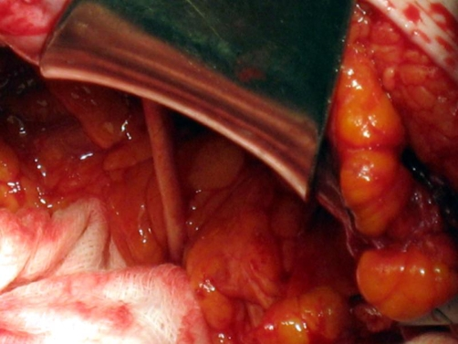
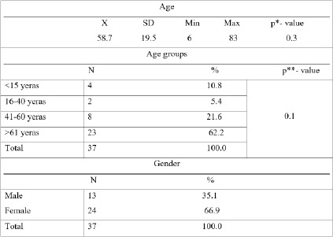
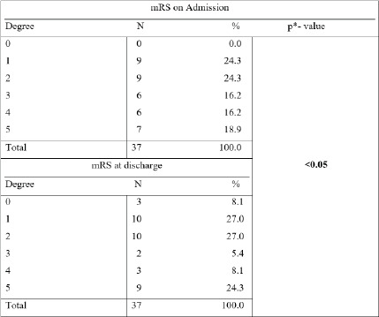
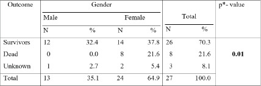
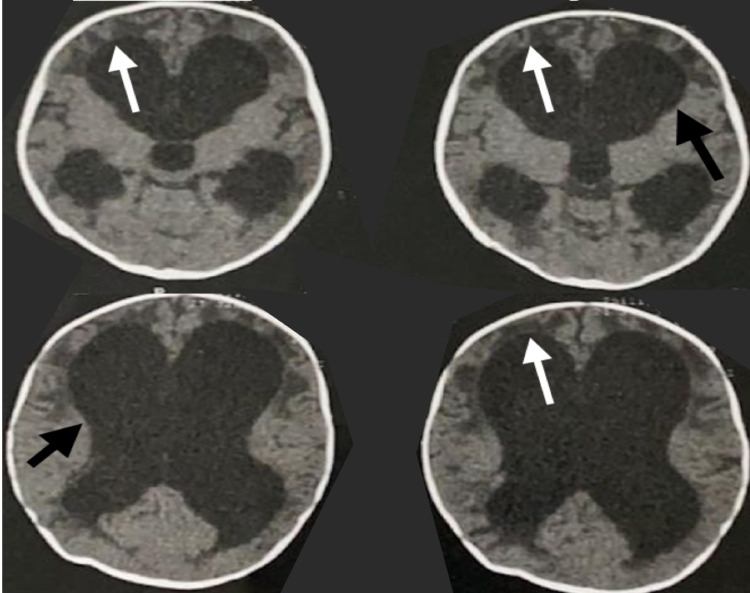
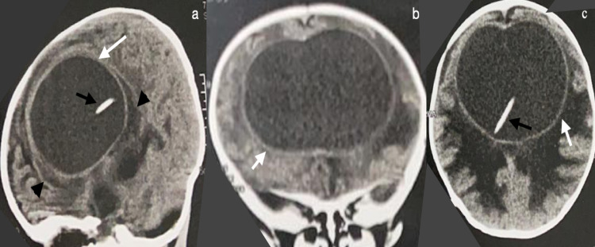
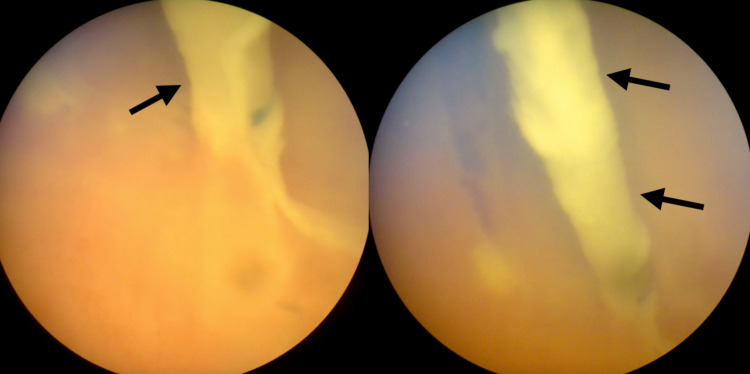

# Case Prep: Ventriculoperitoneal (VP) Shunt Placement

---

<!-- BEGIN CASE SNAPSHOT -->

## Case / Approach Snapshot

- **Anatomy at risk:** entry point, ventricular target, choroid plexus and deep veins, cortical vessels, eloquent cortex/tracts, catheter path, and distal hardware route.
- **Operative steps:** confirm indication and side, plan trajectory, prepare hardware, access ventricle or cistern safely, confirm flow/position, tunnel/connect devices when needed, and define infection/obstruction surveillance; use the detailed operative sequence and approach notes below as the step-by-step source.
- **Rescue plans:** malposition, hemorrhage, poor CSF return, overdrainage/underdrainage, obstruction, infection, abdominal/pleural complication, slit ventricles, and revision algorithm.
- **Figures:** review [Figures, Imaging & Video](#figures-imaging--video) and the [Curated Image Set](#curated-image-set); embedded local figures should remain open-access, public-domain, or otherwise reusable with attribution.
- **Papers:** review [High-Yield Literature](#high-yield-literature) for seminal sources, modern reviews, and outcome data specific to this page.
- **Textbook cross-checks:** use [Textbook Cross-Checks](#textbook-cross-checks) and the [Source Crosswalk](../../resources/source-crosswalk.md) to cite copyrighted textbooks/atlases while summarizing in original words.

<!-- END CASE SNAPSHOT -->

## One-Liner
[Age]yo [M/F] with [communicating/obstructive] hydrocephalus due to [etiology] presenting with [headaches/gait instability/cognitive decline/enlarged head circumference] planned for right frontal VP shunt placement with [fixed/programmable] valve.

---

## Figures, Imaging & Video

**🎥 Operative videos & resources**
- **Technique searches:** [VP shunt placement on YouTube](https://www.youtube.com/results?search_query=ventriculoperitoneal+shunt+placement+neurosurgery) · [laparoscopic VP shunt distal catheter placement](https://www.youtube.com/results?search_query=laparoscopic+ventriculoperitoneal+shunt+distal+catheter+placement)
- **Imaging review:** [Radiopaedia — VP shunt](https://radiopaedia.org/search?q=ventriculoperitoneal%20shunt&scope=all) · [Radiopaedia — hydrocephalus](https://radiopaedia.org/search?q=hydrocephalus&scope=all)
- **Open-access anatomy/technique:** [PubMed Central — ventriculoperitoneal shunt](https://www.ncbi.nlm.nih.gov/pmc/?term=ventriculoperitoneal+shunt+technique)

---

<!-- BEGIN TEXTBOOK CROSS-CHECKS -->

## Textbook Cross-Checks

- **Trajectory and device anatomy:** Greenberg; Youmans and Winn; Schmidek and Sweet — confirm entry point, trajectory, ventricular/lesion target, hardware pathway, and structures to avoid.
- **Technique sequence:** Greenberg; Youmans and Winn — review setup, navigation/fluoro/endoscopy use, sterile tunneling or stereotactic workflow, and troubleshooting steps.
- **Failure modes:** Greenberg; shunt/device literature; institution-specific protocols — summarize obstruction, malposition, infection, hemorrhage, over/under-drainage, and revision algorithms in original words.
- **Copyright-safe use:** cite these sources as private cross-checks, then write the guide content in original words; do not re-host textbook pages, figures, tables, or board-review card material. See [Source Crosswalk & Copyright-Safe Use](../../resources/source-crosswalk.md).

<!-- END TEXTBOOK CROSS-CHECKS -->

<!-- BEGIN CURATED LITERATURE -->

## High-Yield Literature

- **Shunt migration in ventriculoperitoneal shunting: A comprehensive review of literature** — Harischandra LS. Neurology India 2019. [PubMed](https://pubmed.ncbi.nlm.nih.gov/30860103/)
- **Ventriculoperitoneal Shunt Infection** — López-Sánchez C. JAMA dermatology 2020. [PubMed](https://pubmed.ncbi.nlm.nih.gov/33001141/)
- **Techniques and Nuances in Ventriculoperitoneal Shunt Surgery** — Pillai SV. Neurology India 2021. [PubMed](https://pubmed.ncbi.nlm.nih.gov/35103004/)
- **The Evolution of Ventriculoperitoneal Shunt Valves and Why They Fail** — Stehlik BN. World neurosurgery 2025. [PubMed](https://pubmed.ncbi.nlm.nih.gov/39710199/)
- **Ventriculoperitoneal Shunt-related Intrapelvic Abscess** — Zenda T. Internal medicine (Tokyo, Japan) 2020. [PubMed](https://pubmed.ncbi.nlm.nih.gov/31787703/)
- **Ventriculoperitoneal Shunt Complications In Children: An Evidence-Based Approach To Emergency Department Management** — Bober J. Pediatric emergency medicine practice 2016. [PubMed](https://pubmed.ncbi.nlm.nih.gov/26794147/)
- **Ventriculoperitoneal shunt** — Hauk L. AORN journal 2018. [PubMed](https://pubmed.ncbi.nlm.nih.gov/29341099/)
- **Ventriculoperitoneal Shunt Tap Task Trainer: A Technical Report** — Connors J. Cureus 2023. [PubMed](https://pubmed.ncbi.nlm.nih.gov/37539425/)
- **Ventriculoperitoneal shunt tap** — Oakes WJ. Journal of neurosurgery. Pediatrics 2008. [PubMed](https://pubmed.ncbi.nlm.nih.gov/18518691/)
- **Ventriculoperitoneal shunt migration into the pulmonary artery: Case report and literature review** — González-Pombo M. Neurocirugia 2023. [PubMed](https://pubmed.ncbi.nlm.nih.gov/36775740/)

<!-- END CURATED LITERATURE -->

---

<!-- BEGIN CURATED IMAGE SET -->

## Curated Image Set

Open-access figures are embedded from PubMed Central articles and kept unique to this guide.

*Figure 1.. The ventriculoperitoneal shunt catheter is protruding through the patient’s normal-appearing anus. Source: [Spontaneous bowel perforation complicating ventriculoperitoneal shunt: a case report](https://pmc.ncbi.nlm.nih.gov/articles/PMC2769419/) — Cases Journal 2009; CC BY.*

*Figure 2.. Plain abdominal radiography showing the ventriculoperitoneal shunt catheter within the colonic lumen. Source: [Spontaneous bowel perforation complicating ventriculoperitoneal shunt: a case report](https://pmc.ncbi.nlm.nih.gov/articles/PMC2769419/) — Cases Journal 2009; CC BY.*

*Figure 3.. Sigmoidoscopy showed the distal part of the ventriculoperitoneal shunt catheter within the sigmoid colon and the penetration site at the distal descending colon. Source: [Spontaneous bowel perforation complicating ventriculoperitoneal shunt: a case report](https://pmc.ncbi.nlm.nih.gov/articles/PMC2769419/) — Cases Journal 2009; CC BY.*

*Figure 4.. Laparotomy view: the distal part of the ventriculoperitoneal shunt catheter penetrating the sigmoid colon. Source: [Spontaneous bowel perforation complicating ventriculoperitoneal shunt: a case report](https://pmc.ncbi.nlm.nih.gov/articles/PMC2769419/) — Cases Journal 2009; CC BY.*

*Table 1.. Distribution of patients with implanted ventriculoperitoneal shunts by age and gender *-T test; X- Mean value; SD- Standard deviation; **-Chi-square test of independence Source: [Complications and Outcome in Patients With Hydrocephalus Who Have Had a Ventriculoperitoneal Shunt Implanted](https://pmc.ncbi.nlm.nih.gov/articles/PMC12269767/) — Medical Archives 2025; CC BY-NC.*

*Table 2.. Degree of disability of patients with implanted ventriculoperitoneal shunt mRS on Admission, mRS-Modified Rankin Scale; * - Chi-square test; Source: [Complications and Outcome in Patients With Hydrocephalus Who Have Had a Ventriculoperitoneal Shunt Implanted](https://pmc.ncbi.nlm.nih.gov/articles/PMC12269767/) — Medical Archives 2025; CC BY-NC.*

*Table 3.. Outcome of patients with idiopathic hydrocephalus who underwent ventriculoperitoneal shunt implantation in relation to gender * - Chi-square test; Source: [Complications and Outcome in Patients With Hydrocephalus Who Have Had a Ventriculoperitoneal Shunt Implanted](https://pmc.ncbi.nlm.nih.gov/articles/PMC12269767/) — Medical Archives 2025; CC BY-NC.*

*Figure 1. Axial computed tomography (CT) scan Shows enlargement of the ventricles (black arrows) with transependymal edema (white arrows). Source: [The Intraventricular Pseudocyst as a Complication of Ventriculoperitoneal Shunt: A Rare Case Report and Review of Literature](https://pmc.ncbi.nlm.nih.gov/articles/PMC8776519/) — Cureus 2021; CC BY.*

*Figure 2. Computed tomography (CT) scan without contrast enhancementCT scan without contrast enhancement in the sagittal (a), coronal (b), and axial (c) planes. Shows pseudocyst (white arrows)... Source: [The Intraventricular Pseudocyst as a Complication of Ventriculoperitoneal Shunt: A Rare Case Report and Review of Literature](https://pmc.ncbi.nlm.nih.gov/articles/PMC8776519/) — Cureus 2021; CC BY.*

*Figure 3. Endoscopic image Showing ventricular catheter inside the cystic cavity (black arrows). Source: [The Intraventricular Pseudocyst as a Complication of Ventriculoperitoneal Shunt: A Rare Case Report and Review of Literature](https://pmc.ncbi.nlm.nih.gov/articles/PMC8776519/) — Cureus 2021; CC BY.*

<!-- END CURATED IMAGE SET -->

---

## History of Present Illness
- Chief complaint: Headaches / gait instability / urinary incontinence / cognitive decline / increasing head circumference (pediatric)
- Duration and progression:
- **Hydrocephalus type:**
  - Communicating: Post-SAH, post-meningitis, post-hemorrhagic (neonatal), idiopathic
  - Obstructive: Aqueductal stenosis, tumor, Chiari, Dandy-Walker
  - Normal pressure hydrocephalus (NPH): Classic triad — gait apraxia, urinary incontinence, dementia ("wet, wobbly, wacky")
- Prior shunt history: Previous VP shunts, revisions, infections
- Prior EVD/ETV:
- NPH workup: Large-volume LP (improvement after 30-50 mL drainage supports diagnosis)

---

## Past Medical History
- Prior shunt/revisions (dates, sides, types)
- Prior CNS infection (ventriculitis, meningitis)
- Prior abdominal surgery (adhesions affect peritoneal catheter)
- Peritoneal pathology (ascites, peritonitis, prior peritoneal catheter complications)
- Latex allergy (spina bifida patients — high rate)
- Allergies:
- Medications:

---

## Imaging Review
### CT Head
- Ventriculomegaly: Frontal horn index, temporal horn size
- Evans index: Frontal horn width / max biparietal diameter (> 0.3 = hydrocephalus)
- Periventricular lucency (acute hydrocephalus)
- Cortical mantle thickness at planned entry site
- Prior shunt hardware

### MRI Brain
- Aqueductal flow void (present = patent; absent = stenosis)
- CSF flow study (cine MRI) if obstructive hydrocephalus suspected
- Underlying pathology
- For NPH: DESH (disproportionately enlarged subarachnoid space hydrocephalus) pattern

---

## Labs
- CBC, BMP, Coags
- Type and screen
- CSF studies from LP (if recent LP done — cell count, protein, glucose, culture)

---

## Neurological Examination
### NPH Assessment
- Gait: Wide-based, magnetic, shuffling, turns en bloc
- Timed Up and Go (TUG) test: Baseline ___
- Cognition: MMSE/MoCA: ___
- Urinary: Frequency, urgency, incontinence
- **Post-LP improvement** (if large-volume LP performed): Gait improvement suggests shunt-responsive NPH

---

## Surgical Planning

### Valve Selection
- **Fixed-pressure valve:** Low, medium, or high pressure (set at manufacture)
- **Programmable valve (preferred):** Adjustable pressure setting post-op (e.g., Strata, Certas, proGAV, Codman Hakim)
  - Can adjust non-invasively if over/under-drainage occurs
  - Initial setting typically medium (e.g., 1.5 or performance level 1.5)
- **Anti-siphon device / gravitational valve:** Reduces overdrainage in upright position
- **On/off valve:** Rarely used

### Position
- **Patient position:** Supine, head turned to the LEFT (right side up for right-sided shunt)
- **Head:** On horseshoe headrest or Mayfield (for navigation-guided proximal catheter)
- **Right side exposed:** Head, neck, chest, abdomen — all prepped in one field
- **Arms:** Left arm tucked, right arm on armboard or tucked

### Incision Sites
1. **Cranial:** Right frontal (Kocher's point) or right parieto-occipital (Keen's point or Frazier's point)
2. **Abdominal:** Small periumbilical or subcostal incision (for peritoneal catheter insertion)

### Key Surgical Steps

**Proximal catheter (ventricular):**
1. Mark entry point (Kocher's point: 11 cm from nasion, 3 cm from midline; OR occipital)
2. Incision (~3 cm), expose skull
3. Burr hole
4. Open dura
5. Pass ventricular catheter to 5-5.5 cm depth (target: frontal horn)
   - Aim: ipsilateral medial canthus (coronal), ipsilateral tragus (sagittal)
   - OR use navigation for guided placement
6. Confirm CSF flow
7. Connect to valve

**Tunneling:**
8. Subcutaneous tunnel from cranial incision to abdominal incision
   - Use shunt passer (long tunneling rod)
   - Pass behind the ear, down the neck (anterior to SCM), across the chest, to the abdomen
   - Avoid crossing midline
   - Ensure valve sits behind the ear (accessible for programming/palpation)

**Distal catheter (peritoneal):**
9. Abdominal incision — small (2-3 cm) periumbilical or subcostal
10. Dissect through subcutaneous tissue, fascia, muscle
11. Identify peritoneum, open carefully (avoid bowel injury)
12. Insert peritoneal catheter (~20-25 cm of tubing into peritoneal cavity)
13. Confirm distal flow of CSF through the system
14. Close peritoneal entry tightly around catheter to prevent CSF leak/hernia
15. Close all incisions

**Alternative distal sites:**
- Atrium (VA shunt) — for patients with abdominal pathology
- Pleural space (ventriculopleural) — less common

### Critical Anatomy
1. **Ventricular catheter:** Same risks as EVD (cortical vessels, caudate, thalamus)
2. **Great vessels in neck:** Carotid, IJV — tunneling should be superficial to SCM fascia
3. **Peritoneum:** Bowel injury during peritoneal entry
4. **Subcutaneous tunnel:** Avoid skin erosion over hardware (adequate tissue coverage)

### Equipment
- Shunt system (valve, ventricular catheter, peritoneal catheter, connectors)
- Valve type: [Programmable — brand and initial setting]
- Tunneling rod (shunt passer)
- Drill (twist drill or perforator)
- Navigation (optional but recommended for proximal catheter)
- Antibiotics: Vancomycin irrigation per protocol
- Antibiotic-impregnated catheter (Bactiseal or Ares — reduces infection rate)

### Monitoring
- Standard ASA monitors

### Anesthesia
- General endotracheal anesthesia
- Cefazolin 2g IV (some add vancomycin IV per protocol)
- Single-dose abdominal/chest prep

### Potential Complications
1. **Shunt infection** (5-10%) — presents days to weeks post-op; treated with shunt removal, EVD, IV antibiotics, then reshunt
2. **Shunt malfunction** — proximal obstruction (most common), distal obstruction, valve failure
3. **Over-drainage** — subdural hematomas/hygromas, slit ventricle syndrome; adjust programmable valve
4. **Under-drainage** — persistent hydrocephalus; lower valve setting or check for obstruction
5. **Peritoneal complications** — pseudocyst, infection, bowel perforation (rare)
6. **Hardware erosion** — especially in pediatric patients with thin skin
7. **Wound infection** — superficial; may be managed with antibiotics vs hardware removal

---

## Operative Note Template

**Preoperative Diagnosis:** [Communicating/Obstructive] hydrocephalus due to [etiology]

**Postoperative Diagnosis:** Same

**Procedure:** Right frontal ventriculoperitoneal shunt placement with [programmable valve type] set at [initial pressure setting]

[Include: ventricular catheter depth, CSF flow confirmation, valve placement, tunneling path, peritoneal entry, peritoneal catheter length, system flow confirmation]

---

## Postoperative Plan
- Floor admission or step-down x 24 hours
- Neuro checks q2h x 24h
- CT head within 24 hours (catheter position, ventricle size)
- Abdominal X-ray (confirm peritoneal catheter position and coiling)
- Shunt series X-rays (skull, chest, abdomen) — baseline for future comparison
- Monitor for signs of over-drainage: Positional headache, subdural collections
- Monitor for signs of under-drainage: Persistent symptoms, enlarging ventricles
- **Programmable valve setting:** Initial setting ___ ; document for patient records and card
- **MRI safety:** Document valve type and MRI compatibility; most modern programmable valves are MRI-conditional but may need resetting after MRI
- Wound care: Keep dry x 48h; inspect for CSF leak, redness
- Activity: No heavy lifting x 4-6 weeks
- Educate patient/family on shunt malfunction signs
- Follow-up: 2-4 weeks clinic; CT at 3 months (new baseline ventricle size)
- NPH patients: Repeat gait assessment at 1-3 months; adjust valve if needed
