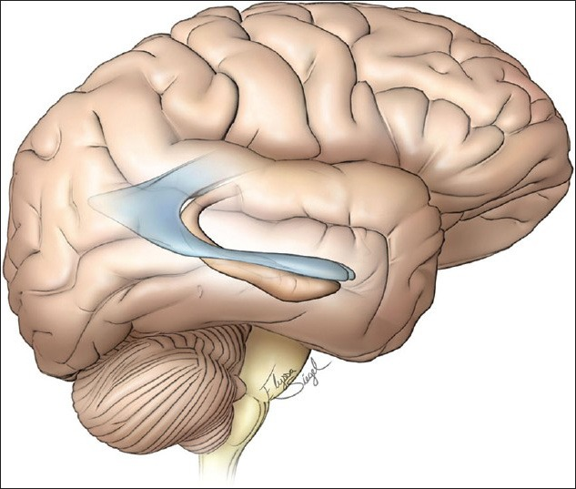
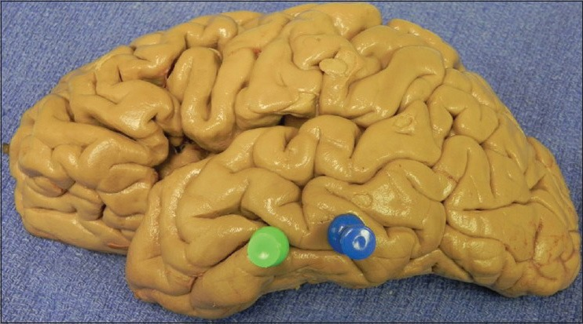
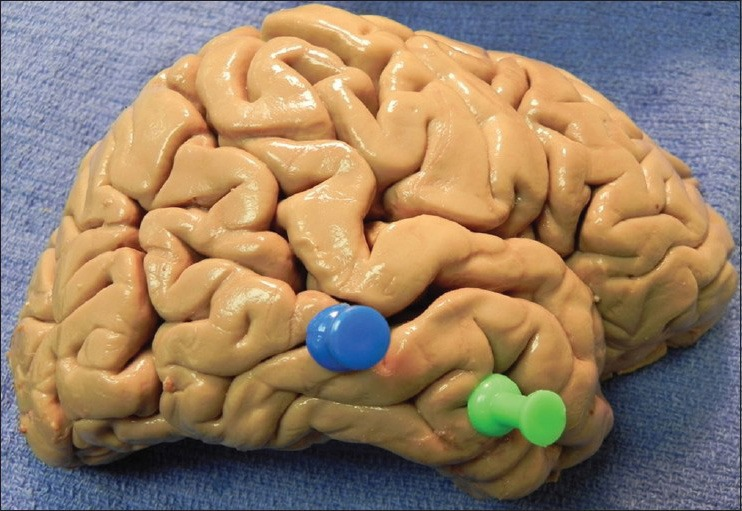
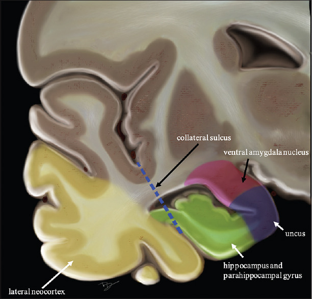
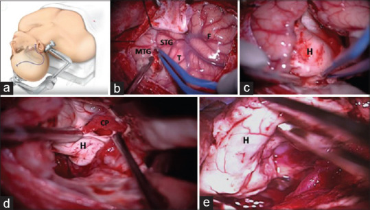
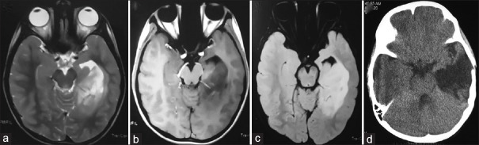
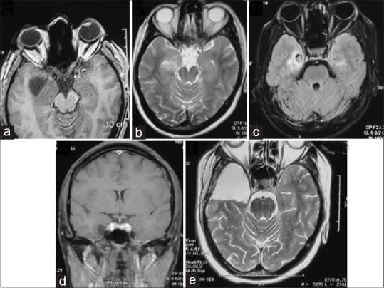
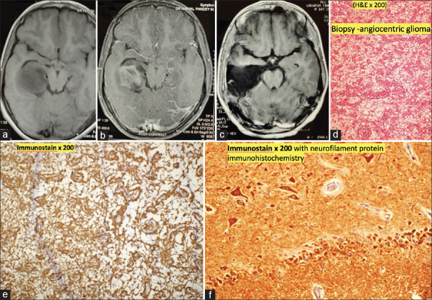
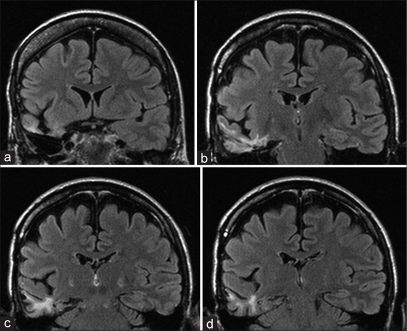
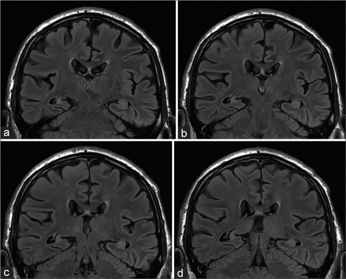

# Case Prep: Anterior Temporal Lobectomy / Selective Amygdalohippocampectomy (Epilepsy)

---

## One-Liner
[Age]yo [M/F] with medically refractory [left/right] **mesial temporal lobe epilepsy** (hippocampal sclerosis) planned for [left/right] anterior temporal lobectomy with amygdalohippocampectomy.

---

## Figures, Imaging & Video

**🎥 Operative video** — [search operative video on YouTube ▸](https://www.youtube.com/results?search_query=mesial+temporal+sclerosis+surgery) · [The Neurosurgical Atlas ▸](https://www.neurosurgicalatlas.com)

[Neurosurgical Atlas](https://www.neurosurgicalatlas.com) · [Radiopaedia](https://radiopaedia.org/search?q=mesial%20temporal%20sclerosis&scope=all) · [PubMed Central](https://www.ncbi.nlm.nih.gov/pmc/?term=anterior+temporal+lobectomy+amygdalohippocampectomy) — operative figures © linked; see [media-sources.md](../../resources/media-sources.md)

---

<!-- BEGIN TEXTBOOK CROSS-CHECKS -->

## Textbook Cross-Checks

- **Functional/pediatric anatomy:** Youmans and Winn; Schmidek and Sweet; Greenberg — confirm targets, trajectories, cranial nerve/brainstem/tract relationships, and age-specific anatomy.
- **Technique sequence:** Schmidek and Sweet; Youmans and Winn — review positioning, monitoring/mapping, exposure or stereotactic workflow, and closure/device management.
- **Complication rescue:** Greenberg; specialty literature — summarize neurologic, CSF, hemorrhagic, infectious, airway/swallowing, and hardware-related contingencies in original language.
- **Copyright-safe use:** cite these sources as private cross-checks, then write the guide content in original words; do not re-host textbook pages, figures, tables, or board-review card material. See [Source Crosswalk & Copyright-Safe Use](../../resources/source-crosswalk.md).

<!-- END TEXTBOOK CROSS-CHECKS -->

<!-- BEGIN CURATED LITERATURE -->

## High-Yield Literature

- **Anterior temporal lobectomy and selective AmygdaloHippocampectomy complications across Europe: review, meta-analysis, and Delphi consensus** — Karagianni MD. Brain & spine 2025. [PubMed](https://pubmed.ncbi.nlm.nih.gov/40689131/)
- **An examination of seizure-free outcome and visual field deficits: Anterior temporal lobectomy versus selective amygdalohippocampectomy for temporal lobe epilepsy-a systematic review and meta-analysis for comprehensive understanding** — Rangwala BS. Acta neurochirurgica 2024. [PubMed](https://pubmed.ncbi.nlm.nih.gov/39607527/)
- **Selective Amygdalohippocampectomy** — Hoyt AT. Neurosurgery clinics of North America 2016. [PubMed](https://pubmed.ncbi.nlm.nih.gov/26615103/)
- **Comparisons of the seizure-free outcome and visual field deficits between anterior temporal lobectomy and selective amygdalohippocampectomy: A systematic review and meta-analysis** — Xu K. Seizure 2020. [PubMed](https://pubmed.ncbi.nlm.nih.gov/32882478/)
- **Selective amygdalohippocampectomy versus anterior temporal lobectomy in the management of mesial temporal lobe epilepsy: a meta-analysis of comparative studies** — Hu WH. Journal of neurosurgery 2013. [PubMed](https://pubmed.ncbi.nlm.nih.gov/24032705/)
- **Comparison of therapeutic effects between selective amygdalohippocampectomy and anterior temporal lobectomy for the treatment of temporal lobe epilepsy: a meta-analysis** — Kuang Y. British journal of neurosurgery 2014. [PubMed](https://pubmed.ncbi.nlm.nih.gov/24099101/)
- **Selective amygdalohippocampectomy** — Spencer D. Epilepsy research and treatment 2012. [PubMed](https://pubmed.ncbi.nlm.nih.gov/22957229/)
- **Selective amygdalohippocampectomy: the trans-middle temporal gyrus approach** — Wheatley BM. Neurosurgical focus 2008. [PubMed](https://pubmed.ncbi.nlm.nih.gov/18759628/)
- **Visual outcomes after anterior temporal lobectomy and transsylvian selective amygdalohippocampectomy: A quantitative comparison of clinical and diffusion data** — Pruckner P. Epilepsia 2023. [PubMed](https://pubmed.ncbi.nlm.nih.gov/36529714/)
- **Anterior temporal lobectomy versus selective amygdalohippocampectomy in patients with mesial temporal lobe epilepsy** — Nascimento FA. Arquivos de neuro-psiquiatria 2016. [PubMed](https://pubmed.ncbi.nlm.nih.gov/26690840/)

<!-- END CURATED LITERATURE -->

---

<!-- BEGIN CURATED IMAGE SET -->

## Curated Image Set

Open-access figures are embedded from PubMed Central articles and kept unique to this guide.

*Figure 1. Schematic drawing of the typically noted position of the temporal horn. ©The Neurosurgical Atlas by Aaron A. Cohen-Gadol, MD, used with permission Source: [External cortical landmarks and measurements for the temporal horn: Anatomic study with application to surgery of the temporal lobe](https://pmc.ncbi.nlm.nih.gov/articles/PMC4322373/) — Surgical Neurology International 2015; CC BY-NC-SA.*

*Figure 2. Right-sided brain with pins in the anterior and posterior extent of the temporal horn Source: [External cortical landmarks and measurements for the temporal horn: Anatomic study with application to surgery of the temporal lobe](https://pmc.ncbi.nlm.nih.gov/articles/PMC4322373/) — Surgical Neurology International 2015; CC BY-NC-SA.*

*Figure 3. Left sided brain with pins marking the anterior and posterior extent of the temporal horn Source: [External cortical landmarks and measurements for the temporal horn: Anatomic study with application to surgery of the temporal lobe](https://pmc.ncbi.nlm.nih.gov/articles/PMC4322373/) — Surgical Neurology International 2015; CC BY-NC-SA.*

*Figure 1. Coronal view of temporal lobe Source: [Seizure Outcome after Lesionectomy With or Without Concomitant Anteromedial Temporal Lobectomy for Low-Grade Gliomas of the Medial Temporal Lobe](https://pmc.ncbi.nlm.nih.gov/articles/PMC8477827/) — Asian Journal of Neurosurgery 2021; CC BY-NC-SA.*

*Figure 2. Operative steps of AMTR. Incision on superior temporal sulcus between superior and middle temporal Gyrus [Figure 2a,b]; tumor infiltrating hippocampus [Figure 2c]. Gross total excision... Source: [Seizure Outcome after Lesionectomy With or Without Concomitant Anteromedial Temporal Lobectomy for Low-Grade Gliomas of the Medial Temporal Lobe](https://pmc.ncbi.nlm.nih.gov/articles/PMC8477827/) — Asian Journal of Neurosurgery 2021; CC BY-NC-SA.*

*Figure 3. Magnetic resonance imaging (a-c) and computed tomography (d) of ganglioneuroma operated by AMTR with gross total excision Source: [Seizure Outcome after Lesionectomy With or Without Concomitant Anteromedial Temporal Lobectomy for Low-Grade Gliomas of the Medial Temporal Lobe](https://pmc.ncbi.nlm.nih.gov/articles/PMC8477827/) — Asian Journal of Neurosurgery 2021; CC BY-NC-SA.*

*Figure 4. (a-e) Magnetic resonance imaging of a patient with medial temporal pilocytic astrocytoma operated by AMTR Source: [Seizure Outcome after Lesionectomy With or Without Concomitant Anteromedial Temporal Lobectomy for Low-Grade Gliomas of the Medial Temporal Lobe](https://pmc.ncbi.nlm.nih.gov/articles/PMC8477827/) — Asian Journal of Neurosurgery 2021; CC BY-NC-SA.*

*Figure 5. (a-c) The patient underwent AMTR. Histopathology showing mildly anisomorphic astrocytes around thin vascular spaces with microcystic degeneration (d). GFAP (Glial fibrillary acidic... Source: [Seizure Outcome after Lesionectomy With or Without Concomitant Anteromedial Temporal Lobectomy for Low-Grade Gliomas of the Medial Temporal Lobe](https://pmc.ncbi.nlm.nih.gov/articles/PMC8477827/) — Asian Journal of Neurosurgery 2021; CC BY-NC-SA.*

*Figure 1:. (a-d) Gliotic changes in the temporal lobe with complete hippocampal resection in patient no. 6. Source: [One-year neuropsychological outcome after temporal lobe epilepsy surgery in large Czech sample: Search for factors contributing to memory decline](https://pmc.ncbi.nlm.nih.gov/articles/PMC9282793/) — Surgical Neurology International 2022; CC BY-NC-SA.*

*Figure 2:. (a-d) Hippocampal remnants after the right-sided anteromesial temporal resection in patient no. 2. Source: [One-year neuropsychological outcome after temporal lobe epilepsy surgery in large Czech sample: Search for factors contributing to memory decline](https://pmc.ncbi.nlm.nih.gov/articles/PMC9282793/) — Surgical Neurology International 2022; CC BY-NC-SA.*

<!-- END CURATED IMAGE SET -->

---

## History of Present Illness
- Chief complaint: Drug-resistant focal epilepsy (failed ≥ 2 appropriate AEDs)
- Seizure semiology (aura — epigastric/déjà vu, automatisms, focal to bilateral tonic-clonic), frequency
- **Comprehensive epilepsy workup** completed:
  - Video-EEG (ictal onset localization)
  - MRI (hippocampal sclerosis)
  - Neuropsychological testing
  - PET/SPECT, MEG as needed
  - **Wada test or fMRI** (language/memory lateralization — critical for dominant-side resection)
  - Intracranial monitoring (SEEG/grids) if non-localizing

---

## Imaging Review
### MRI (epilepsy protocol — thin coronal hippocampal cuts, FLAIR)
- **Hippocampal sclerosis** — atrophy, T2/FLAIR hyperintensity
- Mesial temporal structures (amygdala, hippocampus, parahippocampus)
- Exclude other lesions (tumor, dysplasia, cavernoma)
- Vascular anatomy (MCA, anterior choroidal, PCA, basal vein), temporal horn

### Functional
- Wada/fMRI (language and memory dominance)
- PET (temporal hypometabolism), ictal SPECT

---

## Labs
- CBC, BMP, Coags, Type and screen
- AED levels

---

## Neurological Examination
- Language (dominant side), memory, visual fields (Meyer's loop risk), full exam

---

## Surgical Planning

### Diagnosis & Indication
- Indication: Drug-resistant mesial temporal lobe epilepsy with concordant EEG/MRI/semiology
- Procedure choice: **Anterior temporal lobectomy (ATL)** with amygdalohippocampectomy, OR **selective amygdalohippocampectomy (SAH)** (spares lateral temporal neocortex — may better preserve naming/memory but similar seizure outcomes debated)
- Dominant side: limit lateral resection (language), Wada-guided

### Position
- Supine, head rotated 60-90 degrees contralateral, slight extension, vertex down; Mayfield

### Approach: Temporal Craniotomy
### Key Surgical Steps (ATL)
1. Question-mark/reverse-question-mark temporal incision, temporal craniotomy (low to middle fossa floor)
2. Open dura, expose temporal lobe
3. **Lateral neocortical resection:** measure from temporal tip — typically **~4-4.5 cm dominant, ~5-5.5 cm non-dominant** along middle temporal gyrus (stay anterior to avoid Wernicke; limit superior temporal gyrus on dominant side)
4. Subpial resection of superior/middle/inferior temporal gyri; enter the **temporal horn** of the lateral ventricle
5. Identify ventricular landmarks: choroid plexus, choroidal fissure, hippocampus, collateral eminence
6. **Mesial resection:** resect amygdala (anterior, up to level of choroidal point — avoid going superomedial into basal ganglia/optic tract), then hippocampus and parahippocampal gyrus
7. Disconnect hippocampus posteriorly (en bloc or piecemeal), divide hippocampal/fimbrial attachments
8. **Preserve the pia over the medial structures** protecting the brainstem, CN III, PCA, anterior choroidal artery, and basal vein in the ambient cistern
9. Hemostasis, closure

### Critical Anatomy & Structures at Risk
1. **Optic radiations / Meyer's loop** — superior/lateral resection → contralateral superior quadrantanopia ("pie in the sky")
2. **Language cortex** (dominant — Wernicke posterior, basal temporal language) — limit posterior/superior extent
3. **MCA branches** (Sylvian), **anterior choroidal & PCA**, **basal vein of Rosenthal** (medial, ambient cistern)
4. **CN III, midbrain** (medial — preserve pia)
5. **Memory** (contralateral hippocampal reserve — Wada)

### Equipment
- Microscope, navigation, CUSA, subpial dissection instruments, bipolar
- ECoG electrodes (optional intraoperative), ultrasonic aspirator

### Monitoring
- Optional ECoG; awake language mapping if resection near dominant language cortex

### Anesthesia
- Arterial line, AED continuation, standard; awake protocol if mapping

### Potential Complications
1. **Visual field deficit** (superior quadrantanopia — Meyer's loop) — common, often subclinical
2. **Memory decline** (dominant hippocampus — Wada predicts), naming difficulty (dominant)
3. Vascular injury (anterior choroidal → hemiparesis; PCA, MCA)
4. CN III palsy, hemiparesis, hemorrhage, infection
5. Persistent seizures (~30% not seizure-free)

---

## Operative Note Template
**Preoperative Diagnosis:** Drug-resistant [left/right] mesial temporal lobe epilepsy (hippocampal sclerosis)

**Postoperative Diagnosis:** Same

**Procedure:** [Left/Right] anterior temporal lobectomy with amygdalohippocampectomy

**Surgeon / Assistant:**
**Anesthesia:** General endotracheal
**EBL / Fluids:**
**Adjuncts:** Neuronavigation, microscope, CUSA; [ECoG; awake mapping if dominant]
**Implants:** None
**Complications:** None

**Indications:** [Age]yo [M/F] with drug-resistant mesial temporal lobe epilepsy and concordant EEG/MRI (hippocampal sclerosis); Wada/fMRI established [language/memory] lateralization. Risks (visual field cut, memory/naming, vascular) discussed.

**Description of Procedure:** After consent and time-out, general anesthesia was induced and the head positioned (rotated ~60–90°). A temporal craniotomy low to the middle fossa floor was performed and the dura opened. A **lateral neocortical resection** was carried out along the middle temporal gyrus (~[4–4.5 cm dominant / 5–5.5 cm non-dominant] from the temporal tip), and the **temporal horn** entered, identifying the choroid plexus, hippocampus, and collateral eminence.

The **amygdala** was resected (up to the level of the choroidal point) and the **hippocampus and parahippocampal gyrus** removed. **The pia over the medial structures was preserved**, protecting the brainstem, CN III, PCA, anterior choroidal artery, and basal vein in the ambient cistern; vascular structures were preserved. [ECoG was used as indicated.]

Hemostasis was obtained, the dura closed, the bone replaced, and the scalp closed. The patient was awakened and transferred for postoperative visual-field assessment.

---

## Postoperative Plan
- ICU/step-down, neuro checks q1h
- CT/MRI postop; **formal visual fields** (quadrantanopia)
- Continue AEDs (taper later per epileptologist if seizure-free)
- Neuropsych follow-up (memory/language), Engel/ILAE outcome tracking
- DVT prophylaxis; epilepsy team follow-up
