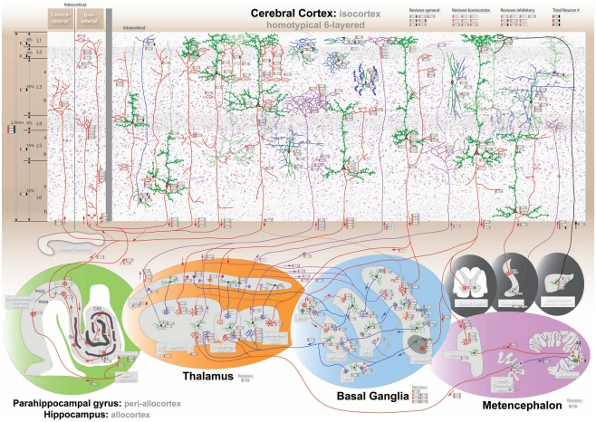
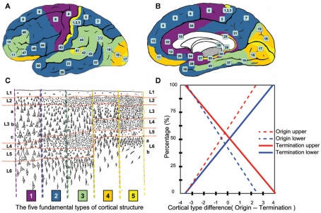
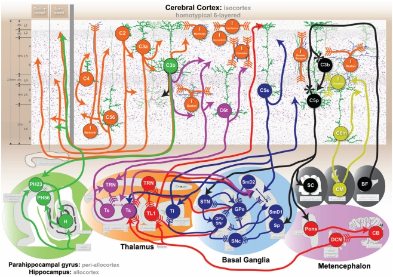
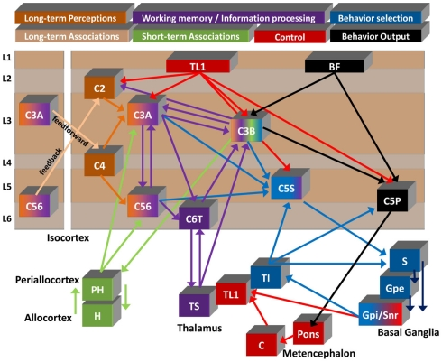
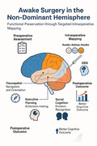
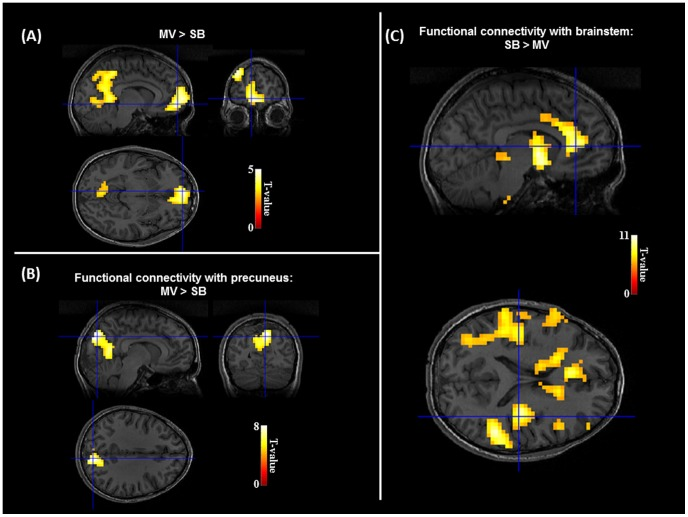
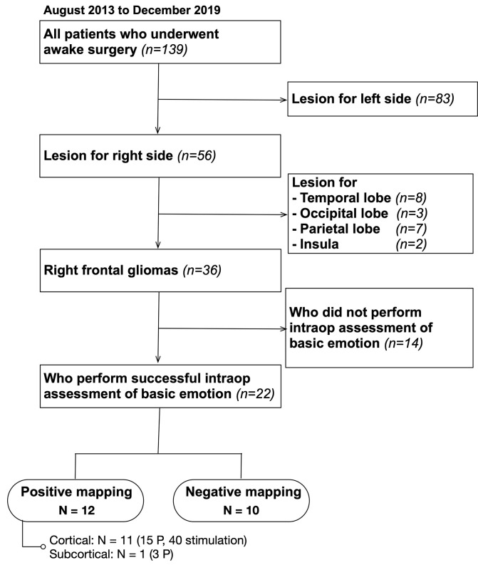
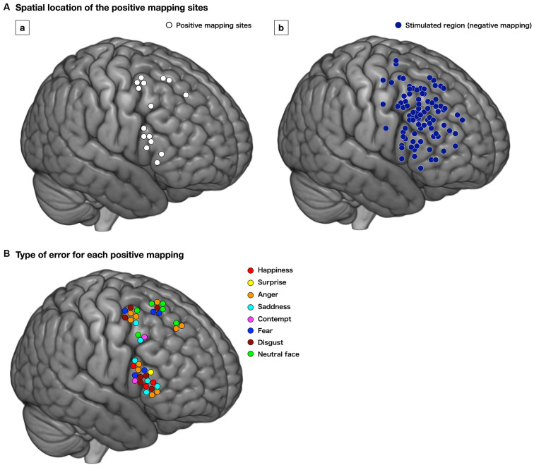
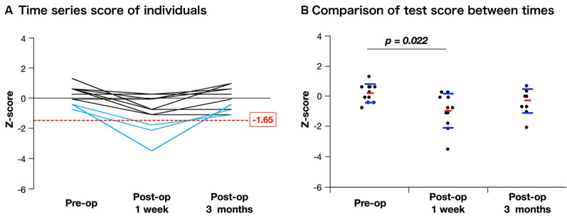
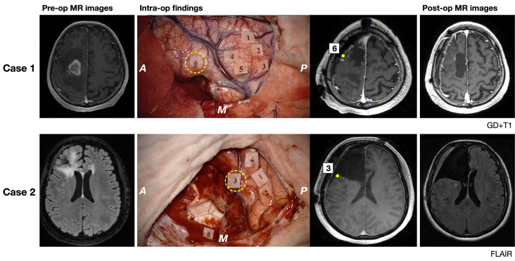

# Case Prep: Awake Craniotomy with Cortical/Subcortical Mapping

---

## One-Liner
[Age]yo [M/F] with a [left/right] [location] lesion involving/adjacent to [eloquent language/motor cortex] planned for awake craniotomy with intraoperative brain mapping for maximal safe resection.

---

## Figures, Imaging & Video

**🎥 Operative video** — [search operative video on YouTube ▸](https://www.youtube.com/results?search_query=awake+craniotomy+surgery) · [The Neurosurgical Atlas ▸](https://www.neurosurgicalatlas.com)

[Neurosurgical Atlas](https://www.neurosurgicalatlas.com) · [Radiopaedia](https://radiopaedia.org/search?q=awake%20craniotomy&scope=all) · [PubMed Central](https://www.ncbi.nlm.nih.gov/pmc/?term=awake+craniotomy+cortical+mapping) — operative figures © linked; see [media-sources.md](../../resources/media-sources.md)

---

<!-- BEGIN TEXTBOOK CROSS-CHECKS -->

## Textbook Cross-Checks

- **Functional/pediatric anatomy:** Youmans and Winn; Schmidek and Sweet; Greenberg — confirm targets, trajectories, cranial nerve/brainstem/tract relationships, and age-specific anatomy.
- **Technique sequence:** Schmidek and Sweet; Youmans and Winn — review positioning, monitoring/mapping, exposure or stereotactic workflow, and closure/device management.
- **Complication rescue:** Greenberg; specialty literature — summarize neurologic, CSF, hemorrhagic, infectious, airway/swallowing, and hardware-related contingencies in original language.
- **Copyright-safe use:** cite these sources as private cross-checks, then write the guide content in original words; do not re-host textbook pages, figures, tables, or board-review card material. See [Source Crosswalk & Copyright-Safe Use](../../resources/source-crosswalk.md).

<!-- END TEXTBOOK CROSS-CHECKS -->

<!-- BEGIN CURATED LITERATURE -->

## High-Yield Literature

- **Awake surgery with cortical-subcortical mapping in diffuse gliomas adjacent to central lobe. Report of two cases and literature review** — Núñez-Velasco S. Cirugia y cirujanos 2019. [PubMed](https://pubmed.ncbi.nlm.nih.gov/31264990/)
- **A Review of Cortical and Subcortical Stimulation Mapping for Language** — Young JS. Neurosurgery 2021. [PubMed](https://pubmed.ncbi.nlm.nih.gov/33444451/)
- **Awake brain mapping of cortex and subcortical pathways in brain tumor surgery** — Freyschlag CF. Journal of neurosurgical sciences 2014. [PubMed](https://pubmed.ncbi.nlm.nih.gov/25418274/)
- **White matter tracts and executive functions: a review of causal and correlation evidence** — Ribeiro M. Brain : a journal of neurology 2024. [PubMed](https://pubmed.ncbi.nlm.nih.gov/37703295/)
- **Awake brain mapping by direct cortical stimulation; technical note to get higher resection rate and low morbidity in low-grade glioma patients** — Ahmed Khan R. Annals of medicine and surgery (2012) 2024. [PubMed](https://pubmed.ncbi.nlm.nih.gov/38576956/)
- **Awake Craniotomy with Cortical and Subcortical Speech Mapping for Supramarginal Cavernoma Resection** — Domingo RA. World neurosurgery 2020. [PubMed](https://pubmed.ncbi.nlm.nih.gov/32585378/)
- **[Awake neurosurgery: usefullness of intraoperative cortical and subcortical functional mapping]** — Mikuni N. No shinkei geka. Neurological surgery 2004. [PubMed](https://pubmed.ncbi.nlm.nih.gov/15570875/)
- **Surgery for gliomas** — Tate MC. Cancer treatment and research 2015. [PubMed](https://pubmed.ncbi.nlm.nih.gov/25468224/)
- **Functional cortical mapping and structural subcortical anatomy predicts intra-operative speech arrest: a nTMS-tractography study** — Jung J. Clinical neurophysiology : official journal of the International Federation of Clinical Neurophysiology 2025. [PubMed](https://pubmed.ncbi.nlm.nih.gov/40902377/)
- **Intraoperative augmented reality fiber tractography complements cortical and subcortical mapping** — Chidambaram S. World neurosurgery: X 2023. [PubMed](https://pubmed.ncbi.nlm.nih.gov/37456694/)

<!-- END CURATED LITERATURE -->

---

<!-- BEGIN CURATED IMAGE SET -->

## Curated Image Set

Open-access figures are embedded from PubMed Central articles and kept unique to this guide.

*Figure 1. The comprehensive neuroanatomical picture formed by synthesizing hundreds of original neuroanatomical studies into the homotypical blueprint underlying cognition. The interactive... Source: [Cognitive Consilience: Primate Non-Primary Neuroanatomical Circuits Underlying Cognition](https://pmc.ncbi.nlm.nih.gov/articles/PMC3243081/) — Frontiers in Neuroanatomy 2011; CC BY-NC.*

*Figure 3. Prediction of human laminar corticocortical projections. Synthesis of von Economo cortical laminar types and homotypical laminar corticocortical projections in the monkey. Lateral (A)... Source: [Cognitive Consilience: Primate Non-Primary Neuroanatomical Circuits Underlying Cognition](https://pmc.ncbi.nlm.nih.gov/articles/PMC3243081/) — Frontiers in Neuroanatomy 2011; CC BY-NC.*

*Figure 4. Cognitive circuits as shown at http://www.frontiersin.org/files/cognitiveconsilience/index.html. Circuits from left to right. Orange: consolidated declarative long-term memory. Green:... Source: [Cognitive Consilience: Primate Non-Primary Neuroanatomical Circuits Underlying Cognition](https://pmc.ncbi.nlm.nih.gov/articles/PMC3243081/) — Frontiers in Neuroanatomy 2011; CC BY-NC.*

*Figure 5. Summary diagram of proposed flow of cognitive information. Seven of the circuits described in the text are shown to illustrate a summarized functional viewpoint of the hypothesized flow... Source: [Cognitive Consilience: Primate Non-Primary Neuroanatomical Circuits Underlying Cognition](https://pmc.ncbi.nlm.nih.gov/articles/PMC3243081/) — Frontiers in Neuroanatomy 2011; CC BY-NC.*

*Figure 5. Source: [Cognitive Profiles and Determinants of Eligibility for Awake Surgery in Non‐Dominant Hemisphere Gliomas: A Narrative Review](https://pmc.ncbi.nlm.nih.gov/articles/PMC12123447/) — Brain Behav. 2025 May 30;15(6):e70604. doi: 10.1002/brb3.70604; CC BY.*

*Figure 2. Restoration of DMN under mechanical ventilation.(A). Comparison of BOLD signal between MV and SB revealed a specific increase of activation in the default-mode network associated in... Source: [The Cerebral Cost of Breathing: An fMRI Case-Study in Congenital Central Hypoventilation Syndrome](https://pmc.ncbi.nlm.nih.gov/articles/PMC4182437/) — PLoS ONE 2014; CC0.*

*Figure 1. Inclusion criteria. A total of 139 patients who underwent awake surgery in our institution were included; 36 of them matched our inclusion criteria. Of these, 22 patients underwent... Source: [Preserving Right Pre-motor and Posterior Prefrontal Cortices Contribute to Maintaining Overall Basic Emotion](https://pmc.ncbi.nlm.nih.gov/articles/PMC7920969/) — Frontiers in Human Neuroscience 2021; CC BY.*

*Figure 3. Distribution of the positive mapping sites (Aa, white circle) and regions with negative responses (Ab, dark blue circle) at the cortical level. Each positive mapping site is stimulated... Source: [Preserving Right Pre-motor and Posterior Prefrontal Cortices Contribute to Maintaining Overall Basic Emotion](https://pmc.ncbi.nlm.nih.gov/articles/PMC7920969/) — Frontiers in Human Neuroscience 2021; CC BY.*

*Figure 5. Time course of assessment for basic emotion in patients whose positive mappings were identified during awake surgery. The figure of time series of individuals (A) indicates that three... Source: [Preserving Right Pre-motor and Posterior Prefrontal Cortices Contribute to Maintaining Overall Basic Emotion](https://pmc.ncbi.nlm.nih.gov/articles/PMC7920969/) — Frontiers in Human Neuroscience 2021; CC BY.*

*Figure 6. Pre- and postoperative magnetic resonance (MR) images (gadolinium-enhanced T1 image for Case 1 and FLAIR image for Case 2) and intraoperative findings of illustrative two cases are... Source: [Preserving Right Pre-motor and Posterior Prefrontal Cortices Contribute to Maintaining Overall Basic Emotion](https://pmc.ncbi.nlm.nih.gov/articles/PMC7920969/) — Frontiers in Human Neuroscience 2021; CC BY.*

<!-- END CURATED IMAGE SET -->

---

## History of Present Illness
- Chief complaint: Lesion (glioma, metastasis, cavernoma, epileptogenic focus) in/near eloquent cortex
- Indication for awake: dominant-hemisphere language area, primary motor cortex, insula, or any eloquent-adjacent lesion where real-time functional feedback maximizes safe resection
- **Patient cooperation essential** — assess ability to tolerate awake phase (anxiety, claustrophobia, cognitive/language baseline, airway)
- Handedness/language dominance

---

## Imaging Review
### MRI + fMRI + DTI
- Lesion location relative to eloquent cortex (fMRI: language, motor)
- **DTI tractography:** corticospinal tract, arcuate fasciculus, IFOF, SLF
- Navigation planning

---

## Labs
- CBC, BMP, Coags, Type and screen

---

## Neurological Examination
- **Detailed baseline language** (fluency, naming, comprehension, repetition, reading), motor, cognition — establishes the testing baseline and tasks
- Pre-op session with neuropsychologist/speech therapist to rehearse intraoperative tasks

---

## Surgical Planning

### Diagnosis & Indication
- Goal: Maximal safe resection defined by **functional boundaries** (positive mapping sites), not just anatomic margins

### Anesthetic Technique
- **Asleep-Awake-Asleep (AAA)** or **Monitored Anesthesia Care (conscious sedation throughout)**
- **Scalp block** (regional anesthesia: supraorbital, supratrochlear, auriculotemporal, zygomaticotemporal, greater/lesser occipital nerves) — key to comfort

### Position
- Lateral or supine with head turned; **comfortable**, face visible/accessible to the mapping team; airway accessible; padded; not fully rigid feeling
- Mayfield (pin sites infiltrated with local)

### Key Surgical Steps
1. Asleep phase (if AAA): induce, LMA/airway, position, scalp block, craniotomy
2. Open dura (infiltrate dura/middle meningeal with local — dura is pain-sensitive)
3. **Awaken patient**, remove airway, confirm comfort and task performance
4. **Cortical mapping** (bipolar stimulator, e.g., 50-60 Hz, escalating mA; or high-frequency):
   - **Motor:** stimulation → contralateral movement (or interrupts movement)
   - **Language:** patient counts/names/reads while stimulating → **speech arrest, anomia, paraphasia, dysarthria** mark eloquent sites
   - Tag positive sites; **ECoG** to detect afterdischarges/stimulation-induced seizures
5. **Resection** within functional boundaries, with **continuous subcortical mapping** and ongoing language/motor testing
   - Stop at positive subcortical tracts (corticospinal → motor response; arcuate/IFOF → language errors)
6. Monitor patient continuously; resect to functional (not just anatomic) limits
7. [Re-sedate for closure if AAA]; hemostasis, closure

### Critical Anatomy & Structures at Risk
1. **Language network** — Broca, Wernicke, arcuate fasciculus, IFOF, SLF
2. **Motor cortex / corticospinal tract**
3. **Vasculature** (MCA branches), draining veins

### Equipment
- Microscope, navigation (fMRI/DTI), CUSA, ultrasound, 5-ALA (HGG)
- **Cortical/subcortical bipolar stimulator**, ECoG, sterile mapping tags
- Mapping team (neuropsychologist/SLP), task materials (naming cards, screen)

### Monitoring
- Direct cortical & subcortical stimulation, continuous clinical testing, ECoG

### Anesthesia
- **Scalp block**, dexmedetomidine ± propofol/remifentanil (titratable, awake on demand), antiemetics (ondansetron), Foley
- Seizure management plan: **iced saline** to cortex, low-dose propofol/midazolam, antiepileptics
- Airway backup plan (LMA/intubation if needed); avoid oversedation/respiratory depression during awake phase

### Potential Complications
1. **Intraoperative seizure** (stimulation-induced) — cold saline, benzodiazepine/propofol
2. New/worsened language or motor deficit (often transient if functional boundaries respected)
3. Patient intolerance/agitation, airway compromise, nausea/vomiting (aspiration risk)
4. Brain swelling, venous air embolism (semi-sitting), hemorrhage

---

## Operative Note Template
**Preoperative Diagnosis:** [Left/Right] [location] lesion involving/adjacent to eloquent [language/motor] cortex

**Postoperative Diagnosis:** Same (pending pathology)

**Procedure:** [Left/Right] awake craniotomy with cortical and subcortical mapping for resection of [lesion]

**Surgeon / Assistant:** + neuropsychologist/SLP for mapping
**Anesthesia:** Asleep-awake-asleep [/ MAC] with scalp block
**EBL / Fluids:**
**Adjuncts:** Neuronavigation (fMRI/DTI), cortical/subcortical bipolar stimulator, ECoG, ultrasound, [5-ALA]
**Complications:** None

**Indications:** [Age]yo [M/F] with a [lesion] in/near eloquent cortex; awake mapping was chosen to maximize safe resection by functional boundaries. The patient was assessed as able to tolerate the awake phase. Risks (seizure, deficit, intolerance) discussed.

**Description of Procedure:** After consent and time-out, [the asleep phase was induced with an airway, and] a **scalp block** placed; the craniotomy was performed and the dura opened (infiltrated with local). **The patient was awakened** and confirmed comfortable and performing tasks. **Cortical mapping** with the bipolar stimulator identified [language/motor] sites (speech arrest/anomia/motor response), tagged as positive, with ECoG monitoring for afterdischarges.

The lesion was resected within the functional boundaries with **continuous subcortical mapping** and ongoing testing, stopping at positive subcortical tracts ([corticospinal/arcuate/IFOF]). [Iced saline managed a stimulation-induced seizure.] The patient remained neurologically [intact/at functional baseline] throughout. [The patient was re-sedated for closure.]

Hemostasis was obtained and closure performed. The patient was transferred to the ICU; neuro checks were compared to the detailed baseline.

---

## Postoperative Plan
- ICU, neuro checks q1h — **compare to detailed baseline** (language, motor)
- MRI < 48h (EOR), CT if concern
- Expect possible transient deficit (e.g., SMA syndrome, transient aphasia) with recovery; speech/PT/OT
- Steroid taper, AEDs, DVT prophylaxis
- Pathology/molecular; tumor board; rehab referral
