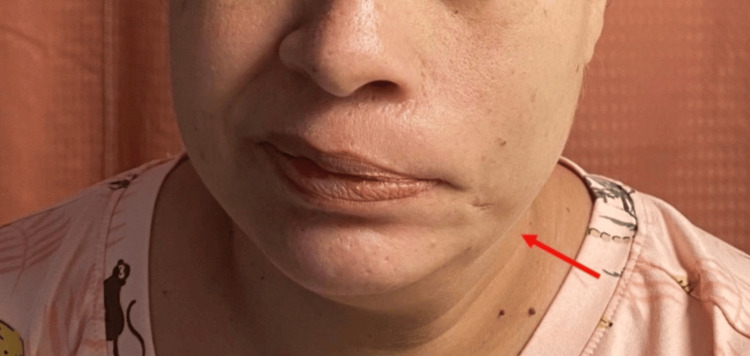
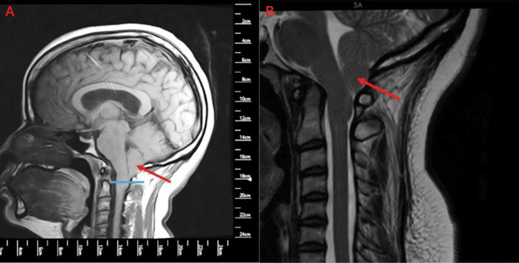
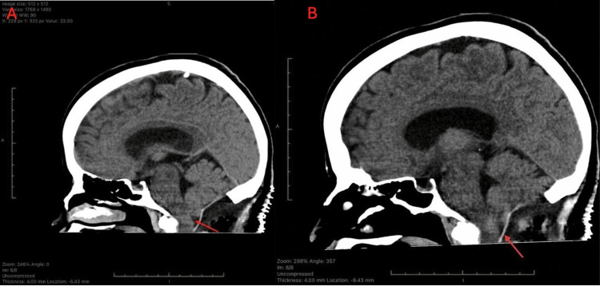
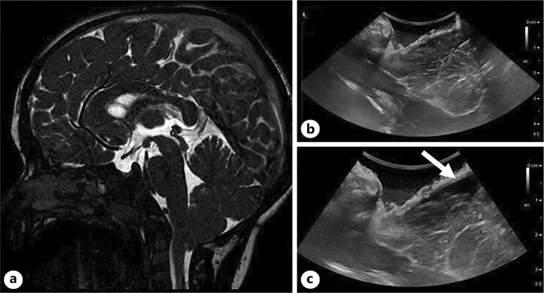
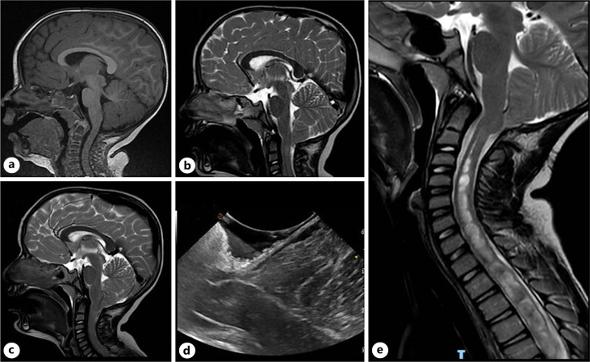
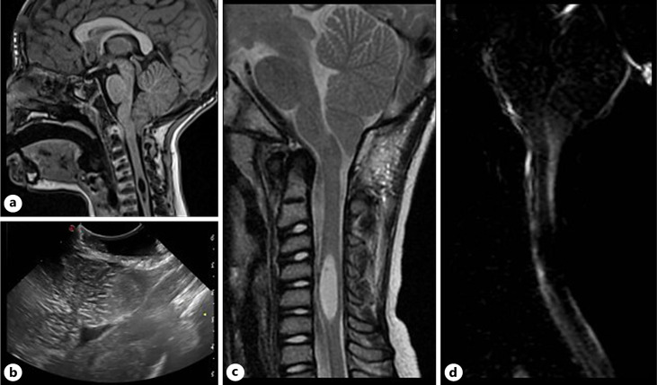
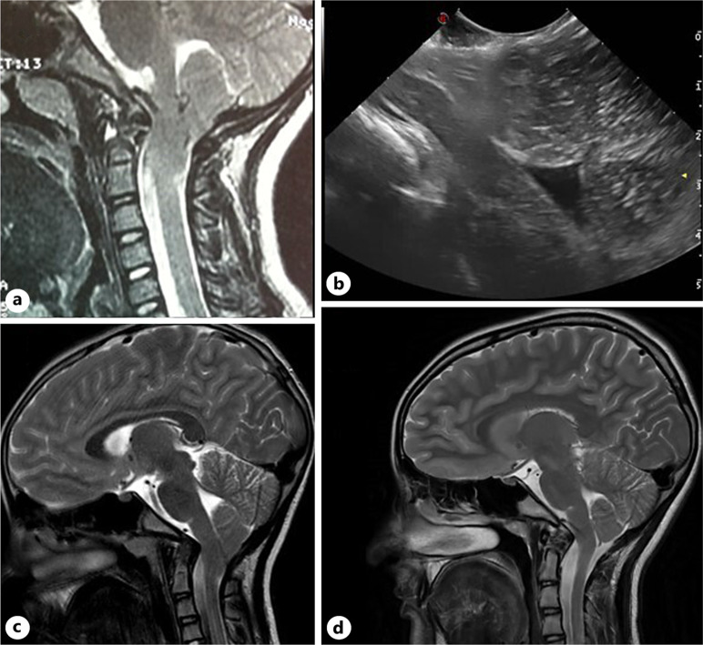
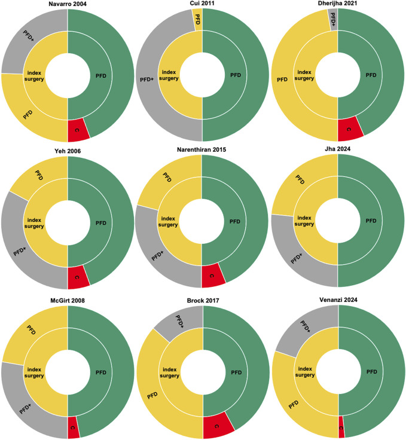
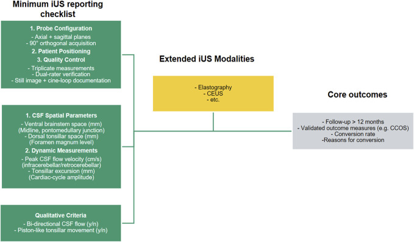
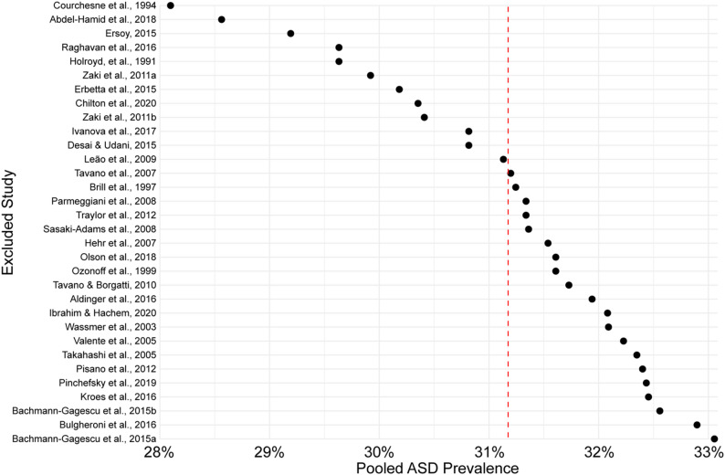

# Case Prep: Chiari I Malformation Decompression

---

<!-- BEGIN CASE SNAPSHOT -->

## Case / Approach Snapshot

- **Anatomy at risk:** target nuclei or cortical regions, trajectories, vessels, ventricles, cranial nerves, white-matter tracts, and stimulation/lesion side-effect pathways.
- **Operative steps:** confirm diagnosis and target, plan trajectory or exposure, use mapping/monitoring/stereotaxy as appropriate, place/lesion/resect with physiologic confirmation, close hardware or wound, and plan programming/follow-up; use the detailed operative sequence and approach notes below as the step-by-step source.
- **Rescue plans:** hemorrhage, seizure, neurologic or mood/cognitive change, lead/device migration or infection, stimulation side effects, hardware failure, and revision or programming strategy.
- **Figures:** review [Figures, Imaging & Video](#figures-imaging--video) and the [Curated Image Set](#curated-image-set); embedded local figures should remain open-access, public-domain, or otherwise reusable with attribution.
- **Papers:** review [High-Yield Literature](#high-yield-literature) for seminal sources, modern reviews, and outcome data specific to this page.
- **Textbook cross-checks:** use [Textbook Cross-Checks](#textbook-cross-checks) and the [Source Crosswalk](../../resources/source-crosswalk.md) to cite copyrighted textbooks/atlases while summarizing in original words.

<!-- END CASE SNAPSHOT -->

## One-Liner
[Age]yo [M/F] with Chiari I malformation ([___ mm tonsillar descent]) [with/without syrinx] presenting with [suboccipital headaches/numbness/weakness/dysphagia] planned for suboccipital craniectomy and C1 laminectomy [with/without duraplasty] for posterior fossa decompression.

---

## Figures, Imaging & Video

**🎥 Operative video** — [search operative video on YouTube ▸](https://www.youtube.com/results?search_query=chiari+i+malformation+surgery) · [The Neurosurgical Atlas ▸](https://www.neurosurgicalatlas.com)

> 🧭 **Operative approach:** [Midline suboccipital craniotomy](../approaches/midline-suboccipital-craniotomy.md) — detailed corridor setup, step-by-step technique & figures

[Neurosurgical Atlas](https://www.neurosurgicalatlas.com) · [Radiopaedia](https://radiopaedia.org/search?q=chiari%20i%20malformation&scope=all) · [PubMed Central](https://www.ncbi.nlm.nih.gov/pmc/?term=chiari+decompression+duraplasty) — operative figures © linked; see [media-sources.md](../../resources/media-sources.md)

---

<!-- BEGIN TEXTBOOK CROSS-CHECKS -->

## Textbook Cross-Checks

- **Functional/pediatric anatomy:** Youmans and Winn; Schmidek and Sweet; Greenberg — confirm targets, trajectories, cranial nerve/brainstem/tract relationships, and age-specific anatomy.
- **Technique sequence:** Schmidek and Sweet; Youmans and Winn — review positioning, monitoring/mapping, exposure or stereotactic workflow, and closure/device management.
- **Complication rescue:** Greenberg; specialty literature — summarize neurologic, CSF, hemorrhagic, infectious, airway/swallowing, and hardware-related contingencies in original language.
- **Copyright-safe use:** cite these sources as private cross-checks, then write the guide content in original words; do not re-host textbook pages, figures, tables, or board-review card material. See [Source Crosswalk & Copyright-Safe Use](../../resources/source-crosswalk.md).

<!-- END TEXTBOOK CROSS-CHECKS -->

<!-- BEGIN CURATED LITERATURE -->

## High-Yield Literature

- **The Chiari I malformation** — McClugage SG. Journal of neurosurgery. Pediatrics 2019. [PubMed](https://pubmed.ncbi.nlm.nih.gov/31473667/)
- **Chiari I malformation in children-the natural history** — Chatrath A. Child's nervous system : ChNS : official journal of the International Society for Pediatric Neurosurgery 2019. [PubMed](https://pubmed.ncbi.nlm.nih.gov/31363830/)
- **Chiari I malformation in patients with RASopathies** — Han Y. Child's nervous system : ChNS : official journal of the International Society for Pediatric Neurosurgery 2021. [PubMed](https://pubmed.ncbi.nlm.nih.gov/33409618/)
- **Sociodemographics of Chiari I Malformation** — Abbas Akbari SH. Neurosurgery clinics of North America 2023. [PubMed](https://pubmed.ncbi.nlm.nih.gov/36424058/)
- **Imaging in Chiari I Malformation** — Pindrik J. Neurosurgery clinics of North America 2023. [PubMed](https://pubmed.ncbi.nlm.nih.gov/36424066/)
- **Epidemiology of Chiari I Malformation and Syringomyelia** — Holste KG. Neurosurgery clinics of North America 2023. [PubMed](https://pubmed.ncbi.nlm.nih.gov/36424068/)
- **The Chiari-I malformation** — Sclafani AP. Ear, nose, & throat journal 1991. [PubMed](https://pubmed.ncbi.nlm.nih.gov/1874153/)
- **Arachnoiditis and Chiari I malformation** — Demetriades AK. Acta neurochirurgica 2021. [PubMed](https://pubmed.ncbi.nlm.nih.gov/32948891/)
- **Elucidating the Genetic Basis of Chiari I Malformation** — Haller G. Neurosurgery clinics of North America 2023. [PubMed](https://pubmed.ncbi.nlm.nih.gov/36424064/)
- **Spine Deformity Associated with Chiari I Malformation and Syringomyelia** — Das S. Neurosurgery clinics of North America 2023. [PubMed](https://pubmed.ncbi.nlm.nih.gov/36424055/)

<!-- END CURATED LITERATURE -->

---

<!-- BEGIN CURATED IMAGE SET -->

## Curated Image Set

Open-access figures are embedded from PubMed Central articles and kept unique to this guide.

*Figure 1. Frontal photograph of left House-Brackmann grade III facial palsy.Smile reveals left oral commissure deviation with blunted excursion and effaced nasolabial fold, consistent with... Source: [Non-syndromic Developmental Facial Palsy Co-occurring With Chiari I Malformation: Parallel Manifestations of a Shared Prenatal Disturbance?](https://pmc.ncbi.nlm.nih.gov/articles/PMC13265094/) — Cureus 2026; CC BY.*

*Figure 2. Pre-operative sagittal T1-weighted MRIA. 12-mm cerebellar tonsillar ectopia below McRae line (red arrow, blue line). B. Craniocervical junction crowding with obliterated cerebrospinal... Source: [Non-syndromic Developmental Facial Palsy Co-occurring With Chiari I Malformation: Parallel Manifestations of a Shared Prenatal Disturbance?](https://pmc.ncbi.nlm.nih.gov/articles/PMC13265094/) — Cureus 2026; CC BY.*

*Figure 3. Post-operative sagittal head computed tomography (CT) following posterior fossa decompression and duraplasty.A. Demonstrates suboccipital craniectomy with bony decompression and expanded... Source: [Non-syndromic Developmental Facial Palsy Co-occurring With Chiari I Malformation: Parallel Manifestations of a Shared Prenatal Disturbance?](https://pmc.ncbi.nlm.nih.gov/articles/PMC13265094/) — Cureus 2026; CC BY.*

*Fig. 2.. Sagittal MR showing CMI in a 3-year-old boy who complained of typical nuchal headache (a). IOUS after bony decompression (b) and after scoring of the posterior atlanto-occipital membrane... Source: [Tailoring the Surgical Approach to Chiari I Malformation with Intraoperative Ultrasounds: Advantages, Limitations, and Controversies](https://pmc.ncbi.nlm.nih.gov/articles/PMC13245948/) — Pediatric Neurosurgery 2025; CC BY-NC.*

*Fig. 3.. a MRI at 2 years of age showing normal findings. MRI at 5 years of age (b) showing asymptomatic tonsillar ectopia that evolved to symptomatic CMI at 9 years of age (c). Despite adequate... Source: [Tailoring the Surgical Approach to Chiari I Malformation with Intraoperative Ultrasounds: Advantages, Limitations, and Controversies](https://pmc.ncbi.nlm.nih.gov/articles/PMC13245948/) — Pediatric Neurosurgery 2025; CC BY-NC.*

*Fig. 4.. Sagittal MR showing CMI with cervical syringomyelia (a) in a 4-year-old boy who received bony decompression based on IOUS findings (b). Postoperative MR confirmed adequate decompression... Source: [Tailoring the Surgical Approach to Chiari I Malformation with Intraoperative Ultrasounds: Advantages, Limitations, and Controversies](https://pmc.ncbi.nlm.nih.gov/articles/PMC13245948/) — Pediatric Neurosurgery 2025; CC BY-NC.*

*Fig. 5.. Sagittal MR showing symptomatic complex Chiari in an 8-year-old girl (a) who received bony decompression based on IOUS findings (b). c Radiological outcome on postoperative MR was... Source: [Tailoring the Surgical Approach to Chiari I Malformation with Intraoperative Ultrasounds: Advantages, Limitations, and Controversies](https://pmc.ncbi.nlm.nih.gov/articles/PMC13245948/) — Pediatric Neurosurgery 2025; CC BY-NC.*

*FIGURE 2.. Sunburst graph for each study. Left half shows the PFD (yellow) and PFD+ (gray) rates of index surgeries. Right half illustrates the proportion of successful PFD (green) and the... Source: [Intraoperative Ultrasound in Chiari 1 Decompression: Clarity or Confusion? A Systematic Review](https://pmc.ncbi.nlm.nih.gov/articles/PMC13236052/) — Neurosurgery 2026; CC BY.*

*FIGURE 3.. Proposed reporting framework for iUS studies, highlighting a minimum reporting checklist (green), possible emerging techniques (yellow), and relevant outcome measures (grey). Specific... Source: [Intraoperative Ultrasound in Chiari 1 Decompression: Clarity or Confusion? A Systematic Review](https://pmc.ncbi.nlm.nih.gov/articles/PMC13236052/) — Neurosurgery 2026; CC BY.*

*Fig. 5. Leave-one-out sensitivity analysis. After removing one study at a time and calculating the pooled prevalence through a random effects model, we found that no single study exerted a... Source: [The prevalence of autism in cerebellar malformations: a systematic review and meta-analysis](https://pmc.ncbi.nlm.nih.gov/articles/PMC13224601/) — Journal of Neurodevelopmental Disorders 2026; CC BY.*

<!-- END CURATED IMAGE SET -->

---

## History of Present Illness
- Chief complaint: Occipital/suboccipital headaches (worse with Valsalva/cough/strain), numbness, weakness
- Duration and progression:
- **Symptoms:**
  - Headaches: Suboccipital, exacerbated by Valsalva, cough, straining (classic)
  - Numbness: Cape-like distribution (shoulders/arms) if syrinx
  - Weakness: Hand weakness if syrinx (central cord pattern)
  - Dysphagia: Brainstem compression
  - Sleep apnea: Central type from brainstem compression
  - Ataxia/balance difficulty
  - Nystagmus (downbeat nystagmus classic)
- **Syrinx symptoms:** Dissociated sensory loss (loss of pain/temp, preserved light touch), hand weakness/atrophy, scoliosis (in children)

---

## Past Medical History
- Connective tissue disorders (Ehlers-Danlos — associated with Chiari, craniocervical instability)
- Craniocervical instability (must rule out BEFORE decompression alone)
- Scoliosis (may be syrinx-related in children)
- Sleep apnea (central type)
- Tethered cord (associated in some patients)
- Allergies:
- Medications:

---

## Imaging Review
### MRI Brain/Cervical Spine
- **Tonsillar descent:** ___ mm below foramen magnum (McRae line)
  - ≥ 5 mm = Chiari I malformation
  - 3-5 mm = borderline (correlate with symptoms)
- **Tonsillar morphology:** Peg-shaped (pathologic) vs round (normal variant)
- **Crowding at foramen magnum:** CSF space obliteration around tonsils and brainstem
- **Syringomyelia:** Present/absent; location, extent, size
- **Brainstem compression:** Ventral compression, medullary kinking
- **Fourth ventricle:** Position, patency
- **Hydrocephalus:** Present/absent (must rule out as cause of tonsillar herniation)
- **Other Chiari features:** Basilar invagination, retroflexed odontoid, small posterior fossa
- **CSF flow study (cine MRI):** Absent or reduced CSF flow at foramen magnum (supports surgical indication)

### CT Cervical Spine/Craniocervical Junction
- Bony anatomy of craniocervical junction
- **Rule out:**
  - Basilar invagination (odontoid tip above Chamberlain line)
  - Atlantoaxial instability
  - Os odontoideum
  - Occipitalization of atlas
- If bony abnormality: May need OCF (occipitocervical fusion) rather than simple decompression

### Flexion/Extension X-rays
- **Rule out craniocervical instability** — especially if EDS or prior decompression failed
- ADI (atlantodental interval) > 3 mm = instability

---

## Labs
- CBC, BMP, Coags
- Type and screen
- If EDS suspected: Genetics referral

---

## Neurological Examination
### Motor
- Hand intrinsics (syrinx — central cord pattern)
- Upper and lower extremity strength
- Spasticity/hyperreflexia (if myelopathy from syrinx)

### Sensory
- Cape-like dissociated sensory loss (pain/temp lost, light touch preserved — syrinx)
- Posterior column function (vibration, proprioception)

### Cranial Nerves
- Nystagmus: Downbeat (classic Chiari)
- Dysphagia: CN IX, X
- Tongue: CN XII (if brainstem compression)
- Lower cranial nerves: Palate, voice, shoulder shrug

### Cerebellar
- Gait, tandem walk, coordination, Romberg

---

## Surgical Planning

### Diagnosis & Indication
- Working diagnosis: Symptomatic Chiari I malformation [with/without syrinx]
- Surgical indication: Symptomatic Chiari with imaging evidence of crowding at foramen magnum and/or reduced CSF flow on cine MRI; progressive syrinx
- Goals: Restore CSF flow at the foramen magnum; decompress the posterior fossa; syrinx should stabilize or improve over months
- **NOT indicated for:** Incidental Chiari without symptoms; headaches that do not fit Chiari pattern

### Surgical Options
1. **Bone-only decompression:** Suboccipital craniectomy + C1 laminectomy + scoring/release of outer dural layer — simpler, lower CSF leak risk, may be sufficient
2. **Decompression with duraplasty:** Full dural opening with expansile duraplasty — more definitive CSF flow restoration, higher risk of CSF leak
3. **With tonsillar reduction:** Shrinkage/coagulation of tonsil tips — rarely needed
4. **Occipitocervical fusion:** If instability present — different procedure entirely

### Position
- **Patient position:** Prone (most common) or Concorde (sitting-like but prone, head elevated)
- **Head:** Flexed (chin toward chest) to open the foramen magnum; Mayfield skull clamp
- **Table:** Slight reverse Trendelenburg
- **Arms:** Tucked at sides
- **Key:** Avoid excessive flexion (can worsen brainstem compression before decompression)
- **Tape shoulders caudally** (improve visualization)

### Incision
- **Midline posterior incision** from just below the inion to the C2 spinous process
- Length: ~6-8 cm

### Key Surgical Steps
1. **Midline incision** from below inion to C2 spinous process
2. **Subperiosteal dissection** of suboccipital muscles from occiput and C1 posterior arch
   - Stay strictly midline to minimize bleeding (avascular midline raphe)
   - Identify and preserve the C2 nerve root and vertebral arteries (V3 segment runs on superior surface of C1 arch)
3. **Suboccipital craniectomy:**
   - Remove bone from foramen magnum upward (2.5-3 cm x 3 cm)
   - Center on midline, extend laterally to the edges of the foramen magnum
   - Use Kerrison rongeurs or drill
4. **C1 laminectomy:**
   - Remove the posterior arch of C1
   - **Vertebral arteries run on the SUPERIOR surface of C1 arch** — stay ON the posterior arch, within 1.5 cm of midline
   - DO NOT extend laterally beyond 1.5 cm from midline (VA at risk)
5. **Assess dura:**
   - If bone-only decompression: Score/release the outer dural layer and stop
   - If duraplasty planned: Continue
6. **Dural opening (if duraplasty):**
   - Y-shaped or cruciate dural incision
   - Carefully open — tonsils may be adherent to dura
   - Open arachnoid membranes at foramen magnum
   - Release arachnoid adhesions between tonsils and brainstem
7. **Inspect foramen magnum:**
   - Confirm CSF flow around the tonsils
   - Release any obstructing arachnoid bands
   - Tonsillar reduction: Subpial coagulation of tonsillar tips (if tonsils still block foramen — rarely needed)
   - Confirm obex is visible (fourth ventricle outlet)
8. **Duraplasty:**
   - Sew in a dural graft to expand the posterior fossa dural space
   - Graft options: Autologous pericranium, bovine pericardium, DuraGen, Gore-Tex
   - Watertight closure is CRITICAL (CSF leak is the most common complication)
   - Running or interrupted 4-0 or 5-0 braided suture
9. **Dural sealant:** Apply (DuraSeal, fibrin glue) over the suture line
10. **Closure:**
    - Muscle closure in layers (watertight muscle closure helps prevent CSF leak)
    - Fascial closure
    - Subcutaneous
    - Skin

### Critical Anatomy & Structures at Risk
1. **Vertebral arteries (V3 segment)** — run on the SUPERIOR surface of C1 posterior arch, within the sulcus arteriosus; injury during C1 laminectomy is catastrophic; stay within 1.5 cm of midline
2. **Cerebellar tonsils** — compressed against foramen magnum; handle gently
3. **PICA (posterior inferior cerebellar artery)** — loops around the tonsils; identify and preserve during dural opening
4. **Brainstem (medulla)** — directly deep to the tonsils
5. **C2 nerve root / ganglion** — may need to be retracted for C1 arch exposure
6. **Cervical spinal cord** — deep to C1 arch during laminectomy
7. **Fourth ventricle / obex** — visible after tonsillar separation; avoid manipulation

### Equipment
- Operating microscope or loupes + headlight
- High-speed drill (for craniectomy)
- Kerrison rongeurs
- Ultrasound (intraoperative — can confirm tonsillar position and CSF flow before and after decompression)
- Dural graft material (pericranium, bovine pericardium, DuraGen)
- Dural sealant (DuraSeal, fibrin glue)
- Microsurgical instruments (for arachnoid dissection)
- Bipolar (for tonsillar reduction if needed)

### Monitoring
- SSEPs
- MEPs
- Standard ASA monitors

### Anesthesia
- General endotracheal anesthesia
- Arterial line (optional for straightforward cases)
- Foley
- Cefazolin 2g IV
- Dexamethasone 10 mg IV
- No paralytic (if MEP monitoring)
- **Caution with positioning:** Avoid excessive neck flexion — can worsen brainstem compression before decompression

### Potential Complications
1. **CSF leak / pseudomeningocele** — most common complication; meticulous dural closure + sealant; if post-op leak → wound revision or lumbar drain
2. **Infection / meningitis** — aseptic meningitis (from blood in CSF) vs bacterial
3. **Vertebral artery injury** — during C1 laminectomy; stay near midline (< 1.5 cm lateral)
4. **Cerebellar/brainstem injury** — gentle handling of tonsils, careful dural opening
5. **Recurrence of symptoms** — inadequate decompression, scarring, or craniocervical instability unmasked
6. **Worsened symptoms** — rare; from manipulation of brainstem/tonsils or destabilizing craniocervical junction
7. **Craniocervical instability** — excessive bone removal can destabilize; do not remove C2 arch or occipital condyles

---

## Postoperative Plan
- Floor or step-down (ICU if significant brainstem compression pre-op)
- Neuro checks q2h x 24h
- HOB 30 degrees (unless duraplasty CSF leak concern → may need flat bed rest initially)
- CT head/neck within 24 hours (confirm adequate decompression, rule out hematoma)
- MRI at 3-6 months: Assess tonsillar position, CSF flow restoration, syrinx resolution/improvement
- Pain management: Posterior cervical/occipital muscle pain is significant; acetaminophen, NSAIDs, muscle relaxants, limited opioids
- Diet: Start clear liquids, advance as tolerated (monitor swallowing if pre-op dysphagia)
- Cervical collar: Soft collar for comfort x 2-4 weeks (optional)
- Activity: No heavy lifting x 6 weeks
- DVT prophylaxis: SCDs, heparin SQ POD1
- Wound monitoring: CSF leak (clear fluid from incision, positional headache, pseudomeningocele)
- Follow-up: 2-4 weeks clinic; MRI at 3-6 months and 1 year
- Syrinx: Expect gradual improvement over 6-12 months; stable syrinx may not resolve but shouldn't progress
- If symptoms recur or not improved: Reassess for instability, inadequate decompression, tethered cord
