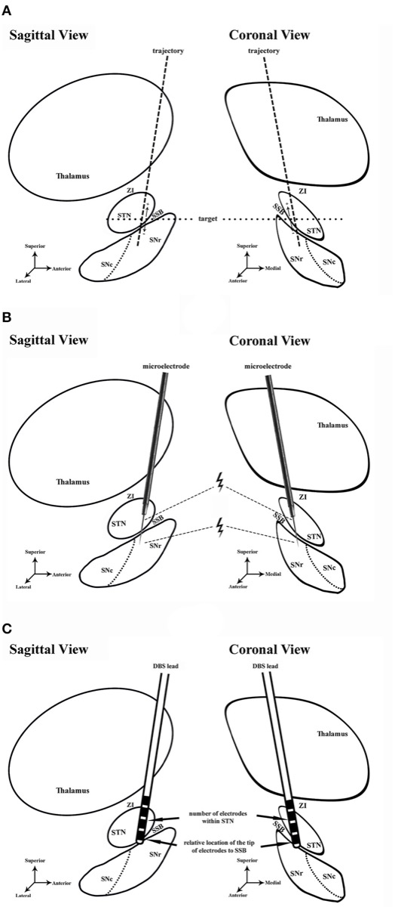
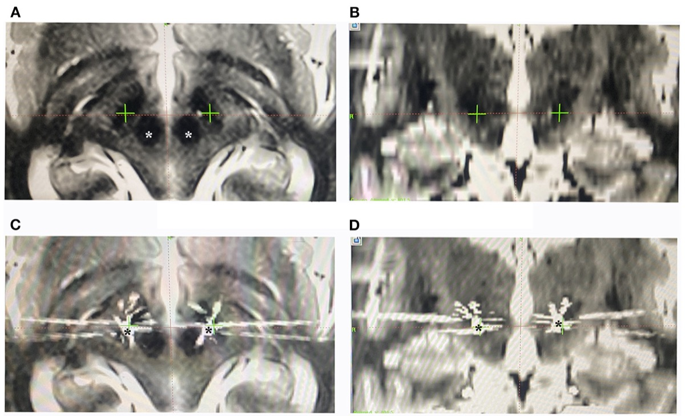
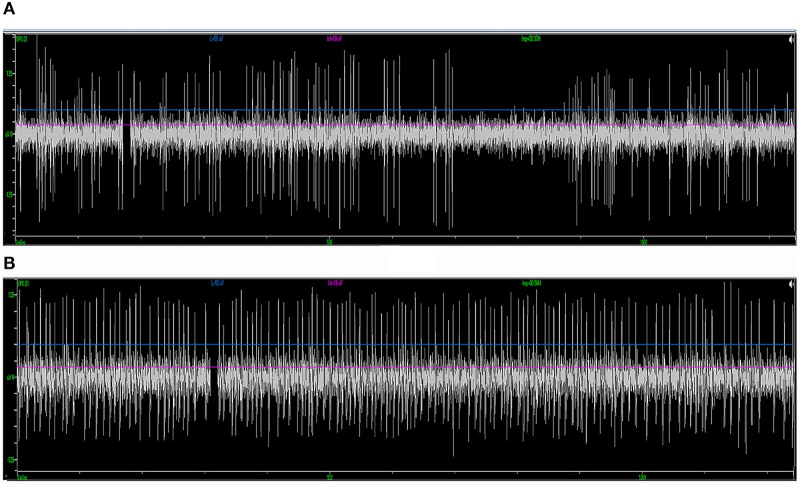

# Case Prep: Deep Brain Stimulation (DBS) Lead Placement

---

## One-Liner
[Age]yo [M/F] with [Parkinson disease / essential tremor / dystonia] planned for [bilateral/unilateral] DBS lead placement targeting [STN / GPi / VIM] [awake with MER / asleep under imaging guidance].

---

## Figures, Imaging & Video

**🎥 Operative video** — [search operative video on YouTube ▸](https://www.youtube.com/results?search_query=deep+brain+stimulation+surgery) · [The Neurosurgical Atlas ▸](https://www.neurosurgicalatlas.com)

**📑 Key evidence — landmark trials & guidelines**

- **DBS vs medical** — Deuschl G et al. *NEJM* 2006 — STN-DBS vs best medical therapy in PD. [🔗 PubMed](https://pubmed.ncbi.nlm.nih.gov/?term=Deuschl+deep+brain+stimulation+Parkinson+disease+2006+NEJM)
- **EARLYSTIM** — Schuepbach WMM et al. *NEJM* 2013 — DBS in earlier disease with motor complications. [🔗 PubMed](https://pubmed.ncbi.nlm.nih.gov/?term=Schuepbach+EARLYSTIM+deep+brain+stimulation+Parkinson+2013+NEJM)
- **CSP-468** — Weaver FM et al. *JAMA* 2009 — DBS vs medical therapy, randomized. [🔗 PubMed](https://pubmed.ncbi.nlm.nih.gov/?term=Weaver+deep+brain+stimulation+Parkinson+randomized+2009+JAMA)
- **Guidelines:** [AAN guidelines](https://www.aan.com/practice/guidelines) · [CNS](https://www.cns.org/guidelines)

*Gray's Anatomy (1918), public domain — via Wikimedia Commons.*

*Workflow: planning → MER / microstimulation (ventral STN, dorsal SNr) → lead-placement assessment. Source: Shi et al., Front Neurol 2021;12:683532, Fig 1. CC BY 4.0.*

*Preoperative MRI targeting and postoperative CT/MRI-fusion verification of lead position. Source: Shi et al., Front Neurol 2021;12:683532, Fig 2. CC BY 4.0.*

*MER signatures distinguishing STN from SNr during trajectory mapping. Source: Shi et al., Front Neurol 2021;12:683532, Fig 4. CC BY 4.0.*

[Neurosurgical Atlas](https://www.neurosurgicalatlas.com) · [Radiopaedia](https://radiopaedia.org/search?q=deep%20brain%20stimulation&scope=all) · [PubMed Central](https://www.ncbi.nlm.nih.gov/pmc/?term=deep+brain+stimulation+STN+targeting) — operative figures © linked; see [media-sources.md](../../resources/media-sources.md)

---

## History of Present Illness
- Chief complaint: Medically refractory movement disorder
- **PD:** motor fluctuations, dyskinesias, good levodopa response (predicts STN/GPi benefit); UPDRS on/off
- **ET:** disabling tremor refractory to medication → VIM
- **Dystonia:** generalized/segmental → GPi
- Cognitive/psychiatric screening (contraindications), levodopa challenge, multidisciplinary selection committee

---

## Imaging Review
### MRI (volumetric, target-specific sequences)
- High-resolution MRI for **direct targeting** (STN visible on T2/SWI; GPi; VIM via atlas/indirect)
- Merge with stereotactic CT (frame) or reference for frameless
- AC-PC line, target coordinates (indirect): STN (~12 lateral, 3 post, 4 inferior to MCP), GPi (~20 lateral, 2-3 ant, 4-5 inf), VIM (~11-14 lateral, ~6 post to MCP / 25% AC-PC anterior to PC)
- Plan trajectory avoiding sulci, ventricles, vessels

---

## Labs
- CBC, BMP, **Coags (stop anticoagulation/antiplatelets — hemorrhage risk)**, Type and screen

---

## Neurological Examination
- Movement disorder rating (UPDRS/tremor/dystonia scales), cognition, baseline for intraop testing

---

## Surgical Planning

### Targets
- **STN:** PD (reduces meds, motor fluctuations, dyskinesia)
- **GPi:** PD (dyskinesia), dystonia
- **VIM (thalamus):** Essential tremor, tremor-dominant PD

### Technique
- **Frame-based stereotactic** (Leksell/CRW) — gold standard accuracy; OR frameless (e.g., Nexframe, ClearPoint iMRI)
- **Awake with microelectrode recording (MER)** + intraoperative test stimulation — physiologic confirmation; OR **asleep image-guided** (iMRI/iCT verified)

### Position
- Semi-sitting/supine, frame applied, comfortable for awake testing; minimal sedation during recording

### Key Surgical Steps
1. Apply stereotactic frame (local anesthesia), stereotactic CT, merge with planning MRI, calculate coordinates and trajectory
2. Off dopaminergic meds overnight (PD — for intraop assessment)
3. Burr hole (typically coronal, ~Kocher's-type entry), secure lead anchor
4. Open dura, minimize CSF egress/pneumocephalus (brain shift) — small durotomy, fibrin glue
5. **Microelectrode recording (MER)** — advance microelectrode, record characteristic neuronal firing (STN bursting/irregular, GPi, VIM tremor cells, identify borders e.g. SNr below STN)
6. Map target borders physiologically (awake)
7. **Test stimulation** (awake) — assess benefit (tremor/rigidity reduction) and **side-effect thresholds** (capsular: contractions; medial lemniscus: paresthesia; oculomotor: diplopia)
8. Implant permanent DBS lead at optimal trajectory/depth, confirm with imaging (CT/fluoro/iMRI)
9. Secure lead to burr hole anchor
10. Repeat contralateral side (bilateral)
11. Intraoperative/postop CT to confirm position and exclude hemorrhage
12. **IPG (pulse generator) placement** — same session or staged: subclavicular pocket, tunnel extension to lead

### Critical Anatomy & Structures at Risk
1. **Internal capsule** (lateral to STN/GPi) — motor side effects
2. **Medial lemniscus, sensory thalamus** — paresthesias
3. **Optic tract** (below/medial GPi) — visual phenomena
4. **Red nucleus, SNr, oculomotor fibers** (STN region)
5. **Vessels/sulci/ventricle** along trajectory — hemorrhage (main serious risk)

### Equipment
- Stereotactic frame (Leksell/CRW) or frameless system
- MER system, microdrive, test stimulator
- DBS leads, anchors, IPG + extensions
- Navigation/planning station, intraoperative CT/fluoro (or iMRI)

### Monitoring
- MER, clinical exam during awake testing

### Anesthesia
- **Awake/MAC** with minimal sedation during recording (sedatives suppress MER); dexmedetomidine often used carefully; control BP (hemorrhage); avoid oversedation
- Asleep technique: GA with imaging verification

### Potential Complications
1. **Intracranial hemorrhage** (~1-2%) — most serious; control BP, limit passes, avoid vessels
2. Misplacement → poor benefit/side effects (needs revision)
3. Infection (hardware), lead migration/fracture
4. Seizure, pneumocephalus/brain shift affecting accuracy
5. Stimulation side effects (programmable)

---

## Operative Note Template
**Preoperative Diagnosis:** [Parkinson disease / essential tremor / dystonia], medically refractory

**Postoperative Diagnosis:** Same

**Procedure:** [Bilateral] DBS lead placement, target [STN/GPi/VIM], [frame-based, awake with MER / asleep image-guided] [± IPG placement]

**Surgeon / Assistant:**
**Anesthesia:** [MAC/awake for MER / GA for asleep technique]
**EBL / Fluids:** Minimal
**Adjuncts:** Stereotactic frame [Leksell/CRW] or frameless system, MER, test stimulator, intraoperative CT/fluoro [or iMRI]
**Implants:** DBS lead(s) [± IPG and extensions]
**Complications:** None

**Indications:** [Age]yo [M/F] with [refractory PD/ET/dystonia] meeting selection criteria (good levodopa response / disabling tremor), cleared by the multidisciplinary committee. Target [STN/GPi/VIM]. Risks (hemorrhage, misplacement, infection) discussed.

**Description of Procedure:** After consent and time-out, [the stereotactic frame was applied under local anesthesia], a stereotactic CT obtained and merged with the planning MRI, and target/entry coordinates and an avascular trajectory calculated. [Dopaminergic meds were held for intraoperative assessment.] A [coronal] burr hole was made, the lead anchor secured, and the dura opened minimizing CSF loss/pneumocephalus.

**Microelectrode recording** was performed, characteristic firing identified, and the target borders mapped. **Awake test stimulation** confirmed clinical benefit ([tremor/rigidity reduction]) and acceptable side-effect thresholds (capsular/sensory/oculomotor). The permanent DBS lead was implanted at the optimal trajectory/depth and secured, with position confirmed on [CT/fluoro/iMRI]. [The contralateral side was performed identically.] Intraoperative/postoperative imaging excluded hemorrhage. [The IPG was placed in a subclavicular pocket and tunneled.]

The patient was transferred in stable condition; programming was planned at ~2–4 weeks.

---

## Postoperative Plan
- Step-down/floor, neuro checks
- **CT/MRI to confirm lead position and exclude hemorrhage**
- Resume Parkinson meds; monitor for microlesion effect
- IPG placement if staged
- **Programming initiation ~2-4 weeks post-op** (after edema/microlesion effect resolves)
- Neurology/movement disorder follow-up for programming and medication adjustment
- Document MRI conditions for the device
