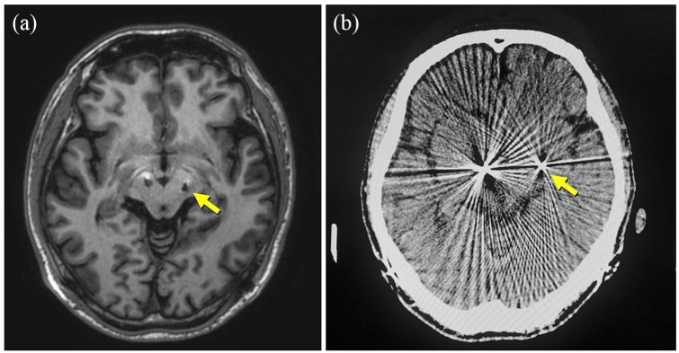
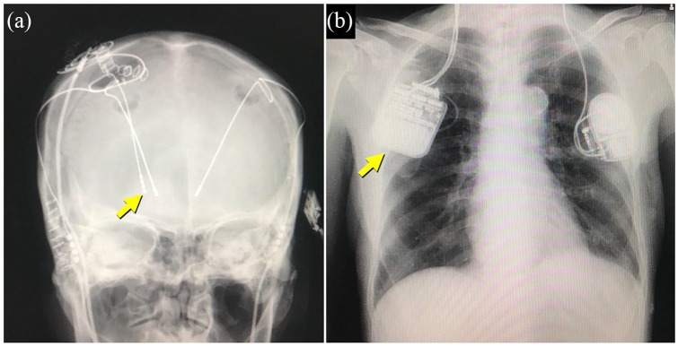
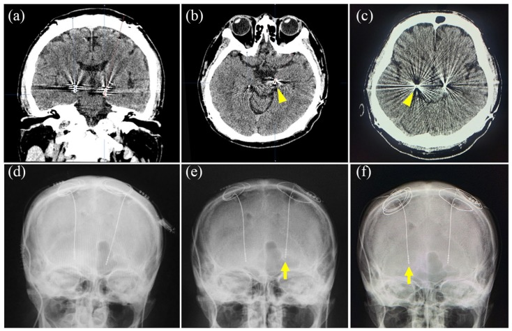
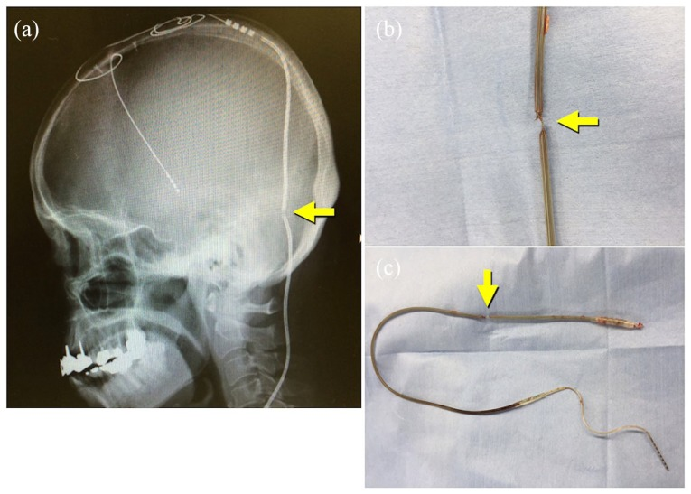
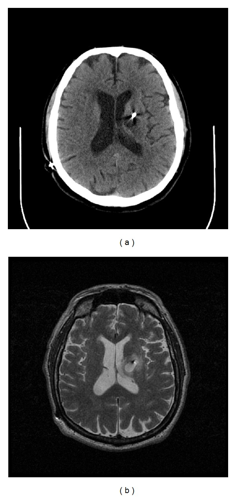
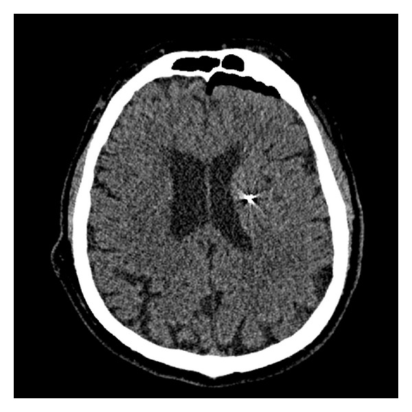
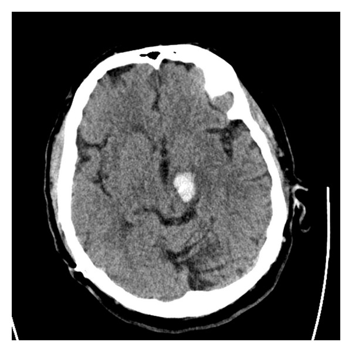
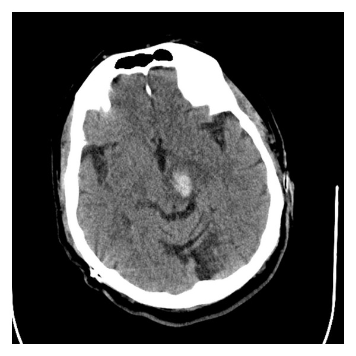
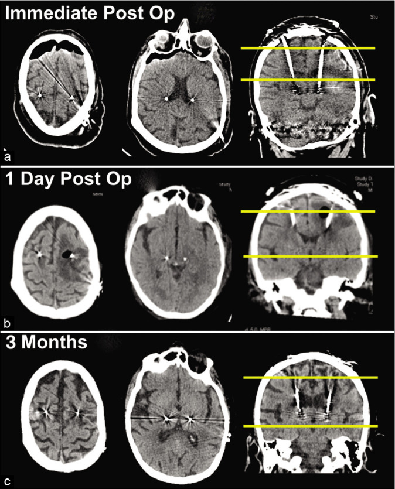

# Case Prep: Deep Brain Stimulation (DBS) Lead Placement

---

<!-- BEGIN CASE SNAPSHOT -->

## Case / Approach Snapshot

- **Anatomy at risk:** target nuclei or cortical regions, trajectories, vessels, ventricles, cranial nerves, white-matter tracts, and stimulation/lesion side-effect pathways.
- **Operative steps:** confirm diagnosis and target, plan trajectory or exposure, use mapping/monitoring/stereotaxy as appropriate, place/lesion/resect with physiologic confirmation, close hardware or wound, and plan programming/follow-up; use the detailed operative sequence and approach notes below as the step-by-step source.
- **Rescue plans:** hemorrhage, seizure, neurologic or mood/cognitive change, lead/device migration or infection, stimulation side effects, hardware failure, and revision or programming strategy.
- **Figures:** review [Figures, Imaging & Video](#figures-imaging--video) and the [Curated Image Set](#curated-image-set); embedded local figures should remain open-access, public-domain, or otherwise reusable with attribution.
- **Papers:** review [High-Yield Literature](#high-yield-literature) for seminal sources, modern reviews, and outcome data specific to this page.

<!-- END CASE SNAPSHOT -->

## One-Liner
[Age]yo [M/F] with [Parkinson disease / essential tremor / dystonia] planned for [bilateral/unilateral] DBS lead placement targeting [STN / GPi / VIM] [awake with MER / asleep under imaging guidance].

---

## Figures, Imaging & Video

**🎥 Operative video** — [search operative video on YouTube ▸](https://www.youtube.com/results?search_query=deep+brain+stimulation+surgery) · [The Neurosurgical Atlas ▸](https://www.neurosurgicalatlas.com)

**CNS Video Library**

<iframe src="https://www.youtube-nocookie.com/embed/34vJqjRJHKg" title="CNS Neurosurgery 100: Dystonia" loading="lazy" allow="accelerometer; clipboard-write; encrypted-media; picture-in-picture; web-share" allowfullscreen></iframe>

<iframe src="https://www.youtube-nocookie.com/embed/fCDH1py0jH0" title="CNS Neurosurgery 100: Neurosurgery for Dystonias" loading="lazy" allow="accelerometer; clipboard-write; encrypted-media; picture-in-picture; web-share" allowfullscreen></iframe>

<iframe src="https://www.youtube-nocookie.com/embed/fuwcROVbMp0" title="CNS Neurosurgery 100: Neurosurgery for Psychiatric Disorders" loading="lazy" allow="accelerometer; clipboard-write; encrypted-media; picture-in-picture; web-share" allowfullscreen></iframe>

*Workflow: planning → MER / microstimulation (ventral STN, dorsal SNr) → lead-placement assessment. Source: Shi et al., Front Neurol 2021;12:683532, Fig 1. CC BY 4.0.*

*Preoperative MRI targeting and postoperative CT/MRI-fusion verification of lead position. Source: Shi et al., Front Neurol 2021;12:683532, Fig 2. CC BY 4.0.*

*MER signatures distinguishing STN from SNr during trajectory mapping. Source: Shi et al., Front Neurol 2021;12:683532, Fig 4. CC BY 4.0.*

[Neurosurgical Atlas](https://www.neurosurgicalatlas.com) · [Radiopaedia](https://radiopaedia.org/search?q=deep%20brain%20stimulation&scope=all) · [PubMed Central](https://www.ncbi.nlm.nih.gov/pmc/?term=deep+brain+stimulation+STN+targeting) — operative figures © linked; see [media-sources.md](../../resources/media-sources.md)

---

<!-- BEGIN CURATED LITERATURE -->

## High-Yield Literature

- **Accurate Deep Brain Stimulation Lead Placement Concurrent With Research Electrocorticography** — Kons Z. Operative neurosurgery (Hagerstown, Md.) 2023. [PubMed](https://pubmed.ncbi.nlm.nih.gov/36701668/)
- **Interventional MRI-Guided Deep Brain Stimulation Lead Implantation** — Lee PS. Neurosurgery clinics of North America 2017. [PubMed](https://pubmed.ncbi.nlm.nih.gov/28917282/)
- **Deep brain stimulation lead removal in Tourette syndrome** — Deeb W. Parkinsonism & related disorders 2020. [PubMed](https://pubmed.ncbi.nlm.nih.gov/32712563/)
- **Deep Brain Stimulation Lead Localization Variability Comparing Intraoperative MRI Versus Postoperative Computed Tomography** — Yearley AG. Operative neurosurgery (Hagerstown, Md.) 2023. [PubMed](https://pubmed.ncbi.nlm.nih.gov/37584483/)
- **Directional Deep Brain Stimulation Lead Rotation in the Early Postoperative Period** — Dang HQ. Neurosurgery practice 2024. [PubMed](https://pubmed.ncbi.nlm.nih.gov/39959892/)
- **Subthalamic Deep Brain Stimulation Lead Asymmetry Impacts the Parkinsonian Gait Disorder** — Schott FP. Frontiers in human neuroscience 2022. [PubMed](https://pubmed.ncbi.nlm.nih.gov/35418844/)
- **Complications Related to Deep Brain Stimulation Lead Implantation: A Single-Surgeon Case Series** — Powers AY. Operative neurosurgery (Hagerstown, Md.) 2023. [PubMed](https://pubmed.ncbi.nlm.nih.gov/36701570/)
- **Safety of Deep Brain Stimulation Lead Placement on Patients Requiring Anticlotting Therapies** — Topp G. World neurosurgery 2021. [PubMed](https://pubmed.ncbi.nlm.nih.gov/33068799/)
- **Parkinsonian daytime sleep-wake classification using deep brain stimulation lead recordings** — Verma AK. Neurobiology of disease 2023. [PubMed](https://pubmed.ncbi.nlm.nih.gov/36521781/)
- **Deep brain stimulation lead fracture with normal impedances: case report and review of literature** — Darie L. British journal of neurosurgery 2026. [PubMed](https://pubmed.ncbi.nlm.nih.gov/40503617/)

<!-- END CURATED LITERATURE -->

---

<!-- BEGIN CURATED IMAGE SET -->

## Curated Image Set

Open-access figures are embedded from PubMed Central articles and kept unique to this guide.

*Figure 2.. An axial MRI image showing the misplaced deep brain stimulation (DBS) lead tip on the left side of the brain: (a) It is located posterolaterally to the ideal location (arrow); (b) the... Source: [Surgical management of adverse events associated with deep brain stimulation: A single-center experience](https://pmc.ncbi.nlm.nih.gov/articles/PMC7082866/) — SAGE Open Medicine 2020; CC BY-NC.*

*Figure 3.. X-ray films showing an additional deep brain stimulation (DBS) lead in the globus pallidus interna (GPi) (a) and the replaced dual-channel implantable pulse generator (b). Source: [Surgical management of adverse events associated with deep brain stimulation: A single-center experience](https://pmc.ncbi.nlm.nih.gov/articles/PMC7082866/) — SAGE Open Medicine 2020; CC BY-NC.*

*Figure 4.. A ventrally migrated deep brain stimulation (DBS) lead is shown on the coronal (a) and axial (b, c) CT images and a skull x-ray (d). Two preoperative axial CT images (b, c) show the tips... Source: [Surgical management of adverse events associated with deep brain stimulation: A single-center experience](https://pmc.ncbi.nlm.nih.gov/articles/PMC7082866/) — SAGE Open Medicine 2020; CC BY-NC.*

*Figure 5.. Fractured lead shown on the skull x-ray (a) and intraoperative pictures (b, c). Source: [Surgical management of adverse events associated with deep brain stimulation: A single-center experience](https://pmc.ncbi.nlm.nih.gov/articles/PMC7082866/) — SAGE Open Medicine 2020; CC BY-NC.*

*Figure 5. Source: [Surgical management of adverse events associated with deep brain stimulation: A single-center experience](https://pmc.ncbi.nlm.nih.gov/articles/PMC7082866/) — SAGE Open Med. 2020 Mar 19;8:2050312120913458. doi: 10.1177/2050312120913458; CC BY-NC.*

*Figure 1. (a) Axial CT without contrast enhancement showing hypodense 1.5 cm ovoid lesion in left basal ganglia surrounding deep brain stimulator lead four months after DBS placement. (b) The... Source: [Recurrent, Delayed Hemorrhage Associated with Edoxaban after Deep Brain Stimulation Lead Placement](https://pmc.ncbi.nlm.nih.gov/articles/PMC3556834/) — Case Reports in Neurological Medicine 2013; CC BY.*

*Figure 2. Axial CT without contrast enhancement showing no acute hemorrhage along DBS tract immediately after DBS placement. Source: [Recurrent, Delayed Hemorrhage Associated with Edoxaban after Deep Brain Stimulation Lead Placement](https://pmc.ncbi.nlm.nih.gov/articles/PMC3556834/) — Case Reports in Neurological Medicine 2013; CC BY.*

*Figure 3. Axial CT without contrast enhancement showing 1.9 × 1.5 cm acute hemorrhage in the left cerebral peduncle five months after DBS placement. Source: [Recurrent, Delayed Hemorrhage Associated with Edoxaban after Deep Brain Stimulation Lead Placement](https://pmc.ncbi.nlm.nih.gov/articles/PMC3556834/) — Case Reports in Neurological Medicine 2013; CC BY.*

*Figure 4. Repeat axial head CT without contrast enhancement done 24 hours after initial CT scan showing interval improvement of left cerebral peduncle hemorrhage. Source: [Recurrent, Delayed Hemorrhage Associated with Edoxaban after Deep Brain Stimulation Lead Placement](https://pmc.ncbi.nlm.nih.gov/articles/PMC3556834/) — Case Reports in Neurological Medicine 2013; CC BY.*

*Figure 1:. (a) Unremarkable head computed tomography (CT) performed early on postoperative day (POD) 1. (b) Stat head CT later on POD 1 showing marked left-sided peri-lead edema extending into the... Source: [Case report of hyperacute edema and cavitation following deep brain stimulation lead implantation](https://pmc.ncbi.nlm.nih.gov/articles/PMC7533082/) — Surgical Neurology International 2020; CC BY-NC-SA.*

<!-- END CURATED IMAGE SET -->

---

## History of Present Illness
- Chief complaint: Medically refractory movement disorder
- **PD:** motor fluctuations, dyskinesias, good levodopa response (predicts STN/GPi benefit); UPDRS on/off
- **ET:** disabling tremor refractory to medication → VIM
- **Dystonia:** generalized/segmental → GPi
- Cognitive/psychiatric screening (contraindications), levodopa challenge, multidisciplinary selection committee

---

## Imaging Review
### MRI (volumetric, target-specific sequences)
- High-resolution MRI for **direct targeting** (STN visible on T2/SWI; GPi; VIM via atlas/indirect)
- Merge with stereotactic CT (frame) or reference for frameless
- AC-PC line, target coordinates (indirect): STN (~12 lateral, 3 post, 4 inferior to MCP), GPi (~20 lateral, 2-3 ant, 4-5 inf), VIM (~11-14 lateral, ~6 post to MCP / 25% AC-PC anterior to PC)
- Plan trajectory avoiding sulci, ventricles, vessels

---

## Labs
- CBC, BMP, **Coags (stop anticoagulation/antiplatelets — hemorrhage risk)**, Type and screen

---

## Neurological Examination
- Movement disorder rating (UPDRS/tremor/dystonia scales), cognition, baseline for intraop testing

---

## Surgical Planning

### Case Logistics, OR Needs & Orders
- **Typical bed:** step-down or ICU overnight for lead/electrode hemorrhage checks; some centers use short-stay pathways for uncomplicated DBS/SEEG.
- **OR setup:** stereotaxy/robot/navigation, O-arm or intraop CT as used, implant/electrode inventory verified, programmer/recording equipment, and MRI/CT merge reviewed with target coordinates.
- **Special needs:** anticoagulation/antiplatelet hold plan, disease medications on/off plan, microelectrode recording or stimulation-testing plan, seizure precautions for SEEG, and device vendor/programmer availability.
- **Immediate postop orders:** neuro checks, CT to exclude hemorrhage and confirm lead/electrode position, antibiotics per implant protocol, seizure monitoring for SEEG, medication/device programming plan, and hardware/wound precautions.

### Targets
- **STN:** PD (reduces meds, motor fluctuations, dyskinesia)
- **GPi:** PD (dyskinesia), dystonia
- **VIM (thalamus):** Essential tremor, tremor-dominant PD

### Technique
- **Frame-based stereotactic** (Leksell/CRW) — gold standard accuracy; OR frameless (e.g., Nexframe, ClearPoint iMRI)
- **Awake with microelectrode recording (MER)** + intraoperative test stimulation — physiologic confirmation; OR **asleep image-guided** (iMRI/iCT verified)

### Position
- Semi-sitting/supine, frame applied, comfortable for awake testing; minimal sedation during recording

### Key Surgical Steps
1. Apply stereotactic frame (local anesthesia), stereotactic CT, merge with planning MRI, calculate coordinates and trajectory
2. Off dopaminergic meds overnight (PD — for intraop assessment)
3. Burr hole (typically coronal, ~Kocher's-type entry), secure lead anchor
4. Open dura, minimize CSF egress/pneumocephalus (brain shift) — small durotomy, fibrin glue
5. **Microelectrode recording (MER)** — advance microelectrode, record characteristic neuronal firing (STN bursting/irregular, GPi, VIM tremor cells, identify borders e.g. SNr below STN)
6. Map target borders physiologically (awake)
7. **Test stimulation** (awake) — assess benefit (tremor/rigidity reduction) and **side-effect thresholds** (capsular: contractions; medial lemniscus: paresthesia; oculomotor: diplopia)
8. Implant permanent DBS lead at optimal trajectory/depth, confirm with imaging (CT/fluoro/iMRI)
9. Secure lead to burr hole anchor
10. Repeat contralateral side (bilateral)
11. Intraoperative/postop CT to confirm position and exclude hemorrhage
12. **IPG (pulse generator) placement** — same session or staged: subclavicular pocket, tunnel extension to lead

### Critical Anatomy & Structures at Risk
1. **Internal capsule** (lateral to STN/GPi) — motor side effects
2. **Medial lemniscus, sensory thalamus** — paresthesias
3. **Optic tract** (below/medial GPi) — visual phenomena
4. **Red nucleus, SNr, oculomotor fibers** (STN region)
5. **Vessels/sulci/ventricle** along trajectory — hemorrhage (main serious risk)

### Equipment
- Stereotactic frame (Leksell/CRW) or frameless system
- MER system, microdrive, test stimulator
- DBS leads, anchors, IPG + extensions
- Navigation/planning station, intraoperative CT/fluoro (or iMRI)

### Monitoring
- MER, clinical exam during awake testing

### Anesthesia
- **Awake/MAC** with minimal sedation during recording (sedatives suppress MER); dexmedetomidine often used carefully; control BP (hemorrhage); avoid oversedation
- Asleep technique: GA with imaging verification

### Potential Complications
1. **Intracranial hemorrhage** (~1-2%) — most serious; control BP, limit passes, avoid vessels
2. Misplacement → poor benefit/side effects (needs revision)
3. Infection (hardware), lead migration/fracture
4. Seizure, pneumocephalus/brain shift affecting accuracy
5. Stimulation side effects (programmable)

---

## Operative Note Template
**Preoperative Diagnosis:** [Parkinson disease / essential tremor / dystonia], medically refractory

**Postoperative Diagnosis:** Same

**Procedure:** [Bilateral] DBS lead placement, target [STN/GPi/VIM], [frame-based, awake with MER / asleep image-guided] [± IPG placement]

**Surgeon / Assistant:**
**Anesthesia:** [MAC/awake for MER / GA for asleep technique]
**EBL / Fluids:** Minimal
**Adjuncts:** Stereotactic frame [Leksell/CRW] or frameless system, MER, test stimulator, intraoperative CT/fluoro [or iMRI]
**Implants:** DBS lead(s) [± IPG and extensions]
**Complications:** None

**Indications:** [Age]yo [M/F] with [refractory PD/ET/dystonia] meeting selection criteria (good levodopa response / disabling tremor), cleared by the multidisciplinary committee. Target [STN/GPi/VIM]. Risks (hemorrhage, misplacement, infection) discussed.

**Description of Procedure:** After consent and time-out, [the stereotactic frame was applied under local anesthesia], a stereotactic CT obtained and merged with the planning MRI, and target/entry coordinates and an avascular trajectory calculated. [Dopaminergic meds were held for intraoperative assessment.] A [coronal] burr hole was made, the lead anchor secured, and the dura opened minimizing CSF loss/pneumocephalus.

**Microelectrode recording** was performed, characteristic firing identified, and the target borders mapped. **Awake test stimulation** confirmed clinical benefit ([tremor/rigidity reduction]) and acceptable side-effect thresholds (capsular/sensory/oculomotor). The permanent DBS lead was implanted at the optimal trajectory/depth and secured, with position confirmed on [CT/fluoro/iMRI]. [The contralateral side was performed identically.] Intraoperative/postoperative imaging excluded hemorrhage. [The IPG was placed in a subclavicular pocket and tunneled.]

The patient was transferred in stable condition; programming was planned at ~2–4 weeks.

---

## Postoperative Plan
- Step-down/floor, neuro checks
- **CT/MRI to confirm lead position and exclude hemorrhage**
- Resume Parkinson meds; monitor for microlesion effect
- IPG placement if staged
- **Programming initiation ~2-4 weeks post-op** (after edema/microlesion effect resolves)
- Neurology/movement disorder follow-up for programming and medication adjustment
- Document MRI conditions for the device
