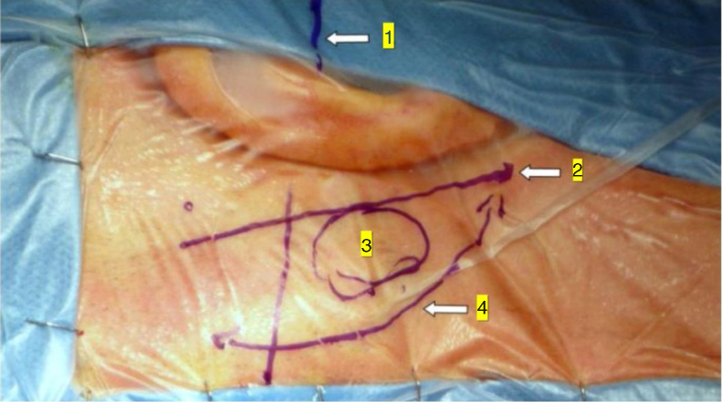
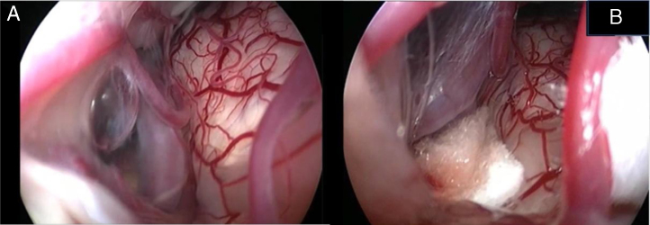
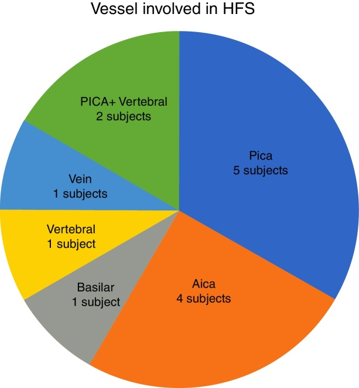
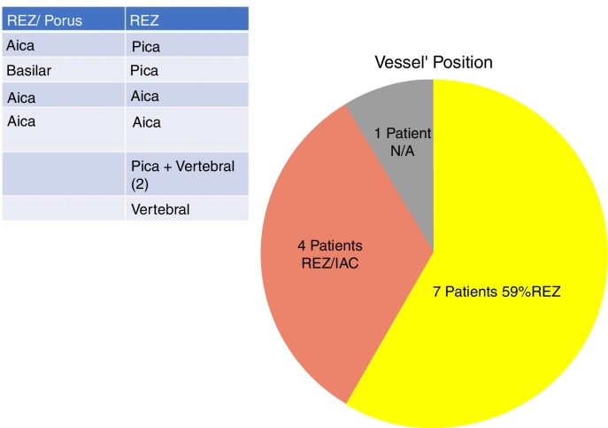
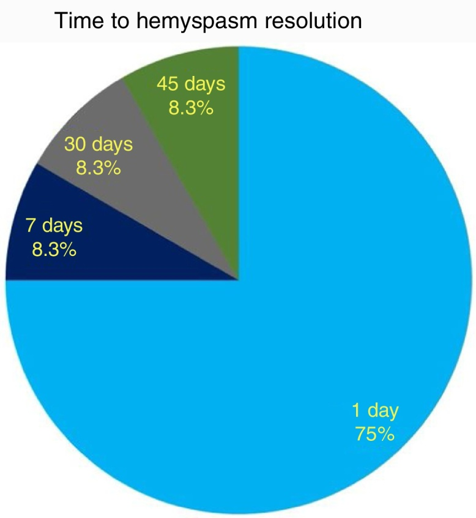
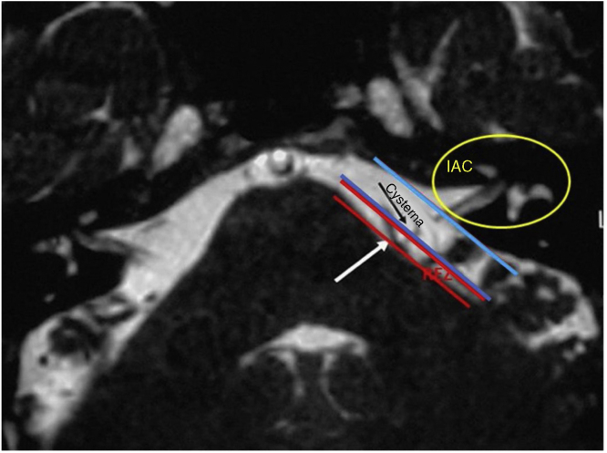
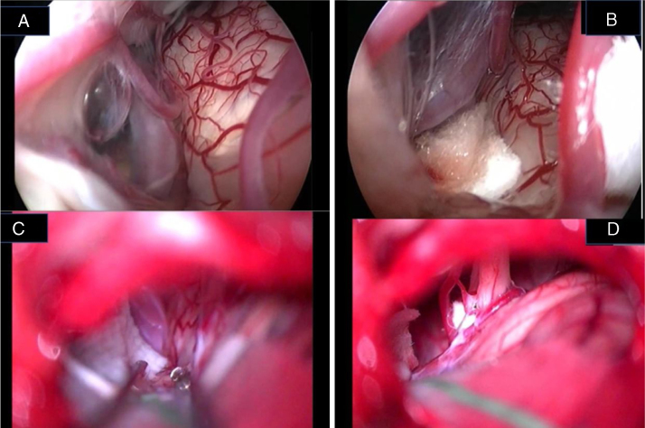
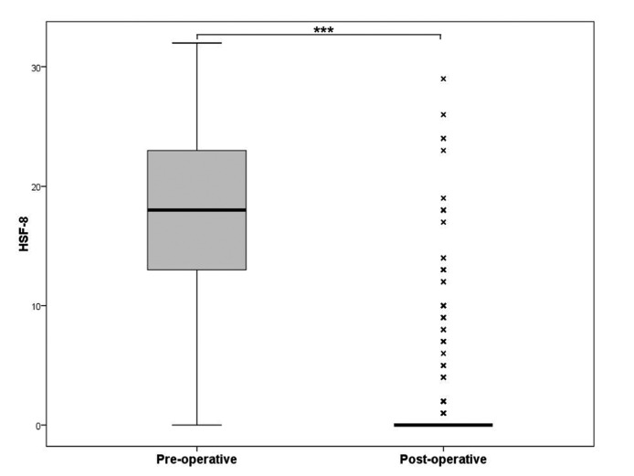
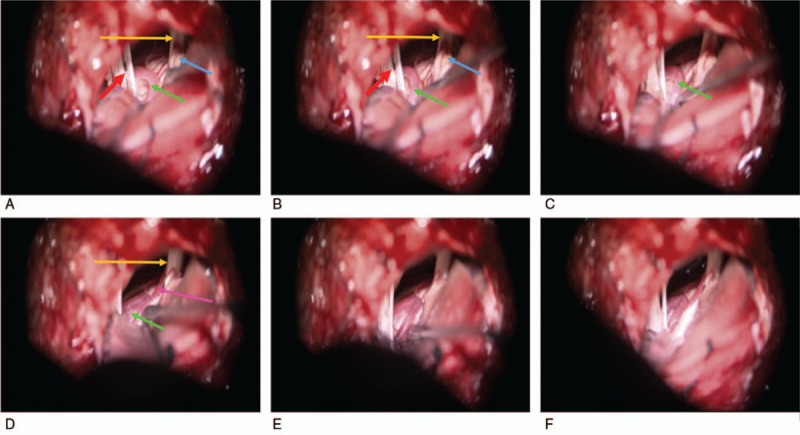
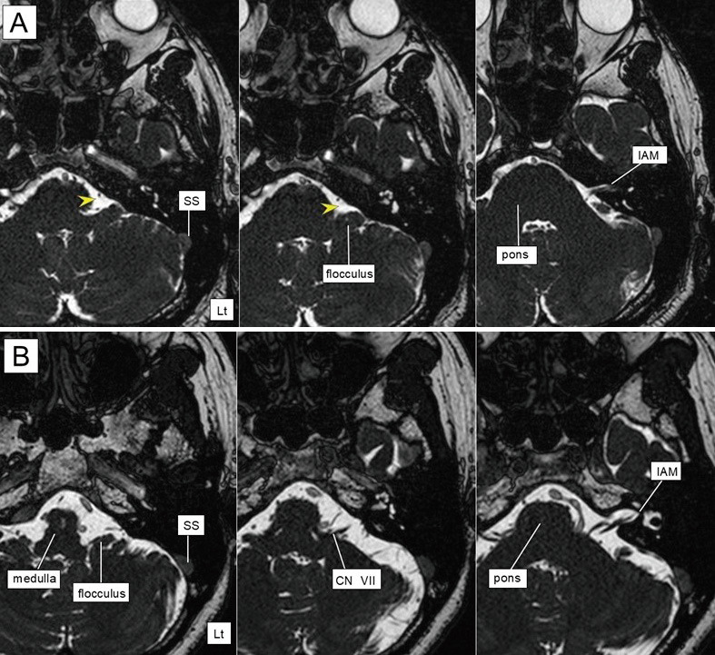

# Case Prep: Microvascular Decompression for Hemifacial Spasm

---

<!-- BEGIN CASE SNAPSHOT -->

## Case / Approach Snapshot

- **Anatomy at risk:** target nuclei or cortical regions, trajectories, vessels, ventricles, cranial nerves, white-matter tracts, and stimulation/lesion side-effect pathways.
- **Operative steps:** confirm diagnosis and target, plan trajectory or exposure, use mapping/monitoring/stereotaxy as appropriate, place/lesion/resect with physiologic confirmation, close hardware or wound, and plan programming/follow-up; use the detailed operative sequence and approach notes below as the step-by-step source.
- **Rescue plans:** hemorrhage, seizure, neurologic or mood/cognitive change, lead/device migration or infection, stimulation side effects, hardware failure, and revision or programming strategy.
- **Figures:** review [Figures, Imaging & Video](#figures-imaging--video) and the [Curated Image Set](#curated-image-set); embedded local figures should remain open-access, public-domain, or otherwise reusable with attribution.
- **Papers:** review [High-Yield Literature](#high-yield-literature) for seminal sources, modern reviews, and outcome data specific to this page.

<!-- END CASE SNAPSHOT -->

## One-Liner
[Age]yo [M/F] with [left/right] hemifacial spasm refractory to botulinum toxin planned for [left/right] retrosigmoid craniotomy for microvascular decompression of the facial nerve (CN VII).

---

## Figures, Imaging & Video

**🎥 Operative video** — [search operative video on YouTube ▸](https://www.youtube.com/results?search_query=hemifacial+spasm+surgery) · [The Neurosurgical Atlas ▸](https://www.neurosurgicalatlas.com)

> 🧭 **Operative approach:** [Retrosigmoid craniotomy](../approaches/retrosigmoid-craniotomy.md) — detailed corridor setup, step-by-step technique & figures

[Neurosurgical Atlas](https://www.neurosurgicalatlas.com) · [Radiopaedia](https://radiopaedia.org/search?q=hemifacial%20spasm&scope=all) · [PubMed Central](https://www.ncbi.nlm.nih.gov/pmc/?term=microvascular+decompression+hemifacial+spasm) — operative figures © linked; see [media-sources.md](../../resources/media-sources.md)

---

<!-- BEGIN CURATED LITERATURE -->

## High-Yield Literature

- **Microvascular decompression for pediatric-onset hemifacial spasm: case series and literature review** — Jia A. Child's nervous system : ChNS : official journal of the International Society for Pediatric Neurosurgery 2022. [PubMed](https://pubmed.ncbi.nlm.nih.gov/35419625/)
- **Spasm Freedom Following Microvascular Decompression for Hemifacial Spasm: Systematic Review and Meta-Analysis** — Holste K. World neurosurgery 2020. [PubMed](https://pubmed.ncbi.nlm.nih.gov/32305605/)
- **Microvascular decompression for hemifacial spasm : Surgical techniques and intraoperative monitoring** — Sindou M. Neuro-Chirurgie 2018. [PubMed](https://pubmed.ncbi.nlm.nih.gov/29784430/)
- **Microvascular Decompression for Hemifacial Spasm** — Ghali MGZ. International ophthalmology clinics 2018. [PubMed](https://pubmed.ncbi.nlm.nih.gov/29239883/)
- **Hemifacial spasm: an update on pathophysiology, investigations and management** — Jesuthasan A. Journal of neurology 2025. [PubMed](https://pubmed.ncbi.nlm.nih.gov/40640398/)
- **Fully endoscopic microvascular decompression for hemifacial spasm: a systematic review** — Ansari A. Neurosurgical review 2025. [PubMed](https://pubmed.ncbi.nlm.nih.gov/40050528/)
- **Microvascular decompression for hemifacial spasm: Outcome on spasm and complications. A review** — Sindou M. Neuro-Chirurgie 2018. [PubMed](https://pubmed.ncbi.nlm.nih.gov/29454467/)
- **Microvascular decompression in patients with hemifacial spasm** — Niu X. Brain and behavior 2019. [PubMed](https://pubmed.ncbi.nlm.nih.gov/31617334/)
- **Challenging Microvascular Decompression Surgery for Hemifacial Spasm** — Lee S. World neurosurgery 2021. [PubMed](https://pubmed.ncbi.nlm.nih.gov/33819711/)
- **[Microvascular decompression in hemifacial spasm: functional outcome]** — Suárez M. Medicina 2024. [PubMed](https://pubmed.ncbi.nlm.nih.gov/39666409/)

<!-- END CURATED LITERATURE -->

---

<!-- BEGIN CURATED IMAGE SET -->

## Curated Image Set

Open-access figures are embedded from PubMed Central articles and kept unique to this guide.

*Figure 1. Minimally invasive retrosigmoid approach (right side). The image shows the anatomic landmarks for the surgical access: (1) Frankfurt plane between the external canthus and tragus... Source: [Endoscope-assisted retrosigmoid approach in hemifacial spasm: our experience☆](https://pmc.ncbi.nlm.nih.gov/articles/PMC9443034/) — Brazilian Journal of Otorhinolaryngology 2019; CC BY.*

*Figure 2. Endoscopic view of the neurovascular conflict before the decompression (A) and after Teflon® sponge interposition between the posterior–inferior cerebellar artery (PICA) and the facial... Source: [Endoscope-assisted retrosigmoid approach in hemifacial spasm: our experience☆](https://pmc.ncbi.nlm.nih.gov/articles/PMC9443034/) — Brazilian Journal of Otorhinolaryngology 2019; CC BY.*

*Figure 3. Frequency of the different vessels involved in the neurovascular conflict with the facial nerve in our study group. PICA, posterior–inferior cerebellar artery; AICA, anterior–inferior... Source: [Endoscope-assisted retrosigmoid approach in hemifacial spasm: our experience☆](https://pmc.ncbi.nlm.nih.gov/articles/PMC9443034/) — Brazilian Journal of Otorhinolaryngology 2019; CC BY.*

*Figure 4. Frequency of the different neurovascular conflict sites in our series. REZ, root entry zone; IAC, internal auditory canal; N/A, non-arterial conflict (vein). Source: [Endoscope-assisted retrosigmoid approach in hemifacial spasm: our experience☆](https://pmc.ncbi.nlm.nih.gov/articles/PMC9443034/) — Brazilian Journal of Otorhinolaryngology 2019; CC BY.*

*Figure 5. Timing (days after surgery) of hemifacial spasm resolution. Source: [Endoscope-assisted retrosigmoid approach in hemifacial spasm: our experience☆](https://pmc.ncbi.nlm.nih.gov/articles/PMC9443034/) — Brazilian Journal of Otorhinolaryngology 2019; CC BY.*

*Figure 6. T2 weighted MRI showing the boundaries of the root entry zone (REZ) in the cerebellopontine angle and the internal auditory canal (IAC). Notice the conflict between the vessel (white... Source: [Endoscope-assisted retrosigmoid approach in hemifacial spasm: our experience☆](https://pmc.ncbi.nlm.nih.gov/articles/PMC9443034/) — Brazilian Journal of Otorhinolaryngology 2019; CC BY.*

*Figure 7. Endoscopic (A, B) and microscopic (C, D) image of a neurovascular conflict before the decompression (A, C) and after Teflon® sheet interposition between the vascular loop and the facial... Source: [Endoscope-assisted retrosigmoid approach in hemifacial spasm: our experience☆](https://pmc.ncbi.nlm.nih.gov/articles/PMC9443034/) — Brazilian Journal of Otorhinolaryngology 2019; CC BY.*

*Fig. 1.. Pre- and post-operative HFS-8 score. The median is indicated by a thick black line inside the box. The top and bottom of the box are the upper and lower quartile [25th-75th percentiles]... Source: [Long-term surgical results in microvascular decompression for hemifacial spasm: efficacy, morbidity and quality of life](https://pmc.ncbi.nlm.nih.gov/articles/PMC4977010/) — Acta Otorhinolaryngologica Italica 2016; CC BY-NC-ND.*

*Figure 1. (A–F) The surgical processes are partially shown. Green arrow: anterior inferior cerebellar artery. Blue arrow: auditory nerve. Orange arrow: facial nerve. Red arrow: lower cranial... Source: [Retrospective clinical analysis of 320 cases of microvascular decompression for hemifacial spasm](https://pmc.ncbi.nlm.nih.gov/articles/PMC6203468/) — Medicine 2018; CC BY.*

*Fig. 1. Axial MRI (constructive interference in steady state) before endoscopic MVD.In A and B, the left image was from near the jugular foramen level, the right image from the IAM level, and... Source: [Comparison of Surgical Outcomes in Microscopic and Fully Endoscopic Microvascular Decompression for Hemifacial Spasm](https://pmc.ncbi.nlm.nih.gov/articles/PMC12137054/) — Neurologia medico-chirurgica 2025; CC BY-NC-ND.*

<!-- END CURATED IMAGE SET -->

---

## History of Present Illness
- Chief complaint: Involuntary [left/right] facial twitching, beginning in the orbicularis oculi (periocular) and progressing to lower face
- Tonic vs clonic; worse with stress/fatigue; persists in sleep (distinguishes from tics)
- Botulinum toxin response/duration; medications tried
- Rule out secondary causes (tumor, AVM at CPA), facial nerve palsy history (post-paralytic)

---

## Imaging Review
### MRI (T1+Gad, **CISS/FIESTA**, MRA)
- Identify vascular compression at facial nerve **REZ (root exit zone)** at the pontomedullary junction
- **Offending vessel:** AICA, PICA, vertebral artery (VA — often the culprit in HFS), or vein
- Exclude CPA tumor, AVM, or other secondary cause
- VA ectasia/dolichoectasia (transposition technique implications)

---

## Labs
- CBC, BMP, Coags, Type and screen

---

## Neurological Examination
- Facial nerve function (HB grade — usually normal between spasms), document spasm pattern
- Hearing (CN VIII — baseline audiogram), other CN exam

---

## Surgical Planning

### Case Logistics, OR Needs & Orders
- **Typical bed:** step-down or ICU for posterior fossa decompression/MVD, especially with sleep apnea, lower-CN risk, hydrocephalus, or difficult nausea/pain control.
- **OR setup:** Mayfield, microscope, cranial nerve monitoring/BAER for MVD, Teflon/felt and microinstruments, dural graft/sealant for Chiari, and watertight closure materials.
- **Special needs:** arterial line optional by comorbidity/position, antiemetic plan, steroid plan by edema/aseptic meningitis risk, airway/OSA precautions, and CSF-leak/pseudomeningocele strategy.
- **Immediate postop orders:** posterior fossa neuro checks, facial/hearing/swallow exam as relevant, nausea/pain control, HOB 30, CT/MRI if concern or protocol, wound/CSF leak watch, and activity restrictions.

### Diagnosis & Indication
- Indication: HFS refractory to/intolerant of botulinum toxin, confirmed vascular compression
- Goals: Decompress the facial nerve REZ at the pontomedullary junction (note: HFS compression is at the REZ/pontomedullary junction, more proximal/caudal than the trigeminal REZ)

### Position
- Lateral/park bench (ipsilateral up) or supine head-turned; Mayfield; mastoid up, neck flexed
- Slightly more inferior exposure than for TN (target is caudal, at pontomedullary junction)

### Approach: Retrosigmoid Craniotomy
### Key Surgical Steps
1. Retrosigmoid craniotomy at transverse-sigmoid junction (slightly lower/toward foramen magnum for VII REZ)
2. Open dura, drain CSF (cerebellomedullary cistern), relax cerebellum
3. Approach the **lower CN complex / pontomedullary junction** (inferolateral)
4. Identify CN VII REZ at the pontomedullary junction (anterior/rostral to CN IX-X, near CN VIII)
5. Identify offending vessel (AICA/PICA/VA/vein) compressing the REZ
6. **Mobilize vessel off the REZ**, interpose Teflon felt; for VA: may need transposition (sling/tether away from nerve) rather than simple pledget
7. **Confirm with LSR (lateral spread response)** monitoring — abnormal LSR typically resolves with adequate decompression
8. Inspect, hemostasis, watertight dural closure, cranioplasty, closure

### Critical Anatomy & Structures at Risk
1. **Facial nerve (CN VII) REZ** — at pontomedullary junction
2. **CN VIII** — adjacent; **hearing loss is the main risk** (more than in TN MVD)
3. **AICA/labyrinthine artery** — hearing
4. **Lower cranial nerves (IX, X, XI)** — in the operative field
5. **Vertebral artery** (transposition cases), brainstem

### Equipment
- Microscope, drill, microsurgical instruments
- Teflon felt (± sling material for VA transposition), fibrin glue
- Hemostatic agents, dural substitute/cranioplasty

### Monitoring
- **LSR (lateral spread response)** — key intraoperative confirmation of decompression
- **BAER** (hearing — high priority), facial EMG, SSEPs

### Anesthesia
- Arterial line, no paralytic (EMG/LSR), antiemetics, mannitol for relaxation

### Potential Complications
1. **Hearing loss** (CN VIII) — most significant risk; BAER monitoring
2. Facial weakness (usually transient)
3. Incomplete relief/recurrence; delayed resolution (spasm may take weeks-months to fully resolve)
4. CSF leak, lower CN dysfunction, cerebellar injury

---

## Operative Note Template
**Preoperative Diagnosis:** [Left/Right] hemifacial spasm from neurovascular compression of CN VII

**Postoperative Diagnosis:** Same

**Procedure:** [Left/Right] retrosigmoid craniotomy for microvascular decompression of the facial nerve

**Surgeon / Assistant:**
**Anesthesia:** General endotracheal, no paralytic
**EBL / Fluids:**
**Adjuncts:** Microscope, drill; **LSR (lateral spread response)**, BAER, facial EMG, SSEP
**Implants:** Teflon felt [± sling], dural substitute/cranioplasty
**Complications:** None

**Indications:** [Age]yo [M/F] with [left/right] hemifacial spasm refractory to botulinum toxin; MRI showed neurovascular compression at the CN VII REZ ([AICA/PICA/VA]). Risks (hearing loss, facial weakness, CSF leak) discussed.

**Description of Procedure:** After consent and time-out, general anesthesia was induced (no paralytic) and neuromonitoring established including **LSR and BAER**. The head was fixed and the patient positioned [lateral/park-bench], mastoid up. A retrosigmoid craniotomy was performed at the transverse-sigmoid junction (slightly inferior, toward the foramen magnum for the VII REZ) and the dura opened with CSF egress to relax the cerebellum.

Working inferolaterally toward the **pontomedullary junction**, the CN VII root exit zone was exposed and the offending vessel ([AICA/PICA/VA]) identified compressing the REZ. The vessel was mobilized off the nerve and **Teflon felt interposed** [/ the VA was transposed with a sling]. **The abnormal LSR resolved** with adequate decompression, and BAER remained stable. The decompression was inspected and a watertight dural closure performed with cranioplasty.

The patient was awakened and transferred with posterior-fossa precautions; spasm resolution may be delayed over weeks.

---

## Postoperative Plan
- ICU/step-down, neuro checks q1h, posterior fossa precautions
- Facial function and hearing assessment, audiogram before discharge
- CT 6h; antiemetics, steroid taper, DVT prophylaxis
- Counsel: spasm resolution may be delayed over weeks-months
- Follow-up clinic
