# Case Prep: Microvascular Decompression (MVD) for Trigeminal Neuralgia

---

<!-- BEGIN CASE SNAPSHOT -->

## Case / Approach Snapshot

- **Anatomy at risk:** target nuclei or cortical regions, trajectories, vessels, ventricles, cranial nerves, white-matter tracts, and stimulation/lesion side-effect pathways.
- **Operative steps:** confirm diagnosis and target, plan trajectory or exposure, use mapping/monitoring/stereotaxy as appropriate, place/lesion/resect with physiologic confirmation, close hardware or wound, and plan programming/follow-up; use the detailed operative sequence and approach notes below as the step-by-step source.
- **Rescue plans:** hemorrhage, seizure, neurologic or mood/cognitive change, lead/device migration or infection, stimulation side effects, hardware failure, and revision or programming strategy.
- **Figures:** review [Figures, Imaging & Video](#figures-imaging--video) and the [Curated Image Set](#curated-image-set); embedded local figures should remain open-access, public-domain, or otherwise reusable with attribution.
- **Papers:** review [High-Yield Literature](#high-yield-literature) for seminal sources, modern reviews, and outcome data specific to this page.

<!-- END CASE SNAPSHOT -->

## One-Liner
[Age]yo [M/F] with [left/right] trigeminal neuralgia ([V2/V3/V2-V3]) refractory to medical management planned for [left/right] retrosigmoid craniotomy for microvascular decompression.

---

## Figures, Imaging & Video

**🎥 Operative video** — [search operative video on YouTube ▸](https://www.youtube.com/results?search_query=trigeminal+neuralgia+neurovascular+surgery) · [The Neurosurgical Atlas ▸](https://www.neurosurgicalatlas.com)

> 🧭 **Operative approach:** [Retrosigmoid craniotomy](../approaches/retrosigmoid-craniotomy.md) — detailed corridor setup, step-by-step technique & figures

[Neurosurgical Atlas](https://www.neurosurgicalatlas.com) · [Radiopaedia](https://radiopaedia.org/search?q=trigeminal%20neuralgia%20neurovascular&scope=all) · [PubMed Central](https://www.ncbi.nlm.nih.gov/pmc/?term=microvascular+decompression+trigeminal+neuralgia) — operative figures © linked; see [media-sources.md](../../resources/media-sources.md)

---

<!-- BEGIN CURATED LITERATURE -->

## High-Yield Literature

- **Trigeminal Neuralgia** — Cruccu G. The New England journal of medicine 2020. [PubMed](https://pubmed.ncbi.nlm.nih.gov/32813951/)
- **[Microvascular Decompression for Trigeminal Neuralgia Due to Venous Compression]** — Toda H. No shinkei geka. Neurological surgery 2024. [PubMed](https://pubmed.ncbi.nlm.nih.gov/38246674/)
- **[Microvascular decompression in trigeminal neuralgia following vertebrobasilar dolichoectasia]** — Shulev YA. Zhurnal voprosy neirokhirurgii imeni N. N. Burdenko 2020. [PubMed](https://pubmed.ncbi.nlm.nih.gov/33095533/)
- **Microvascular decompression for trigeminal neuralgia due to vertebrobasilar artery compression: a systematic review and meta-analysis** — Di Carlo DT. Neurosurgical review 2022. [PubMed](https://pubmed.ncbi.nlm.nih.gov/34309748/)
- **Surgical technique management of microvascular decompression for trigeminal neuralgia** — Yang L. Ideggyogyaszati szemle 2022. [PubMed](https://pubmed.ncbi.nlm.nih.gov/36541149/)
- **Trigeminal Neuralgia** — Cruccu G. Continuum (Minneapolis, Minn.) 2017. [PubMed](https://pubmed.ncbi.nlm.nih.gov/28375911/)
- **Trigeminal Neuralgia** — Zakrzewska JM. American family physician 2016. [PubMed](https://pubmed.ncbi.nlm.nih.gov/27419329/)
- **Endoscopic microvascular decompression versus microscopic microvascular decompression for trigeminal neuralgia: A systematic review and meta-analysis** — Chen L. Journal of clinical neuroscience : official journal of the Neurosurgical Society of Australasia 2023. [PubMed](https://pubmed.ncbi.nlm.nih.gov/37776679/)
- **Microvascular decompression for trigeminal neuralgia** — Sade B. Neurosurgery clinics of North America 2014. [PubMed](https://pubmed.ncbi.nlm.nih.gov/25240661/)
- **Microvascular decompression for pediatric onset trigeminal neuralgia: patterns and variation** — Dou NN. Child's nervous system : ChNS : official journal of the International Society for Pediatric Neurosurgery 2022. [PubMed](https://pubmed.ncbi.nlm.nih.gov/35034138/)

<!-- END CURATED LITERATURE -->

---

<!-- BEGIN CURATED IMAGE SET -->

## Curated Image Set

Open-access figures are embedded from PubMed Central articles and kept unique to this guide.

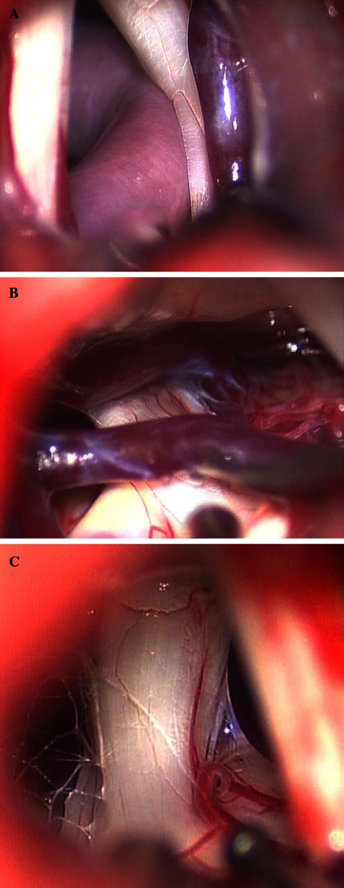
*Fig. 1. Representative intraoperative images of a artery compression and vein close, b vein compression, and c arachnoid adhesions Source: [Arterial compression of nerve is the primary cause of trigeminal neuralgia](https://pmc.ncbi.nlm.nih.gov/articles/PMC3889704/) — Neurological Sciences 2013; CC BY.*

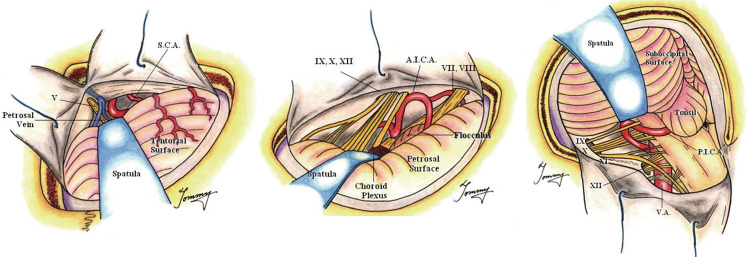
*Fig. 3. "Rule of Three" framework for tailored MVD approaches to major neurovascular compression syndromes. Source: [Historical evolution of microvascular decompression after Jannetta's establishment: Anatomical maps and physiological compasses-a narrative review](https://pmc.ncbi.nlm.nih.gov/articles/PMC12999832/) — Acta Neurochirurgica 2026; CC BY-NC-ND.*

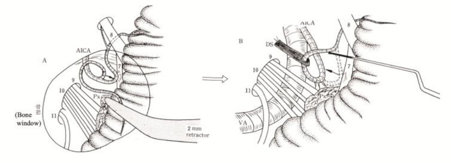
*Fig. 5. Noncompressive transposition technique after MVD, illustrating transposition rather than simple interposition. Source: [Historical evolution of microvascular decompression after Jannetta's establishment: Anatomical maps and physiological compasses-a narrative review](https://pmc.ncbi.nlm.nih.gov/articles/PMC12999832/) — Acta Neurochirurgica 2026; CC BY-NC-ND.*

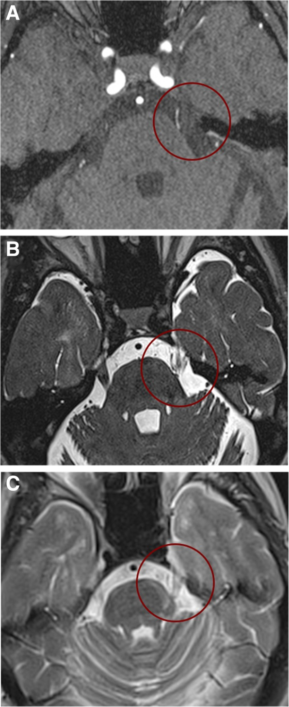
*Fig. 1. Neuroimaging findings in a representative patient with TN secondary to MS possibly due to a double crush mechanism. 3D time-of-flight (TOF) magnetic resonance angiography scans (a) and... Source: [Trigeminal neuralgia secondary to multiple sclerosis: from the clinical picture to the treatment options](https://pmc.ncbi.nlm.nih.gov/articles/PMC6734488/) — The Journal of Headache and Pain 2019; CC BY.*

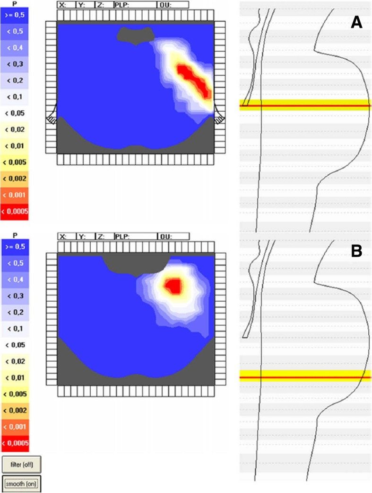
*Fig. 2. Voxel-based analysis in patients with TN secondary to MS. Voxel-based brainstem model in patients with TN secondary to MS (TN group, n = 42) and in patients with trigeminal sensory... Source: [Trigeminal neuralgia secondary to multiple sclerosis: from the clinical picture to the treatment options](https://pmc.ncbi.nlm.nih.gov/articles/PMC6734488/) — The Journal of Headache and Pain 2019; CC BY.*

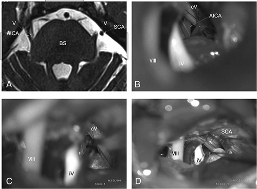
*Figure 1. Patient 1: (A) Three-dimensional time-of-flight magnetic resonance angiography findings. Anterior inferior cerebellar artery compresses the right trigeminal nerve, left side was... Source: [Unilateral Approach to Primary Bilateral Trigeminal Neuralgia Via Bilateral Microvascular Decompression](https://pmc.ncbi.nlm.nih.gov/articles/PMC9275838/) — The Journal of Craniofacial Surgery 2022; CC BY-NC-ND.*

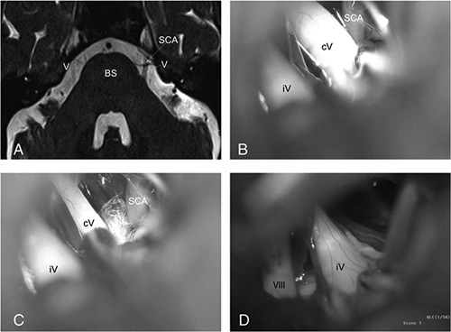
*Figure 2. Patient 2: (A) Three-dimensional time-of-flight magnetic resonance angiography findings. Superior cerebellar artery compressed the left trigeminal nerve. (b) Contralateral trigeminal... Source: [Unilateral Approach to Primary Bilateral Trigeminal Neuralgia Via Bilateral Microvascular Decompression](https://pmc.ncbi.nlm.nih.gov/articles/PMC9275838/) — The Journal of Craniofacial Surgery 2022; CC BY-NC-ND.*

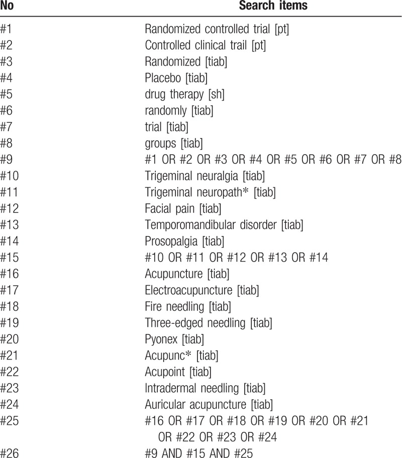
*Figure 6. Source: [Acupuncture treatment on idiopathic trigeminal neuralgia: A systematic review protocol](https://pmc.ncbi.nlm.nih.gov/articles/PMC6358347/) — Medicine (Baltimore). 2019 Jan 25;98(4):e14239. doi: 10.1097/MD.0000000000014239; CC BY.*

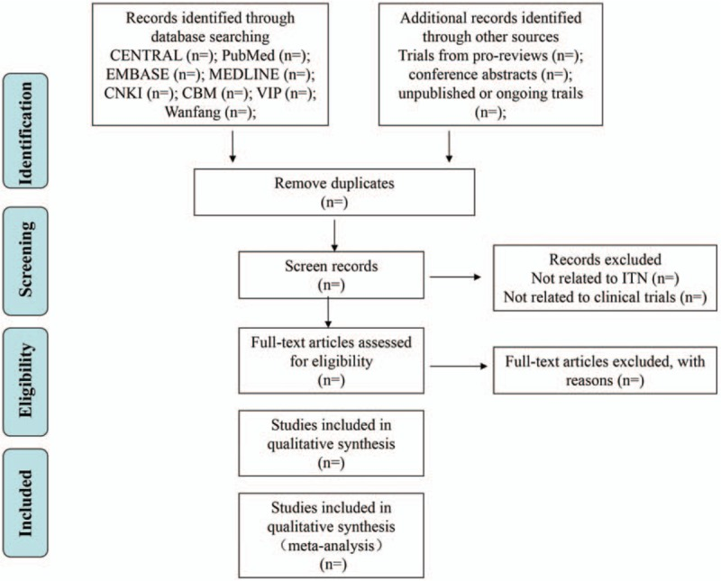
*Figure 1. Flow diagram of selection process. Source: [Acupuncture treatment on idiopathic trigeminal neuralgia](https://pmc.ncbi.nlm.nih.gov/articles/PMC6358347/) — Medicine 2019; CC BY.*

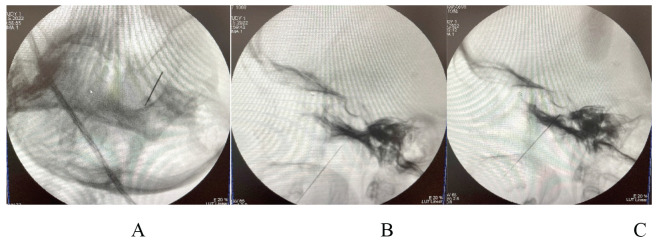
*Figure 1. A Passage of the needle through the lateral part of the foramen ovale, B advancement of the needle towards the Gasseri ganglia, C position of the needle for radiofrequency ablation of... Source: [TREATMENT OPTIONS FOR TRIGEMINAL NEURALGIA](https://pmc.ncbi.nlm.nih.gov/articles/PMC9942467/) — Acta Clinica Croatica 2022; CC BY-NC-ND.*

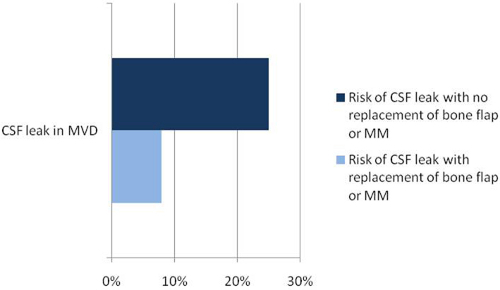
*Figure 9. Source: [Microvascular Decompression: Salient Surgical Principles and Technical Nuances](https://pmc.ncbi.nlm.nih.gov/articles/PMC3196190/) — J Vis Exp. 2011 Jul 5;(53):2590. doi: 10.3791/2590; CC BY-NC-ND.*

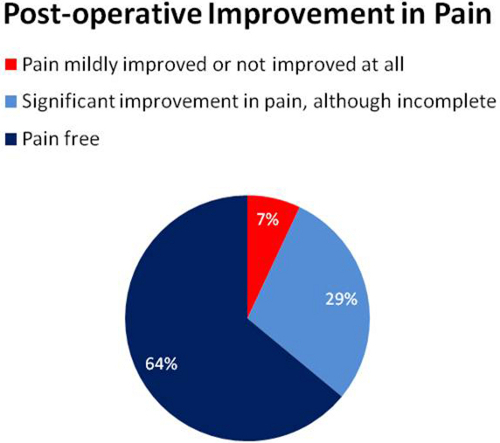
*Figure 10. Source: [Microvascular Decompression: Salient Surgical Principles and Technical Nuances](https://pmc.ncbi.nlm.nih.gov/articles/PMC3196190/) — J Vis Exp. 2011 Jul 5;(53):2590. doi: 10.3791/2590; CC BY-NC-ND.*

<!-- END CURATED IMAGE SET -->

---

## History of Present Illness
- Chief complaint: Lancinating/electric shock-like facial pain
- Duration:
- Distribution: V1 / V2 / V3 / combination
  - V1 (ophthalmic): Forehead, upper eyelid
  - V2 (maxillary): Cheek, upper lip, upper teeth, nasal ala
  - V3 (mandibular): Lower jaw, lower lip, lower teeth, tongue
- Triggers: Chewing, talking, brushing teeth, wind on face, light touch
- Character: Lancinating/shooting/electric (classic Type 1) vs constant aching (Type 2/atypical)
- Frequency of attacks:
- Pain-free intervals between attacks:
- BNI pain scale:
- **Medical management tried:**
  - Carbamazepine (first-line): Dose ___, response ___
  - Oxcarbazepine: Dose ___, response ___
  - Baclofen, gabapentin, lamotrigine:
  - Side effects / intolerance:
- **Prior procedures:** Percutaneous rhizotomy, gamma knife, prior MVD
- **Red flags for secondary TN:** Age < 40, bilateral symptoms, sensory loss, constant pain → consider MS, tumor

---

## Past Medical History
- Multiple sclerosis (secondary TN — MVD less effective)
- Prior TN procedures (percutaneous, gamma knife, prior MVD)
- Hearing loss (ipsilateral — affects approach risk)
- Other cranial nerve pathology
- Allergies:
- Medications:

---

## Imaging Review
### MRI Brain with Thin-Cut Posterior Fossa Sequences
- **CISS/FIESTA sequence** (high-resolution T2):
  - Identify vascular loop at trigeminal root entry zone (REZ)
  - **Offending vessel:**
    - Superior cerebellar artery (SCA) — most common (~75%)
    - Anterior inferior cerebellar artery (AICA) — second most common
    - Vertebral artery / basilar artery — large vessel contact
    - Vein (petrosal vein, bridging vein) — less favorable for MVD
    - Combination
  - Side of compression (dorsal, ventral, cranial, caudal)
  - Nerve displacement / distortion / atrophy
- **MRI brain:** Rule out tumor (CPA epidermoid, meningioma, schwannoma causing secondary TN)
- **Demyelinating plaques** (if MS suspected)

### MRA / CTA
- Course of offending vessel
- Relationship to brainstem and CN V
- Arterial anatomy of posterior circulation

### Audiology
- **Baseline audiogram** — BAER monitoring requires serviceable hearing
- Document any pre-existing hearing loss

---

## Labs
- CBC, BMP, Coags
- Type and screen
- Carbamazepine level (if still on it — important for perioperative management)

---

## Neurological Examination
### Trigeminal Nerve (CN V)
- **Sensation:** V1, V2, V3 (light touch, pinprick) — should be NORMAL in classic TN (deficit suggests secondary cause)
- **Motor:** Masseter, temporalis, pterygoids — should be normal
- **Corneal reflex:** Present/absent (V1)
- **Trigger zones:** Map carefully

### Other Cranial Nerves (Posterior Fossa)
- **CN VII:** Facial symmetry/strength
- **CN VIII:** Hearing — Weber, Rinne, audiogram results
- **CN IX, X:** Palate, gag, voice
- **CN XI:** SCM, trapezius
- **CN XII:** Tongue

### Cerebellar
- Finger-to-nose, heel-to-shin, gait — baseline for posterior fossa surgery

---

## Surgical Planning

### Case Logistics, OR Needs & Orders
- **Typical bed:** step-down or ICU for posterior fossa decompression/MVD, especially with sleep apnea, lower-CN risk, hydrocephalus, or difficult nausea/pain control.
- **OR setup:** Mayfield, microscope, cranial nerve monitoring/BAER for MVD, Teflon/felt and microinstruments, dural graft/sealant for Chiari, and watertight closure materials.
- **Special needs:** arterial line optional by comorbidity/position, antiemetic plan, steroid plan by edema/aseptic meningitis risk, airway/OSA precautions, and CSF-leak/pseudomeningocele strategy.
- **Immediate postop orders:** posterior fossa neuro checks, facial/hearing/swallow exam as relevant, nausea/pain control, HOB 30, CT/MRI if concern or protocol, wound/CSF leak watch, and activity restrictions.

### Diagnosis & Indication
- Working diagnosis: Classic trigeminal neuralgia (Type 1), medically refractory
- Surgical indication: Failed adequate trial of at least two medications (carbamazepine + one other), intolerable side effects, or patient preference for definitive treatment
- Goals: Identify and decompress the offending vessel from the trigeminal nerve REZ
- **MVD advantages:** Highest long-term cure rate (~80% at 10 years), non-destructive (preserves CN V function)
- **Alternatives discussed:**
  - Percutaneous procedures (balloon compression, glycerol rhizotomy, radiofrequency thermocoagulation)
  - Gamma Knife radiosurgery
  - Continued medical management

### Position
- **Patient position:** Lateral decubitus (park bench) with ipsilateral side UP — OR supine with head turned contralateral
- **Park bench preferred:**
  - Ipsilateral side up (affected side up)
  - Axillary roll under dependent arm
  - Lower leg flexed, upper leg straight, pillow between legs
  - Head flexed (chin toward chest) — opens angle between cerebellum and petrous bone
  - Head slightly rotated (face toward floor) — mastoid is highest point
  - Vertex tilted slightly toward floor
- **Skull clamp:** Mayfield 3-pin
- **Retrosigmoid exposure:** Mastoid highest point of the field
- **Table:** Neutral or slight reverse Trendelenburg

### Incision
- **Type:** Curvilinear or linear incision behind the ear
- **Landmarks:**
  - 2 fingerbreadths behind the ear
  - Centered at the level of the transverse-sigmoid sinus junction (estimated: asterion)
  - ~5-6 cm length

### Approach: Retrosigmoid Craniotomy

### Key Surgical Steps
1. **Incision** — retromastoid curvilinear, centered on asterion
2. **Suboccipital craniectomy/craniotomy** — ~2.5 x 2.5 cm
   - Expose the junction of the transverse and sigmoid sinuses
   - Keyhole burr hole just inferior and medial to the asterion
   - Bone removal to expose the edge of the sigmoid sinus laterally and transverse sinus superiorly
3. **Dural opening** — curvilinear, based on sigmoid/transverse sinus junction
4. **CSF drainage** — open cisterna magna or lateral cerebellomedullary cistern early for cerebellar relaxation
5. **Cerebellar retraction** — MINIMAL, gravity-assisted; brain relaxes after CSF drainage
6. **Identify CN V** — follows the trigeminal nerve from the pons to Meckel's cave
7. **Identify the offending vessel:**
   - **SCA:** Most commonly compresses from superiorly or superomedially at the REZ
   - **AICA:** Compresses from inferiorly or laterally
   - **Vertebral/basilar:** Large vessel indentation
   - **Vein:** May run along the nerve
   - Look for nerve compression, distortion, or grooving at the REZ (proximal 5mm of nerve where central myelin transitions to peripheral myelin)
8. **Mobilize the offending vessel** — gently dissect the vessel away from the nerve
9. **Place Teflon felt pledget** — interpose between the vessel and the nerve to prevent re-contact
   - Shape and size the Teflon to keep the vessel displaced
   - Do NOT pack Teflon too tightly (can cause new compression)
10. **Inspect for additional compressive vessels** — multiple vessels may be present
11. **If venous compression:** Decision to coagulate and divide vs. transpose. Veins are harder to decompress; petrosal vein sacrifice is sometimes necessary but risks venous infarction
12. **If NO clear offending vessel found:**
    - Inspect thoroughly (360 degrees around nerve)
    - Consider arachnoid bands causing tethering
    - May still decompress (some occult compression)
    - Consider partial sensory rhizotomy as adjunct (less preferred)
13. **Hemostasis and inspection** — ensure no bleeding, cerebellar surface intact
14. **Dural closure** — watertight (primary or with dural graft)
15. **Cranioplasty** — replace bone or methylmethacrylate/titanium mesh over defect
16. **Standard closure**

### Critical Anatomy & Structures at Risk
1. **Trigeminal nerve (CN V)** — the nerve being decompressed; avoid manipulation/traction
2. **CN VII/VIII complex** — runs inferior to CN V in the CPA; at risk during approach
3. **AICA** — gives off the labyrinthine artery (supplies inner ear); avoid compression or vasospasm
4. **Superior petrosal vein (Dandy vein)** — drains lateral cerebellar surface; sacrifice may be needed for exposure but risks venous infarction
5. **Cerebellar surface** — avoid excessive retraction
6. **Sigmoid and transverse sinuses** — lateral and superior limits of craniotomy; injury causes hemorrhage
7. **Vertebral artery** — deep in the CPA; at risk with large vessel decompression
8. **Brainstem** — medial limit; avoid any instrument contact

### Equipment
- Operating microscope (essential)
- High-speed drill (craniotomy)
- Microsurgical instruments
- Teflon felt (for decompression pledgets)
- Bipolar forceps (fine tip)
- Brain retractor (small, self-retaining — minimal use)
- Hemostatic agents (Surgicel, Gelfoam)
- Bone fixation or cranioplasty material

### Monitoring
- **BAER (Brainstem Auditory Evoked Responses)** — monitors CN VIII; changes suggest AICA/labyrinthine artery compromise
- **Facial nerve EMG (CN VII)** — detects inadvertent facial nerve stimulation
- **Lateral spread response (LSR)** — for hemifacial spasm (not TN, but done in same approach)
- SSEPs

### Anesthesia Considerations
- Arterial line
- Foley
- Cefazolin 2g IV
- Dexamethasone 10 mg IV
- No paralytic after intubation (EMG monitoring)
- Mannitol 0.5-1 g/kg (for cerebellar relaxation)
- Antiemetic prophylaxis (posterior fossa surgery → high nausea risk)

### Potential Complications & Contingencies
1. **Hearing loss** — AICA/labyrinthine artery compromise; monitor BAER; if changes, release retraction, check vessel
2. **Facial nerve palsy** — traction injury during approach; gentle technique, monitor EMG
3. **CSF leak** — watertight dural closure; if leak post-op, may need lumbar drain or wound revision
4. **Cerebellar hematoma/edema** — minimize retraction; if post-op deficit, emergent CT
5. **Aseptic meningitis** — chemical irritation from Teflon; steroids, supportive care
6. **Incomplete relief** — ~70-80% pain-free at 5 years; recurrence may need reoperation or radiosurgery
7. **Facial numbness** — usually from nerve manipulation; typically mild and improves
8. **Venous infarction** — from petrosal vein sacrifice; minimize vein sacrifice

---

## Operative Note Template

**Preoperative Diagnosis:** [Left/Right] trigeminal neuralgia (Type 1), medically refractory

**Postoperative Diagnosis:** Same; [SCA/AICA/vertebral artery/vein] compression of [left/right] trigeminal nerve at the root entry zone identified and decompressed

**Procedure:** [Left/Right] retrosigmoid craniotomy for microvascular decompression of the trigeminal nerve

[Include: positioning details (park bench), craniotomy size, CSF drainage, CN V identification, offending vessel identification and characterization (SCA/AICA, direction of compression, groove/distortion on nerve), Teflon pledget placement, BAER monitoring stability, watertight closure]

---

## Postoperative Plan
- ICU or step-down x 24 hours (posterior fossa surgery)
- Neuro checks q1h x 24h (posterior fossa-specific: CN function, mental status, breathing pattern)
- **Posterior fossa danger signs:** Decreasing consciousness, irregular breathing, new CN deficit, cerebellar signs → EMERGENT CT → possible return to OR
- HOB 30 degrees
- CT head within 6 hours (rule out posterior fossa hematoma)
- Audiogram before discharge (compare to baseline)
- Trigeminal function assessment: Sensation V1/V2/V3, corneal reflex
- Facial nerve function: Symmetry, House-Brackmann grade
- **Pain assessment:** Expect immediate relief if decompression successful; may take days-weeks for full effect
- **Taper TN medications SLOWLY** (not immediately) — carbamazepine taper over 2-4 weeks
- Anti-emetics PRN (high nausea rate after posterior fossa surgery)
- DVT prophylaxis: SCDs, heparin SQ POD1
- Dexamethasone taper
- Wound care: Keep dry x 48h
- Activity: No heavy lifting x 4-6 weeks
- Follow-up: Clinic 2-4 weeks; long-term follow-up for recurrence monitoring
- Long-term success: ~70-80% pain-free at 5 years; ~90% initial success
