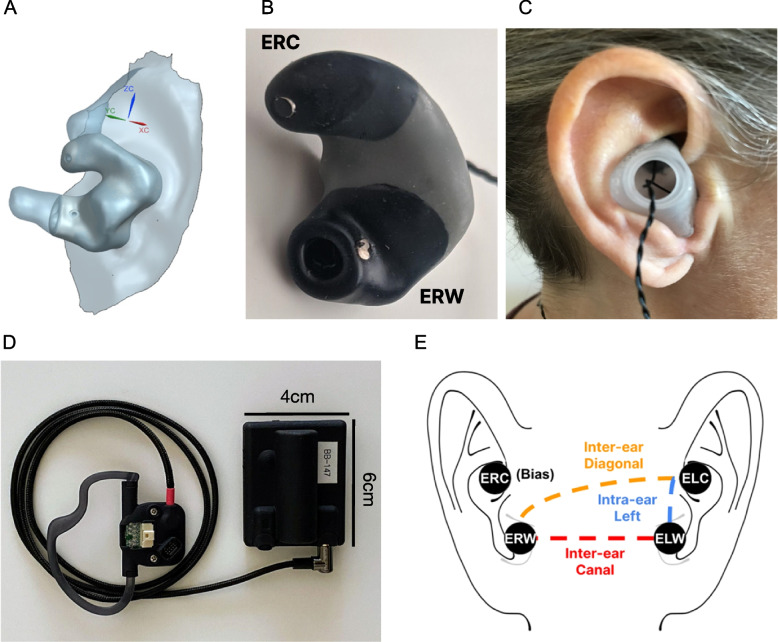
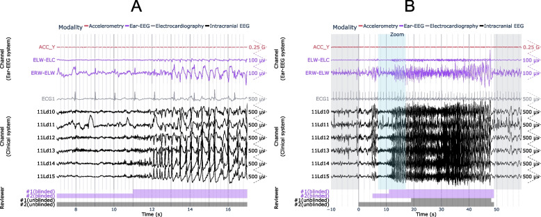
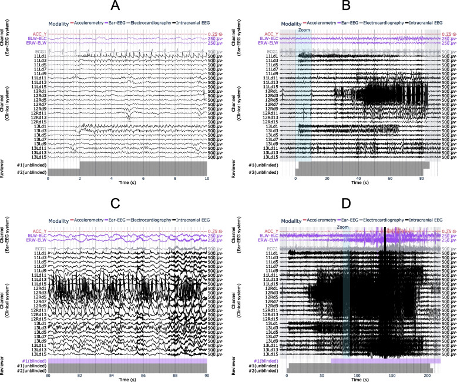
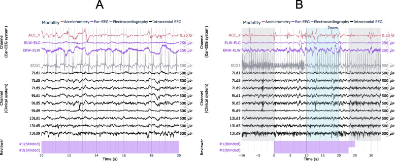
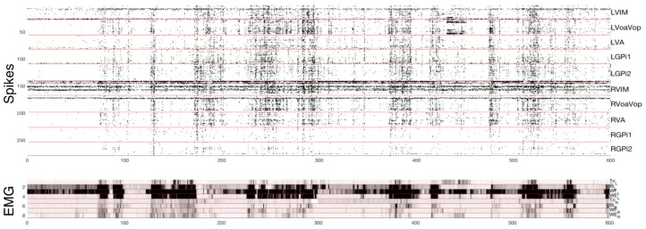
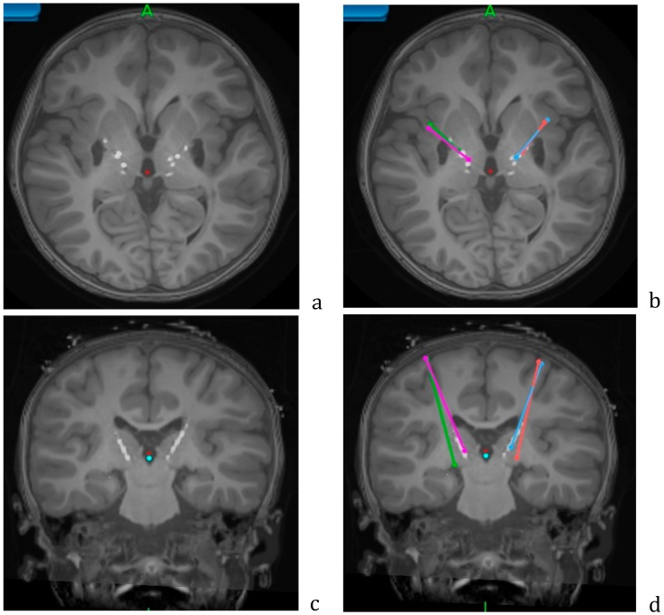
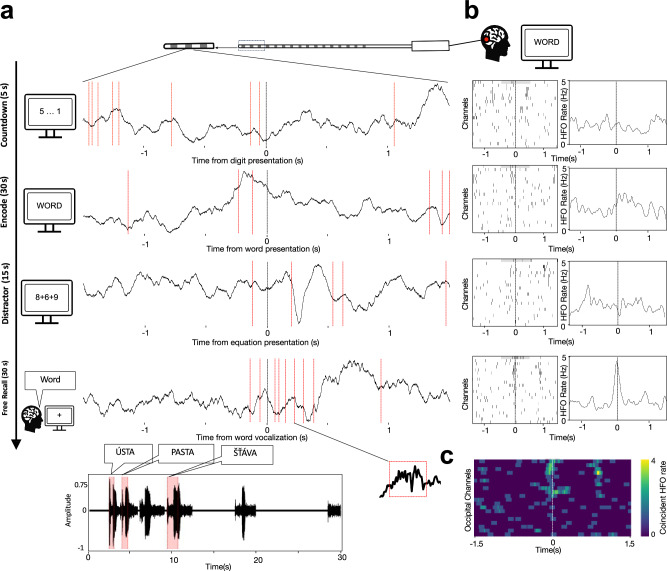
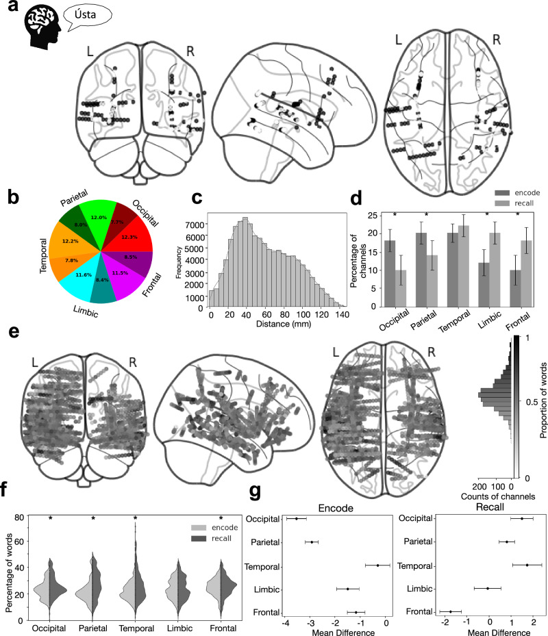
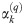
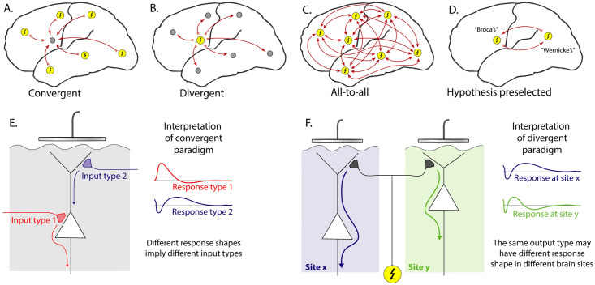

# Case Prep: Stereo-EEG (SEEG) Depth Electrode Placement

---

<!-- BEGIN CASE SNAPSHOT -->

## Case / Approach Snapshot

- **Anatomy at risk:** target nuclei or cortical regions, trajectories, vessels, ventricles, cranial nerves, white-matter tracts, and stimulation/lesion side-effect pathways.
- **Operative steps:** confirm diagnosis and target, plan trajectory or exposure, use mapping/monitoring/stereotaxy as appropriate, place/lesion/resect with physiologic confirmation, close hardware or wound, and plan programming/follow-up; use the detailed operative sequence and approach notes below as the step-by-step source.
- **Rescue plans:** hemorrhage, seizure, neurologic or mood/cognitive change, lead/device migration or infection, stimulation side effects, hardware failure, and revision or programming strategy.
- **Figures:** review [Figures, Imaging & Video](#figures-imaging--video) and the [Curated Image Set](#curated-image-set); embedded local figures should remain open-access, public-domain, or otherwise reusable with attribution.
- **Papers:** review [High-Yield Literature](#high-yield-literature) for seminal sources, modern reviews, and outcome data specific to this page.

<!-- END CASE SNAPSHOT -->

## One-Liner
[Age]yo [M/F] with medically refractory focal epilepsy and non-localizing/discordant non-invasive workup planned for stereo-EEG depth electrode implantation to localize the epileptogenic zone.

---

## Figures, Imaging & Video

**🎥 Operative video** — [search operative video on YouTube ▸](https://www.youtube.com/results?search_query=stereoelectroencephalography+surgery) · [The Neurosurgical Atlas ▸](https://www.neurosurgicalatlas.com)

[Neurosurgical Atlas](https://www.neurosurgicalatlas.com) · [Radiopaedia](https://radiopaedia.org/search?q=stereoelectroencephalography&scope=all) · [PubMed Central](https://www.ncbi.nlm.nih.gov/pmc/?term=stereo+EEG+robot+implantation) — operative figures © linked; see [media-sources.md](../../resources/media-sources.md)

---

<!-- BEGIN CURATED LITERATURE -->

## High-Yield Literature

- **Depth-to-scalp spatiotemporal dynamics for stereo-EEG** — Benoliel T. Epilepsy & behavior reports 2025. [PubMed](https://pubmed.ncbi.nlm.nih.gov/40895179/)
- **Stereo-EEG Implantation Strategy** — Kalamangalam GP. Journal of clinical neurophysiology : official publication of the American Electroencephalographic Society 2016. [PubMed](https://pubmed.ncbi.nlm.nih.gov/27918343/)
- **Fast Automated Stereo-EEG Electrode Contact Identification and Labeling Ensemble** — Ervin B. Stereotactic and functional neurosurgery 2021. [PubMed](https://pubmed.ncbi.nlm.nih.gov/33849046/)
- **Electrode and brain modeling in stereo-EEG** — von Ellenrieder N. Clinical neurophysiology : official journal of the International Federation of Clinical Neurophysiology 2012. [PubMed](https://pubmed.ncbi.nlm.nih.gov/22364724/)
- **Modeling the Impact of Electrode/Tissue Geometry on Electrical Stimulation in Stereo-EEG** — Shindhelm AC. Journal of clinical neurophysiology : official publication of the American Electroencephalographic Society 2023. [PubMed](https://pubmed.ncbi.nlm.nih.gov/34482315/)
- **Comparison of EEG Signal Characteristics of Subdural and Depth Electrodes** — Alkawadri CI. Journal of clinical neurophysiology : official publication of the American Electroencephalographic Society 2024. [PubMed](https://pubmed.ncbi.nlm.nih.gov/39787440/)
- **The Insula and Its Epilepsies** — Jobst BC. Epilepsy currents 2019. [PubMed](https://pubmed.ncbi.nlm.nih.gov/30838920/)
- **Somatic Mosaic Pathogenic Variant Gradient Detected in Trace Brain Tissue From Stereo-EEG Depth Electrodes** — Ye Z. Neurology 2022. [PubMed](https://pubmed.ncbi.nlm.nih.gov/36192176/)
- **Bridging surface and depth: A systematic review of seizure patterns in simultaneous scalp and stereo-EEG** — Santos C. Epilepsy research 2025. [PubMed](https://pubmed.ncbi.nlm.nih.gov/40986982/)
- **Analysis of DNA from brain tissue on stereo-EEG electrodes reveals mosaic epilepsy-related variants** — D'Gama AM. Brain communications 2025. [PubMed](https://pubmed.ncbi.nlm.nih.gov/40177531/)

<!-- END CURATED LITERATURE -->

---

<!-- BEGIN CURATED IMAGE SET -->

## Curated Image Set

Open-access figures are embedded from PubMed Central articles and kept unique to this guide.

*Fig. 1. Ear-EEG system. a 3D anatomical ear model obtained through optical ear scan. b A custom-made earbud with two electrodes per ear – Ear Right Cymba (ERC) placed in the cymba conchae and... Source: [Using a standalone ear-EEG device for focal-onset seizure detection](https://pmc.ncbi.nlm.nih.gov/articles/PMC10848360/) — Bioelectronic Medicine 2024; CC BY.*

*Fig. 3. Example ear-EEG waveforms from a subclinical focal seizure detected during sleep. A 10 s window of interest is expanded in (a) and indicated in (b) by the “Zoom” region (blue), which... Source: [Using a standalone ear-EEG device for focal-onset seizure detection](https://pmc.ncbi.nlm.nih.gov/articles/PMC10848360/) — Bioelectronic Medicine 2024; CC BY.*

*Fig. 5. Examples of seizures from the same patient, with (a, b) false negative and (c, d) true positive results using ear-EEG. A 10 s window of interest is expanded in (a, c) and indicated in... Source: [Using a standalone ear-EEG device for focal-onset seizure detection](https://pmc.ncbi.nlm.nih.gov/articles/PMC10848360/) — Bioelectronic Medicine 2024; CC BY.*

*Fig. 6. Example of false positive seizure identified on the ear-EEG. A 10 s window of interest is expanded in (a) and indicated in (b) by the “Zoom” region (blue), which falls within the full... Source: [Using a standalone ear-EEG device for focal-onset seizure detection](https://pmc.ncbi.nlm.nih.gov/articles/PMC10848360/) — Bioelectronic Medicine 2024; CC BY.*

*Figure 2. Top: microelectrode recordings with identified spikes from 250 distinct cells. Intracerebral recording locations are identified on the right. Bottom: Muscle activity (electromyograph,... Source: [Pediatric Deep Brain Stimulation Using Awake Recording and Stimulation for Target Selection in an Inpatient Neuromodulation Monitoring Unit](https://pmc.ncbi.nlm.nih.gov/articles/PMC6070881/) — Brain Sciences 2018; CC BY.*

*Figure 4. Axial (a,b) and coronal (c,d) views of the postoperative CT overlaid on the preoperative MRI, showing the lead locations for the Adtech stereo EEG leads. Planned trajectories for... Source: [Pediatric Deep Brain Stimulation Using Awake Recording and Stimulation for Target Selection in an Inpatient Neuromodulation Monitoring Unit](https://pmc.ncbi.nlm.nih.gov/articles/PMC6070881/) — Brain Sciences 2018; CC BY.*

*Fig. 1. Cortical HFO bursts co-occur during memory encoding and at the time of recall.a Raw LFP traces from an example macro-electrode contact implanted in the occipital cortex show timepoints... Source: [Global coincident bursts of high frequency oscillations across the human cortex coordinate large-scale memory processing](https://pmc.ncbi.nlm.nih.gov/articles/PMC13136343/) — Nature Communications 2026; CC BY.*

*Fig. 4. Widely distributed networks of coincident bursting are involved in encoding and recalling words.a Localization of electrode channels that displayed coincident HFO bursting (black dots)... Source: [Global coincident bursts of high frequency oscillations across the human cortex coordinate large-scale memory processing](https://pmc.ncbi.nlm.nih.gov/articles/PMC13136343/) — Nature Communications 2026; CC BY.*

*Fig 4. Projection of basis profile curves (BPCs).A: The contribution of each BPC Bq to a single trial from its cluster can be quantified according to a scalar multiplier αk(q), and residual... Source: [Basis profile curve identification to understand electrical stimulation effects in human brain networks](https://pmc.ncbi.nlm.nih.gov/articles/PMC8412306/) — PLoS Computational Biology 2021; CC BY.*

*Fig 1. Cortico-cortical evoked potential analysis paradigms.A: Convergent—Evoked responses at one chosen site (gray circle) are compared with the effect of stimulating all other sites (yellow... Source: [Basis profile curve identification to understand electrical stimulation effects in human brain networks](https://pmc.ncbi.nlm.nih.gov/articles/PMC8412306/) — PLoS Computational Biology 2021; CC BY.*

<!-- END CURATED IMAGE SET -->

---

## History of Present Illness
- Chief complaint: Drug-resistant focal epilepsy requiring invasive monitoring to define the seizure-onset zone before resection
- Non-invasive data (semiology, scalp video-EEG, MRI, PET, SPECT, MEG, neuropsych) — formulated into an **implantation hypothesis** at epilepsy conference
- Goal: sample hypothesized onset zone + propagation network + eloquent areas to define resectability

---

## Imaging Review
### MRI (epilepsy protocol) + Vascular imaging
- Target structures per hypothesis (mesial temporal, insula, cingulate, frontal, etc.)
- **Vascular imaging (MRA/MRV, CTA, or gadolinium MRI)** — plan avascular trajectories (avoid sulcal vessels — hemorrhage is the main risk)
- Plan each electrode's entry, trajectory, target with stereotactic planning software

### Planning
- Multi-electrode plan (often 8-15 electrodes), each avoiding vessels/sulci, orthogonal or oblique trajectories

---

## Labs
- CBC, BMP, **Coags (normal — hemorrhage risk)**, Type and screen

---

## Neurological Examination
- Baseline; document for post-implant monitoring

---

## Surgical Planning

### Technique
- **Robot-assisted (ROSA, Mazor) or frame-based/frameless stereotaxy** — accurate placement of multiple depth electrodes
- Each electrode placed via small twist-drill hole and anchored bolt

### Implantation Hypothesis Checklist
- Every electrode should answer a conference-level question: seizure onset, early propagation, competing mimic, eloquent boundary, or lateralization problem.
- Sample the suspected onset zone and its network, not just the obvious MRI lesion; common under-sampled regions include insula, cingulate, mesial temporal, orbitofrontal, operculum, hypothalamic/temporal-plus networks, and contralateral homologues.
- Pair depth targets with the noninvasive evidence that justifies them: semiology, scalp EEG, MRI, PET/SPECT/MEG, neuropsychology, and prior resection/ablation data.
- Avoid a "fishing expedition" plan: broad coverage without a falsifiable hypothesis increases hemorrhage risk and may still leave no resection/ablation strategy.
- Pre-plan the likely exit path after monitoring: resection, LITT/RF thermocoagulation, RNS/DBS, palliative disconnection, or no surgery.

### Trajectory Safety Checks
- Fuse contrast MRI/CTA/CTV or angiographic venous imaging so each trajectory avoids cortical arteries, sulcal veins, deep veins, choroidal vessels, and ventricles where possible.
- Choose orthogonal versus oblique entry based on the target and vascular map; oblique trajectories may improve sampling but increase cumulative vessel-crossing and collision risk.
- Confirm bolt spacing, robot arm clearance, skull thickness/angle, prior craniotomy defects, shunt hardware, and planned dressing/EMU cable routing before incision.
- For each electrode, verify entry point, target, length, contact coverage, laterality label, and no trajectory collision after final registration.

### Position
- Supine or per plan; head fixed (frame or robot reference); registration (fiducials/surface/bone)

### Key Surgical Steps
1. Register patient to planning (robot/frame); confirm accuracy
2. For each planned electrode:
   - Robot/arm aligns to trajectory
   - Stab incision, **twist-drill** through skull
   - Open dura (monopolar/stylet), place anchor bolt
   - Insert depth electrode to planned length, secure in bolt
3. Repeat for all electrodes per plan
4. Confirm no hemorrhage and electrode positions with **intraoperative/postop CT**, merge with planning MRI
5. Dress, connect to monitoring

### Critical Anatomy & Structures at Risk
1. **Cortical/sulcal vessels** along each trajectory — **hemorrhage is the principal risk**
2. Deep vessels, ventricles
3. Eloquent cortex (sampled but not injured by small electrodes)

### Equipment
- Robot (ROSA/Mazor) or stereotactic frame, planning software
- Twist drill, anchor bolts, depth (SEEG) electrodes
- Intraoperative/postop CT, registration tools

### Anesthesia
- General anesthesia; BP control (hemorrhage); often AEDs reduced AFTER implant (to capture seizures during monitoring — coordinate with epileptology)

### Potential Complications
1. **Hemorrhage** (along trajectory) — main serious complication (~1-2%)
2. Infection, electrode misplacement/malfunction
3. Post-explant: rare; seizure during monitoring (intended)

### Monitoring, Explant, and Rescue Plans
- **Immediate post-implant:** obtain CT and merge to preoperative plan before EMU transfer; document electrode names, contact anatomy, deviations, and any asymptomatic hemorrhage.
- **EMU strategy:** antiseizure medication taper, sleep deprivation, stimulation mapping, and rescue benzodiazepine plan should be written by epileptology and visible to nursing.
- **Hemorrhage:** stop anticoagulants/antiplatelets, control BP, repeat imaging for symptoms or hematoma expansion, and remove only electrodes that worsen mass effect or block evacuation.
- **Malposition or poor signal:** determine whether the electrode still answers the hypothesis; revise early if the target is essential and the risk is acceptable, otherwise mark it unusable in interpretation.
- **Infection/CSF leak/bolt issue:** culture and image when needed, remove suspect hardware if infection tracks along the bolt, and avoid prolonged monitoring when wound integrity is failing.
- **Non-diagnostic monitoring:** decide at epilepsy conference whether the failure is insufficient seizure capture, wrong hypothesis, network too broad, medication confound, or technical coverage gap; do not force a resection from ambiguous data.
- **Explantation:** bedside versus OR depends on institutional practice, anticoagulation, patient cooperation, number/depth of electrodes, and any hemorrhage/infection concern; inspect every electrode for intact removal.

---

## Procedure Note Template

**Preoperative Diagnosis:** Drug-resistant focal epilepsy requiring invasive localization

**Postoperative Diagnosis:** Same

**Procedure:** Stereo-EEG depth electrode implantation ([N] electrodes) via [robot-assisted (ROSA/Mazor) / frame-based] stereotaxy

**Surgeon / Assistant:**
**Anesthesia:** General endotracheal
**EBL / Fluids:** Minimal
**Adjuncts:** Robot/stereotactic frame, planning software, intraoperative/postop CT; vascular imaging for trajectories
**Implants:** [N] SEEG depth electrodes with anchor bolts
**Complications:** None

**Indications:** [Age]yo [M/F] with drug-resistant focal epilepsy and non-localizing/discordant non-invasive data; an implantation hypothesis was formulated at conference to sample the suspected onset zone, propagation network, and eloquent areas. Risks (hemorrhage, infection) discussed.

**Description of Procedure:** After consent and time-out, general anesthesia was induced and the patient registered to the [robot/frame] with accuracy verified on known landmarks. For each planned electrode, the [robot arm] aligned to the pre-planned avascular trajectory; a stab incision was made, a **twist-drill** passed through the skull, the dura opened, an **anchor bolt** placed, and the **depth electrode** inserted to the planned length and secured. This was repeated for all [N] electrodes per the plan.

An **intraoperative/postoperative CT was obtained and merged with the planning MRI to confirm electrode positions and exclude hemorrhage.** The electrodes were connected for monitoring.

The patient was transferred to the epilepsy monitoring unit; AEDs were reduced per epileptology to capture habitual seizures.

---

## Postoperative Plan
- Floor/EMU (epilepsy monitoring unit), neuro checks
- **Postop CT** (hemorrhage, electrode positions), merge with MRI for localization
- Transfer to EMU for video-SEEG monitoring; **reduce AEDs** to capture habitual seizures
- Cortical stimulation mapping via electrodes (eloquent cortex, seizure provocation)
- After monitoring: define epileptogenic zone → plan resection/ablation; **electrode explantation** (bedside or OR)
- Epilepsy conference for surgical decision
