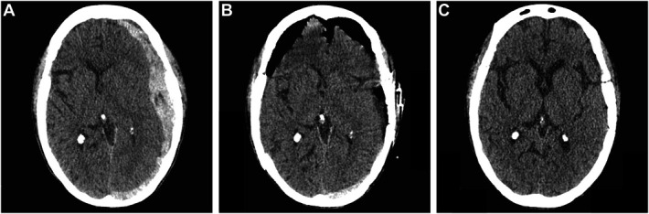
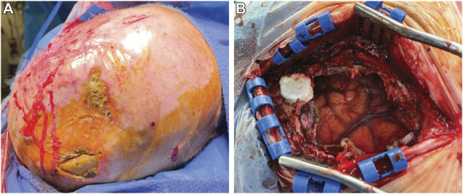
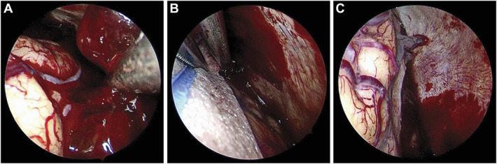
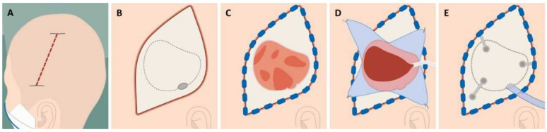
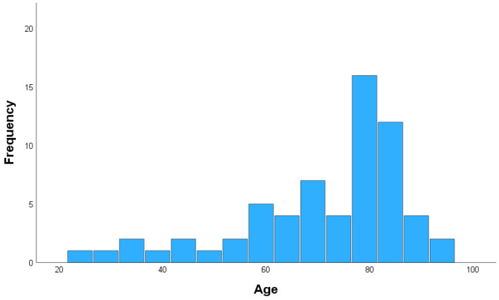
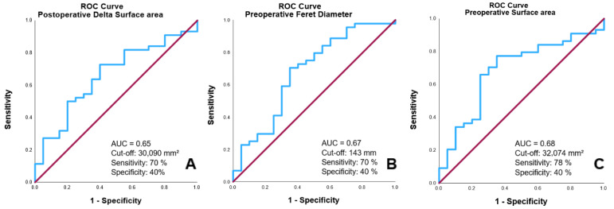
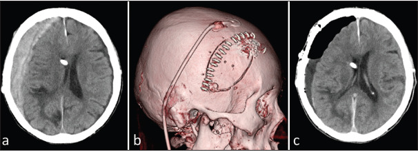
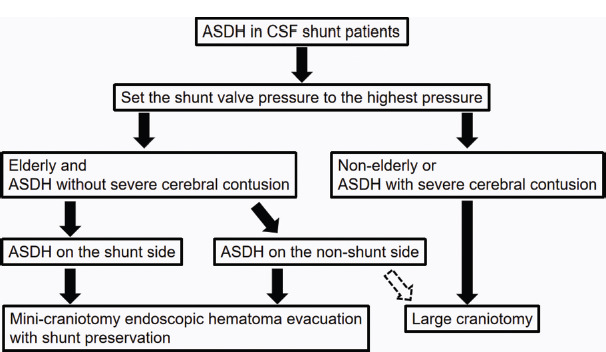
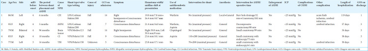

# Case Prep: Acute Subdural Hematoma (aSDH) — Craniotomy/Craniectomy for Evacuation

---

## One-Liner
[Age]yo [M/F] with acute [left/right] subdural hematoma [___ mm max thickness, ___ mm midline shift] following [trauma/spontaneous/anticoagulation] presenting with [GCS ___/hemiparesis/pupil changes] planned for emergent [craniotomy/decompressive craniectomy] for evacuation.

---

## Figures, Imaging & Video

**🎥 Operative video** — [search operative video on YouTube ▸](https://www.youtube.com/results?search_query=acute+subdural+haematoma+surgery) · [The Neurosurgical Atlas ▸](https://www.neurosurgicalatlas.com)

[Neurosurgical Atlas](https://www.neurosurgicalatlas.com) · [Radiopaedia](https://radiopaedia.org/search?q=acute%20subdural%20haematoma&scope=all) · [PubMed Central](https://www.ncbi.nlm.nih.gov/pmc/?term=acute+subdural+hematoma+craniotomy) — operative figures © linked; see [media-sources.md](../../resources/media-sources.md)

---

<!-- BEGIN TEXTBOOK CROSS-CHECKS -->

## Textbook Cross-Checks

- **Emergency anatomy and exposure:** Greenberg; Youmans and Winn; Schmidek and Sweet — confirm incision/flap planning, sinus/vessel risks, decompression goals, and mass-effect physiology.
- **Technique sequence:** Greenberg; Youmans and Winn — review evacuation/decompression sequence, hemostasis, dural strategy, drain use, and bone-flap/cranioplasty decisions.
- **Complication rescue:** Greenberg; trauma guidelines and primary literature — summarize swelling, coagulopathy, seizures, infection, hydrocephalus, and ICU surveillance in original words.
- **Copyright-safe use:** cite these sources as private cross-checks, then write the guide content in original words; do not re-host textbook pages, figures, tables, or board-review card material. See [Source Crosswalk & Copyright-Safe Use](../../resources/source-crosswalk.md).

<!-- END TEXTBOOK CROSS-CHECKS -->

<!-- BEGIN CURATED LITERATURE -->

## High-Yield Literature

- **Optimizing shunt integrity during acute subdural hematoma evacuation** — Tanaka T. Surgical neurology international 2024. [PubMed](https://pubmed.ncbi.nlm.nih.gov/39372979/)
- **Predictive Factors of Outcomes in Acute Subdural Hematoma Evacuation** — Manan Z. Cureus 2022. [PubMed](https://pubmed.ncbi.nlm.nih.gov/36540499/)
- **Acute Subdural Hematoma Evacuation: Predictive Factors of Outcome** — Lavrador JP. Asian journal of neurosurgery 2018. [PubMed](https://pubmed.ncbi.nlm.nih.gov/30283506/)
- **Contralateral acute subdural hematoma following traumatic acute subdural hematoma evacuation** — Shen J. Neurologia medico-chirurgica 2013. [PubMed](https://pubmed.ncbi.nlm.nih.gov/23615411/)
- **Cardiopulmonary hemodynamic changes during acute subdural hematoma evacuation** — Tamaki T. Neurologia medico-chirurgica 2006. [PubMed](https://pubmed.ncbi.nlm.nih.gov/16723813/)
- **Fatal postoperative tension pneumocephalus after acute subdural hematoma evacuation: a case report** — Gkantsinikoudis N. The International journal of neuroscience 2025. [PubMed](https://pubmed.ncbi.nlm.nih.gov/38716712/)
- **Contralateral subdural hematoma development following unilateral acute subdural hematoma evacuation** — Shibahashi K. British journal of neurosurgery 2017. [PubMed](https://pubmed.ncbi.nlm.nih.gov/27447887/)
- **Role of surgical modality and timing of surgery as clinical outcome predictors following acute subdural hematoma evacuation** — Altaf I. Pakistan journal of medical sciences 2020. [PubMed](https://pubmed.ncbi.nlm.nih.gov/32292444/)
- **PROMISE: Prognostic Radiomic Outcome Measurement in Acute Subdural Hematoma Evacuation Post-Craniotomy** — Guranda A. Brain sciences 2025. [PubMed](https://pubmed.ncbi.nlm.nih.gov/39851426/)
- **Surgery for contralateral acute epidural hematoma following acute subdural hematoma evacuation: five new cases and a short literature review** — Shen J. Acta neurochirurgica 2013. [PubMed](https://pubmed.ncbi.nlm.nih.gov/23238942/)

<!-- END CURATED LITERATURE -->

---

<!-- BEGIN CURATED IMAGE SET -->

## Curated Image Set

Open-access figures are embedded from PubMed Central articles and kept unique to this guide.

*FIGURE 1.. Preoperative and Postoperative imaging. A, Axial, head CT images demonstrate acute, left-sided subdural hematoma measuring 20.6 mm in maximum thickness with 9 mm in midline shift. B,... Source: [Mini-Craniotomy With Endoscopic Approach for Acute Subdural Hematoma Evacuation in a Patient With Complex Scalp Flap Defect: A Case Report](https://pmc.ncbi.nlm.nih.gov/articles/PMC11809946/) — Neurosurgery Practice 2023; CC BY-NC-ND.*

*FIGURE 2.. Intraoperative photographs. A, Patient's scalp with vastus medialis flap and skin graft over the cranial vertex. Note is made of multiple areas of erosion and exposed skull. B,... Source: [Mini-Craniotomy With Endoscopic Approach for Acute Subdural Hematoma Evacuation in a Patient With Complex Scalp Flap Defect: A Case Report](https://pmc.ncbi.nlm.nih.gov/articles/PMC11809946/) — Neurosurgery Practice 2023; CC BY-NC-ND.*

*FIGURE 3.. Selected frames from endoscopic evacuation. A, View of acute hematoma in the subdural space. B, With the assistant holding the endoscope, the primary surgeon can evacuate hematoma and... Source: [Mini-Craniotomy With Endoscopic Approach for Acute Subdural Hematoma Evacuation in a Patient With Complex Scalp Flap Defect: A Case Report](https://pmc.ncbi.nlm.nih.gov/articles/PMC11809946/) — Neurosurgery Practice 2023; CC BY-NC-ND.*

*Figure 1. Surgical steps in acute subdural hematoma evacuation via craniotomy: (A) Scalp incision beginning above the ear and extending posteriorly over the temporoparietal region. (B) A single... Source: [PROMISE: Prognostic Radiomic Outcome Measurement in Acute Subdural Hematoma Evacuation Post-Craniotomy](https://pmc.ncbi.nlm.nih.gov/articles/PMC11764422/) — Brain Sciences 2025; CC BY.*

*Figure 2. Age distribution. Source: [PROMISE: Prognostic Radiomic Outcome Measurement in Acute Subdural Hematoma Evacuation Post-Craniotomy](https://pmc.ncbi.nlm.nih.gov/articles/PMC11764422/) — Brain Sciences 2025; CC BY.*

*Figure 3. ROC Curves for predicting 30-day outcomes based on postoperative changes in postoperative Δ surface area (A), preoperative Feret diameter (B), and preoperative surface area (C). Source: [PROMISE: Prognostic Radiomic Outcome Measurement in Acute Subdural Hematoma Evacuation Post-Craniotomy](https://pmc.ncbi.nlm.nih.gov/articles/PMC11764422/) — Brain Sciences 2025; CC BY.*

*Figure 1:. (a) Computed tomography (CT) on arrival showing acute subdural hematoma and shunt catheter. (b) Three-dimensional CT showing a skin incision parallel to the shunt catheter and a small... Source: [Optimizing shunt integrity during acute subdural hematoma evacuation](https://pmc.ncbi.nlm.nih.gov/articles/PMC11450916/) — Surgical Neurology International 2024; CC BY-NC-SA.*

*Figure 2:. Treatment strategy for acute subdural hematoma in shunt patients. ASDH: Acute subdural hematoma, CSF: Cerebrospinal fluid. Source: [Optimizing shunt integrity during acute subdural hematoma evacuation](https://pmc.ncbi.nlm.nih.gov/articles/PMC11450916/) — Surgical Neurology International 2024; CC BY-NC-SA.*

*Figure 9. Source: [Optimizing shunt integrity during acute subdural hematoma evacuation](https://pmc.ncbi.nlm.nih.gov/articles/PMC11450916/) — Surg Neurol Int. 2024 Sep 27;15:354. doi: 10.25259/SNI_411_2024; CC BY-NC-SA.*

*Figure 10. Source: [Optimizing shunt integrity during acute subdural hematoma evacuation](https://pmc.ncbi.nlm.nih.gov/articles/PMC11450916/) — Surg Neurol Int. 2024 Sep 27;15:354. doi: 10.25259/SNI_411_2024; CC BY-NC-SA.*

<!-- END CURATED IMAGE SET -->

---

## History of Present Illness
- Chief complaint: Altered mental status / focal deficit / pupil asymmetry
- Mechanism of trauma: Fall / MVC / assault / spontaneous
- GCS at scene → GCS in ED → GCS current:
- Pupil exam: Anisocoria (ipsilateral fixed dilated pupil = uncal herniation)
- Lucid interval:
- Anticoagulant/antiplatelet use:
- Time from injury to OR:

---

## Past Medical History
- **Anticoagulation / antiplatelet** (REVERSE IMMEDIATELY)
- Other trauma (polytrauma assessment, C-spine)
- Baseline neurological status / premorbid function
- DNR/DNI status / goals of care (if elderly with poor premorbid status)
- Allergies:
- Medications:

---

## Imaging Review
### CT Head (non-contrast) — EMERGENT
- **Side:** Left / Right
- **Max thickness:** ___ mm (surgical: typically > 10 mm or > 5 mm with symptoms)
- **Midline shift:** ___ mm (surgical: typically > 5 mm)
- **Density:** Hyperdense (acute) / mixed (acute on chronic)
- **Associated injuries:**
  - Contusions (contrecoup)
  - SAH
  - Epidural hematoma
  - Intraparenchymal hemorrhage
  - Skull fractures
  - Pneumocephalus
- **Cisterns:** Open / compressed / obliterated (compressed = herniation)
- **Hydrocephalus:**
- **Rotterdam CT score:** (mortality predictor: 1-6)

### CT C-spine (in trauma)
- Clear before positioning

### CTA (if concern for vascular injury)
- Traumatic dissection, pseudoaneurysm

---

## Labs — STAT
- CBC (Hgb, Plt — transfuse Plt if < 100K)
- **Coags STAT (INR, PTT)** — reverse immediately
- BMP
- Type and crossmatch (2-4 units pRBC)
- ABG / lactate
- **Reversal agents** (same as cSDH protocol)
- TEG/ROTEM if available (guides resuscitation)

---

## Neurological Examination (Rapid)
- **GCS:** E___ V___ M___
- **Pupils:** Size and reactivity bilateral — **ipsilateral fixed dilated pupil = uncal herniation = GO TO OR**
- **Motor:** Best motor response each side
- **Lateralizing signs:** Hemiparesis (contralateral or ipsilateral Kernohan notch)
- **Brainstem reflexes:**
- **Posturing:** Decorticate / decerebrate / none

---

## Surgical Planning

### Diagnosis & Indication
- Working diagnosis: Acute subdural hematoma with mass effect
- Surgical indication: Clot thickness > 10 mm, midline shift > 5 mm, GCS drop >= 2 points, GCS < 9 with ICP > 20
- Goals: Evacuate hematoma, stop bleeding source, decompress brain, manage ICP
- Timing: **EMERGENT — every minute of delay worsens outcome**

### Decision: Craniotomy vs Decompressive Craniectomy
- **Craniotomy (bone replaced):** Preferred if brain is NOT severely swollen after evacuation
- **Decompressive craniectomy (bone left off):** If brain is severely swollen, anticipated malignant edema, young patient with significant injury
- **Often decide intraoperatively** based on brain swelling after clot evacuation

### Position
- **Patient position:** Supine
- **Head position:** Turned contralateral (affected side up), no neck flexion (prevent venous obstruction)
- **Skull clamp:** Mayfield (if time allows) or horseshoe headrest (if emergent — no time for clamp)
- **Table:** Slight reverse Trendelenburg
- **Padding:** Rapid but adequate — pressure points, eyes
- **C-spine:** Maintain precautions until cleared (if trauma)

### Incision
- **Type:** Large question-mark (reverse question-mark) or trauma flap incision
- **Landmarks:**
  - Begins 1 cm anterior to tragus at zygoma
  - Curves posterosuperiorly to behind the ear
  - Continues superiorly to midline (2 cm from midline to avoid SSS)
  - Curves anteriorly along midline to the hairline
- **Rationale:** Large exposure allows wide craniotomy/craniectomy for complete evacuation and decompression

### Approach: Large Frontotemporal-Parietal Craniotomy/Craniectomy

**Steps:**
1. **Rapid incision** — hemostats or Raney clips for scalp hemostasis
2. **Myocutaneous flap reflected** — scalp and temporalis together for speed
3. **Multiple burr holes** — frontal (keyhole), parietal, temporal, posterior
4. **Large craniotomy** — connect burr holes, elevate bone flap
   - Must extend to middle fossa floor (temporal decompression critical)
   - Extend anteriorly to frontal, posteriorly to parietal
   - If craniectomy: bone goes to OR back table → stored in bone bank or abdominal pocket
5. **Dural opening** — large stellate or C-shaped opening
   - **Expect gush of clot** — suction immediately
   - Beware: brain may herniate through dural opening
6. **Evacuate clot** — suction and irrigation
   - Remove solid clot
   - Irrigate until clear
7. **Identify and control bleeding source:**
   - Bridging veins (most common)
   - Cortical artery injury
   - Cortical contusion bleeding
   - Bipolar cautery, Surgicel, Gelfoam
8. **Inspect brain surface** — contusions, lacerations, ongoing bleeding
9. **Assess brain swelling:**
   - Brain below bone edge → craniotomy (replace bone)
   - Brain above bone edge / significant swelling → craniectomy (leave bone off)
10. **If decompressive craniectomy:**
    - Ensure adequate bone removal (at least 12 x 15 cm)
    - Must include temporal bone to middle fossa floor
    - Augmentative duraplasty with large dural graft
    - Brain must not be constricted by dural edges
11. **EVD placement** — consider if hydrocephalus or ICP monitoring needed

### Critical Anatomy
1. **Superior sagittal sinus** — keep craniotomy 2 cm from midline (unless intentional exposure)
2. **Middle meningeal artery** — may be bleeding source; control at foramen spinosum
3. **Bridging veins** — torn veins caused the SDH
4. **Motor cortex** — may be compressed/contused
5. **Transverse sinus** — posterior limit of craniectomy
6. **Temporal base / middle fossa floor** — must decompress to this level

### Equipment
- Craniotome
- High-speed drill
- Suction (multiple large tips)
- Bipolar cautery
- Hemostatic agents
- Dural substitute (for duraplasty if craniectomy)
- Bone fixation (if craniotomy) or bone storage bag
- ICP monitor / EVD kit
- Cell saver

### Monitoring
- Standard ASA monitors
- Arterial line (if not already placed)
- ICP monitor (post-op or intraoperative EVD)
- No formal IONM (emergent)

### Anesthesia Considerations
- **Rapid sequence intubation** (if not already intubated)
- Arterial line
- Central line
- Two large-bore IVs
- Foley catheter
- **Correct coagulopathy** — reversal agents, FFP, platelets, cryoprecipitate
- Mannitol 1 g/kg or 23.4% saline 30 mL (for herniation)
- Tranexamic acid 1g IV (if within 3 hours of trauma — CRASH-2)
- Blood products available — massive transfusion protocol if needed
- Cefazolin 2g IV
- Target: SBP > 100, CPP > 60
- Avoid hyperthermia, hyperglycemia, hypotension

### Potential Complications
1. **Massive brain swelling** — decompress widely, ensure adequate bone removal, duraplasty
2. **Hemorrhage from bridging veins** — bipolar, Surgicel; avoid pulling on brain
3. **Contralateral SDH/EDH** — monitor, CT if clinical change
4. **Coagulopathy** — aggressive correction, TEG-guided resuscitation
5. **Malignant brain edema** — barbiturate coma, hypothermia, aggressive ICP management
6. **Hydrocephalus** — EVD placement

---

## Operative Note Template

**Preoperative Diagnosis:** Acute [left/right] subdural hematoma with [mass effect / uncal herniation]

**Postoperative Diagnosis:** Same

**Procedure:** Emergent [left/right] [craniotomy / decompressive hemicraniectomy] for evacuation of acute subdural hematoma [with duraplasty] [with EVD placement]

**Surgeon:**
**Assistant:**
**Anesthesia:** General endotracheal anesthesia

**EBL:**
**Fluids:**
**Blood products:**
**Specimens:** [None / tissue if concern for underlying pathology]
**Drains:** [Subgaleal drain / EVD / ICP monitor]
**Complications:**
**Implants:** [Titanium fixation if craniotomy / None if craniectomy]

**Indications:**
The patient is a [age]yo [M/F] who presented after [mechanism] with GCS [___] and [pupillary findings]. CT head demonstrated a [thickness] mm acute [left/right] subdural hematoma with [midline shift] mm of midline shift [and signs of uncal herniation]. [Coagulopathy was corrected with ___.] Given the clinical and radiographic severity, emergent surgical evacuation was indicated.

**Description of Procedure:**
[Abbreviated given emergent nature — describe key steps: positioning, incision, craniotomy/craniectomy size, clot evacuation, bleeding source management, assessment of brain swelling, decision to replace bone or leave off, duraplasty if performed, drain/ICP monitor placement, closure]

---

## Postoperative Plan
- **Neurosurgical ICU**
- Neuro checks q1h
- **ICP monitoring:** Target ICP < 22, CPP > 60
- HOB 30 degrees (unless C-spine concerns)
- CT head immediately post-op, repeat at 6 hours and for any clinical change
- **ICP management protocol:**
  - Tier 1: Sedation, HOB elevation, CSF drainage (if EVD)
  - Tier 2: Mannitol/hypertonic saline, brief hyperventilation
  - Tier 3: Barbiturate coma, decompressive craniectomy if not already done
- Seizure prophylaxis: Levetiracetam x 7 days (TBI guidelines)
- DVT prophylaxis: SCDs; chemical prophylaxis once hemostasis confirmed (typically 24-48h)
- Na management: Target 135-145 (may use hypertonic saline for ICP)
- Temperature management: Normothermia (fever is detrimental in TBI)
- Glucose control: Target 140-180
- Nutrition: Early enteral nutrition
- **If craniectomy: Cranioplasty in 6-12 weeks** (once swelling resolved)
- Goals of care discussion with family
- If polytrauma: Coordinate with trauma surgery, orthopedics, etc.
