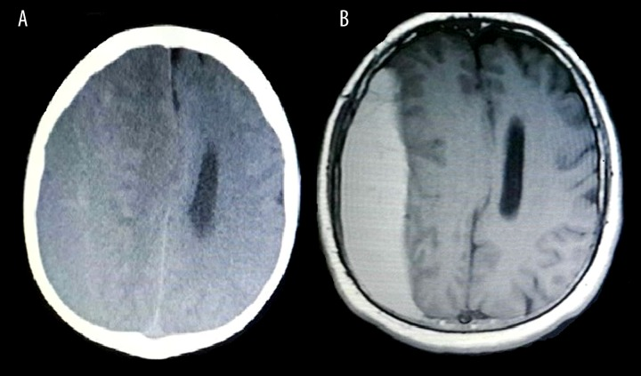
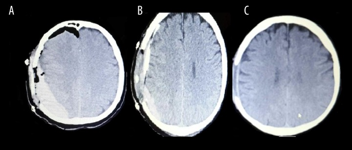
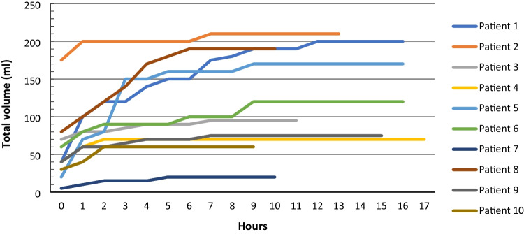
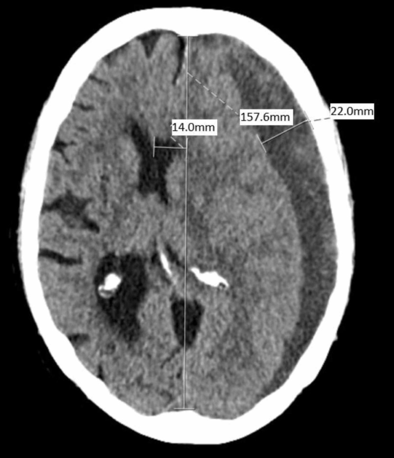
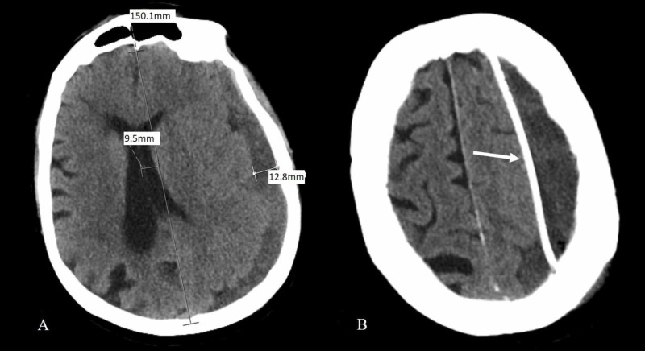
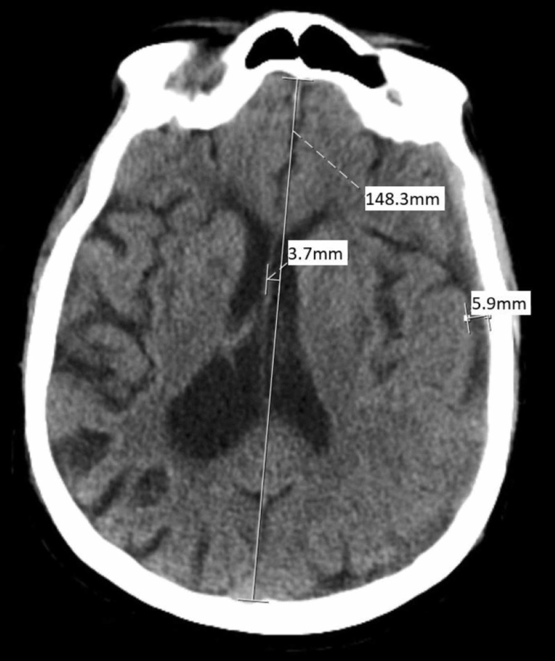
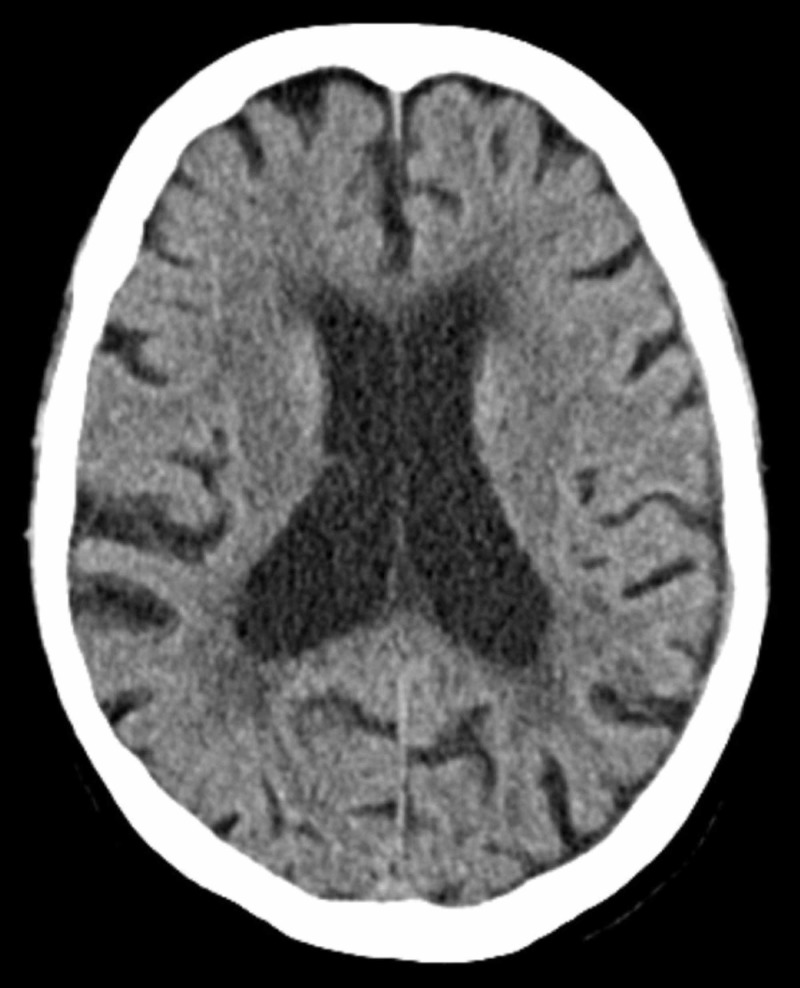
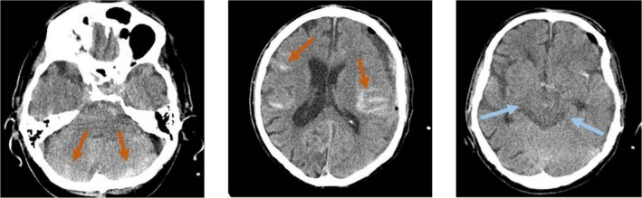
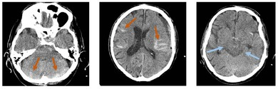
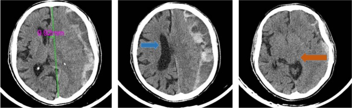

# Case Prep: Chronic Subdural Hematoma (cSDH) Evacuation

---

## One-Liner
[Age]yo [M/F] with [left/right/bilateral] chronic subdural hematoma(s) [___ mm max thickness, ___ mm midline shift] presenting with [headache/confusion/focal deficit/falls] planned for [burr hole drainage / craniotomy for evacuation].

---

## Figures, Imaging & Video

**🎥 Operative video** — *Chronic Subdural Hematoma — Burr-Hole Evacuation* · Peyman Pakzaban, MD

<iframe src="https://www.youtube-nocookie.com/embed/lBgQqvYK8xA" title="Chronic Subdural Hematoma — Burr-Hole Evacuation" loading="lazy" allow="accelerometer; clipboard-write; encrypted-media; picture-in-picture; web-share" allowfullscreen></iframe>

More operative video: [YouTube ▸](https://www.youtube.com/results?search_query=chronic+subdural+hematoma+burr+hole+evacuation) · [Neurosurgical Atlas ▸](https://www.neurosurgicalatlas.com)

[Neurosurgical Atlas](https://www.neurosurgicalatlas.com) · [Radiopaedia](https://radiopaedia.org/search?q=chronic%20subdural%20haematoma&scope=all) · [PubMed Central](https://www.ncbi.nlm.nih.gov/pmc/?term=chronic+subdural+hematoma+burr+hole) — operative figures © linked; see [media-sources.md](../../resources/media-sources.md)

---

<!-- BEGIN TEXTBOOK CROSS-CHECKS -->

## Textbook Cross-Checks

- **Emergency anatomy and exposure:** Greenberg; Youmans and Winn; Schmidek and Sweet — confirm incision/flap planning, sinus/vessel risks, decompression goals, and mass-effect physiology.
- **Technique sequence:** Greenberg; Youmans and Winn — review evacuation/decompression sequence, hemostasis, dural strategy, drain use, and bone-flap/cranioplasty decisions.
- **Complication rescue:** Greenberg; trauma guidelines and primary literature — summarize swelling, coagulopathy, seizures, infection, hydrocephalus, and ICU surveillance in original words.
- **Copyright-safe use:** cite these sources as private cross-checks, then write the guide content in original words; do not re-host textbook pages, figures, tables, or board-review card material. See [Source Crosswalk & Copyright-Safe Use](../../resources/source-crosswalk.md).

<!-- END TEXTBOOK CROSS-CHECKS -->

<!-- BEGIN CURATED LITERATURE -->

## High-Yield Literature

- **A Review of Remote Intracerebral Hemorrhage after Chronic Subdural Hematoma Evacuation** — Umana GE. Journal of neurological surgery. Part A, Central European neurosurgery 2022. [PubMed](https://pubmed.ncbi.nlm.nih.gov/34911088/)
- **Predictors of mortality in chronic subdural hematoma evacuation** — Sayed R. Neurosurgical review 2023. [PubMed](https://pubmed.ncbi.nlm.nih.gov/38036800/)
- **Seizure after chronic subdural hematoma evacuation: associated factors and effect on clinical outcome** — Wu L. Frontiers in neurology 2023. [PubMed](https://pubmed.ncbi.nlm.nih.gov/37228408/)
- **Single-Center Comparison of Chronic Subdural Hematoma Evacuation Outcomes Under Local Versus General Anesthesia** — Havryliv T. World neurosurgery 2024. [PubMed](https://pubmed.ncbi.nlm.nih.gov/38154679/)
- **Focal motor weakness and recovery following chronic subdural hematoma evacuation** — Nisson PL. Journal of neurosurgery 2024. [PubMed](https://pubmed.ncbi.nlm.nih.gov/38875718/)
- **Aphasia and Chronic Subdural Hematoma Evacuation: A Retrospective Cohort Study** — Patil S. Neurosurgery practice 2025. [PubMed](https://pubmed.ncbi.nlm.nih.gov/41163654/)
- **Incidence, predictors, and management of postoperative subdural empyema following chronic subdural hematoma evacuation: a population-based cohort study** — Jansson S. Acta neurochirurgica 2025. [PubMed](https://pubmed.ncbi.nlm.nih.gov/40407913/)
- **National randomized clinical trial on subdural drainage time after chronic subdural hematoma evacuation** — Jensen TSR. Journal of neurosurgery 2022. [PubMed](https://pubmed.ncbi.nlm.nih.gov/34972091/)
- **Spreading Depolarization After Chronic Subdural Hematoma Evacuation: Associated Clinical Risk Factors and Influence on Clinical Outcome** — Meadows C. Neurocritical care 2021. [PubMed](https://pubmed.ncbi.nlm.nih.gov/34617253/)
- **Is a drainage time of less than 24 h sufficient after chronic subdural hematoma evacuation?** — Bartley A. Acta neurochirurgica 2023. [PubMed](https://pubmed.ncbi.nlm.nih.gov/36752893/)

<!-- END CURATED LITERATURE -->

---

<!-- BEGIN CURATED IMAGE SET -->

## Curated Image Set

Open-access figures are embedded from PubMed Central articles and kept unique to this guide.

*Figure 1.. (A, B) Preoperative CT scan and magnetic resonance imaging showing chronic subdural hematoma. Source: [Epidural Hematoma Complication after Rapid Chronic Subdural Hematoma Evacuation: A Case Report](https://pmc.ncbi.nlm.nih.gov/articles/PMC4500596/) — The American Journal of Case Reports 2015; open access.*

*Figure 2.. (A–C) CT scan showing epidural hematoma complication after subdural hematoma evacuation, and the progressive improvement of epidural hematoma. Source: [Epidural Hematoma Complication after Rapid Chronic Subdural Hematoma Evacuation: A Case Report](https://pmc.ncbi.nlm.nih.gov/articles/PMC4500596/) — The American Journal of Case Reports 2015; open access.*

*Fig. 2. Total volume drained after chronic subdural hematoma (cSDH) evacuation in a prospective cohort of 10 patients. Time point 0 indicates arrival from the operating room to the neurosurgical... Source: [Is a drainage time of less than 24 h sufficient after chronic subdural hematoma evacuation?](https://pmc.ncbi.nlm.nih.gov/articles/PMC10006057/) — Acta Neurochirurgica 2023; CC BY.*

*Figure 1. The patient’s presenting CT examination demonstrating a large, left-sided, crescent-shaped frontoparietal sSDH measuring 22 mm at the deepest point, with 14 mm of midline shift, left to... Source: [Minimally Invasive Subacute to Chronic Subdural Hematoma Evacuation with Angled Matchstick Drill and Repurposed Antibiotic Ventriculostomy Catheter Augmented with Alteplase: A Technical Case Report](https://pmc.ncbi.nlm.nih.gov/articles/PMC6886729/) — Cureus 2019; CC BY.*

*Figure 2. POD 1 CT examination shows the midline shift improved to 9.5 mm with a maximal hematomal depth of 12.8 mm. Residual SDH is relatively more isodense with the brain, suggesting blood is... Source: [Minimally Invasive Subacute to Chronic Subdural Hematoma Evacuation with Angled Matchstick Drill and Repurposed Antibiotic Ventriculostomy Catheter Augmented with Alteplase: A Technical Case Report](https://pmc.ncbi.nlm.nih.gov/articles/PMC6886729/) — Cureus 2019; CC BY.*

*Figure 3. POD 3 CT examination completed 11 hours after 2 mg infusion of tPA demonstrates continued hematomal drainage with only 3.7 mm left to right midline shift and maximal SDH depth reduced to... Source: [Minimally Invasive Subacute to Chronic Subdural Hematoma Evacuation with Angled Matchstick Drill and Repurposed Antibiotic Ventriculostomy Catheter Augmented with Alteplase: A Technical Case Report](https://pmc.ncbi.nlm.nih.gov/articles/PMC6886729/) — Cureus 2019; CC BY.*

*Figure 4. Ten-week outpatient follow-up CT examination demonstrating persistent thin subdural collection with minimal mass effect and no significant midline shift.CT: computed tomography Source: [Minimally Invasive Subacute to Chronic Subdural Hematoma Evacuation with Angled Matchstick Drill and Repurposed Antibiotic Ventriculostomy Catheter Augmented with Alteplase: A Technical Case Report](https://pmc.ncbi.nlm.nih.gov/articles/PMC6886729/) — Cureus 2019; CC BY.*

*FIGURE 2. Postoperative Brain CT scan. Left image: Cerebellar subarachnoid hemorrhage. Middle image: Hemispheric subarachnoid hemorrhage. Right image: Basal cisterns are bilaterally symmetrically... Source: [Postoperative Remote Acute Subarachnoid Hemorrhage as a Complication of Chronic Subdural Hematoma Evacuation With Burrhole: A Case Report and Literature Review](https://pmc.ncbi.nlm.nih.gov/articles/PMC12485288/) — Clinical Case Reports 2025; CC BY.*

*Figure 9. Source: [Postoperative Remote Acute Subarachnoid Hemorrhage as a Complication of Chronic Subdural Hematoma Evacuation With Burrhole: A Case Report and Literature Review](https://pmc.ncbi.nlm.nih.gov/articles/PMC12485288/) — Clin Case Rep. 2025 Oct 1;13(10):e71076. doi: 10.1002/ccr3.71076; CC BY.*

*FIGURE 1. Preoperative Brain CT scan. Left image: The midline shift is about 10 mm. Middle image: The right lateral ventricle is visible (blue arrow), but due to hematoma, the left one is not... Source: [Postoperative Remote Acute Subarachnoid Hemorrhage as a Complication of Chronic Subdural Hematoma Evacuation With Burrhole: A Case Report and Literature Review](https://pmc.ncbi.nlm.nih.gov/articles/PMC12485288/) — Clinical Case Reports 2025; CC BY.*

<!-- END CURATED IMAGE SET -->

---

## History of Present Illness
- Chief complaint: Progressive headache / cognitive decline / gait instability / focal weakness / falls
- Duration of symptoms:
- Trauma history: [fall ___ weeks/months ago / anticoagulant use / unknown]
- Progressive vs fluctuating symptoms:
- History of prior cSDH / prior drainage:
- Anticoagulant/antiplatelet use (major risk factor):

---

## Past Medical History
- **Anticoagulation** (warfarin, DOACs, heparin) — CRITICAL
- **Antiplatelet** (aspirin, clopidogrel, ticagrelor)
- Atrial fibrillation (reason for anticoagulation — when can it restart?)
- Mechanical heart valve (cardiology consultation for bridging)
- History of falls / fall risk
- Alcohol use disorder (brain atrophy → bridging vein stretch)
- Coagulopathy / liver disease
- Dementia / baseline cognitive status
- Prior cranial surgery
- Allergies:
- Medications (complete list with anticoagulant/antiplatelet details):

---

## Imaging Review
### CT Head
- **Side:** Left / Right / Bilateral
- **Max thickness:** ___ mm
- **Midline shift:** ___ mm
- **Density:** Hypodense (chronic) / Mixed density (acute-on-chronic) / Isodense
- **Membranes:** Present (organized) — may suggest loculated collection
- **Mass effect:** Sulcal effacement, ventricular compression
- **Brain atrophy:** Degree of underlying atrophy (affects re-expansion)
- **Acute component:** Any fresh hemorrhage within chronic collection
- **Bilateral:** If bilateral, note which side is more symptomatic/larger
- **Prior surgery:** Burr hole defects from previous drainage

### MRI (if available)
- Better delineation of subdural age and membranes
- Underlying brain parenchymal changes

---

## Labs
- CBC (Plt count)
- **INR / PT** — MUST correct before surgery (target INR < 1.5)
- **PTT** — if on heparin
- BMP (Na, K)
- Type and screen
- **Reversal agents:**
  - Warfarin: Vitamin K 10 mg IV + FFP or 4-factor PCC (KCentra)
  - Dabigatran: Idarucizumab (Praxbind) 5g IV
  - Rivaroxaban/Apixaban: Andexanet alfa or 4-factor PCC
  - Heparin: Protamine
  - Aspirin/Clopidogrel: DDAVP 0.3 mcg/kg, consider platelet transfusion

---

## Neurological Examination
- GCS:
- Orientation:
- Hemiparesis (contralateral or ipsilateral from Kernohan notch):
- Speech/language:
- Gait:
- **Baseline cognitive status** (CRITICAL — determine if this is new vs pre-existing):

---

## Surgical Planning

### Diagnosis & Indication
- Working diagnosis: Chronic subdural hematoma
- Surgical indication: Symptomatic / thickness > 10 mm / midline shift > 5 mm / neurological decline
- Goals: Evacuate hematoma, relieve mass effect, allow brain re-expansion
- Medical management alternative: Observation (if small, asymptomatic); middle meningeal artery embolization (adjunctive); dexamethasone (some evidence, not universally adopted)

### Procedure Selection
- **Burr hole drainage (standard):** 1-2 burr holes with subdural drain — preferred for most cSDH
- **Mini-craniotomy:** If organized/loculated collection with membranes
- **Craniotomy:** If acute-on-chronic with solid clot, recurrent with thick membranes, or calcified chronic SDH

### Position
- **Patient position:** Supine
- **Head position:** Turned to contralateral side (affected side up), slight head elevation
- **Head fixation:** Horseshoe headrest (NOT Mayfield for simple burr holes) OR Mayfield if craniotomy
- **Table:** Slight reverse Trendelenburg

### Procedure: Burr Hole Drainage

**Marking:**
- Mark burr hole sites with navigation or anatomical landmarks
- **Anterior burr hole:** At coronal suture, just lateral to the pupil line (~3 cm from midline)
- **Posterior burr hole:** At or behind the parietal eminence, ~12 cm posterior to the first

**Steps:**
1. Linear incision (~3-4 cm) at each burr hole site
2. Subperiosteal dissection
3. Burr hole with perforator
4. Identify dura — may see dark discoloration
5. Coagulate dura and open in cruciate fashion
6. **Dark "motor oil" fluid under pressure** — classic cSDH
7. Irrigate with warm saline through one burr hole, drain from the other
8. Continue until returns are clear
9. **Do NOT attempt to remove membranes through burr holes**
10. Place subdural drain (Jackson-Pratt/Blake drain) through anterior burr hole, directed posteriorly
11. Tunnel drain subcutaneously, exit through separate stab incision
12. Closure: Galea and skin in layers
13. Connect drain to closed suction (low or gravity)

### Procedure: Craniotomy for cSDH (if indicated)

**Steps:**
1. Curvilinear incision over the collection
2. Craniotomy over the thickest portion
3. Dural opening
4. Evacuate subdural collection — irrigate copiously
5. Identify and manage outer and inner membranes
6. Careful hemostasis of membrane surfaces (bipolar)
7. **Do NOT strip the inner membrane from brain surface** — causes hemorrhage
8. Outer membrane: may partially excise if thick/organized
9. Irrigate until clear
10. Place subdural drain
11. Replace bone flap, standard closure

### Critical Anatomy & Structures at Risk
1. **Bridging veins** — injured veins caused the original SDH; remaining bridging veins can be torn during drainage → acute postop hemorrhage
2. **Cortical surface** — brain may expand into burr hole; avoid inserting instruments too deeply
3. **Superior sagittal sinus** — keep burr holes sufficiently lateral (> 2.5 cm from midline)
4. **Motor cortex** — underlying cortex may be compressed; avoid cortical injury during drainage

### Equipment
- Perforator/craniotome
- Subdural drain (Blake/JP)
- Warm saline irrigation
- Red rubber catheter (for irrigation through burr hole)
- Bipolar (for dural edge hemostasis)
- Bone wax

### Monitoring
- Standard ASA monitors (no IONM needed)

### Anesthesia Considerations
- **Correct coagulopathy BEFORE surgery** — INR, platelet function
- General anesthesia (standard) OR monitored anesthesia care/local (for burr holes in select patients)
- Antibiotic prophylaxis (cefazolin 2g)
- Keep well-hydrated (brain re-expansion)
- Avoid over-draining (risk of contralateral SDH or tension pneumocephalus)

### Potential Complications & Contingencies
1. **Recurrence** (~10-20%) — most common complication; may need repeat drainage or MMA embolization
2. **Acute hemorrhage** — from bridging vein tear or cortical injury; return to OR for craniotomy
3. **Seizure** — prophylaxis controversial; give if cortical irritation or seizure history
4. **Tension pneumocephalus** — if air enters subdural space; keep patient flat, avoid nitrous oxide
5. **Failure to re-expand** — "trapped brain" from thick inner membrane; may need prolonged drainage or SDH-peritoneal shunt
6. **Contralateral SDH** — overdrainage shifts brain, stretches contralateral bridging veins

---

## Operative Note Template

**Preoperative Diagnosis:** [Left/Right/Bilateral] chronic subdural hematoma

**Postoperative Diagnosis:** Same

**Procedure:** [Left/Right/Bilateral] burr hole drainage of chronic subdural hematoma with subdural drain placement

**Surgeon:**
**Assistant:**
**Anesthesia:** General endotracheal / MAC with local

**EBL:** Minimal (plus subdural drainage volume: ___ mL)
**Fluids:**
**Specimens:** Subdural fluid (sent for culture if concern for infection)
**Drains:** Subdural drain (Blake/JP) x [1/2]
**Complications:** None
**Implants:** None

**Indications:**
The patient is a [age]yo [M/F] on [anticoagulation] who presented with [symptoms]. CT head demonstrated a [left/right/bilateral] chronic subdural hematoma measuring [thickness] mm with [midline shift] mm of midline shift. [Coagulopathy was corrected with ___. INR confirmed < 1.5 prior to surgery.] After discussion of risks, benefits, and alternatives, the patient/family elected to proceed with burr hole drainage.

**Description of Procedure:**
After informed consent was verified and the surgical site was marked, the patient was brought to the operating room. General endotracheal anesthesia was induced. The patient was positioned supine with the head turned to the [contralateral] side on a horseshoe headrest. A time-out was performed.

The [left/right] scalp was prepped and draped in standard sterile fashion. Cefazolin [2g] was administered.

**Anterior burr hole:** A [3 cm] linear incision was made at the [coronal suture, ___cm lateral to midline]. Subperiosteal dissection was performed to expose the calvarium. A burr hole was placed with the perforator. The dura was identified, coagulated with bipolar cautery, and opened in a cruciate fashion. Dark, xanthochromic fluid under [mild/moderate] pressure was immediately encountered and allowed to drain. Copious warm saline irrigation was performed through a red rubber catheter.

**Posterior burr hole:** A second [3 cm] incision was made at the [parietal eminence]. A burr hole was created in the same fashion. Dark fluid was again encountered. Irrigation was performed between the two burr holes until the returns were clear.

**Drain placement:** A [Blake/JP] subdural drain was placed through the anterior burr hole and directed posteriorly along the subdural space. The drain was tunneled subcutaneously and brought out through a separate stab incision. It was secured to the skin with a suture and connected to a closed drainage system [on gravity/low suction].

**Closure:** The galea was closed with 3-0 Vicryl interrupted sutures at each burr hole site. The skin was closed with [staples/sutures]. A sterile dressing was applied.

**Postoperative:** The patient was awakened from anesthesia, extubated, and found to be neurologically [improved/at baseline]. The patient was transferred to the [ICU/step-down unit] in stable condition.

---

## Postoperative Plan
- Step-down unit or ICU x 24 hours
- Neuro checks q2h x 24 hours
- **Keep patient FLAT x 24-48 hours** (promotes brain re-expansion, reduces pneumocephalus)
- Subdural drain: keep on [gravity/low suction]; record output q shift
- CT head POD1 — assess residual collection, brain re-expansion, pneumocephalus
- **Remove drain when output < 50 mL / 24 hours** (typically POD 1-3)
- Repeat CT after drain removal
- IV fluids: Keep well-hydrated (promotes re-expansion)
- DVT prophylaxis: SCDs; hold chemical prophylaxis until drain removed
- Seizure prophylaxis: Per institutional protocol (not universally given)
- **Anticoagulation restart:** Discuss with cardiology/primary team
  - If AFib (no valve): Restart in 1-2 weeks (with imaging confirmation)
  - If mechanical valve: May need earlier bridging — discuss risks
  - If antiplatelet: Restart in 3-7 days
- Fall prevention
- Activity: Gradually increase HOB after 48 hours
- If recurrent: Consider MMA embolization before repeat surgery
- Follow-up: Clinic 2-4 weeks with CT head
