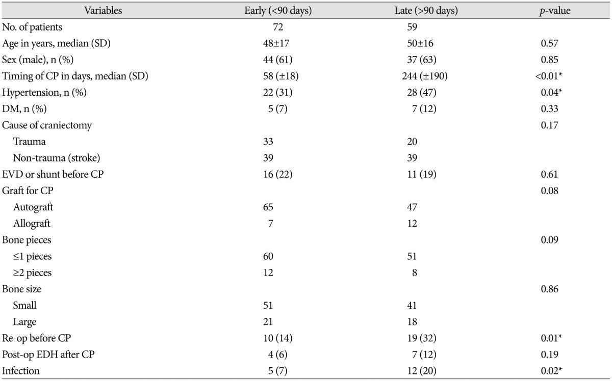
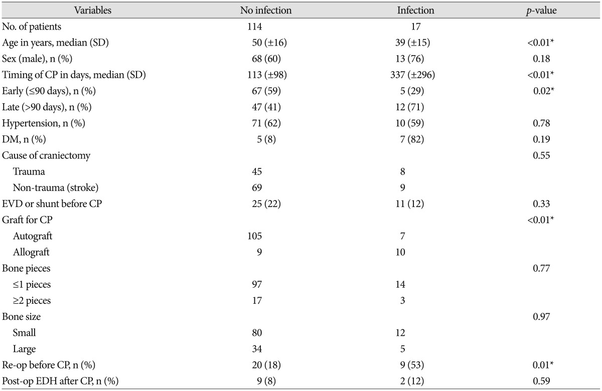
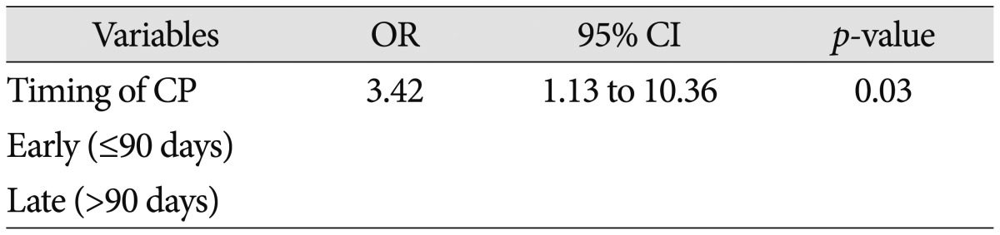
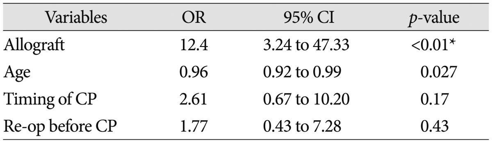
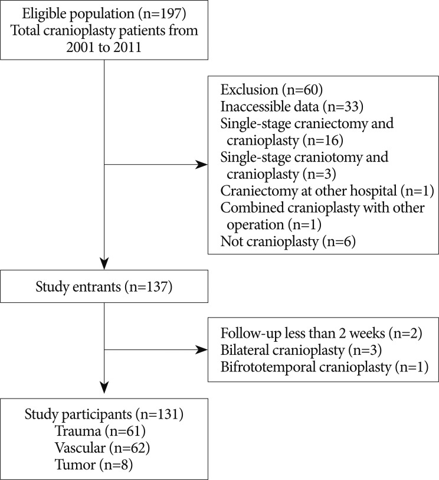
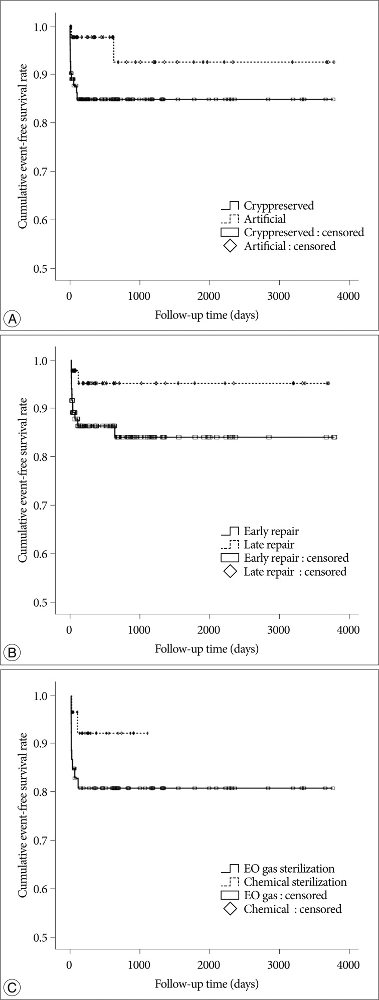
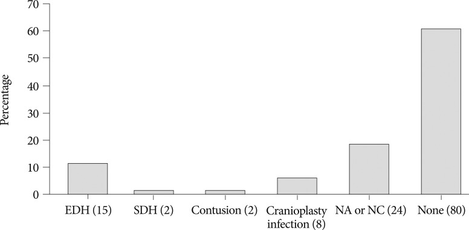
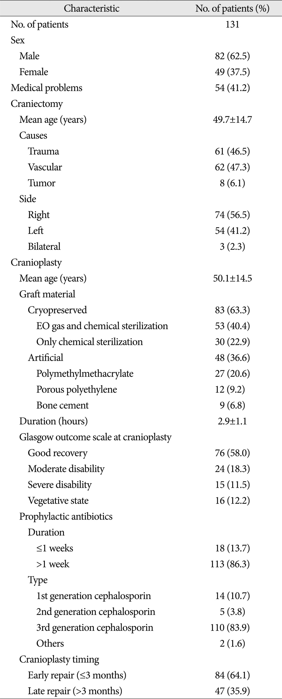
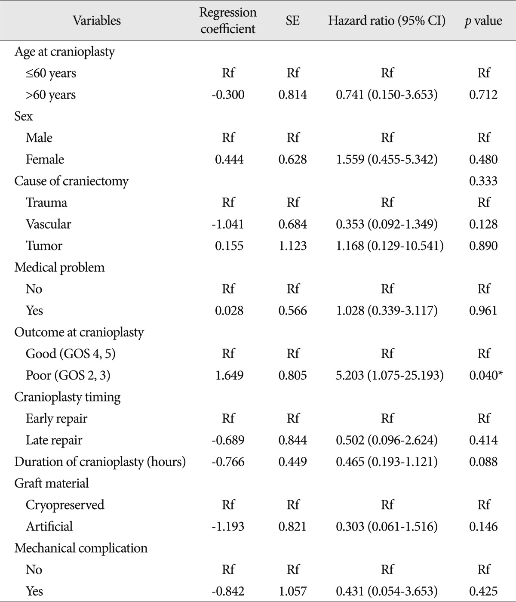
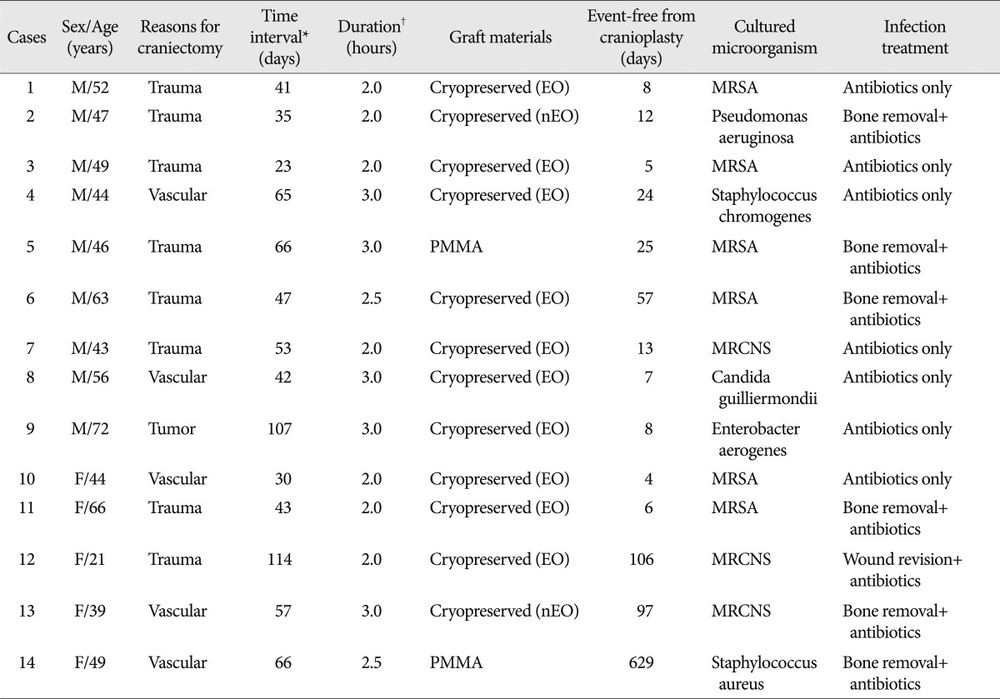

# Case Prep: Cranioplasty

---

<!-- BEGIN CASE SNAPSHOT -->

## Case / Approach Snapshot

- **Anatomy at risk:** hematoma compartment, fracture and sinus landmarks, cortical/venous/arterial injury, swollen brain physiology, dural edges, and decompressive flap constraints.
- **Operative steps:** move quickly from imaging to exposure, choose flap or burr-hole strategy, evacuate clot or decompress, control bleeding, decide duraplasty/bone-flap/drain strategy, and hand off to ICU resuscitation goals; use the detailed operative sequence and approach notes below as the step-by-step source.
- **Rescue plans:** refractory swelling, coagulopathy, venous sinus bleeding, arterial source, seizures, infection, hydrocephalus, malignant ICP, and staged decompression or reoperation.
- **Figures:** review [Figures, Imaging & Video](#figures-imaging--video) and the [Curated Image Set](#curated-image-set); embedded local figures should remain open-access, public-domain, or otherwise reusable with attribution.
- **Papers:** review [High-Yield Literature](#high-yield-literature) for seminal sources, modern reviews, and outcome data specific to this page.
- **Textbook cross-checks:** use [Textbook Cross-Checks](#textbook-cross-checks) and the [Source Crosswalk](../../resources/source-crosswalk.md) to cite copyrighted textbooks/atlases while summarizing in original words.

<!-- END CASE SNAPSHOT -->

## One-Liner
[Age]yo [M/F] s/p prior [decompressive craniectomy/craniectomy] [weeks/months] ago with a [location] cranial defect planned for cranioplasty with [autologous bone flap / custom PEEK or titanium / PMMA] implant.

---

## Figures, Imaging & Video

**🎥 Operative video** — [search operative video on YouTube ▸](https://www.youtube.com/results?search_query=cranioplasty+surgery) · [The Neurosurgical Atlas ▸](https://www.neurosurgicalatlas.com)

> External sources — operative figures/atlases are copyrighted (linked, not copied). See [media-sources.md](../../resources/media-sources.md) for licensing.

**Operative technique & approach**
- [The Neurosurgical Atlas — Cranioplasty](https://www.neurosurgicalatlas.com) — search *"cranioplasty"* (operative illustrations, implant placement technique)
- [The Neurosurgical Atlas — Decompressive Craniectomy](https://www.neurosurgicalatlas.com) — search *"decompressive craniectomy"* (understanding the original operation)

**Imaging**
- [Radiopaedia — Cranioplasty](https://radiopaedia.org/search?q=cranioplasty&scope=all)
- [Radiopaedia — Decompressive craniectomy](https://radiopaedia.org/search?q=decompressive+craniectomy&scope=all)
- [Radiopaedia — Syndrome of the trephined](https://radiopaedia.org/search?q=syndrome+of+the+trephined&scope=all)

**Open-access figures**
- [PubMed Central — cranioplasty outcomes & techniques](https://www.ncbi.nlm.nih.gov/pmc/?term=cranioplasty+outcomes)
- [PubMed Central — cranioplasty materials](https://www.ncbi.nlm.nih.gov/pmc/?term=cranioplasty+PEEK+titanium+autologous)

*Sobotta 1909 — public domain — via [Wikimedia Commons](https://commons.wikimedia.org/wiki/File:Sobo_1909_39.png). Relevant to calvarian defect anatomy and cranial bone landmarks.*

---

<!-- BEGIN TEXTBOOK CROSS-CHECKS -->

## Textbook Cross-Checks

- **Emergency anatomy and exposure:** Greenberg; Youmans and Winn; Schmidek and Sweet — confirm incision/flap planning, sinus/vessel risks, decompression goals, and mass-effect physiology.
- **Technique sequence:** Greenberg; Youmans and Winn — review evacuation/decompression sequence, hemostasis, dural strategy, drain use, and bone-flap/cranioplasty decisions.
- **Complication rescue:** Greenberg; trauma guidelines and primary literature — summarize swelling, coagulopathy, seizures, infection, hydrocephalus, and ICU surveillance in original words.
- **Copyright-safe use:** cite these sources as private cross-checks, then write the guide content in original words; do not re-host textbook pages, figures, tables, or board-review card material. See [Source Crosswalk & Copyright-Safe Use](../../resources/source-crosswalk.md).

<!-- END TEXTBOOK CROSS-CHECKS -->

<!-- BEGIN CURATED LITERATURE -->

## High-Yield Literature

- **Cranioplasty** — Piazza M. Neurosurgery clinics of North America 2017. [PubMed](https://pubmed.ncbi.nlm.nih.gov/28325460/)
- **Cranioplasty: A Multidisciplinary Approach** — Mee H. Frontiers in surgery 2022. [PubMed](https://pubmed.ncbi.nlm.nih.gov/35656088/)
- **Pediatric Cranioplasty** — Bykowski MR. Clinics in plastic surgery 2019. [PubMed](https://pubmed.ncbi.nlm.nih.gov/30851749/)
- **Cranioplasty after craniectomy in pediatric patients-a systematic review** — Klieverik VM. Child's nervous system : ChNS : official journal of the International Society for Pediatric Neurosurgery 2019. [PubMed](https://pubmed.ncbi.nlm.nih.gov/30610476/)
- **Cranioplasty in the deployed environment: experience for host-country nationals** — Porensky PN. Journal of neurosurgery 2023. [PubMed](https://pubmed.ncbi.nlm.nih.gov/36057122/)
- **Cranioplasty Following Severe Traumatic Brain Injury: Role in Neurorecovery** — Ozoner B. Current neurology and neuroscience reports 2021. [PubMed](https://pubmed.ncbi.nlm.nih.gov/34674047/)
- **Next-generation personalized cranioplasty treatment** — Thimukonda Jegadeesan J. Acta biomaterialia 2022. [PubMed](https://pubmed.ncbi.nlm.nih.gov/36272686/)
- **Cranioplasty: Review of Materials** — Zanotti B. The Journal of craniofacial surgery 2016. [PubMed](https://pubmed.ncbi.nlm.nih.gov/28005754/)
- **Cranioplasty: A Comprehensive Review of the History, Materials, Surgical Aspects, and Complications** — Alkhaibary A. World neurosurgery 2020. [PubMed](https://pubmed.ncbi.nlm.nih.gov/32387405/)
- **Management and prevention of cranioplasty infections** — Frassanito P. Child's nervous system : ChNS : official journal of the International Society for Pediatric Neurosurgery 2019. [PubMed](https://pubmed.ncbi.nlm.nih.gov/31222447/)

<!-- END CURATED LITERATURE -->

---

<!-- BEGIN CURATED IMAGE SET -->

## Curated Image Set

Open-access figures are embedded from PubMed Central articles and kept unique to this guide.

*Figure 1. Source: [Which One Is Better to Reduce the Infection Rate, Early or Late Cranioplasty?](https://pmc.ncbi.nlm.nih.gov/articles/PMC5028610/) — J Korean Neurosurg Soc. 2016 Sep 8;59(5):492–7. doi: 10.3340/jkns.2016.59.5.492; CC BY-NC.*

*Figure 2. Source: [Which One Is Better to Reduce the Infection Rate, Early or Late Cranioplasty?](https://pmc.ncbi.nlm.nih.gov/articles/PMC5028610/) — J Korean Neurosurg Soc. 2016 Sep 8;59(5):492–7. doi: 10.3340/jkns.2016.59.5.492; CC BY-NC.*

*Figure 3. Source: [Which One Is Better to Reduce the Infection Rate, Early or Late Cranioplasty?](https://pmc.ncbi.nlm.nih.gov/articles/PMC5028610/) — J Korean Neurosurg Soc. 2016 Sep 8;59(5):492–7. doi: 10.3340/jkns.2016.59.5.492; CC BY-NC.*

*Figure 4. Source: [Which One Is Better to Reduce the Infection Rate, Early or Late Cranioplasty?](https://pmc.ncbi.nlm.nih.gov/articles/PMC5028610/) — J Korean Neurosurg Soc. 2016 Sep 8;59(5):492–7. doi: 10.3340/jkns.2016.59.5.492; CC BY-NC.*

*Fig. 1. Flow chart of participants in the retrospective cohort from 2001 to 2011. Source: [Long-Term Incidence and Predicting Factors of Cranioplasty Infection after Decompressive Craniectomy](https://pmc.ncbi.nlm.nih.gov/articles/PMC3488651/) — Journal of Korean Neurosurgical Society 2012; CC BY-NC.*

*Fig. 2. Kaplan-Meier event-free survival curves at 10 years for cranioplasty infection according to graft material (p=0.074) (A), and cranioplasty timing (p=0.083) (B) in 131 cranioplasty... Source: [Long-Term Incidence and Predicting Factors of Cranioplasty Infection after Decompressive Craniectomy](https://pmc.ncbi.nlm.nih.gov/articles/PMC3488651/) — Journal of Korean Neurosurgical Society 2012; CC BY-NC.*

*Fig. 3. Postoperative complications within 2 weeks after cranioplasty. EDH, SDH, NA and NC stand for epidural hematoma, subdural hematoma, not applicable and not checked, respectively. Numbers... Source: [Long-Term Incidence and Predicting Factors of Cranioplasty Infection after Decompressive Craniectomy](https://pmc.ncbi.nlm.nih.gov/articles/PMC3488651/) — Journal of Korean Neurosurgical Society 2012; CC BY-NC.*

*Figure 8. Source: [Long-Term Incidence and Predicting Factors of Cranioplasty Infection after Decompressive Craniectomy](https://pmc.ncbi.nlm.nih.gov/articles/PMC3488651/) — J Korean Neurosurg Soc. 2012 Oct 22;52(4):396–403. doi: 10.3340/jkns.2012.52.4.396; CC BY-NC.*

*Figure 9. Source: [Long-Term Incidence and Predicting Factors of Cranioplasty Infection after Decompressive Craniectomy](https://pmc.ncbi.nlm.nih.gov/articles/PMC3488651/) — J Korean Neurosurg Soc. 2012 Oct 22;52(4):396–403. doi: 10.3340/jkns.2012.52.4.396; CC BY-NC.*

*Figure 10. Source: [Long-Term Incidence and Predicting Factors of Cranioplasty Infection after Decompressive Craniectomy](https://pmc.ncbi.nlm.nih.gov/articles/PMC3488651/) — J Korean Neurosurg Soc. 2012 Oct 22;52(4):396–403. doi: 10.3340/jkns.2012.52.4.396; CC BY-NC.*

<!-- END CURATED IMAGE SET -->

---

## History of Present Illness
- Chief complaint: Cranial defect s/p craniectomy; cosmetic concern, **syndrome of the trephined** (sunken flap with headache, cognitive/motor decline that improves after cranioplasty), protection
- Time since craniectomy (typically wait 6-12 weeks; longer if infection history)
- Original indication (trauma, stroke, infection)
- **Prior infection** (if craniectomy was for infection or flap was infected → use synthetic, not autologous)
- Symptoms attributable to cranial defect: headache, dizziness, cognitive decline, mood changes, motor regression
- Cosmetic complaints, social/occupational impact of wearing a helmet

---

## Past Medical History
- **Reason for original craniectomy** (malignant MCA stroke, TBI, hemorrhage, infection, tumor)
- **Timing since craniectomy** — optimal window 6-12 weeks; document weeks/months elapsed
- **Prior wound/bone flap infections** — number of episodes, organisms, treatment course; if infected → autologous bone contraindicated
- **VP shunt** — present? functioning? may require simultaneous shunt revision; plan coordination with shunt surgeon; shunt valve under flap may affect implant fit
- **Bone flap storage method** — frozen (cryopreserved) vs. subcutaneous abdominal pocket; document date stored, storage facility
- **Radiation history** — cranial radiation impairs wound healing and bone integration; increases implant exposure risk
- Prior seizure history / current AED use
- Anticoagulant/antiplatelet use (hold timing)
- Diabetes, immunosuppression, smoking (wound healing risk factors)
- Connective tissue disorders
- Allergies (especially nickel — relevant for titanium alloy implants):
- Medications:

---

## Imaging Review

### CT Head (non-contrast)
- Brain expansion status: resolved swelling? still sunken/flat? (must not be bulging before cranioplasty)
- **Hydrocephalus** — ventriculomegaly may require VP shunt placement prior to or concurrent with cranioplasty
- Subgaleal fluid collection / hygroma over the defect
- Evidence of encephalomalacia at the injury site
- Midline shift or paradoxical herniation (syndrome of the trephined)

### CT Bone Window / 3D CT Reconstruction
- **Defect size** — measure maximum AP and lateral dimensions (cm)
- Defect location — frontal, temporal, parietal, frontotemporal, frontoparietal, bifrontal
- **Bony edge contour** — sharp vs. beveled edges, condition of surrounding bone
- Residual bone islands or prior fixation hardware
- **3D reconstruction** — essential for custom implant planning (PEEK/titanium); provides data for CAD/CAM fabrication

### Custom Implant Planning CT
- Thin-cut CT (≤ 1 mm slices) obtained per manufacturer specifications
- DICOM sent to implant manufacturer for patient-specific implant design
- Virtual surgical planning (VSP) review session completed with manufacturer
- Implant design approved; fabrication lead time accounted for (typically 4-6 weeks)

### CT Angiography (when indicated)
- **Parasagittal defects** — assess superior sagittal sinus patency; SSS injury risk during dissection
- Large frontal defects — map anterior cerebral artery / frontal cortical veins
- Assess for dural venous sinus thrombosis

---

## Labs
- CBC (Hgb, WBC — baseline; Plt > 100K)
- BMP
- Coagulation (PT/INR < 1.4, PTT)
- Type and screen
- **CRP / ESR** — rule out subclinical infection; elevated values warrant further workup before proceeding
- **Prealbumin / albumin** — nutritional status (poor nutrition → impaired wound healing)
- If any concern for infection: wound/scalp cultures, consider bone flap cultures at time of surgery
- HbA1c (if diabetic — optimize glucose control pre-operatively)

---

## Neurological Examination

### Mental Status
- GCS:
- Orientation:
- **Cognitive assessment** — document baseline deficits (memory, attention, executive function); these may improve post-cranioplasty (syndrome of the trephined)
- Mood/affect (depression, anxiety common with cranial defects)

### Syndrome of the Trephined Assessment
- Headache (positional — worse upright, improved recumbent)
- Cognitive decline since craniectomy (paradoxical worsening despite resolved primary pathology)
- Motor regression contralateral to defect
- Dizziness, fatigue, irritability
- **Paradoxical herniation** — atmospheric pressure on brain through defect causes shifting; look for worsening deficits in upright position, improvement when recumbent
- Sunken scalp flap — degree of concavity

### Motor
- Contralateral hemiparesis (document strength in detail for post-op comparison):
- Drift:

### Speech/Language (if dominant hemisphere affected)
- Expressive:
- Receptive:

### Cranial Nerves
- All cranial nerves (document any baseline deficits):

---

## Surgical Planning

### Diagnosis & Indication
- Working diagnosis: [Location] cranial defect s/p [decompressive craniectomy / craniectomy]
- Surgical indication: Brain protection, cosmesis, syndrome of the trephined, return to employment/activity
- Goals: Restore cranial contour, protect underlying brain, relieve syndrome of the trephined if present

### Implant Selection

| Material | Advantages | Disadvantages | Best Use |
| --- | --- | --- | --- |
| **Autologous bone flap** (frozen / abdominal) | Biocompatible, cheapest, osteointegration potential | Resorption (15-50%, esp. pediatric/fragmented), infection if previously contaminated, may not fit if brain contour changed | First-line if flap is intact, non-infected, non-irradiated |
| **PEEK** (polyether ether ketone) | Custom fit (CAD/CAM), lightweight, radiolucent, no thermal conductivity, excellent cosmesis | Expensive, fabrication lead time (4-6 wk), no osteointegration, requires thin-cut CT | Large/complex defects, cosmetically sensitive areas |
| **Titanium mesh** | Strong, custom or intraop moldable, osteointegration possible | Palpable/visible in thin scalp, thermal conductivity (cold sensitivity), artifact on imaging | Large defects, structural strength needed |
| **PMMA** (polymethylmethacrylate) | Intraop moldable, inexpensive, no lead time | Exothermic curing (dural injury risk), no osteointegration, brittle, infection-prone | Smaller defects, resource-limited settings, revision |
| **Hydroxyapatite** | Bioactive, osteoconductive | Brittle, limited to smaller defects, expensive | Small defects, pediatric (growth potential) |

- **Avoid autologous bone if:** prior flap infection, fragmented flap, radiation history, prolonged storage (> 6-12 months — higher resorption), pediatric patient (high resorption rate)
- **Autologous bone flap assessment (if using):** Inspect for resorption, fragmentation, gross contamination; obtain intraoperative cultures; if flap appears significantly resorbed or fragmented, abort and use synthetic

### Timing Considerations
- **Optimal:** 6-12 weeks after craniectomy (swelling resolved, wound healed, not yet significant atrophy)
- **Delay if:** active infection, unresolved hydrocephalus, persistent brain swelling, wound not healed, ongoing radiation
- **Early cranioplasty** (< 6 weeks): higher complication rate but may be considered for severe syndrome of the trephined
- **Late cranioplasty** (> 6 months): technically more difficult (thicker scar, adherent dura); higher autologous resorption

### Position
- Per defect location; typically supine with head rotated
- **Mayfield 3-pin or horseshoe** (horseshoe acceptable for straightforward cases)
- Original incision reused — mark prior scar preoperatively

### Key Surgical Steps
1. **Incision planning** — reopen original scar; mark prior incision, inspect scalp thickness/vascularity; if prior incision is compromised, plan alternative flap with plastic surgery
2. **Scalp flap elevation** — **careful subgaleal/subperiosteal dissection** off the dura (dura is often adherent, thin, and avascular — avoid durotomy and cortical injury); use Bovie on dura only with extreme caution
3. **Define bony edges circumferentially** — clear 5-10 mm rim of bone edge to seat implant; remove any fibrous tissue from bony margins
4. **Hemostasis** — scalp/dura; epidural bleeding common from dural edges and granulation tissue
5. **Dural tacking sutures** — place central and peripheral tack-up sutures through drill holes or implant perforations to obliterate epidural dead space and reduce hematoma risk
6. **Autologous bone flap assessment** (if using) — inspect flap for resorption, fragmentation; obtain cultures; soak in antibiotic-impregnated saline
7. **Implant placement** — place autologous flap or custom/PMMA implant; confirm **fit, contour, and symmetry** (compare with contralateral side); for PMMA, mold on a wet towel/glove off the field to avoid exothermic injury to dura
8. **Fixation** — **titanium plates and screws** at minimum 3 points around the perimeter (ideally 4-6 for large defects); countersink plates to avoid palpable hardware
9. **Temporal hollowing management** — if temporalis muscle atrophy is significant, consider temporalis muscle advancement, fat grafting, or extended implant design to restore temporal contour
10. **Subgaleal drain placement** — closed suction drain (e.g., Jackson-Pratt) in subgaleal space
11. **Closure in layers** — pericranium/temporalis reapproximation, galea, skin (staples or suture)

### Critical Anatomy & Structures at Risk
1. **Underlying dura/brain** — adherent dura; durotomy and cortical injury during dissection is the primary intraoperative risk
2. **Cortical veins** — bridging veins adherent to dura; injury causes venous infarct
3. **Superior sagittal sinus** (parasagittal/vertex defects) — catastrophic hemorrhage if injured
4. **Temporalis muscle** (temporal defects) — atrophy common; manage for cosmesis
5. **Superficial temporal artery** — preserve when possible for future bypass option

### Equipment & Instrumentation
- Implant (autologous flap / custom PEEK / custom titanium / PMMA + mixing supplies)
- Cranial fixation system (titanium plates/screws of various sizes), drill
- Subgaleal drain (Jackson-Pratt or similar)
- Hemostatic agents (Surgicel, Gelfoam, bone wax)
- Antibiotic irrigation (bacitracin/polymyxin saline)
- Templates/sizers (if PMMA — for intraop molding)
- Navigation (optional — helpful for complex defects or revision cases)

### Anesthesia Considerations
- Cefazolin 2g IV (± vancomycin 1g IV if MRSA risk or synthetic implant per institutional protocol)
- Standard general endotracheal anesthesia
- Arterial line if prolonged case or significant comorbidities
- Avoid nitrous oxide if any pneumocephalus concern
- Blood products: type and screen (crossmatch if revision or large defect)

### Potential Complications & Contingencies
1. **Infection** (~5-15%; higher with autologous bone, diabetes, prior infection) — may require implant removal, IV antibiotics, delayed re-cranioplasty
2. **Epidural/subgaleal hematoma** — prevented by central tack-up sutures, drain, meticulous hemostasis; may require emergent evacuation
3. **Bone flap resorption** (autologous — 15-50%) — monitor with serial CT; may require revision with synthetic implant
4. **Durotomy / CSF leak** — primary dural repair or patch graft intraoperatively; postop pseudomeningocele management
5. **Seizures** — perioperative prophylaxis; continue home AEDs
6. **Poor cosmesis / contour asymmetry** — careful implant selection and fitting; revision may be needed
7. **Implant exposure / wound dehiscence** — compromised scalp vascularity, infection, or tension; may require flap coverage (plastic surgery consultation)
8. **Hydrocephalus** (new or worsening) — monitor postoperatively; may require VP shunt

---

## Operative Note Template

**Preoperative Diagnosis:** [Location] cranial defect s/p prior [decompressive craniectomy for malignant MCA stroke / TBI / hemorrhage] [± syndrome of the trephined]

**Postoperative Diagnosis:** Same

**Procedure:** Cranioplasty of [location] defect with [autologous bone flap / custom PEEK implant / custom titanium implant / PMMA bone cement]

**Surgeon:**
**Assistant:**
**Anesthesia:** General endotracheal anesthesia

**EBL:**
**Fluids:**
**Specimens:** [Bone flap cultures / tissue cultures / none]
**Drains:** Subgaleal closed-suction drain
**Complications:** None
**Implants:** [Autologous bone flap (previously cryopreserved / stored in abdominal subcutaneous pocket) / Custom PEEK implant (manufacturer: ___, lot: ___) / Custom titanium mesh implant (manufacturer: ___, lot: ___) / PMMA bone cement (___ cc)]; fixation: [___ titanium plates, ___ screws]

**Indications:**
The patient is a [age]yo [M/F] who is [weeks/months] status post [decompressive craniectomy for ___] with a [size] cm [location] cranial defect. [The patient reports syndrome of the trephined with headache, cognitive decline, and motor regression since craniectomy / The patient presents for elective cranioplasty for brain protection and cosmesis.] [Autologous bone was available and in acceptable condition / Synthetic implant was chosen given prior infection history / bone flap resorption / large defect size requiring custom fabrication.] The brain is no longer bulging on preoperative imaging. [CT head demonstrates resolved cerebral edema without hydrocephalus. CRP/ESR are within normal limits.] Risks including infection, hematoma, bone resorption, implant failure, seizure, cosmetic dissatisfaction, and need for reoperation were discussed. The patient provided informed consent.

**Description of Procedure:**
After informed consent was verified and the surgical site was marked, the patient was brought to the operating room and placed supine on the operating table. General endotracheal anesthesia was induced. An arterial line and Foley catheter were placed. [Stereotactic navigation was registered and accuracy confirmed to within ___ mm.]

The patient was positioned supine with the head rotated [___] degrees to the [contralateral] side. The head was secured in a [Mayfield skull clamp / horseshoe headrest]. All pressure points were padded. A time-out was performed confirming correct patient, procedure, site, implant availability, and antibiotic administration.

The [left/right] [frontotemporal/parietal/frontal] region was prepped and draped in standard sterile fashion. Preoperative cefazolin [2g IV] [and vancomycin 1g IV] were administered.

**Incision and Exposure:** The prior [question-mark / linear / curvilinear] incision was identified and reopened sharply. The scalp flap was elevated in the subgaleal plane. Careful dissection was performed to separate the **scalp flap and underlying scar from the adherent, thin dura**, avoiding durotomy and cortical injury. [The dura was noted to be ___ (thin/adherent/intact/thickened).] The bony edges of the defect were defined circumferentially with clearing of fibrous tissue from the margins. Hemostasis of the scalp edges and dural surface was achieved with bipolar cautery and hemostatic agents.

**Dural Tacking:** [Central and peripheral] dural tack-up sutures were placed through [drill holes at the bony margin / perforations in the implant] to obliterate epidural dead space.

**Implant Placement:** [The previously cryopreserved autologous bone flap was thawed, inspected, and found to be in acceptable condition without significant resorption or fragmentation. It was soaked in antibiotic-impregnated saline. Cultures of the flap were sent. / The custom [PEEK/titanium] implant was opened, inspected, and confirmed to match the preoperative virtual surgical plan.] The implant was placed into the defect and its **fit, contour, and symmetry** were confirmed by visual inspection and palpation, comparing with the contralateral side.

**Fixation:** The implant was secured circumferentially with **[___] titanium plates and [___] screws** at [___] fixation points around the perimeter. Stability was confirmed.

[**Temporal Contour:** The temporalis muscle was advanced / a temporal extension of the implant was confirmed to address temporal hollowing.]

**Closure:** A subgaleal closed-suction drain was placed. Meticulous hemostasis was confirmed. The wound was copiously irrigated with antibiotic saline. The galea was closed with [3-0 Vicryl] interrupted sutures. The skin was closed with [staples / nylon suture]. A sterile dressing was applied.

**Postoperative:** The patient was awakened from anesthesia, extubated, and found to be [at neurological baseline / following commands with intact motor function]. The patient was transferred to the [floor / step-down unit] in stable condition for monitoring.

---

## Postoperative Plan
- Floor or step-down admission; neuro checks q2-4h x 24h
- HOB 30 degrees
- **CT head postop** (within 6 hours) — assess for hematoma (epidural/subgaleal), implant position, pneumocephalus
- Subgaleal drain management — monitor output; remove when < 30 cc/8h (typically POD1-2)
- **Wound monitoring** — daily inspection for erythema, fluctuance, drainage, dehiscence; infection window extends weeks to months postoperatively
- Antibiotics — perioperative only per protocol (unless infection risk warrants extended course)
- DVT prophylaxis: SCDs immediately, chemical prophylaxis per protocol
- Pain management: acetaminophen-based; avoid NSAIDs in early postop period
- Continue home AEDs; seizure precautions
- **Helmet discontinuation** — protective helmet no longer required after cranioplasty; advise patient
- Diet: advance as tolerated
- **Document syndrome of the trephined improvement** — compare headache, cognition, motor function to preoperative baseline; improvement may be gradual over weeks

### Implant-Specific Follow-Up

**Autologous bone flap:**
- Surveillance CT at 3-6 months, then annually x 2-3 years — monitor for **bone flap resorption** (thinning, fragmentation, lucencies)
- If progressive resorption → plan revision cranioplasty with synthetic implant

**Synthetic implant (PEEK / titanium / PMMA):**
- CT at 3-6 months to confirm stable position
- No resorption risk, but monitor for implant exposure, hardware prominence, infection

### Return to Activity
- No contact sports or activities risking head impact for 6-8 weeks
- Driving: per institutional protocol and neurological status
- Return to work: individualized based on deficits, occupation, and recovery
- **Cosmetic outcome assessment** at 3-month follow-up — contour symmetry, temporal hollowing, scar cosmesis; discuss revision options if needed

### Follow-Up Schedule
- Wound check: 1-2 weeks postop (staple removal)
- Clinic follow-up: 4-6 weeks
- Surveillance imaging: 3-6 months, then per implant type (see above)
- Long-term: annual visit x 2-3 years for autologous grafts; as needed for synthetic
