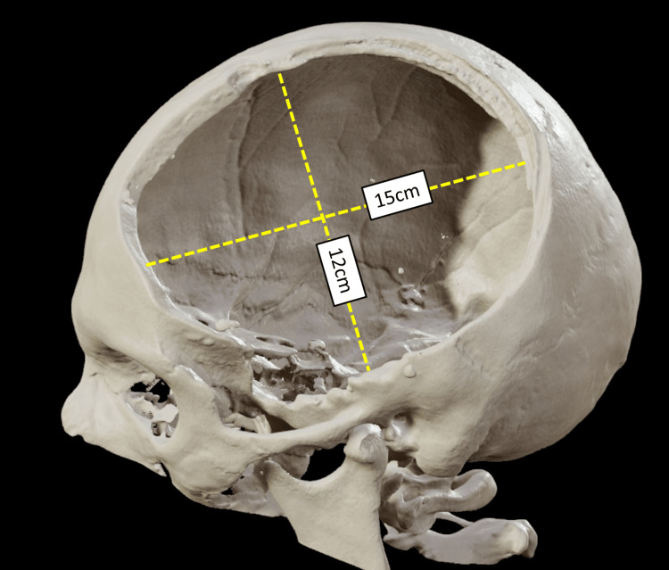
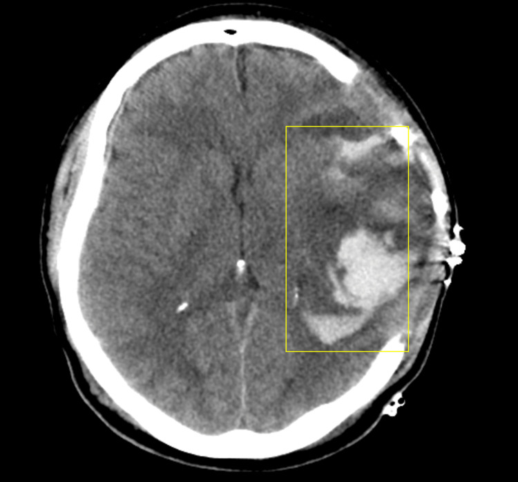
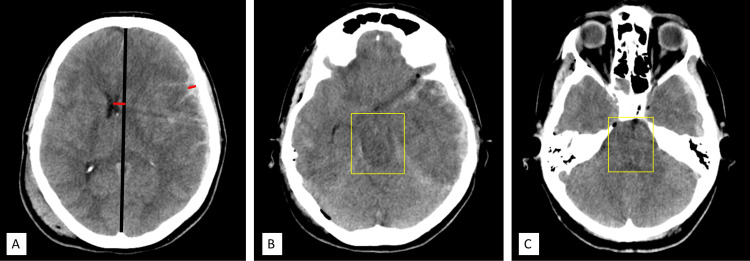
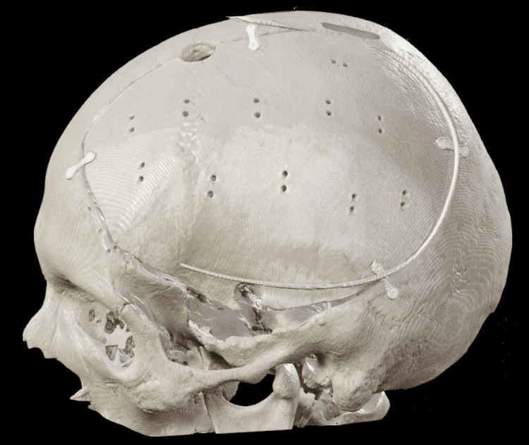
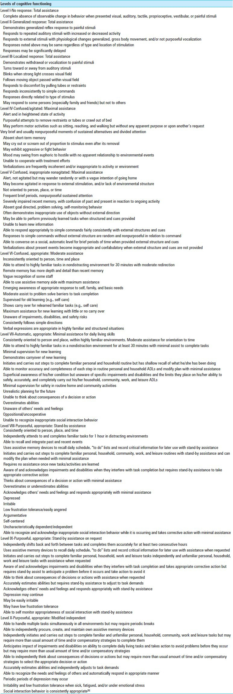
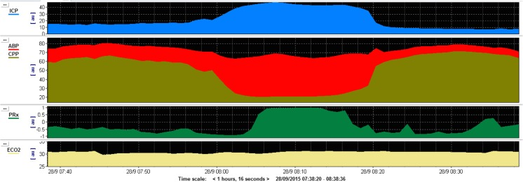
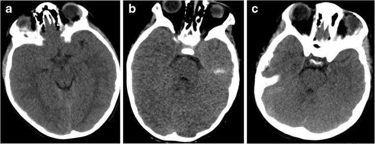

# Case Prep: Decompressive Craniectomy for Traumatic Brain Injury

<!-- BEGIN CASE SNAPSHOT -->

## Case / Approach Snapshot

- **Anatomy at risk:** hematoma compartment, fracture and sinus landmarks, cortical/venous/arterial injury, swollen brain physiology, dural edges, and decompressive flap constraints.
- **Operative steps:** move quickly from imaging to exposure, choose flap or burr-hole strategy, evacuate clot or decompress, control bleeding, decide duraplasty/bone-flap/drain strategy, and hand off to ICU resuscitation goals; use the detailed operative sequence and approach notes below as the step-by-step source.
- **Rescue plans:** refractory swelling, coagulopathy, venous sinus bleeding, arterial source, seizures, infection, hydrocephalus, malignant ICP, and staged decompression or reoperation.
- **Figures:** review [Figures, Imaging & Video](#figures-imaging--video) and the [Curated Image Set](#curated-image-set); embedded local figures should remain open-access, public-domain, or otherwise reusable with attribution.
- **Papers:** review [High-Yield Literature](#high-yield-literature) for seminal sources, modern reviews, and outcome data specific to this page.

<!-- END CASE SNAPSHOT -->

## One-Liner
[Age]yo [M/F] with severe TBI and refractory intracranial hypertension [± mass lesion] planned for [unilateral hemicraniectomy / bifrontal] decompressive craniectomy.

---

## Figures, Imaging & Video

**🎥 Operative video** — [search operative video on YouTube ▸](https://www.youtube.com/results?search_query=decompressive+craniectomy+surgery) · [The Neurosurgical Atlas ▸](https://www.neurosurgicalatlas.com)

> External sources — operative figures/atlases are copyrighted (linked, not copied). See [media-sources.md](../../resources/media-sources.md) for licensing.

**Operative technique**
- [The Neurosurgical Atlas](https://www.neurosurgicalatlas.com) — search *"decompressive craniectomy"* and *"traumatic brain injury"* (illustrations + HD video)

**Imaging**
- [Radiopaedia — Decompressive craniectomy](https://radiopaedia.org/search?q=decompressive%20craniectomy&scope=all) · [TBI](https://radiopaedia.org/articles/traumatic-brain-injury) · [Midline shift](https://radiopaedia.org/articles/midline-shift) · [Herniation](https://radiopaedia.org/articles/cerebral-herniation)

**Open-access figures**
- [PubMed Central](https://www.ncbi.nlm.nih.gov/pmc/?term=decompressive+craniectomy+traumatic+brain+injury) · [DECRA / RESCUEicp](https://www.ncbi.nlm.nih.gov/pmc/?term=DECRA+RESCUEicp+decompressive+craniectomy)

---

<!-- BEGIN CURATED LITERATURE -->

## High-Yield Literature

- **Guidelines for the Management of Severe Traumatic Brain Injury: 2020 Update of the Decompressive Craniectomy Recommendations** — Hawryluk GWJ. Neurosurgery 2020. [PubMed](https://pubmed.ncbi.nlm.nih.gov/32761068/)
- **Recent advances in traumatic brain injury** — Khellaf A. Journal of neurology 2019. [PubMed](https://pubmed.ncbi.nlm.nih.gov/31563989/)
- **Acute Management of Traumatic Brain Injury** — Vella MA. The Surgical clinics of North America 2017. [PubMed](https://pubmed.ncbi.nlm.nih.gov/28958355/)
- **Traumatic Brain Injury: Current Treatment Strategies and Future Endeavors** — Galgano M. Cell transplantation 2017. [PubMed](https://pubmed.ncbi.nlm.nih.gov/28933211/)
- **Decompressive Surgery for Patients with Traumatic Brain Injury** — Peters A. Anesthesiology clinics 2021. [PubMed](https://pubmed.ncbi.nlm.nih.gov/33563379/)
- **Management of Pediatric Severe Traumatic Brain Injury: 2019 Consensus and Guidelines-Based Algorithm for First and Second Tier Therapies** — Kochanek PM. Pediatric critical care medicine : a journal of the Society of Critical Care Medicine and the World Federation of Pediatric Intensive and Critical Care Societies 2019. [PubMed](https://pubmed.ncbi.nlm.nih.gov/30830015/)
- **Management and Challenges of Severe Traumatic Brain Injury** — Rakhit S. Seminars in respiratory and critical care medicine 2021. [PubMed](https://pubmed.ncbi.nlm.nih.gov/32916746/)
- **Decompressive Craniectomy for Pediatric Traumatic Brain Injury in Low-and-Middle Income and High Income Countries** — Gidda R. World neurosurgery 2022. [PubMed](https://pubmed.ncbi.nlm.nih.gov/35872132/)
- **The management of severe traumatic brain injury in the initial postinjury hours - current evidence and controversies** — Hossain I. Current opinion in critical care 2023. [PubMed](https://pubmed.ncbi.nlm.nih.gov/37851061/)
- **Paediatric traumatic brain injury** — Coulter IC. Current opinion in pediatrics 2019. [PubMed](https://pubmed.ncbi.nlm.nih.gov/31693586/)

<!-- END CURATED LITERATURE -->

<!-- BEGIN CURATED IMAGE SET -->

## Curated Image Set

Open-access figures are embedded from PubMed Central articles and kept unique to this guide.

*Figure 1. In DC, the bone flap needs to be at least 12 cm × 15 cm. It has been associated with better outcome.Authors' own creation/patient. Source: [Primary Decompressive Craniectomy After Traumatic Brain Injury: A Literature Review](https://pmc.ncbi.nlm.nih.gov/articles/PMC9631546/) — Cureus 2022; CC BY.*

*Figure 2. Postoperative intracerebral bleeding ("blooming or blossoming contusions") due to ICP reduction after DC is commonly seen and is associated with worse functional long-term... Source: [Primary Decompressive Craniectomy After Traumatic Brain Injury: A Literature Review](https://pmc.ncbi.nlm.nih.gov/articles/PMC9631546/) — Cureus 2022; CC BY.*

*Figure 3. (A) Midline shift greater than hematoma thickness ratio; (B) and (C) effaced basal cisterns.Authors' own creation/patient. Source: [Primary Decompressive Craniectomy After Traumatic Brain Injury: A Literature Review](https://pmc.ncbi.nlm.nih.gov/articles/PMC9631546/) — Cureus 2022; CC BY.*

*Figure 4. Cranioplasty.Authors' own creation/patient. Source: [Primary Decompressive Craniectomy After Traumatic Brain Injury: A Literature Review](https://pmc.ncbi.nlm.nih.gov/articles/PMC9631546/) — Cureus 2022; CC BY.*

*Figure 8. Source: [Pediatric traumatic brain injuries treated with decompressive craniectomy](https://pmc.ncbi.nlm.nih.gov/articles/PMC3815000/) — Surg Neurol Int. 2013 Sep 27;4:128. doi: 10.4103/2152-7806.119055; CC BY-NC-SA.*

*Fig. 1. This figure shows an example monitoring trace of a patient with intracranial hypertension as a result of a traumatic brain injury. The trace demonstrates a sustained plateau of... Source: [Decompressive craniectomy for traumatic intracranial hypertension: application in children](https://pmc.ncbi.nlm.nih.gov/articles/PMC5587789/) — Child's Nervous System 2017; CC BY.*

*Fig. 2. Representative image of paediatric patients with raised intracranial pressure. a Fourteen-year-old patient with acute subdural haematoma (ASDH), opening ICP 32 mmHg. b Seven-year-old... Source: [Decompressive craniectomy for traumatic intracranial hypertension: application in children](https://pmc.ncbi.nlm.nih.gov/articles/PMC5587789/) — Child's Nervous System 2017; CC BY.*

<!-- END CURATED IMAGE SET -->

---

## History of Present Illness
- Chief complaint: Severe TBI (GCS ≤ 8), refractory raised ICP despite maximal medical therapy
- Mechanism of injury (MVC, fall, assault, penetrating), speed/force, loss of consciousness at scene
- Initial GCS at scene and on arrival, pupillary response, associated lesions (contusions, SDH, EDH, diffuse edema)
- Pre-hospital course: intubation, hypotensive episodes, seizures, GCS trajectory
- **Evidence base:**
  - **DECRA trial (2011):** Bifrontal decompressive craniectomy for diffuse TBI with ICP > 20 for > 15 min — reduced ICP and ICU stay but more unfavorable outcomes at 6 months
  - **RESCUEicp trial (2016):** Decompression (hemicraniectomy or bifrontal) for ICP > 25 refractory to stage 1 and 2 medical management — reduced mortality (26.9% vs 48.9%) but more survivors in vegetative or lower severe disability states at 12 months
  - Counsel family on survival vs functional outcome tradeoff
- Primary decompression (performed at time of mass lesion evacuation when brain too swollen for bone replacement) vs secondary decompression (for refractory ICP after initial non-operative or operative management)

---

## Past Medical History
- Anticoagulant / antiplatelet use (warfarin, DOACs, aspirin, clopidogrel) — **must reverse before surgery**
- Prior craniectomy/craniotomy (adhesions, hardware); prior TBI; seizure disorder
- Coagulopathy or bleeding disorder (hemophilia, liver disease, thrombocytopenia)
- Cardiac / pulmonary / hepatic / renal comorbidities (affect anesthetic risk, CPP management, osmolar clearance)
- Diabetes mellitus (glycemic control affects TBI outcomes)
- Substance use (alcohol — coagulopathy/withdrawal; cocaine — vasospasm/hemorrhage)
- Advance directives / code status — **discuss early with family**
- Allergies:
- Medications:

---

## Imaging Review

### CT Head (Non-Contrast)
- **Hemorrhage type:** Epidural hematoma (EDH), acute subdural hematoma (SDH), traumatic subarachnoid hemorrhage (tSAH), intraparenchymal contusion, intraventricular hemorrhage (IVH)
- **Midline shift:** Measure at septum pellucidum; > 5 mm generally considered significant; > 10 mm with neurological decline is surgical
- **Cisternal effacement:** Basal cisterns (perimesencephalic, ambient, quadrigeminal) — effacement or obliteration indicates impending herniation
- **Signs of herniation:** Subfalcine (cingulate under falx), uncal/transtentorial (temporal lobe through notch, peduncle compression, Duret hemorrhages), tonsillar
- **Diffuse edema:** Loss of gray-white differentiation, sulcal effacement, slit ventricles
- **Skull fractures:** Linear, depressed, open/compound, skull base fractures
- **Marshall CT classification:** Diffuse injury I-IV, evacuated/non-evacuated mass lesion
- **Rotterdam CT score:** Sum of basal cisterns + midline shift + EDH + tSAH/IVH (0-6, predicts mortality)
- **Bilateral vs unilateral pathology** — guides decision: hemicraniectomy (lateralized) vs bifrontal (diffuse bilateral)

### CT Angiography (CTA)
- Traumatic vascular injury (dissection, pseudoaneurysm, occlusion)
- Venous sinuses (SSS thrombosis, transverse/sigmoid injury)
- Serial CT: repeat at 6h or with neuro change; monitor hemorrhage expansion, new contusions, edema (peak days 2-5)

---

## Labs
- **CBC** — Hgb (transfusion if < 7-8, consider higher threshold in active hemorrhage), Plt > 100K for surgery (transfuse platelets if on antiplatelets)
- **Coagulation studies** — PT/INR, PTT, fibrinogen (> 200)
  - **Reversal agents:** Warfarin → 4-factor PCC + Vit K 10mg IV; Dabigatran → idarucizumab 5g; Xa inhibitors → andexanet alfa or PCC; Heparin → protamine; Antiplatelets → platelet transfusion ± desmopressin
  - **Target:** INR < 1.4 before incision
- **BMP** — Na (baseline for osmolar therapy), K, Cr, glucose (target 140-180)
- **ABG** — pH, pCO2 (target 35-38), pO2, lactate
- **Type and crossmatch** — 2-4 units pRBC; TBI patients frequently coagulopathic
- **TEG / ROTEM** (if available) — point-of-care coag assessment; **ethanol level, UDS**

---

## Neurological Examination

### Glasgow Coma Scale (GCS)
- **E (Eye):** 4 spontaneous, 3 voice, 2 pain, 1 none
- **V (Verbal):** 5 oriented, 4 confused, 3 inappropriate, 2 incomprehensible, 1 none (T if intubated)
- **M (Motor):** 6 obeys, 5 localizes, 4 withdrawal, 3 abnormal flexion, 2 extension, 1 none — **M is most predictive for outcome**
- **Total:** E[__] + V[__] + M[__] = [__]; severe TBI = GCS ≤ 8

### Pupillary Examination
- Size (mm), reactivity, symmetry
- **Unilateral fixed dilated pupil:** Ipsilateral uncal herniation until proven otherwise — emergent intervention
- **Bilateral fixed dilated pupils:** Severe brainstem compression; poor prognosis but NOT necessarily irreversible if from acute herniation — emergent decompression may still be warranted
- **Traumatic mydriasis:** Direct globe/CN III injury — distinguish from herniation

### Brainstem Reflexes & Motor Exam
- Corneal (V/VII), oculocephalic (**only if C-spine cleared**), cough/gag (IX/X) — presence important for prognosis
- Best motor response each side; posturing: decorticate (flexion) vs decerebrate (extension) vs flaccid
- **Lateralizing signs guide surgical side** — beware Kernohan's notch (false-localizing ipsilateral hemiparesis)

### ICP / CPP (if monitored)
- Current ICP, trend, response to therapy; CPP = MAP − ICP (target ≥ 60); waveform (P2 > P1 = reduced compliance)

---

## Surgical Planning

### Case Logistics, OR Needs & Orders
- **OR setup:** trauma craniotomy/craniectomy tray, rapid blood availability, suction/bipolar/hemostatics, dural substitute, bone-flap storage or plating plan, ICP monitor/EVD supplies, and postop CT pathway cleared.
- **Special needs:** reversal of anticoagulants, seizure prophylaxis, hyperosmolar therapy plan, arterial line, Foley, temperature/glucose/coagulation targets, antibiotic/tetanus plan for open injuries, and family/ICU handoff.
- **Immediate postop orders:** ICU neuro checks, BP/CPP/ICP goals when monitored, CT head timing, drain/EVD settings, seizure prophylaxis duration, antibiotics for open/contaminated injuries, DVT prophylaxis timing, and repeat labs/coags.

### Diagnosis & Indication
- Working diagnosis: Severe TBI with refractory intracranial hypertension [± acute subdural hematoma / contusion / diffuse edema]
- Indication: Refractory intracranial hypertension (ICP > 22 mmHg sustained despite tiered medical management) ± mass lesion needing evacuation
- **Indications by trial criteria:**
  - **DECRA criteria (bifrontal):** Diffuse (non-mass) TBI, ICP > 20 mmHg for > 15 min (continuous or cumulative in 1 hour), refractory to first-tier medical therapy
  - **RESCUEicp criteria:** ICP > 25 mmHg for 1-12 hours, refractory to stage 1 and 2 medical management (sedation, osmotherapy, CSF drainage, mild hyperventilation)
  - **Primary decompression:** Mass lesion evacuation where brain too swollen to replace bone flap safely
- Goals: Reduce ICP, prevent secondary brain injury from herniation, allow room for cerebral edema to peak and resolve
- **Unilateral hemicraniectomy** — lateralized pathology or predominantly unilateral swelling (most common)
- **Bifrontal craniectomy** — diffuse bilateral edema without lateralized mass lesion

### Timing
- **Primary:** At initial craniotomy for mass lesion when brain too swollen for bone replacement — intraoperative decision
- **Secondary:** After failed maximal medical ICP management — hours to days post-injury; earlier is better once decided

### Bone Flap Size
- **Must be ≥ 12 x 15 cm (ideally 14-15 cm AP)** — small flap is worse than no decompression (cortical strangulation, venous infarction, herniation through defect); must include temporal decompression to middle fossa floor

### Position
- **Hemicraniectomy:** Supine, head turned 30-45° contralateral, shoulder roll, slight head-up. Horseshoe or Mayfield
- **Bifrontal:** Supine, neutral, Mayfield. All pressure points padded; C-spine precautions if not cleared

### Equipment & Instrumentation
- Craniotome, perforator drill, high-speed drill (temporal floor), Kerrison rongeurs
- Dural substitute (large — for expansile duraplasty): autologous pericranium (preferred), bovine pericardium (DuraGuard), collagen matrix (DuraGen), or synthetic (Gore-Tex)
- ICP monitor (Codman/Integra bolt or EVD kit), subgaleal drain (JP or Blake)
- Hemostatic agents (Surgicel, Gelfoam, Floseal), bone wax, Raney clips, bone flap storage supplies

### Monitoring
- Arterial line (pre-induction), central venous catheter, Foley (strict I/Os)
- ICP monitor (existing or placed intraoperatively); core temperature
- SSEPs/MEPs generally NOT used — patients comatose, goal is decompression not functional mapping

### Anesthesia Considerations
- **Avoid hypotension** (SBP > 100 at all times — single greatest modifiable predictor of poor TBI outcome); RSI if not already intubated
- Propofol/fentanyl/rocuronium induction; avoid nitrous oxide (pneumocephalus), prolonged hyperventilation (brief pCO2 30-32 only for impending herniation)
- Mannitol 1 g/kg or 23.4% saline 30 mL available pre-incision if herniation imminent
- Blood products in room: 2-4 units pRBC, FFP/platelets/cryo per coags; TXA 1g IV if < 3h from injury (CRASH-2)
- **Do not delay surgery for full coagulopathy correction if herniation is imminent** — correct concurrently
- Cefazolin 2g IV; maintain normothermia, normoglycemia (140-180), normovolemia; A-line transducer at tragus for CPP

### Potential Complications
1. **Inadequate decompression** (small flap) — cortical strangulation, venous infarction, herniation through defect
2. **Hemorrhagic contusion expansion;** postoperative epidural/subdural hemorrhage
3. **Hydrocephalus** (communicating); **subdural hygroma** (CSF collection post-craniectomy)
4. **Infection** — wound, bone flap, meningitis, empyema
5. **Sinking skin flap / syndrome of the trephined** — atmospheric pressure on brain; treated with cranioplasty
6. **Paradoxical herniation** through defect (especially with LP/lumbar drain)
7. **Seizures;** coagulopathy progression (TBI-associated DIC)

---

## Key Surgical Steps — Detailed

1. **Incision** — Large **reverse question-mark (trauma flap)** for hemicraniectomy: starts at the zygoma (1 cm anterior to the tragus), curves posteriorly above the ear, then superiorly and anteriorly across the midline to the frontal hairline. **Bicoronal** incision for bifrontal craniectomy. Reflect the scalp and temporalis muscle as a myocutaneous flap anteroinferiorly. **Harvest pericranium** early if planning autologous duraplasty. Protect the superficial temporal artery pedicle when feasible (potential future bypass)

2. **Burr holes and craniotomy** — Place burr holes: keyhole (frontal), temporal (above zygomatic root), posterior (parietal), and parasagittal. Turn the bone flap with a craniotome. **The flap must be large: ≥ 12 x 15 cm (ideally 14-15 cm AP diameter).** Measure and document the bone flap dimensions

3. **Temporal decompression** — **Rongeur the temporal squama down to the floor of the middle fossa** — this is the single most critical step for relieving uncal/tentorial herniation and brainstem compression. Keep the medial edge of the craniectomy ~2.5 cm from the midline to protect the **superior sagittal sinus** and parasagittal bridging veins

4. **Bifrontal variation** — Bilateral frontal craniotomy extending to the floor of the anterior fossa. If required for additional decompression, the anterior superior sagittal sinus (anterior third only, which has minimal drainage) may be ligated and the falx divided

5. **Evacuate mass lesion** — Open dura and evacuate any subdural hematoma, epidural hematoma, or accessible contusion. Irrigate thoroughly and obtain hemostasis. **Do NOT resect viable brain tissue;** debride only frankly necrotic or non-viable herniating tissue if it prevents safe closure

6. **Dural opening** — Open the dura widely in a **stellate or large C-shaped** fashion to allow the brain to expand freely. Tack the dural edges to the bone margin circumferentially with 4-0 silk to prevent epidural hemorrhage collection

7. **Expansile duraplasty** — Sew in a large dural graft **loosely** using running or interrupted 4-0 Nurolon/silk to augment the intradural volume significantly. **Never close the dura tightly** — this defeats the purpose of the decompression. Options for duraplasty material:
   - **Autologous pericranium** — preferred when available; harvested at beginning of case, low infection risk
   - **Bovine pericardium** (DuraGuard) — readily available, good handling
   - **Collagen matrix** (DuraGen, DuraMatrix) — onlay technique possible, no suturing required in some applications
   - **Synthetic** (Gore-Tex, Neuropatch) — watertight but higher infection risk; avoid in contaminated wounds

8. **ICP monitor / EVD placement** — Place an intraparenchymal ICP monitor (Codman/Integra bolt) in the frontal lobe on the contralateral (non-decompressed) side, or an EVD if CSF drainage is also desired. Alternatively, place on the ipsilateral side remote from the craniectomy edge. Confirm waveform and baseline reading

9. **Bone flap storage** — **Subcutaneous abdominal pocket** (lower abdomen; preserves bone with blood supply, no freezer risk; second incision required) or **bone bank cryopreservation** at −80°C (simpler, no second wound; higher resorption and freezer-failure risk). Label clearly for future cranioplasty

10. **Bilateral craniectomy considerations** — In cases of diffuse bilateral swelling requiring bilateral hemicraniectomies: leave a midline bone bar (2-3 cm) over the superior sagittal sinus to protect it. Alternatively, a single large bifrontal flap with falx division may be used. Bilateral hemicraniectomies carry significantly higher morbidity

11. **Subgaleal drain and closure** — Place a subgaleal drain (Jackson-Pratt). Close the galea with 2-0 Vicryl interrupted sutures and the skin with staples or 3-0 nylon. **Ensure the scalp closes loosely** over the swollen brain without tension — if tension exists, the skin flap may need to be undermined further or a relaxing incision considered. Confirm hemostasis meticulously (coagulopathy is the rule in severe TBI — correct concurrently)

---

## Operative Note Template

**Preoperative Diagnosis:** Severe traumatic brain injury with refractory intracranial hypertension [± acute subdural hematoma / cerebral contusions / diffuse cerebral edema / midline shift of ___mm]

**Postoperative Diagnosis:** Same

**Procedure:** [Right/Left] decompressive hemicraniectomy [/ bifrontal decompressive craniectomy] with expansile duraplasty [, evacuation of acute subdural hematoma] [, evacuation of cerebral contusion] [, and placement of intraparenchymal ICP monitor / external ventricular drain]

**Surgeon:** [___]
**Assistant:** [___]
**Anesthesia:** General endotracheal
**Antibiotics:** Cefazolin 2g IV
**Position:** Supine, head [turned to contralateral side / neutral]
**Head fixation:** [Horseshoe headrest / Mayfield 3-pin skull clamp]

**EBL:** [___] mL
**Fluids:** [___] mL crystalloid, [___] units pRBC, [___] units FFP, [___] units platelets
**UOP:** [___] mL
**Specimens:** [None / Hematoma / Necrotic brain tissue sent for pathology]
**Drains:** Subgaleal Jackson-Pratt drain [± EVD / intraparenchymal ICP monitor]
**Implants:** [Dural substitute type and size]; [ICP monitor type / EVD]; bone flap stored in [subcutaneous abdominal pocket / bone bank at −80°C]
**Complications:** [None / ___]

**Indications:**
The patient is a [age]-year-old [male/female] who [sustained a severe traumatic brain injury via (mechanism)] with an initial GCS of [___] (E[__]V[__]M[__]). CT head demonstrated [acute subdural hematoma measuring ___mm / diffuse cerebral edema / hemorrhagic contusions in ___ / midline shift of ___mm / cisternal effacement]. Despite maximal medical management including [sedation, osmolar therapy (mannitol/hypertonic saline), CSF drainage via EVD, neuromuscular blockade], intracranial pressure remained elevated at [___] mmHg for [___] hours. [Alternatively for primary decompression: Intraoperatively, after evacuation of the mass lesion, the brain remained severely swollen and could not be safely replaced under the bone flap.] The decision was made to proceed with emergent decompressive craniectomy as a life-saving measure. The risks, benefits, and expected outcomes — including survival with potential significant disability (per DECRA/RESCUEicp evidence) — were discussed with the family [/ healthcare surrogate], who wished to proceed.

**Description of Procedure:**
The patient was brought emergently to the OR. Time-out was performed. General anesthesia was induced [/ patient already intubated]. Arterial line [and CVL] confirmed. Coags reviewed and [corrected with ___ / acceptable]. [Mannitol ___ g IV / 23.4% saline 30 mL given for ICP management.] Positioned supine, head [turned 30-45° contralateral on horseshoe / in Mayfield neutral]. Shoulder roll placed. Pressure points padded. [C-spine precautions maintained.] Prepped and draped in standard sterile fashion.

A large [reverse question-mark / bicoronal] incision was made. Raney clips applied. Scalp and temporalis reflected as myocutaneous flap, preserving the STA pedicle. [Pericranium harvested for duraplasty.] Burr holes placed at [keyhole, temporal, posterior parietal, parasagittal]. A large bone flap (~[___] x [___] cm) was elevated. Temporal squama rongeured to the middle fossa floor. Medial margin kept ~2.5 cm from midline to protect the SSS. [Bifrontal variation: bilateral frontal bone removed to anterior fossa floor; anterior SSS (ligated / preserved), falx (divided / intact).] Bone flap dimensions documented.

Dura was tense and [blue-tinged / tight]. Opened in a [stellate / C-shaped] fashion. [Acute SDH evacuated with irrigation and suction; cortical hemostasis with bipolar and Surgicel. / Diffuse edema with brain herniating through opening.] [Contusion in ___ lobe evacuated / left in situ.] Meticulous hemostasis obtained. Expansile duraplasty performed with [pericranium / bovine pericardium / DuraGen] sewn loosely to native dural edges with 4-0 [Nurolon / silk], left intentionally lax.

A [Codman ICP monitor / EVD] placed in [R/L] frontal region [contralateral to craniectomy], tunneled ~5 cm, secured. Opening ICP [___] mmHg with good waveform. Bone flap [stored in subcutaneous abdominal pocket / sent to bone bank at −80°C]. Subgaleal drain placed. Galea closed with 2-0 Vicryl, skin with [staples / 3-0 nylon] without tension. Sterile dressing applied.

The patient was transported intubated and sedated to the NSICU in [critical but stable] condition. [Pupils ___ postop. ICP on NSICU arrival ___ mmHg.]

---

## Postoperative Plan

### ICP Management (Tiered Approach)
- **Target ICP < 22 mmHg, CPP 60-70 mmHg** (avoid CPP > 70 — increased ARDS risk per BTF guidelines)
- **Tier 0 (baseline):** HOB 30 degrees, head midline (no jugular venous obstruction), sedation (propofol/fentanyl), normothermia, normovolemia, normoglycemia, adequate oxygenation
- **Tier 1:** Osmolar therapy — mannitol 20% (0.25-1 g/kg q4-6h, hold if serum osm > 320) or hypertonic saline 3% infusion (target Na 145-155) or 23.4% bolus (30 mL via central line for acute spikes)
- **Tier 2:** CSF drainage via EVD (if placed), neuromuscular blockade (cisatracurium), mild hyperventilation (pCO2 30-35 — only as temporizing measure)
- **Tier 3:** Decompressive craniectomy (already performed); barbiturate coma (pentobarbital) if ICP remains refractory despite decompression (last resort)

### Monitoring & Osmolar Therapy
- Neuro checks q1h (GCS, pupils, motor exam)
- Continuous ICP monitoring — trends, waveform, drain function
- Arterial line for continuous MAP and CPP calculation
- Serial CT head: 6h postop, 24h, then with any neuro change (edema peaks days 2-5)
- Na/osmolality q4-6h while on osmolar therapy
- Mannitol: serum osm < 320 mOsm/L, replace UOP (osmotic diuretic)
- Hypertonic saline: target Na 145-155 mEq/L; wean gradually to avoid rebound edema

### Temperature, Seizure Prophylaxis & DVT
- **Normothermia (36-37°C)** — fever worsens secondary injury; treat aggressively (acetaminophen, cooling blankets)
- Therapeutic hypothermia NOT routinely recommended (Eurotherm, POLAR trials — no benefit); consider only as rescue
- Levetiracetam 500-1000 mg BID x 7 days (BTF guidelines — early seizure prophylaxis); late prophylaxis (> 7d) NOT recommended
- Continuous EEG if GCS remains low (non-convulsive seizures common and underdiagnosed)
- SCDs immediately; pharmacologic DVT prophylaxis (enoxaparin 40 mg SQ daily) start 24-48h postop once hemorrhage stable on CT

### Nutrition & Metabolic
- Early enteral nutrition within 48-72h (TBI is hypermetabolic)
- Glucose 140-180 mg/dL; avoid hyponatremia (cerebral salt wasting common)

### Cranioplasty Planning
- **Timing: typically 6-12 weeks** after decompressive craniectomy, once cerebral edema has resolved and the patient is medically stable
- Earlier cranioplasty (< 6 weeks) may be considered if the patient develops syndrome of the trephined (neurological deterioration attributed to atmospheric pressure on the brain)
- Evaluate for hydrocephalus before cranioplasty — may need VP shunt placement at the same sitting
- Options: Autologous bone flap (from abdominal pocket or bone bank), custom PEEK/titanium implant (if autologous bone has been resorbed or is unavailable)

### Rehabilitation & Prognosis
- Early PT/OT/SLP consultation (within 48-72h of stabilization)
- Tracheostomy and PEG evaluation if prolonged intubation expected (assess day 7-14)
- **Prognosis (RESCUEicp 12-month data):** Mortality ~27%; favorable outcome (moderate disability/good recovery) ~42%; vegetative ~8%; severe disability ~22%
- **Do NOT prognosticate in first 72 hours** — early prognostication is unreliable; serial assessments over weeks; age, GCS motor, pupils, and CT findings are strongest predictors
- Goals-of-care discussions — ongoing with family/surrogate and interdisciplinary team
- Disposition: acute rehab vs skilled nursing vs LTAC, depending on trajectory

### Follow-up
- Neurosurgery clinic: 2-4 weeks postop (wound check, CT head, neurological assessment)
- Cranioplasty scheduling: 6-12 weeks (with pre-op CT for implant planning)
- Long-term: seizure monitoring, cognitive rehabilitation, neuropsychological evaluation

<!-- BEGIN CHIEF LEVEL TAKEAWAYS -->

## Chief-Level Case Review

Use these as the senior-level mental model for **Decompressive Craniectomy for Traumatic Brain Injury**:

- **Decision point:** Treat physiology while preparing the room: airway, reversal, transfusion, ICP/CPP, sodium/osmolality, temperature, and repeat imaging drive timing as much as the scan finding.
- **Technical lever:** Know the operative priority: decompression, hemorrhage control, debridement, dural closure, reconstruction, stabilization, or contamination control.
- **Bailout:** Plan for swelling and coagulopathy: bone flap decision, duraplasty size, drain/EVD need, hemostatic adjuncts, and ICU handoff should be decided early.
- **Postop watch:** Postop failure modes are predictable: expanding hematoma, malignant edema, seizure, infection, CSF leak, venous sinus injury, and missed associated spine/vascular injury.

<!-- END CHIEF LEVEL TAKEAWAYS -->

<!-- BEGIN COMMON PIMP QUESTIONS -->

## Common Pimp Questions

Use these to pressure-test preparation for **Decompressive Craniectomy for Traumatic Brain Injury**:

1. What is the life-threatening mass-effect problem and what is the operative endpoint?
2. What anticoagulant/antiplatelet reversal and blood-product plan is required before incision?
3. What exposure gives rapid control while preserving options for expansion?
4. What ICP, seizure, sodium, ventilation, and blood-pressure targets matter immediately postop?
5. What injury pattern or associated lesion would change the incision, bone flap, or disposition?

<!-- END COMMON PIMP QUESTIONS -->

<!-- BEGIN ATTENDING PREFERENCE VARIABLES -->

## Attending Preference Variables

Items that commonly vary by surgeon or institution:

- **Bone flap replacement versus decompressive storage threshold:** [attending-specific]
- **Preferred hemostatic agents, dural substitute, tack-up pattern, and drain use:** [attending-specific]
- **ICP monitor/EVD threshold, sodium target, seizure prophylaxis, and repeat CT timing:** [attending-specific]
- **Reversal product sequence and postop anticoagulation/DVT timing:** [attending-specific]

<!-- END ATTENDING PREFERENCE VARIABLES -->
