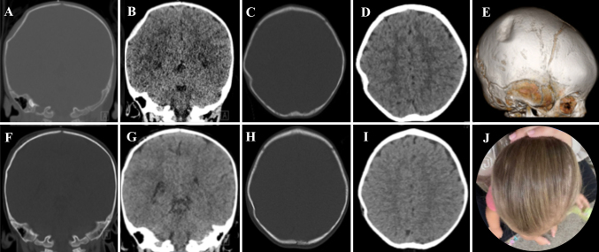
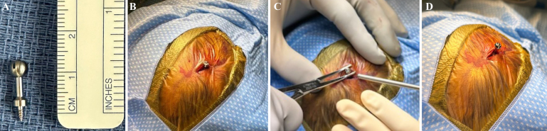
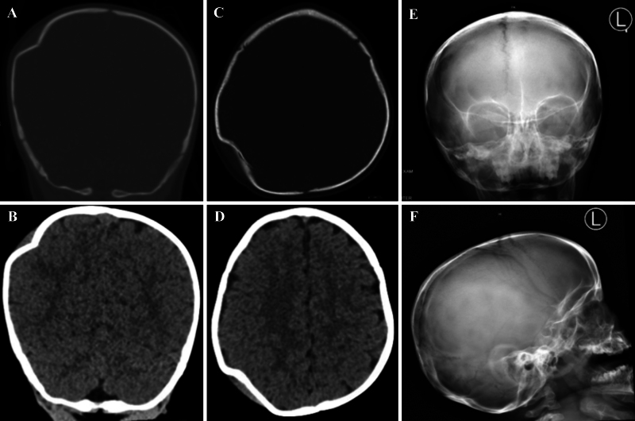
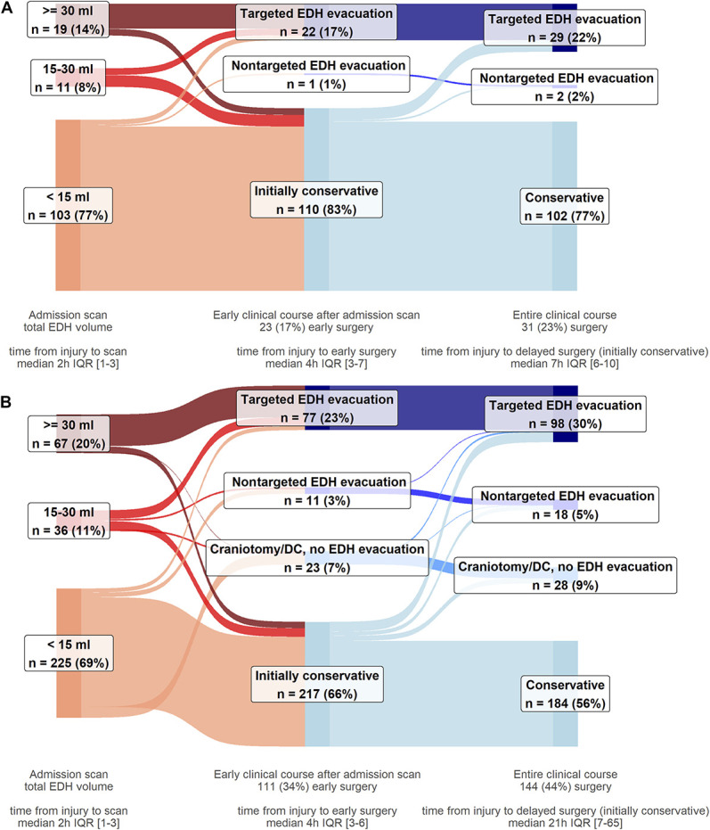
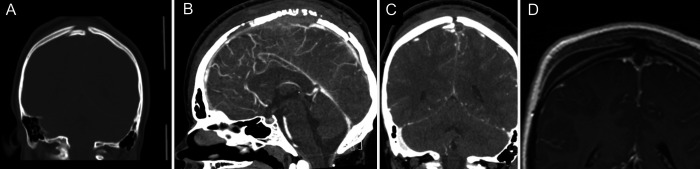
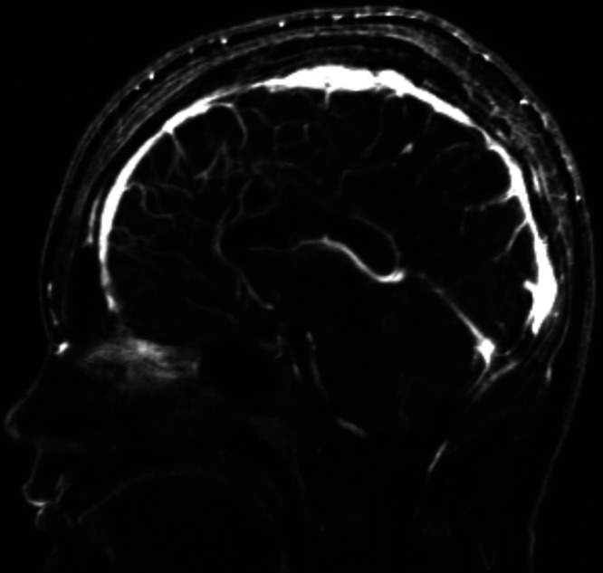
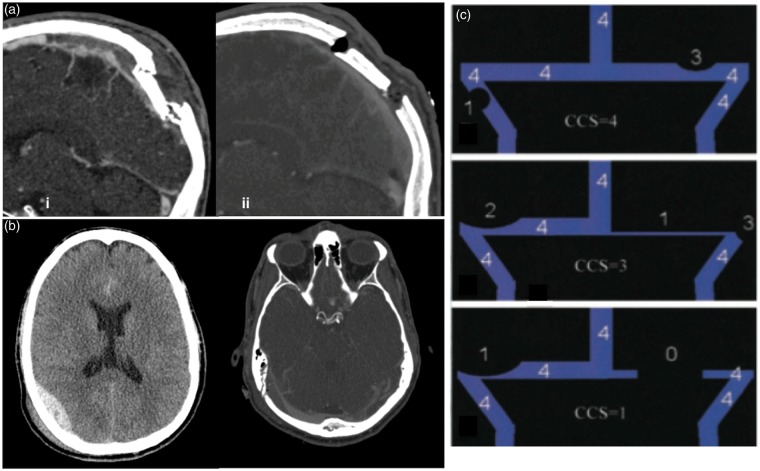
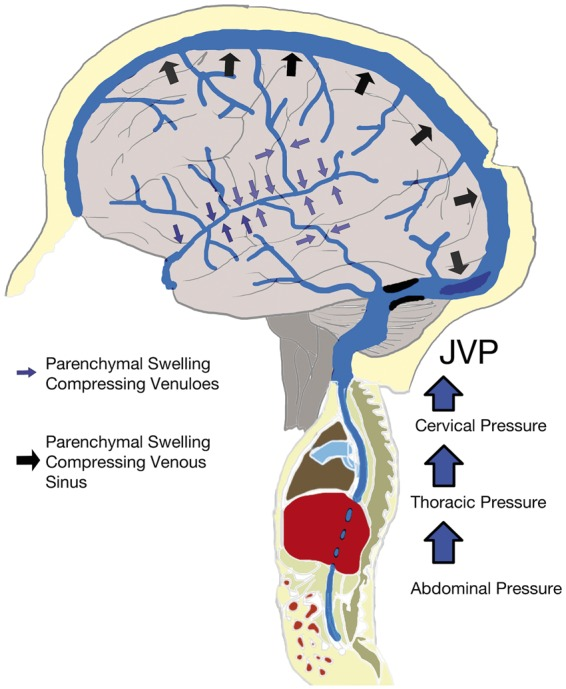
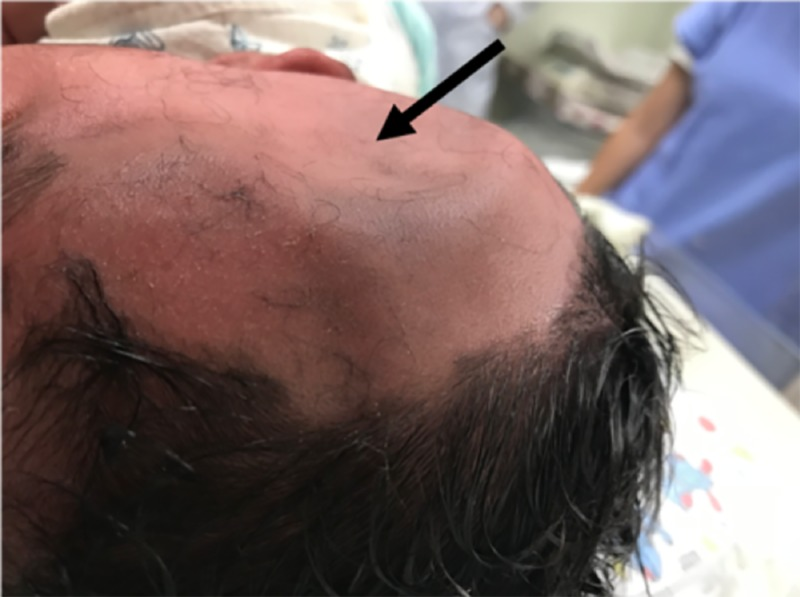
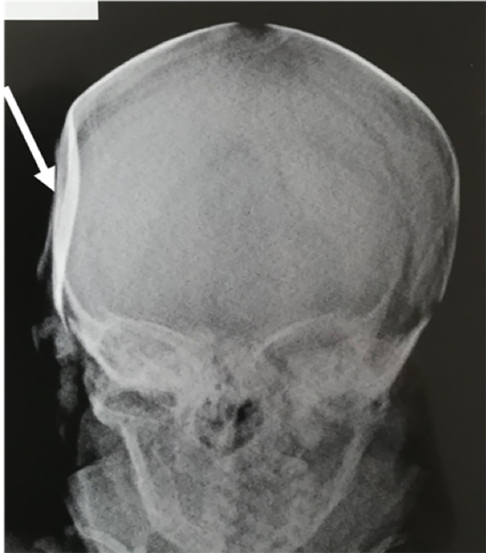

# Case Prep: Depressed Skull Fracture Elevation

---

<!-- BEGIN CASE SNAPSHOT -->

## Case / Approach Snapshot

- **Anatomy at risk:** hematoma compartment, fracture and sinus landmarks, cortical/venous/arterial injury, swollen brain physiology, dural edges, and decompressive flap constraints.
- **Operative steps:** move quickly from imaging to exposure, choose flap or burr-hole strategy, evacuate clot or decompress, control bleeding, decide duraplasty/bone-flap/drain strategy, and hand off to ICU resuscitation goals; use the detailed operative sequence and approach notes below as the step-by-step source.
- **Rescue plans:** refractory swelling, coagulopathy, venous sinus bleeding, arterial source, seizures, infection, hydrocephalus, malignant ICP, and staged decompression or reoperation.
- **Figures:** review [Figures, Imaging & Video](#figures-imaging--video) and the [Curated Image Set](#curated-image-set); embedded local figures should remain open-access, public-domain, or otherwise reusable with attribution.
- **Papers:** review [High-Yield Literature](#high-yield-literature) for seminal sources, modern reviews, and outcome data specific to this page.

<!-- END CASE SNAPSHOT -->

## One-Liner
[Age]yo [M/F] with a [closed/open (compound)] depressed skull fracture of the [location] [± underlying dural/parenchymal injury] following [mechanism] planned for craniotomy for elevation and debridement.

---

## Figures, Imaging & Video

**🎥 Operative video** — [search operative video on YouTube ▸](https://www.youtube.com/results?search_query=depressed+skull+fracture+surgery) · [The Neurosurgical Atlas ▸](https://www.neurosurgicalatlas.com)

> External sources — operative figures/atlases are copyrighted (linked, not copied). See [media-sources.md](../../resources/media-sources.md) for licensing.

**Operative technique & approach**
- [The Neurosurgical Atlas](https://www.neurosurgicalatlas.com) — search *"depressed skull fracture"* (operative illustrations + HD video)
- [AANS Neurosurgeon](https://www.aansneurosurgeon.org) — trauma craniotomy and skull fracture management articles

**Imaging**
- [Radiopaedia — depressed skull fracture](https://radiopaedia.org/search?q=depressed%20skull%20fracture&scope=all)

**Open-access figures**
- [PubMed Central](https://www.ncbi.nlm.nih.gov/pmc/?term=depressed+skull+fracture+elevation)

---

<!-- BEGIN CURATED LITERATURE -->

## High-Yield Literature

- **Elevation of Depressed Skull Fracture in Neonates Using a Breast Pump and a Custom-Molded Flange** — Martinez EL. Operative neurosurgery (Hagerstown, Md.) 2024. [PubMed](https://pubmed.ncbi.nlm.nih.gov/38299805/)
- **Depressed Skull Fracture in Infants: The Role of Vacuum-Assisted Intervention** — Villahermosa A. NeoReviews 2024. [PubMed](https://pubmed.ncbi.nlm.nih.gov/39616143/)
- **Depressed skull fracture compressing eloquent cortex causing focal neurologic deficits** — In A. Brain injury 2023. [PubMed](https://pubmed.ncbi.nlm.nih.gov/36703296/)
- **Everted skull fracture** — Balasubramaniam S. World neurosurgery 2011. [PubMed](https://pubmed.ncbi.nlm.nih.gov/22152585/)
- **Midline depressed skull fracture presenting with quadriplegia: A rare phenomenon** — Mathew MJ. Surgical neurology international 2017. [PubMed](https://pubmed.ncbi.nlm.nih.gov/28458953/)
- **Delayed repair of open depressed skull fracture** — Curry DJ. Pediatric neurosurgery 1999. [PubMed](https://pubmed.ncbi.nlm.nih.gov/10702728/)
- **The Evolution of Modern Treatment for Depressed Skull Fractures** — Stein SC. World neurosurgery 2019. [PubMed](https://pubmed.ncbi.nlm.nih.gov/30326316/)
- **Pediatric ping-pong skull fractures treated with vacuum-assisted elevation** — Ahmed SD. Child's nervous system : ChNS : official journal of the International Society for Pediatric Neurosurgery 2024. [PubMed](https://pubmed.ncbi.nlm.nih.gov/38411706/)
- **Depressed skull fracture overlying the superior sagittal sinus causing benign intracranial hypertension. Description of two cases and review of the literature** — Fuentes S. British journal of neurosurgery 2005. [PubMed](https://pubmed.ncbi.nlm.nih.gov/16455569/)
- **Depressed skull fracture in Ping Pong: elevation with Medeva extractor** — Mastrapa TL. Child's nervous system : ChNS : official journal of the International Society for Pediatric Neurosurgery 2007. [PubMed](https://pubmed.ncbi.nlm.nih.gov/17486354/)

<!-- END CURATED LITERATURE -->

---

<!-- BEGIN CURATED IMAGE SET -->

## Curated Image Set

Open-access figures are embedded from PubMed Central articles and kept unique to this guide.

*FIG. 1.. Case 1.Preoperative coronal bone (A) and brain (B) window noncontrast CT scans, axial bone (C) and brain (D) window noncontrast CT scans, and a 3D reconstruction (E) showing a depressed... Source: [Use of a percutaneous bone fiducial screw for elevating simple closed depressed skull fractures: illustrative cases](https://pmc.ncbi.nlm.nih.gov/articles/PMC11558686/) — Journal of Neurosurgery: Case Lessons 2024; CC BY-NC-ND.*

*FIG. 2.. Case 1. A: The bone fiducial used: total length 1.5 cm, screwhead length 3 mm. B: Percutaneous placement of the bone fiducial at the point of maximal fracture depression. C: Elevation of... Source: [Use of a percutaneous bone fiducial screw for elevating simple closed depressed skull fractures: illustrative cases](https://pmc.ncbi.nlm.nih.gov/articles/PMC11558686/) — Journal of Neurosurgery: Case Lessons 2024; CC BY-NC-ND.*

*FIG. 3.. Case 2.Images showing the elevation of a right parietal depressed skull fracture. Preoperative coronal bone (A) and brain (B) window noncontrast CT scans. Preoperative axial bone (C) and... Source: [Use of a percutaneous bone fiducial screw for elevating simple closed depressed skull fractures: illustrative cases](https://pmc.ncbi.nlm.nih.gov/articles/PMC11558686/) — Journal of Neurosurgery: Case Lessons 2024; CC BY-NC-ND.*

*FIGURE 2.. Surgical care pathways of participants with EDHs, by presence of concomitant acute subdural hematomas and/or IPHs on the first scan. A, Participants with isolated EDHs (n = 133). Most of... Source: [Clinical and Imaging Characteristics, Care Pathways, and Outcomes of Traumatic Epidural Hematomas: A Collaborative European NeuroTrauma Effectiveness Research in Traumatic Brain Injury Study](https://pmc.ncbi.nlm.nih.gov/articles/PMC11449426/) — Neurosurgery 2024; CC BY.*

*FIG. 1.. A: Coronal CT shows depressed skull fracture fragment at midline. B: Sagittal CT venogram (CTV) shows occlusion of SSS anterior to fracture. C: Coronal CTV shows thrombus in sagittal... Source: [Pediatric skull fracture with injury and thrombosis of the superior sagittal sinus: illustrative case](https://pmc.ncbi.nlm.nih.gov/articles/PMC9237661/) — Journal of Neurosurgery: Case Lessons 2022; CC BY-NC-ND.*

*FIG. 2.. MRV at follow-up showing resolution of sagittal sinus thrombosis. Source: [Pediatric skull fracture with injury and thrombosis of the superior sagittal sinus: illustrative case](https://pmc.ncbi.nlm.nih.gov/articles/PMC9237661/) — Journal of Neurosurgery: Case Lessons 2022; CC BY-NC-ND.*

*Figure 4.. (a) Depressed skull fracture and subsequent (superior sagittal sinus) SSS thrombosis caused by a hammer blow – (i) midsagittal reconstruction on day 2 with increasing headaches... Source: [Monro-Kellie 2.0: The dynamic vascular and venous pathophysiological components of intracranial pressure](https://pmc.ncbi.nlm.nih.gov/articles/PMC4971608/) — Journal of Cerebral Blood Flow & Metabolism 2016; CC BY-NC.*

*Figure 7.. Diagram demonstrating that relative venous outflow restriction can occur intracranially (with compression/obstruction (e.g. with thrombus or fractures) of isolated or diffuse venous... Source: [Monro-Kellie 2.0: The dynamic vascular and venous pathophysiological components of intracranial pressure](https://pmc.ncbi.nlm.nih.gov/articles/PMC4971608/) — Journal of Cerebral Blood Flow & Metabolism 2016; CC BY-NC.*

*Figure 1. Illustrative case – Lateral head photograph showing the depressed skull fracture (black arrow). Source: [Closed Depressed Skull Fracture in Childhood Reduced with Suction Cup Vacuum Method: Case Report and a Systematic Literature Review](https://pmc.ncbi.nlm.nih.gov/articles/PMC6758970/) — Cureus 2019; CC BY.*

*Figure 2. Illustrative case – Anteroposterior X-ray showing the bone deformity (white arrow). Source: [Closed Depressed Skull Fracture in Childhood Reduced with Suction Cup Vacuum Method: Case Report and a Systematic Literature Review](https://pmc.ncbi.nlm.nih.gov/articles/PMC6758970/) — Cureus 2019; CC BY.*

<!-- END CURATED IMAGE SET -->

---

## History of Present Illness
- Chief complaint: Head trauma with scalp laceration / focal deficit / seizure
- Mechanism: blunt focal impact, assault, fall, projectile
- **Open vs closed:** open (compound) = scalp laceration communicating with fracture → infection risk → urgent surgery
- GCS at scene → current:
- Focal deficits, seizure, CSF leak from wound
- Time since injury:
- Contamination: soil, debris, hair in wound (open fractures)

---

## Past Medical History
- Anticoagulant use (warfarin, DOACs — apixaban, rivaroxaban, dabigatran)
- Antiplatelet use (aspirin, clopidogrel, ticagrelor)
- Coagulopathy (hemophilia, liver disease, thrombocytopenia)
- Immunosuppression (steroids, chemotherapy, transplant) — increased infection risk with open fractures
- Prior craniotomy or craniectomy (altered anatomy, existing hardware)
- Seizure history
- Prior TBI
- Diabetes (wound healing, infection risk)
- Alcohol/substance use (fall risk, coagulopathy)
- Tetanus immunization status (critical for open/compound fractures)
- Allergies:
- Medications:

---

## Imaging Review

### CT Head — Bone Windows
- **Depression depth:** Surgical if depressed greater than full skull thickness (~1 table width) or beyond the inner table
- **Fragment pattern:** Single depressed fragment vs comminuted (multiple fragments)
- **Location:** Convexity (frontal, parietal, temporal, occipital); over a venous sinus (relative caution)
- **Overlying laceration / air:** Suggests open (compound) fracture
- **Frontal sinus involvement:** Requires cranialization or obliteration if posterior wall fractured
- **Foreign body:** Projectile fragments, bone driven intracranially

### CT Head — Brain Windows
- **Underlying contusion:** Hemorrhagic contusion beneath the depressed segment
- **Epidural / subdural hematoma:** Associated extra-axial collection requiring evacuation
- **Pneumocephalus:** Air intracranially confirms dural violation
- **Intraventricular hemorrhage:** Severity marker
- **Midline shift:** From underlying mass lesion

### CT Venogram (if fracture overlies a venous sinus)
- Sinus patency: Patent vs thrombosed vs lacerated
- Relationship of depressed fragments to sinus wall
- Collateral venous drainage (if sinus sacrifice may be required)

### Criteria for Surgical Intervention
- Depression greater than one full table thickness (inner table)
- Open (compound) fracture — urgent debridement and elevation
- Underlying mass lesion requiring evacuation (EDH, SDH, contusion)
- Dural laceration / CSF leak
- Gross cosmetic deformity
- Neurological deficit attributable to the fracture
- Frontal sinus posterior wall involvement
- **Non-operative candidates:** Closed fracture, minimal depression, no dural breach, no deficit, no cosmetic concern — serial imaging and observation

---

## Labs
- CBC (Hgb baseline, Plt > 100K for surgery)
- Coagulation panel (PT/INR, PTT) — reverse anticoagulation before surgery
  - INR > 1.5 on warfarin: 4-factor PCC (KCentra) + vitamin K 10 mg IV
  - On DOACs: reversal per agent (idarucizumab for dabigatran; andexanet alfa or 4F-PCC for factor Xa inhibitors)
- Type and crossmatch (2 units pRBC — especially if fracture over a venous sinus)
- BMP (Na, K, Cr — baseline)
- Blood alcohol level and urine drug screen (trauma protocol)
- Wound culture — obtain if open/contaminated fracture before antibiotic administration (guides targeted therapy)
- Tetanus status — administer Td/Tdap if immunization not current; add TIG if immunization history unknown or incomplete

---

## Neurological Examination

### Glasgow Coma Scale (GCS)
- **Eye opening (E):** Spontaneous (4) / To voice (3) / To pain (2) / None (1)
- **Verbal (V):** Oriented (5) / Confused (4) / Inappropriate words (3) / Incomprehensible (2) / None (1)
- **Motor (M):** Obeys (6) / Localizes (5) / Withdraws (4) / Flexion (3) / Extension (2) / None (1)
- **Total GCS:** ___ /15
- **Trend:** Improving / Stable / Declining

### Focal Deficits (depend on location of depression)
- **Frontal:** Motor weakness (contralateral), personality change, expressive aphasia (dominant hemisphere)
- **Parietal:** Sensory deficit (contralateral), neglect (non-dominant), receptive language difficulty
- **Temporal:** Receptive aphasia (dominant — Wernicke area), visual field cut
- **Occipital:** Visual field deficit (contralateral hemianopia)
- **Motor strip / central sulcus:** Contralateral weakness in specific distribution

### Open vs Closed Fracture Assessment
- Inspect wound: scalp laceration communicating with fracture fragments
- Visible bone / brain / CSF in wound = open fracture
- Palpable step-off (closed fracture — do not probe aggressively)
- Foreign material, hair, debris in wound (contamination grade)
- Active CSF leak from wound (dural violation)

### Cranial Nerve Exam
- Pupillary exam: Baseline before anesthesia
- All cranial nerves: Document baseline (especially if near skull base)

---

## Surgical Planning

### Case Logistics, OR Needs & Orders
- **Typical bed:** neuro ICU after operative TBI/acute hemorrhage, with ventilator/ICP pathway ready if severe injury or swelling is expected.
- **OR setup:** trauma craniotomy/craniectomy tray, rapid blood availability, suction/bipolar/hemostatics, dural substitute, bone-flap storage or plating plan, ICP monitor/EVD supplies, and postop CT pathway cleared.
- **Special needs:** reversal of anticoagulants, seizure prophylaxis, hyperosmolar therapy plan, arterial line, Foley, temperature/glucose/coagulation targets, antibiotic/tetanus plan for open injuries, and family/ICU handoff.
- **Immediate postop orders:** ICU neuro checks, BP/CPP/ICP goals when monitored, CT head timing, drain/EVD settings, seizure prophylaxis duration, antibiotics for open/contaminated injuries, DVT prophylaxis timing, and repeat labs/coags.

### Diagnosis & Indication
- Working diagnosis: [Open (compound) / Closed] depressed skull fracture of the [location]
- Surgical indication: Open depressed fracture (urgent — debride, prevent infection), depression > thickness of skull, underlying mass lesion, dural laceration/CSF leak, gross cosmetic deformity, neurological deficit, frontal sinus involvement
- Closed depressed fracture without dural breach/deficit can sometimes be managed conservatively
- **Caution:** Depressed fracture over a major venous sinus — elevation may cause torrential bleeding (prep, blood available, consider leaving depressed if asymptomatic and sinus intact)

### Open vs Closed Fracture Management Differences

| Feature | Open (compound) | Closed |
|---|---|---|
| Timing | Urgent (within 24h; earlier if contaminated) | Semi-elective if stable |
| Antibiotics | Broad-spectrum empiric + wound culture | Standard surgical prophylaxis only |
| Debridement | Required — excise devitalized scalp, remove debris | Minimal |
| Bone fragments | Discard if grossly contaminated or comminuted | Replace if single fragment, clean edges |
| Dural repair | Mandatory watertight closure if violated | Repair if torn |
| Infection risk | High (meningitis, abscess, osteomyelitis) | Low |
| Cranioplasty | Often delayed (6-12 months) if bone discarded | Primary replacement typical |

### Antibiotic Protocol for Open Fractures
- Empiric: Cefazolin 2g IV (vancomycin if MRSA concern or penicillin allergy)
- Contaminated wound (soil, organic material): Add metronidazole 500 mg IV or gentamicin
- Duration: 48-72h for clean open fractures; 7-14 days if heavily contaminated
- Obtain wound culture before starting antibiotics when possible

### Timing of Surgery
- **Open fracture:** Urgent — within 24 hours (sooner if heavily contaminated, CSF leak, or neurological deterioration)
- **Closed fracture with indication:** Semi-elective; within 24-48 hours
- **Mass lesion / declining GCS:** Emergent

### Position
- Per location, Mayfield or horseshoe; head positioned with fracture site up and accessible
- Slight reverse Trendelenburg for venous drainage
- **Pressure points:** All padded
- **Arms:** Tucked at sides

### Key Surgical Steps
1. **Wound debridement (open fractures):** Excise devitalized scalp edges (minimal — preserve vascularity), remove gross contamination, hair, foreign material; extend laceration if needed for adequate exposure
2. **Incision planning:** Use existing laceration if adequate; otherwise curvilinear incision centered on the fracture with adequate margins in normal bone
3. **Craniotomy / burr hole placement:** Place burr hole(s) in **normal bone adjacent to the depressed segment** — never through the fractured fragments; use craniotome to create a rim of craniotomy around the depressed area
4. **Elevation of depressed fragments:** Using a periosteal elevator or Penfield dissector, carefully lever fragments upward from the adjacent craniotomy edge; **avoid plunging** — the dura and cortex are directly beneath; apply upward force only, never push inward
5. **Dural inspection:** Examine dura under the entire depressed area; document intact vs lacerated
6. **Dural repair (if lacerated):** Primary repair with 4-0 Nurolon if edges approximate; dural substitute graft (DuraGen, AlloDerm, pericranium) if defect too large; watertight closure mandatory; apply dural sealant (DuraSeal)
7. **Evacuate underlying hematoma / foreign material:** Remove epidural or subdural clot if present; debride contused brain only if necrotic/pulped; remove indriven bone fragments, hair, debris under direct visualization
8. **Copious irrigation:** Normal saline (open injuries — minimum 1-2 L)
9. **Fragment management:**
    - **Clean, single fragments (closed or minimally contaminated open):** Replace and fix with titanium microplates/screws
    - **Contaminated or comminuted fragments:** Discard; plan delayed cranioplasty
    - **Fragments over a venous sinus:** May leave in place if sinus intact and removal risks hemorrhage
10. **Frontal sinus involvement:** If posterior wall fractured — cranialization (strip mucosa, plug nasofrontal duct with muscle/bone) or obliteration
11. **Cranioplasty options for bone loss:** Titanium mesh (immediate if clean), custom implant (PEEK, titanium — delayed), methylmethacrylate, autologous split calvarial graft; delayed reconstruction preferred if infection concern
12. **Sinus bleeding:** Control with Gelfoam, Surgicel, packing, or repair; may leave fragment over patent sinus if removal risks exsanguination
13. **Closure:** Galea with 3-0 Vicryl, skin with staples or nylon; subgaleal drain if large dead space; **do not close contaminated wounds under tension**

### Critical Anatomy & Structures at Risk
1. **Dura and underlying cortex** — laceration, contusion, indriven bone fragments
2. **Dural venous sinuses** (superior sagittal, transverse, sigmoid) — major hemorrhage if fragment elevated off sinus
3. **Frontal sinus** (anterior fractures) — mucocele, ascending infection if not addressed
4. **Middle meningeal artery** — may be lacerated by fracture; epidural hematoma source
5. **Cortical veins** — at risk during fragment elevation and dural repair
6. **Eloquent cortex** — motor strip, language areas (location-dependent)

### Equipment
- Craniotome, high-speed drill, perforator
- Periosteal elevators (Penfield, Freer), Kerrison rongeurs
- Dural substitute (DuraGen, AlloDerm, pericranial graft)
- Dural sealant (DuraSeal, Tisseel)
- Cranial fixation (titanium microplates/screws, mesh)
- Hemostatic agents (Surgicel, Gelfoam, Floseal, bone wax)
- Copious irrigation (NS, bulb syringe or pulse lavage)
- Debridement instruments (curettes, rongeurs, forceps)
- Raney clips for scalp hemostasis

### Anesthesia
- Cefazolin 2g IV (broad-spectrum if open — see antibiotic protocol above)
- Tetanus prophylaxis (Td/Tdap ± TIG for open fractures)
- Blood available (type and crossmatch; have in room if fracture over sinus)
- Levetiracetam 1000 mg IV (seizure prophylaxis — cortical injury)
- Mannitol 1 g/kg available if elevated ICP or brain swelling
- RSI if trauma / full stomach

### Potential Complications
1. **Infection** (open injuries) — meningitis, brain abscess, osteomyelitis, wound infection; debridement, antibiotics, discard contaminated bone
2. **Venous sinus hemorrhage** — torrential bleeding if fragment elevated off sinus; have blood products, hemostatic agents, and packing ready
3. **Sinus thrombosis** — can occur from sinus compression or surgical manipulation
4. **Seizures** — cortical injury/irritation; prophylaxis indicated
5. **CSF leak** — inadequate dural repair; may require re-exploration or lumbar drain
6. **Cosmetic deformity** — inadequate elevation or bone loss requiring delayed cranioplasty
7. **Frontal sinus mucocele** — late complication if sinus not properly cranialized
8. **Growing skull fracture (pediatric)** — dural tear + growing brain herniates through fracture; presents months later with enlarging palpable defect; requires dural repair and cranioplasty

---

## Operative Note Template

**Preoperative Diagnosis:** [Open (compound)/Closed] depressed skull fracture of the [left/right] [frontal/parietal/temporal/occipital] region [± dural laceration / underlying hematoma / frontal sinus involvement]

**Postoperative Diagnosis:** Same [or updated findings]

**Procedure:** Craniotomy for elevation of depressed skull fracture [with debridement / dural repair / cranioplasty / frontal sinus cranialization]

**Surgeon:**
**Assistant:**
**Anesthesia:** General endotracheal anesthesia

**EBL:**
**Fluids:**
**Specimens:** [Bone fragments / wound culture / none]
**Drains:** [Subgaleal drain / none]
**Complications:** None
**Implants:** [Titanium microplates and screws / titanium mesh / dural graft / none]

**Indications:**
The patient is a [age]yo [M/F] who presented following [mechanism] with [scalp laceration and palpable depressed fracture / focal deficit / GCS ___]. CT head demonstrated a [open/closed] depressed skull fracture of the [left/right] [location], depressed [___ mm / greater than one full table thickness] beyond the inner table [with underlying contusion / epidural hematoma / pneumocephalus / frontal sinus involvement]. [Open compound fracture with contamination risk.] Given [depression depth / open fracture / dural violation / deficit / cosmetic deformity], surgical elevation and debridement were indicated. Risks (infection, hemorrhage, seizure, CSF leak, cranioplasty) discussed with [patient / family]; consent obtained. [Anticoagulation reversed with ___.] Antibiotics, tetanus, and seizure prophylaxis administered.

**Description of Procedure:**
After informed consent was verified and the surgical site was confirmed, the patient was brought to the operating room. General endotracheal anesthesia was induced [via rapid sequence induction]. An arterial line, Foley catheter, and two large-bore IVs were placed. Preoperative cefazolin [2g IV] [and metronidazole 500 mg IV], levetiracetam [1000 mg IV], and [tetanus prophylaxis] were administered.

The patient was positioned [supine/lateral] with the head rotated to place the [location] fracture site uppermost. The head was secured in a [Mayfield skull clamp / horseshoe headrest]. All pressure points were padded. A time-out was performed. The [left/right] [region] was prepped and draped in standard sterile fashion.

[The scalp laceration was debrided — devitalized wound edges excised, gross contamination removed, and wound culture obtained.] [For closed fractures: A curvilinear scalp incision was made centered over the fracture.] Burr holes were placed in **normal bone adjacent to the depressed segment**. A craniotomy was performed with the craniotome, creating a rim of bone removal around the depressed area. The depressed fragment(s) were carefully elevated using a periosteal elevator, applying upward force only. [The fragment was a single piece / multiple comminuted fragments were encountered.]

The **dura was inspected** under the entire depressed area and found to be [intact / lacerated]. [A ___ cm dural laceration was repaired primarily with 4-0 Nurolon / repaired with a [pericranial / DuraGen] graft secured with 4-0 Nurolon sutures. Dural sealant was applied.] [The underlying cortex was intact / an underlying contusion was debrided / an epidural hematoma of ___ mL was evacuated.] The field was copiously irrigated with normal saline.

[The bone fragment was clean and replaced in anatomic position with titanium microplates and screws. / The fragments were contaminated and comminuted — discarded; delayed cranioplasty planned. / Titanium mesh was contoured and secured over the defect.] [The frontal sinus mucosa was stripped, nasofrontal duct plugged, and sinus cranialized.] [A subgaleal drain was placed.] The galea was closed with 3-0 Vicryl, skin with [staples / nylon]. A sterile dressing was applied.

The patient was awakened, extubated [/ remained intubated], and found to be [following commands / GCS ___]. Transferred to the [ICU / floor] in stable condition.

---

## Postoperative Plan
- ICU or floor admission per injury severity and GCS
- Neuro checks q1h x 24h (GCS, pupils, focal deficits)
- HOB 30 degrees
- **CT head postop** within 6 hours (confirm fragment elevation, assess for new/expanding hematoma, pneumocephalus)
- **Antibiotics:**
  - Closed fracture: Standard perioperative prophylaxis only (cefazolin x 24h)
  - Open fracture (clean): IV antibiotics x 48-72 hours (cefazolin)
  - Open fracture (contaminated): IV antibiotics x 7-14 days; tailor to wound culture results; infectious disease consultation for heavily contaminated wounds
  - Monitor for infection: fever, wound erythema, CSF leak, meningismus
- **Tetanus prophylaxis:** Confirm Td/Tdap ± TIG administered (open fractures)
- **Seizure prophylaxis:** Levetiracetam 500 mg BID x 7 days (Temkin criteria — cortical injury from depressed fracture; consider extending to 6 months if cortical laceration or hemorrhagic contusion; late seizures may warrant long-term AEDs)
- **Wound care:** Keep dressing clean and dry x 48h; inspect wound daily; staple/suture removal at 10-14 days; for contaminated wounds, monitor closely for dehiscence and purulent drainage
- DVT prophylaxis: SCDs immediately; pharmacologic (heparin SQ) starting POD1 after stable follow-up CT
- Pain management: Acetaminophen scheduled, opioids PRN; avoid NSAIDs x 48h
- **Follow-up imaging:** CT head before discharge; repeat CT at 4-6 weeks in clinic; MRI if concern for abscess or evolving contusion
- **Late complications to monitor:**
  - **Growing skull fracture (pediatric < 3 years):** Dural tear → leptomeningeal cyst herniates through fracture → enlarging palpable defect over weeks-months; requires dural repair and cranioplasty
  - **Infection:** Osteomyelitis, empyema, brain abscess — may present weeks post-op; CT/MRI with contrast if fever or declining exam
  - **CSF leak:** Persistent wound drainage or rhinorrhea (frontal sinus); may require re-exploration or lumbar drain
  - **Post-traumatic epilepsy:** Risk elevated with dural penetration and cortical injury; counsel on driving restrictions
- **Delayed cranioplasty:** If bone not replaced — reconstruct at 6-12 months (PEEK, titanium, or autologous graft); helmet precautions interim
- **Follow-up:** Clinic 2-4 weeks with wound check + CT; 3 and 6 months for delayed complications
